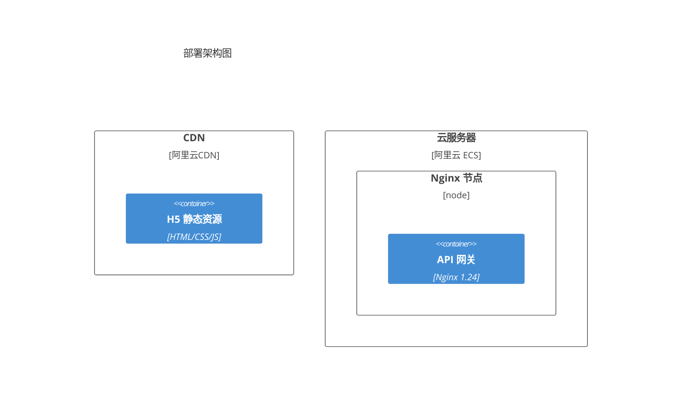
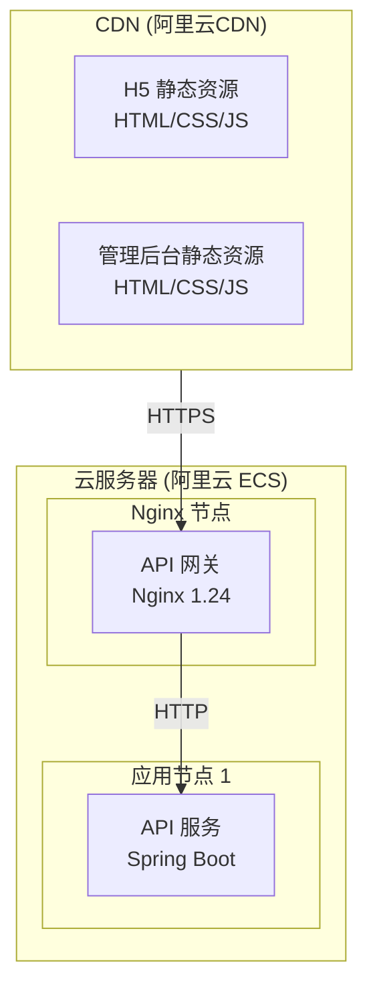

# Bug 经验库

本文档记录项目开发过程中遇到的 Bug 及解决方案，避免重复踩坑。

---

## 快速索引

| ID | 分类 | 关键词 | 简述 | 严重程度 |
|----|------|--------|------|----------|
| BUG-001 | Mermaid | C4Deployment, 语法错误 | C4Deployment 在 Mermaid 11.9.0 中不支持 | 中 |
| BUG-002 | Mermaid | xychart-beta, 中文 | xychart-beta 不支持中文字符 | 中 |

---

## BUG-001: C4Deployment 语法在 Mermaid 11.9.0 中支持有限

### 基本信息

| 字段 | 内容 |
|------|------|
| **ID** | BUG-001 |
| **分类** | Mermaid / 图表渲染 |
| **发现日期** | 2025-11-30 |
| **严重程度** | 中 |
| **状态** | 已解决 |

### 问题描述

在使用 Mermaid C4 模型的 `C4Deployment` 语法绘制部署架构图时，渲染失败。

**错误信息**：
```
ERROR: [Mermaid] undefined is not an object (evaluating 'r.x')
```

**问题代码**：


### 根因分析

Mermaid 11.9.0 版本对 C4 模型的支持有限：
- `C4Context`、`C4Container`、`C4Component` 基本可用
- `C4Deployment` 语法解析存在 Bug，导致渲染失败
- 嵌套的 `Deployment_Node` 处理异常

### 解决方案

使用标准的 `flowchart` 语法配合 `subgraph` 替代 `C4Deployment`：



### 最佳实践

1. **优先使用基础语法**：`flowchart` 比 C4 扩展语法兼容性更好
2. **使用 subgraph 表示层级**：可以清晰展示部署拓扑
3. **添加样式说明**：在 subgraph 标签中包含技术栈信息
4. **测试渲染**：在提交前先在本地预览 Mermaid 图表

### 相关文件

- `docs/v1.1/diagrams/架构设计图.md` - 第 6.1 节

---

## BUG-002: xychart-beta 不支持中文字符

### 基本信息

| 字段 | 内容 |
|------|------|
| **ID** | BUG-002 |
| **分类** | Mermaid / 图表渲染 |
| **发现日期** | 2025-11-30 |
| **严重程度** | 中 |
| **状态** | 已解决 |

### 问题描述

在使用 Mermaid 的 `xychart-beta` 语法绘制情绪曲线图时，中文字符导致解析失败。

**错误信息**：
```
ERROR: [Mermaid] Lexical error on line 3. Unrecognized text.
..."会员情绪曲线" x-axis [发现, 浏览, 填表, 支付, 进群,
```

**问题代码**：
```mermaid
xychart-beta
    title "会员情绪曲线"
    x-axis [发现, 浏览, 填表, 支付, 进群, 打卡, 坚持, 等待, 收到退款]
    y-axis "情绪评分" 1 --> 5
    line [5, 4, 3, 4, 5, 4, 3, 2, 5]
```

### 根因分析

Mermaid 11.9.0 的 `xychart-beta` 功能存在以下限制：
- x-axis 标签不支持中文字符
- title 中的中文可能导致解析异常
- 这是一个实验性功能（beta），稳定性不足

### 解决方案

使用 **Markdown 表格 + ASCII 艺术** 替代 xychart-beta：

```markdown
| 阶段 | 发现 | 浏览 | 填表 | 支付 | 进群 | 打卡 | 坚持 | 等待 | 收到退款 |
|------|:----:|:----:|:----:|:----:|:----:|:----:|:----:|:----:|:--------:|
| 情绪 | 😊 | 🙂 | 😐 | 🙂 | 😊 | 🙂 | 😐 | 😟 | 😊 |
| 评分 | 5 | 4 | 3 | 4 | 5 | 4 | 3 | 2 | 5 |

情绪曲线示意:

5 ●───────────────────●───────────────────────────────────●
  │                   │                                   │
4 │     ●─────────────┼───●───────────●                   │
  │    ╱              │    ╲         ╱ ╲                  │
3 │   ●               │     ╲       ●   ╲                 │
  │                   │      ╲           ╲                │
2 │                   │       ╲           ●               │
  │                   │                                   │
1 └───┴───┴───┴───┴───┴───┴───┴───┴───┴───┴───┴───┴───┴───┘
  发现 浏览 填表 支付 进群 打卡 坚持 等待 退款
```

### 替代方案对比

| 方案 | 优点 | 缺点 |
|------|------|------|
| xychart-beta | 自动渲染美观 | 不支持中文，Beta 不稳定 |
| Markdown 表格 | 兼容性100%，语义清晰 | 无法展示曲线趋势 |
| 表格 + ASCII | 兼容性好，可展示趋势 | 需要手工绘制 |
| 外部图片 | 完美展示 | 需要额外维护图片 |

### 最佳实践

1. **避免 beta 功能**：生产文档不使用实验性语法
2. **表格优先**：表格既清晰又兼容所有 Markdown 渲染器
3. **Emoji 增强**：使用表情符号直观表达情绪状态
4. **ASCII 补充**：需要展示趋势时可用 ASCII 艺术

### 相关文件

- `docs/v1.1/diagrams/用户旅程图.md` - 第 1.3 节

---

## 附录：Mermaid 兼容性速查

### 推荐使用的图表类型

| 类型 | 语法 | 中文支持 | 稳定性 |
|------|------|:--------:|:------:|
| 流程图 | `flowchart` | ✅ | ⭐⭐⭐ |
| 时序图 | `sequenceDiagram` | ✅ | ⭐⭐⭐ |
| 类图 | `classDiagram` | ✅ | ⭐⭐⭐ |
| 状态图 | `stateDiagram-v2` | ✅ | ⭐⭐⭐ |
| 甘特图 | `gantt` | ✅ | ⭐⭐⭐ |
| 饼图 | `pie` | ✅ | ⭐⭐⭐ |
| 用户旅程 | `journey` | ✅ | ⭐⭐ |
| C4 上下文 | `C4Context` | ✅ | ⭐⭐ |
| C4 容器 | `C4Container` | ✅ | ⭐⭐ |
| C4 组件 | `C4Component` | ✅ | ⭐⭐ |

### 谨慎使用的图表类型

| 类型 | 语法 | 问题 |
|------|------|------|
| C4 部署图 | `C4Deployment` | 嵌套节点解析失败 |
| XY 图表 | `xychart-beta` | 不支持中文 |
| Mindmap | `mindmap` | 复杂层级可能失败 |
| Timeline | `timeline` | Beta 功能 |

---

*最后更新：2025-11-30*
