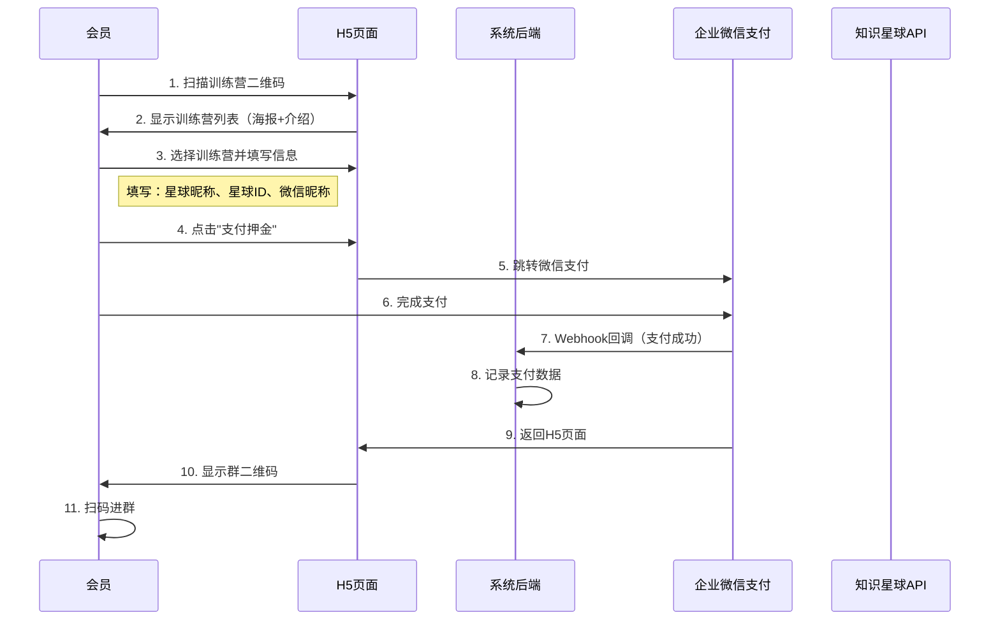
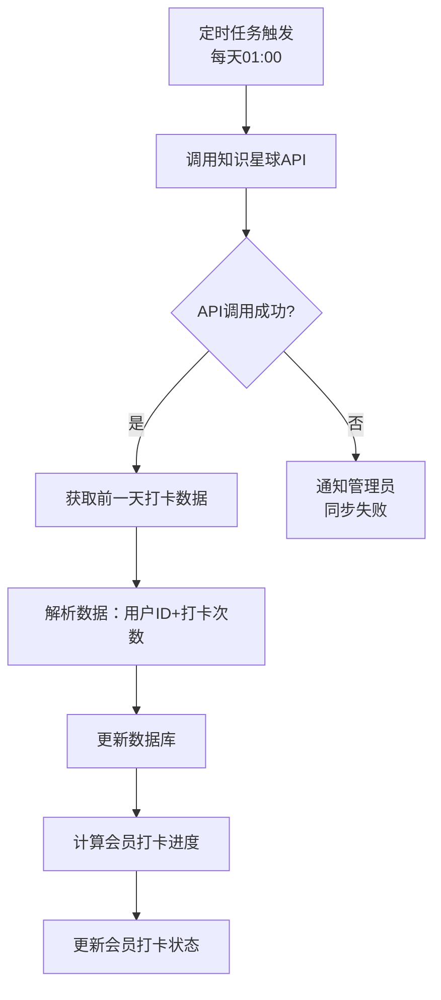
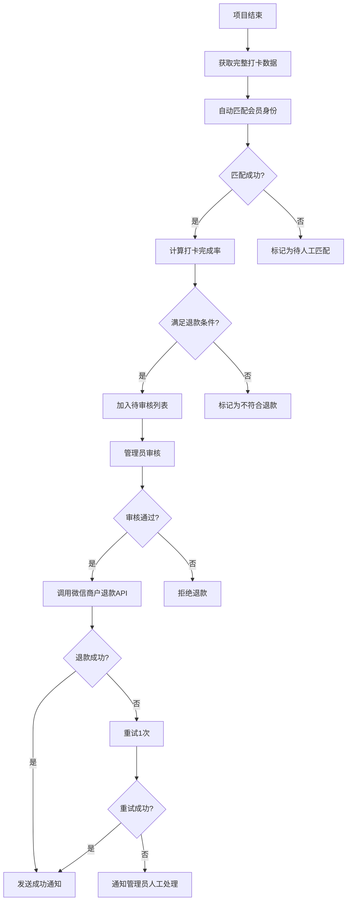
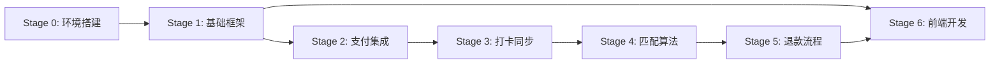

# 知识星球训练营自动押金退款系统 - 产品需求文档（PRD）

## 文档信息
- **项目名称**：知识星球训练营自动押金退款系统
- **文档版本**：v1.2
- **创建日期**：2025-10-24
- **最后更新**：2025-12-05
- **项目周期**：27天（6个Stage分阶段上线）
- **目标用户**：知识星球会员、训练营管理员、项目教练、志愿者

---

## 一、项目概述

### 1.1 项目背景
目前知识星球训练营的押金收取、打卡核对、退款操作全部手动完成，效率低且容易出错。每月有5-10个训练营同时进行，单个训练营最多1000人参与，人工处理工作量巨大。

### 1.2 项目目标
构建一套自动化系统，实现：
1. **自动化支付流程**：会员支付押金后立即获得入群二维码
2. **自动化数据同步**：每日自动同步知识星球打卡数据
3. **身份绑定验证**：支付记录与星球账号绑定，支持用户主动绑定和人工审核
4. **半自动退款**：系统判断 + 人工审核 + 自动退款
5. **数据统计分析**：训练营运营数据可视化

### 1.3 核心价值
- 减少90%的人工操作时间
- 提升退款准确率到100%
- 提升会员体验（支付即进群）
- 数据化管理训练营运营

---

## 二、用户角色与权限

### 2.1 角色定义

| 角色 | 描述 | 主要职责 |
|------|------|----------|
| **超级管理员** | 星主本人 | 所有权限，系统配置 |
| **管理员** | 运营人员 | 审核退款、查看报表、管理训练营 |
| **教练** | 项目教练 | 查看负责项目、催促打卡、参与审核 |
| **志愿者** | 项目志愿者 | 查看项目、催促打卡 |
| **会员** | 知识星球会员 | 支付押金、查看进度 |

### 2.2 权限矩阵

| 功能模块 | 超级管理员 | 管理员 | 教练 | 志愿者 | 会员 |
|---------|-----------|--------|------|--------|------|
| 训练营管理 | ✅ | ✅ | ❌ | ❌ | ❌ |
| 会员管理 | ✅ | ✅ | 查看负责项目 | 查看负责项目 | ❌ |
| 打卡管理 | ✅ | ✅ | 查看负责项目 | 查看负责项目 | ❌ |
| 退款审核 | ✅ | ✅ | ✅ | ❌ | ❌ |
| 统计报表 | ✅ | ✅ | 查看负责项目 | ❌ | ❌ |
| 系统配置 | ✅ | ❌ | ❌ | ❌ | ❌ |
| 用户管理 | ✅ | ❌ | ❌ | ❌ | ❌ |
| 会员端H5 | ❌ | ❌ | ❌ | ❌ | ✅ |

---

## 三、业务流程

### 3.1 会员报名支付流程



### 3.2 打卡数据同步流程



### 3.3 退款审核流程



---

## 四、功能需求详细说明

### 4.1 会员端（H5）

#### 4.1.1 训练营列表页
**入口**：扫描知识星球帖子中的二维码/链接

**页面元素**：
- 训练营卡片列表
  - 训练营海报（图片）
  - 训练营名称
  - 押金金额
  - 开始/结束日期
  - 打卡要求（如：10天7打卡）
  - 报名人数
  - "立即报名"按钮

**交互逻辑**：
- 点击卡片进入报名页
- 支持下拉刷新
- 显示"进行中"和"即将开始"的训练营

---

#### 4.1.2 报名支付页
**页面元素**：
- 训练营详情展示
  - 海报
  - 名称
  - 押金金额（醒目显示）
  - 日期和打卡要求
  - 项目介绍
- 信息填写表单
  - 星球昵称（必填）
  - 星球ID（必填，带说明：如何获取）
  - 微信昵称（必填）
- "支付押金"按钮

**交互逻辑**：
1. 表单校验：所有字段必填
2. 点击"支付押金"→ 跳转企业微信支付
3. 支付成功 → 返回H5页面显示群二维码
4. 支付失败 → 提示重试

**业务规则**：
- 同一会员（星球ID）同一训练营只能支付一次
- 重复支付时提示"您已报名"，显示群二维码

---

#### 4.1.3 群二维码展示页
**页面元素**：
- 支付成功提示
- 群二维码（大图）
- 提示文案："请扫码进群开始学习"
- "查看我的打卡进度"按钮

**交互逻辑**：
- 长按保存二维码
- 点击按钮进入打卡进度页

---

#### 4.1.4 打卡进度查询页
**页面元素**：
- 训练营信息卡片
  - 名称
  - 时间进度条（已进行X天/共Y天）
- 打卡统计
  - 已打卡天数 / 要求天数
  - 进度百分比
  - 是否满足退款条件（绿色✅ / 红色❌）
- 打卡记录列表
  - 日期 | 打卡时间 | 状态
- 退款状态
  - 待审核 / 审核中 / 已退款 / 不符合条件

**交互逻辑**：
- 实时显示最新打卡数据（每天01:00后更新）
- 支持下拉刷新

---

### 4.2 管理后台（Web）

#### 4.2.1 训练营管理

##### 4.2.1.1 训练营列表页
**页面布局**：
- 顶部筛选栏
  - 状态筛选：全部 / 未开始 / 进行中 / 已结束
  - 时间筛选：本月 / 上月 / 自定义
  - 搜索框：支持训练营名称搜索
- 操作按钮
  - "+ 创建训练营"
- 表格列
  - 训练营名称
  - 海报缩略图
  - 押金金额
  - 开始日期 | 结束日期
  - 打卡要求
  - 报名人数
  - 状态（未开始/进行中/已结束）
  - 操作（查看 / 编辑 / 生成二维码）

**交互逻辑**：
- 点击"生成二维码"→ 弹窗显示H5报名链接和二维码
- 点击"查看"→ 进入详情页
- 点击"编辑"→ 进入编辑页（只能编辑未开始的训练营）

---

##### 4.2.1.2 创建/编辑训练营页
**表单字段**：

| 字段 | 类型 | 必填 | 说明 |
|------|------|------|------|
| 训练营名称 | 文本 | ✅ | 最多50字 |
| 项目海报 | 图片上传 | ✅ | 支持jpg/png，最大2MB |
| 押金金额 | 数字 | ✅ | 单位：元 |
| 开始日期 | 日期选择 | ✅ | 不能早于今天 |
| 结束日期 | 日期选择 | ✅ | 必须晚于开始日期 |
| 打卡要求 | 组合输入 | ✅ | "总天数X天，要求Y天"<br/>Y≤X |
| 群二维码 | 图片上传 | ✅ | 支持jpg/png |
| 项目介绍 | 富文本编辑器 | ❌ | 最多500字 |
| 项目教练 | 多选下拉 | ✅ | 从用户列表选择 |
| 志愿者 | 多选下拉 | ❌ | 从用户列表选择 |
| 知识星球项目ID | 文本 | ✅ | 关联知识星球打卡项目 |
| 企业微信收款码ID | 文本 | ✅ | 用于识别支付记录 |

**交互逻辑**：
- 点击"保存"→ 创建训练营并生成H5链接
- 点击"保存并发布知识星球"→ 调用知识星球API创建打卡项目

---

##### 4.2.1.3 训练营详情页
**页面布局**：
- Tab切换：概览 / 报名列表 / 打卡情况 / 退款情况

**Tab1：概览**
- 训练营基本信息卡片
- 数据统计卡片
  - 报名人数
  - 支付金额总计
  - 平均打卡率
  - 退款金额总计
  - 退款完成率
- H5报名链接和二维码

**Tab2：报名列表**
- 表格列
  - 会员信息（星球昵称 / 星球ID / 微信昵称）
  - 支付时间
  - 支付金额
  - 匹配状态（已匹配 / 待匹配 / 匹配失败）
  - 进群状态（已进群 / 未进群）
  - 操作（手动匹配 / 标记进群）

**Tab3：打卡情况**
- 会员打卡统计表
  - 会员信息
  - 已打卡天数 / 要求天数
  - 完成率
  - 是否满足退款条件
  - 最后打卡时间

**Tab4：退款情况**
- 退款记录表
  - 会员信息
  - 打卡完成情况
  - 退款金额
  - 审核状态
  - 退款状态
  - 操作时间

---

#### 4.2.2 会员管理

##### 4.2.2.1 会员列表页
**页面布局**：
- 筛选栏
  - 训练营选择
  - 绑定状态：全部 / 已绑定 / 待绑定 / 待人工审核
  - 进群状态：全部 / 已进群 / 未进群
  - 搜索框：支持星球昵称/ID/微信昵称搜索
- 表格列
  - 星球昵称
  - 星球ID
  - 微信昵称
  - 训练营名称
  - 支付金额
  - 支付时间
  - 绑定状态
  - 绑定方式（H5绑定 / 用户填写 / 人工绑定）
  - 进群状态
  - 操作（查看详情 / 手动绑定 / 标记进群）

---

##### 4.2.2.2 会员详情页
**页面布局**：
- 会员基本信息卡片
  - 星球昵称 / 星球ID / 微信昵称
  - 绑定状态和绑定方式
  - 进群状态
- 支付记录
  - 时间 | 训练营 | 金额 | 订单号
- 打卡记录
  - 日期 | 时间 | 内容摘要
- 退款记录
  - 时间 | 金额 | 状态 | 操作人

**交互逻辑**：
- "手动绑定"按钮 → 弹窗选择正确的知识星球账号
- "标记进群"按钮 → 手动更新进群状态

---

#### 4.2.3 打卡管理

##### 4.2.3.1 打卡记录列表页
**页面布局**：
- 筛选栏
  - 训练营选择
  - 会员搜索
  - 日期范围
- 表格列
  - 会员信息
  - 训练营名称
  - 打卡日期
  - 打卡时间
  - 累计打卡次数
  - 完成率
  - 是否满足退款条件

---

##### 4.2.3.2 打卡进度统计页
**页面布局**：
- 训练营选择器
- 进度统计卡片
  - 总人数
  - 平均打卡率
  - 满足退款条件人数
- 会员打卡进度表
  - 会员信息
  - 打卡日历视图（✅已打卡 / ❌未打卡）
  - 已打卡天数 / 要求天数
  - 完成率

---

#### 4.2.4 退款审核

##### 4.2.4.1 待审核列表页
**页面布局**：
- 筛选栏
  - 训练营选择
  - 绑定状态筛选
- 批量操作按钮
  - "批量通过"
  - "批量拒绝"
- 表格列
  - 复选框
  - 会员信息（星球昵称 / 星球ID / 微信昵称）
  - 训练营名称
  - 支付金额
  - 打卡完成情况（X/Y天）
  - 绑定状态 / 绑定方式
  - 自动判断结果（✅符合 / ❌不符合）
  - 操作（通过 / 拒绝 / 查看详情）

**交互逻辑**：
1. 点击"通过"→ 确认弹窗 → 调用退款API
2. 点击"拒绝"→ 填写拒绝原因 → 记录日志
3. 批量操作 → 二次确认 → 逐条执行
4. 显示实时退款进度（处理中X条 / 成功Y条 / 失败Z条）

---

##### 4.2.4.2 退款记录页
**页面布局**：
- 筛选栏
  - 训练营选择
  - 退款状态：全部 / 已退款 / 退款失败 / 已拒绝
  - 时间范围
- 表格列
  - 会员信息
  - 训练营名称
  - 退款金额
  - 审核时间
  - 审核人
  - 退款状态
  - 失败原因（如有）
  - 操作（重试 / 查看详情）

**交互逻辑**：
- 退款失败的记录显示"重试"按钮
- 点击重试 → 再次调用退款API
- 记录每次操作的日志

---

#### 4.2.5 统计报表

##### 4.2.5.1 训练营报表页
**页面布局**：
- 时间选择器（本月 / 上月 / 自定义）
- 总体数据卡片
  - 训练营总数
  - 参与会员总数
  - 押金收入总额
  - 退款总额
  - 净收入
- 训练营明细表
  - 训练营名称
  - 报名人数
  - 参与率（报名/实际打卡人数）
  - 完成率（满足退款条件人数/报名人数）
  - 押金收入
  - 退款金额
  - 净收入
- 图表展示
  - 月度趋势图（参与人数、完成率）
  - 训练营对比图

---

##### 4.2.5.2 教练绩效报表页（暂不实现）
预留功能，未来可扩展：
- 教练负责的训练营数量
- 总参与人数
- 平均完成率

---

#### 4.2.6 系统管理

##### 4.2.6.1 用户管理页
**页面布局**：
- "+ 添加用户"按钮
- 表格列
  - 用户名
  - 角色（超级管理员/管理员/教练/志愿者）
  - 创建时间
  - 最后登录时间
  - 状态（启用/禁用）
  - 操作（编辑 / 删除 / 重置密码）

**交互逻辑**：
- 添加/编辑用户弹窗
  - 用户名（必填，唯一）
  - 密码（创建时必填）
  - 角色选择
  - 状态选择
- 重置密码 → 生成随机密码并显示

---

##### 4.2.6.2 系统配置页
**配置项**：

**知识星球配置**
- Cookie（文本框，加密存储）
- API接口测试按钮

**企业微信配置**
- 企业ID
- 应用Secret
- 支付商户号
- 支付密钥
- Webhook地址（只读，用于配置企业微信后台）
- API接口测试按钮

**通知配置**
- 企业微信应用消息开关
- 通知接收人（多选管理员）

---

##### 4.2.6.3 操作日志页
**页面布局**：
- 筛选栏
  - 操作人
  - 操作类型（创建训练营/修改会员/审核退款/手动匹配等）
  - 时间范围
- 表格列
  - 时间
  - 操作人
  - 操作类型
  - 操作对象（如：训练营名称、会员昵称）
  - 操作详情
  - IP地址

**记录的操作**：
- 创建/编辑/删除训练营
- 手动匹配会员
- 标记进群状态
- 审核通过/拒绝退款
- 手动重试退款
- 修改系统配置

---

## 五、非功能需求

### 5.1 性能要求
- H5页面首屏加载时间 < 2秒
- 管理后台页面响应时间 < 1秒
- 支付回调处理时间 < 3秒
- 单个训练营支持最多1000人同时报名
- 定时任务执行时间 < 5分钟

### 5.2 安全要求
- 所有API接口需要身份认证
- 接口防刷：同一IP每分钟最多请求100次
- 支付数据加密存储
- 敏感操作记录审计日志
- 管理后台使用HTTPS
- Cookie等敏感配置加密存储

### 5.3 可用性要求
- 系统可用性：12小时/天 × 7天/周
- 数据备份：每天自动备份数据库
- 日志保留：3个月

### 5.4 兼容性要求
- H5支持微信内置浏览器（Android/iOS）
- 管理后台支持Chrome/Edge/Safari最新版本
- 移动端适配（响应式设计）

---

## 六、接口集成说明

### 6.1 企业微信支付集成

#### 6.1.1 支付流程
1. 前端调用后端API获取支付参数
2. 跳转企业微信支付页面
3. 支付成功后，企业微信通过Webhook回调后端
4. 后端记录支付数据，并通知前端

#### 6.1.2 Webhook处理
- **接收参数**：订单号、支付金额、支付者信息、支付时间
- **处理逻辑**：
  1. 验证签名
  2. 查询订单是否存在
  3. 更新支付状态
  4. 触发后续流程（显示群二维码）

#### 6.1.3 退款流程
- 调用企业微信退款API
- 传入：订单号、退款金额
- 返回：退款状态
- 失败重试1次
- 仍失败则通知管理员

#### 6.1.4 定时轮询
- 每小时轮询企业微信支付记录接口
- 用于兜底：防止Webhook丢失
- 对比数据库，补录缺失的支付记录

---

### 6.2 知识星球API集成

#### 6.2.1 认证方式
- 使用Cookie认证
- Cookie配置在系统管理页面
- 定期检测Cookie有效性

#### 6.2.2 创建打卡项目（可选）
- **接口**：创建打卡项目
- **参数**：
  - 标题
  - 项目描述
  - 打卡天数
  - 开始时间
  - 结束时间
- **返回**：项目ID

#### 6.2.3 获取打卡数据
- **接口**：查询打卡记录
- **参数**：
  - 项目ID
  - 时间范围（可选）
- **返回**：
  - 用户列表（星球ID、星球昵称）
  - 每个用户的打卡次数
  - 每次打卡的时间

#### 6.2.4 定时同步
- 每天01:00执行定时任务
- 获取前一天的打卡数据
- 更新数据库
- 计算会员打卡进度

---

### 6.3 企业微信通知集成

#### 6.3.1 应用消息
- 用于通知管理员
- 消息类型：文本消息
- 通知场景：
  - 数据同步失败
  - 退款失败
  - 项目即将结束

#### 6.3.2 群机器人（退款通知）
- 在训练营群内发送退款成功通知
- 消息格式：
  ```
  【退款通知】
  恭喜 @XXX 完成训练营打卡，押金已退回！
  打卡天数：X/Y天
  退款金额：XX元
  ```

---

## 七、身份绑定方案

> **设计原则**：采用 H5 OAuth 绑定为主、用户填写为辅、人工兜底的方案，确保 100% 准确率。

### 7.1 三种绑定方式

| 绑定方式 | 覆盖率 | 准确率 | 实现方式 | 用户体验 |
|----------|--------|--------|----------|----------|
| **H5绑定** | 85% | 100% | H5 主路径：OAuth 登录后直接写入绑定关系 | 最佳（一步完成） |
| **用户填写** | 10% | 100% | 降级路径：支付成功后在 H5 页面补填星球信息 | 良好（两步完成） |
| **人工绑定** | 5% | 100% | 超时未绑定或信息异常时由管理员手动关联 | 需等待 |

### 7.2 绑定状态机（bind_status）

```
[支付成功] → [pending] → [completed] ← 用户主动绑定（h5_bindplanet / user_fill）
                 ↓
           [7天超时]
                 ↓
            [expired]
                 ↓
        [manual_review] → [completed] ← 人工绑定（manual）
                 ↓
           [无法匹配]
                 ↓
            [closed]
```

**状态说明**：

| 状态 | 编码 | 描述 |
|------|------|------|
| 待绑定 | `pending` | 支付成功后，等待用户绑定星球账号 |
| 已绑定 | `completed` | 绑定成功（任意方式） |
| 已过期 | `expired` | 超过7天未绑定 |
| 待人工审核 | `manual_review` | 绑定超时，需管理员处理 |
| 已关闭 | `closed` | 无法匹配，已关闭 |

### 7.3 绑定方式（bind_method）

| 方式 | 编码 | 触发场景 | 准确率 |
|------|------|----------|--------|
| H5绑定 | `h5_bindplanet` | H5 主路径：OAuth 登录后直接写入绑定关系 | 100% |
| 用户填写 | `user_fill` | 降级路径：支付成功后在 H5 页面补填星球信息 | 100% |
| 人工绑定 | `manual` | 超时未绑定或信息异常时由管理员手动关联 | 100% |

**NULL值含义**：未完成绑定（bind_status=pending/expired/manual_review时）

### 7.4 绑定流程

**退款名单生成时的处理逻辑**：

```
for each 合格用户:
    查询 payment_record.bind_status

    switch (bind_status):
        case COMPLETED:
            // 直接使用已绑定映射
            加入退款名单

        case PENDING:
            if (超过7天):
                更新为 EXPIRED → MANUAL_REVIEW
                等待管理员处理
            else:
                跳过，等待用户绑定

        case MANUAL_REVIEW:
            // 等待管理员人工绑定
            不加入退款名单

        case CLOSED:
            // 无法匹配，不退款
            不加入退款名单
```

### 7.5 人工介入场景

| 场景 | 触发条件 | 处理方式 |
|------|----------|----------|
| 绑定超时 | bind_status=pending 且超过7天 | 转入人工审核，管理员手动绑定 |
| 信息异常 | 用户填写的信息与星球记录不符 | 管理员核实后手动绑定或关闭 |
| 用户申诉 | 用户反馈绑定错误 | 管理员手动修正 |

---

## 八、异常处理和提醒机制

### 8.1 自动提醒规则

| 触发条件 | 提醒对象 | 提醒方式 | 提醒内容 |
|---------|---------|---------|---------|
| 支付成功后24小时未进群 | 会员 | 企业微信应用消息 | "您还未加入训练营群，请及时扫码进群" |
| 打卡数据同步失败 | 管理员 | 企业微信应用消息 | "知识星球数据同步失败，请检查配置" |
| 退款失败 | 管理员 | 企业微信应用消息 | "会员XXX退款失败，请人工处理" |
| 项目结束前1天 | 教练+会员 | 企业微信应用消息 | "训练营即将结束，请抓紧打卡" |
| 项目结束后 | 管理员 | 企业微信应用消息 | "训练营已结束，请审核退款" |

### 8.2 异常处理策略

| 异常类型 | 处理策略 |
|---------|---------|
| 企业微信支付API异常 | 定时轮询兜底 + 通知管理员 |
| 知识星球API异常 | 重试3次 + 标记失败 + 通知管理员 |
| 退款API异常 | 重试1次 + 失败则人工处理 |
| 数据库异常 | 日志记录 + 通知管理员 |
| Webhook签名验证失败 | 拒绝请求 + 记录日志 |

---

## 九、边界条件和业务规则

### 9.1 支付相关
- 同一会员（星球ID）同一训练营只能支付一次
- 重复支付时提示"已报名"，显示群二维码
- 支付金额必须严格等于训练营设定金额
- 支付后不允许退款（除非人工处理）

### 9.2 打卡相关
- 当天23:59前完成算当天打卡
- 无补卡机制
- 无请假机制
- 提交即算打卡成功（不审核质量）

### 9.3 退款相关
- 退款条件：打卡天数 ≥ 要求天数
- 必须人工审核通过才能退款
- 会员中途退群不影响退款判断（只看打卡数据）
- 临界情况（差1-2天）默认不退，有异议人工处理
- 匹配失败的会员不自动退款

### 9.4 训练营管理
- 已开始的训练营不能删除
- 未开始的训练营可以编辑
- 进行中的训练营不能修改核心参数（日期、打卡要求）
- 不考虑训练营延期或提前结束

### 9.5 数据保留
- 历史数据保留3个月
- 操作日志保留3个月
- 超过3个月的数据自动归档或删除

---

## 十、分阶段实施计划

> **开发模式**：AI 辅助敏捷开发（Vibe Coding）
> **总时长**：27 天（6 个 Stage + 集成测试）
> **原则**：每个迭代都能独立运行和测试

### Stage 0：环境搭建和项目骨架（3天）

**目标**：搭建可运行的前后端骨架，完成数据库初始化

**交付物**：
- 可运行的 Spring Boot 后端项目 + Knife4j API 文档
- Vue 3 + Vant H5 会员端骨架
- Vue 3 + Element Plus 管理后台骨架
- PostgreSQL 16 张表初始化脚本

**验收标准**：
- `./gradlew bootRun` 启动成功
- 访问 `/doc.html` 显示 API 文档
- `npm run dev` 前端项目正常启动

---

### Stage 1：基础框架 + 训练营 CRUD（4天）

**目标**：完成 JWT 认证和训练营管理功能

**功能范围**：
1. JWT 认证基础设施
   - 登录接口返回有效 Token
   - Spring Security 配置白名单
   - H5 公开接口无需 Token
2. 训练营 CRUD 接口
   - 创建、查询、更新、删除训练营
   - 发布训练营（生成 enrollUrl）
   - 训练营状态自动更新定时任务

**验收标准**：
- POST `/api/auth/login` 返回 Token
- 训练营 CRUD 接口通过 Postman 测试
- 分页查询正常工作

---

### Stage 2：支付集成（混合方案）（5天）

**目标**：完成企业微信支付集成，实现混合绑定方案

**功能范围**：
1. 企业微信支付 SDK 封装
   - 创建支付订单（支持 attach 参数）
   - 查询支付状态
   - 发起退款
2. 支付回调处理（Webhook）
   - 区分有/无 attach 两种场景
   - 幂等处理
   - 生成 accessToken
3. 用户绑定接口
   - H5 绑定页面
   - X-Access-Token 验证
4. 绑定超时定时任务
   - 检查 bind_status=pending 且超时的记录
   - 更新为 expired，转入人工审核流程（manual_review）

**验收标准**：
- H5 OAuth绑定（动态二维码）：bind_status=completed, bind_method=h5_bindplanet
- 降级路径（固定二维码）：bind_status=pending, bind_deadline=7天后
- 用户绑定成功后返回群二维码

---

### Stage 3：打卡同步（4天）

**目标**：实现知识星球打卡数据同步

**功能范围**：
1. 知识星球 API 封装
   - 获取打卡排行榜（自动翻页）
   - Cookie 过期告警
2. 定时同步任务
   - 每天 01:00 同步所有进行中训练营
   - 更新 camp_member.checkin_count
   - 计算 eligible_for_refund
3. 手动同步接口
   - 使用 Redis 分布式锁防止并发
   - 返回同步结果

**验收标准**：
- 打卡数据每天自动同步
- 手动同步接口正常工作
- Cookie 过期时发送告警通知

---

### Stage 4：混合匹配算法（3天）

**目标**：实现 bind_status 优先匹配 + 智能匹配

**功能范围**：
1. 混合匹配服务
   - bind_status=completed 直接使用，置信度 100%
   - bind_status=expired 启动智能匹配
   - Levenshtein 算法计算昵称相似度
2. 匹配管理接口
   - 查询待匹配会员列表
   - 手动匹配接口

**验收标准**：
- 已绑定用户匹配置信度 100%
- 智能匹配算法准确率 ≥ 70%
- 管理员可手动绑定匹配失败的用户

---

### Stage 5：退款流程（4天）

**目标**：完成退款名单生成、审核、执行、通知

**功能范围**：
1. 退款名单生成
   - 筛选 eligible_for_refund = true 的会员
   - 调用 MatchService 进行匹配
   - 创建 refund_record
2. 审核接口
   - 单个审核通过/拒绝
   - 批量审核（支持最低置信度阈值）
3. 退款执行
   - 调用微信退款 API
   - 失败自动重试（最多 3 次）
   - 超过重试次数标记为人工处理
4. 通知服务
   - 退款成功通知会员
   - 退款失败告警管理员

**验收标准**：
- 退款名单正确生成
- 批量审核功能正常
- 退款成功率 ≥ 99%
- 退款结果自动通知

---

### Stage 6：前端开发 + 系统管理（4天）

**目标**：完成 H5 会员端、Web 管理后台、统计报表

**功能范围**：
1. H5 会员端
   - 训练营列表和详情页
   - 支付后绑定页面
   - 群二维码展示页
   - 打卡进度查询页
2. Web 管理后台
   - 训练营管理
   - 会员管理
   - 退款审核（含批量审核）
   - 统计报表（ECharts 图表）
3. 系统管理
   - 用户管理
   - 配置管理
   - 操作日志

**验收标准**：
- 完整的用户权限管理
- 所有敏感操作有审计日志
- H5 支付到进群流程畅通

---

### Stage 依赖关系



---

## 十一、技术栈建议

### 11.1 前端技术栈
- **H5会员端**：Vue 3 + Vant（移动端UI组件库）
- **管理后台**：Vue 3 + Element Plus / Ant Design Vue
- **构建工具**：Vite
- **状态管理**：Pinia
- **HTTP客户端**：Axios

### 11.2 后端技术栈
- **语言**：Java（推荐Spring Boot）
- **框架**：Spring Boot + Spring Security + MyBatis Plus
- **数据库**：PostgreSQL（推荐）或 MySQL 8.0+
- **缓存**：Redis（用于防刷、会话管理）
- **任务调度**：Spring Scheduler 或 Quartz
- **API文档**：Swagger / Knife4j

### 11.3 部署方案
- **服务器**：腾讯云CVM
- **反向代理**：Nginx
- **HTTPS证书**：Let's Encrypt / 腾讯云SSL
- **域名**：已备案域名
- **数据库备份**：腾讯云自动备份

---

## 十二、验收标准

### 12.1 阶段一验收标准
- [ ] 会员可以扫码进入H5，选择训练营并完成支付
- [ ] 支付成功后立即显示群二维码
- [ ] 管理员可以创建训练营并生成报名链接
- [ ] 企业微信支付Webhook正常工作
- [ ] 知识星球打卡数据每天自动同步
- [ ] 自动匹配算法准确率 ≥ 80%
- [ ] 管理员可以审核并执行退款
- [ ] 退款成功率 ≥ 95%

### 12.2 阶段二验收标准
- [ ] 管理员可以查看训练营报表
- [ ] 会员可以在H5查看自己的打卡进度
- [ ] 关键事件自动发送企业微信通知
- [ ] 退款成功后自动通知会员

### 12.3 阶段三验收标准
- [ ] 完整的用户权限管理
- [ ] 所有敏感操作有审计日志
- [ ] 接口防刷机制正常工作
- [ ] 系统可用性达到12×7小时

---

## 十三、风险和应对

### 13.1 技术风险

| 风险 | 影响 | 应对措施 |
|------|------|---------|
| 知识星球API限制或变更 | 高 | 定时任务降低调用频率；准备降级方案（手动导出） |
| 企业微信支付Webhook丢失 | 中 | 定时轮询兜底 |
| 数据匹配准确率低 | 中 | 人工审核机制；优化匹配算法 |
| 并发支付冲突 | 低 | 数据库锁机制；幂等性设计 |

### 13.2 业务风险

| 风险 | 影响 | 应对措施 |
|------|------|---------|
| 会员填写错误信息 | 中 | 前端校验；人工修正机制 |
| 会员恶意刷单 | 低 | 限制同一星球ID只能报名一次 |
| 退款纠纷 | 中 | 完整的日志和证据链；人工处理机制 |

---

## 十四、未来扩展规划

### 14.1 短期扩展（3-6个月）
- 支持微信支付和支付宝支付
- 教练绩效报表
- 会员标签和分组
- 自动催促打卡功能

### 14.2 长期扩展（6-12个月）
- 多知识星球管理
- 积分激励体系
- 数据分析和预测
- 移动端App

---

## 附录

### 附录A：术语表

#### 基础术语

| 术语 | 解释 |
|------|------|
| **知识星球** | 知识付费社群平台，用户在此打卡学习 |
| **训练营** | 限时打卡活动，会员缴纳押金参与 |
| **押金** | 会员报名时缴纳的保证金，完成打卡后退还 |
| **打卡** | 会员在知识星球发布学习内容的行为 |
| **星球ID** | 知识星球为每个用户生成的唯一标识（planet_user_id） |
| **星球昵称** | 用户在知识星球的显示名称 |

#### 绑定方案术语

| 术语 | 解释 |
|------|------|
| **支付映射** | 支付记录与知识星球用户的关联关系，存储在 payment_record 表 |
| **宽限天数** | 打卡天数计算时额外给予的宽限（默认1天），实际打卡天数 = API返回天数 + GRACE_DAYS |

#### 绑定状态（bind_status）

| 状态 | 编码 | 描述 |
|------|------|------|
| 待绑定 | `pending` | 支付成功后，等待用户绑定星球账号 |
| 已绑定 | `completed` | 绑定成功（任意方式） |
| 已过期 | `expired` | 超过7天未绑定 |
| 待人工审核 | `manual_review` | 绑定超时，需管理员处理 |
| 已关闭 | `closed` | 无法匹配，已关闭 |

#### 绑定方式（bind_method）

| 方式 | 编码 | 触发场景 | 准确率 |
|------|------|----------|--------|
| H5绑定 | `h5_bindplanet` | H5 主路径：OAuth 登录后直接写入绑定关系 | 100% |
| 用户填写 | `user_fill` | 降级路径：支付成功后在 H5 页面补填星球信息 | 100% |
| 人工绑定 | `manual` | 超时未绑定或信息异常时由管理员手动关联 | 100% |

#### H5 访问票据（accessToken）

| 属性 | 值 |
|------|-----|
| 格式 | UUID v4（128位随机），前缀 `tk_` |
| 有效期 | 训练营结束后 7 天（动态计算，覆盖整个训练营周期） |
| 绑定关系 | 1 票据 : 1 订单 |
| 存储位置 | Redis（`access_token:{token}` → `{orderNo, status, campEndDate}`） |
| 状态 | active（有效）→ bound（已绑定）→ expired（过期） |

#### 技术术语

| 术语 | 解释 |
|------|------|
| **Webhook** | 企业微信支付结果的异步回调通知 |
| **幂等处理** | 确保同一请求多次执行结果一致，防止重复处理 |
| **分布式锁** | Redis 实现的并发控制机制，防止定时任务重复执行 |
| **OAuth** | 开放授权协议，用于 H5 端获取知识星球用户身份 |

### 附录B：参考资料
- 企业微信支付API文档
- 知识星球API文档（待补充）
- Spring Boot官方文档
- PostgreSQL官方文档

---

**文档结束**
