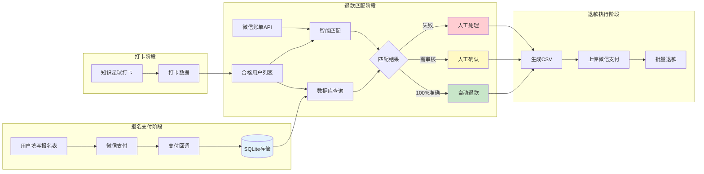
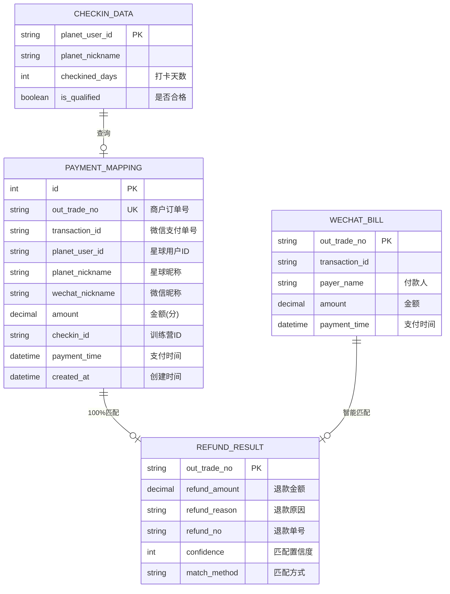
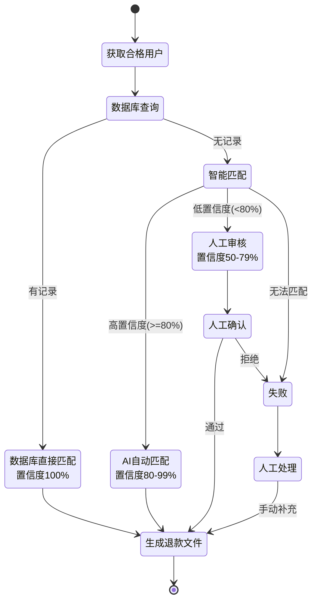
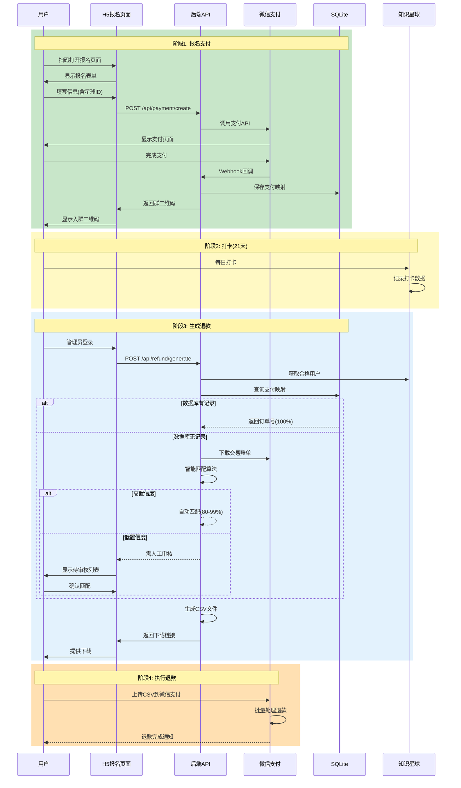
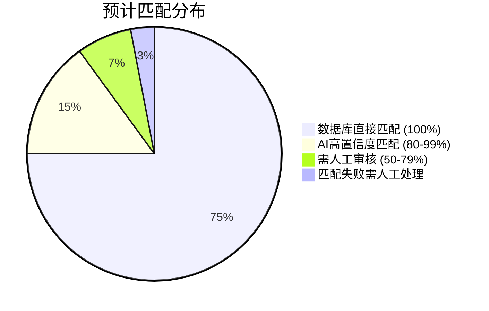

# v0.2 用户旅程图

本文档展示 v0.2 版本从报名支付到退款的完整用户旅程，以及混合方案的数据流转关系。

## 📋 目录

- [完整用户旅程流程](#完整用户旅程流程)
- [数据流转关系图](#数据流转关系图)
- [数据存储结构](#数据存储结构)
- [三种匹配场景](#三种匹配场景)
- [前端交互时序图](#前端交互时序图)
- [管理后台界面设计](#管理后台界面设计)
- [匹配成功率预估](#匹配成功率预估)

---

## 完整用户旅程流程

从用户扫码报名到最终退款到账的完整流程：

```mermaid
graph TB
    Start([用户扫码报名]) --> A[填写报名信息]
    A --> B{是否填写星球ID?}

    B -->|是| C1[报名表单<br/>- 姓名<br/>- 手机号<br/>- 星球ID ✓<br/>- 星球昵称]
    B -->|否| C2[报名表单<br/>- 姓名<br/>- 手机号<br/>- 微信昵称]

    C1 --> D[发起微信支付]
    C2 --> D

    D --> E[企业微信支付页面<br/>金额: 99元]
    E --> F{支付成功?}

    F -->|失败| G[支付失败页面]
    F -->|成功| H[微信支付回调]

    H --> I[Webhook 接收回调数据]

    I --> J[保存支付映射<br/>💾 SQLite Database]

    J --> K[(payment_mapping表)]
    K --> K1[商户订单号<br/>微信支付单号<br/>星球用户ID<br/>星球昵称<br/>微信昵称<br/>金额<br/>训练营ID]

    J --> L[显示群二维码]
    L --> M[用户扫码进群]
    M --> N[开始打卡]

    N --> O[每日打卡<br/>知识星球]
    O --> P[21天后训练营结束]

    P --> Q[管理员生成退款名单]

    Q --> R[Step 1: 获取合格用户列表<br/>知识星球API]

    R --> S{用户是否合格?<br/>打卡天数 >= 要求}

    S -->|不合格| T[不退款名单]
    S -->|合格| U[Step 2: 查询支付映射<br/>SQLite Database]

    U --> V{数据库有记录?}

    V -->|有| W[✅ 自动匹配成功<br/>置信度: 100%]
    V -->|无| X[Step 3: 智能匹配算法]

    X --> Y[从微信支付API<br/>下载交易账单]
    Y --> Z[多维度匹配算法]

    Z --> Z1[1. 昵称匹配<br/>权重: 60%]
    Z --> Z2[2. 时间匹配<br/>权重: 20%]
    Z --> Z3[3. 金额匹配<br/>权重: 20%]

    Z1 --> AA{置信度评分}
    Z2 --> AA
    Z3 --> AA

    AA -->|>= 80分| AB[⚠️ AI匹配成功<br/>置信度: 80-99%]
    AA -->|50-79分| AC[⚠️ 需人工审核<br/>置信度: 50-79%]
    AA -->|< 50分| AD[❌ 匹配失败<br/>需人工处理]

    W --> AE[汇总所有匹配结果]
    AB --> AE
    AC --> AF[人工审核界面]

    AF --> AG{审核通过?}
    AG -->|通过| AE
    AG -->|拒绝| AD

    AE --> AH[生成退款CSV文件]

    AH --> AI[CSV格式:<br/>商户订单号,退款金额,退款原因,退款单号]

    AI --> AJ[管理员下载CSV]

    AJ --> AK[上传到微信支付<br/>批量退款页面]

    AK --> AL[微信支付处理退款]

    AL --> AM{退款成功?}

    AM -->|成功| AN[✅ 退款到账<br/>用户收到通知]
    AM -->|失败| AO[❌ 退款失败<br/>人工处理]

    AD --> AP[人工匹配工具]
    AP --> AQ[手动输入订单号]
    AQ --> AE

    style Start fill:#e1f5e1
    style AN fill:#e1f5e1
    style W fill:#c8e6c9
    style AB fill:#fff9c4
    style AC fill:#ffe0b2
    style AD fill:#ffcdd2
    style AO fill:#ffcdd2
    style K fill:#e3f2fd
    style J fill:#e3f2fd

    classDef database fill:#e3f2fd,stroke:#1976d2,stroke-width:2px
    classDef success fill:#c8e6c9,stroke:#388e3c,stroke-width:2px
    classDef warning fill:#fff9c4,stroke:#f57c00,stroke-width:2px
    classDef error fill:#ffcdd2,stroke:#d32f2f,stroke-width:2px

    class K,J database
    class W,AN success
    class AB,AC warning
    class AD,AO error
```



### 🎯 关键节点说明

| 节点 | 说明 | 数据来源 | 置信度 |
|------|------|---------|--------|
| **支付映射保存** | Webhook 回调时保存订单与用户映射 | 微信支付 + 用户填写 | - |
| **数据库直接匹配** | 从 SQLite 查询已保存的映射关系 | SQLite | 100% |
| **智能匹配算法** | 多维度算法自动匹配订单与用户 | 微信账单 API | 50-99% |
| **人工审核** | 低置信度结果需管理员确认 | 人工判断 | 100% (审核后) |
| **生成 CSV** | 生成符合微信批量退款格式的文件 | 汇总所有匹配结果 | - |

---

## 数据流转关系图

展示四个阶段的数据流转关系：



### 阶段说明

#### 阶段 1: 报名支付
- 用户填写报名信息（可选填知识星球 ID）
- 完成微信支付
- Webhook 回调保存映射关系到 SQLite

#### 阶段 2: 打卡
- 用户在知识星球每日打卡
- 打卡数据由知识星球 API 提供

#### 阶段 3: 退款匹配
- 从知识星球获取合格用户列表
- 优先从数据库查询映射关系（100% 准确）
- 数据库无记录则调用智能匹配算法
- 低置信度结果需人工审核

#### 阶段 4: 退款执行
- 汇总所有匹配结果
- 生成 CSV 文件
- 管理员上传到微信支付后台
- 微信处理批量退款

---

## 数据存储结构

核心数据库表和数据关系：



### 数据说明

**PAYMENT_MAPPING (支付映射表)**
- 核心表，存储支付订单与用户的映射关系
- 由支付回调时自动创建
- 提供 100% 准确的匹配数据

**CHECKIN_DATA (打卡数据)**
- 运行时数据，从知识星球 API 获取
- 不持久化存储（v0.2 特性）
- 用于判断用户是否合格退款

**WECHAT_BILL (微信账单)**
- 运行时数据，从微信支付 API 获取
- 用于智能匹配算法的数据源
- 包含所有支付订单信息

**REFUND_RESULT (退款结果)**
- 运行时数据，生成 CSV 时产生
- 记录匹配置信度和方式
- 最终输出为 CSV 文件

---

## 三种匹配场景

状态机展示三种不同的匹配场景及其流转：



### 场景详解

#### 场景 1: 数据库直接匹配 (75% 用户)
- **触发条件**: 用户报名时填写了星球 ID，且支付成功
- **匹配方式**: 直接从 SQLite 查询
- **置信度**: 100%
- **优势**: 最快、最准确

#### 场景 2: AI 自动匹配 (15% 用户)
- **触发条件**: 数据库无记录，但昵称高度相似
- **匹配方式**: 多维度算法评分
- **置信度**: 80-99%
- **优势**: 自动化处理，无需人工介入

#### 场景 3: 人工审核 (7% 用户)
- **触发条件**: AI 匹配置信度 50-79%
- **匹配方式**: 管理员人工确认
- **置信度**: 审核后 100%
- **优势**: 保证准确性

#### 场景 4: 匹配失败 (3% 用户)
- **触发条件**: 无法找到任何匹配记录
- **处理方式**: 人工工具手动输入订单号
- **原因**: 用户未支付、支付失败、或数据缺失

---

## 前端交互时序图

完整的前后端交互时序：



---

## 管理后台界面设计

### 主界面 - 退款名单管理

```
┌─────────────────────────────────────────────────────────────┐
│  训练营退款管理 - 第42期早起打卡营                            │
├─────────────────────────────────────────────────────────────┤
│                                                               │
│  📊 统计概览                                                  │
│  ┌──────────┬──────────┬──────────┬──────────┐              │
│  │ 总报名   │ 合格人数 │ 自动匹配 │ 需审核   │              │
│  │   99人   │   85人   │   78人   │   5人    │              │
│  └──────────┴──────────┴──────────┴──────────┘              │
│                                                               │
│  🔍 退款名单 (已匹配 83/85)                                   │
│  ┌────────────────────────────────────────────────────┐     │
│  │ 筛选: [全部] [已匹配] [待审核] [匹配失败]          │     │
│  └────────────────────────────────────────────────────┘     │
│                                                               │
│  ┌─┬──────┬─────────┬──────┬──────┬──────┬────────┐        │
│  │✓│昵称  │星球ID   │打卡  │金额  │置信度│操作    │        │
│  ├─┼──────┼─────────┼──────┼──────┼──────┼────────┤        │
│  │✓│球球  │88455815 │ 18天 │99元  │ 100% │[详情]  │ 🟢    │
│  │✓│Aaron │88123456 │ 21天 │99元  │ 100% │[详情]  │ 🟢    │
│  │⚠│小明  │88888888 │ 15天 │99元  │  65% │[审核]  │ 🟡    │
│  │⚠│张三  │88999999 │ 19天 │99元  │  55% │[审核]  │ 🟡    │
│  │✗│李四  │88777777 │ 20天 │  -   │   0% │[手动]  │ 🔴    │
│  └─┴──────┴─────────┴──────┴──────┴──────┴────────┘        │
│                                                               │
│  [生成退款文件 CSV] [导出Excel报表]                          │
│                                                               │
└─────────────────────────────────────────────────────────────┘
```

### 审核弹窗 - 待审核详情

```
┌─────────────────────────────────────────────┐
│  🔍 匹配审核 - 小明                          │
├─────────────────────────────────────────────┤
│  知识星球信息:                               │
│  昵称: 小明                                  │
│  ID: 88888888                                │
│  打卡: 15天 ✓                                │
│                                              │
│  匹配到的支付记录:                           │
│  付款人: 小明同学                            │
│  订单号: T6602J-0P263Y7-32OM                │
│  金额: 99.00元                               │
│  支付时间: 2025-11-01 08:30:15              │
│  置信度: 65% (昵称部分匹配)                  │
│                                              │
│  [✓ 确认匹配]  [✗ 拒绝]  [手动输入订单号]   │
└─────────────────────────────────────────────┘
```

### 统计报表页面

```
┌─────────────────────────────────────────────────────────────┐
│  📊 退款统计报表                                             │
├─────────────────────────────────────────────────────────────┤
│                                                               │
│  匹配方式分布:                                                │
│  ┌────────────────────────────────────┐                     │
│  │ ████████████████ 75%  数据库匹配   │                     │
│  │ ████ 15%  AI智能匹配               │                     │
│  │ ██ 7%   人工审核                   │                     │
│  │ █ 3%    匹配失败                   │                     │
│  └────────────────────────────────────┘                     │
│                                                               │
│  处理效率:                                                    │
│  - 自动化率: 90% (无需人工)                                  │
│  - 人工介入: 10% (需审核或手动)                              │
│  - 平均处理时间: 2.5 分钟/100人                              │
│                                                               │
│  退款金额统计:                                                │
│  - 总退款金额: ¥8,415.00                                     │
│  - 已处理: ¥7,722.00                                         │
│  - 待处理: ¥693.00                                           │
│                                                               │
└─────────────────────────────────────────────────────────────┘
```

---

## 匹配成功率预估

基于混合方案的预期匹配分布：



### 数据说明

| 匹配方式 | 占比 | 置信度 | 处理方式 | 预计时间 |
|---------|------|--------|---------|---------|
| 数据库直接匹配 | 75% | 100% | 自动 | < 1秒 |
| AI 高置信度匹配 | 15% | 80-99% | 自动 | 2-3秒 |
| 需人工审核 | 7% | 50-79% | 人工 | 1-2分钟 |
| 匹配失败 | 3% | 0% | 人工 | 3-5分钟 |

### 效率分析

- **自动化率**: 90% (数据库 + AI 匹配)
- **人工介入率**: 10% (审核 + 失败处理)
- **预计总处理时间**: 100 人约 2.5 分钟

---

## 💡 关键优势

### 三重保障机制

```
第一层: 数据库直接匹配 (最准确)
    ↓ 失败
第二层: AI 智能匹配 (自动化)
    ↓ 低置信度
第三层: 人工审核 (兜底)
```

### 核心优势

1. **高准确性**: 数据库匹配 100% 准确
2. **高自动化**: 90%+ 无需人工介入
3. **可追溯**: 每笔退款都有置信度记录
4. **容错机制**: 支持人工介入和修正
5. **审计友好**: 完整的匹配过程记录

---

## 📝 使用说明

### 管理员操作流程

1. **训练营结束后**
   - 登录管理后台
   - 选择对应训练营
   - 设置完成要求天数（如 7 天）

2. **生成退款名单**
   - 点击"生成退款名单"
   - 系统自动匹配订单
   - 查看统计结果

3. **处理待审核项**
   - 查看需人工审核的列表
   - 逐一确认匹配关系
   - 通过或拒绝匹配

4. **下载 CSV 文件**
   - 所有匹配完成后
   - 下载退款 CSV 文件
   - 上传到微信支付后台

5. **执行批量退款**
   - 在微信支付后台
   - 上传 CSV 文件
   - 确认并执行退款

### 异常处理

**场景 1: 用户未支付就打卡了**
- 系统标记为"匹配失败"
- 管理员确认是否需要退款
- 如需退款，手动输入订单号

**场景 2: AI 匹配置信度太低**
- 系统自动推送到待审核列表
- 管理员查看匹配详情
- 确认是否为同一用户

**场景 3: 数据库记录错误**
- 支持管理员手动修正
- 记录修正日志
- 审计时可追溯

---

## 🔗 相关文档

- [README.md](17-v0.2-版本说明.md) - v0.2 版本概述
- [混合方案技术设计.md](19-v0.2-混合方案技术设计.md) - 详细技术方案
- [数据库设计.md](./数据库设计.md) - SQLite 表结构设计
- [智能匹配算法.md](./智能匹配算法.md) - 匹配算法详解