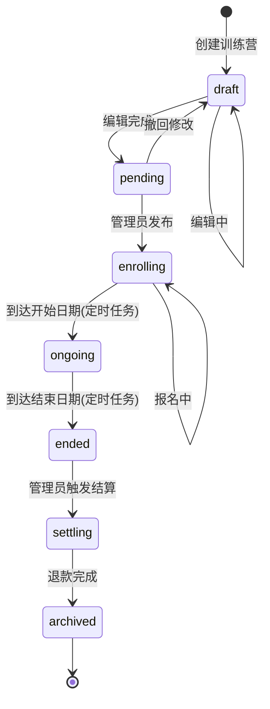
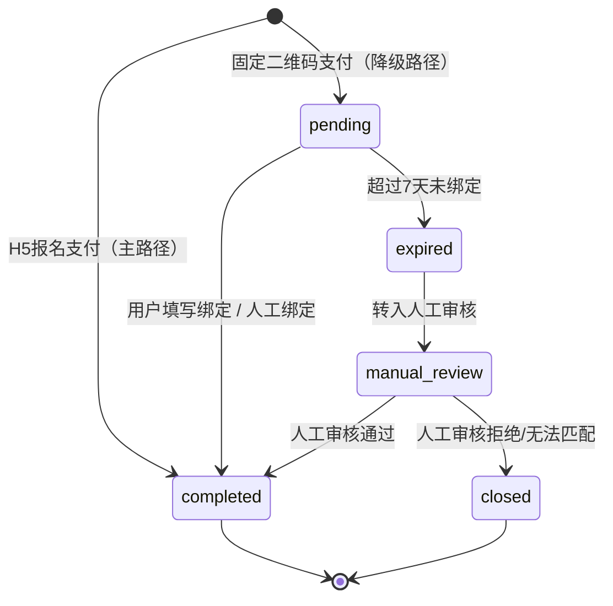
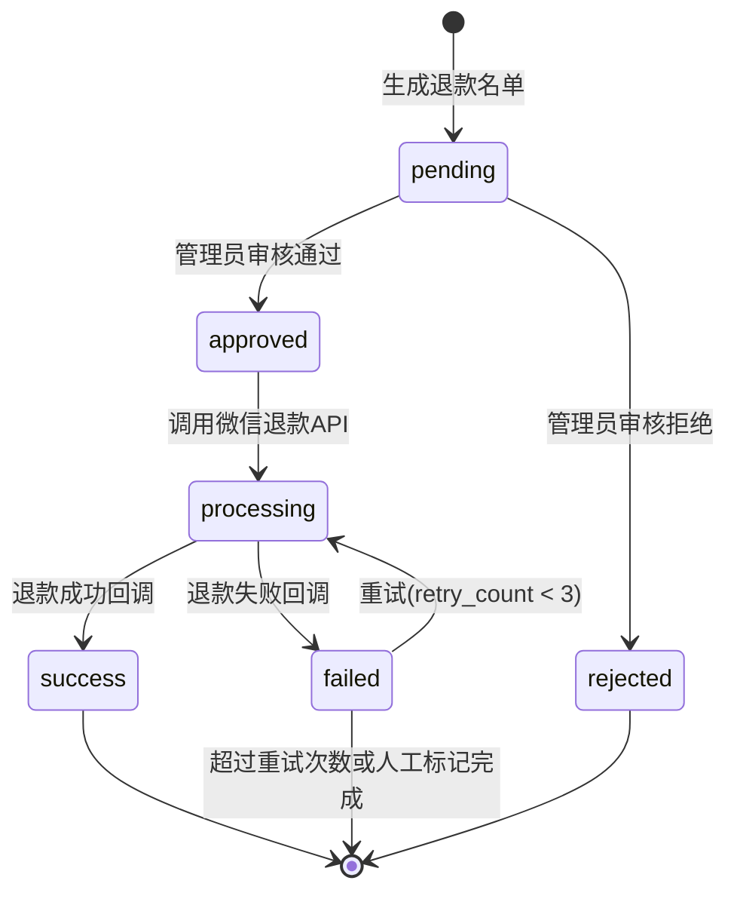
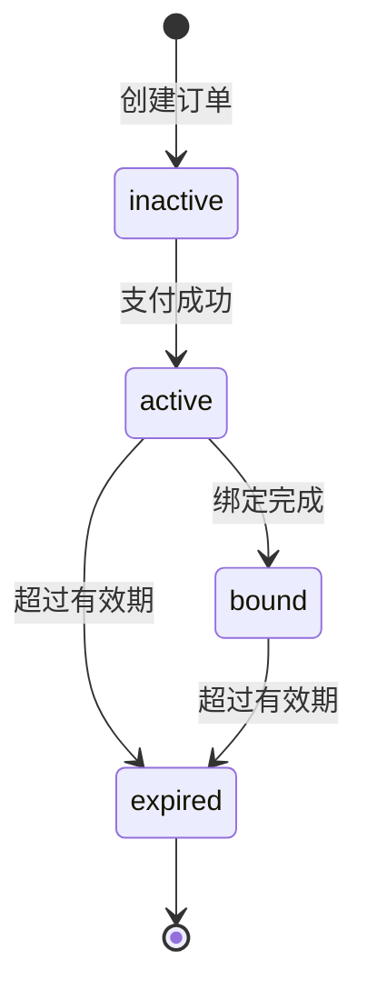

# AutoDepositRefundAgent - Epic Breakdown

**Author:** yian
**Date:** 2025-12-13
**Project Level:** expert
**Target Scale:** 知识星球训练营自动押金退款系统

---

## Overview

This document provides the complete epic and story breakdown for AutoDepositRefundAgent, decomposing the requirements from the [PRD](./PRD.md) into implementable stories.

**Living Document Notice:** This is the initial version. It will be updated after UX Design and Architecture workflows add interaction and technical details to stories.

---

## Document Information

### Document Hierarchy

本文档用于将 `docs/PRD.md` 的功能需求拆解为可实施的 Epic/Story，并与 `docs/v1/` 的 SSOT（状态枚举、数据库、接口）保持一致。
如本文档与 SSOT 文档冲突，以 SSOT 文档为准；`docs/v1/user-stories/` 作为详细用户故事与验收标准的参考来源保留。

| 层级 | 文档位置 | 说明 |
|------|---------|------|
| PRD | `docs/PRD.md` | 产品需求文档 |
| **Epics & Stories** | **本文档** | Epic/Story 实施拆解与覆盖追踪 |
| User Stories | `docs/v1/user-stories/` | 详细用户故事（验收标准/边界条件） |
| 技术设计 | `docs/v1/design/` | 数据库、API、状态枚举等 |
| 接口文档 | `docs/v1/api/接口文档.md` | REST API 定义 |
| 实施指南 | `docs/v1/guides/` | 开发计划、运维指南 |

### SSOT References

本文档遵循单一数据源（SSOT）原则，以下内容引用外部文档：

| 内容 | 唯一定义位置 |
|------|-------------|
| 状态枚举值 | [`docs/v1/design/状态枚举定义.md`](./v1/design/状态枚举定义.md) |
| 数据库表结构 | [`docs/v1/design/数据库设计.md`](./v1/design/数据库设计.md) |
| API 规范 | [`docs/v1/design/API设计规范.md`](./v1/design/API设计规范.md) |
| API 接口清单 | [`docs/v1/api/接口文档.md`](./v1/api/接口文档.md) |
| 通知模板 | [`docs/v1/design/通知消息模板.md`](./v1/design/通知消息模板.md) |
| 监控指标 | [`docs/v1/guides/ops-监控指标体系.md`](./v1/guides/ops-监控指标体系.md) |

### Related Design Decisions

关键设计决策记录在归档文档中：

- **垂直切片优先** - Stage 1 优先实现支付闭环，详见 [`docs/v1/archive/优化完成总结.md`](./v1/archive/优化完成总结.md)
- **accessToken 机制** - `tk_` + UUID 格式，存储于 Redis，有效期至训练营结束 + 7天
- **智能匹配已移除** - 所有 bind_method 置信度均为 100%，无 Levenshtein 算法

---

## Functional Requirements Inventory

> **提取来源**: [PRD.md](./PRD.md) v1.3
> **提取日期**: 2025-12-13
> **总计**: 12个功能模块, 65个具体功能需求

### FR1: 训练营管理 (Training Camp Management)
- **FR1.1**: 创建训练营 - 填写名称、上传海报、设置押金金额、配置日期、定义打卡要求、上传群二维码、分配教练和志愿者
- **FR1.2**: 编辑训练营 - 仅允许编辑未开始的训练营,已开始的不可修改核心参数
- **FR1.3**: 删除训练营 - 已开始的训练营不可删除,仅草稿状态可删除
- **FR1.4**: 发布训练营 - 生成H5报名链接和二维码供会员扫码报名
- **FR1.5**: 训练营列表查询 - 支持分页、按状态筛选、按时间范围筛选、关键词搜索
- **FR1.6**: 训练营详情查看 - 展示概览数据、报名列表、打卡情况、退款情况四个Tab
- **FR1.7**: 训练营状态自动更新 - 定时任务根据日期自动推进状态 (enrolling→ongoing→ended)，其他状态由管理员操作或结算流程驱动（见SSOT）

### FR2: 会员报名与支付 (Member Enrollment & Payment)
- **FR2.1**: H5训练营列表展示 - 卡片式布局,显示海报/名称/金额/日期/打卡要求/报名人数
- **FR2.2**: H5报名信息填写 - 会员填写星球昵称、星球ID、微信昵称 (支持表单校验)
- **FR2.3**: 微信OAuth获取OpenID - 通过微信公众号授权获取用户唯一标识
- **FR2.4**: 创建支付订单 - 调用微信支付统一下单接口 (JSAPI支付)
- **FR2.5**: 微信支付Webhook回调处理 - 接收支付结果通知,验证签名,幂等性处理,记录支付数据
- **FR2.6**: 支付后显示群二维码 - 支付成功后立即展示训练营群二维码和入群提示
- **FR2.7**: 重复报名检测 - 同一星球ID对同一训练营只能支付一次,重复支付时提示"您已报名"
- **FR2.8**: 支付轮询兜底 - 定时任务每小时轮询微信支付记录,补录缺失的支付回调

### FR3: 支付身份绑定 (Payment Identity Binding)
- **FR3.1**: H5主路径绑定 - OAuth登录后直接写入微信OpenID与星球用户的绑定关系 (bind_method=h5_bindplanet)
- **FR3.2**: 降级路径-用户填写绑定 - 固定二维码支付用户在H5页面补填星球昵称和ID完成绑定 (bind_method=user_fill)
- **FR3.3**: 绑定超时检查 - 定时任务检查bind_status=pending且超过7天的记录,自动转为expired→manual_review
- **FR3.4**: 人工绑定 - 管理员在后台手动关联支付记录与星球用户 (bind_method=manual)
- **FR3.5**: 绑定状态查询 - 会员在H5查看绑定状态,管理员在后台查看所有会员绑定情况
- **FR3.6**: 访问票据(accessToken)管理 - 生成、验证、状态更新 (inactive→active→bound→expired)、定时清理过期票据

### FR4: 打卡数据同步 (Check-in Data Sync)
- **FR4.1**: 知识星球API集成 - 使用zsxq-sdk调用知识星球API获取打卡排行榜数据
- **FR4.2**: 定时同步任务 - 每天01:00自动同步所有进行中训练营的打卡数据
- **FR4.3**: 手动同步触发 - 管理员可手动触发同步,使用Redis分布式锁防止并发
- **FR4.4**: 打卡数据解析 - 解析API返回的用户ID、昵称、打卡次数,更新数据库统计
- **FR4.5**: 打卡进度计算 - 计算会员打卡完成率,判断是否满足退款条件 (eligible_for_refund)
- **FR4.6**: Cookie过期告警 - 检测知识星球Token过期 (TokenExpiredException),发送企业微信告警通知管理员

### FR5: 身份匹配 (Identity Matching)

> **注意**: 智能匹配方案已废弃，所有 bind_method 置信度均为 100%。详见[决策记录](#决策2-移除智能匹配方案)。

- **FR5.1**: 直接匹配 - bind_status=completed 的记录直接使用绑定信息 (置信度100%)
- **FR5.2**: 待匹配会员列表 - 筛选 bind_status=expired/manual_review 的会员,提供给管理员人工处理
- **FR5.3**: 手动匹配 - 管理员在待匹配列表中人工选择正确的星球用户进行关联

### FR6: 退款审核与执行 (Refund Review & Execution)
- **FR6.1**: 退款名单生成 - 训练营结束后自动生成退款名单,筛选eligible_for_refund=true的会员
- **FR6.2**: 退款审核列表 - 展示待审核/已审核/已拒绝的退款记录,显示打卡情况/绑定状态/绑定方式
- **FR6.3**: 单个审核 - 管理员可单个审核通过或拒绝,记录拒绝原因
- **FR6.4**: 批量审核 - 支持批量审核通过/拒绝（可配置仅处理已完成绑定记录）,二次确认防误操作
- **FR6.5**: 退款执行 - 调用微信支付退款API执行退款,记录退款流水号
- **FR6.6**: 退款失败重试 - 退款失败时自动重试最多3次,超过次数标记为人工处理
- **FR6.7**: 退款成功通知 - 退款成功后通过企业微信应用消息通知会员
- **FR6.8**: 退款失败告警 - 退款失败后立即发送企业微信告警通知管理员人工处理

### FR7: 会员管理 (Member Management)
- **FR7.1**: 会员列表查询 - 按训练营/绑定状态/进群状态筛选,支持分页和搜索
- **FR7.2**: 会员详情查看 - 展示基本信息、支付记录、打卡记录、退款记录四部分
- **FR7.3**: 手动绑定会员 - 管理员手动关联支付记录与星球用户,用于绑定超时或异常情况
- **FR7.4**: 标记进群状态 - 管理员手动更新会员的进群状态 (joined_group字段)
- **FR7.5**: 会员搜索 - 支持按星球昵称、星球ID、微信昵称模糊搜索

### FR8: 打卡进度查询 (Check-in Progress Query)
- **FR8.1**: H5打卡进度页 - 展示时间进度条/打卡统计/记录列表/退款状态,支持下拉刷新
- **FR8.2**: 打卡记录列表 - 显示每日打卡的日期/时间/状态
- **FR8.3**: 打卡日历视图 - 管理后台显示会员每日打卡情况 (✅已打卡 / ❌未打卡)
- **FR8.4**: 打卡进度统计 - 管理后台展示总人数/平均打卡率/满足退款条件人数

### FR9: 统计报表 (Statistics & Reports)
- **FR9.1**: 训练营报表 - 展示总体数据卡片/训练营明细表/月度趋势图/训练营对比图
- **FR9.2**: 报表筛选 - 支持按时间范围筛选 (本月/上月/自定义)
- **FR9.3**: 数据导出 - 支持导出Excel或CSV格式的报表数据

### FR10: 系统管理 (System Management)
- **FR10.1**: 用户管理 - 添加/编辑/删除系统用户,重置密码
- **FR10.2**: 角色权限管理 - 配置四种角色 (超级管理员/管理员/教练/志愿者) 及其权限
- **FR10.3**: 系统配置管理 - 管理知识星球Token、微信公众号配置、微信支付配置、通知配置
- **FR10.4**: 操作日志查询 - 记录并查询所有敏感操作,支持按操作人/操作类型/时间筛选

### FR11: 通知提醒 (Notifications & Reminders)
- **FR11.1**: 支付成功通知 - 支付成功后发送站内消息通知会员
- **FR11.2**: 进群提醒 - 支付后24小时未进群的会员发送企业微信/站内消息提醒
- **FR11.3**: 打卡提醒 - 每日20:00向当日未打卡的会员发送打卡提醒
- **FR11.4**: 结束提醒 - 训练营结束前1天提醒未完成打卡目标的会员
- **FR11.5**: 退款成功通知 - 退款成功后通过企业微信/站内消息通知会员
- **FR11.6**: 退款失败告警 - 退款失败时立即发送企业微信告警通知管理员
- **FR11.7**: Token过期告警 - 知识星球Token过期时发送企业微信告警通知管理员更新

### FR12: 异常处理 (Exception Handling)
- **FR12.1**: 微信支付API异常处理 - 定时轮询兜底补录+发送告警通知管理员
- **FR12.2**: 知识星球API异常处理 - 失败重试3次+标记同步失败+发送告警通知管理员
- **FR12.3**: 退款API异常处理 - 失败重试1次+仍失败则标记人工处理+发送告警
- **FR12.4**: Webhook签名验证失败处理 - 拒绝请求+记录安全日志

---

## FR Coverage Map

> **说明**: ✅ 表示该Story完整覆盖该FR，◐ 表示部分覆盖

### FR1: 训练营管理 (Training Camp Management)

| FR | 描述 | 覆盖Story |
|----|------|-----------|
| FR1.1 | 创建训练营 | EP01-S03 ✅ |
| FR1.2 | 编辑训练营 | EP01-S03 ✅ |
| FR1.3 | 删除训练营 | EP01-S03 ✅ |
| FR1.4 | 发布训练营 | EP01-S04 ✅ |
| FR1.5 | 训练营列表查询 | EP01-S03 ✅ |
| FR1.6 | 训练营详情查看 | EP01-S03 ✅ |
| FR1.7 | 训练营状态自动更新 | EP01-S05 ✅ |

### FR2: 会员报名与支付 (Member Enrollment & Payment)

| FR | 描述 | 覆盖Story |
|----|------|-----------|
| FR2.1 | H5训练营列表展示 | EP02-S01 ✅ |
| FR2.2 | H5报名信息填写 | EP02-S03 ✅ |
| FR2.3 | 微信OAuth获取OpenID | EP02-S02 ✅ |
| FR2.4 | 创建支付订单 | EP02-S04 ✅ |
| FR2.5 | 微信支付Webhook回调处理 | EP02-S05 ✅ |
| FR2.6 | 支付后显示群二维码 | EP02-S06 ✅ |
| FR2.7 | 重复报名检测 | EP02-S04 ✅ |
| FR2.8 | 支付轮询兜底 | EP02-S09 ✅ |

### FR3: 支付身份绑定 (Payment Identity Binding)

| FR | 描述 | 覆盖Story |
|----|------|-----------|
| FR3.1 | H5主路径绑定 | EP02-S03 ✅, EP02-S05 ◐ |
| FR3.2 | 降级路径-用户填写绑定 | EP02-S07 ✅ |
| FR3.3 | 绑定超时检查 | EP02-S08 ✅ |
| FR3.4 | 人工绑定 | EP05-S03 ✅ |
| FR3.5 | 绑定状态查询 | EP02-S07 ✅ |
| FR3.6 | 访问票据管理 | EP02-S07 ✅ |

### FR4: 打卡数据同步 (Check-in Data Sync)

| FR | 描述 | 覆盖Story |
|----|------|-----------|
| FR4.1 | 知识星球API集成 | EP03-S01 ✅ |
| FR4.2 | 定时同步任务 | EP03-S02 ✅ |
| FR4.3 | 手动同步触发 | EP03-S03 ✅ |
| FR4.4 | 打卡数据解析 | EP03-S02 ✅ |
| FR4.5 | 打卡进度计算 | EP03-S02 ✅ |
| FR4.6 | Cookie过期告警 | EP03-S04 ✅ |

### FR5: 身份匹配 (Identity Matching)

> **注意**: 智能匹配方案已废弃，所有 bind_method 置信度均为 100%。

| FR | 描述 | 覆盖Story |
|----|------|-----------|
| FR5.1 | 直接匹配 | EP04-S01 ✅ |
| FR5.2 | 待匹配会员列表 | EP04-S02 ✅ |
| FR5.3 | 手动匹配 | EP04-S02 ✅ |

### FR6: 退款审核与执行 (Refund Review & Execution)

| FR | 描述 | 覆盖Story |
|----|------|-----------|
| FR6.1 | 退款名单生成 | EP04-S03 ✅ |
| FR6.2 | 退款审核列表 | EP04-S04 ✅ |
| FR6.3 | 单个审核 | EP04-S04 ✅ |
| FR6.4 | 批量审核 | EP04-S04 ✅ |
| FR6.5 | 退款执行 | EP04-S05 ✅ |
| FR6.6 | 退款失败重试 | EP04-S05 ✅ |
| FR6.7 | 退款成功通知 | EP04-S06 ✅ |
| FR6.8 | 退款失败告警 | EP04-S06 ✅ |

### FR7: 会员管理 (Member Management)

| FR | 描述 | 覆盖Story |
|----|------|-----------|
| FR7.1 | 会员列表查询 | EP05-S01 ✅ |
| FR7.2 | 会员详情查看 | EP05-S02 ✅ |
| FR7.3 | 手动绑定会员 | EP05-S03 ✅ |
| FR7.4 | 标记进群状态 | EP05-S02 ✅ |
| FR7.5 | 会员搜索 | EP05-S01 ✅ |

### FR8: 打卡进度查询 (Check-in Progress Query)

| FR | 描述 | 覆盖Story |
|----|------|-----------|
| FR8.1 | H5打卡进度页 | EP03-S05 ✅ |
| FR8.2 | 打卡记录列表 | EP03-S05 ✅ |
| FR8.3 | 打卡日历视图 | EP03-S06 ✅ |
| FR8.4 | 打卡进度统计 | EP03-S06 ✅ |

### FR9: 统计报表 (Statistics & Reports)

| FR | 描述 | 覆盖Story |
|----|------|-----------|
| FR9.1 | 训练营报表 | EP06-S01 ✅ |
| FR9.2 | 报表筛选 | EP06-S01 ✅ |
| FR9.3 | 数据导出 | EP06-S02 ✅ |

### FR10: 系统管理 (System Management)

| FR | 描述 | 覆盖Story |
|----|------|-----------|
| FR10.1 | 用户管理 | EP01-S02 ◐, EP01-S06 ✅ |
| FR10.2 | 角色权限管理 | EP01-S02 ◐, EP01-S06 ✅ |
| FR10.3 | 系统配置管理 | EP06-S03 ✅ |
| FR10.4 | 操作日志查询 | EP06-S04 ✅ |

### FR11: 通知提醒 (Notifications & Reminders)

| FR | 描述 | 覆盖Story |
|----|------|-----------|
| FR11.1 | 支付成功通知 | EP02-S06 ◐ |
| FR11.2 | 进群提醒 | EP05-S04 ✅ |
| FR11.3 | 打卡提醒 | EP05-S05 ✅ |
| FR11.4 | 结束提醒 | EP05-S06 ✅ |
| FR11.5 | 退款成功通知 | EP04-S06 ✅ |
| FR11.6 | 退款失败告警 | EP04-S06 ✅ |
| FR11.7 | Token过期告警 | EP03-S04 ✅ |

### FR12: 异常处理 (Exception Handling)

| FR | 描述 | 覆盖Story |
|----|------|-----------|
| FR12.1 | 微信支付API异常处理 | EP06-S05 ✅ |
| FR12.2 | 知识星球API异常处理 | EP06-S05 ✅ |
| FR12.3 | 退款API异常处理 | EP06-S05 ✅ |
| FR12.4 | Webhook签名验证失败处理 | EP06-S05 ✅ |

### 覆盖率统计

| 模块 | 需求总数 | 已覆盖 | 覆盖率 |
|------|----------|--------|--------|
| FR1: 训练营管理 | 7 | 7 | 100% |
| FR2: 会员报名与支付 | 8 | 8 | 100% |
| FR3: 支付身份绑定 | 6 | 6 | 100% |
| FR4: 打卡数据同步 | 6 | 6 | 100% |
| FR5: 身份匹配 | 3 | 3 | 100% |
| FR6: 退款审核与执行 | 8 | 8 | 100% |
| FR7: 会员管理 | 5 | 5 | 100% |
| FR8: 打卡进度查询 | 4 | 4 | 100% |
| FR9: 统计报表 | 3 | 3 | 100% |
| FR10: 系统管理 | 4 | 4 | 100% |
| FR11: 通知提醒 | 7 | 7 | 100% |
| FR12: 异常处理 | 4 | 4 | 100% |
| **总计** | **65** | **65** | **100%** |

---

## Epic Structure Overview

> **设计原则**: 每个Epic必须交付可验证的用户价值,每个Story必须能在单个开发会话中完成

| Epic | 名称 | 用户价值 | FR覆盖 | 优先级 |
|------|------|----------|--------|--------|
| **EP01** | 基础框架与训练营管理 | 管理员能够创建和管理训练营 | FR1, FR10.1-10.2 | P0 |
| **EP02** | 会员报名与支付系统 | 会员能够报名训练营并完成支付 | FR2, FR3 | P0 |
| **EP03** | 打卡数据同步与进度查询 | 系统自动同步打卡,会员查看进度 | FR4, FR8 | P0 |
| **EP04** | 身份匹配与退款流程 | 系统自动匹配并支持退款审核 | FR5, FR6 | P0 |
| **EP05** | 会员管理与通知系统 | 管理员管理会员,系统发送通知 | FR7, FR11 | P1 |
| **EP06** | 统计报表与系统完善 | 管理员查看报表,系统配置完善 | FR9, FR10.3-10.4, FR12 | P1 |

---

## EP01: 基础框架与训练营管理

### Epic 概述

**用户价值**: 作为管理员,我能够创建、编辑和管理训练营,为会员提供报名入口

**业务目标**:
- 管理员可以独立创建训练营,无需技术人员协助
- 训练营信息规范化存储,支持后续自动化流程
- 生成的报名链接可直接用于会员招募

**技术依赖**:
- 数据库表: `training_camp`, `system_user`, `camp_status_log`
- 技术栈: Spring Boot 3.2, MyBatis Plus, JWT认证, Redis缓存
- 外部依赖: 腾讯云COS (图片上传)

**验收标准**:
- [ ] 管理员可登录后台并创建训练营
- [ ] 训练营发布后生成有效的H5报名链接
- [ ] 定时任务正确更新训练营状态

---

### Story EP01-S01: 项目骨架与数据库初始化

**Story 描述**: 作为开发者,我需要搭建可运行的项目骨架和初始化数据库,以便后续功能开发

**Story 点数**: 5

**前置条件**: 无

**验收标准 (BDD)**:
```gherkin
Feature: 项目骨架初始化
  Scenario: Spring Boot 应用启动成功
    Given 项目代码已编译
    When 执行 ./gradlew bootRun
    Then 应用在 localhost:8080 启动成功
    And 访问 /actuator/health 返回 UP

  Scenario: 数据库初始化成功
    Given PostgreSQL 服务已启动
    When 执行 psql -f scripts/init-database.sql
    Then 创建 19 张数据表
    And 索引和约束正确创建
```

**技术实现要点**:
- 使用 Spring Boot 3.2 + Java 17
- 配置 application.yml (数据库、Redis、日志)
- 集成 MyBatis Plus 并配置代码生成器
- 配置 Knife4j API 文档 (/doc.html)
- 执行 `scripts/init-database.sql` 初始化19张表

**涉及文件**:
- `backend/build.gradle` - Gradle依赖配置
- `backend/src/main/resources/application.yml` - 主配置
- `scripts/init-database.sql` - 数据库初始化脚本

**覆盖FR**: 无 (基础设施)

---

### Story EP01-S02: JWT认证与用户登录

**Story 描述**: 作为管理员,我能够通过用户名密码登录后台,获取JWT Token用于后续接口认证

**Story 点数**: 3

**前置条件**: EP01-S01 完成

**验收标准 (BDD)**:
```gherkin
Feature: 用户登录认证
  Scenario: 管理员登录成功
    Given 数据库存在用户 admin/password
    When POST /api/admin/auth/login {"username": "admin", "password": "password"}
    Then 返回 200 和有效的 JWT Token
    And Token 有效期为 24 小时

  Scenario: 密码错误登录失败
    Given 数据库存在用户 admin/password
    When POST /api/admin/auth/login {"username": "admin", "password": "wrong"}
    Then 返回 401 Unauthorized
    And 错误信息为 "用户名或密码错误"

  Scenario: Token 验证成功
    Given 用户已获取有效 Token
    When 使用 Token 访问 /api/admin/camps
    Then 请求正常执行

  Scenario: Token 过期
    Given 用户 Token 已过期
    When 使用过期 Token 访问 /api/admin/camps
    Then 返回 401 Unauthorized
    And 错误码为 1302 (TOKEN_EXPIRED)
```

**技术实现要点**:
- 配置 Spring Security + JWT Filter
- 用户密码使用 BCrypt 加密存储
- JWT 使用 HS256 签名,有效期24小时
- 配置接口白名单: /api/admin/auth/login, /api/h5/**, /doc.html
- 统一响应格式: `Result<T>` 包含 code/message/data/timestamp

**涉及文件**:
- `config/SecurityConfig.java` - Spring Security配置
- `controller/auth/AuthController.java` - 登录接口
- `service/AuthService.java` - 认证服务
- `util/JwtUtil.java` - JWT工具类
- `filter/JwtAuthenticationFilter.java` - JWT过滤器

**覆盖FR**: FR10.1 (用户管理-登录部分), FR10.2 (角色权限-认证部分)

---

### Story EP01-S03: 训练营 CRUD 接口

**Story 描述**: 作为管理员,我能够创建、查看、编辑、删除训练营

**Story 点数**: 5

**前置条件**: EP01-S02 完成

**验收标准 (BDD)**:
```gherkin
Feature: 训练营管理
  Scenario: 创建训练营
    Given 管理员已登录
    When POST /api/admin/camps 包含完整训练营信息
    Then 返回 201 Created
    And 训练营状态为 draft
    And 返回训练营ID

  Scenario: 查询训练营列表
    Given 存在 10 个训练营
    When GET /api/admin/camps?page=1&pageSize=5&status=ongoing
    Then 返回分页数据 (5条记录)
    And 总数为满足条件的记录数

  Scenario: 编辑未开始的训练营
    Given 存在状态为 draft 的训练营
    When PUT /api/admin/camps/{id} 修改信息
    Then 返回 200 OK
    And 信息更新成功

  Scenario: 禁止编辑已开始的训练营核心参数
    Given 存在状态为 ongoing 的训练营
    When PUT /api/admin/camps/{id} 修改 startDate
    Then 返回 400 Bad Request
    And 错误信息为 "进行中的训练营不可修改核心参数"

  Scenario: 删除草稿状态训练营
    Given 存在状态为 draft 的训练营
    When DELETE /api/admin/camps/{id}
    Then 返回 200 OK
    And 训练营软删除 (deleted_at 非空)

  Scenario: 禁止删除已开始的训练营
    Given 存在状态为 ongoing 的训练营
    When DELETE /api/admin/camps/{id}
    Then 返回 400 Bad Request
    And 错误信息为 "已开始的训练营不可删除"
```

**技术实现要点**:
- RESTful API 设计: `/api/admin/camps`
- 分页查询使用 MyBatis Plus Page
- 软删除: 设置 deleted_at 而非物理删除
- 状态枚举引用: `docs/v1/design/状态枚举定义.md`
- 日志记录: 所有变更记录到 `camp_status_log`

**涉及文件**:
- `controller/admin/CampController.java`
- `service/CampService.java` + `impl/CampServiceImpl.java`
- `mapper/CampMapper.java`
- `entity/TrainingCamp.java`
- `dto/CampCreateDTO.java`, `CampUpdateDTO.java`
- `vo/CampVO.java`, `CampListVO.java`
- `enums/CampStatus.java`

**覆盖FR**: FR1.1, FR1.2, FR1.3, FR1.5, FR1.6

---

### Story EP01-S04: 训练营发布与报名链接生成

**Story 描述**: 作为管理员,我能够发布训练营并获取H5报名链接和二维码

**Story 点数**: 3

**前置条件**: EP01-S03 完成

**验收标准 (BDD)**:
```gherkin
Feature: 训练营发布
  Scenario: 发布训练营
    Given 存在状态为 pending 的完整训练营
    When POST /api/admin/camps/{id}/publish
    Then 返回 200 OK
    And 训练营状态变为 enrolling
    And 返回 enrollUrl (H5报名链接)
    And 返回 dynamicQrcodeUrl (前端用于生成报名二维码的链接)

  Scenario: 发布失败 - 信息不完整
    Given 存在状态为 draft 但缺少群二维码的训练营
    When POST /api/admin/camps/{id}/publish
    Then 返回 400 Bad Request
    And 错误信息包含 "缺少必填项: 群二维码"
```

**技术实现要点**:
- 发布校验: 检查所有必填字段 (名称、海报、押金、日期、打卡要求、群二维码、教练)
- 生成 enrollUrl: `https://h5.example.com/enroll/{campId}`
- 返回 dynamicQrcodeUrl（例如 `https://h5.example.com/enroll/{campId}?source=qrcode`），由前端生成二维码
- 状态流转: pending → enrolling，记录到 camp_status_log

**涉及文件**:
- `controller/admin/CampController.java` - 新增 publish 接口
- `service/CampService.java` - 新增 publish 方法

**覆盖FR**: FR1.4

---

### Story EP01-S05: 训练营状态自动更新定时任务

**Story 描述**: 作为系统,我能够每天自动根据日期更新训练营状态

**Story 点数**: 2

**前置条件**: EP01-S03 完成

**验收标准 (BDD)**:
```gherkin
Feature: 训练营状态自动更新
  Scenario: 自动更新为进行中
    Given 存在 enrolling 状态的训练营
    And 当前日期 >= 训练营开始日期
    When 定时任务执行 (每天 00:05)
    Then 训练营状态更新为 ongoing
    And 记录状态变更日志

  Scenario: 自动更新为已结束
    Given 存在 ongoing 状态的训练营
    And 当前日期 > 训练营结束日期
    When 定时任务执行
    Then 训练营状态更新为 ended
```

**技术实现要点**:
- 使用 Spring Scheduler: `@Scheduled(cron = "0 5 0 * * ?")`
- 自动流转范围: enrolling → ongoing → ended
- 其他流转: draft/pending/enrolling 由管理员操作，ended→settling→archived 由结算流程驱动（见 EP01-S07）
- 批量更新: 单次事务处理多个训练营
- 日志记录: 每次状态变更记录到 camp_status_log

**涉及文件**:
- `schedule/CampStatusUpdateTask.java`
- `service/CampService.java` - 新增 updateCampStatus 方法

**覆盖FR**: FR1.7

---

### Story EP01-S06: 用户管理与角色权限

**Story 描述**: 作为超级管理员,我能够添加、编辑、删除系统用户并分配角色

**Story 点数**: 3

**前置条件**: EP01-S02 完成

**验收标准 (BDD)**:
```gherkin
Feature: 用户管理
  Scenario: 添加系统用户
    Given 超级管理员已登录
    When POST /api/admin/users 包含用户信息和角色
    Then 返回 201 Created
    And 密码使用 BCrypt 加密存储

  Scenario: 查看用户列表
    Given 超级管理员已登录
    When GET /api/admin/users
    Then 返回用户列表
    And 返回字段包含 username/realName/role/status

  Scenario: 角色权限控制
    Given 用户角色为 coach
    When 访问 POST /api/admin/camps (创建训练营)
    Then 返回 403 Forbidden
    And 错误码为 1303 (NO_PERMISSION)
```

**技术实现要点**:
- RBAC 权限模型: 用户 → 角色 → 权限
- 四种角色: admin (超级管理员), manager (管理员), coach (教练), volunteer (志愿者)
- 权限注解: `@PreAuthorize("hasRole('admin')")`

**涉及文件**:
- `controller/admin/UserController.java`
- `service/UserService.java`
- `entity/SystemUser.java`
- `config/SecurityConfig.java` - 权限配置

**覆盖FR**: FR10.1, FR10.2

---

### Story EP01-S07: 触发结算与归档

**Story 描述**: 作为管理员,我能够对已结束的训练营触发结算并最终归档

**Story 点数**: 3

**前置条件**: EP01-S05 完成

**验收标准 (BDD)**:
```gherkin
Feature: 触发结算与归档
  Scenario: 成功触发结算
    Given 训练营状态为 ended
    When POST /api/admin/camps/{id}/start-settlement
    Then 返回 200 OK
    And 训练营状态变为 settling
    And 系统生成待处理的退款记录
    And 记录状态变更日志

  Scenario: 成功归档
    Given 训练营状态为 settling
    And 所有退款已处理完成 (refund_status IN (success, rejected))
    When POST /api/admin/camps/{id}/archive
    Then 返回 200 OK
    And 训练营状态变为 archived

  Scenario: 未完成退款时归档失败
    Given 训练营状态为 settling
    And 存在 refund_status = processing 的退款记录
    When POST /api/admin/camps/{id}/archive
    Then 返回 400 Bad Request
    And 错误信息为 "存在未处理的退款，无法归档"

  Scenario: 未触发结算时归档失败
    Given 训练营状态为 ended
    When POST /api/admin/camps/{id}/archive
    Then 返回 400 Bad Request
    And 错误信息为 "请先触发结算流程"
```

**技术实现要点**:
- 状态流转: ended → settling → archived
- 触发结算时自动生成退款记录 (调用 RefundService.generateRefundList)
- 归档前校验所有退款已处理完成
- 归档后训练营数据只读,不可再修改
- 记录到 camp_status_log

**涉及文件**:
- `controller/admin/CampController.java` - 新增 startSettlement/archive 接口
- `service/CampService.java` - 新增 startSettlement/archive 方法
- `service/RefundService.java` - generateRefundList 方法

**覆盖FR**: FR1.7 (状态自动更新-结算归档部分)

---

### Story EP01-S08: 撤回发布

**Story 描述**: 作为管理员,我能够撤回待发布状态的训练营,返回草稿状态进行修改

**Story 点数**: 1

**前置条件**: EP01-S04 完成

**验收标准 (BDD)**:
```gherkin
Feature: 撤回发布
  Scenario: 成功撤回
    Given 训练营状态为 pending
    When POST /api/admin/camps/{id}/withdraw
    Then 返回 200 OK
    And 训练营状态变为 draft
    And 清空 enrollUrl
    And 记录状态变更日志

  Scenario: 已进入报名期无法撤回
    Given 训练营状态为 enrolling
    When POST /api/admin/camps/{id}/withdraw
    Then 返回 400 Bad Request
    And 错误信息为 "已进入报名期的训练营无法撤回"

  Scenario: 进行中无法撤回
    Given 训练营状态为 ongoing
    When POST /api/admin/camps/{id}/withdraw
    Then 返回 400 Bad Request
    And 错误信息为 "进行中的训练营无法撤回"
```

**技术实现要点**:
- 状态流转: pending → draft (仅限 pending 状态可撤回)
- 撤回后清空 enrollUrl 字段
- 撤回后可重新编辑和发布
- 记录到 camp_status_log

**涉及文件**:
- `controller/admin/CampController.java` - 新增 withdraw 接口
- `service/CampService.java` - 新增 withdraw 方法

**覆盖FR**: FR1.2 (编辑训练营-撤回操作)

---

## EP02: 会员报名与支付系统

### Epic 概述

**用户价值**: 作为会员,我能够通过H5页面报名训练营并完成支付,支付后立即获得入群二维码

**业务目标**:
- 会员支付体验流畅,从报名到进群 < 10秒
- 支付记录与星球账号准确绑定
- 支付失败有明确提示和重试机制

**技术依赖**:
- 数据库表: `camp_member`, `payment_record`, `wechat_user`, `payment_bind_status_log`
- 技术栈: 微信公众号OAuth, 微信支付JSAPI, Redis (票据存储)
- 外部依赖: 微信公众号, 微信支付商户平台

**验收标准**:
- [ ] 会员可通过微信访问H5报名页面
- [ ] 支付成功后立即显示群二维码
- [ ] 支付记录正确绑定星球账号

---

### Story EP02-S01: H5 前端骨架与训练营列表页

**Story 描述**: 作为会员,我能够通过H5链接访问训练营列表,查看可报名的训练营

**Story 点数**: 3

**前置条件**: EP01-S03 完成

**验收标准 (BDD)**:
```gherkin
Feature: H5 训练营列表
  Scenario: 访问训练营列表
    Given 用户通过微信内置浏览器访问 H5 链接
    When 页面加载完成
    Then 显示可报名的训练营卡片列表
    And 每个卡片包含: 海报、名称、押金、日期、打卡要求、报名人数

  Scenario: 下拉刷新
    Given 用户在列表页
    When 下拉刷新
    Then 重新加载训练营数据

  Scenario: 点击进入详情
    Given 存在可报名的训练营
    When 用户点击训练营卡片
    Then 进入训练营详情页
```

**技术实现要点**:
- Vue 3 + Vant 4 移动端UI框架
- 响应式设计适配不同手机屏幕
- 调用 GET /api/h5/camps 获取列表 (无需认证)
- 使用 Vant PullRefresh 组件实现下拉刷新

**涉及文件**:
- `frontend/h5-member/src/views/CampList.vue`
- `frontend/h5-member/src/api/camp.ts`
- `backend/controller/h5/CampH5Controller.java`

**覆盖FR**: FR2.1

---

### Story EP02-S02: 微信公众号 OAuth 集成

**Story 描述**: 作为H5应用,我能够通过微信公众号OAuth获取用户微信身份并建立会话票据,为后续报名与绑定做准备

**Story 点数**: 5

**前置条件**: EP02-S01 完成

**验收标准 (BDD)**:
```gherkin
Feature: 微信 OAuth 登录
  Scenario: 获取微信授权地址
    Given 用户点击 "立即报名" 按钮
    When GET /api/auth/authorize?returnUrl={h5Url}
    Then 返回 200 和 authorize_url
    And 前端重定向到 authorize_url 完成授权

  Scenario: OAuth 回调处理
    Given 用户同意授权
    When 微信回调 GET /api/auth/callback/wechat-mp?code=xxx&state=yyy
    Then 后端用 code 换取 openid 并创建/获取 wechat_user
    And 返回 access_token（格式 tk_ + UUID）和 need_bindPlanet 标记
    And 前端保存 access_token 作为后续调用凭证
```

**技术实现要点**:
- 微信公众号 OAuth 2.0（建议 snsapi_base 静默授权）
- returnUrl 白名单校验与防开放重定向：见 `docs/v1/security/OAuth安全指南.md`
- state 关联 returnUrl（Redis 5分钟过期），回调时读取并校验
- OAuth 会话票据：`Authorization: Bearer {access_token}` 用于后续绑定星球账号（见接口文档）

**涉及文件**:
- `backend/controller/auth/OAuthController.java` - /api/auth/authorize, /api/auth/callback/wechat-mp
- `backend/service/WechatOAuthService.java`
- `backend/manager/WechatOAuthManager.java`
- `frontend/h5-member/src/utils/auth.ts`
- `frontend/h5-member/src/router/guard.ts` - 路由守卫

**覆盖FR**: FR2.3

---

### Story EP02-S03: 训练营详情页与报名信息填写

**Story 描述**: 作为会员,我能够查看训练营详情并填写报名信息

**Story 点数**: 3

**前置条件**: EP02-S02 完成

**验收标准 (BDD)**:
```gherkin
Feature: 报名信息填写
  Scenario: 查看训练营详情
    Given 用户访问训练营详情页
    Then 显示: 海报、名称、押金金额、日期、打卡要求、项目介绍

  Scenario: 首次报名需要绑定星球账号
    Given 用户已 OAuth 登录
    And 用户的 wechat_user 未绑定星球账号
    When 用户点击 "立即报名"
    Then 显示绑定页面
    And 需要填写: 星球昵称、星球ID (带获取说明)

  Scenario: 绑定星球账号
    Given 用户在绑定页面
    When 填写星球昵称和星球ID
    And 点击 "确认绑定"
    Then 验证信息格式正确
    And 绑定关系保存到 wechat_user
    And 跳转到支付确认页

  Scenario: 已绑定用户直接报名
    Given 用户已绑定星球账号
    When 点击 "立即报名"
    Then 直接显示支付确认页
```

**技术实现要点**:
- 星球ID格式校验: 纯数字,长度8-15位
- 绑定信息存储到 wechat_user 表 (planet_user_id, planet_nickname)
- 前端表单校验 + 后端二次校验
- 绑定后更新 localStorage 中的用户信息

**涉及文件**:
- `frontend/h5-member/src/views/CampDetail.vue`
- `frontend/h5-member/src/views/BindPlanet.vue`
- `backend/controller/auth/OAuthController.java` - POST /api/auth/bindPlanet
- `backend/service/WechatUserService.java`

**覆盖FR**: FR2.2, FR3.1

---

### Story EP02-S04: 微信支付下单与调起

**Story 描述**: 作为会员,我能够发起微信支付并完成押金缴纳

**Story 点数**: 5

**前置条件**: EP02-S03 完成

**验收标准 (BDD)**:
```gherkin
Feature: 微信支付
  Scenario: 创建支付订单
    Given 用户已填写报名信息
    When POST /api/h5/orders (包含 campId, planetUserId, planetNickname, wechatNickname)
    Then 创建 payment_record 记录 (pay_status=pending)
    And 返回 orderNo
    And 返回 payUrl=/api/h5/orders/{orderNo}/params

  Scenario: 获取支付参数
    Given 已创建支付订单并获得 orderNo
    When GET /api/h5/orders/{orderNo}/params
    Then 返回支付参数 (timeStamp, nonceStr, package, signType, paySign)

  Scenario: 调起微信支付
    Given 前端获取到支付参数
    When 调用 WeixinJSBridge.invoke('getBrandWCPayRequest')
    Then 弹出微信支付确认框

  Scenario: 重复报名检测
    Given 用户已对该训练营支付过
    When 再次创建订单
    Then 返回错误码 1001
    And 错误信息为 "您已报名该训练营，无需重复报名"
```

**技术实现要点**:
- 微信支付 V3 接口: /v3/pay/transactions/jsapi
- 订单号格式: `ord_` + UUID（不可预测，防枚举）
- attach 字段携带业务透传信息（如 campId 等）
- 签名算法: SHA256withRSA
- 金额单位转换: 元 → 分

**涉及文件**:
- `backend/controller/h5/PaymentH5Controller.java`
- `backend/service/PaymentService.java`
- `backend/manager/WechatPayManager.java`
- `frontend/h5-member/src/views/PayConfirm.vue`
- `frontend/h5-member/src/utils/wechatPay.ts`

**覆盖FR**: FR2.4, FR2.7

---

### Story EP02-S05: 微信支付 Webhook 回调处理

**Story 描述**: 作为系统,我能够正确处理微信支付回调,记录支付结果并完成绑定

**Story 点数**: 5

**前置条件**: EP02-S04 完成

**验收标准 (BDD)**:
```gherkin
Feature: 支付回调处理
  Scenario: H5主路径支付成功回调
    Given 用户通过 H5 OAuth 登录后支付
    When 微信回调 POST /api/webhook/wechat/payment
    And attach 包含 wechat_user_id
    Then 验证签名成功
    And 更新 payment_record.pay_status = success
    And 设置 bind_status = completed
    And 设置 bind_method = h5_bindplanet
    And 创建 camp_member 记录
    And 返回 SUCCESS

  Scenario: 降级路径支付回调 (固定二维码)
    Given 用户通过固定二维码支付
    When 微信回调 POST /api/webhook/wechat/payment
    And attach 不包含 wechat_user_id
    Then 更新 payment_record.pay_status = success
    And 设置 bind_status = pending
    And 设置 bind_deadline = 当前时间 + 7天
    And 返回 SUCCESS

  Scenario: 幂等处理 - 重复回调
    Given 已处理过的支付回调
    When 微信再次回调相同 transaction_id
    Then 返回 SUCCESS
    And 不重复处理

  Scenario: 签名验证失败
    Given 回调签名被篡改
    When 微信回调
    Then 返回 FAIL
    And 记录安全日志
```

**技术实现要点**:
- 签名验证: 微信支付V3签名 (SHA256withRSA)
- 幂等性: 通过 transaction_id 判断是否已处理
- 解析 attach: 获取 campId, wechatUserId, bind_method
- 数据库事务: 更新 payment_record + 创建 camp_member 在同一事务
- 记录状态日志到 payment_bind_status_log

**涉及文件**:
- `backend/controller/webhook/WechatPayWebhookController.java`
- `backend/service/PaymentService.java` - handlePaymentCallback
- `backend/service/PaymentBindService.java`

**覆盖FR**: FR2.5, FR3.1

---

### Story EP02-S06: 支付成功后群二维码展示

**Story 描述**: 作为会员,支付成功后我能立即看到群二维码并进群

**Story 点数**: 2

**前置条件**: EP02-S05 完成

**验收标准 (BDD)**:
```gherkin
Feature: 群二维码展示
  Scenario: 支付成功显示群二维码
    Given 用户支付成功
    When 前端轮询 GET /api/h5/orders/{orderNo}/status
    And payStatus = success
    Then 跳转到群二维码页面
    And 显示训练营群二维码
    And 提示文案: "请长按保存并扫码进群"

  Scenario: 长按保存二维码
    Given 用户在群二维码页面
    When 长按二维码图片
    Then 弹出微信保存图片菜单

  Scenario: 已报名用户再次访问
    Given 用户已支付成功
    When 访问训练营详情页
    Then 显示 "您已报名"
    And 显示 "查看群二维码" 按钮
```

**技术实现要点**:
- 前端轮询间隔: 2秒,最多30秒
- 群二维码图片存储在 training_camp.group_qrcode_url
- 支付成功状态轮询接口返回 accessToken (用于后续查询)
- 使用 Vue 的 :src 绑定显示图片

**涉及文件**:
- `frontend/h5-member/src/views/PaySuccess.vue`
- `frontend/h5-member/src/views/GroupQrcode.vue`
- `backend/controller/h5/PaymentH5Controller.java` - /api/h5/orders/{orderNo}/status

**覆盖FR**: FR2.6

---

### Story EP02-S07: 降级路径 - 用户填写绑定

**Story 描述**: 作为通过固定二维码支付的会员,我能够在H5页面补填星球信息完成绑定

**Story 点数**: 3

**前置条件**: EP02-S05 完成

**验收标准 (BDD)**:
```gherkin
Feature: 用户填写绑定
  Scenario: 通过链接访问绑定页面
    Given 用户通过固定二维码支付
    And 通过订单状态查询获得 bindingUrl（包含 token 参数）
    When 访问绑定页面
    Then 验证 accessToken 有效
    And 显示绑定表单 (星球昵称、星球ID)

  Scenario: 提交绑定信息
    Given 用户在绑定页面
    When 填写星球昵称和星球ID
    And 点击 "确认绑定"
    Then POST /api/h5/orders/{orderNo}/bind-planet
    And X-Access-Token 验证通过
    And 更新 bind_status = completed
    And 更新 bind_method = user_fill
    And 显示群二维码

  Scenario: accessToken 已过期
    Given accessToken 已过期
    When 访问绑定页面
    Then 返回 401 Unauthorized
    And 提示 "票据已过期,请联系管理员"
```

**技术实现要点**:
- accessToken 格式: `tk_` + UUID v4
- Redis 存储: `access_token:{token}` → JSON{orderNo, campId, status(inactive/active/bound/expired), expireAt}
- Token 有效期: 训练营结束日期 + 7天
- 状态更新: pending → completed,记录到 payment_bind_status_log

**涉及文件**:
- `frontend/h5-member/src/views/BindByToken.vue`
- `backend/controller/h5/PaymentH5Controller.java` - /api/h5/orders/{orderNo}/bind-planet
- `backend/service/PaymentBindService.java` - bindByUserFill
- `backend/service/AccessTokenService.java`

**覆盖FR**: FR3.2, FR3.5, FR3.6

---

### Story EP02-S08: 绑定超时检查与人工审核转入

**Story 描述**: 作为系统,我能够自动检测超时未绑定的支付记录并转入人工审核流程

**Story 点数**: 2

**前置条件**: EP02-S07 完成

**验收标准 (BDD)**:
```gherkin
Feature: 绑定超时处理
  Scenario: 自动检测超时记录
    Given 存在 bind_status=pending 的支付记录
    And bind_deadline < 当前时间
    When 定时任务执行 (每天 02:00)
    Then bind_status 更新为 expired
    And 立即转为 manual_review
    And 发送企业微信通知给管理员

  Scenario: 管理员查看待人工审核列表
    Given 存在 bind_status=manual_review 的记录
    When GET /api/admin/members?bindStatus=manual_review
    Then 返回待审核列表
    And 包含: 订单号、支付金额、支付时间、微信付款人名称
```

**技术实现要点**:
- 定时任务: `@Scheduled(cron = "0 0 2 * * ?")`
- 状态流转: pending → expired → manual_review
- 批量更新提高效率
- 企业微信通知: 调用 WechatNotifyManager

**涉及文件**:
- `backend/schedule/BindExpireTask.java`
- `backend/service/PaymentBindService.java` - checkAndExpireBindings
- `backend/controller/admin/MemberController.java` - 会员列表接口支持 bindStatus 过滤

**覆盖FR**: FR3.3

---

### Story EP02-S09: 支付轮询兜底机制

**Story 描述**: 作为系统,我能够通过定时轮询微信支付记录来补录缺失的Webhook回调

**Story 点数**: 3

**前置条件**: EP02-S05 完成

**验收标准 (BDD)**:
```gherkin
Feature: 支付轮询兜底
  Scenario: 补录缺失的支付记录
    Given 微信有支付记录但系统未收到回调
    When 定时任务执行 (每小时整点)
    Then 调用微信查询支付记录接口
    And 对比数据库已有记录
    And 补录缺失的支付记录 (bind_status=pending)
    And 发送绑定提醒通知

  Scenario: 已有记录不重复处理
    Given 系统已有该 transaction_id 的记录
    When 轮询任务发现该记录
    Then 跳过处理
```

**技术实现要点**:
- 定时任务: `@Scheduled(cron = "0 0 * * * ?")`
- 调用微信商户平台账单查询API
- 按 transaction_id 幂等判断
- 补录的记录标记 source = "POLLING"
- 使用 Redis 分布式锁防止并发

**涉及文件**:
- `backend/schedule/PaymentPollingTask.java`
- `backend/manager/WechatPayManager.java` - queryPayments

**覆盖FR**: FR2.8

---

## EP03: 打卡数据同步与进度查询

### Epic 概述

**用户价值**: 作为会员,我能够查看实时的打卡进度;作为系统,自动从知识星球同步打卡数据

**业务目标**:
- 打卡数据每日自动同步,管理员无需手动操作
- 会员可随时查看打卡进度和退款资格
- 同步异常时及时告警

**技术依赖**:
- 数据库表: `checkin_record`, `sync_log`, `planet_user`
- 技术栈: zsxq-sdk, Spring Scheduler, Redis分布式锁
- 外部依赖: 知识星球API

**验收标准**:
- [ ] 每天01:00自动同步打卡数据
- [ ] 会员可在H5查看打卡进度
- [ ] Cookie过期时发送告警通知

---

### Story EP03-S01: 知识星球SDK集成与配置

**Story 描述**: 作为开发者,我需要集成zsxq-sdk并完成配置,以便调用知识星球API

**Story 点数**: 3

**前置条件**: EP01-S01 完成

**验收标准 (BDD)**:
```gherkin
Feature: zsxq-sdk 集成
  Scenario: SDK 初始化成功
    Given 配置了 ZSXQ_TOKEN 环境变量
    When 应用启动
    Then ZsxqClient Bean 创建成功
    And 调用 users().self() 验证 Token 有效

  Scenario: 获取打卡排行榜
    Given ZsxqClient 已初始化
    When 调用 checkins().getRankingList(groupId, checkinId)
    Then 返回 List<RankingItem>
    And 包含: userId, name, count, rank
```

**技术实现要点**:
- Maven 依赖: io.github.yiancode:zsxq-sdk:1.0.0
- Spring Bean 配置: ZsxqSdkConfig.java
- 配置项: zsxq.token, zsxq.group-id, zsxq.timeout, zsxq.retry-count
- SDK 异常处理: TokenExpiredException → 告警

**涉及文件**:
- `backend/build.gradle` - 添加 zsxq-sdk 依赖
- `backend/config/ZsxqSdkConfig.java`
- `backend/src/main/resources/application.yml` - zsxq 配置节

**覆盖FR**: FR4.1

---

### Story EP03-S02: 打卡数据定时同步任务

**Story 描述**: 作为系统,我能够每天凌晨自动同步所有进行中训练营的打卡数据

**Story 点数**: 5

**前置条件**: EP03-S01 完成

**验收标准 (BDD)**:
```gherkin
Feature: 打卡数据定时同步
  Scenario: 正常同步
    Given 存在 ongoing 状态的训练营
    And zsxq Token 有效
    When 定时任务执行 (每天 01:00)
    Then 调用 zsxq-sdk 获取打卡排行榜
    And 更新 camp_member.checkin_count
    And 计算 eligible_for_refund
    And 记录 sync_log (status=success)

  Scenario: Token 过期处理
    Given zsxq Token 已过期
    When 定时任务执行
    Then 捕获 TokenExpiredException
    And 记录 sync_log (status=failed)
    And 发送企业微信告警通知管理员

  Scenario: 使用分布式锁防止并发
    Given 定时任务正在执行
    When 另一个实例尝试执行同一任务
    Then 获取锁失败,跳过执行
```

**技术实现要点**:
- 定时任务: `@Scheduled(cron = "0 0 1 * * ?")`
- Redis 分布式锁: `checkin_sync_lock:{campId}`,有效期10分钟
- 打卡排行榜 API 支持自动翻页 (SDK 内部处理)
- 计算逻辑: checkin_count >= required_days → eligible_for_refund = true

**涉及文件**:
- `backend/schedule/CheckinSyncTask.java`
- `backend/service/CheckinService.java`
- `backend/entity/SyncLog.java`
- `backend/mapper/SyncLogMapper.java`

**覆盖FR**: FR4.2, FR4.4, FR4.5

---

### Story EP03-S03: 手动触发打卡同步

**Story 描述**: 作为管理员,我能够手动触发某个训练营的打卡同步

**Story 点数**: 2

**前置条件**: EP03-S02 完成

**验收标准 (BDD)**:
```gherkin
Feature: 手动触发同步
  Scenario: 管理员触发同步
    Given 管理员已登录
    When POST /api/admin/checkins/sync/{campId}
    Then 立即执行打卡同步
    And 返回同步结果 (campId, syncTime, totalUsers, newCheckins, updatedMembers, duration)

  Scenario: 同步正在进行中
    Given 该训练营正在同步中
    When 再次触发同步
    Then 返回错误码 1201
    And 提示 "同步进行中，请稍后再试"
```

**技术实现要点**:
- 复用 CheckinService.syncCheckins 方法
- Redis 分布式锁防止并发
- 返回字段对齐接口文档（campId/syncTime/totalUsers/newCheckins/updatedMembers/duration）

**涉及文件**:
- `backend/controller/admin/CheckinController.java` - POST /api/admin/checkins/sync/{campId}
- `backend/service/CheckinService.java` - syncCheckins

**覆盖FR**: FR4.3

---

### Story EP03-S04: Token过期告警机制

**Story 描述**: 作为系统,当知识星球Token过期时,我需要及时告警通知管理员

**Story 点数**: 2

**前置条件**: EP03-S02 完成

**验收标准 (BDD)**:
```gherkin
Feature: Token 过期告警
  Scenario: 同步时 Token 过期
    Given Token 已过期
    When 同步任务捕获 TokenExpiredException
    Then 发送企业微信应用消息
    And 消息内容: "知识星球 Token 已过期,请更新 system_config"
    And 通知所有管理员角色用户

  Scenario: 定期检测 Token 有效性
    Given 定时任务 (每6小时)
    When 调用 zsxqClient.users().self()
    Then 如果抛出 TokenExpiredException
    Then 发送告警通知
```

**技术实现要点**:
- 企业微信应用消息推送: WechatNotifyManager.sendAlert
- 告警去重: 同一天只发送一次相同告警
- 告警级别: P1 (高优先级)

**涉及文件**:
- `backend/service/CheckinService.java` - 异常处理部分
- `backend/manager/WechatNotifyManager.java`
- `backend/schedule/TokenValidateTask.java`

**覆盖FR**: FR4.6

---

### Story EP03-S05: H5 打卡进度查询页

**Story 描述**: 作为会员,我能够在H5查看自己的打卡进度和退款资格

**Story 点数**: 3

**前置条件**: EP03-S02 完成, EP02-S06 完成

**验收标准 (BDD)**:
```gherkin
Feature: H5 打卡进度查询
  Scenario: 查看打卡进度
    Given 用户已报名并支付
    When 访问 /progress
    Then 显示: 训练营信息卡片
    And 显示: 时间进度条 (已进行X天/共Y天)
    And 显示: 打卡统计 (已打卡X天/要求Y天)
    And 显示: 退款资格 (✅符合条件 / ❌未达标)
    And 显示: 打卡记录列表

  Scenario: 下拉刷新
    Given 用户在进度页面
    When 下拉刷新
    Then 重新加载最新数据
    And 提示 "数据每日 01:00 更新"
```

**技术实现要点**:
- 调用 GET /api/h5/progress/{memberId}（需 `X-Access-Token` 票据）
- 显示打卡日历 (Vant Calendar 组件)
- 进度条使用 Vant Progress 组件
- 退款资格状态使用绿色/红色Tag区分

**涉及文件**:
- `frontend/h5-member/src/views/CheckinProgress.vue`
- `backend/controller/h5/ProgressH5Controller.java`
- `backend/service/CheckinService.java` - getCheckinStats

**覆盖FR**: FR8.1, FR8.2

---

### Story EP03-S06: 管理后台打卡统计页

**Story 描述**: 作为管理员,我能够查看训练营的打卡统计和日历视图

**Story 点数**: 3

**前置条件**: EP03-S02 完成, EP01-S03 完成

**验收标准 (BDD)**:
```gherkin
Feature: 管理后台打卡统计
  Scenario: 查看打卡统计
    Given 管理员在训练营详情页 - 打卡情况Tab
    Then 显示: 总人数、平均打卡率、满足退款条件人数
    And 显示: 会员打卡进度表格

  Scenario: 日历视图
    Given 管理员在打卡统计页
    When 点击某个会员的 "日历视图"
    Then 弹窗显示该会员的打卡日历
    And 已打卡日期显示 ✅
    And 未打卡日期显示 ❌
```

**技术实现要点**:
- Element Plus Table 组件展示列表
- Element Plus Calendar 组件展示日历视图
- 统计数据: SUM/AVG/COUNT SQL 聚合查询
- 日历数据: GROUP BY checkin_date

**涉及文件**:
- `frontend/admin-web/src/views/camp/CheckinStats.vue`
- `backend/controller/admin/CheckinController.java` - GET /api/admin/checkins/stats/{campId}
- `backend/service/CheckinService.java` - getCampCheckinStats

**覆盖FR**: FR8.3, FR8.4

---

## EP04: 身份匹配与退款流程

### Epic 概述

**用户价值**: 作为管理员,我能够审核退款名单并执行退款;系统自动匹配身份减少人工工作

**业务目标**:
- 退款准确率 100%
- 退款成功率 ≥ 99%
- 单营处理时间 < 10分钟

**技术依赖**:
- 数据库表: `refund_record`, `refund_status_log`
- 技术栈: 微信支付退款API
- 外部依赖: 微信支付商户平台, 企业微信通知

**验收标准**:
- [ ] 训练营结束后自动生成退款名单
- [ ] 管理员可批量审核退款
- [ ] 退款执行成功率 ≥ 99%

---

### Story EP04-S01: 直接匹配实现

**Story 描述**: 作为系统,我能够基于绑定状态直接确定会员匹配结果

> **注意**: 智能匹配方案已废弃,所有 bind_method 置信度均为 100%

**Story 点数**: 2

**前置条件**: EP02-S05 完成, EP03-S02 完成

**验收标准 (BDD)**:
```gherkin
Feature: 直接匹配
  Scenario: 已绑定用户直接匹配成功
    Given camp_member 的 bind_status = completed
    When 执行匹配
    Then match_status = matched
    And 使用绑定时填写的 planet_member_number

  Scenario: 未绑定用户转人工处理
    Given camp_member 的 bind_status IN (expired, manual_review)
    When 执行匹配
    Then match_status = pending
    And 列入待人工匹配列表
```

**技术实现要点**:
- bind_status = completed 的记录直接使用绑定信息 (置信度 100%)
- bind_status = expired/manual_review 的记录转入人工处理
- 匹配结果存储在 camp_member.match_status

**涉及文件**:
- `backend/service/MatchService.java`
- `backend/entity/CampMember.java` - match_status 字段

**覆盖FR**: FR5.1, FR5.2, FR5.3

---

### Story EP04-S02: 待匹配会员列表与手动匹配

**Story 描述**: 作为管理员,我能够查看待匹配的会员并手动进行匹配

**Story 点数**: 2

**前置条件**: EP04-S01 完成

**验收标准 (BDD)**:
```gherkin
Feature: 手动匹配
  Scenario: 查看待匹配列表
    Given 存在 bindStatus = manual_review 的会员
    When GET /api/admin/members?bindStatus=manual_review&page=1&pageSize=20
    Then 返回待处理会员列表
    And 包含: 填写信息、支付信息、绑定状态

  Scenario: 管理员手动匹配
    Given 管理员在待处理列表
    When 选择正确的星球用户
    And POST /api/admin/members/{id}/match {"planetUserId": 501}
    Then bind_status = completed
    And bind_method = manual
    And 记录操作日志
```

**技术实现要点**:
- 列表支持按 bindStatus / keyword / eligibleForRefund 筛选（以接口文档为准）
- 操作日志记录到 operation_log 表
- 手动匹配后更新 camp_member.planet_member_number

**涉及文件**:
- `backend/controller/admin/MemberController.java`
- `backend/service/MatchService.java` - manualMatch

**覆盖FR**: FR5.2, FR5.3

---

### Story EP04-S03: 退款名单自动生成

**Story 描述**: 作为系统,训练营结束后我能够自动生成退款审核名单

**Story 点数**: 3

**前置条件**: EP04-S01 完成

**验收标准 (BDD)**:
```gherkin
Feature: 退款名单生成
  Scenario: 自动生成退款名单
    Given 训练营状态变为 ended
    When 定时任务执行 (每天 03:00)
    Then 筛选 eligible_for_refund = true 的会员
    And 调用 MatchService 确定匹配状态
    And 为每个符合条件的会员创建 refund_record
    And 设置 audit_status = pending

  Scenario: 只处理已匹配的会员
    Given 会员 match_status IN (pending, failed)
    Then 不创建退款记录
    And 发送通知提醒管理员处理
```

**技术实现要点**:
- 定时任务: `@Scheduled(cron = "0 0 3 * * ?")`
- 筛选条件: camp_member.eligible_for_refund = true AND match_status = matched
- 创建 refund_record: audit_status = pending

**涉及文件**:
- `backend/schedule/RefundGenerateTask.java`
- `backend/service/RefundService.java` - generateRefundList
- `backend/entity/RefundRecord.java`
- `backend/mapper/RefundRecordMapper.java`

**覆盖FR**: FR6.1

---

### Story EP04-S04: 退款审核列表与操作

**Story 描述**: 作为管理员,我能够查看待审核的退款列表并进行单个或批量审核

**Story 点数**: 3

**前置条件**: EP04-S03 完成

**验收标准 (BDD)**:
```gherkin
Feature: 退款审核
  Scenario: 查看待审核列表
    Given 存在 audit_status = pending 的退款记录
    When GET /api/admin/refunds/pending?page=1&pageSize=20
    Then 返回待审核列表
    And 包含: 会员信息、打卡完成情况、支付金额、绑定状态

  Scenario: 单个审核通过
    Given 管理员在审核列表
    When POST /api/admin/refunds/{id}/approve
    Then audit_status = approved
    And refund_status = pending
    And 记录审核人和审核时间

  Scenario: 批量审核通过
    Given 选择多条退款记录 (refundIds)
    When POST /api/admin/refunds/batch-approve {refundIds, requireBound=true}
    Then 批量更新状态为 approved
    And 返回处理结果 (成功X条, 失败Y条)

  Scenario: 拒绝退款
    Given 管理员决定拒绝退款
    When POST /api/admin/refunds/{id}/reject {reason}
    Then audit_status = rejected
    And refund_status = rejected
    And 记录拒绝原因
```

**技术实现要点**:
- 审核列表支持分页和筛选
- 批量审核需要二次确认
- 状态流转: pending → approved/rejected (audit_status)，pending → processing → success/failed (refund_status)
- 记录到 refund_status_log

**涉及文件**:
- `frontend/admin-web/src/views/refund/PendingList.vue`
- `backend/controller/admin/RefundController.java`
- `backend/service/RefundService.java` - approveRefund, batchApprove, rejectRefund

**覆盖FR**: FR6.2, FR6.3, FR6.4

---

### Story EP04-S05: 微信退款执行

**Story 描述**: 作为系统,我能够调用微信退款API执行退款

**Story 点数**: 5

**前置条件**: EP04-S04 完成

**验收标准 (BDD)**:
```gherkin
Feature: 退款执行
  Scenario: 执行退款成功
    Given refund_record.audit_status = approved
    And refund_record.refund_status = pending
    When 退款执行任务触发（异步/定时任务）
    Then refund_status = processing
    And 调用微信退款 API
    And 收到退款成功回调
    And refund_status = success
    And 记录微信退款流水号 (wechatRefundId)

  Scenario: 退款失败自动重试
    Given 退款失败
    When retry_count < 3
    Then 等待 5 秒后重试
    And retry_count++

  Scenario: 超过重试次数
    Given retry_count >= 3
    Then refund_status = failed
    And 发送企业微信告警
    And 标记为人工处理
```

**技术实现要点**:
- 微信退款 API: /v3/refund/domestic/refunds
- 退款订单号格式: `REF_YYYYMMDD_HHMMSS_随机6位`
- 重试策略: 指数退避 (5s, 10s, 20s)
- 异步执行: 使用 @Async 或消息队列
- 手动重试接口: POST /api/admin/refunds/{id}/retry（仅对 failed 状态生效，见接口文档）

**涉及文件**:
- `backend/service/RefundService.java` - executeRefund
- `backend/manager/WechatPayManager.java` - refund
- `backend/schedule/RefundExecuteTask.java`

**覆盖FR**: FR6.5, FR6.6

---

### Story EP04-S06: 退款结果通知

**Story 描述**: 作为系统,退款成功后我需要通知会员,失败时告警管理员

**Story 点数**: 2

**前置条件**: EP04-S05 完成

**验收标准 (BDD)**:
```gherkin
Feature: 退款结果通知
  Scenario: 退款成功通知会员
    Given 退款执行成功
    Then 发送企业微信应用消息给会员
    And 消息内容: "您的押金¥{金额}已退还"

  Scenario: 退款失败告警管理员
    Given 退款执行失败
    Then 发送企业微信告警给管理员
    And 消息内容: "会员XXX退款失败,请人工处理,原因:{失败原因}"
```

**技术实现要点**:
- 通知模板化管理
- 创建 notification_message 记录
- 企业微信应用消息推送

**涉及文件**:
- `backend/service/NotificationService.java`
- `backend/manager/WechatNotifyManager.java`
- `backend/entity/NotificationMessage.java`

**覆盖FR**: FR6.7, FR6.8

---

## EP05: 会员管理与通知系统

### Epic 概述

**用户价值**: 作为管理员,我能够全面管理会员信息;系统自动发送各类提醒通知

**业务目标**:
- 会员信息查询便捷
- 通知提醒及时有效
- 减少人工跟进工作

**技术依赖**:
- 数据库表: `notification_message`
- 技术栈: Spring Scheduler, 企业微信API
- 外部依赖: 企业微信

**验收标准**:
- [ ] 管理员可查询和管理会员信息
- [ ] 系统自动发送各类提醒通知

---

### Story EP05-S01: 会员列表与搜索

**Story 描述**: 作为管理员,我能够查询、搜索和筛选会员列表

**Story 点数**: 3

**前置条件**: EP02-S05 完成

**验收标准 (BDD)**:
```gherkin
Feature: 会员列表
  Scenario: 查询会员列表
    Given 管理员已登录
    When GET /api/admin/members?campId=1&bindStatus=completed&page=1&pageSize=20
    Then 返回分页的会员列表
    And 包含: 星球昵称、星球ID、微信昵称、绑定状态、进群状态

  Scenario: 搜索会员
    Given 输入搜索关键词 "张三"
    When GET /api/admin/members?keyword=张三
    Then 返回匹配的会员 (星球昵称/ID/微信昵称模糊匹配)
```

**技术实现要点**:
- 多条件筛选: campId, bindStatus, keyword, eligibleForRefund
- 模糊搜索使用 LIKE '%keyword%'
- 返回会员完整信息 (使用 v_member_full_info 视图)

**涉及文件**:
- `frontend/admin-web/src/views/member/MemberList.vue`
- `backend/controller/admin/MemberController.java`
- `backend/service/MemberService.java`

**覆盖FR**: FR7.1, FR7.5

---

### Story EP05-S02: 会员详情与状态管理

**Story 描述**: 作为管理员,我能够查看会员详情并管理会员状态

**Story 点数**: 2

**前置条件**: EP05-S01 完成

**验收标准 (BDD)**:
```gherkin
Feature: 会员详情
  Scenario: 查看会员详情
    Given 管理员在会员列表
    When 点击 "查看详情"
    Then 显示: 基本信息、支付记录、打卡记录、退款记录

  Scenario: 标记进群状态
    Given 管理员在会员详情页
    When 点击 "标记已进群"
    Then 更新 camp_member.joined_group = true
    And 记录操作日志
```

**技术实现要点**:
- 会员详情页4个Tab
- 支付记录、打卡记录、退款记录分别查询
- 操作日志记录

**涉及文件**:
- `frontend/admin-web/src/views/member/MemberDetail.vue`
- `backend/controller/admin/MemberController.java` - GET /api/admin/members/{id}
- `backend/service/MemberService.java`

**覆盖FR**: FR7.2, FR7.4

---

### Story EP05-S03: 人工绑定会员

**Story 描述**: 作为管理员,我能够为绑定超时的会员手动关联星球用户

**Story 点数**: 2

**前置条件**: EP02-S08 完成

**验收标准 (BDD)**:
```gherkin
Feature: 人工绑定
  Scenario: 管理员手动绑定
    Given bind_status = manual_review 的会员
    When 管理员选择正确的星球用户
    And POST /api/admin/members/{id}/match {"planetUserId": 501}
    Then bind_status = completed
    And bind_method = manual
    And 建立 member 与 planet_user 的关联
```

**技术实现要点**:
- 管理员选择星球用户 (下拉搜索)
- 更新 payment_record 和 camp_member
- 记录到 payment_bind_status_log

**涉及文件**:
- `backend/controller/admin/MemberController.java` - POST /api/admin/members/{id}/match
- `backend/service/PaymentBindService.java` - manualBind

**覆盖FR**: FR7.3, FR3.4

---

### Story EP05-S04: 进群提醒通知

**Story 描述**: 作为系统,支付成功后24小时未进群的会员需要收到提醒

**Story 点数**: 2

**前置条件**: EP02-S06 完成

**验收标准 (BDD)**:
```gherkin
Feature: 进群提醒
  Scenario: 发送进群提醒
    Given 会员支付成功后 24 小时未进群
    When 定时任务执行 (每天 10:00)
    Then 发送企业微信应用消息
    And 消息内容: "您还未加入【{训练营名称}】群,请尽快扫码进群"
    And 记录 notification_message
```

**技术实现要点**:
- 定时任务: `@Scheduled(cron = "0 0 10 * * ?")`
- 筛选条件: pay_status=success AND joined_group=false AND pay_time < now-24h
- 提醒去重: 每个会员每24小时最多一次

**涉及文件**:
- `backend/schedule/JoinGroupRemindTask.java`
- `backend/service/NotificationService.java`

**覆盖FR**: FR11.2

---

### Story EP05-S05: 打卡提醒通知

**Story 描述**: 作为系统,我需要每天向未打卡的会员发送打卡提醒

**Story 点数**: 2

**前置条件**: EP03-S02 完成

**验收标准 (BDD)**:
```gherkin
Feature: 打卡提醒
  Scenario: 发送打卡提醒
    Given 训练营进行中
    And 会员当日未打卡
    When 定时任务执行 (每天 20:00)
    Then 发送站内消息
    And 消息内容: "今日打卡还未完成,加油!"
```

**技术实现要点**:
- 定时任务: `@Scheduled(cron = "0 0 20 * * ?")`
- 批量查询当日未打卡会员
- 站内消息存储到 notification_message

**涉及文件**:
- `backend/schedule/CheckinRemindTask.java`
- `backend/service/NotificationService.java`

**覆盖FR**: FR11.3

---

### Story EP05-S06: 训练营结束提醒

**Story 描述**: 作为系统,训练营结束前1天我需要提醒未完成打卡目标的会员

**Story 点数**: 2

**前置条件**: EP03-S02 完成

**验收标准 (BDD)**:
```gherkin
Feature: 结束提醒
  Scenario: 发送结束提醒
    Given 训练营明天结束
    And 会员 checkin_count < required_days
    When 定时任务执行 (每天 09:00)
    Then 发送企业微信应用消息
    And 消息内容: "【{训练营名称}】明天结束,您还差{n}天完成目标"
```

**技术实现要点**:
- 定时任务: `@Scheduled(cron = "0 0 9 * * ?")`
- 计算差距天数: required_days - checkin_count
- 优先级较高,使用企业微信通知

**涉及文件**:
- `backend/schedule/EndRemindTask.java`
- `backend/service/NotificationService.java`

**覆盖FR**: FR11.4

---

## EP06: 统计报表与系统完善

### Epic 概述

**用户价值**: 作为管理员,我能够查看运营数据报表;系统配置和异常处理机制完善

**业务目标**:
- 运营数据可视化
- 系统配置灵活
- 异常处理完善

**技术依赖**:
- 数据库表: `system_config`, `operation_log`
- 技术栈: ECharts, Element Plus
- 外部依赖: 无

**验收标准**:
- [ ] 管理员可查看训练营报表
- [ ] 系统配置可在后台管理
- [ ] 操作日志完整记录

---

### Story EP06-S01: 训练营统计报表

**Story 描述**: 作为管理员,我能够查看训练营的统计报表和趋势图表

**Story 点数**: 5

**前置条件**: EP01-S03 完成, EP03-S02 完成

**验收标准 (BDD)**:
```gherkin
Feature: 训练营报表
  Scenario: 查看总体数据
    Given 管理员访问报表页面
    Then 显示总体数据卡片: 训练营总数、参与会员总数、押金收入总额、退款总额、净收入

  Scenario: 查看明细表
    Given 选择时间范围
    Then 显示训练营明细表
    And 包含: 名称、报名人数、完成率、押金收入、退款金额、净收入

  Scenario: 查看趋势图
    Given 选择 "本月"
    Then 显示月度趋势图 (折线图)
    And 数据: 参与人数、完成率
```

**技术实现要点**:
- ECharts 折线图、柱状图
- SQL 聚合查询 (SUM, AVG, COUNT)
- 时间范围筛选: 本月/上月/自定义
- 导出 Excel 功能

**涉及文件**:
- `frontend/admin-web/src/views/stats/CampReport.vue`
- `backend/controller/admin/StatsController.java`
- `backend/service/StatsService.java`

**覆盖FR**: FR9.1, FR9.2

---

### Story EP06-S02: 报表数据导出

**Story 描述**: 作为管理员,我能够将报表数据导出为Excel文件

**Story 点数**: 2

**前置条件**: EP06-S01 完成

**验收标准 (BDD)**:
```gherkin
Feature: 数据导出
  Scenario: 导出训练营报表
    Given 管理员在报表页面
    When 点击 "导出Excel"
    Then 下载包含所有数据的 Excel 文件
    And 文件名: 训练营报表_{日期}.xlsx
```

**技术实现要点**:
- 使用 Apache POI 生成 Excel
- 前端通过 Blob 下载文件
- 支持导出 CSV 格式

**涉及文件**:
- `backend/controller/admin/StatsController.java` - GET /api/admin/stats/export
- `backend/util/ExcelExportUtil.java`

**覆盖FR**: FR9.3

---

### Story EP06-S03: 系统配置管理

**Story 描述**: 作为超级管理员,我能够管理系统配置 (知识星球、微信支付等)

**Story 点数**: 3

**前置条件**: EP01-S06 完成

**验收标准 (BDD)**:
```gherkin
Feature: 系统配置
  Scenario: 查看配置
    Given 超级管理员访问配置页面
    Then 显示: 知识星球配置、微信公众号配置、微信支付配置、通知配置

  Scenario: 修改配置
    Given 修改知识星球 Token
    When 点击 "保存"
    Then 配置加密存储到 system_config
    And 应用新配置

  Scenario: 测试配置
    Given 点击 "测试连接"
    Then 调用对应 API 验证配置有效性
    And 返回测试结果
```

**技术实现要点**:
- 敏感配置 AES-GCM 加密存储
- 配置项: zsxq.token, wechat.appid, wechat.secret, wechat.pay.*
- 动态刷新配置 (不重启应用)

**涉及文件**:
- `frontend/admin-web/src/views/system/Config.vue`
- `backend/controller/admin/ConfigController.java`
- `backend/service/SystemConfigService.java`
- `backend/entity/SystemConfig.java`

**覆盖FR**: FR10.3

---

### Story EP06-S04: 操作日志查询

**Story 描述**: 作为管理员,我能够查询系统操作日志

**Story 点数**: 2

**前置条件**: EP01-S03 完成

**验收标准 (BDD)**:
```gherkin
Feature: 操作日志
  Scenario: 查看操作日志
    Given 管理员访问日志页面
    Then 显示操作日志列表
    And 包含: 时间、操作人、操作类型、操作对象、详情、IP地址

  Scenario: 筛选日志
    Given 选择操作类型 "审核退款"
    When 点击搜索
    Then 返回所有退款审核操作的日志
```

**技术实现要点**:
- AOP 拦截器自动记录操作日志
- 日志类型: CREATE_CAMP, UPDATE_MEMBER, APPROVE_REFUND, MANUAL_MATCH 等
- 支持按时间、操作人、类型筛选

**涉及文件**:
- `frontend/admin-web/src/views/system/OperationLog.vue`
- `backend/controller/admin/LogController.java`
- `backend/aspect/OperationLogAspect.java`
- `backend/annotation/OperationLog.java`

**覆盖FR**: FR10.4

---

### Story EP06-S05: 异常处理统一机制

**Story 描述**: 作为系统,我需要有统一的异常处理和告警机制

**Story 点数**: 3

**前置条件**: EP01-S01 完成

**验收标准 (BDD)**:
```gherkin
Feature: 异常处理
  Scenario: API 调用异常
    Given 第三方 API 调用失败
    Then 按配置策略重试
    And 超过重试次数后发送告警
    And 记录异常日志

  Scenario: 签名验证失败
    Given Webhook 签名验证失败
    Then 返回 FAIL 拒绝请求
    And 记录安全日志 (包含请求详情)
    And 如果频繁失败则发送告警
```

**技术实现要点**:
- 全局异常处理器: @ControllerAdvice
- 统一异常类型: BusinessException, SystemException
- 重试策略: 使用 Spring Retry
- 安全日志单独表存储

**涉及文件**:
- `backend/exception/GlobalExceptionHandler.java`
- `backend/exception/BusinessException.java`
- `backend/config/RetryConfig.java`
- `backend/entity/SecurityLog.java`

**覆盖FR**: FR12.1, FR12.2, FR12.3, FR12.4

---

## 核心状态流转图

> **说明**: 以下图示用于快速对齐；枚举值与状态机以 SSOT 为准，详见 [`docs/v1/design/状态枚举定义.md`](./v1/design/状态枚举定义.md)

### 训练营状态 (camp_status)



### 支付绑定状态 (bind_status)



### 退款状态 (refund_status)



### 访问票据状态 (accessToken)



---

## 关键决策记录

> **来源**: 从 `docs/v1/user-stories/` 合并的设计决策

### 决策1: accessToken vs JWT

**背景**: 降级路径（固定二维码支付）需要在用户未登录时提供绑定入口。

**决策**: 使用 accessToken 而非 JWT。

**格式**: `tk_` + UUID v4

**存储**: Redis `access_token:{token}` → JSON `{orderNo, campId, wechatUserId, status(inactive/active/bound/expired), expireAt}`

**原因**:
1. 防订单号枚举/抢绑定：敏感H5接口要求 `X-Access-Token`（见 `docs/v1/security/支付安全增强方案.md`）
2. 覆盖未登录场景：无需用户登录也可安全完成绑定与查询
3. 有效期可控：覆盖训练营周期（结束 + 7天）
4. 绑定幂等：绑定成功后仍可用于查询群二维码与进度（状态 `bound`）

### 决策2: 移除智能匹配方案

**背景**: 原设计包含 Levenshtein 算法匹配用户填写的昵称与星球用户昵称。

**决策**: 移除智能匹配，所有 bind_method 置信度均为 100%。

**bind_method 枚举**:
| 值 | 置信度 | 说明 |
|----|--------|------|
| `h5_bindplanet` | 100% | H5 OAuth 登录后绑定（主路径） |
| `user_fill` | 100% | 用户填写星球信息（降级路径） |
| `manual` | 100% | 管理员人工绑定 |

**原因**:
1. 主路径（H5报名）用户自己填写星球ID，无需匹配
2. 降级路径用户也提供精确的星球信息
3. 人工绑定由管理员确认，100%可信
4. 移除复杂的相似度计算，简化系统

### 决策3: 退款审核与执行分离

**背景**: 退款需要管理员审核后才能执行。

**决策**:
- 审核字段 `audit_status`: pending → approved/rejected
- 执行字段 `refund_status`: pending → processing → success/failed（审核拒绝时 `refund_status`=rejected）

**原因**:
1. 分离职责，审核和执行可以不同时进行
2. 批量审核后可以统一执行，提高效率
3. 便于追踪问题和审计

### 决策4: 结算状态 settling

**背景**: 训练营结束后需要一段时间处理退款。

**决策**: 增加 `settling`（结算中）状态，在 `ended` 和 `archived` 之间。

**原因**:
1. 明确训练营处于退款处理阶段
2. 防止在结算过程中修改训练营配置
3. 只有所有退款处理完成才能归档

---

## API 接口设计摘要

> **完整接口定义**: [`docs/v1/api/接口文档.md`](./v1/api/接口文档.md)
> **API 设计规范**: [`docs/v1/design/API设计规范.md`](./v1/design/API设计规范.md)

### 核心业务接口

> **说明**: 完整端点清单与字段定义以 `docs/v1/api/接口文档.md` 为准；本文仅列出主流程关键端点，避免重复维护导致漂移。

| 模块 | 接口 | 方法 | 说明 |
|------|------|------|------|
| **H5训练营** | `/api/h5/camps` | GET | 列表 |
| | `/api/h5/camps/{id}` | GET | 详情 |
| **H5支付** | `/api/h5/orders` | POST | 创建订单 |
| | `/api/h5/orders/{orderNo}/params` | GET | 获取支付参数 |
| | `/api/h5/orders/{orderNo}/status` | GET | 查询支付状态（成功返回 accessToken） |
| **H5绑定/查询** | `/api/h5/orders/{orderNo}/bind-planet` | POST | 用户填写绑定（票据） |
| | `/api/h5/orders/{orderNo}/qrcode` | GET | 获取群二维码（票据） |
| | `/api/h5/progress/{memberId}` | GET | 查询打卡进度（票据） |
| **OAuth** | `/api/auth/authorize` | GET | 获取授权地址 |
| | `/api/auth/callback/wechat-mp` | GET | OAuth回调 |
| | `/api/auth/bindPlanet` | POST | 绑定知识星球账号 |
| **后台打卡** | `/api/admin/checkins/sync/{campId}` | POST | 手动同步 |
| | `/api/admin/checkins/stats/{campId}` | GET | 打卡统计 |
| **后台退款** | `/api/admin/refunds/pending` | GET | 待审核列表 |
| | `/api/admin/refunds/{id}/approve` | POST | 审核通过 |
| | `/api/admin/refunds/{id}/reject` | POST | 审核拒绝 |
| | `/api/admin/refunds/batch-approve` | POST | 批量审核 |
| | `/api/admin/refunds/{id}/retry` | POST | 重试退款 |
| **Webhook** | `/api/webhook/wechat/payment` | POST | 支付回调 |
| | `/api/webhook/wechat/refund` | POST | 退款回调 |

> **注意**: 训练营撤回发布/触发结算/归档等接口在状态枚举与用户故事中存在，但未出现在 `docs/v1/api/接口文档.md` v1.1 的接口清单中；如需实现，需先补齐接口文档并统一路径/响应。

### 接口响应格式

```json
{
  "code": 200,
  "message": "成功",
  "data": { ... },
  "timestamp": 1730000000
}
```

### 错误码

见 [`docs/v1/api/接口文档.md`](./v1/api/接口文档.md) 的「十四、错误码说明」。

---

## Summary

### 文档统计

| 指标 | 数值 |
|------|------|
| **Epic 总数** | 6 |
| **Story 总数** | 40 |
| **P0 优先级 Epic** | 4 (EP01-EP04) |
| **P1 优先级 Epic** | 2 (EP05-EP06) |
| **总 Story 点数** | 119 |
| **FR 覆盖率** | 65/65 (100%) |

### Epic 分布

| Epic | Story 数量 | Story 点数 | 主要交付物 |
|------|------------|------------|------------|
| EP01 | 8 | 25 | JWT认证、训练营CRUD、结算归档、用户管理 |
| EP02 | 9 | 31 | 微信OAuth、支付集成、绑定流程 |
| EP03 | 6 | 18 | 知识星球SDK、打卡同步、进度查询 |
| EP04 | 6 | 17 | 身份匹配、退款审核执行 |
| EP05 | 6 | 13 | 会员管理、通知提醒 |
| EP06 | 5 | 15 | 统计报表、系统配置、异常处理 |

### 技术依赖关系

```
EP01 (基础框架)
  └── EP02 (支付系统) ──────┐
       └── EP03 (打卡同步)  │
            └── EP04 (退款流程)
                 └── EP05 (会员管理)
                      └── EP06 (报表完善)
```

### 关键里程碑

| 里程碑 | 完成标志 | 涉及 Epic |
|--------|----------|-----------|
| **M1: 基础可运行** | API 文档可访问、数据库初始化 | EP01-S01 |
| **M2: 支付闭环** | 会员可支付并看到群二维码 | EP01, EP02 |
| **M3: 打卡同步** | 每日自动同步打卡数据 | EP03 |
| **M4: 退款可用** | 管理员可审核并执行退款 | EP04 |
| **M5: 功能完整** | 所有通知、报表、配置完成 | EP05, EP06 |

### 实现建议

1. **按 Epic 顺序开发** - EP01 → EP02 → EP03 → EP04 → EP05 → EP06
2. **每个 Story 独立可测试** - 完成一个 Story 后立即进行验收测试
3. **P0 Epic 优先** - 确保核心支付和退款流程先完成
4. **前后端可并行** - EP06 前端开发可与 EP03-EP05 后端开发并行

### 风险提示

| 风险 | 影响 Story | 缓解措施 |
|------|------------|----------|
| 微信支付审核周期 | EP02-S04, S05 | 提前申请商户号 |
| 知识星球 API 变更 | EP03-S01, S02 | 使用 zsxq-sdk 封装层隔离 |
| OAuth 配置复杂度 | EP02-S02 | 参考 OAuth安全指南文档 |

### 下一步行动

1. 使用 `/bmad:bmm:workflows:create-story` 为每个 Story 生成详细实现计划
2. 使用 `/bmad:bmm:workflows:sprint-planning` 创建 Sprint 状态跟踪文件
3. 按 EP01-S01 开始实施，完成项目骨架搭建

---

_For implementation: Use the `create-story` workflow to generate individual story implementation plans from this epic breakdown._
