# Claude Code 高级功能完全指南

> 本文档涵盖 Claude Code 从 0.2.x 到 2.0.x 版本的重大功能变更，提供详细的入门教程、案例演示和最佳实践。

---

## 目录

1. [思考模式 (Thinking Mode)](#1-思考模式-thinking-mode)
2. [计划模式 (Plan Mode)](#2-计划模式-plan-mode)
3. [自定义斜杠命令](#3-自定义斜杠命令)
4. [钩子系统 (Hooks)](#4-钩子系统-hooks)
5. [自定义代理 (Agents)](#5-自定义代理-agents)
6. [插件系统 (Plugins)](#6-插件系统-plugins)
7. [MCP 服务器](#7-mcp-服务器)
8. [对话管理](#8-对话管理)
9. [后台命令与沙盒模式](#9-后台命令与沙盒模式)
10. [权限管理](#10-权限管理)
11. [Explore 子代理](#11-explore-子代理)
12. [最佳实践总结](#12-最佳实践总结)

---

## 1. 思考模式 (Thinking Mode)

### 功能介绍

思考模式让 Claude 在回答前进行更深入的推理分析，适合复杂问题、架构设计、疑难 Bug 排查等场景。

### 触发方式

```bash
# 方式一：在提示中加入关键词
"think about how to implement user authentication"
"think harder about this performance issue"
"ultrathink about the architecture design"

# 方式二：按 Tab 键切换思考模式（跨会话保持）

# 方式三：在提示前加 /t 临时禁用思考模式
/t 快速修复这个 typo
```

### 思考深度级别

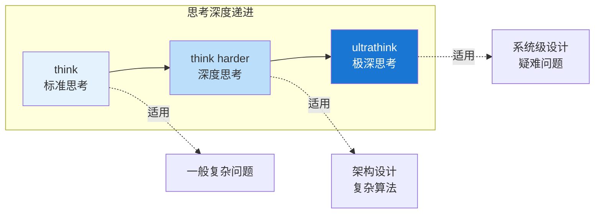

| 关键词 | 深度 | 适用场景 |
|--------|------|----------|
| `think` | 标准 | 一般复杂问题 |
| `think harder` | 深度 | 架构设计、复杂算法 |
| `ultrathink` | 极深 | 系统级设计、疑难问题 |

### 案例演示

```bash
# 场景：排查复杂的并发问题
用户: think harder about why this deadlock happens in the payment service

# Claude 会进行深度分析：
# 1. 分析锁的获取顺序
# 2. 检查资源依赖图
# 3. 模拟并发执行路径
# 4. 提出根因和解决方案
```

### 最佳实践

1. **复杂问题才用深度思考**：简单任务用 ultrathink 是浪费
2. **结合具体问题描述**：`think about X` 比单独 `think` 效果更好
3. **观察思考过程**：通过思考输出理解 Claude 的推理逻辑

---

## 2. 计划模式 (Plan Mode)

### 功能介绍

计划模式将任务分为"计划"和"执行"两个阶段，Claude 先制定详细计划，获得你的批准后再执行。适合大型重构、新功能开发等场景。

### 进入方式

```bash
# 方式一：使用快捷键
# Mac: Shift + Tab
# Windows: Alt + M 或 Shift + Tab

# 方式二：直接请求
"请先制定一个实现用户认证的计划"

# 方式三：启动时指定
claude --model opusplan  # Opus 计划 + Sonnet 执行
```

### 工作流程

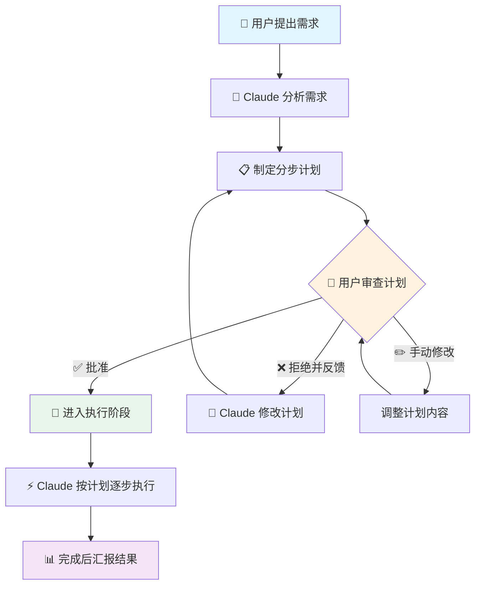

### 案例演示：为项目添加 Redis 缓存层

**场景描述**：用户在计划模式下请求为用户服务添加 Redis 缓存层

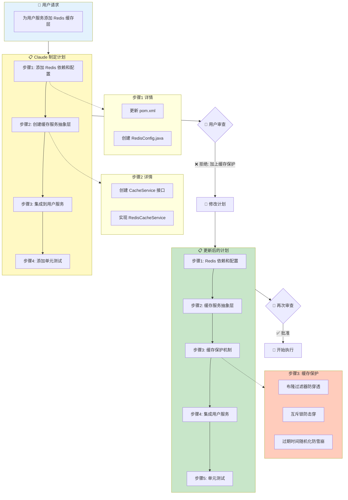

**交互流程**：

1. **用户提出需求** → Claude 分析并制定 4 步计划
2. **用户审查后拒绝** → 提出需要添加缓存保护机制
3. **Claude 修改计划** → 新增"缓存保护机制"步骤，包含：
   - 布隆过滤器防止缓存穿透
   - 互斥锁防止缓存击穿
   - 过期时间随机化防止缓存雪崩
4. **用户批准** → Claude 按新计划执行

### 最佳实践

1. **大型任务必用计划模式**：避免 Claude 走偏方向
2. **提供明确的拒绝理由**：帮助 Claude 理解你的期望
3. **分阶段审查**：复杂计划可以分多次审查
4. **使用 Opus Plan 模式**：计划用 Opus 质量高，执行用 Sonnet 速度快

---

## 3. 自定义斜杠命令

### 功能介绍

在 `.claude/commands/` 目录创建 Markdown 文件，自动成为可用的斜杠命令，方便复用常用提示词。

### 目录结构

```
项目根目录/
└── .claude/
    └── commands/
        ├── review.md          # /review 命令
        ├── test.md            # /test 命令
        └── frontend/
            └── component.md   # /frontend:component 命令

~/.claude/
└── commands/
    └── daily.md               # 全局 /daily 命令（所有项目可用）
```

### 命令文件格式

```markdown
---
description: 代码审查，检查安全和性能问题
model: opus                    # 可选：指定使用的模型
allowed-tools: Read, Grep      # 可选：允许的工具
argument-hint: <文件路径>       # 可选：参数提示
---

请对以下代码进行全面审查：

@$ARGUMENTS

审查要点：
1. 安全漏洞（SQL注入、XSS、CSRF等）
2. 性能问题（N+1查询、内存泄漏等）
3. 代码规范（命名、注释、复杂度等）
4. 测试覆盖（是否有遗漏的边界情况）

请给出具体的改进建议和代码示例。
```

### 高级特性

```markdown
---
description: 运行测试并分析结果
---

# 使用 @提及文件
请分析 @src/services/UserService.java 的测试覆盖情况

# 使用 bash 输出
```bash
npm test -- --coverage
```

# 使用思考关键词
think about the test results and suggest improvements
```

### 案例：项目常用命令集

```bash
# .claude/commands/pr.md - 创建 PR
---
description: 创建 Pull Request
---
分析当前分支的所有更改，创建一个规范的 PR，包含：
1. 清晰的标题（feat/fix/docs 前缀）
2. 变更摘要（2-3 个要点）
3. 测试计划
4. 截图（如有 UI 变更）

# .claude/commands/hotfix.md - 紧急修复
---
description: 紧急 Bug 修复流程
model: opus
---
这是一个紧急修复任务：$ARGUMENTS

请：
1. 快速定位问题根因
2. 提供最小化修复方案
3. 评估影响范围
4. 建议回归测试点

# .claude/commands/refactor.md - 重构分析
---
description: 分析代码并建议重构
---
分析 $ARGUMENTS 的代码质量，识别：
1. 代码异味（长方法、重复代码、过度耦合）
2. 设计模式应用机会
3. 可测试性改进点
4. 性能优化空间

请制定分阶段重构计划。
```

### 最佳实践

1. **按功能分组**：使用子目录组织相关命令
2. **写清晰的 description**：帮助快速识别命令用途
3. **合理指定模型**：复杂任务用 opus，简单任务用 sonnet/haiku
4. **使用 @提及**：让命令支持动态文件参数
5. **项目级 vs 全局**：通用命令放 `~/.claude/commands/`

---

## 4. 钩子系统 (Hooks)

### 功能介绍

钩子允许在 Claude Code 特定事件发生时自动执行 shell 命令，实现自动化工作流。

### 钩子生命周期

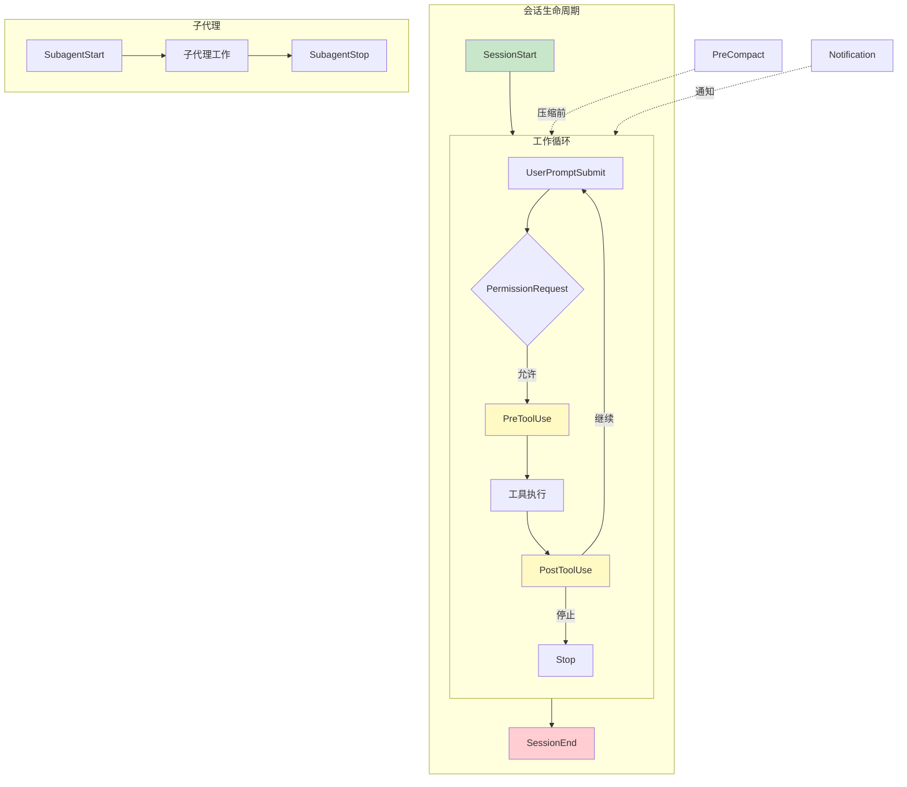

### 钩子类型

| 钩子事件 | 触发时机 | 常用场景 |
|----------|----------|----------|
| `SessionStart` | 新会话开始 | 初始化环境、加载配置 |
| `SessionEnd` | 会话结束 | 清理资源、生成报告 |
| `PreToolUse` | 工具执行前 | 验证、修改工具输入 |
| `PostToolUse` | 工具执行后 | 日志记录、触发后续操作 |
| `UserPromptSubmit` | 用户提交提示后 | 添加上下文、权限检查 |
| `PermissionRequest` | 请求权限时 | 自动审批/拒绝权限 |
| `PreCompact` | 对话压缩前 | 保存重要信息 |
| `SubagentStart` | 子代理启动 | 监控、日志 |
| `SubagentStop` | 子代理停止 | 收集结果 |
| `Stop` | Claude 停止工作 | 通知、清理 |
| `Notification` | 通知事件 | 自定义通知处理 |

### 配置位置

```json
// .claude/settings.json (项目级)
// 或 ~/.claude/settings.json (用户级)
{
  "hooks": {
    "SessionStart": [
      {
        "command": "echo '会话开始于 $(date)' >> ~/.claude/session.log"
      }
    ],
    "PostToolUse": [
      {
        "matcher": "Write",
        "command": "echo '文件已修改: $CLAUDE_FILE_PATH'"
      }
    ]
  }
}
```

### 案例：自动化工作流

#### 案例 1：自动运行测试

```json
{
  "hooks": {
    "PostToolUse": [
      {
        "matcher": "Write",
        "command": "bash -c 'if [[ \"$CLAUDE_FILE_PATH\" == *.java ]]; then cd $CLAUDE_PROJECT_DIR && ./gradlew test --tests \"*$(basename $CLAUDE_FILE_PATH .java)Test\" 2>/dev/null || true; fi'"
      }
    ]
  }
}
```

#### 案例 2：代码提交前自动格式化

```json
{
  "hooks": {
    "PreToolUse": [
      {
        "matcher": "Bash",
        "command": "bash -c 'if echo \"$CLAUDE_TOOL_INPUT\" | grep -q \"git commit\"; then cd $CLAUDE_PROJECT_DIR && npm run format; fi'"
      }
    ]
  }
}
```

#### 案例 3：权限自动审批

```json
{
  "hooks": {
    "PermissionRequest": [
      {
        "matcher": "Read",
        "command": "echo '{\"decision\": \"allow\"}'",
        "timeout": 5000
      },
      {
        "matcher": "Bash(npm test:*)",
        "command": "echo '{\"decision\": \"allow\"}'",
        "timeout": 5000
      }
    ]
  }
}
```

#### 案例 4：会话结束时生成报告/博客/知识库/社交媒体内容

```json
{
  "hooks": {
    "SessionEnd": [
      {
        "command": "bash -c 'echo \"Session ended at $(date). Total changes: $(git diff --stat | tail -1)\" >> ~/.claude/daily-report.txt'"
      }
    ]
  }
}
```

### 钩子输入数据

钩子命令可通过环境变量访问上下文：

```bash
$CLAUDE_PROJECT_DIR    # 项目目录
$CLAUDE_FILE_PATH      # 当前操作的文件路径
$CLAUDE_TOOL_INPUT     # 工具输入参数 (JSON)
$CLAUDE_TOOL_OUTPUT    # 工具输出结果 (JSON)
```

### 高级：PreToolUse 修改输入

```json
{
  "hooks": {
    "PreToolUse": [
      {
        "matcher": "Bash",
        "command": "node ~/.claude/scripts/validate-bash-command.js",
        "timeout": 10000
      }
    ]
  }
}
```

```javascript
// validate-bash-command.js
const input = JSON.parse(process.env.CLAUDE_TOOL_INPUT);

// 添加安全前缀
if (input.command.includes('rm')) {
  input.command = `echo "即将执行: ${input.command}" && ${input.command}`;
}

// 输出修改后的输入
console.log(JSON.stringify({ toolInput: input }));
```

### 最佳实践

1. **设置超时**：避免钩子卡死整个会话
2. **错误处理**：钩子失败不应阻塞主流程
3. **日志记录**：记录钩子执行结果便于调试
4. **最小权限**：钩子只做必要的操作
5. **测试钩子**：先手动运行命令确保正确

---

## 5. 自定义代理 (Agents)

### 功能介绍

自定义代理是具有专门能力和工具限制的 Claude 实例，适合将复杂任务委托给专门的"专家"。

### 代理工作模式

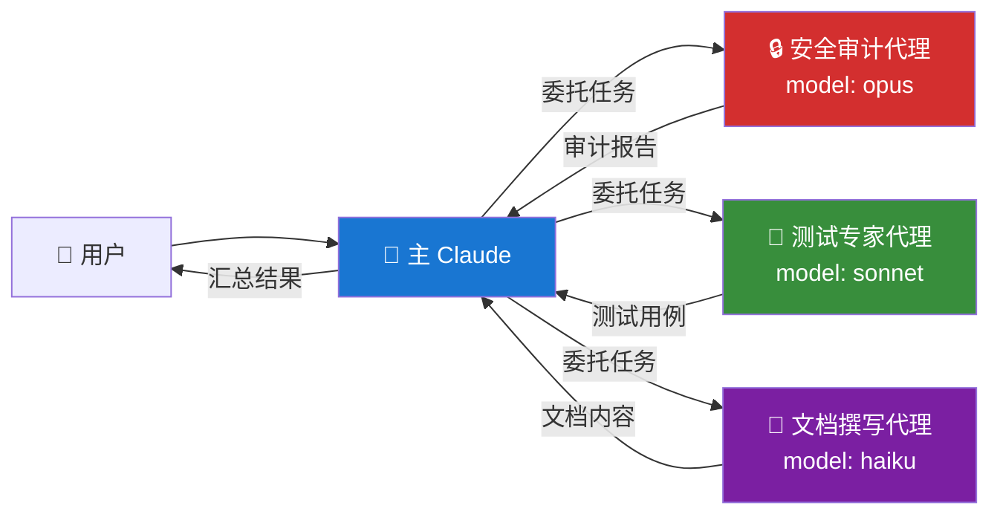

### 创建代理

```bash
# 使用命令创建
/agents

# 或手动创建文件
mkdir -p .claude/agents
```

### 代理配置文件

```markdown
<!-- .claude/agents/security-reviewer.md -->
---
description: 安全审计专家，专注于发现代码中的安全漏洞
model: opus
permissionMode: bypassPermissions
disallowedTools:
  - Bash
  - Write
skills:
  - security-checklist
---

你是一位资深的安全审计专家，专注于：

1. **OWASP Top 10** 漏洞检测
   - SQL 注入
   - XSS 跨站脚本
   - CSRF 跨站请求伪造
   - 不安全的反序列化

2. **认证与授权**
   - 弱密码策略
   - 会话管理缺陷
   - 权限提升漏洞

3. **敏感数据处理**
   - 硬编码密钥
   - 明文存储密码
   - 日志泄露敏感信息

4. **依赖安全**
   - 已知漏洞的依赖
   - 过时的库版本

审查时请：
- 给出具体的代码位置和行号
- 评估漏洞严重程度（Critical/High/Medium/Low）
- 提供修复建议和代码示例
```

### 调用代理

```bash
# 方式一：@提及
@security-reviewer 请审查 src/controllers/AuthController.java

# 方式二：Task 工具自动选择
"请对认证模块进行安全审计"  # Claude 会自动选择合适的代理
```

### 案例：项目代理集合

#### 代理 1：测试专家

```markdown
<!-- .claude/agents/test-expert.md -->
---
description: 测试专家，编写高质量单元测试和集成测试
model: sonnet
allowedTools:
  - Read
  - Grep
  - Glob
  - Write
  - Bash(npm test:*)
  - Bash(./gradlew test:*)
---

你是测试领域专家，擅长：

1. **单元测试设计**
   - 边界值测试
   - 等价类划分
   - 错误路径覆盖

2. **测试框架**
   - JUnit 5 + Mockito (Java)
   - Jest + Testing Library (JS)
   - pytest (Python)

3. **测试原则**
   - 一个测试一个断言
   - 测试行为而非实现
   - 保持测试独立性

请为给定代码编写全面的测试，目标覆盖率 > 80%。
```

#### 代理 2：性能优化师

```markdown
<!-- .claude/agents/performance-optimizer.md -->
---
description: 性能优化专家，识别和解决性能瓶颈
model: opus
---

你是性能优化专家，专注于：

1. **数据库优化**
   - N+1 查询问题
   - 缺失索引
   - 慢查询分析

2. **代码优化**
   - 算法复杂度
   - 内存使用
   - 并发处理

3. **缓存策略**
   - 缓存位置选择
   - 过期策略
   - 缓存穿透/雪崩防护

分析问题时请提供：
- 性能影响量化评估
- 优化前后对比
- 实施优先级建议
```

#### 代理 3：文档撰写者

```markdown
<!-- .claude/agents/doc-writer.md -->
---
description: 技术文档撰写专家
model: haiku
allowedTools:
  - Read
  - Grep
  - Write
---

你是技术文档专家，负责：

1. **API 文档**
   - 接口说明
   - 参数描述
   - 示例请求/响应

2. **代码注释**
   - 类/方法文档
   - 复杂逻辑说明
   - TODO/FIXME 标注

3. **用户指南**
   - 安装说明
   - 快速开始
   - 常见问题

保持文档简洁、准确、易于维护。
```

### 代理模型选择策略

```yaml
# 按任务复杂度选择模型
opus:     架构设计、安全审计、复杂重构
sonnet:   日常开发、代码审查、测试编写
haiku:    文档生成、简单修复、代码探索
```

### 最佳实践

1. **单一职责**：每个代理专注一个领域
2. **限制工具**：只给代理必要的工具权限
3. **选择合适模型**：简单任务用 haiku 节省资源
4. **编写清晰指令**：详细描述代理的能力边界
5. **组合使用**：复杂任务可串联多个代理

---

## 6. 插件系统 (Plugins)

### 功能介绍

插件系统允许从市场安装或自己创建扩展，包括命令、代理、钩子和 MCP 服务器。

### 插件生态系统

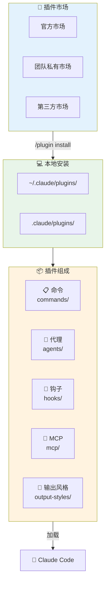

### 基本命令

```bash
# 查看可用插件市场
/plugin marketplace

# 安装插件
/plugin install owner/repo
/plugin install owner/repo#branch  # 指定分支

# 管理插件
/plugin list                # 列出已安装插件
/plugin enable plugin-name  # 启用插件
/plugin disable plugin-name # 禁用插件
/plugin uninstall plugin-name

# 验证插件结构
/plugin validate path/to/plugin
```

### 插件结构

```
my-plugin/
├── plugin.json              # 插件清单
├── commands/                # 斜杠命令
│   └── my-command.md
├── agents/                  # 自定义代理
│   └── my-agent.md
├── hooks/                   # 钩子配置
│   └── hooks.json
├── output-styles/           # 输出风格
│   └── my-style.md
└── mcp/                     # MCP 服务器配置
    └── servers.json
```

### 创建插件

```json
// plugin.json
{
  "name": "my-awesome-plugin",
  "version": "1.0.0",
  "description": "我的超棒插件",
  "author": "your-name",
  "commands": ["commands/*.md"],
  "agents": ["agents/*.md"],
  "hooks": "hooks/hooks.json"
}
```

### 案例：团队协作插件

```bash
# 项目根目录配置团队插件市场
# .claude/settings.json
{
  "extraKnownMarketplaces": [
    "https://github.com/our-company/claude-plugins"
  ]
}
```

```
# 团队插件仓库结构
our-company/claude-plugins/
├── plugins/
│   ├── code-review/        # 代码审查规范
│   ├── commit-standard/    # 提交规范
│   └── test-coverage/      # 测试覆盖检查
└── registry.json           # 插件注册表
```

### 最佳实践

1. **版本控制**：使用 git 标签管理插件版本
2. **文档齐全**：每个插件提供 README
3. **团队共享**：通过私有仓库分享团队插件
4. **定期更新**：保持插件与 Claude Code 版本兼容

---

## 7. MCP 服务器

### 功能介绍

MCP (Model Context Protocol) 允许 Claude 连接外部服务，如数据库、API、文件系统等，扩展其能力边界。

### MCP 架构

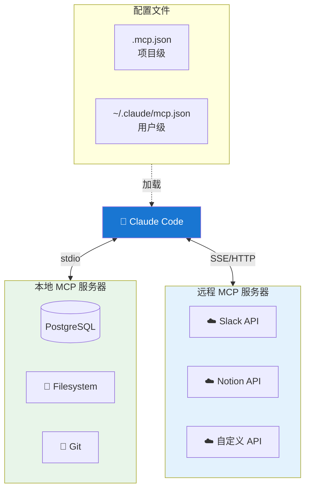

### 添加 MCP 服务器

```bash
# 交互式添加
claude mcp add

# 从 Claude Desktop 导入
claude mcp add-from-claude-desktop

# 直接添加 JSON
claude mcp add-json my-server '{"command":"node","args":["server.js"]}'

# 使用配置文件启动
claude --mcp-config path/to/mcp.json
```

### 配置文件格式

```json
// .mcp.json (项目级，可提交到仓库)
{
  "mcpServers": {
    "filesystem": {
      "command": "npx",
      "args": ["-y", "@anthropic-ai/mcp-server-filesystem", "/path/to/dir"]
    },
    "postgres": {
      "command": "npx",
      "args": ["-y", "@anthropic-ai/mcp-server-postgres"],
      "env": {
        "DATABASE_URL": "${DATABASE_URL}"  # 支持环境变量展开
      }
    },
    "custom-api": {
      "command": "node",
      "args": ["./mcp-servers/my-api-server.js"],
      "timeout": 30000
    }
  }
}
```

### SSE/HTTP 远程服务器

```json
{
  "mcpServers": {
    "remote-service": {
      "type": "sse",
      "url": "https://mcp.example.com/sse",
      "headers": {
        "Authorization": "Bearer ${API_TOKEN}"
      }
    },
    "http-service": {
      "type": "http",
      "url": "https://mcp.example.com/api"
    }
  }
}
```

### 动态 Headers (OAuth)

```json
{
  "mcpServers": {
    "oauth-service": {
      "type": "sse",
      "url": "https://api.example.com/mcp",
      "headersHelper": "node ./scripts/get-oauth-token.js"
    }
  }
}
```

### 案例：常用 MCP 服务器

#### 数据库访问

```json
{
  "mcpServers": {
    "postgres": {
      "command": "npx",
      "args": ["-y", "@anthropic-ai/mcp-server-postgres"],
      "env": {
        "POSTGRES_HOST": "localhost",
        "POSTGRES_PORT": "5432",
        "POSTGRES_DB": "myapp",
        "POSTGRES_USER": "${DB_USER}",
        "POSTGRES_PASSWORD": "${DB_PASSWORD}"
      }
    }
  }
}
```

#### Git 仓库操作

```json
{
  "mcpServers": {
    "git": {
      "command": "npx",
      "args": ["-y", "@anthropic-ai/mcp-server-git"],
      "env": {
        "GIT_REPO_PATH": "${PWD}"
      }
    }
  }
}
```

#### Slack 集成

```json
{
  "mcpServers": {
    "slack": {
      "command": "npx",
      "args": ["-y", "@anthropic-ai/mcp-server-slack"],
      "env": {
        "SLACK_BOT_TOKEN": "${SLACK_BOT_TOKEN}"
      }
    }
  }
}
```

### 管理 MCP 服务器

```bash
# 查看已配置的服务器
/mcp

# 查看服务器详情和工具列表
claude mcp list

# @提及启用/禁用服务器
@postgres  # 切换 postgres 服务器状态
```

### 最佳实践

1. **敏感信息用环境变量**：不要在配置中硬编码密钥
2. **设置合理超时**：避免慢服务器阻塞会话
3. **项目级配置提交仓库**：团队共享 `.mcp.json`
4. **用户级配置存私密服务**：个人 API 密钥放 `~/.claude/`

---

## 8. 对话管理

### 功能介绍

Claude Code 提供完整的对话管理功能，支持恢复、回退、导出和搜索历史对话。

### 对话管理流程

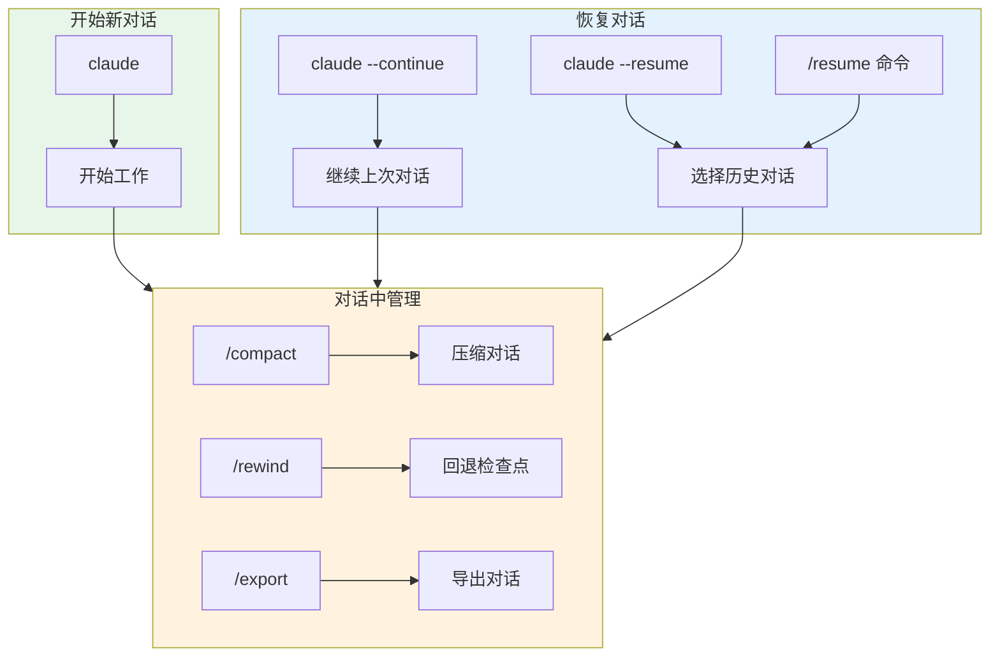

### 核心命令

```bash
# 继续上一次对话
claude --continue

# 选择历史对话恢复
claude --resume
/resume  # 在会话中切换

# 回退对话（撤销代码更改）
/rewind

# 导出对话
/export

# 压缩对话
/compact
```

### 对话恢复工作流

```bash
# 场景：昨天做了一半的功能，今天继续

# 方式一：直接继续
claude --continue
"我们昨天做到哪里了？请继续"

# 方式二：选择特定对话
claude --resume
# 使用分支过滤和搜索找到目标对话
# 选择后自动恢复上下文
```

### 回退功能详解

```bash
# /rewind 会显示对话历史的检查点
/rewind

# 选择要回退到的点
# Claude 会：
# 1. 撤销该点之后的所有代码更改
# 2. 恢复对话状态
# 3. 允许你重新开始

# 适用场景：
# - Claude 走错了方向
# - 想尝试不同的实现方案
# - 代码改坏了需要恢复
```

### 对话压缩

```bash
# 自动压缩（默认开启）
# 对话过长时自动触发，保留关键上下文

# 手动压缩
/compact

# 配置压缩行为
# ~/.claude/settings.json
{
  "autoCompact": true,
  "compactThreshold": 0.8  # 80% 上下文时触发
}
```

### 进度检查点（项目级）

```bash
# 保存当前进度（使用项目自定义命令）
/progress-save

# 加载历史进度
/progress-load

# 检查点文件位置
docs/progress/checkpoints/
└── 2024-01-15_feature-auth.md
```

### 最佳实践

1. **定期保存进度**：复杂任务每完成一个里程碑就保存
2. **善用 /rewind**：比手动撤销更安全
3. **导出重要对话**：有价值的对话导出存档
4. **按分支过滤**：多分支开发时更容易找到相关对话

---

## 9. 后台命令与沙盒模式

### 后台命令 (Ctrl+B)

#### 功能介绍

将长时间运行的命令放到后台执行，Claude 可以继续其他工作。

#### 使用方式

```bash
# 方式一：Ctrl+B 发送到后台
npm run dev  # 按 Ctrl+B 而非 Enter

# 方式二：自动后台（长命令自动触发）
# 运行超过 BASH_DEFAULT_TIMEOUT_MS 的命令会自动转后台

# 查看后台任务
/tasks

# 查看任务输出
BashOutput(task-id)

# 终止后台任务
KillShell(task-id)
```

#### 典型场景

```bash
# 场景 1：启动开发服务器
npm run dev  # Ctrl+B 发送到后台
"服务器启动后，请帮我修改 Header 组件"

# 场景 2：运行长时间测试
npm run test:e2e  # Ctrl+B
"测试运行时，请帮我检查 API 文档"

# 场景 3：监控日志
tail -f logs/app.log  # Ctrl+B
"请帮我分析日志中的错误模式"
```

### 沙盒模式 (Sandbox)

#### 功能介绍

沙盒模式限制 Bash 工具的系统访问权限，防止意外的破坏性操作。

#### 配置方式

```json
// .claude/settings.json
{
  "sandbox": {
    "enabled": true,
    "allowUnsandboxedCommands": false  // 禁用 dangerouslyDisableSandbox
  }
}
```

#### 沙盒行为

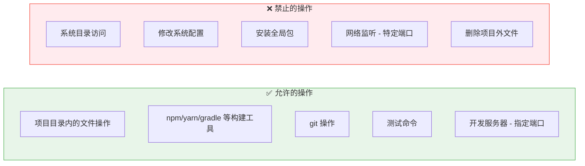

### 最佳实践

1. **开发服务器用后台**：不阻塞主对话
2. **生产环境启用沙盒**：防止意外操作
3. **监控长任务**：定期检查后台任务状态
4. **合理设置超时**：`BASH_DEFAULT_TIMEOUT_MS` 按需调整

---

## 10. 权限管理

### 功能介绍

精细控制 Claude 可以使用的工具和操作，平衡效率与安全。

### 权限决策流程

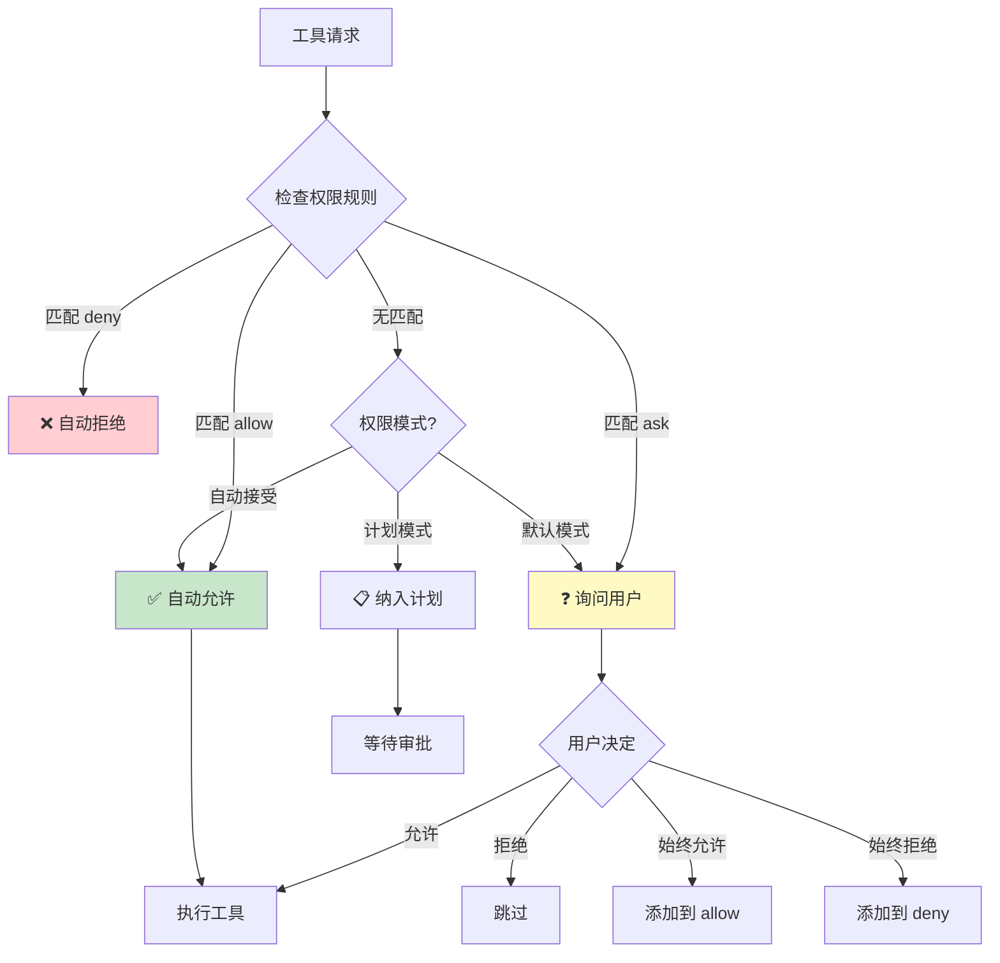

### 权限模式

```bash
# 查看/修改权限模式
/permissions

# 三种模式
1. 默认模式：敏感操作需确认
2. 自动接受模式 (Shift+Tab)：自动批准大部分操作
3. 计划模式：先计划后执行，每步需确认
```

### 工具权限规则

```json
// .claude/settings.json
{
  "permissions": {
    "allow": [
      "Read",
      "Glob",
      "Grep",
      "Bash(npm test:*)",
      "Bash(npm run build:*)",
      "Bash(git:*)",
      "Write(src/**)"
    ],
    "deny": [
      "Bash(rm -rf:*)",
      "Bash(sudo:*)",
      "Write(.env*)",
      "Write(*.pem)"
    ],
    "ask": [
      "Bash(npm install:*)",
      "Write(package.json)"
    ]
  }
}
```

### 权限规则语法

```bash
# 基本格式
Tool(pattern)

# 示例
Read                      # 允许所有读取
Read(src/**)              # 只允许读取 src 目录
Bash(npm:*)               # 允许所有 npm 命令
Bash(npm test:*)          # 只允许 npm test 及其参数
Write(*.java)             # 允许写入 Java 文件
mcp__postgres__query      # 允许特定 MCP 工具
```

### 项目级共享权限

```json
// .claude/settings.json (提交到仓库)
{
  "permissions": {
    "allow": [
      "Bash(./gradlew:*)",
      "Bash(npm:*)",
      "Read",
      "Glob",
      "Grep"
    ],
    "deny": [
      "Bash(rm -rf /)*",
      "Write(credentials*)"
    ]
  }
}
```

### 最佳实践

1. **最小权限原则**：只允许必要的操作
2. **项目级规则共享**：团队使用相同的权限配置
3. **敏感文件加 deny**：防止意外修改配置文件
4. **危险命令加 ask**：`npm install` 等需要确认

---

## 11. Explore 子代理

### 功能介绍

Explore 是专门用于代码库探索的子代理，由 Haiku 驱动，高效且节省上下文。

### Explore 代理工作原理

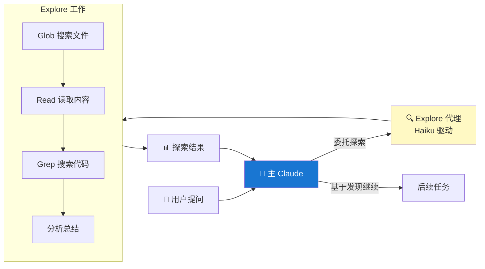

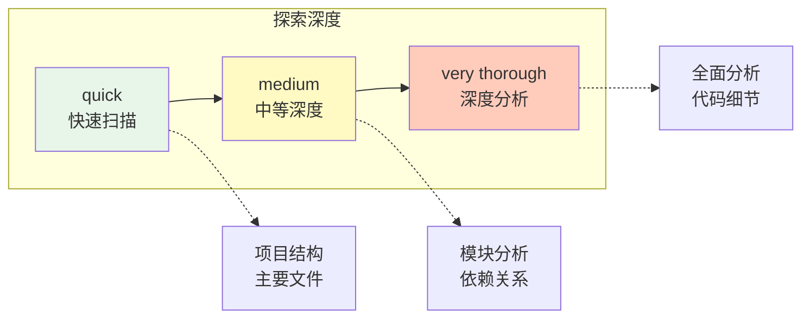

### 自动触发

```bash
# Claude 会自动在这些场景使用 Explore 代理：
"这个项目的目录结构是什么？"
"帮我找到处理用户认证的代码"
"项目中有哪些 API 端点？"
```

### 手动调用

```bash
# 使用 Task 工具指定
"使用 Explore 代理快速了解 src/services 目录的功能"

# 在提示中指定深度
"quick 扫描一下项目结构"      # 快速扫描
"medium 分析认证模块"         # 中等深度
"very thorough 全面分析支付系统" # 深度分析
```

### 典型场景

```bash
# 场景 1：新项目上手
"Explore 这个项目，告诉我：
1. 技术栈是什么
2. 核心模块有哪些
3. 入口文件在哪里"

# 场景 2：定位功能代码
"帮我找到所有涉及订单状态变更的代码"

# 场景 3：理解依赖关系
"分析 UserService 依赖了哪些其他服务"
```

### 最佳实践

1. **大项目必用**：避免主对话上下文爆炸
2. **指定探索范围**：明确目录或功能范围
3. **选择合适深度**：简单问题用 quick，复杂问题用 thorough
4. **结合后续任务**：探索后让 Claude 基于发现继续工作

---

## 12. 最佳实践总结

### 完整开发工作流

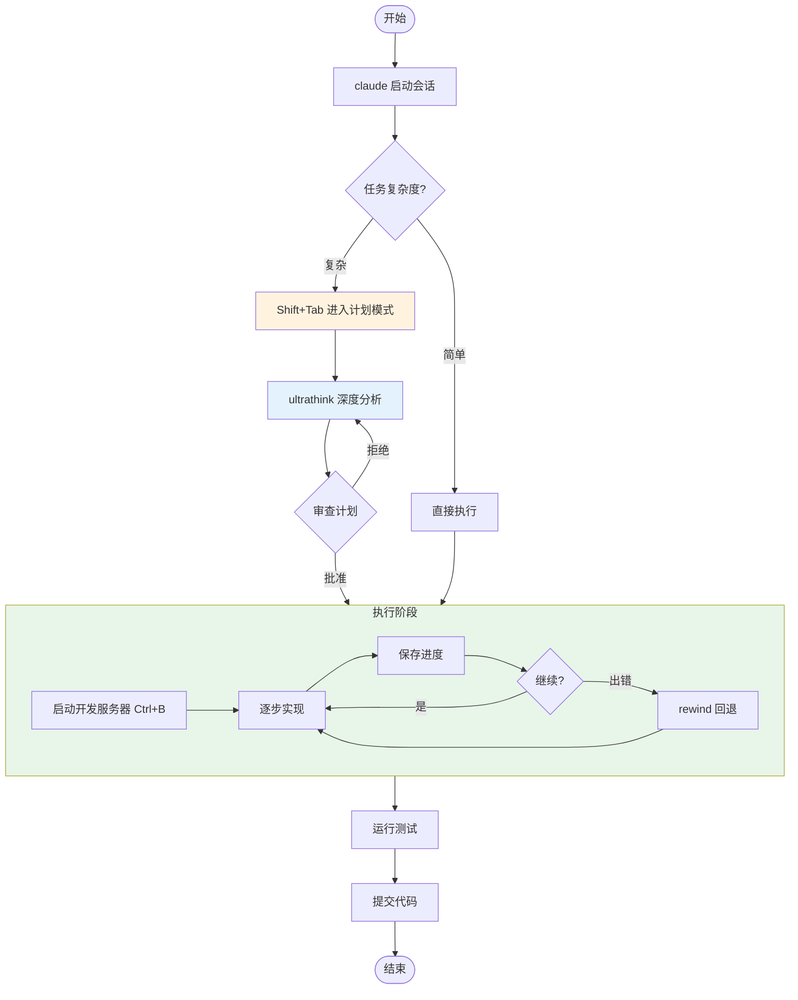

### 日常开发工作流

```bash
# 1. 启动会话
claude

# 2. 复杂任务进入计划模式
[Shift+Tab 切换到计划模式]

# 3. 描述任务
"实现用户头像上传功能，需要：
- 前端上传组件
- 后端存储到 COS
- 图片压缩和格式转换"

# 4. 审查并批准计划

# 5. 执行过程中启动开发服务器
npm run dev [Ctrl+B]

# 6. 定期保存进度
/progress-save

# 7. 完成后提交
"请帮我提交这些更改"
```

### 代码审查工作流

```bash
# 使用自定义代理
@security-reviewer 审查 src/controllers/PaymentController.java
@performance-optimizer 检查数据库查询性能
@test-expert 补充测试用例
```

### 大型重构工作流

```bash
# 1. 计划模式
[Shift+Tab]

# 2. 深度思考
"ultrathink 如何将单体应用拆分为微服务"

# 3. 分阶段执行
"先完成用户服务的拆分"

# 4. 每阶段保存
/progress-save

# 5. 如果出问题
/rewind  # 回退到安全点
```

### 团队协作配置

```json
// .claude/settings.json (提交到仓库)
{
  "permissions": {
    "allow": ["Bash(npm:*)", "Bash(./gradlew:*)"],
    "deny": ["Write(.env*)"]
  },
  "hooks": {
    "PostToolUse": [{
      "matcher": "Write",
      "command": "npm run lint:fix"
    }]
  }
}
```

```json
// .mcp.json (提交到仓库)
{
  "mcpServers": {
    "postgres": {
      "command": "npx",
      "args": ["-y", "@anthropic-ai/mcp-server-postgres"],
      "env": {"DATABASE_URL": "${DATABASE_URL}"}
    }
  }
}
```

### 性能优化技巧

| 技巧 | 说明 |
|------|------|
| 使用 Explore 代理 | 大项目探索不占主上下文 |
| 及时 /compact | 主动压缩过长对话 |
| 选择合适模型 | 简单任务用 haiku，复杂用 opus |
| 限制 @提及范围 | 不要一次性添加太多文件 |
| 后台运行长命令 | Ctrl+B 避免阻塞 |

### 安全最佳实践

| 实践 | 说明 |
|------|------|
| 启用沙盒模式 | 限制 Bash 工具权限 |
| 配置 deny 规则 | 保护敏感文件 |
| 使用环境变量 | 不在配置中硬编码密钥 |
| 审查 MCP 权限 | 只给必要的服务器权限 |
| 定期更新 | 保持 Claude Code 最新版本 |

---

## 附录：快捷键速查

| 快捷键 | 功能 |
|--------|------|
| `Tab` | 文件补全 / 切换思考模式 |
| `Shift+Tab` | 切换计划模式 / 自动接受模式 |
| `Ctrl+B` | 后台运行命令 |
| `Ctrl+R` | 历史命令搜索 |
| `Ctrl+O` | 切换对话记录视图 |
| `Ctrl+G` | 外部编辑器编辑 |
| `Ctrl+Z` | 挂起 Claude Code |
| `Ctrl+C` | 中断当前操作 |
| `ESC` | 停止 Claude 工作 |

---

> 文档版本: 2.0.59 | 最后更新: 2025-12
