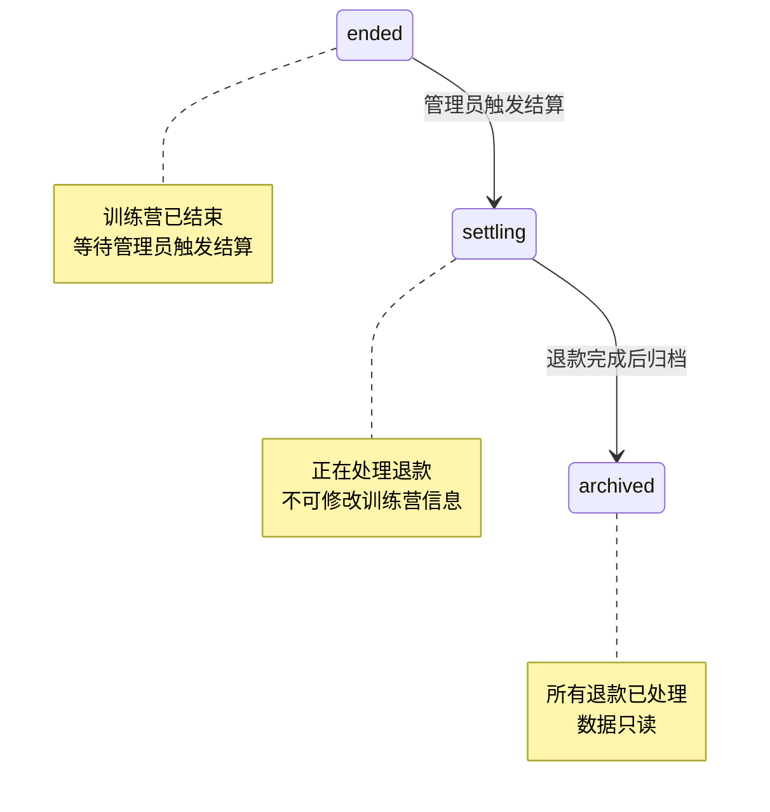

# Story 1-7: 触发结算与归档

| 属性 | 值 |
|------|-----|
| **Story ID** | 1-7-settlement-archive |
| **Epic** | EP01 - 基础框架与训练营管理 |
| **Story Points** | 3 |
| **优先级** | P0 |
| **前置依赖** | 1-5-camp-status-update |
| **状态** | drafted |

---

## Story

**作为** 管理员
**我需要** 能够对已结束的训练营触发结算并最终归档
**以便** 系统自动生成退款清单，完成结算流程后将训练营数据归档

---

## 验收标准 (BDD)

```gherkin
Feature: 触发结算与归档

  Background:
    Given 管理员已登录系统
    And JWT Token 有效

  # ==================== 触发结算 ====================

  Scenario: 成功触发结算
    Given 训练营状态为 ended
    When POST /api/admin/camps/{id}/start-settlement
    Then 返回 200 OK
    And 训练营状态变为 settling
    And 系统生成待处理的退款记录
    And 记录状态变更日志 (from=ended, to=settling)

  Scenario: 触发结算 - 非 ended 状态
    Given 训练营状态为 ongoing
    When POST /api/admin/camps/{id}/start-settlement
    Then 返回 400 Bad Request
    And 错误码为 1201 (INVALID_STATUS_TRANSITION)
    And 错误信息为 "只有已结束的训练营才能触发结算"

  Scenario: 触发结算 - 训练营不存在
    Given 训练营ID为 99999
    When POST /api/admin/camps/99999/start-settlement
    Then 返回 404 Not Found
    And 错误码为 1101 (CAMP_NOT_FOUND)

  Scenario: 触发结算 - 返回结算信息
    Given 训练营状态为 ended
    And 训练营有 10 名会员
    And 其中 8 名打卡合格
    When POST /api/admin/camps/{id}/start-settlement
    Then 返回 200 OK
    And 返回结算摘要 (totalMembers=10, qualifiedCount=8, pendingRefundCount=8)

  Scenario: 重复触发结算
    Given 训练营状态为 settling
    When POST /api/admin/camps/{id}/start-settlement
    Then 返回 400 Bad Request
    And 错误信息为 "训练营已在结算中"

  # ==================== 归档操作 ====================

  Scenario: 成功归档
    Given 训练营状态为 settling
    And 所有退款记录状态为 success 或 rejected
    When POST /api/admin/camps/{id}/archive
    Then 返回 200 OK
    And 训练营状态变为 archived
    And 记录状态变更日志 (from=settling, to=archived)

  Scenario: 归档失败 - 存在未处理退款
    Given 训练营状态为 settling
    And 存在 refund_status = pending 或 processing 的退款记录
    When POST /api/admin/camps/{id}/archive
    Then 返回 400 Bad Request
    And 错误码为 1202 (PENDING_REFUNDS_EXIST)
    And 错误信息为 "存在未处理的退款，无法归档"

  Scenario: 归档失败 - 未触发结算
    Given 训练营状态为 ended
    When POST /api/admin/camps/{id}/archive
    Then 返回 400 Bad Request
    And 错误码为 1203 (SETTLEMENT_NOT_STARTED)
    And 错误信息为 "请先触发结算流程"

  Scenario: 归档失败 - 非法状态
    Given 训练营状态为 ongoing
    When POST /api/admin/camps/{id}/archive
    Then 返回 400 Bad Request
    And 错误信息为 "只有结算中的训练营才能归档"

  # ==================== 归档后限制 ====================

  Scenario: 归档后不可修改
    Given 训练营状态为 archived
    When PUT /api/admin/camps/{id} 尝试修改任何字段
    Then 返回 400 Bad Request
    And 错误码为 1204 (CAMP_ARCHIVED)
    And 错误信息为 "已归档的训练营不可修改"

  Scenario: 归档后可查看
    Given 训练营状态为 archived
    When GET /api/admin/camps/{id}
    Then 返回 200 OK
    And 返回训练营详情 (isArchived=true)

  # ==================== 查询结算状态 ====================

  Scenario: 查看结算进度
    Given 训练营状态为 settling
    When GET /api/admin/camps/{id}/settlement-status
    Then 返回 200 OK
    And 返回结算进度 (totalRefunds, successCount, failedCount, pendingCount)

  Scenario: 查看结算进度 - 非结算状态
    Given 训练营状态为 enrolling
    When GET /api/admin/camps/{id}/settlement-status
    Then 返回 400 Bad Request
    And 错误信息为 "训练营未进入结算流程"
```

---

## 技术上下文

### 技术栈要求

| 组件 | 版本 | 说明 |
|------|------|------|
| Spring Boot | 3.2+ | 主框架 |
| MyBatis Plus | 3.5+ | ORM |
| PostgreSQL | 15+ | 数据库 |

### 状态流转规则

> 引用：`docs/v1/design/状态枚举定义.md#5-camp_status`

**本故事涉及的状态流转**：

| 原状态 | 新状态 | 触发方式 | 条件 |
|--------|--------|---------|------|
| `ended` | `settling` | 管理员操作 (触发结算) | 训练营已结束 |
| `settling` | `archived` | 管理员操作 (归档) | 所有退款已处理完成 |

**状态机图**：



### 数据库表关系

**涉及表**：

| 表名 | 说明 |
|------|------|
| `training_camp` | 训练营主表，status 字段变更 |
| `camp_status_log` | 状态变更日志 |
| `camp_member` | 会员表，用于统计打卡合格人数 |
| `refund_record` | 退款记录表（本故事生成，EP04 实现退款逻辑） |

### 退款记录生成逻辑

**触发结算时自动生成退款记录**：

1. 查询训练营所有会员 (`camp_member`)
2. 筛选打卡合格的会员 (`checkin_status = 'qualified'`)
3. 为每个合格会员创建退款记录 (`refund_record`)
4. 初始状态：`refund_status = 'pending'`, `audit_status = 'pending'`

**refund_record 表核心字段**：

| 字段 | 类型 | 说明 |
|------|------|------|
| id | BIGSERIAL | 主键 |
| camp_id | BIGINT | 训练营ID |
| member_id | BIGINT | 会员ID |
| payment_record_id | BIGINT | 支付记录ID |
| refund_amount | DECIMAL(10,2) | 退款金额 |
| refund_status | VARCHAR(20) | 退款状态 |
| audit_status | VARCHAR(20) | 审核状态 |
| created_at | TIMESTAMP | 创建时间 |

---

## 实现任务清单

### Task 1: 创建结算相关 VO

**文件**: `backend/src/main/java/com/yian/camp/vo/SettlementVO.java`

```java
package com.yian.camp.vo;

import lombok.Builder;
import lombok.Data;

import java.math.BigDecimal;
import java.time.LocalDateTime;

@Data
@Builder
public class SettlementVO {

    /**
     * 训练营ID
     */
    private Long campId;

    /**
     * 训练营名称
     */
    private String campName;

    /**
     * 总会员数
     */
    private Integer totalMembers;

    /**
     * 打卡合格人数
     */
    private Integer qualifiedCount;

    /**
     * 不合格人数
     */
    private Integer unqualifiedCount;

    /**
     * 待退款人数
     */
    private Integer pendingRefundCount;

    /**
     * 预计退款总金额
     */
    private BigDecimal totalRefundAmount;

    /**
     * 结算触发时间
     */
    private LocalDateTime settledAt;
}
```

---

### Task 2: 创建结算进度 VO

**文件**: `backend/src/main/java/com/yian/camp/vo/SettlementStatusVO.java`

```java
package com.yian.camp.vo;

import lombok.Builder;
import lombok.Data;

import java.math.BigDecimal;

@Data
@Builder
public class SettlementStatusVO {

    /**
     * 训练营ID
     */
    private Long campId;

    /**
     * 训练营状态
     */
    private String campStatus;

    /**
     * 总退款记录数
     */
    private Integer totalRefunds;

    /**
     * 已成功退款数
     */
    private Integer successCount;

    /**
     * 退款失败数
     */
    private Integer failedCount;

    /**
     * 待处理数 (pending + approved + processing)
     */
    private Integer pendingCount;

    /**
     * 审核拒绝数
     */
    private Integer rejectedCount;

    /**
     * 已退款金额
     */
    private BigDecimal refundedAmount;

    /**
     * 待退款金额
     */
    private BigDecimal pendingAmount;

    /**
     * 是否可归档 (所有退款已处理)
     */
    private Boolean canArchive;
}
```

---

### Task 3: 添加错误码常量

**文件**: `backend/src/main/java/com/yian/camp/exception/ErrorCode.java`

添加以下错误码：

```java
// ========== 训练营模块 11xx-12xx ==========
public static final int CAMP_NOT_FOUND = 1101;
public static final int INVALID_STATUS_TRANSITION = 1201;
public static final int PENDING_REFUNDS_EXIST = 1202;
public static final int SETTLEMENT_NOT_STARTED = 1203;
public static final int CAMP_ARCHIVED = 1204;
```

---

### Task 4: 创建 RefundRecord 实体（桩）

**目标**: 创建退款记录实体的基础结构，为 EP04 做准备

**文件**: `backend/src/main/java/com/yian/camp/entity/RefundRecord.java`

```java
package com.yian.camp.entity;

import com.baomidou.mybatisplus.annotation.*;
import lombok.Data;

import java.math.BigDecimal;
import java.time.LocalDateTime;

@Data
@TableName("refund_record")
public class RefundRecord {

    @TableId(type = IdType.AUTO)
    private Long id;

    /**
     * 训练营ID
     */
    private Long campId;

    /**
     * 会员ID
     */
    private Long memberId;

    /**
     * 支付记录ID
     */
    private Long paymentRecordId;

    /**
     * 退款金额
     */
    private BigDecimal refundAmount;

    /**
     * 退款状态: pending/approved/rejected/processing/success/failed
     */
    private String refundStatus;

    /**
     * 审核状态: pending/approved/rejected
     */
    private String auditStatus;

    /**
     * 微信退款单号
     */
    private String wechatRefundNo;

    /**
     * 退款原因
     */
    private String refundReason;

    /**
     * 审核人ID
     */
    private Long auditBy;

    /**
     * 审核时间
     */
    private LocalDateTime auditAt;

    /**
     * 审核备注
     */
    private String auditRemark;

    /**
     * 退款完成时间
     */
    private LocalDateTime refundedAt;

    /**
     * 失败原因
     */
    private String failureReason;

    /**
     * 重试次数
     */
    private Integer retryCount;

    @TableField(fill = FieldFill.INSERT)
    private LocalDateTime createdAt;

    @TableField(fill = FieldFill.INSERT_UPDATE)
    private LocalDateTime updatedAt;
}
```

---

### Task 5: 创建 RefundRecordMapper

**文件**: `backend/src/main/java/com/yian/camp/mapper/RefundRecordMapper.java`

```java
package com.yian.camp.mapper;

import com.baomidou.mybatisplus.core.mapper.BaseMapper;
import com.yian.camp.entity.RefundRecord;
import org.apache.ibatis.annotations.Mapper;
import org.apache.ibatis.annotations.Param;
import org.apache.ibatis.annotations.Select;

@Mapper
public interface RefundRecordMapper extends BaseMapper<RefundRecord> {

    /**
     * 统计训练营的退款记录数量（按状态）
     */
    @Select("SELECT COUNT(*) FROM refund_record WHERE camp_id = #{campId} AND refund_status = #{status}")
    int countByStatus(@Param("campId") Long campId, @Param("status") String status);

    /**
     * 统计训练营的待处理退款数量
     * pending + approved + processing
     */
    @Select("SELECT COUNT(*) FROM refund_record WHERE camp_id = #{campId} " +
            "AND refund_status IN ('pending', 'approved', 'processing')")
    int countPendingRefunds(@Param("campId") Long campId);

    /**
     * 检查训练营是否存在未完成的退款
     */
    @Select("SELECT EXISTS(SELECT 1 FROM refund_record WHERE camp_id = #{campId} " +
            "AND refund_status NOT IN ('success', 'rejected'))")
    boolean hasUnfinishedRefunds(@Param("campId") Long campId);
}
```

---

### Task 6: 创建 CampMemberMapper 查询方法

**文件**: `backend/src/main/java/com/yian/camp/mapper/CampMemberMapper.java`

添加以下方法：

```java
package com.yian.camp.mapper;

import com.baomidou.mybatisplus.core.mapper.BaseMapper;
import com.yian.camp.entity.CampMember;
import org.apache.ibatis.annotations.Mapper;
import org.apache.ibatis.annotations.Param;
import org.apache.ibatis.annotations.Select;

import java.util.List;

@Mapper
public interface CampMemberMapper extends BaseMapper<CampMember> {

    /**
     * 统计训练营会员总数
     */
    @Select("SELECT COUNT(*) FROM camp_member WHERE camp_id = #{campId}")
    int countByCampId(@Param("campId") Long campId);

    /**
     * 统计打卡合格会员数
     */
    @Select("SELECT COUNT(*) FROM camp_member WHERE camp_id = #{campId} AND checkin_status = 'qualified'")
    int countQualifiedMembers(@Param("campId") Long campId);

    /**
     * 查询打卡合格的会员列表
     */
    @Select("SELECT * FROM camp_member WHERE camp_id = #{campId} AND checkin_status = 'qualified'")
    List<CampMember> selectQualifiedMembers(@Param("campId") Long campId);
}
```

---

### Task 7: 扩展 CampService 接口

**文件**: `backend/src/main/java/com/yian/camp/service/CampService.java`

添加以下方法：

```java
/**
 * 触发训练营结算
 * @param id 训练营ID
 * @return 结算摘要
 */
SettlementVO startSettlement(Long id);

/**
 * 归档训练营
 * @param id 训练营ID
 */
void archiveCamp(Long id);

/**
 * 查询结算进度
 * @param id 训练营ID
 * @return 结算状态
 */
SettlementStatusVO getSettlementStatus(Long id);

/**
 * 检查训练营是否已归档
 * @param id 训练营ID
 * @return 是否已归档
 */
boolean isArchived(Long id);
```

---

### Task 8: 实现结算与归档逻辑

**文件**: `backend/src/main/java/com/yian/camp/service/impl/CampServiceImpl.java`

添加以下实现：

```java
@Autowired
private CampMemberMapper campMemberMapper;

@Autowired
private RefundRecordMapper refundRecordMapper;

@Override
@Transactional
public SettlementVO startSettlement(Long id) {
    TrainingCamp camp = getById(id);

    // 1. 校验状态
    if (camp.getStatus() != CampStatus.ENDED) {
        if (camp.getStatus() == CampStatus.SETTLING) {
            throw new BusinessException(ErrorCode.INVALID_STATUS_TRANSITION, "训练营已在结算中");
        }
        throw new BusinessException(ErrorCode.INVALID_STATUS_TRANSITION, "只有已结束的训练营才能触发结算");
    }

    // 2. 统计会员数据
    int totalMembers = campMemberMapper.countByCampId(id);
    int qualifiedCount = campMemberMapper.countQualifiedMembers(id);
    int unqualifiedCount = totalMembers - qualifiedCount;

    // 3. 生成退款记录
    List<CampMember> qualifiedMembers = campMemberMapper.selectQualifiedMembers(id);
    BigDecimal totalRefundAmount = BigDecimal.ZERO;

    for (CampMember member : qualifiedMembers) {
        RefundRecord refund = new RefundRecord();
        refund.setCampId(id);
        refund.setMemberId(member.getId());
        refund.setPaymentRecordId(member.getPaymentRecordId());
        refund.setRefundAmount(camp.getDeposit()); // 退全额押金
        refund.setRefundStatus("pending");
        refund.setAuditStatus("pending");
        refund.setRefundReason("打卡合格，系统自动生成退款");
        refund.setRetryCount(0);

        refundRecordMapper.insert(refund);
        totalRefundAmount = totalRefundAmount.add(camp.getDeposit());
    }

    // 4. 更新训练营状态
    camp.setStatus(CampStatus.SETTLING);
    campMapper.updateById(camp);

    // 5. 记录状态变更日志
    logStatusChange(id, CampStatus.ENDED, CampStatus.SETTLING, "管理员触发结算");

    log.info("训练营结算已触发: campId={}, totalMembers={}, qualifiedCount={}, pendingRefunds={}",
            id, totalMembers, qualifiedCount, qualifiedMembers.size());

    return SettlementVO.builder()
            .campId(id)
            .campName(camp.getName())
            .totalMembers(totalMembers)
            .qualifiedCount(qualifiedCount)
            .unqualifiedCount(unqualifiedCount)
            .pendingRefundCount(qualifiedMembers.size())
            .totalRefundAmount(totalRefundAmount)
            .settledAt(LocalDateTime.now())
            .build();
}

@Override
@Transactional
public void archiveCamp(Long id) {
    TrainingCamp camp = getById(id);

    // 1. 校验状态
    if (camp.getStatus() == CampStatus.ENDED) {
        throw new BusinessException(ErrorCode.SETTLEMENT_NOT_STARTED, "请先触发结算流程");
    }
    if (camp.getStatus() != CampStatus.SETTLING) {
        throw new BusinessException(ErrorCode.INVALID_STATUS_TRANSITION, "只有结算中的训练营才能归档");
    }

    // 2. 校验是否存在未处理的退款
    if (refundRecordMapper.hasUnfinishedRefunds(id)) {
        throw new BusinessException(ErrorCode.PENDING_REFUNDS_EXIST, "存在未处理的退款，无法归档");
    }

    // 3. 更新状态为 archived
    camp.setStatus(CampStatus.ARCHIVED);
    campMapper.updateById(camp);

    // 4. 记录状态变更日志
    logStatusChange(id, CampStatus.SETTLING, CampStatus.ARCHIVED, "管理员归档训练营");

    log.info("训练营已归档: campId={}, campName={}", id, camp.getName());
}

@Override
public SettlementStatusVO getSettlementStatus(Long id) {
    TrainingCamp camp = getById(id);

    if (camp.getStatus() != CampStatus.SETTLING && camp.getStatus() != CampStatus.ARCHIVED) {
        throw new BusinessException(ErrorCode.INVALID_STATUS_TRANSITION, "训练营未进入结算流程");
    }

    // 统计退款情况
    int totalRefunds = (int) refundRecordMapper.selectCount(
            new LambdaQueryWrapper<RefundRecord>().eq(RefundRecord::getCampId, id));
    int successCount = refundRecordMapper.countByStatus(id, "success");
    int failedCount = refundRecordMapper.countByStatus(id, "failed");
    int rejectedCount = refundRecordMapper.countByStatus(id, "rejected");
    int pendingCount = refundRecordMapper.countPendingRefunds(id);

    // 计算金额
    BigDecimal refundedAmount = camp.getRefundedAmount() != null ? camp.getRefundedAmount() : BigDecimal.ZERO;
    BigDecimal pendingAmount = camp.getDeposit().multiply(BigDecimal.valueOf(pendingCount));

    // 判断是否可归档
    boolean canArchive = !refundRecordMapper.hasUnfinishedRefunds(id);

    return SettlementStatusVO.builder()
            .campId(id)
            .campStatus(camp.getStatus().getValue())
            .totalRefunds(totalRefunds)
            .successCount(successCount)
            .failedCount(failedCount)
            .pendingCount(pendingCount)
            .rejectedCount(rejectedCount)
            .refundedAmount(refundedAmount)
            .pendingAmount(pendingAmount)
            .canArchive(canArchive)
            .build();
}

@Override
public boolean isArchived(Long id) {
    TrainingCamp camp = campMapper.selectById(id);
    return camp != null && camp.getStatus() == CampStatus.ARCHIVED;
}

private TrainingCamp getById(Long id) {
    TrainingCamp camp = campMapper.selectById(id);
    if (camp == null) {
        throw new BusinessException(ErrorCode.CAMP_NOT_FOUND, "训练营不存在");
    }
    return camp;
}
```

---

### Task 9: 添加归档校验切面（可选）

**目标**: 在 CampService 的 update 方法中添加归档校验

**文件**: `backend/src/main/java/com/yian/camp/service/impl/CampServiceImpl.java`

修改 `updateCamp` 方法，在开头添加：

```java
@Override
@Transactional
public CampVO updateCamp(Long id, CampDTO dto) {
    TrainingCamp camp = getById(id);

    // 检查是否已归档
    if (camp.getStatus() == CampStatus.ARCHIVED) {
        throw new BusinessException(ErrorCode.CAMP_ARCHIVED, "已归档的训练营不可修改");
    }

    // ... 原有更新逻辑
}
```

---

### Task 10: 添加 Controller 接口

**文件**: `backend/src/main/java/com/yian/camp/controller/admin/CampController.java`

添加以下接口：

```java
@Operation(summary = "触发结算", description = "对已结束的训练营触发结算流程，自动生成退款记录")
@PostMapping("/{id}/start-settlement")
public Result<SettlementVO> startSettlement(@PathVariable Long id) {
    log.info("触发训练营结算: campId={}", id);
    SettlementVO result = campService.startSettlement(id);
    return Result.success(result);
}

@Operation(summary = "归档训练营", description = "所有退款处理完成后归档训练营")
@PostMapping("/{id}/archive")
public Result<Void> archiveCamp(@PathVariable Long id) {
    log.info("归档训练营: campId={}", id);
    campService.archiveCamp(id);
    return Result.success();
}

@Operation(summary = "查询结算进度", description = "查询训练营的退款处理进度")
@GetMapping("/{id}/settlement-status")
public Result<SettlementStatusVO> getSettlementStatus(@PathVariable Long id) {
    SettlementStatusVO status = campService.getSettlementStatus(id);
    return Result.success(status);
}
```

需要添加导入：

```java
import com.yian.camp.vo.SettlementVO;
import com.yian.camp.vo.SettlementStatusVO;
```

---

### Task 11: 添加 CampStatus 枚举值

**文件**: `backend/src/main/java/com/yian/camp/enums/CampStatus.java`

确保包含以下枚举值：

```java
package com.yian.camp.enums;

import com.baomidou.mybatisplus.annotation.EnumValue;
import com.fasterxml.jackson.annotation.JsonValue;
import lombok.Getter;

@Getter
public enum CampStatus {
    DRAFT("draft", "草稿"),
    PENDING("pending", "待发布"),
    ENROLLING("enrolling", "报名中"),
    ONGOING("ongoing", "进行中"),
    ENDED("ended", "已结束"),
    SETTLING("settling", "结算中"),
    ARCHIVED("archived", "已归档");

    @EnumValue
    @JsonValue
    private final String value;
    private final String description;

    CampStatus(String value, String description) {
        this.value = value;
        this.description = description;
    }

    public static CampStatus fromValue(String value) {
        for (CampStatus status : values()) {
            if (status.value.equals(value)) {
                return status;
            }
        }
        throw new IllegalArgumentException("Unknown camp_status: " + value);
    }
}
```

---

### Task 12: 创建 CampMember 实体（桩）

**文件**: `backend/src/main/java/com/yian/camp/entity/CampMember.java`

```java
package com.yian.camp.entity;

import com.baomidou.mybatisplus.annotation.*;
import lombok.Data;

import java.time.LocalDateTime;

@Data
@TableName("camp_member")
public class CampMember {

    @TableId(type = IdType.AUTO)
    private Long id;

    /**
     * 训练营ID
     */
    private Long campId;

    /**
     * 支付记录ID
     */
    private Long paymentRecordId;

    /**
     * 知识星球用户ID
     */
    private Long planetUserId;

    /**
     * 打卡次数
     */
    private Integer checkinCount;

    /**
     * 打卡状态: pending/qualified/unqualified
     */
    private String checkinStatus;

    /**
     * 是否全勤
     */
    private Boolean fullAttendance;

    /**
     * 匹配状态: pending/matched/failed
     */
    private String matchStatus;

    @TableField(fill = FieldFill.INSERT)
    private LocalDateTime createdAt;

    @TableField(fill = FieldFill.INSERT_UPDATE)
    private LocalDateTime updatedAt;
}
```

---

### Task 13: 创建单元测试

**文件**: `backend/src/test/java/com/yian/camp/SettlementArchiveTest.java`

```java
package com.yian.camp;

import com.fasterxml.jackson.databind.ObjectMapper;
import com.yian.camp.dto.LoginDTO;
import com.yian.camp.entity.CampMember;
import com.yian.camp.entity.TrainingCamp;
import com.yian.camp.enums.CampStatus;
import com.yian.camp.mapper.CampMapper;
import com.yian.camp.mapper.CampMemberMapper;
import com.yian.camp.mapper.RefundRecordMapper;
import com.yian.camp.service.CampService;
import com.yian.camp.vo.SettlementVO;
import org.junit.jupiter.api.BeforeEach;
import org.junit.jupiter.api.Test;
import org.springframework.beans.factory.annotation.Autowired;
import org.springframework.boot.test.autoconfigure.web.servlet.AutoConfigureMockMvc;
import org.springframework.boot.test.context.SpringBootTest;
import org.springframework.http.MediaType;
import org.springframework.test.web.servlet.MockMvc;
import org.springframework.test.web.servlet.MvcResult;

import java.math.BigDecimal;
import java.time.LocalDate;

import static org.junit.jupiter.api.Assertions.*;
import static org.springframework.test.web.servlet.request.MockMvcRequestBuilders.*;
import static org.springframework.test.web.servlet.result.MockMvcResultMatchers.*;

@SpringBootTest
@AutoConfigureMockMvc
class SettlementArchiveTest {

    @Autowired
    private MockMvc mockMvc;

    @Autowired
    private ObjectMapper objectMapper;

    @Autowired
    private CampMapper campMapper;

    @Autowired
    private CampMemberMapper campMemberMapper;

    @Autowired
    private RefundRecordMapper refundRecordMapper;

    @Autowired
    private CampService campService;

    private String token;

    @BeforeEach
    void setUp() throws Exception {
        // 登录获取 Token
        LoginDTO loginDTO = new LoginDTO();
        loginDTO.setUsername("admin");
        loginDTO.setPassword("admin123");

        MvcResult result = mockMvc.perform(post("/api/admin/auth/login")
                        .contentType(MediaType.APPLICATION_JSON)
                        .content(objectMapper.writeValueAsString(loginDTO)))
                .andReturn();

        String response = result.getResponse().getContentAsString();
        token = objectMapper.readTree(response).get("data").get("token").asText();
    }

    @Test
    void testStartSettlement_Success() throws Exception {
        // 创建已结束的训练营
        TrainingCamp camp = createCamp(CampStatus.ENDED);
        campMapper.insert(camp);

        // 创建打卡合格的会员
        for (int i = 0; i < 3; i++) {
            CampMember member = new CampMember();
            member.setCampId(camp.getId());
            member.setCheckinStatus("qualified");
            member.setCheckinCount(20);
            campMemberMapper.insert(member);
        }

        // 触发结算
        mockMvc.perform(post("/api/admin/camps/" + camp.getId() + "/start-settlement")
                        .header("Authorization", "Bearer " + token))
                .andExpect(status().isOk())
                .andExpect(jsonPath("$.code").value(200))
                .andExpect(jsonPath("$.data.totalMembers").value(3))
                .andExpect(jsonPath("$.data.qualifiedCount").value(3))
                .andExpect(jsonPath("$.data.pendingRefundCount").value(3));

        // 验证状态已变更
        TrainingCamp updated = campMapper.selectById(camp.getId());
        assertEquals(CampStatus.SETTLING, updated.getStatus());

        // 验证退款记录已生成
        int refundCount = (int) refundRecordMapper.selectCount(
                new com.baomidou.mybatisplus.core.conditions.query.LambdaQueryWrapper<com.yian.camp.entity.RefundRecord>()
                        .eq(com.yian.camp.entity.RefundRecord::getCampId, camp.getId()));
        assertEquals(3, refundCount);
    }

    @Test
    void testStartSettlement_InvalidStatus() throws Exception {
        // 创建进行中的训练营
        TrainingCamp camp = createCamp(CampStatus.ONGOING);
        campMapper.insert(camp);

        // 尝试触发结算
        mockMvc.perform(post("/api/admin/camps/" + camp.getId() + "/start-settlement")
                        .header("Authorization", "Bearer " + token))
                .andExpect(status().isBadRequest())
                .andExpect(jsonPath("$.code").value(1201))
                .andExpect(jsonPath("$.message").value("只有已结束的训练营才能触发结算"));
    }

    @Test
    void testStartSettlement_AlreadySettling() throws Exception {
        // 创建结算中的训练营
        TrainingCamp camp = createCamp(CampStatus.SETTLING);
        campMapper.insert(camp);

        // 尝试重复触发结算
        mockMvc.perform(post("/api/admin/camps/" + camp.getId() + "/start-settlement")
                        .header("Authorization", "Bearer " + token))
                .andExpect(status().isBadRequest())
                .andExpect(jsonPath("$.message").value("训练营已在结算中"));
    }

    @Test
    void testArchive_NotSettled() throws Exception {
        // 创建已结束但未结算的训练营
        TrainingCamp camp = createCamp(CampStatus.ENDED);
        campMapper.insert(camp);

        // 尝试归档
        mockMvc.perform(post("/api/admin/camps/" + camp.getId() + "/archive")
                        .header("Authorization", "Bearer " + token))
                .andExpect(status().isBadRequest())
                .andExpect(jsonPath("$.code").value(1203))
                .andExpect(jsonPath("$.message").value("请先触发结算流程"));
    }

    @Test
    void testGetSettlementStatus() throws Exception {
        // 创建结算中的训练营
        TrainingCamp camp = createCamp(CampStatus.SETTLING);
        campMapper.insert(camp);

        // 查询结算状态
        mockMvc.perform(get("/api/admin/camps/" + camp.getId() + "/settlement-status")
                        .header("Authorization", "Bearer " + token))
                .andExpect(status().isOk())
                .andExpect(jsonPath("$.code").value(200))
                .andExpect(jsonPath("$.data.campStatus").value("settling"));
    }

    @Test
    void testUpdateArchivedCamp_Blocked() throws Exception {
        // 创建已归档的训练营
        TrainingCamp camp = createCamp(CampStatus.ARCHIVED);
        campMapper.insert(camp);

        // 尝试更新
        mockMvc.perform(put("/api/admin/camps/" + camp.getId())
                        .header("Authorization", "Bearer " + token)
                        .contentType(MediaType.APPLICATION_JSON)
                        .content("{\"name\":\"新名称\"}"))
                .andExpect(status().isBadRequest())
                .andExpect(jsonPath("$.code").value(1204))
                .andExpect(jsonPath("$.message").value("已归档的训练营不可修改"));
    }

    /**
     * 创建测试训练营
     */
    private TrainingCamp createCamp(CampStatus status) {
        TrainingCamp camp = new TrainingCamp();
        camp.setName("结算测试训练营-" + System.currentTimeMillis());
        camp.setPosterUrl("https://cdn.example.com/poster.jpg");
        camp.setDeposit(new BigDecimal("99.00"));
        camp.setStartDate(LocalDate.now().minusDays(30));
        camp.setEndDate(LocalDate.now().minusDays(1));
        camp.setTotalDays(21);
        camp.setRequiredDays(15);
        camp.setGroupQrcodeUrl("https://cdn.example.com/qrcode.jpg");
        camp.setPlanetProjectId("15555411412112");
        camp.setStatus(status);
        camp.setMemberCount(0);
        camp.setPaidAmount(BigDecimal.ZERO);
        camp.setRefundedAmount(BigDecimal.ZERO);
        return camp;
    }
}
```

---

## 目录结构

```
backend/src/main/java/com/yian/camp/
├── CampApplication.java
├── common/
│   └── Result.java
├── config/
│   └── ...
├── controller/
│   └── admin/
│       ├── AuthController.java
│       ├── CampController.java       # 新增结算/归档接口
│       └── UserController.java
├── dto/
│   └── ...
├── entity/
│   ├── SystemUser.java
│   ├── TrainingCamp.java
│   ├── CampStatusLog.java
│   ├── CampMember.java               # 新增（桩）
│   └── RefundRecord.java             # 新增（桩）
├── enums/
│   └── CampStatus.java               # 确保包含 settling/archived
├── exception/
│   ├── BusinessException.java
│   ├── ErrorCode.java                # 新增错误码
│   └── GlobalExceptionHandler.java
├── filter/
│   └── JwtAuthenticationFilter.java
├── mapper/
│   ├── SystemUserMapper.java
│   ├── CampMapper.java
│   ├── CampStatusLogMapper.java
│   ├── CampMemberMapper.java         # 新增
│   └── RefundRecordMapper.java       # 新增
├── schedule/
│   └── CampStatusUpdateTask.java
├── service/
│   ├── AuthService.java
│   ├── CampService.java              # 扩展
│   ├── UserService.java
│   └── impl/
│       ├── AuthServiceImpl.java
│       ├── CampServiceImpl.java      # 扩展
│       └── UserServiceImpl.java
├── util/
│   └── JwtUtil.java
└── vo/
    ├── LoginVO.java
    ├── UserInfoVO.java
    ├── CampVO.java
    ├── CampListVO.java
    ├── CampPublishInfoVO.java
    ├── CampStatusUpdateResultVO.java
    ├── SettlementVO.java             # 新增
    └── SettlementStatusVO.java       # 新增
```

---

## 架构合规要求

### 必须遵守

- [x] 状态流转必须记录到 camp_status_log
- [x] 使用 Slf4j 记录操作日志
- [x] 事务管理：结算操作使用 @Transactional
- [x] 错误码使用 ErrorCode 常量
- [x] 校验逻辑在 Service 层实现

### 禁止事项

- 直接修改已归档训练营的任何字段
- 跳过状态校验直接执行结算/归档
- 使用硬编码的状态值
- 在 Controller 层编写业务逻辑

---

## 验证检查清单

### 编译验证
```bash
cd backend && ./gradlew compileJava
# 预期: BUILD SUCCESSFUL
```

### 启动验证
```bash
cd backend && ./gradlew bootRun
# 预期: Started CampApplication
```

### 接口测试

```bash
# 登录获取 Token
TOKEN=$(curl -s -X POST http://localhost:8080/api/admin/auth/login \
  -H "Content-Type: application/json" \
  -d '{"username":"admin","password":"admin123"}' | jq -r '.data.token')

# 触发结算（需要先有一个 ended 状态的训练营）
curl -X POST http://localhost:8080/api/admin/camps/{id}/start-settlement \
  -H "Authorization: Bearer $TOKEN"
# 预期: {"code":200,"data":{"campId":...,"pendingRefundCount":...}}

# 查询结算进度
curl -X GET http://localhost:8080/api/admin/camps/{id}/settlement-status \
  -H "Authorization: Bearer $TOKEN"
# 预期: {"code":200,"data":{"campStatus":"settling","canArchive":false}}

# 归档（需要所有退款已处理）
curl -X POST http://localhost:8080/api/admin/camps/{id}/archive \
  -H "Authorization: Bearer $TOKEN"
# 预期: {"code":200}
```

### 单元测试
```bash
cd backend && ./gradlew test --tests "*SettlementArchiveTest*"
# 预期: BUILD SUCCESSFUL
```

---

## 相关文档

| 文档 | 路径 | 说明 |
|------|------|------|
| 状态枚举定义 | `docs/v1/design/状态枚举定义.md` | camp_status SSOT |
| 数据库设计 | `docs/v1/design/数据库设计.md` | training_camp, refund_record 表结构 |
| API 设计规范 | `docs/v1/design/API设计规范.md` | RESTful 规范 |
| Epic 详情 | `docs/epics.md` | EP01-S07 详细描述 |

---

## 完成标准

- [ ] `./gradlew compileJava` 编译成功
- [ ] 触发结算接口正常工作
- [ ] 结算自动生成退款记录
- [ ] 归档接口正常工作
- [ ] 未处理退款时无法归档
- [ ] 未触发结算时无法归档
- [ ] 已归档训练营不可修改
- [ ] 结算进度查询正常
- [ ] 状态变更记录到 camp_status_log
- [ ] 单元测试通过

---

**创建时间**: 2025-12-13
**创建者**: Claude (create-story workflow)
**Epic**: EP01 - 基础框架与训练营管理
