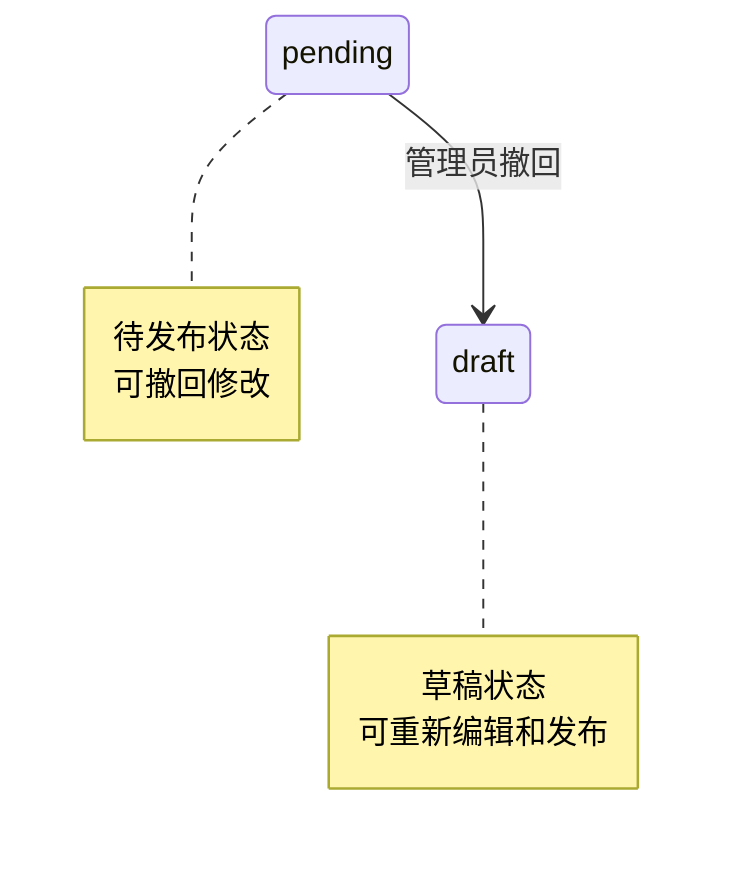

# Story 1-8: 撤回发布

| 属性 | 值 |
|------|-----|
| **Story ID** | 1-8-withdraw-publish |
| **Epic** | EP01 - 基础框架与训练营管理 |
| **Story Points** | 1 |
| **优先级** | P0 |
| **前置依赖** | 1-4-camp-publish |
| **状态** | drafted |

---

## 用户故事

**作为** 管理员
**我需要** 能够撤回待发布状态的训练营
**以便** 返回草稿状态进行修改后重新发布

---

## 验收标准 (BDD)

```gherkin
Feature: 撤回发布

  Background:
    Given 管理员已登录系统
    And JWT Token 有效

  # ==================== 成功撤回 ====================

  Scenario: 成功撤回待发布的训练营
    Given 训练营状态为 pending
    When POST /api/admin/camps/{id}/withdraw
    Then 返回 200 OK
    And 训练营状态变为 draft
    And enrollUrl 字段被清空
    And 记录状态变更日志 (from=pending, to=draft, reason="管理员撤回发布")

  Scenario: 撤回后可重新编辑
    Given 训练营状态为 pending
    When POST /api/admin/camps/{id}/withdraw
    And PUT /api/admin/camps/{id} 修改训练营信息
    Then 修改成功
    And 训练营状态保持 draft

  Scenario: 撤回后可重新发布
    Given 训练营状态为 pending
    When POST /api/admin/camps/{id}/withdraw
    And POST /api/admin/camps/{id}/publish
    Then 训练营状态变为 pending
    And 可以继续执行确认发布流程

  # ==================== 撤回失败场景 ====================

  Scenario: 已进入报名期无法撤回
    Given 训练营状态为 enrolling
    When POST /api/admin/camps/{id}/withdraw
    Then 返回 400 Bad Request
    And 错误码为 1120 (CAMP_CANNOT_WITHDRAW)
    And 错误信息为 "已进入报名期的训练营无法撤回"

  Scenario: 进行中无法撤回
    Given 训练营状态为 ongoing
    When POST /api/admin/camps/{id}/withdraw
    Then 返回 400 Bad Request
    And 错误码为 1120 (CAMP_CANNOT_WITHDRAW)
    And 错误信息为 "进行中的训练营无法撤回"

  Scenario: 已结束无法撤回
    Given 训练营状态为 ended
    When POST /api/admin/camps/{id}/withdraw
    Then 返回 400 Bad Request
    And 错误码为 1120 (CAMP_CANNOT_WITHDRAW)
    And 错误信息为 "已结束的训练营无法撤回"

  Scenario: 草稿状态无需撤回
    Given 训练营状态为 draft
    When POST /api/admin/camps/{id}/withdraw
    Then 返回 400 Bad Request
    And 错误码为 1120 (CAMP_CANNOT_WITHDRAW)
    And 错误信息为 "当前状态无需撤回"

  Scenario: 训练营不存在
    Given 不存在 ID 为 99999 的训练营
    When POST /api/admin/camps/99999/withdraw
    Then 返回 404 Not Found
    And 错误码为 1101 (CAMP_NOT_FOUND)

  # ==================== 权限控制 ====================

  Scenario: 未登录无法撤回
    Given 未提供 JWT Token
    When POST /api/admin/camps/{id}/withdraw
    Then 返回 401 Unauthorized

  Scenario: 教练角色无法撤回
    Given 当前用户角色为 coach
    And 训练营状态为 pending
    When POST /api/admin/camps/{id}/withdraw
    Then 返回 403 Forbidden
    And 错误码为 1303 (NO_PERMISSION)
```

---

## 技术上下文

### 技术栈要求

| 组件 | 版本 | 说明 |
|------|------|------|
| Spring Boot | 3.2+ | 主框架 |
| MyBatis Plus | 3.5+ | ORM |
| PostgreSQL | 15+ | 数据库 |

### 状态流转规则

> 引用：`docs/v1/design/状态枚举定义.md#5-camp_status`

**本故事涉及的状态流转**：

| 原状态 | 新状态 | 触发方式 | 说明 |
|--------|--------|---------|------|
| `pending` | `draft` | 管理员撤回 | 仅限 pending 状态可撤回 |

**状态机图**：



### 撤回操作要点

1. **仅限 pending 状态**：只有待发布状态的训练营可以撤回
2. **清空 enrollUrl**：撤回时清空报名链接（如果有的话）
3. **记录日志**：状态变更记录到 camp_status_log
4. **可重复操作**：撤回后可重新编辑和发布

### 错误码定义

| 错误码 | HTTP 状态码 | 错误信息 | 说明 |
|--------|------------|----------|------|
| 1101 | 404 | 训练营不存在 | ID无效或已删除 |
| 1120 | 400 | 当前状态无法撤回 | 非 pending 状态 |

---

## 实现任务清单

### Task 1: 添加错误码常量

**文件**: `backend/src/main/java/com/yian/camp/exception/ErrorCode.java`

添加以下错误码：

```java
// ========== 训练营撤回相关 112x ==========
public static final int CAMP_CANNOT_WITHDRAW = 1120;
```

---

### Task 2: 扩展 BusinessException

**文件**: `backend/src/main/java/com/yian/camp/exception/BusinessException.java`

添加以下工厂方法：

```java
/**
 * 训练营无法撤回
 */
public static BusinessException campCannotWithdraw(String reason) {
    return new BusinessException(1120, reason);
}
```

---

### Task 3: 扩展 CampStatus 枚举

**文件**: `backend/src/main/java/com/yian/camp/enums/CampStatus.java`

添加以下方法：

```java
/**
 * 判断是否可以撤回
 * 仅 pending 状态可撤回
 */
public boolean canWithdraw() {
    return this == PENDING;
}

/**
 * 获取撤回失败的原因
 */
public String getWithdrawFailureReason() {
    return switch (this) {
        case DRAFT -> "当前状态无需撤回";
        case ENROLLING -> "已进入报名期的训练营无法撤回";
        case ONGOING -> "进行中的训练营无法撤回";
        case ENDED -> "已结束的训练营无法撤回";
        case SETTLING -> "结算中的训练营无法撤回";
        case ARCHIVED -> "已归档的训练营无法撤回";
        default -> "当前状态无法撤回";
    };
}
```

---

### Task 4: 扩展 CampService 接口

**文件**: `backend/src/main/java/com/yian/camp/service/CampService.java`

添加以下方法：

```java
/**
 * 撤回训练营发布
 * @param id 训练营ID
 * @return 撤回后的训练营信息
 */
CampVO withdrawCamp(Long id);
```

---

### Task 5: 实现撤回逻辑

**文件**: `backend/src/main/java/com/yian/camp/service/impl/CampServiceImpl.java`

添加以下实现：

```java
@Override
@Transactional
public CampVO withdrawCamp(Long id) {
    // 1. 查询训练营
    TrainingCamp camp = campMapper.selectById(id);
    if (camp == null) {
        throw new BusinessException(ErrorCode.CAMP_NOT_FOUND, "训练营不存在");
    }

    // 2. 检查状态是否可撤回
    if (!camp.getStatus().canWithdraw()) {
        throw BusinessException.campCannotWithdraw(camp.getStatus().getWithdrawFailureReason());
    }

    // 3. 记录原状态
    CampStatus fromStatus = camp.getStatus();

    // 4. 更新状态为 draft
    camp.setStatus(CampStatus.DRAFT);

    // 5. 清空报名链接（如果有的话）
    camp.setEnrollUrl(null);

    campMapper.updateById(camp);

    // 6. 记录状态变更日志
    logStatusChange(camp.getId(), fromStatus, CampStatus.DRAFT, "管理员撤回发布");

    log.info("训练营撤回发布: id={}, name={}", camp.getId(), camp.getName());

    return toVO(camp);
}
```

---

### Task 6: 添加 Controller 接口

**文件**: `backend/src/main/java/com/yian/camp/controller/admin/CampController.java`

添加以下接口：

```java
@Operation(summary = "撤回发布", description = "撤回待发布状态的训练营，返回草稿状态")
@PostMapping("/{id}/withdraw")
@PreAuthorize("hasAnyRole('ADMIN', 'MANAGER')")
public Result<CampVO> withdrawCamp(@PathVariable Long id) {
    log.info("撤回训练营发布: campId={}", id);
    CampVO camp = campService.withdrawCamp(id);
    return Result.success(camp);
}
```

---

### Task 7: 创建单元测试

**文件**: `backend/src/test/java/com/yian/camp/CampWithdrawTest.java`

```java
package com.yian.camp;

import com.fasterxml.jackson.databind.ObjectMapper;
import com.yian.camp.dto.LoginDTO;
import com.yian.camp.entity.TrainingCamp;
import com.yian.camp.enums.CampStatus;
import com.yian.camp.mapper.CampMapper;
import org.junit.jupiter.api.BeforeEach;
import org.junit.jupiter.api.Test;
import org.junit.jupiter.params.ParameterizedTest;
import org.junit.jupiter.params.provider.EnumSource;
import org.springframework.beans.factory.annotation.Autowired;
import org.springframework.boot.test.autoconfigure.web.servlet.AutoConfigureMockMvc;
import org.springframework.boot.test.context.SpringBootTest;
import org.springframework.http.MediaType;
import org.springframework.test.web.servlet.MockMvc;
import org.springframework.test.web.servlet.MvcResult;

import java.math.BigDecimal;
import java.time.LocalDate;

import static org.junit.jupiter.api.Assertions.*;
import static org.springframework.test.web.servlet.request.MockMvcRequestBuilders.*;
import static org.springframework.test.web.servlet.result.MockMvcResultMatchers.*;

@SpringBootTest
@AutoConfigureMockMvc
class CampWithdrawTest {

    @Autowired
    private MockMvc mockMvc;

    @Autowired
    private ObjectMapper objectMapper;

    @Autowired
    private CampMapper campMapper;

    private String token;

    @BeforeEach
    void setUp() throws Exception {
        // 登录获取 Token
        LoginDTO loginDTO = new LoginDTO();
        loginDTO.setUsername("admin");
        loginDTO.setPassword("admin123");

        MvcResult result = mockMvc.perform(post("/api/admin/auth/login")
                        .contentType(MediaType.APPLICATION_JSON)
                        .content(objectMapper.writeValueAsString(loginDTO)))
                .andReturn();

        String response = result.getResponse().getContentAsString();
        token = objectMapper.readTree(response).get("data").get("token").asText();
    }

    @Test
    void testWithdrawPendingCamp_Success() throws Exception {
        // 创建待发布的训练营
        TrainingCamp camp = createCamp(CampStatus.PENDING);
        camp.setEnrollUrl("https://h5.example.com/enroll/123");
        campMapper.insert(camp);

        // 撤回
        mockMvc.perform(post("/api/admin/camps/" + camp.getId() + "/withdraw")
                        .header("Authorization", "Bearer " + token))
                .andExpect(status().isOk())
                .andExpect(jsonPath("$.code").value(200))
                .andExpect(jsonPath("$.data.status").value("draft"));

        // 验证数据库状态
        TrainingCamp updated = campMapper.selectById(camp.getId());
        assertEquals(CampStatus.DRAFT, updated.getStatus());
        assertNull(updated.getEnrollUrl()); // enrollUrl 应被清空
    }

    @Test
    void testWithdrawDraftCamp_Fail() throws Exception {
        // 草稿状态无需撤回
        TrainingCamp camp = createCamp(CampStatus.DRAFT);
        campMapper.insert(camp);

        mockMvc.perform(post("/api/admin/camps/" + camp.getId() + "/withdraw")
                        .header("Authorization", "Bearer " + token))
                .andExpect(status().isBadRequest())
                .andExpect(jsonPath("$.code").value(1120))
                .andExpect(jsonPath("$.message").value("当前状态无需撤回"));
    }

    @Test
    void testWithdrawEnrollingCamp_Fail() throws Exception {
        // 报名中的训练营无法撤回
        TrainingCamp camp = createCamp(CampStatus.ENROLLING);
        camp.setEnrollUrl("https://h5.example.com/enroll/" + System.currentTimeMillis());
        campMapper.insert(camp);

        mockMvc.perform(post("/api/admin/camps/" + camp.getId() + "/withdraw")
                        .header("Authorization", "Bearer " + token))
                .andExpect(status().isBadRequest())
                .andExpect(jsonPath("$.code").value(1120))
                .andExpect(jsonPath("$.message").value("已进入报名期的训练营无法撤回"));
    }

    @Test
    void testWithdrawOngoingCamp_Fail() throws Exception {
        // 进行中的训练营无法撤回
        TrainingCamp camp = createCamp(CampStatus.ONGOING);
        campMapper.insert(camp);

        mockMvc.perform(post("/api/admin/camps/" + camp.getId() + "/withdraw")
                        .header("Authorization", "Bearer " + token))
                .andExpect(status().isBadRequest())
                .andExpect(jsonPath("$.code").value(1120))
                .andExpect(jsonPath("$.message").value("进行中的训练营无法撤回"));
    }

    @Test
    void testWithdrawEndedCamp_Fail() throws Exception {
        // 已结束的训练营无法撤回
        TrainingCamp camp = createCamp(CampStatus.ENDED);
        campMapper.insert(camp);

        mockMvc.perform(post("/api/admin/camps/" + camp.getId() + "/withdraw")
                        .header("Authorization", "Bearer " + token))
                .andExpect(status().isBadRequest())
                .andExpect(jsonPath("$.code").value(1120))
                .andExpect(jsonPath("$.message").value("已结束的训练营无法撤回"));
    }

    @Test
    void testWithdrawNonExistentCamp() throws Exception {
        mockMvc.perform(post("/api/admin/camps/99999/withdraw")
                        .header("Authorization", "Bearer " + token))
                .andExpect(status().isNotFound())
                .andExpect(jsonPath("$.code").value(1101));
    }

    @Test
    void testWithdrawAndRePublish() throws Exception {
        // 创建待发布的训练营
        TrainingCamp camp = createCamp(CampStatus.PENDING);
        campMapper.insert(camp);

        // 1. 撤回
        mockMvc.perform(post("/api/admin/camps/" + camp.getId() + "/withdraw")
                        .header("Authorization", "Bearer " + token))
                .andExpect(status().isOk())
                .andExpect(jsonPath("$.data.status").value("draft"));

        // 2. 重新发布
        mockMvc.perform(post("/api/admin/camps/" + camp.getId() + "/publish")
                        .header("Authorization", "Bearer " + token))
                .andExpect(status().isOk())
                .andExpect(jsonPath("$.data.status").value("pending"));
    }

    @Test
    void testWithdrawWithoutAuth() throws Exception {
        TrainingCamp camp = createCamp(CampStatus.PENDING);
        campMapper.insert(camp);

        mockMvc.perform(post("/api/admin/camps/" + camp.getId() + "/withdraw"))
                .andExpect(status().isUnauthorized());
    }

    @ParameterizedTest(name = "撤回 {0} 状态的训练营应该失败")
    @EnumSource(value = CampStatus.class, names = {"ENROLLING", "ONGOING", "ENDED", "SETTLING", "ARCHIVED"})
    void testWithdrawNonPendingCamp_AllFail(CampStatus status) throws Exception {
        TrainingCamp camp = createCamp(status);
        if (status == CampStatus.ENROLLING) {
            camp.setEnrollUrl("https://h5.example.com/enroll/" + System.currentTimeMillis());
        }
        campMapper.insert(camp);

        mockMvc.perform(post("/api/admin/camps/" + camp.getId() + "/withdraw")
                        .header("Authorization", "Bearer " + token))
                .andExpect(status().isBadRequest())
                .andExpect(jsonPath("$.code").value(1120));
    }

    /**
     * 创建测试训练营
     */
    private TrainingCamp createCamp(CampStatus status) {
        TrainingCamp camp = new TrainingCamp();
        camp.setName("撤回测试训练营-" + System.currentTimeMillis());
        camp.setPosterUrl("https://cdn.example.com/poster.jpg");
        camp.setDeposit(new BigDecimal("99.00"));
        camp.setStartDate(LocalDate.now().plusDays(7));
        camp.setEndDate(LocalDate.now().plusDays(28));
        camp.setTotalDays(21);
        camp.setRequiredDays(15);
        camp.setGroupQrcodeUrl("https://cdn.example.com/qrcode.jpg");
        camp.setPlanetProjectId("15555411412112");
        camp.setStatus(status);
        camp.setMemberCount(0);
        camp.setPaidAmount(BigDecimal.ZERO);
        camp.setRefundedAmount(BigDecimal.ZERO);
        return camp;
    }
}
```

---

## 目录结构

```
backend/src/main/java/com/yian/camp/
├── CampApplication.java
├── common/
│   └── Result.java
├── config/
│   └── ...
├── controller/
│   └── admin/
│       ├── AuthController.java
│       ├── CampController.java       # 新增 withdraw 接口
│       └── UserController.java
├── dto/
│   └── ...
├── entity/
│   ├── SystemUser.java
│   ├── TrainingCamp.java
│   └── CampStatusLog.java
├── enums/
│   └── CampStatus.java               # 新增 canWithdraw() 方法
├── exception/
│   ├── BusinessException.java        # 新增 campCannotWithdraw()
│   ├── ErrorCode.java                # 新增 1120
│   └── GlobalExceptionHandler.java
├── filter/
│   └── JwtAuthenticationFilter.java
├── mapper/
│   ├── SystemUserMapper.java
│   ├── CampMapper.java
│   └── CampStatusLogMapper.java
├── service/
│   ├── AuthService.java
│   ├── CampService.java              # 新增 withdrawCamp()
│   └── impl/
│       ├── AuthServiceImpl.java
│       └── CampServiceImpl.java      # 实现 withdrawCamp()
├── util/
│   └── JwtUtil.java
└── vo/
    └── ...
```

---

## 架构合规要求

### 必须遵守

- [x] 仅 pending 状态可撤回
- [x] 撤回时清空 enrollUrl
- [x] 状态变更记录到 camp_status_log
- [x] 使用 Slf4j 记录操作日志
- [x] 权限控制：admin/manager 可操作

### 禁止事项

- 允许非 pending 状态撤回
- 跳过状态日志记录
- 硬编码错误信息
- 在 Controller 层实现业务逻辑

---

## 验证检查清单

### 编译验证
```bash
cd backend && ./gradlew compileJava
# 预期: BUILD SUCCESSFUL
```

### 启动验证
```bash
cd backend && ./gradlew bootRun
# 预期: Started CampApplication
```

### 接口测试

```bash
# 登录获取 Token
TOKEN=$(curl -s -X POST http://localhost:8080/api/admin/auth/login \
  -H "Content-Type: application/json" \
  -d '{"username":"admin","password":"admin123"}' | jq -r '.data.token')

# 假设已有 pending 状态的训练营 (ID=1)
# 撤回发布
curl -X POST http://localhost:8080/api/admin/camps/1/withdraw \
  -H "Authorization: Bearer $TOKEN"
# 预期: {"code":200,"data":{"id":1,"status":"draft",...}}

# 尝试撤回草稿状态的训练营
curl -X POST http://localhost:8080/api/admin/camps/1/withdraw \
  -H "Authorization: Bearer $TOKEN"
# 预期: {"code":1120,"message":"当前状态无需撤回"}
```

### 单元测试
```bash
cd backend && ./gradlew test --tests "*CampWithdrawTest*"
# 预期: BUILD SUCCESSFUL
```

---

## 相关文档

| 文档 | 路径 | 说明 |
|------|------|------|
| 状态枚举定义 | `docs/v1/design/状态枚举定义.md` | camp_status SSOT |
| 数据库设计 | `docs/v1/design/数据库设计.md` | training_camp, camp_status_log 表结构 |
| API 设计规范 | `docs/v1/design/API设计规范.md` | RESTful 规范 |
| 发布流程 | `docs/sprint-artifacts/stories/1-4-camp-publish.md` | 发布相关逻辑 |
| Epic 详情 | `docs/epics.md` | EP01-S08 详细描述 |

---

## 与 Story 1-4 的关系

本故事是 Story 1-4 (训练营发布) 的逆操作：

| 操作 | Story | 状态变更 |
|------|-------|---------|
| 发布审核 | 1-4 | draft → pending |
| 确认发布 | 1-4 | pending → enrolling |
| **撤回发布** | **1-8** | **pending → draft** |

撤回后可重新执行 Story 1-4 的发布流程。

---

## 完成标准

- [ ] `./gradlew compileJava` 编译成功
- [ ] 撤回接口正常工作
- [ ] 仅 pending 状态可撤回
- [ ] 撤回后 enrollUrl 被清空
- [ ] 撤回后状态变为 draft
- [ ] 状态变更记录到 camp_status_log
- [ ] 非 pending 状态返回正确的错误信息
- [ ] 撤回后可重新发布
- [ ] 单元测试通过

---

**创建时间**: 2025-12-13
**创建者**: Claude (create-story workflow)
**Epic**: EP01 - 基础框架与训练营管理
