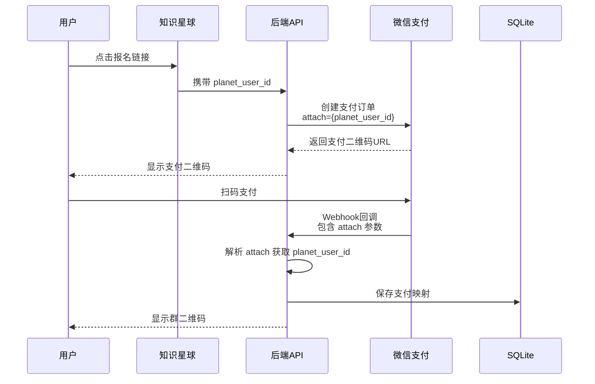
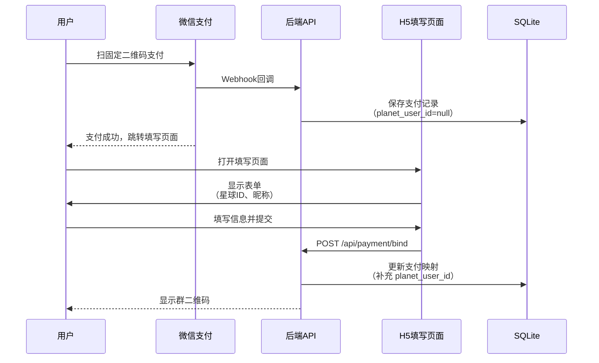

# 直接支付场景解决方案

## 问题描述

**场景**：用户不通过报名系统，而是直接扫描固定的企业微信支付二维码完成支付。

**问题**：系统无法自动建立支付订单与知识星球用户的映射关系。

**影响**：退款时无法确定该支付订单对应哪个知识星球用户。

---

## 🎯 推荐方案对比

| 方案 | 实现难度 | 用户体验 | 准确率 | 推荐度 |
|------|---------|---------|--------|--------|
| 方案1: 动态二维码 | ⭐⭐⭐ | ⭐⭐⭐⭐⭐ | 100% | ⭐⭐⭐⭐⭐ |
| 方案2: 支付后信息填写 | ⭐⭐ | ⭐⭐⭐ | 95% | ⭐⭐⭐⭐ |
| 方案3: 纯智能匹配 | ⭐ | ⭐⭐⭐⭐⭐ | 60-80% | ⭐⭐⭐ |
| 方案4: 人工录入 | ⭐ | ⭐ | 100% | ⭐⭐ |

---

## 方案 1: 动态二维码（推荐）⭐⭐⭐⭐⭐

### 核心思路

每个用户生成**唯一的支付二维码**，在二维码中编码用户标识（星球ID），支付回调时自动建立映射。

### 实现流程



### 技术实现

#### 1. 生成动态支付二维码

```javascript
// src/services/wechat-payment.service.js

class WechatPaymentService {
  /**
   * 创建支付订单（Native 支付）
   * @param {Object} params - 支付参数
   * @param {string} params.planet_user_id - 知识星球用户ID
   * @param {string} params.planet_nickname - 知识星球昵称
   * @param {string} params.checkin_id - 训练营ID
   * @param {number} params.amount - 金额（元）
   */
  async createPayment(params) {
    const out_trade_no = this.generateOrderNo();

    // 将用户信息编码到 attach 字段
    const attach = JSON.stringify({
      planet_user_id: params.planet_user_id,
      planet_nickname: params.planet_nickname,
      checkin_id: params.checkin_id
    });

    const requestBody = {
      appid: process.env.WECHAT_PAY_APPID,
      mchid: this.mchid,
      description: `知识星球训练营押金-${params.checkin_id}`,
      out_trade_no: out_trade_no,
      attach: attach,  // 关键：附加用户信息
      notify_url: `${process.env.API_BASE_URL}/api/payment/webhook`,
      amount: {
        total: Math.round(params.amount * 100),  // 元 → 分
        currency: 'CNY'
      }
    };

    const url = '/v3/pay/transactions/native';
    const response = await this.request('POST', url, requestBody);

    // 返回二维码 URL
    return {
      qr_code_url: response.code_url,
      out_trade_no: out_trade_no
    };
  }

  /**
   * 生成唯一订单号
   */
  generateOrderNo() {
    const timestamp = Date.now();
    const random = Math.random().toString(36).substring(2, 8).toUpperCase();
    return `CAMP_${timestamp}_${random}`;
  }
}
```

#### 2. 处理支付回调

```javascript
// src/routes/payment.js

router.post('/webhook', async (req, res) => {
  try {
    // 1. 验证签名
    const verified = wechatPaymentService.verifySignature(
      req.headers,
      req.body
    );

    if (!verified) {
      logger.error('微信支付签名验证失败');
      return res.json({ code: 'FAIL', message: '签名验证失败' });
    }

    // 2. 解密数据
    const decrypted = wechatPaymentService.decryptData(
      req.body.resource.ciphertext,
      req.body.resource.nonce,
      req.body.resource.associated_data
    );

    const payment = JSON.parse(decrypted);

    // 3. 检查支付状态
    if (payment.trade_state !== 'SUCCESS') {
      logger.info('支付未成功', { trade_state: payment.trade_state });
      return res.json({ code: 'SUCCESS', message: '已接收' });
    }

    // 4. 解析 attach 获取用户信息（关键）
    let userInfo = {};
    try {
      userInfo = JSON.parse(payment.attach);
    } catch (e) {
      logger.warn('attach 解析失败，将使用智能匹配', { attach: payment.attach });
    }

    // 5. 保存支付映射
    await paymentMappingService.saveMapping({
      out_trade_no: payment.out_trade_no,
      transaction_id: payment.transaction_id,
      planet_user_id: userInfo.planet_user_id || null,
      planet_nickname: userInfo.planet_nickname || null,
      wechat_nickname: payment.payer?.name || null,
      amount: payment.amount.total,
      checkin_id: userInfo.checkin_id,
      payment_time: payment.success_time
    });

    logger.info('支付映射保存成功', {
      out_trade_no: payment.out_trade_no,
      planet_user_id: userInfo.planet_user_id
    });

    // 6. 返回成功
    res.json({ code: 'SUCCESS', message: '成功' });

  } catch (error) {
    logger.error('支付回调处理失败', error);
    res.json({ code: 'FAIL', message: '处理失败' });
  }
});
```

#### 3. 生成二维码页面

```javascript
// src/routes/payment.js

/**
 * 生成支付二维码
 * GET /api/payment/qrcode?planet_user_id=xxx&checkin_id=xxx
 */
router.get('/qrcode', async (req, res) => {
  try {
    const { planet_user_id, checkin_id } = req.query;

    // 参数校验
    if (!planet_user_id || !checkin_id) {
      return res.status(400).json(
        error('缺少必需参数', 400)
      );
    }

    // 获取训练营信息
    const checkinInfo = await zsxqService.getCheckinInfo(checkin_id);

    // 创建支付订单
    const payment = await wechatPaymentService.createPayment({
      planet_user_id,
      planet_nickname: req.query.planet_nickname || '',
      checkin_id,
      amount: checkinInfo.deposit_amount || 99
    });

    res.json(success({
      qr_code_url: payment.qr_code_url,
      out_trade_no: payment.out_trade_no,
      amount: checkinInfo.deposit_amount
    }, '支付二维码生成成功'));

  } catch (err) {
    logger.error('生成支付二维码失败', err);
    next(err);
  }
});
```

### 知识星球集成

**方式 1: 在知识星球发布帖子，带上动态链接**

```
📢 第42期早起打卡营报名通道

💰 押金：99元
📅 时间：2025-12-01 ~ 2025-12-21
✅ 完成7天即可退款

👉 点击链接报名：
https://your-domain.com/payment?planet_user_id={你的星球ID}&checkin_id=842448118

⚠️ 重要：请确认链接中包含你的星球ID
```

**方式 2: 使用知识星球的"自定义菜单"功能**

在知识星球后台配置自定义菜单，链接指向：
```
https://your-domain.com/payment?planet_user_id={{planet_user_id}}&checkin_id=842448118
```

知识星球会自动替换 `{{planet_user_id}}` 为用户的真实ID。

**方式 3: 使用短链接服务**

```javascript
// 生成短链接
const shortUrl = await shortLinkService.create({
  url: `https://your-domain.com/payment?planet_user_id=${planet_user_id}&checkin_id=${checkin_id}`,
  planet_user_id: planet_user_id
});

// 短链接示例：https://s.your-domain.com/p42
```

### 优势

✅ **准确率 100%**：支付与用户直接关联
✅ **自动化**：无需用户填写额外信息
✅ **用户体验好**：扫码即付，流程简单
✅ **可追溯**：每笔支付都有明确的用户标识

### 劣势

⚠️ **需要用户点击链接**：不能使用固定二维码
⚠️ **知识星球限制**：需要确认知识星球是否支持动态链接

---

## 方案 2: 支付后信息填写 ⭐⭐⭐⭐

### 核心思路

用户扫码支付后，跳转到信息填写页面，填写星球ID建立映射。

### 实现流程



### 技术实现

#### 1. 支付回调时记录待绑定订单

```javascript
router.post('/webhook', async (req, res) => {
  // ... 验证签名和解密 ...

  // 保存支付记录（planet_user_id 为 null）
  await paymentMappingService.saveMapping({
    out_trade_no: payment.out_trade_no,
    transaction_id: payment.transaction_id,
    planet_user_id: null,  // 待绑定
    wechat_nickname: payment.payer?.name,
    amount: payment.amount.total,
    checkin_id: extractCheckinIdFromDescription(payment.description),
    payment_time: payment.success_time
  });

  res.json({ code: 'SUCCESS', message: '成功' });
});
```

#### 2. 用户填写信息绑定

```javascript
/**
 * 绑定支付订单与星球用户
 * POST /api/payment/bind
 */
router.post('/bind', async (req, res) => {
  try {
    const { out_trade_no, planet_user_id, planet_nickname } = req.body;

    // 参数校验
    if (!out_trade_no || !planet_user_id) {
      return res.status(400).json(error('缺少必需参数', 400));
    }

    // 查询支付记录
    const payment = await paymentMappingService.getByOrderNo(out_trade_no);

    if (!payment) {
      return res.status(404).json(error('支付记录不存在', 404));
    }

    if (payment.planet_user_id) {
      return res.status(400).json(error('该订单已绑定', 400));
    }

    // 更新绑定关系
    await paymentMappingService.bindUser({
      out_trade_no,
      planet_user_id,
      planet_nickname
    });

    logger.info('支付订单绑定成功', { out_trade_no, planet_user_id });

    res.json(success({}, '绑定成功'));

  } catch (err) {
    logger.error('绑定失败', err);
    next(err);
  }
});
```

#### 3. H5 填写页面

```vue
<template>
  <div class="bind-page">
    <div class="header">
      <h2>✅ 支付成功</h2>
      <p>请填写您的知识星球信息，以便退款</p>
    </div>

    <el-form :model="form" :rules="rules" ref="formRef">
      <el-form-item label="订单号" prop="out_trade_no">
        <el-input v-model="form.out_trade_no" disabled />
      </el-form-item>

      <el-form-item label="支付金额">
        <el-input :value="`¥${amount}`" disabled />
      </el-form-item>

      <el-form-item label="知识星球ID" prop="planet_user_id" required>
        <el-input
          v-model="form.planet_user_id"
          placeholder="请输入您的星球用户ID"
        />
        <div class="help-text">
          在知识星球APP → 我的 → 点击头像即可看到
        </div>
      </el-form-item>

      <el-form-item label="星球昵称" prop="planet_nickname" required>
        <el-input
          v-model="form.planet_nickname"
          placeholder="请输入您的星球昵称"
        />
      </el-form-item>

      <el-button type="primary" @click="handleSubmit" :loading="loading">
        确认并获取群二维码
      </el-button>
    </el-form>
  </div>
</template>

<script setup>
import { ref, onMounted } from 'vue';
import { useRoute, useRouter } from 'vue-router';
import { bindPayment } from '@/api/payment';

const route = useRoute();
const router = useRouter();

const form = ref({
  out_trade_no: route.query.out_trade_no || '',
  planet_user_id: '',
  planet_nickname: ''
});

const loading = ref(false);

async function handleSubmit() {
  try {
    loading.value = true;
    await bindPayment(form.value);

    // 跳转到群二维码页面
    router.push(`/qrcode?out_trade_no=${form.value.out_trade_no}`);

  } catch (error) {
    console.error('绑定失败', error);
  } finally {
    loading.value = false;
  }
}
</script>
```

### 优势

✅ **实现简单**：无需动态二维码
✅ **兼容固定二维码**：可以打印张贴
✅ **准确率高**：用户主动填写，95%+ 准确率

### 劣势

⚠️ **用户体验一般**：需要额外填写步骤
⚠️ **可能遗漏**：用户支付后可能不填写
⚠️ **需要引导**：需要明确告知用户填写

### 改进措施

1. **设置填写期限**：7天内未填写自动退款
2. **多次提醒**：通过知识星球私信提醒
3. **简化流程**：自动识别微信昵称，用户只需确认

---

## 方案 3: 纯智能匹配 ⭐⭐⭐

### 核心思路

完全依赖智能匹配算法，通过微信昵称、支付时间等信息匹配。

### 实现要点

详见 [混合方案技术设计.md](./19-v0.2-混合方案技术设计.md) 中的智能匹配算法。

### 优势

✅ **用户体验最好**：无需任何额外操作
✅ **兼容性最好**：适用于任何支付场景

### 劣势

⚠️ **准确率低**：60-80%，需要大量人工审核
⚠️ **依赖昵称**：如果昵称差异大则无法匹配

---

## 方案 4: 人工录入 ⭐⭐

### 核心思路

管理员在后台手动录入支付订单与用户的映射关系。

### 实现

```javascript
/**
 * 人工绑定
 * POST /api/payment/manual-bind
 */
router.post('/manual-bind', async (req, res) => {
  const { out_trade_no, planet_user_id, planet_nickname } = req.body;

  await paymentMappingService.bindUser({
    out_trade_no,
    planet_user_id,
    planet_nickname
  });

  logger.info('人工绑定成功', { out_trade_no, planet_user_id, operator: req.user.id });

  res.json(success({}, '绑定成功'));
});
```

### 优势

✅ **准确率 100%**：人工核对
✅ **兜底方案**：其他方案失败时使用

### 劣势

⚠️ **效率低**：需要逐个处理
⚠️ **人力成本高**：不适合大规模使用

---

## 💡 最佳实践：混合使用

### 推荐组合

```
主方案：方案1（动态二维码）
      ↓ 如果用户不走正常流程
备选方案：方案2（支付后填写）
      ↓ 如果用户没填写
兜底方案：方案3（智能匹配）+ 方案4（人工处理）
```

### 实施步骤

#### 阶段 1: 实现动态二维码（优先）

- 知识星球发布报名帖，带动态链接
- 生成带 planet_user_id 的支付二维码
- 支付回调自动建立映射

#### 阶段 2: 增加支付后填写（备选）

- 对于直接扫固定码支付的用户
- 支付成功后跳转填写页面
- 7天内未填写自动退款

#### 阶段 3: 智能匹配 + 人工审核（兜底）

- 对于仍未建立映射的用户
- 使用智能匹配算��
- 低置信度的人工审核

### 预期效果

| 方案 | 覆盖比例 | 准确率 |
|------|---------|--------|
| 动态二维码 | 80% | 100% |
| 支付后填写 | 15% | 95% |
| 智能匹配 | 4% | 70% |
| 人工处理 | 1% | 100% |

---

## 🔧 配置示例

### 环境变量

```env
# 动态二维码配置
PAYMENT_QRCODE_BASE_URL=https://your-domain.com/payment

# 支付后填写配置
PAYMENT_BIND_REQUIRED=true
PAYMENT_BIND_DEADLINE_DAYS=7

# 智能匹配配置
SMART_MATCH_ENABLED=true
SMART_MATCH_CONFIDENCE_THRESHOLD=50
```

### 知识星球报名帖模板

```markdown
# 🔥 第42期早起打卡营报名开始！

## 活动规则
- 押金：99元
- 时间：2025-12-01 ~ 2025-12-21（21天）
- 完成7天打卡即可全额退款

## 报名方式

### 方式一：推荐⭐⭐⭐⭐⭐
点击专属链接报名（自动绑定）：
https://your-domain.com/payment?planet_user_id={{你的星球ID}}&checkin_id=842448118

📌 如何获取你的星球ID：
知识星球APP → 我的 → 点击头像 → 长按复制ID

### 方式二：直接扫码
[支付二维码图片]

⚠️ 扫码后请务必填写星球ID，���则无法退款！

---

有问题请联系管理员 @星主
```

---

## 📊 数据库调整

需要在 `payment_mapping` 表中增加字段：

```sql
ALTER TABLE payment_mapping ADD COLUMN bind_status TEXT DEFAULT 'pending';
-- 值: pending | completed | expired

ALTER TABLE payment_mapping ADD COLUMN bind_deadline DATETIME;
-- 绑定截止时间

ALTER TABLE payment_mapping ADD COLUMN bind_method TEXT;
-- 值: dynamic_qrcode | user_fill | smart_match | manual
```

---

## 相关文档

- [混合方案技术设计.md](./19-v0.2-混合方案技术设计.md) - 完整技术方案
- [用户旅程图.md](./18-v0.2-用户旅程图.md) - 用户流程图
- [数据库设计.md](./数据库设计.md) - 数据库设计