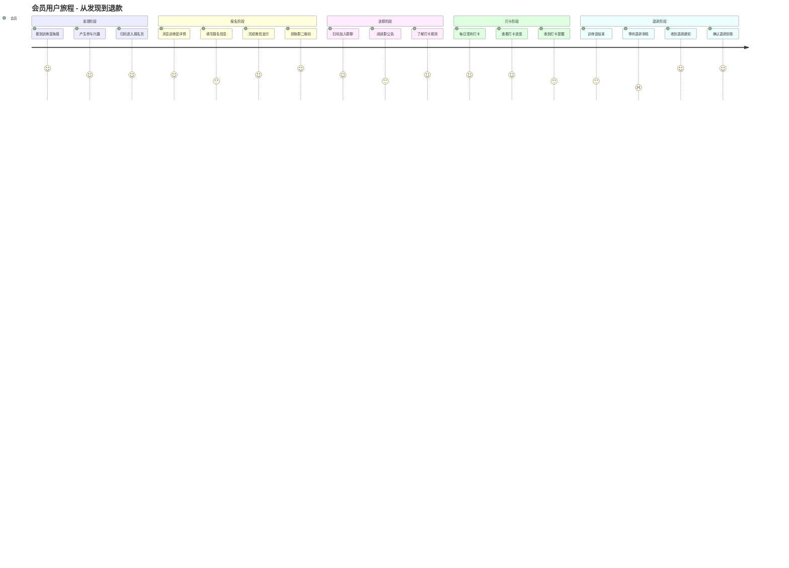
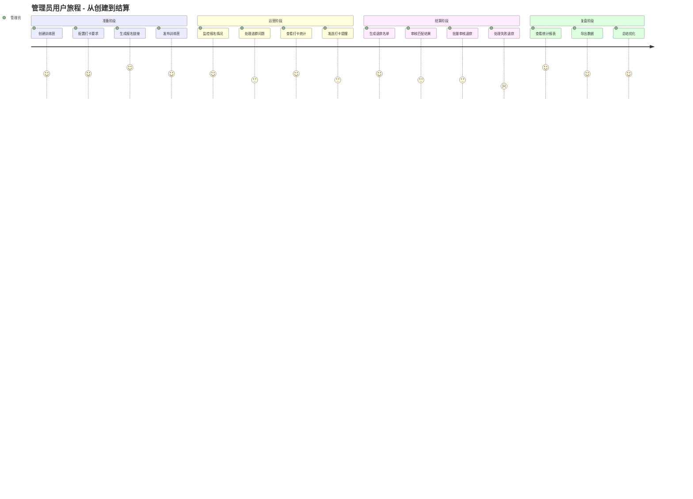
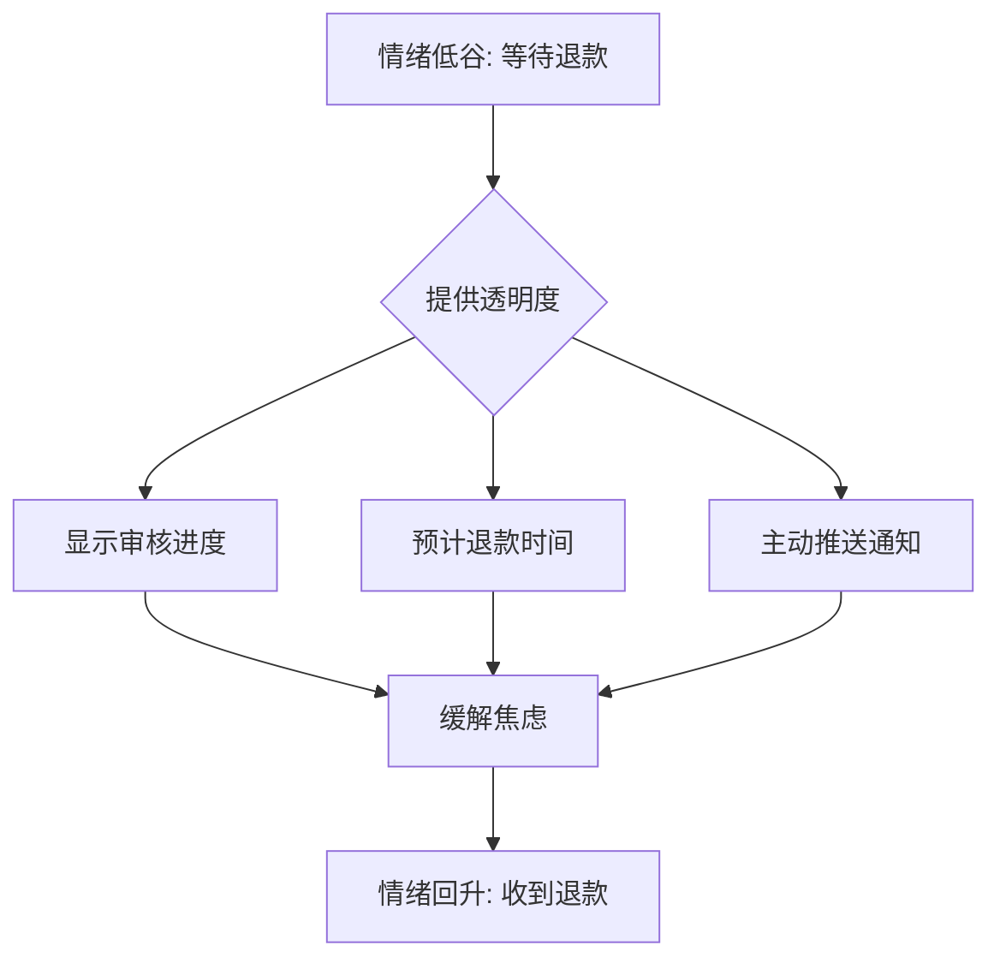
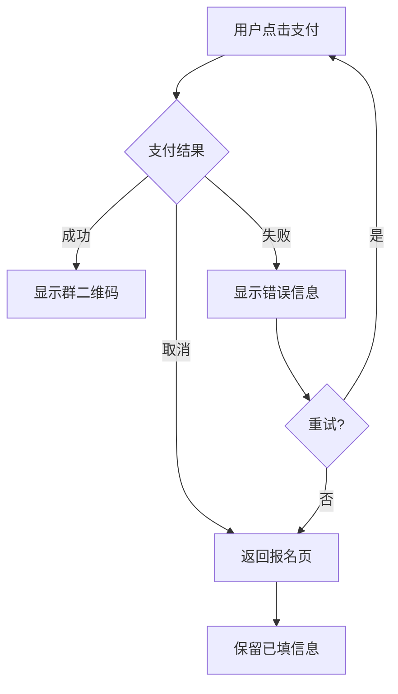
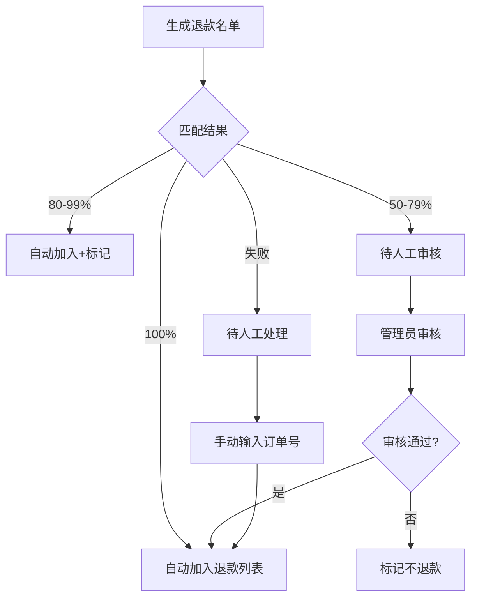

# 用户旅程图

本文档展示知识星球训练营自动押金退款系统的完整用户旅程。

---

## 一、会员端用户旅程

### 1.1 旅程概览



### 1.2 旅程详情表

| 阶段 | 触点 | 用户行为 | 期望 | 情绪 | 痛点 | 机会点 |
|------|------|----------|------|------|------|--------|
| **发现** | 知识星球/朋友圈 | 看到训练营海报 | 了解训练营详情 | 😊 期待 | 信息不够清晰 | 优化海报设计 |
| **报名** | H5 页面 | 填写信息+支付 | 快速完成报名 | 😐 紧张 | 表单复杂 | 简化必填项 |
| **进群** | 微信群 | 扫码进群 | 顺利加入 | 😊 兴奋 | 二维码过期 | 动态二维码 |
| **打卡** | 知识星球 App | 每日打卡 | 坚持完成 | 😐 坚持 | 容易忘记 | 智能提醒 |
| **退款** | 微信通知 | 查看退款 | 快速到账 | 😊 满足 | 等待时间长 | 自动化处理 |

### 1.3 会员端情绪曲线

| 阶段 | 发现 | 浏览 | 填表 | 支付 | 进群 | 打卡 | 坚持 | 等待 | 收到退款 |
|------|:----:|:----:|:----:|:----:|:----:|:----:|:----:|:----:|:--------:|
| 情绪 | 😊 | 🙂 | 😐 | 🙂 | 😊 | 🙂 | 😐 | 😟 | 😊 |
| 评分 | 5 | 4 | 3 | 4 | 5 | 4 | 3 | 2 | 5 |

```
情绪曲线示意:

5 ●───────────────────●───────────────────────────────────●
  │                   │                                   │
4 │     ●─────────────┼───●───────────●                   │
  │    ╱              │    ╲         ╱ ╲                  │
3 │   ●               │     ╲       ●   ╲                 │
  │                   │      ╲           ╲                │
2 │                   │       ╲           ●               │
  │                   │                                   │
1 └───┴───┴───┴───┴───┴───┴───┴───┴───┴───┴───┴───┴───┴───┘
  发现 浏览 填表 支付 进群 打卡 坚持 等待 退款
```

---

## 二、管理员用户旅程

### 2.1 旅程概览



### 2.2 旅程详情表

| 阶段 | 触点 | 任务 | 期望 | 情绪 | 痛点 | 机会点 |
|------|------|------|------|------|------|--------|
| **准备** | 管理后台 | 创建训练营 | 快速完成配置 | 😊 期待 | 配置项多 | 模板功能 |
| **运营** | 管理后台+群 | 监控+处理问题 | 减少人工介入 | 😐 忙碌 | 问题繁杂 | 自动化处理 |
| **结算** | 管理后台 | 审核退款 | 准确快速 | 😟 紧张 | 匹配错误 | 智能匹配 |
| **复盘** | 管理后台 | 查看报表 | 数据清晰 | 😊 满足 | 维度不够 | 多维分析 |

---

## 三、关键触点设计

### 3.1 H5 报名页面

```
┌─────────────────────────────────────┐
│  ← 返回        训练营报名            │
├─────────────────────────────────────┤
│                                     │
│  ┌───────────────────────────────┐  │
│  │                               │  │
│  │     [训练营海报图片]           │  │
│  │                               │  │
│  └───────────────────────────────┘  │
│                                     │
│  21天早起打卡训练营                  │
│  押金: ¥99    打卡要求: 15/21天      │
│                                     │
│  ─────────────────────────────────  │
│                                     │
│  请填写您的信息:                     │
│                                     │
│  星球昵称 *                          │
│  ┌───────────────────────────────┐  │
│  │                               │  │
│  └───────────────────────────────┘  │
│                                     │
│  星球ID *  [?如何获取]               │
│  ┌───────────────────────────────┐  │
│  │                               │  │
│  └───────────────────────────────┘  │
│                                     │
│  微信昵称 *                          │
│  ┌───────────────────────────────┐  │
│  │                               │  │
│  └───────────────────────────────┘  │
│                                     │
│  ┌───────────────────────────────┐  │
│  │         支付 ¥99 押金          │  │
│  └───────────────────────────────┘  │
│                                     │
│  支付成功后可获得入群二维码          │
└─────────────────────────────────────┘
```

### 3.2 群二维码展示页

```
┌─────────────────────────────────────┐
│                                     │
│          ✅ 支付成功!               │
│                                     │
│  ─────────────────────────────────  │
│                                     │
│  恭喜您成功报名                      │
│  21天早起打卡训练营                  │
│                                     │
│  ┌───────────────────────────────┐  │
│  │                               │  │
│  │                               │  │
│  │      [群二维码]               │  │
│  │                               │  │
│  │                               │  │
│  └───────────────────────────────┘  │
│                                     │
│  长按保存二维码，扫码加入训练营群    │
│                                     │
│  ─────────────────────────────────  │
│                                     │
│  ┌───────────────────────────────┐  │
│  │       查看我的打卡进度         │  │
│  └───────────────────────────────┘  │
│                                     │
└─────────────────────────────────────┘
```

### 3.3 打卡进度页

```
┌─────────────────────────────────────┐
│  ← 返回        打卡进度             │
├─────────────────────────────────────┤
│                                     │
│  21天早起打卡训练营                  │
│  第 15 天 / 共 21 天                 │
│                                     │
│  ═════════════════════════════════  │
│  ████████████████░░░░░░░  71%       │
│  ═════════════════════════════════  │
│                                     │
│  ─────────────────────────────────  │
│                                     │
│  打卡统计                            │
│                                     │
│  已打卡        要求打卡       状态   │
│    12 天        15 天        🔴 差3天 │
│                                     │
│  ─────────────────────────────────  │
│                                     │
│  打卡日历                            │
│  ┌───┬───┬───┬───┬───┬───┬───┐    │
│  │ 一 │ 二 │ 三 │ 四 │ 五 │ 六 │ 日 │    │
│  ├───┼───┼───┼───┼───┼───┼───┤    │
│  │ ✓ │ ✓ │ ✓ │ ✓ │ ✓ │ ✓ │ ✓ │    │
│  ├───┼───┼───┼───┼───┼───┼───┤    │
│  │ ✓ │ ✓ │ ✗ │ ✓ │ ✓ │ ✗ │ ✓ │    │
│  ├───┼───┼───┼───┼───┼───┼───┤    │
│  │ ○ │   │   │   │   │   │   │    │
│  └───┴───┴───┴───┴───┴───┴───┘    │
│                                     │
│  ✓ 已打卡  ✗ 未打卡  ○ 今天          │
│                                     │
│  ─────────────────────────────────  │
│                                     │
│  退款状态: ⏳ 训练营进行中            │
│                                     │
└─────────────────────────────────────┘
```

---

## 四、关键时刻 (Moments of Truth)

### 4.1 真相时刻识别

| 时刻 | 触发点 | 用户期望 | 失败后果 | 设计对策 |
|------|--------|----------|----------|----------|
| **MOT1: 支付** | 点击支付按钮 | 3秒内跳转支付 | 放弃报名 | 预加载支付参数 |
| **MOT2: 进群** | 支付成功后 | 立即看到二维码 | 无法入群 | Webhook 实时处理 |
| **MOT3: 退款** | 训练营结束 | 24小时内收到 | 投诉/差评 | 自动化退款流程 |

### 4.2 情绪低谷处理



---

## 五、异常流程处理

### 5.1 支付异常



### 5.2 匹配异常



---

## 六、体验优化建议

### 6.1 短期优化（1 个月内）

| 优化项 | 当前问题 | 优化方案 | 预期效果 |
|--------|----------|----------|----------|
| 表单预填 | 每次重新填写 | 记住上次填写的信息 | 报名时间 -50% |
| 进度可视化 | 纯文字描述 | 日历+进度条 | 用户满意度 +20% |
| 退款通知 | 无主动通知 | 企业微信推送 | 咨询量 -30% |

### 6.2 中期优化（3 个月内）

| 优化项 | 当前问题 | 优化方案 | 预期效果 |
|--------|----------|----------|----------|
| 智能提醒 | 无打卡提醒 | 每日定时提醒 | 完成率 +15% |
| 动态二维码 | 固定二维码可能过期 | 动态生成+自动刷新 | 入群成功率 +10% |
| 多维报表 | 统计维度单一 | 时间/教练/项目多维 | 运营效率 +30% |

---

## 相关文档

- [业务流程图](./业务流程图.md)
- [时序图](./时序图.md)
- [状态机](./状态机.md)
- [架构设计图](./架构设计图.md)
