# 知识星球训练营自动押金退款系统 - 技术方案

| **版本** | v1.1       |
| -------- |------------|
| **作者** | 易安系统架构师    |
| **日期** | 2025-12-06 |
| **状态** | 已发布        |
| **SSOT引用** | [状态枚举定义.md](./状态枚举定义.md) |

**修订记录**

| 版本 | 修订内容 | 日期 | 编制人 |
|------|----------|------|--------|
| v0.1 | 初版（基于传统模板） | 2025-10-24 | - |
| v0.2 | 重构为 AI 协作版，增加用户旅程、故事卡片、C4 架构 | 2025-11-29 | - |
| v1.0 | 整合所有文档为统一技术方案，发布版 | 2025-12-05 | - |
| v1.1 | 修复文档链接，添加 SSOT 引用，统一状态值大小写 | 2025-12-06 | - |

---

## 目录

1. [名词解释](#一名词解释)
2. [需求背景](#二需求背景)
3. [需求分析](#三需求分析)
4. [概要设计](#四概要设计)
5. [详细设计](#五详细设计)
6. [风险与应对](#六风险与应对)
7. [测试方案](#七测试方案)
8. [指标监控](#八指标监控)
9. [上线方案](#九上线方案)
10. [参考文献](#十参考文献)
11. [附录：AI 协作增强](#附录ai-协作增强)

---

# 一、名词解释

| 术语 | 解释 |
|------|------|
| **知识星球** | 知识付费社群平台，用户在此打卡学习 |
| **训练营** | 限时打卡活动，会员缴纳押金参与 |
| **押金** | 会员报名时缴纳的保证金，完成打卡后退还 |
| **打卡** | 会员在知识星球发布学习内容的行为 |
| **H5 报名链接** | 用户通过微信 OAuth 登录后访问的报名页面 |
| **固定二维码** | 微信收款码，用户扫码后需手动填写星球信息 |
| **bind_status** | 绑定状态：pending/completed/expired/manual_review/closed |
| **bind_method** | 绑定方式：h5_bindplanet/user_fill/manual |
| **宽限天数** | 打卡天数计算时额外给予的宽限（默认1天） |
| **微信 OAuth** | 微信公众号授权登录，用于获取用户微信身份 |
| **微信 OpenID** | 微信公众号用户唯一标识，同一用户在不同公众号下 OpenID 不同 |
| **access_token** | 系统访问票据，格式 `tk_` + UUID，用于 H5 敏感接口认证 |

---

# 二、需求背景

## 2.1 业务现状

目前知识星球训练营的押金收取、打卡核对、退款操作全部手动完成：
- 每月有 **5-10 个训练营**同时进行
- 单个训练营最多 **1000 人**参与
- 人工处理工作量巨大，效率低且容易出错

## 2.2 核心痛点

| 痛点 | 描述 | 影响 |
|------|------|------|
| 身份匹配困难 | 支付微信名与星球昵称不一致 | 退款错误、投诉增加 |
| 手动操作繁琐 | 导出→对比→退款→通知全手工 | 单营耗时 2-4 小时 |
| 数据分散 | 支付在微信、打卡在星球 | 核对困难、易遗漏 |
| 响应延迟 | 退款依赖人工排期 | 用户体验差 |

## 2.3 建设目标

构建一套自动化系统，实现：
- **自动化支付流程**：会员支付押金后立即获得入群二维码
- **自动化数据同步**：每日自动同步知识星球打卡数据
- **混合匹配识别**：多种方式确保身份匹配准确率
- **半自动退款**：系统判断 + 人工审核 + 自动退款

---

# 三、需求分析

## 3.1 用户角色

| 角色 | 描述 | 主要目标 |
|------|------|----------|
| **超级管理员** | 星主本人 | 系统配置、全局管理 |
| **管理员** | 运营人员 | 审核退款、查看报表 |
| **教练** | 项目教练 | 查看负责项目、催促打卡 |
| **志愿者** | 项目志愿者 | 查看项目、催促打卡 |
| **会员** | 知识星球会员 | 支付押金、打卡、获取退款 |

## 3.2 核心诉求

### 会员诉求
- 支付后快速获得入群方式
- 实时查看打卡进度
- 及时收到退款

### 管理员诉求
- 减少手动操作时间
- 准确的身份匹配
- 清晰的数据报表

## 3.3 目标与指标

| 指标 | 当前值 | 目标值 | 验证方式 |
|------|--------|--------|----------|
| 人工操作时间 | 100% | < 10% | 操作日志统计 |
| 退款准确率 | 95% | 100% | 退款结果审计 |
| 支付到进群时间 | 人工处理 | < 3 秒 | 接口响应监控 |
| 单营处理时间 | 2-4 小时 | < 10 分钟 | 计时测试 |

## 3.4 非目标（Scope Out）

- ❌ 本次不包含：会员端 App 开发（仅 H5）
- ❌ 暂不支持：多知识星球管理
- ❌ 后续版本再考虑：积分激励体系、数据预测分析

## 3.5 验收标准

| Story ID | 功能点 | 验收标准 | 优先级 |
|----------|--------|----------|--------|
| S1.1 | 创建训练营 | 填写表单后成功创建，生成报名链接 | P0 |
| S2.1 | 支付押金 | 微信支付成功后显示群二维码 | P0 |
| S2.2 | 支付回调 | Webhook 3 秒内处理完成，保存支付映射 | P0 |
| S2.3 | 支付后绑定 | 固定二维码用户可通过 H5 页面绑定星球信息 | P0 |
| S3.1 | 打卡同步 | 每日 01:00 自动同步，失败告警 | P0 |
| S4.1 | 绑定处理 | H5 主路径自动绑定，降级路径用户填写或人工处理 | P0 |
| S5.1 | 审核退款 | 管理员可批量审核通过/拒绝 | P0 |
| S5.2 | 执行退款 | 调用微信退款 API 成功率 ≥ 99% | P0 |

---

# 四、概要设计

## 4.1 支付-身份绑定方案

采用 **H5 主路径 + 降级路径** 双路径方案（互斥）：

| 支付方式 | 覆盖率 | 准确率 | 实现方式 |
|----------|--------|--------|----------|
| H5 主路径 | 80% | 100% | 用户 OAuth 登录后绑定星球身份，直接支付 |
| 降级路径-用户填写 | 15% | 95% | 用户扫固定二维码支付后，H5 页面填写星球信息 |
| 人工处理 | 5% | 100% | 超时未绑定或信息异常由管理员人工绑定 |

## 4.2 技术选型

| 层级 | 技术选型 | 版本 | 选型理由 |
|------|---------|------|----------|
| **后端语言** | Java | 17+ | 企业级稳定性 |
| **后端框架** | Spring Boot | 3.2+ | 生态成熟 |
| **数据库** | PostgreSQL | 15+ | JSONB 支持强 |
| **缓存** | Redis | 7.x | 高性能缓存 |
| **消息队列** | RabbitMQ | 3.12+ | 事务性消息 |
| **前端框架** | Vue 3 | 3.3+ | 组合式 API |
| **H5 UI** | Vant | 4.x | 移动端友好 |
| **后台 UI** | Element Plus | 2.4+ | 企业级组件 |
| **OAuth认证** | 微信公众号 OAuth 2.0 | - | 用户身份识别（详见 [OAuth安全指南](../security/OAuth安全指南.md)） |

### ADR-001: 数据库选型决策

**考虑的方案**：

| 方案 | 优点 | 缺点 |
|------|------|------|
| MySQL | 生态成熟、运维熟悉 | JSON 支持弱 |
| PostgreSQL | JSON 支持强、功能丰富 | 运维经验相对少 |

**决策**：选择 PostgreSQL 15+

**理由**：
- 强大的 JSONB 支持，适合存储 API 响应
- 完善的事务和并发控制
- 云服务商支持完善

## 4.3 系统上下文（C4 Level 1）

```mermaid
C4Context
    title 系统上下文图 - 知识星球训练营押金退款系统

    Person(member, "会员", "知识星球会员，参与训练营打卡")
    Person(admin, "管理员", "运营人员，管理训练营和审核退款")
    Person(coach, "教练", "项目教练，查看负责项目数据")

    System(campSystem, "训练营押金退款系统", "自动化处理报名支付、打卡同步、身份匹配、退款审核")

    System_Ext(zsxq, "知识星球", "提供打卡数据API")
    System_Ext(wechatPay, "微信支付", "处理收款和退款")
    System_Ext(wechatWork, "企业微信", "消息通知推送")

    Rel(member, campSystem, "报名支付、查看进度", "H5/HTTPS")
    Rel(admin, campSystem, "管理训练营、审核退款", "Web/HTTPS")
    Rel(coach, campSystem, "查看项目数据", "Web/HTTPS")

    Rel(campSystem, zsxq, "同步打卡数据", "REST API")
    Rel(campSystem, wechatPay, "创建支付、执行退款", "REST API")
    Rel(campSystem, wechatWork, "发送通知消息", "REST API")
```

## 4.4 容器架构（C4 Level 2）

> **部署形态说明**：v1 采用单节点部署，所有服务运行在一台服务器上。消息队列（RabbitMQ）为**可选扩展**，初期使用 Spring 内置的异步任务替代，后续根据负载情况启用。

```mermaid
C4Container
    title 容器图 - 系统内部结构（单节点部署）

    Person(member, "会员")
    Person(admin, "管理员")

    System_Boundary(system, "训练营押金退款系统") {
        Container(h5Web, "H5 会员端", "Vue 3, Vant UI", "报名支付、进度查询、退款查看")
        Container(adminWeb, "Web 管理后台", "Vue 3, Element Plus", "训练营管理、退款审核、统计报表")

        Container(apiServer, "API 服务", "Spring Boot 3.2, Java 17", "核心业务逻辑、RESTful API、SSL 终止、限流")

        Container(scheduler, "定时任务", "Spring Scheduler", "打卡同步、退款执行、数据清理")

        ContainerDb(postgres, "PostgreSQL", "PostgreSQL 15", "业务数据存储")
        ContainerDb(redis, "Redis", "Redis 7", "缓存、会话、限流计数")
    }

    System_Ext(zsxq, "知识星球 API")
    System_Ext(wechatPay, "微信支付")
    System_Ext(wechatWork, "企业微信通知")

    Rel(member, h5Web, "使用", "HTTPS")
    Rel(admin, adminWeb, "使用", "HTTPS")

    Rel(h5Web, apiServer, "调用", "HTTPS/REST")
    Rel(adminWeb, apiServer, "调用", "HTTPS/REST")

    Rel(apiServer, postgres, "读写", "JDBC")
    Rel(apiServer, redis, "缓存", "Redis Protocol")

    Rel(scheduler, apiServer, "调用", "内部方法")

    Rel(apiServer, zsxq, "同步打卡", "HTTPS/REST")
    Rel(apiServer, wechatPay, "支付/退款", "HTTPS/REST")
    Rel(apiServer, wechatWork, "通知", "HTTPS/REST")
```

**扩展路径**（后续容量提升时启用）：
| 阶段 | 触发条件 | 扩展组件 |
|------|----------|----------|
| 阶段 1 | 当前 | 单节点 API + PostgreSQL + Redis |
| 阶段 2 | 并发 > 100 QPS | 添加 Nginx 反向代理 |
| 阶段 3 | 异步任务积压 | 引入 RabbitMQ 消息队列 |
| 阶段 4 | 需要高可用 | 双节点 API + PostgreSQL 主从 |

---

# 五、详细设计

## 5.1 用户旅程

> **⚠️ 2025-12 更新说明**：
> - 原"动态二维码路径"依赖 H5 能获取星球登录态，实际不可行
> - 新方案采用**微信公众号 OAuth 登录 + 手动填写星球信息**模式
> - 详见下方"主路径（OAuth + 绑定）"和"降级路径（固定二维码）"

### 5.1.0 用户报名流程概览（新）

```mermaid
flowchart TD
    A[用户点击 H5 链接] --> B{是否已登录?}
    B -->|否| C[跳转微信 OAuth 授权]
    C --> D[创建/获取 wechat_user]
    B -->|是| D
    D --> E{星球是否已绑定?}
    E -->|否| F[显示绑定页面]
    F --> G[用户填写星球昵称/ID]
    G --> H{本地验证}
    H -->|验证通过| I[绑定成功]
    H -->|未找到/不匹配| J[提示风险后允许继续]
    J --> I
    E -->|是| K[进入训练营页面]
    I --> K
    K --> L{当前训练营状态?}
    L -->|未报名| M[显示报名页]
    L -->|已报名未支付| N[显示待支付页]
    L -->|已报名已支付| O[显示进度查询页]
    M --> P[确认并支付]
    P --> Q[支付成功 → 显示群二维码]
```

### 5.1.1 用户旅程概要

支持三种用户路径：

| 路径 | 覆盖率 | 准确率 | 特点 |
|-----|--------|--------|------|
| **主路径（OAuth + 绑定）** | 80% | 100% | 推荐，OAuth 登录后绑定星球身份 |
| **降级路径（固定二维码）** | 15% | 95% | 扫固定码支付后手动填写星球信息 |
| **人工处理路径** | 5% | 100% | 超时未绑定由管理员处理 |

### 5.1.2 关键时刻 (Moments of Truth)

| 时刻 | 触发点 | 用户期望 | 设计对策 |
|------|--------|----------|----------|
| **MOT1: 支付** | 点击支付按钮 | 3秒内跳转 | 预加载支付参数 |
| **MOT2: 进群** | 支付成功后 | 立即看到二维码 | Webhook 实时处理 |
| **MOT3: 退款** | 训练营结束 | 24小时内收到 | 自动化退款流程 |

### 5.1.3 详细图表

> **📊 完整用户旅程图、UI 原型、情绪曲线** → 详见 [用户旅程图](../diagrams/用户旅程图.md)

## 5.2 业务流程设计

### 5.2.1 训练营全生命周期

```mermaid
flowchart TB
    subgraph 准备阶段
        A1[创建训练营] --> A2[配置打卡要求]
        A2 --> A3[设置押金金额]
        A3 --> A4[生成报名链接]
        A4 --> A5[发布训练营]
    end

    subgraph 报名阶段
        B1[会员扫码] --> B2[填写报名信息]
        B2 --> B3[支付押金]
        B3 --> B4[获取群二维码]
        B4 --> B5[加入训练营群]
    end

    subgraph 进行阶段
        C1[每日打卡提醒] --> C2[会员打卡]
        C2 --> C3[打卡数据同步]
        C3 --> C4[进度统计更新]
        C4 --> C1
    end

    subgraph 结算阶段
        D1[训练营结束] --> D2[获取打卡数据]
        D2 --> D3[计算合格名单]
        D3 --> D4[匹配支付记录]
        D4 --> D5[生成退款名单]
        D5 --> D6[管理员审核]
        D6 --> D7[执行退款]
        D7 --> D8[通知会员]
    end

    A5 --> B1
    B5 --> C1
    C4 -.->|训练营结束| D1
```

### 5.2.2 核心业务流程概要

| 流程 | 说明 | 关键节点 |
|-----|------|---------|
| **报名支付** | H5 主路径 vs 降级路径（互斥） | OAuth → 绑定 → 支付 → 显示群二维码 |
| **退款审核** | 仅已绑定用户自动退款，未绑定需人工处理 | 生成名单 → 审核 → 执行退款 |
| **绑定处理** | 用户主动绑定或管理员人工处理 | pending → completed/expired → manual_review |
| **打卡同步** | 定时从知识星球 API 同步 | API 获取 → 解析 → 宽限规则 → 合格判定 |
| **异常处理** | 支付/同步/退款三类异常 | 重试 → 告警 → 人工处理 |

### 5.2.3 详细流程图

> **📊 完整业务流程图（报名/退款/绑定/同步/异常处理）** → 详见 [业务流程图](../diagrams/业务流程图.md)

## 5.3 时序图设计

### 5.3.1 核心时序概要

| 场景 | 参与者 | 关键步骤 |
|-----|--------|---------|
| **支付回调** | 微信支付→API→DB→H5 | 签名验证 → 幂等检查 → 解析attach → 绑定处理 |
| **固定码支付+绑定** | 会员→微信→API→H5 | 支付回调(无attach) → 保存pending → 用户填写 → 绑定完成 |
| **打卡同步** | Scheduler→API→知识星球 | 定时触发 → API调用 → 翻页处理 → 统计计算 |
| **退款执行** | Admin→API→MQ→退款服务→微信 | 批量审核 → 消息队列 → 调用API → 成功/重试 |
| **绑定超时** | Scheduler→API→Notify | 定时检查 → 更新expired → 转人工审核 |
| **Cookie过期** | Scheduler→API→Alert | 识别401 → 暂停同步 → 告警通知 → 人工更新 |

### 5.3.2 详细时序图

> **📊 完整时序图（支付/绑定/同步/退款/异常）** → 详见 [时序图](../diagrams/时序图.md)

## 5.4 状态机设计

### 5.4.1 核心状态机概要

| 实体 | 状态流转 | 关键转换点 |
|-----|---------|-----------|
| **训练营** | 草稿→待发布→报名中→进行中→已结束→结算中→已归档 | 发布/开始/结束/结算 |
| **支付映射绑定** | 待绑定→已绑定 / 待绑定→已过期→人工审核→已关闭 | 用户填写/超时/人工处理 |
| **订单/支付** | 待支付→支付中→已支付→退款中→已退款 | 支付成功/发起退款/退款成功 |
| **退款** | 待审核→审核通过→待退款→退款中→退款成功 | 审核/执行/完成 |
| **打卡同步** | 待同步→同步中→同步成功/失败 | 定时触发/API调用 |
| **用户打卡** | 未开始→进行中→已完成/未达标→待退款→已退款 | 开始/达标判定/退款 |

### 5.4.2 绑定状态说明

> 状态值引用 [状态枚举定义.md](./状态枚举定义.md#1-bind_status---支付绑定状态)

| 状态 | 编码 | bind_method | 说明 |
|-----|------|-------------|------|
| 已绑定（H5） | `completed` | `h5_bindplanet` | 主路径 OAuth 支付 |
| 已绑定（填写） | `completed` | `user_fill` | 降级路径用户填写 |
| 已绑定（人工） | `completed` | `manual` | 管理员手动绑定 |
| 待绑定 | `pending` | - | 等待用户填写 |
| 已过期 | `expired` | - | 超过7天未绑定 |
| 人工审核中 | `manual_review` | - | 等待管理员处理 |
| 已关闭 | `closed` | - | 无法匹配 |

### 5.4.3 详细状态机图

> **📊 完整状态机图（训练营/支付/绑定/退款/同步）** → 详见 [状态机](../diagrams/状态机.md)

## 5.5 组件设计（C4 Level 3）

```mermaid
C4Component
    title API 服务组件图（含混合匹配方案）

    Container_Boundary(api, "API 服务") {
        Component(campCtrl, "CampController", "Controller", "训练营 CRUD 接口")
        Component(payCtrl, "PaymentController", "Controller", "支付相关接口")
        Component(bindCtrl, "BindController", "Controller", "支付绑定接口（新增）")
        Component(authCtrl, "AuthController", "Controller", "OAuth认证接口")
        Component(refundCtrl, "RefundController", "Controller", "退款相关接口")
        Component(statsCtrl, "StatsController", "Controller", "统计报表接口")
        Component(webhookCtrl, "WebhookController", "Controller", "回调处理接口")

        Component(campSvc, "CampService", "Service", "训练营业务逻辑")
        Component(paySvc, "PaymentService", "Service", "支付业务逻辑")
        Component(bindSvc, "PaymentBindService", "Service", "支付绑定服务（新增）")
        Component(authSvc, "FastAuthService", "Service", "OAuth认证服务 - 详见FastAuth接入方案§3.4")
        Component(checkinSvc, "CheckinService", "Service", "打卡业务逻辑 - 同步逻辑详见FastAuth接入方案§2.5")
        Component(matchSvc, "MatchService", "Service", "身份匹配逻辑")
        Component(refundSvc, "RefundService", "Service", "退款业务逻辑")
        Component(statsSvc, "StatsService", "Service", "统计业务逻辑")

        Component(campMapper, "CampMapper", "DAO", "训练营数据访问")
        Component(memberMapper, "MemberMapper", "DAO", "会员数据访问")
        Component(orderMapper, "PaymentMapper", "DAO", "支付记录数据访问（含绑定信息）")
        Component(bindLogMapper, "PaymentBindStatusLogMapper", "DAO", "绑定状态日志访问")
        Component(authSessionMapper, "AuthSessionMapper", "DAO", "认证会话数据访问")
        Component(refundMapper, "RefundMapper", "DAO", "退款数据访问")

        Component(zsxqMgr, "PlanetApiManager", "Manager", "知识星球 API 封装")
        Component(wxPayMgr, "WechatPayManager", "Manager", "微信支付 API 封装")
        Component(wxMsgMgr, "WechatMsgManager", "Manager", "企业微信消息封装")
        Component(wxOAuthMgr, "WechatOAuthManager", "Manager", "微信公众号 OAuth 封装")
    }

    Rel(campCtrl, campSvc, "调用")
    Rel(payCtrl, paySvc, "调用")
    Rel(bindCtrl, bindSvc, "调用")
    Rel(authCtrl, authSvc, "调用")
    Rel(refundCtrl, refundSvc, "调用")
    Rel(statsCtrl, statsSvc, "调用")
    Rel(webhookCtrl, paySvc, "调用")
    Rel(webhookCtrl, bindSvc, "调用")

    Rel(campSvc, campMapper, "调用")
    Rel(paySvc, orderMapper, "调用")
    Rel(paySvc, wxPayMgr, "调用")
    Rel(bindSvc, orderMapper, "调用")
    Rel(bindSvc, bindLogMapper, "调用")
    Rel(bindSvc, matchSvc, "调用")
    Rel(authSvc, authSessionMapper, "调用")
    Rel(authSvc, wxOAuthMgr, "调用")
    Rel(authSvc, memberMapper, "调用")
    Rel(checkinSvc, zsxqMgr, "调用")
    Rel(checkinSvc, memberMapper, "调用")
    Rel(matchSvc, memberMapper, "调用")
    Rel(matchSvc, orderMapper, "调用")
    Rel(refundSvc, refundMapper, "调用")
    Rel(refundSvc, matchSvc, "调用")
    Rel(refundSvc, wxPayMgr, "调用")
    Rel(refundSvc, wxMsgMgr, "调用")
```

### 5.5.1 项目结构

```
src/main/java/com/example/camp/
├── CampApplication.java                    # 启动类
├── config/                                 # 配置类
│   ├── WebMvcConfig.java
│   ├── SecurityConfig.java
│   ├── RedisConfig.java
│   └── MyBatisPlusConfig.java
├── controller/                             # 控制器层
│   ├── admin/                              # 管理端接口
│   │   ├── CampController.java
│   │   ├── MemberController.java
│   │   ├── RefundController.java
│   │   └── StatisticsController.java
│   ├── auth/                               # 认证接口
│   │   └── AuthController.java             # OAuth 授权、回调、绑定（详见FastAuth接入方案§2.7.1）
│   ├── h5/                                 # H5端接口
│   │   ├── CampH5Controller.java
│   │   ├── PaymentH5Controller.java
│   │   └── ProgressH5Controller.java
│   └── webhook/                            # Webhook接口
│       └── WechatPayWebhookController.java
├── service/                                # 服务层
│   ├── CampService.java
│   ├── MemberService.java
│   ├── PaymentService.java
│   ├── PaymentBindService.java          # 支付绑定服务（新增）
│   ├── FastAuthService.java             # OAuth认证服务（详见FastAuth接入方案§3.4）
│   ├── CheckinService.java              # 打卡服务（会员同步详见FastAuth接入方案§2.5）
│   ├── MatchService.java
│   ├── RefundService.java
│   └── impl/
├── manager/                                # 第三方API封装
│   ├── WechatPayManager.java
│   ├── WechatOAuthManager.java          # 微信公众号 OAuth 封装（详见FastAuth接入方案§3.4.1）
│   ├── PlanetApiManager.java            # 知识星球 API（会员同步详见FastAuth接入方案§2.4.1）
│   └── WechatNotifyManager.java
├── mapper/                                 # 数据访问层
│   ├── CampMapper.java
│   ├── MemberMapper.java
│   ├── PaymentMapper.java                 # 支付记录（含绑定信息）
│   ├── PaymentBindStatusLogMapper.java    # 绑定状态日志
│   ├── AuthSessionMapper.java             # 认证会话（FastAuth 数据库设计详见FastAuth接入方案§3.5）
│   └── RefundMapper.java
├── entity/                                 # 实体类
├── dto/                                    # 数据传输对象
├── enums/                                  # 枚举类
│   ├── CampStatus.java
│   ├── PaymentStatus.java
│   ├── BindStatus.java                     # 绑定状态枚举（新增）
│   ├── PaymentBindMethod.java              # 绑定方式枚举（新增）
│   ├── MatchStatus.java
│   └── RefundStatus.java
├── common/                                 # 公共类
│   ├── Result.java
│   ├── PageResult.java
│   └── exception/
├── schedule/                               # 定时任务
│   ├── CheckinSyncTask.java
│   └── BindExpireTask.java                 # 绑定超时检查（新增）
└── util/                                   # 工具类
```

### 5.5.2 核心服务接口

```java
// PaymentBindService（支付绑定服务 - 新增）
public interface PaymentBindService {
    // 处理支付回调，创建/更新映射
    void handlePaymentCallback(PaymentCallbackDTO callback);

    // 用户填写绑定（降级路径）
    void bindByUserFill(String orderNo, String planetMemberNumber, String nickname);

    // 检查并更新过期映射，转入人工审核（定时任务调用）
    void checkAndExpireBindings();

    // 查询绑定状态
    BindStatusVO getBindStatus(String orderNo);

    // 人工绑定（管理员操作）
    void manualBind(Long paymentId, String planetMemberNumber, Long operatorId);

    // 关闭订单（管理员操作）
    void closePayment(Long paymentId, String reason, Long operatorId);
}
```

```java
// RefundService（退款服务）
public interface RefundService {
    void generateRefundList(Long campId);
    void approveRefund(Long refundId, Long operatorId);
    void batchApprove(List<Long> refundIds, Long operatorId);
    void executeRefund(Long refundId);
    void retryFailedRefund(Long refundId);
}
```

```java
// FastAuthService（OAuth认证服务）
// 完整实现详见：FastAuth接入方案 §3.4.2-3.4.4
public interface FastAuthService {
    // 生成微信授权URL
    AuthorizeUrlVO generateAuthorizeUrl(String redirectUri, String state);

    // 处理OAuth回调，创建/更新会话
    AuthCallbackResult handleOAuthCallback(String code, String state);

    // 绑定知识星球账号
    BindPlanetResult bindPlanetAccount(String accessToken, String planetUserId, String nickname);

    // 验证 access_token
    AuthSession validateAccessToken(String accessToken);

    // 清理过期会话（定时任务调用）
    void cleanupExpiredSessions();
}
```

### 5.5.3 枚举类定义

```java
// BindStatus.java - 绑定状态枚举
public enum BindStatus {
    PENDING("pending", "待绑定"),           // 降级路径支付后
    COMPLETED("completed", "已绑定"),       // 绑定成功
    EXPIRED("expired", "已过期"),           // 7天未绑定
    MANUAL_REVIEW("manual_review", "人工审核中"),  // 超时转入人工审核
    CLOSED("closed", "已关闭");             // 无法匹配

    private final String code;
    private final String desc;
}

// PaymentBindMethod.java - 绑定方式枚举
public enum PaymentBindMethod {
    H5_BINDPLANET("h5_bindplanet", "H5绑定"),    // H5主路径：OAuth登录后绑定
    USER_FILL("user_fill", "用户填写"),          // 降级路径：用户填写星球信息
    MANUAL("manual", "人工绑定");                // 管理员操作

    private final String code;
    private final String desc;
}
```

### 5.5.4 核心模块交互

```mermaid
flowchart LR
    subgraph 前端层
        H5[H5 会员端]
        Admin[管理后台]
    end

    subgraph 接入层
        Gateway[API 网关]
    end

    subgraph 业务层
        Camp[训练营模块]
        Member[会员模块]
        Payment[支付模块]
        Checkin[打卡模块]
        Match[匹配模块]
        Refund[退款模块]
    end

    subgraph 数据层
        DB[(PostgreSQL)]
        Cache[(Redis)]
        MQ[RabbitMQ]
    end

    H5 --> Gateway
    Admin --> Gateway
    Gateway --> Camp
    Gateway --> Member
    Gateway --> Payment

    Camp --> DB
    Member --> DB
    Payment --> DB
    Payment --> Cache
    Checkin --> DB
    Match --> DB
    Match --> Cache
    Refund --> DB
    Refund --> MQ

    Camp --> Member
    Payment --> Member
    Match --> Member
    Match --> Payment
    Refund --> Match
    Refund --> Payment
```

### 5.5.5 核心领域模型

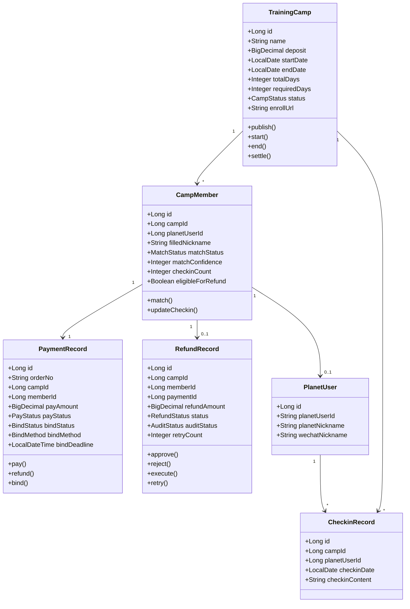

### 5.5.6 核心服务接口

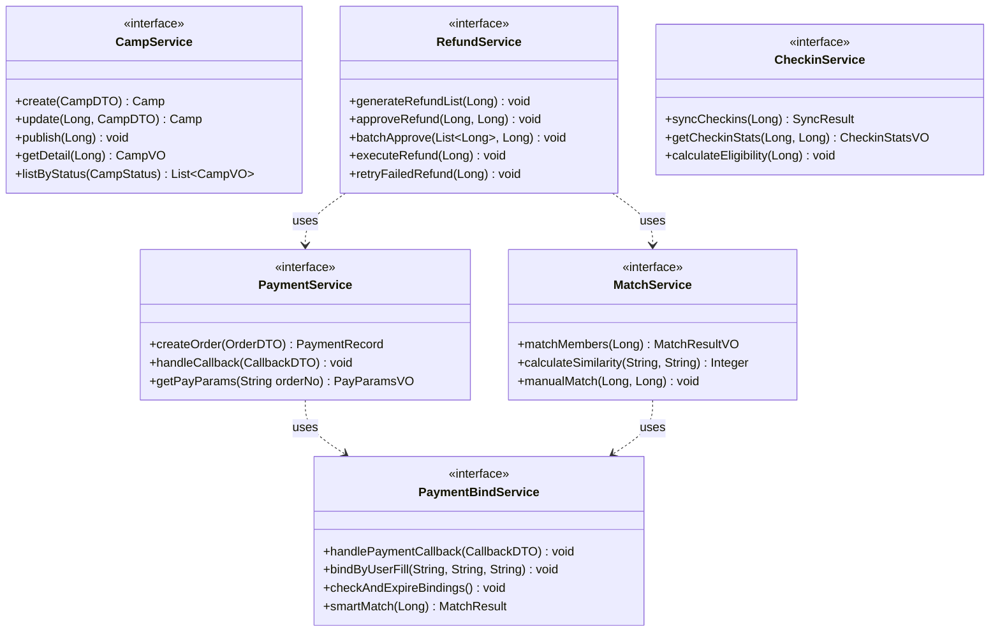

### 5.5.7 核心数据流

```mermaid
flowchart TD
    subgraph 数据输入
        A1[H5 报名表单]
        A2[支付回调 Webhook]
        A3[知识星球打卡 API]
        A4[管理员审核操作]
    end

    subgraph 数据处理
        B1[报名信息校验]
        B2[支付映射处理]
        B3[打卡数据同步]
        B4[身份匹配计算]
        B5[退款审核处理]
    end

    subgraph 数据存储
        C1[(会员表)]
        C2[(支付表)]
        C3[(打卡表)]
        C4[(退款表)]
    end

    subgraph 数据输出
        D1[群二维码展示]
        D2[打卡进度查询]
        D3[退款结果通知]
        D4[统计报表导出]
    end

    A1 --> B1 --> C1
    A2 --> B2 --> C2
    A3 --> B3 --> C3
    A4 --> B5 --> C4

    C1 --> B4
    C2 --> B4
    C3 --> B4
    B4 --> C4

    C1 --> D1
    C3 --> D2
    C4 --> D3
    C1 & C2 & C3 & C4 --> D4
```

### 5.5.8 异步数据流

> **设计说明**：移除智能匹配流程，绑定超时检查直接触发通知和人工审核列表更新。

```mermaid
flowchart LR
    subgraph 生产者
        P1[支付回调处理]
        P2[退款审核通过]
        P3[绑定超时检查]
        P4[打卡同步完成]
    end

    subgraph 消息队列
        Q1[refund.execute]
        Q3[notify.send]
        Q4[stats.update]
    end

    subgraph 消费者
        C1[退款执行器]
        C3[通知发送器]
        C4[统计更新器]
    end

    P1 --> Q3
    P2 --> Q1
    P3 --> Q3
    P4 --> Q4

    Q1 --> C1
    Q3 --> C3
    Q4 --> C4

    C1 -->|成功| Q3
    C1 -->|失败| Q1
```

### 5.5.9 安全分层架构

```mermaid
flowchart TB
    subgraph 网络层
        WAF[Web 应用防火墙]
        CDN[CDN 加速]
    end

    subgraph 接入层
        SSL[SSL/TLS 加密]
        RateLimit[限流控制]
        IPBlack[IP 黑名单]
    end

    subgraph 认证层
        JWT[JWT 令牌验证]
        RBAC[角色权限控制]
        Sign[签名验证]
    end

    subgraph 业务层
        InputValid[输入校验]
        SQLInject[SQL 注入防护]
        XSS[XSS 防护]
    end

    subgraph 数据层
        Encrypt[敏感数据加密]
        Audit[操作审计]
        Backup[数据备份]
    end

    WAF --> SSL
    CDN --> SSL
    SSL --> RateLimit --> IPBlack
    IPBlack --> JWT --> RBAC
    JWT --> Sign
    RBAC --> InputValid
    Sign --> InputValid
    InputValid --> SQLInject --> XSS
    XSS --> Encrypt --> Audit --> Backup
```

### 5.5.10 认证授权流程

```mermaid
flowchart TD
    A[用户请求] --> B{请求类型}

    B -->|H5 公开接口| C[无需认证]
    B -->|管理后台接口| D[JWT 验证]
    B -->|Webhook 接口| E[签名验证]

    D --> F{Token 有效?}
    F -->|是| G[解析用户信息]
    F -->|否| H[返回 401]

    G --> I{权限检查}
    I -->|有权限| J[执行业务]
    I -->|无权限| K[返回 403]

    E --> L{签名有效?}
    L -->|是| M[执行回调处理]
    L -->|否| N[返回 FAIL]

    C --> O[执行公开逻辑]

    J --> P[记录操作日志]
    M --> P
    O --> Q[返回结果]
    P --> Q

    subgraph 权限矩阵
        R1[admin: 全部权限]
        R2[manager: 训练营管理、退款审核]
        R3[coach: 查看负责的训练营]
        R4[volunteer: 查看参与的训练营]
    end
```

## 5.6 数据库设计

### 5.6.1 设计原则

1. **命名规范**：
   - 表名：小写 + 下划线分隔（如：`training_camp`）
   - 字段名：小写 + 下划线分隔（如：`created_at`）
   - 索引名：`idx_表名_字段名`
   - 外键名：`fk_表名_关联表名`

2. **通用字段**：
   - `id`：主键，BIGSERIAL
   - `created_at`：创建时间，TIMESTAMP
   - `updated_at`：更新时间，TIMESTAMP
   - `deleted_at`：删除时间，TIMESTAMP（软删除）

3. **数据类型选择**：
   - 金额：DECIMAL(10,2)
   - 日期：DATE
   - 时间戳：TIMESTAMP
   - JSON数据：JSONB
   - 文本：VARCHAR(长度) 或 TEXT

### 5.6.2 ER 图

```
┌─────────────────┐
│  training_camp  │ 训练营
└─────────────────┘
        │ 1
        │
        │ N
┌─────────────────┐
│  camp_member    │ 训练营会员关系
└─────────────────┘
        │ 1              1 │
        │                  │
        │ 1              N │
┌─────────────────┐    ┌─────────────────┐
│  payment_record │    │  planet_user    │ 知识星球用户
└─────────────────┘    └─────────────────┘
        │ 1                  │ 1
        │                    │
        │ 1                  │ N
┌─────────────────┐    ┌─────────────────┐
│  refund_record  │    │  checkin_record │ 打卡记录
└─────────────────┘    └─────────────────┘

┌─────────────────┐    ┌─────────────────┐
│  system_user    │    │  role           │ 角色
└─────────────────┘    └─────────────────┘
        │ N                  │ 1
        │                    │
        └────────────────────┘

┌─────────────────┐
│  operation_log  │ 操作日志
└─────────────────┘

┌─────────────────┐
│  system_config  │ 系统配置
└─────────────────┘
```

### 5.6.3 核心表结构

> 完整的表结构定义、字段说明、约束和索引详见：📄 **[数据库设计.md](./数据库设计.md)**

#### 核心业务表概览

| 表名 | 说明 | 核心字段 |
|------|------|----------|
| `training_camp` | 训练营 | name, deposit, start_date, end_date, required_days, status |
| `planet_user` | 知识星球用户 | planet_user_id, planet_nickname |
| `camp_member` | 训练营会员 | camp_id, planet_user_id, match_status, checkin_count |
| `payment_record` | 支付记录 | order_no, pay_amount, pay_status, **bind_status**, **bind_method** |
| `refund_record` | 退款记录 | refund_amount, refund_status, audit_status |
| `checkin_record` | 打卡记录 | checkin_date, checkin_time |

#### 支付映射关键字段（混合方案）

| 字段 | 类型 | 说明 |
|------|------|------|
| `bind_status` | VARCHAR(20) | pending/completed/expired/manual_review/closed |
| `bind_method` | VARCHAR(20) | h5_bindplanet/user_fill/manual |
| `bind_deadline` | TIMESTAMP | 绑定截止时间（支付后 7 天） |

#### 状态日志表（审计追踪）

| 表名 | 说明 |
|------|------|
| `camp_status_log` | 训练营状态变更日志 |
| `payment_bind_status_log` | 支付绑定状态变更日志 |
| `order_status_log` | 订单状态变更日志 |
| `refund_status_log` | 退款状态变更日志 |
| `member_status_log` | 会员状态变更日志 |

### 5.6.4 视图设计

#### 会员完整信息视图

```sql
CREATE OR REPLACE VIEW v_member_full_info AS
SELECT
    cm.id AS member_id,
    cm.camp_id,
    tc.name AS camp_name,
    tc.start_date,
    tc.end_date,
    tc.total_days,
    tc.required_days,
    tc.deposit,

    -- 会员填写信息
    cm.filled_planet_nickname,
    cm.filled_planet_user_id,
    cm.filled_wechat_nickname,

    -- 匹配信息
    cm.match_status,

    -- 知识星球用户信息
    pu.member_number AS planet_member_number,
    pu.user_nickname AS planet_nickname,
    pu.wechat_nickname,

    -- 进群状态
    cm.joined_group,
    cm.joined_at,

    -- 打卡统计
    cm.checkin_count,
    cm.checkin_rate,
    cm.last_checkin_time,
    cm.eligible_for_refund,

    -- 支付信息
    pr.order_no,
    pr.pay_amount,
    pr.pay_status,
    pr.pay_time,

    -- 退款信息
    rr.refund_status,
    rr.audit_status,
    rr.refund_amount,
    rr.audit_time,

    cm.created_at,
    cm.updated_at
FROM
    camp_member cm
    INNER JOIN training_camp tc ON cm.camp_id = tc.id
    LEFT JOIN planet_user pu ON cm.planet_user_id = pu.id
    LEFT JOIN payment_record pr ON pr.member_id = cm.id AND pr.pay_status = 'success'
    LEFT JOIN refund_record rr ON rr.member_id = cm.id
WHERE
    cm.deleted_at IS NULL
    AND tc.deleted_at IS NULL;
```

### 5.6.5 数据备份

**备份策略**：
- 执行时间：每天凌晨 3 点（cron: `0 3 * * *`）
- 存储位置：`/data/backups/db/`
- 保留策略：自动清理 7 天前的备份

```bash
# 每日自动备份脚本
BACKUP_DIR="/data/backups/db"
DATE=$(date +%Y%m%d_%H%M%S)
pg_dump -U camp_user -h localhost camp_db | gzip > "${BACKUP_DIR}/camp_backup_${DATE}.sql.gz"
find ${BACKUP_DIR} -name "camp_backup_*.sql.gz" -mtime +7 -delete

# 恢复数据
gunzip < backup_20251024.sql.gz | psql -U camp_user -h localhost camp_db
```

## 5.7 接口设计

### 5.7.1 URL 规范

```
# 管理端
/api/admin/camps                    # 训练营资源
/api/admin/members                  # 会员资源
/api/admin/refunds                  # 退款资源

# H5端
/api/h5/camps                       # H5训练营
/api/h5/payments                    # H5支付
/api/h5/progress                    # H5进度

# Webhook
/api/webhook/wechat/payment         # 微信支付回调
```

### 5.7.2 统一响应格式

```json
{
  "code": 200,
  "message": "成功",
  "data": {},
  "timestamp": 1234567890
}
```

**状态码定义**：
- `200`：成功
- `400`：请求参数错误
- `401`：未认证
- `403`：无权限
- `404`：资源不存在
- `500`：服务器错误

**业务错误码（1001-1999）**：
- **1001-1099**: 训练营相关（1001:不存在，1002:已满员，1003:已结束）
- **1101-1199**: 支付相关（1101:订单不存在，1102:重复报名，1105:金额不匹配）
- **1201-1299**: 退款相关（1201:记录不存在，1202:状态异常）
- **1301-1399**: 认证/授权（1301:Token无效，1302:Token过期，1303:权限不足）
- **1401-1499**: 绑定相关（1401:账号未找到，1402:账号已绑定）

**系统错误码（2001-2999）**：
- **2001-2099**: 数据库（2001:连接失败）
- **2101-2199**: 缓存（2101:Redis连接失败）

**第三方错误码（3001-3999）**：
- **3001-3099**: 微信支付（3001:服务异常）
- **3101-3199**: 知识星球API（3101:API异常）
- **3201-3299**: 腾讯云（3201:COS异常）
- **3301-3399**: 企业微信（3301:通知失败）

### 5.7.3 核心接口列表

#### 管理端接口

| 方法 | 路径 | 描述 |
|------|------|------|
| POST | /api/admin/camps | 创建训练营 |
| GET | /api/admin/camps | 训练营列表（分页） |
| GET | /api/admin/camps/{campId} | 训练营详情 |
| PUT | /api/admin/camps/{campId} | 更新训练营 |
| DELETE | /api/admin/camps/{campId} | 删除训练营 |
| POST | /api/admin/camps/{campId}/publish | 发布训练营 |
| GET | /api/admin/members | 会员列表（分页） |
| GET | /api/admin/members/{memberId} | 会员详情 |
| POST | /api/admin/members/{memberId}/match | 手动匹配会员 |
| GET | /api/admin/refunds/pending | 待审核列表 |
| POST | /api/admin/refunds/{refundId}/approve | 审核通过 |
| POST | /api/admin/refunds/batch-approve | 批量审核 |
| GET | /api/admin/refunds/records | 退款记录 |
| POST | /api/admin/refunds/{refundId}/retry | 重试失败退款 |

#### H5端接口

| 方法 | 路径 | 描述 | 认证 |
|------|------|------|------|
| GET | /api/h5/camps | 训练营列表 | 无 |
| GET | /api/h5/camps/{campId} | 训练营详情 | 无 |
| POST | /api/h5/payments | 创建支付订单 | 无 |
| GET | /api/h5/payments/{orderNo}/params | 获取支付参数 | 无 |
| GET | /api/h5/payments/{orderNo}/status | 查询支付状态 | 无 |
| POST | /api/h5/payments/bind | 用户绑定星球信息 | **票据** |
| GET | /api/h5/payments/{orderNo}/qrcode | 获取群二维码 | **票据** |
| GET | /api/h5/progress/{memberId} | 查询打卡进度 | **票据** |

> **说明**：
> - 标注"票据"的接口需要在 Header 中传递 `X-Access-Token`
> - *`/payments/{orderNo}/status` 无需票据，支付成功时响应中返回 `accessToken`

#### 认证管理接口

| 方法 | 路径 | 描述 | 认证 |
|------|------|------|------|
| GET | /api/auth/authorize | 获取微信公众号授权地址 | 无 |
| GET | /api/auth/callback/wechat-mp | 微信OAuth回调处理 | 无 |
| POST | /api/auth/bindPlanet | 绑定知识星球账号 | Bearer Token |

> **说明**：OAuth 认证流程用于获取用户微信身份，建立微信 OpenID 与知识星球账号的绑定关系。
> **详细设计**：参见 [OAuth安全指南](../security/OAuth安全指南.md)

#### Webhook 接口

| 方法 | 路径 | 描述 |
|------|------|------|
| POST | /api/webhook/wechat/payment | 支付结果通知 |
| POST | /api/webhook/wechat/refund | 退款结果通知 |

### 5.7.4 接口认证

> **⚠️ 2025-12 更新**：H5 端主路径已改为 JWT Token 认证（基于微信 OAuth 登录）。
> 原 Access Token 机制仅用于降级路径（固定二维码支付）场景。

| 接口类型 | 认证方式 | 说明 |
|----------|----------|------|
| 管理后台 | JWT Token | `Authorization: Bearer {token}` |
| H5端（主路径） | **JWT Token（新）** | OAuth 登录后获取，`Authorization: Bearer {token}` |
| H5端（降级路径） | Access Token | 固定二维码支付场景，`X-Access-Token: {token}` |
| H5端（公开） | 无需认证 | 训练营列表/详情 |
| Webhook | 签名验证 | 验证微信支付签名 |

#### H5 主路径认证（JWT Token，新）

**认证流程**：

```mermaid
sequenceDiagram
    participant U as 用户
    participant H5 as H5 前端
    participant API as 后端 API
    participant WX as 微信公众号

    U->>H5: 点击报名链接
    H5->>H5: 检查本地 JWT Token
    alt 无 Token 或已过期
        H5->>API: GET /api/h5/auth/wechat?returnUrl=xxx
        API-->>H5: 返回微信授权 URL
        H5->>WX: 跳转微信授权页
        U->>WX: 同意授权
        WX->>API: 回调 /api/h5/auth/callback?code=xxx
        API->>API: 获取 openid，创建/获取 wechat_user
        API->>API: 生成 JWT Token
        API-->>H5: 重定向并返回 Token
    end
    H5->>API: 后续请求携带 JWT Token
```

**JWT Token 属性**：

| 属性 | 值 |
|------|-----|
| 格式 | JWT (HS256) |
| 有效期 | 30 天 |
| 载荷 | `{ h5UserId, wechatOpenId, exp }` |
| Header | `Authorization: Bearer {token}` |

**相关接口**：

| 方法 | 路径 | 说明 |
|------|------|------|
| GET | `/api/h5/auth/wechat` | 获取微信 OAuth 授权 URL |
| GET | `/api/h5/auth/callback` | OAuth 回调，返回 JWT Token |
| GET | `/api/h5/user/profile` | 获取当前用户信息 |
| POST | `/api/h5/bind-planet` | 绑定星球账号 |

---

#### H5 降级路径认证（Access Token，保留）

> 用于固定二维码支付场景：用户直接扫码支付，支付后需填写星球信息绑定。

**设计目的**：防止订单号枚举和抢绑定攻击。

| 属性 | 值 |
|------|-----|
| 格式 | UUID v4，前缀 `tk_` |
| 有效期 | **训练营结束后 7 天**（动态计算，覆盖整个训练营周期） |
| 生成时机 | 支付成功后，在 `/payments/{orderNo}/status` 响应中返回 |
| 适用接口 | `/payments/bind`、`/payments/{orderNo}/qrcode`、`/progress/{memberId}` |

> **有效期说明**：典型训练营持续 21-30 天，票据有效期需覆盖整个周期及结算期。

**票据状态**：
- `active`：可用于绑定和查询
- `bound`：已完成绑定，仍可用于查询
- `expired`：票据过期（训练营结束 +7 天后），所有接口不可用

#### Redis 存储设计

**Key 命名规范**：
```
access_token:{token}          # 票据主键
access_token:order:{orderNo}  # 订单号 → 票据反查索引
```

**数据结构**（Hash）：
```redis
HSET access_token:tk_1a2b3c4d5e6f
    token          "tk_1a2b3c4d5e6f"
    order_no       "ord_20251203_123456"
    member_id      "123"
    camp_id        "1"
    status         "active"          # active/bound/expired
    created_at     "2025-12-03T10:00:00Z"
    expires_at     "2026-01-15T23:59:59Z"   # 训练营结束 +7天
    bound_at       ""                # 绑定时间（status=bound时填充）

# 有效期设置
EXPIREAT access_token:tk_1a2b3c4d5e6f 1736985599
```

**反查索引**（String）：
```redis
SET access_token:order:ord_20251203_123456 "tk_1a2b3c4d5e6f"
EXPIREAT access_token:order:ord_20251203_123456 1736985599
```

#### 票据状态机

```mermaid
stateDiagram-v2
    [*] --> active: 支付成功后生成

    active --> bound: 用户完成绑定
    active --> expired: 超过有效期

    bound --> expired: 超过有效期

    expired --> [*]: 定时清理

    note right of active
        可用操作：
        - 绑定星球账号
        - 查询订单状态
        - 获取群二维码
    end note

    note right of bound
        可用操作：
        - 查询订单状态
        - 获取群二维码
        - 查询打卡进度
        不可操作：
        - 绑定（已绑定）
    end note

    note right of expired
        所有接口返回 401
        提示票据已过期
    end note
```

**状态转换事件**：

| 事件 | 触发条件 | 来源状态 | 目标状态 | 副作用 |
|------|----------|----------|----------|--------|
| CREATE | 支付成功 | - | active | 生成票据，设置过期时间 |
| BIND | 用户绑定成功 | active | bound | 更新 `bound_at` 字段 |
| EXPIRE | 超过有效期 | active/bound | expired | 定时任务清理 Redis |

**票据验证流程**：

```java
// 伪代码：验证 access_token
public AccessTokenInfo validateToken(String token) throws TokenException {
    // 1. 检查格式
    if (!token.startsWith("tk_")) {
        throw new TokenException("INVALID_FORMAT", "无效的票据格式");
    }

    // 2. 从 Redis 获取
    String key = "access_token:" + token;
    Map<String, String> data = redisTemplate.opsForHash().entries(key);

    if (data.isEmpty()) {
        throw new TokenException("TOKEN_NOT_FOUND", "票据不存在或已过期");
    }

    // 3. 检查状态
    String status = data.get("status");
    if ("expired".equals(status)) {
        throw new TokenException("TOKEN_EXPIRED", "票据已过期");
    }

    // 4. 检查有效期（双重保险）
    Instant expiresAt = Instant.parse(data.get("expires_at"));
    if (Instant.now().isAfter(expiresAt)) {
        // 更新状态为 expired
        redisTemplate.opsForHash().put(key, "status", "expired");
        throw new TokenException("TOKEN_EXPIRED", "票据已过期");
    }

    // 5. 返回票据信息
    return AccessTokenInfo.fromRedisData(data);
}
```

**票据生成示例**：

```java
// 伪代码：支付成功后生成票据
public String generateAccessToken(PaymentRecord payment, TrainingCamp camp) {
    String token = "tk_" + UUID.randomUUID().toString().replace("-", "");

    // 计算有效期：训练营结束 +7天
    LocalDateTime expiresAt = camp.getEndDate().plusDays(7).atTime(23, 59, 59);

    // 存储到 Redis
    String key = "access_token:" + token;
    Map<String, String> data = new HashMap<>();
    data.put("token", token);
    data.put("order_no", payment.getOrderNo());
    // member_id 可能为 null（支付成功时尚未绑定），先写空串，绑定后再更新
    data.put("member_id", payment.getMemberId() != null ? String.valueOf(payment.getMemberId()) : "");
    data.put("camp_id", String.valueOf(payment.getCampId()));
    data.put("status", "active");
    data.put("created_at", Instant.now().toString());
    data.put("expires_at", expiresAt.toInstant(ZoneOffset.UTC).toString());
    data.put("bound_at", "");

    redisTemplate.opsForHash().putAll(key, data);

    // 设置过期时间
    redisTemplate.expireAt(key, Date.from(expiresAt.toInstant(ZoneOffset.UTC)));

    // 创建反查索引
    String indexKey = "access_token:order:" + payment.getOrderNo();
    redisTemplate.opsForValue().set(indexKey, token);
    redisTemplate.expireAt(indexKey, Date.from(expiresAt.toInstant(ZoneOffset.UTC)));

    return token;
}
```

## 5.8 定时任务设计

### 5.8.1 定时任务清单

| 任务 | Cron 表达式 | 执行时间 | 功能说明 |
|------|-------------|----------|----------|
| 打卡数据同步 | `0 0 1 * * ?` | 每天 01:00 | 从知识星球 API 同步打卡数据，更新会员进度，失败告警 |
| 绑定超时检查 | `0 0 2 * * ?` | 每天 02:00 | 检查 `bind_status=pending` 且超时的记录，更新为 `expired`，转入人工审核流程（`manual_review`） |
| 退款触发 | `0 0 3 * * ?` | 每天 03:00 | 查询昨日结束的训练营，生成退款审核列表，通知管理员 |
| 训练营状态更新 | `0 5 0 * * ?` | 每天 00:05 | 根据日期自动更新训练营状态 |
| **进群提醒** | `0 0 10 * * ?` | 每天 10:00 | 检查支付成功但24小时未进群的会员，发送提醒 |
| **打卡提醒** | `0 0 20 * * ?` | 每天 20:00 | 向当日未打卡且训练营进行中的会员发送提醒 |
| **结束提醒** | `0 0 9 * * ?` | 每天 09:00 | 检查明天结束的训练营，提醒未完成打卡的会员 |
| **支付轮询兜底** | `0 0 * * * ?` | 每小时整点 | 轮询微信支付记录，补录缺失的Webhook回调 |

### 5.8.2 通知功能详细设计

#### 通知渠道

| 渠道 | 优先级 | 适用场景 | 技术实现 |
|------|--------|----------|----------|
| 企业微信应用消息 | 高 | 退款通知、异常告警 | 企业微信API |
| 短信 | 高 | 重要提醒（可选） | 阿里云短信 |
| 站内消息 | 中 | 打卡提醒、进度通知 | 系统内部 |

#### 通知类型清单

| 通知类型 | 触发时机 | 接收对象 | 渠道 | 模板示例 |
|----------|----------|----------|------|----------|
| 支付成功 | 支付回调成功 | 会员 | 站内 | 恭喜报名成功，请尽快扫码入群 |
| 进群提醒 | 支付后24小时未进群 | 会员 | 企微/站内 | 您已报名【{营名}】，请尽快入群 |
| 打卡提醒 | 每日20:00 | 当日未打卡会员 | 站内 | 今日打卡还未完成，加油！ |
| 结束提醒 | 结束前1天 | 未完成目标会员 | 企微/站内 | 【{营名}】明天结束，您还差{n}天 |
| 退款成功 | 退款执行成功 | 会员 | 企微/站内 | 您的押金¥{金额}已退还 |
| 退款失败 | 退款执行失败 | 管理员 | 企微 | 退款失败，请处理：{原因} |
| Cookie过期 | API返回401/403 | 管理员 | 企微 | 知识星球Cookie已过期，请更新 |

#### 进群提醒流程

```mermaid
flowchart TD
    A[定时任务触发<br/>每天 10:00] --> B[查询支付成功记录]
    B --> C[筛选条件]
    C --> D{joined_group = false<br/>AND pay_time < now - 24h<br/>AND camp.status = ONGOING}
    D -->|符合| E[获取会员信息]
    D -->|不符合| F[跳过]
    E --> G{已发送提醒?}
    G -->|是| H[检查是否需要再次提醒<br/>间隔 ≥ 24h]
    G -->|否| I[发送首次提醒]
    H -->|需要| I
    H -->|不需要| F
    I --> J[记录提醒日志]
    J --> K[更新 last_remind_time]
```

#### 打卡提醒流程

```mermaid
flowchart TD
    A[定时任务触发<br/>每天 20:00] --> B[查询进行中的训练营]
    B --> C[遍历训练营]
    C --> D[获取今日未打卡会员]
    D --> E{会员列表为空?}
    E -->|是| F[处理下一个训练营]
    E -->|否| G[批量发送打卡提醒]
    G --> H[记录提醒日志]
    H --> I{还有训练营?}
    I -->|是| C
    I -->|否| J[任务完成]
```

#### 项目结束提醒流程

```mermaid
flowchart TD
    A[定时任务触发<br/>每天 09:00] --> B[查询明天结束的训练营]
    B --> C{找到训练营?}
    C -->|否| D[任务结束]
    C -->|是| E[遍历训练营]
    E --> F[获取会员打卡统计]
    F --> G{checkin_count < required_days?}
    G -->|是| H[加入提醒列表]
    G -->|否| I[跳过]
    H --> J[计算差距天数]
    J --> K[发送结束提醒<br/>包含差距信息]
    I --> L{还有会员?}
    K --> L
    L -->|是| F
    L -->|否| M{还有训练营?}
    M -->|是| E
    M -->|否| D
```

### 5.8.3 支付轮询兜底机制

#### 设计背景

微信支付 Webhook 回调可能因网络问题丢失，需要轮询机制兜底确保支付记录完整。

#### 轮询流程

```mermaid
sequenceDiagram
    autonumber
    participant Scheduler as 定时调度器
    participant API as API服务
    participant DB as 数据库
    participant WX as 微信支付

    Scheduler->>API: 触发轮询任务<br/>每小时整点
    API->>DB: 查询进行中的训练营
    DB-->>API: 返回训练营列表

    loop 每个训练营
        API->>WX: 查询收款记录<br/>GET /cgi-bin/externalpay/get_bill_list
        WX-->>API: 返回支付列表

        loop 每条支付记录
            API->>DB: 检查是否已存在<br/>按 transaction_id 查询
            DB-->>API: 返回查询结果

            alt 不存在
                API->>DB: 创建支付记录<br/>bind_status=pending
                API->>API: 触发智能匹配
                API->>DB: 记录补录日志
            else 已存在
                API->>API: 跳过
            end
        end
    end

    API-->>Scheduler: 轮询完成
```

#### 轮询策略

| 参数 | 值 | 说明 |
|------|-----|------|
| 执行频率 | 每小时 | 平衡实时性和API调用量 |
| 查询范围 | 最近24小时 | 避免重复处理 |
| 并发控制 | 单实例执行 | Redis 分布式锁 |
| 失败重试 | 3次 | 指数退避 |

#### 补录处理逻辑

```java
// 伪代码：支付记录补录
public void processPolledPayment(WechatPayRecord record) {
    // 1. 幂等检查
    if (paymentRepository.existsByTransactionId(record.getTransactionId())) {
        return; // 已存在，跳过
    }

    // 2. 创建支付记录
    PaymentRecord payment = new PaymentRecord();
    payment.setOrderNo(generateOrderNo());
    payment.setTransactionId(record.getTransactionId());
    payment.setPayAmount(record.getAmount());
    payment.setPayTime(record.getPayTime());
    payment.setPayerWechatName(record.getPayerName());
    payment.setCampId(matchCampByAmount(record.getAmount())); // 按金额匹配训练营
    payment.setBindStatus(BindStatus.PENDING);
    payment.setBindDeadline(LocalDateTime.now().plusDays(7));
    payment.setSource("POLLING"); // 标记来源为轮询补录

    paymentRepository.save(payment);

    // 3. 尝试智能匹配
    matchService.trySmartMatch(payment.getId());

    // 4. 记录补录日志
    logService.recordPollingRecovery(payment);
}
```

### 5.8.4 通知消息表设计

```sql
-- 通知消息表
CREATE TABLE notification_message (
    id BIGSERIAL PRIMARY KEY,

    -- 接收者信息
    recipient_type VARCHAR(20) NOT NULL COMMENT '接收者类型: member-会员, admin-管理员',
    recipient_id BIGINT NOT NULL COMMENT '接收者ID',

    -- 消息内容
    message_type VARCHAR(50) NOT NULL COMMENT '消息类型: payment_success, join_remind, checkin_remind, etc.',
    title VARCHAR(200) NOT NULL COMMENT '消息标题',
    content TEXT NOT NULL COMMENT '消息内容',

    -- 关联信息
    camp_id BIGINT COMMENT '关联训练营ID',
    member_id BIGINT COMMENT '关联会员ID',
    extra_data JSONB COMMENT '额外数据',

    -- 发送状态
    channel VARCHAR(20) NOT NULL COMMENT '发送渠道: wechat-企微, sms-短信, internal-站内',
    send_status VARCHAR(20) NOT NULL DEFAULT 'pending' COMMENT '发送状态: pending-待发送, sent-已发送, failed-失败',
    send_time TIMESTAMP COMMENT '发送时间',
    retry_count INTEGER DEFAULT 0 COMMENT '重试次数',
    error_message TEXT COMMENT '错误信息',

    -- 阅读状态
    read_status BOOLEAN DEFAULT FALSE COMMENT '是否已读',
    read_time TIMESTAMP COMMENT '阅读时间',

    created_at TIMESTAMP NOT NULL DEFAULT CURRENT_TIMESTAMP,
    updated_at TIMESTAMP NOT NULL DEFAULT CURRENT_TIMESTAMP
);

-- 索引
CREATE INDEX idx_nm_recipient ON notification_message(recipient_type, recipient_id);
CREATE INDEX idx_nm_type ON notification_message(message_type);
CREATE INDEX idx_nm_status ON notification_message(send_status) WHERE send_status = 'pending';
CREATE INDEX idx_nm_camp ON notification_message(camp_id);

COMMENT ON TABLE notification_message IS '通知消息表';
```

### 5.8.5 通知服务组件

```mermaid
C4Component
    title 通知服务组件图

    Container_Boundary(notify, "通知服务") {
        Component(notifyCtrl, "NotificationController", "Controller", "通知查询接口")
        Component(notifySvc, "NotificationService", "Service", "通知业务逻辑")
        Component(templateSvc, "TemplateService", "Service", "消息模板渲染")

        Component(wechatSender, "WechatMsgSender", "Sender", "企业微信消息发送")
        Component(smsSender, "SmsSender", "Sender", "短信发送")
        Component(internalSender, "InternalSender", "Sender", "站内消息存储")

        Component(notifyMapper, "NotificationMapper", "DAO", "通知数据访问")
    }

    Rel(notifyCtrl, notifySvc, "调用")
    Rel(notifySvc, templateSvc, "渲染模板")
    Rel(notifySvc, wechatSender, "发送企微消息")
    Rel(notifySvc, smsSender, "发送短信")
    Rel(notifySvc, internalSender, "存储站内消息")
    Rel(notifySvc, notifyMapper, "持久化")
```

## 5.9 安全设计

### 5.9.1 身份认证

| 场景 | 方案 | 说明 |
|------|------|------|
| 管理后台 | JWT Token | 有效期 24 小时 |
| 密码存储 | BCrypt | 不可逆加密 |
| 敏感配置 | AES-GCM | 密钥来源环境变量 |

### 5.9.2 权限控制

基于角色的访问控制（RBAC）：

| 角色 | 权限范围 |
|------|----------|
| admin | 全部权限 |
| manager | 训练营管理、退款审核 |
| coach | 查看负责的训练营 |
| volunteer | 查看参与的训练营 |

### 5.9.3 接口防刷

**限流策略**：
- 全局：每 IP 每分钟 ≤ 100 次
- 登录接口：每 IP 每分钟 ≤ 10 次
- Webhook：放宽连接但做好幂等

### 5.9.4 数据安全

- HTTPS 通信
- SQL 注入防护（MyBatis Plus 参数化查询）
- XSS 防护（前端输入过滤）
- CSRF 防护（Token 验证）

## 5.10 部署架构

### 5.10.1 部署图

> **当前形态**：单节点部署，适合日活 < 1000 用户的业务规模。

```mermaid
flowchart TB
    subgraph Cloud["云服务器 (腾讯云 单节点)"]
        api["API 服务<br/>Spring Boot 3.2<br/>内置 Tomcat + SSL"]
        h5Static["H5 前端<br/>静态资源"]
        adminStatic["管理后台<br/>静态资源"]
    end

    subgraph RDS["云数据库"]
        postgres[("PostgreSQL 15<br/>单实例")]
    end

    subgraph Cache["云缓存"]
        redis[("Redis 7<br/>单实例")]
    end

    User["用户"] -->|HTTPS| api
    api -->|JDBC| postgres
    api -->|Redis| redis
    api -.->|静态文件| h5Static
    api -.->|静态文件| adminStatic
```

**可选扩展**（后续按需启用）：
```mermaid
flowchart LR
    subgraph 扩展组件
        nginx["Nginx 反向代理<br/>（并发 > 100 QPS）"]
        mq["RabbitMQ<br/>（异步任务积压）"]
        pgSlave[("PostgreSQL 从库<br/>（读写分离）")]
    end
```

### 5.10.2 服务器配置

**生产环境（单机版）**：
- CPU：2核
- 内存：4GB
- 硬盘：50GB SSD
- 带宽：3Mbps

**目录结构**：

```
/data/
├── app/                          # 应用目录
│   ├── camp-api.jar              # 后端JAR包
│   ├── h5/                       # H5前端静态文件
│   └── admin/                    # 管理后台静态文件
├── logs/                         # 日志目录
├── uploads/                      # 上传文件目录
├── backups/                      # 备份目录
└── config/                       # 配置文件目录
```

### 5.10.3 Nginx 配置

**配置要点**：
- 监听 443 端口，启用 SSL/HTTP2
- 配置 SSL 证书路径
- 启用限流：`limit_req_zone` 每 IP 10r/s
- 静态资源：`/h5` 和 `/admin` 分别指向前端目录，启用 `try_files`
- API 代理：`/api` 反向代理到 8080 端口，设置 `X-Real-IP` 头

### 5.10.4 SystemD 服务配置

**配置要点**（文件路径：`/etc/systemd/system/camp-api.service`）：
- 服务类型：`simple`，运行用户：`camp`
- 工作目录：`/data/app`
- JVM 参数：`-Xms2g -Xmx4g -Dspring.profiles.active=prod`
- 自动重启：`Restart=always`，间隔 10 秒

**启动命令**：`systemctl daemon-reload && systemctl enable camp-api && systemctl start camp-api`

---

# 六、风险与应对

## 6.1 技术风险

| 风险 | 概率 | 影响 | 应对措施 |
|------|------|------|----------|
| 知识星球 API 变更 | 中 | 高 | 封装 Manager 层隔离变化，监控 API 响应 |
| 知识星球 Cookie 过期 | 高 | 高 | 监控 401/403 响应，自动告警通知更新 |
| 微信支付回调丢失 | 低 | 高 | 幂等处理 + 定时查询补偿 |
| 身份匹配准确率不足 | 中 | 中 | 人工审核兜底，持续优化算法 |
| 数据库性能瓶颈 | 低 | 中 | 合理索引 + 读写分离 + 缓存 |

## 6.2 业务风险

| 风险 | 概率 | 影响 | 应对措施 |
|------|------|------|----------|
| 退款金额错误 | 低 | 高 | 人工审核流程，退款前二次确认 |
| 用户信息泄露 | 低 | 高 | 加密存储，最小权限原则 |
| 并发报名冲突 | 中 | 中 | 数据库唯一约束，幂等设计 |

## 6.3 应急预案

| 场景 | 处理流程 |
|------|----------|
| 知识星球 API 不可用 | 暂停同步任务 → 告警通知 → 恢复后补偿同步 |
| 微信支付故障 | 引导用户稍后重试 → 记录异常订单 → 人工跟进 |
| 退款执行失败 | 自动重试 3 次 → 标记人工处理 → 管理员介入 |
| 数据库故障 | 切换从库 → 修复主库 → 恢复同步 |

---

# 七、测试方案

## 7.1 测试策略

| 测试类型 | 覆盖范围 | 工具 |
|----------|----------|------|
| 单元测试 | Service 层核心逻辑 | JUnit 5 + Mockito |
| 集成测试 | API 接口 + 数据库 | Spring Boot Test |
| E2E 测试 | 关键用户流程 | Cypress |
| 性能测试 | 高并发场景 | JMeter |

## 7.2 关键测试用例

| ID | 场景 | 输入 | 预期输出 | 优先级 |
|----|------|------|----------|--------|
| T1 | 创建训练营 | 完整表单 | 创建成功，返回 ID | P0 |
| T2 | H5主路径支付回调 | 有效签名 + wechat_user_id | bind_status=completed, bind_method=h5_bindplanet | P0 |
| T3 | 降级路径支付回调 | 有效签名，无 wechat_user_id | bind_status=pending, bind_deadline=7天后 | P0 |
| T4 | 用户绑定 | 有效订单号 + 星球信息 | bind_status=completed, bind_method=user_fill | P0 |
| T5 | 绑定超时 | 超过 7 天的 pending 记录 | bind_status=expired → manual_review | P0 |
| T6 | 打卡同步 | 有效 Cookie | 同步成功，更新统计 | P0 |
| T7 | 人工绑定 | 管理员选择星球会员 | bind_status=completed, bind_method=manual | P0 |
| T8 | 执行退款 | 审核通过 | 调用 API 成功 | P0 |

## 7.3 验收用例

```gherkin
Feature: 支付回调处理（双路径方案）

  Scenario: H5主路径支付回调（OAuth 登录后支付）
    Given 用户通过 H5 链接 OAuth 登录后支付，回调包含 wechat_user_id
    When 收到支付回调
    Then bind_status=completed, bind_method=h5_bindplanet

  Scenario: 降级路径支付回调（固定二维码）
    Given 用户通过固定收款码支付，无 wechat_user_id
    When 收到支付回调
    Then bind_status=pending, bind_deadline=7天后

  Scenario: 绑定超时转人工审核
    Given 支付记录 bind_status=pending 且超过 7 天
    When 定时任务检查绑定超时
    Then bind_status=manual_review，通知管理员处理
```

## 7.4 覆盖率目标

```
行覆盖率 (Lines): > 80%
分支覆盖率 (Branches): > 50%
函数覆盖率 (Functions): > 80%
```

---

# 八、指标监控

## 8.1 业务指标

| 指标 | 计算方式 | 告警阈值 |
|------|----------|----------|
| 日报名人数 | COUNT(新增会员) | - |
| 支付成功率 | 成功支付 / 总支付请求 | < 95% |
| 绑定完成率 | completed / (completed + pending + expired) | < 90% |
| 退款成功率 | 成功退款 / 总退款请求 | < 99% |
| 平均打卡完成率 | AVG(checkin_rate) | - |

## 8.2 技术指标

| 指标 | 告警阈值 | 监控方式 |
|------|----------|----------|
| API 响应时间 P99 | > 2s | Micrometer |
| API 错误率 | > 1% | Prometheus |
| 数据库连接数 | > 80% | PgBouncer |
| Redis 内存使用 | > 80% | Redis Info |
| JVM 堆内存 | > 85% | Actuator |

## 8.3 告警配置

| 告警名称 | 触发条件 | 级别 | 通知渠道 |
|----------|----------|------|----------|
| 接口错误率 | > 1% 持续 5min | P1 | 电话+企微 |
| 响应超时 | P99 > 2s 持续 5min | P2 | 企微 |
| 打卡同步失败 | 连续失败 3 次 | P1 | 电话+企微 |
| 退款失败 | 任意失败 | P1 | 企微 |

## 8.4 日志规范

| 级别 | 使用场景 | 示例 |
|------|----------|------|
| ERROR | 影响功能的错误 | 退款 API 调用失败 |
| WARN | 潜在问题 | 重试成功、降级处理 |
| INFO | 关键业务节点 | 退款成功、状态变更 |
| DEBUG | 开发调试 | 请求参数、响应详情 |

**日志格式**：
```json
{
  "timestamp": "ISO8601",
  "level": "INFO",
  "trace_id": "链路ID",
  "action": "refund_success",
  "member_id": 123,
  "amount": 99.00
}
```

---

# 九、上线方案

## 9.1 上线前检查

- [ ] 所有单元测试通过
- [ ] 集成测试通过
- [ ] 代码 Review 完成
- [ ] 数据库变更脚本准备
- [ ] 配置项确认
- [ ] 监控告警配置
- [ ] 回滚脚本准备

## 9.2 灰度策略

| 阶段 | 流量比例 | 观察时间 | 通过标准 |
|------|----------|----------|----------|
| 阶段1 | 1% | 30min | 错误率 < 0.1% |
| 阶段2 | 10% | 1h | 同上 |
| 阶段3 | 50% | 2h | 同上 |
| 全量 | 100% | - | 同上 |

## 9.3 回滚方案

**触发条件**：
- 错误率 > 1%
- 退款成功率 < 95%
- 核心接口 P99 > 2s

**回滚步骤**：
1. 切换流量到旧版本
2. 验证功能恢复
3. 分析问题原因

## 9.4 上线时间窗口

- **推荐时间**：工作日 10:00-12:00 或 14:00-16:00
- **避开时间**：周末、节假日、训练营结算日

---

# 十、参考文献

| 文档 | 说明 |
|------|------|
| [PRD](../PRD.md) | 产品需求文档 |
| [知识星球 API 文档](https://zsxq.com/api-docs) | 打卡数据接口 |
| [微信支付文档](https://pay.weixin.qq.com) | 支付退款接口 |
| [Spring Boot 官方文档](https://spring.io/projects/spring-boot) | 框架参考 |
| [PostgreSQL 官方文档](https://www.postgresql.org/docs/) | 数据库参考 |

---

# 附录：AI 协作增强

## A.1 核心术语表

> 详细术语定义见 [第一章 名词解释](#一名词解释)

| 术语 | 说明 |
|------|------|
| 微信支付 | 使用微信支付商户号接入的 C 端支付能力（非企业微信内部支付） |
| 企业微信 | 仅用于消息通知推送，不涉及支付功能 |
| bind_status | 支付映射绑定状态：pending/completed/expired/manual_review/closed |
| bind_method | 绑定方式：h5_bindplanet/user_fill/manual |
| access_token | H5 访问票据，格式 `tk_` + UUID |

---

## A.2 AI 执行上下文

### 项目入口与参考文件

| 类型 | 路径 | 说明 |
|------|------|------|
| 项目入口 | `src/main/java/.../CampApplication.java` | Spring Boot 启动类 |
| 配置文件 | `src/main/resources/application.yml` | 主配置 |
| Controller 示例 | `src/.../controller/CampController.java` | 接口风格参考 |
| Service 示例 | `src/.../service/impl/CampServiceImpl.java` | 业务逻辑参考 |
| Mapper 示例 | `src/.../mapper/CampMapper.java` | 数据访问参考 |
| 测试示例 | `src/test/.../CampServiceTest.java` | 测试风格参考 |

### 代码约束

**必须遵守**：
- [x] Controller 只做参数校验和响应封装，业务逻辑放 Service
- [x] 使用统一响应格式 `Result<T>`
- [x] 异常使用 `BusinessException`，由全局处理器捕获
- [x] 敏感配置使用环境变量，不硬编码
- [x] 新增接口必须有单元测试

**禁止事项**：
- ❌ 不要在 Controller 写业务逻辑
- ❌ 不要使用 `System.out.println`，用 Slf4j Logger
- ❌ 不要硬编码配置值
- ❌ 不要忽略异常
- ❌ 不要引入未经评审的依赖
- ❌ 不要提交敏感信息到代码库

### 验证命令

#### 后端验证命令（backend/）

```bash
cd backend

# 编译
./gradlew compileJava

# 单元测试
./gradlew test

# 集成测试
./gradlew integrationTest

# 代码风格检查
./gradlew spotlessCheck

# 完整检查（编译+测试+风格）
./gradlew check

# 启动服务
./gradlew bootRun

# 构建 JAR 包
./gradlew bootJar
```

#### 前端验证命令

**H5 会员端（frontend/h5-member/）**：

```bash
cd frontend/h5-member

# 安装依赖
npm install

# 开发服务器
npm run dev              # 默认 http://localhost:5173

# 类型检查
npm run type-check

# 代码检查
npm run lint

# 代码格式化
npm run format

# 单元测试
npm run test:unit

# E2E 测试
npm run test:e2e

# 完整检查（类型+检查+测试）
npm run lint && npm run type-check && npm run test:unit

# 构建生产版本
npm run build

# 预览构建结果
npm run preview
```

**Web 管理后台（frontend/admin-web/）**：

```bash
cd frontend/admin-web

# 安装依赖
npm install

# 开发服务器
npm run dev              # 默认 http://localhost:5174

# 类型检查
npm run type-check

# 代码检查
npm run lint

# 代码格式化
npm run format

# 单元测试
npm run test:unit

# E2E 测试
npm run test:e2e

# 完整检查（类型+检查+测试）
npm run lint && npm run type-check && npm run test:unit

# 构建生产版本
npm run build

# 预览构建结果
npm run preview
```

#### 完整验收命令（项目根目录）

```bash
# 后端验收
cd backend && ./gradlew check && cd ..

# 前端 H5 验收
cd frontend/h5-member && npm run lint && npm run type-check && npm run test:unit && npm run build && cd ../..

# 前端管理后台验收
cd frontend/admin-web && npm run lint && npm run type-check && npm run test:unit && npm run build && cd ../..

# 或者使用项目根目录的脚本（推荐）
./scripts/verify-all.sh
```

**verify-all.sh 脚本示例**：

```bash
#!/bin/bash
set -e

echo "========== 后端验收 =========="
cd backend
./gradlew check
cd ..

echo "========== H5 会员端验收 =========="
cd frontend/h5-member
npm run lint
npm run type-check
npm run test:unit
npm run build
cd ../..

echo "========== Web 管理后台验收 =========="
cd frontend/admin-web
npm run lint
npm run type-check
npm run test:unit
npm run build
cd ../..

echo "========== 全部验收通过 =========="
```

### 环境变量

```bash
# 数据库
DATABASE_URL=jdbc:postgresql://localhost:5432/camp_db
DATABASE_USERNAME=camp_user
DATABASE_PASSWORD=***

# Redis
REDIS_HOST=localhost
REDIS_PORT=6379

# 知识星球
ZSXQ_COOKIE=***

# 企业微信
WECHAT_CORP_ID=***
WECHAT_APP_SECRET=***
WECHAT_PAY_MCH_ID=***
WECHAT_PAY_KEY=***

# 微信公众号 OAuth
# 配置详见：OAuth安全指南
WECHAT_MP_APPID=***
WECHAT_MP_SECRET=***
WECHAT_MP_OAUTH_CALLBACK_URL=https://api.example.com/api/auth/callback/wechat-mp
```

## A.3 分阶段开发计划

> 详细的分阶段开发计划（Stage 0-6）、任务分解、验证命令请参见：
>
> 📄 **[AI辅助敏捷开发计划.md](../guides/AI辅助敏捷开发计划.md)**

---

**文档结束**
