# 知识星球训练营自动押金退款系统 - 数据库设计文档

## 文档信息
- **文档版本**：v1.0
- **创建日期**：2025-10-24
- **数据库类型**：PostgreSQL 15+
- **字符集**：UTF-8

---

## 一、数据库设计原则

1. **命名规范**：
   - 表名：小写 + 下划线分隔（如：`training_camp`）
   - 字段名：小写 + 下划线分隔（如：`created_at`）
   - 索引名：`idx_表名_字段名`
   - 外键名：`fk_表名_关联表名`

2. **通用字段**：
   - `id`：主键，BIGSERIAL
   - `created_at`：创建时间，TIMESTAMP
   - `updated_at`：更新时间，TIMESTAMP
   - `deleted_at`：删除时间，TIMESTAMP（软删除）

3. **数据类型选择**：
   - 金额：DECIMAL(10,2)
   - 日期：DATE
   - 时间戳：TIMESTAMP
   - JSON数据：JSONB
   - 文本：VARCHAR(长度) 或 TEXT

---

## 二、约束、触发器与默认值规范

### 2.1 约束类型说明

#### 2.1.1 主键约束（PRIMARY KEY）

**定义**：主键是表中唯一标识每一行记录的字段组合，具有唯一性和非空性。

**命名规范**：
- 主键字段统一命名为 `id`
- 类型统一使用 `BIGSERIAL`（自增长整型，范围：1 ~ 9,223,372,036,854,775,807）

**应用范围**：所有业务表和日志表

**示例**：
```sql
id BIGSERIAL PRIMARY KEY
```

**优势**：
- 自动递增，无需手动维护
- 性能优于 UUID（占用空间更小，索引效率更高）
- 便于排序和范围查询

---

#### 2.1.2 外键约束（FOREIGN KEY）

**定义**：外键用于维护表之间的引用完整性，确保子表中的外键值必须存在于父表的主键中。

**命名规范**：`fk_子表名_父表名`

**约束行为**：
- `ON DELETE`：默认使用 `NO ACTION`（禁止删除被引用的记录）
- `ON UPDATE`：默认使用 `CASCADE`（级联更新）

**外键清单**：

| 子表 | 字段 | 父表 | 说明 |
|------|------|------|------|
| camp_member_relation | camp_id | training_camp(id) | 训练营人员关系 |
| camp_member_relation | user_id | system_user(id) | 系统用户关系 |
| camp_member | camp_id | training_camp(id) | 会员所属训练营 |
| camp_member | planet_member_number | planet_user(member_number) | 会员关联星球用户（通过成员编号） |
| camp_member | wechat_user_id | wechat_user(id) | 会员关联微信用户 |
| payment_record | camp_id | training_camp(id) | 支付关联训练营 |
| payment_record | member_id | camp_member(id) | 支付关联会员 |
| payment_record | wechat_user_id | wechat_user(id) | 支付关联微信用户 |
| wechat_user | planet_member_number | planet_user(member_number) | 微信用户关联星球用户（通过成员编号） |
| checkin_record | camp_id | training_camp(id) | 打卡关联训练营 |
| checkin_record | planet_member_number | planet_user(member_number) | 打卡关联星球用户（通过成员编号） |
| checkin_record | member_id | camp_member(id) | 打卡关联会员 |
| refund_record | camp_id | training_camp(id) | 退款关联训练营 |
| refund_record | member_id | camp_member(id) | 退款关联会员 |
| refund_record | payment_id | payment_record(id) | 退款关联支付记录 |
| refund_record | auditor_id | system_user(id) | 审核人关系 |
| operation_log | operator_id | system_user(id) | 操作人关系 |
| camp_status_log | camp_id | training_camp(id) | 训练营状态日志 |
| camp_status_log | operator_id | system_user(id) | 操作人关系 |
| payment_bind_status_log | payment_id | payment_record(id) | 支付绑定状态日志 |
| payment_bind_status_log | operator_id | system_user(id) | 操作人关系 |
| order_status_log | order_id | payment_record(id) | 订单状态日志 |
| refund_status_log | refund_id | refund_record(id) | 退款状态日志 |
| refund_status_log | operator_id | system_user(id) | 操作人关系 |
| member_status_log | member_id | camp_member(id) | 会员状态日志 |
| member_status_log | camp_id | training_camp(id) | 训练营关系 |
| sync_log | camp_id | training_camp(id) | 同步日志关联训练营 |
| sync_log | operator_id | system_user(id) | 操作人关系 |
| notification_message | camp_id | training_camp(id) | 通知关联训练营 |
| notification_message | member_id | camp_member(id) | 通知关联会员 |
| planet_user_import_log | operator_id | system_user(id) | 导入操作人关系 |

**示例**：
```sql
CONSTRAINT fk_cm_camp FOREIGN KEY (camp_id) REFERENCES training_camp(id)
```

---

#### 2.1.3 唯一约束（UNIQUE）

**定义**：唯一约束确保字段值在表中唯一，但允许 NULL 值。

**唯一约束清单**：

| 表名 | 字段 | 约束名 | 说明 |
|------|------|--------|------|
| training_camp | - | - | 无唯一约束（允许同名训练营） |
| planet_user | member_number | UNIQUE | 星球成员编号全局唯一 |
| wechat_user | open_id | UNIQUE | 微信OpenID全局唯一 |
| camp_member | (camp_id, wechat_user_id) | UNIQUE | 同一训练营同一微信用户只能报名一次 |
| camp_member | (camp_id, filled_planet_member_number) | UNIQUE | 同一训练营同一星球编号只能报名一次（降级路径） |
| payment_record | order_no | UNIQUE | 订单号全局唯一 |
| checkin_record | (camp_id, planet_member_number, checkin_date) | UNIQUE | 同一天只能打卡一次 |
| system_user | username | UNIQUE | 用户名唯一 |
| system_config | config_key | UNIQUE | 配置键唯一 |
| camp_member_relation | (camp_id, user_id, role_type) | UNIQUE | 同一用户在同一训练营的同一角色唯一 |

**复合唯一约束示例**：
```sql
UNIQUE(camp_id, filled_planet_member_number)  -- 防止重复报名（降级路径）
```

---

#### 2.1.4 检查约束（CHECK）

**定义**：检查约束用于限制字段值必须满足特定条件。

**检查约束清单**：

| 表名 | 约束名 | 条件 | 说明 |
|------|--------|------|------|
| training_camp | chk_camp_dates | end_date >= start_date | 结束日期不早于开始日期 |
| training_camp | chk_camp_days | required_days <= total_days AND required_days > 0 | 要求打卡天数不超过总天数且大于0 |

**示例**：
```sql
CONSTRAINT chk_camp_dates CHECK (end_date >= start_date),
CONSTRAINT chk_camp_days CHECK (required_days <= total_days AND required_days > 0)
```

**建议扩展**（未实施，可在后续版本添加）：
```sql
-- 金额必须为正数
CONSTRAINT chk_deposit_positive CHECK (deposit > 0)

-- 打卡完成率在0-100之间
CONSTRAINT chk_checkin_rate CHECK (checkin_rate >= 0 AND checkin_rate <= 100)

-- 重试次数非负
CONSTRAINT chk_retry_count CHECK (retry_count >= 0)
```

---

#### 2.1.5 非空约束（NOT NULL）

**定义**：非空约束确保字段值不能为 NULL。

**非空约束规则**：

| 字段类型 | 是否必须 NOT NULL | 说明 |
|----------|------------------|------|
| 主键 id | 是 | 自动非空 |
| 外键 *_id | 否 | 部分外键可为空（如 planet_member_number，匹配前为空） |
| 业务关键字段 | 是 | 如：name, status, created_at 等 |
| 状态字段 | 是 | 如：status, pay_status, refund_status 等 |
| 统计字段 | 否 | 如：checkin_count, member_count（有默认值） |
| 时间戳字段 | created_at 必须，其他可选 | 创建时间必须记录 |
| 软删除字段 deleted_at | 否 | NULL 表示未删除 |

**示例**：
```sql
name VARCHAR(100) NOT NULL,
status VARCHAR(20) NOT NULL DEFAULT 'not_started',
created_at TIMESTAMP NOT NULL DEFAULT CURRENT_TIMESTAMP
```

---

#### 2.1.6 默认值约束（DEFAULT）

**定义**：默认值约束在插入记录时，如果未显式指定字段值，则使用默认值。

**默认值清单**：

| 字段类型 | 默认值 | 说明 |
|----------|--------|------|
| created_at | CURRENT_TIMESTAMP | 记录创建时间 |
| updated_at | CURRENT_TIMESTAMP | 记录更新时间（触发器维护） |
| deleted_at | NULL | 软删除标记（NULL 表示未删除） |
| status 类字段 | 初始状态 | 如：'not_started', 'pending', 'active' 等 |
| 计数字段 | 0 | 如：checkin_count, member_count, retry_count 等 |
| 布尔字段 | FALSE | 如：eligible_for_refund, joined_group, notified 等 |
| 金额字段 | 0 或 0.00 | 如：paid_amount, refunded_amount |

**示例**：
```sql
status VARCHAR(20) NOT NULL DEFAULT 'not_started',
member_count INTEGER DEFAULT 0,
eligible_for_refund BOOLEAN DEFAULT FALSE,
created_at TIMESTAMP NOT NULL DEFAULT CURRENT_TIMESTAMP
```

---

### 2.2 触发器机制

#### 2.2.1 自动更新 updated_at 触发器

**功能说明**：在任何表的记录更新时，自动将 `updated_at` 字段设置为当前时间戳。

**实现方式**：
```sql
-- 创建通用触发器函数
CREATE OR REPLACE FUNCTION update_updated_at_column()
RETURNS TRIGGER AS $$
BEGIN
    NEW.updated_at = CURRENT_TIMESTAMP;
    RETURN NEW;
END;
$$ LANGUAGE plpgsql;

-- 为每个表创建触发器
CREATE TRIGGER trg_training_camp_updated_at
    BEFORE UPDATE ON training_camp
    FOR EACH ROW
    EXECUTE FUNCTION update_updated_at_column();
```

**应用范围**：
- training_camp
- planet_user
- camp_member
- payment_record
- refund_record
- system_user
- system_config
- notification_message

**优势**：
- 无需应用层手动维护更新时间
- 保证时间戳准确性
- 便于审计和数据变更追踪

---

#### 2.2.2 状态变更自动记录触发器（可选）

**功能说明**：在核心业务表状态字段变更时，自动记录到对应的状态日志表。

**实现方式**（示例：训练营状态变更）：
```sql
CREATE OR REPLACE FUNCTION log_camp_status_change()
RETURNS TRIGGER AS $$
BEGIN
    IF OLD.status IS DISTINCT FROM NEW.status THEN
        INSERT INTO camp_status_log (
            camp_id,
            from_status,
            to_status,
            event,
            created_at
        ) VALUES (
            NEW.id,
            OLD.status,
            NEW.status,
            'SYSTEM_AUTO_UPDATE',
            CURRENT_TIMESTAMP
        );
    END IF;
    RETURN NEW;
END;
$$ LANGUAGE plpgsql;

CREATE TRIGGER trg_camp_status_change
    AFTER UPDATE ON training_camp
    FOR EACH ROW
    WHEN (OLD.status IS DISTINCT FROM NEW.status)
    EXECUTE FUNCTION log_camp_status_change();
```

**应用范围**（v1 版本暂不实施，由应用层手动记录）：
- training_camp.status → camp_status_log
- payment_record.pay_status → order_status_log
- payment_record.bind_status → payment_bind_status_log
- refund_record.refund_status → refund_status_log
- camp_member.match_status → member_status_log

**设计决策**：
- v1 版本采用应用层显式记录状态变更，便于记录操作人和详细备注
- v2 版本可考虑引入触发器，减少应用层代码重复

---

#### 2.2.3 软删除约束触发器（可选）

**功能说明**：防止误删除被引用的记录，在软删除时检查是否有子记录引用。

**实现方式**（示例：训练营软删除检查）：
```sql
CREATE OR REPLACE FUNCTION check_camp_soft_delete()
RETURNS TRIGGER AS $$
BEGIN
    IF NEW.deleted_at IS NOT NULL THEN
        -- 检查是否有未删除的会员
        IF EXISTS (
            SELECT 1 FROM camp_member
            WHERE camp_id = NEW.id AND deleted_at IS NULL
        ) THEN
            RAISE EXCEPTION '该训练营存在未删除的会员，无法删除';
        END IF;
    END IF;
    RETURN NEW;
END;
$$ LANGUAGE plpgsql;

CREATE TRIGGER trg_camp_soft_delete_check
    BEFORE UPDATE ON training_camp
    FOR EACH ROW
    WHEN (NEW.deleted_at IS NOT NULL)
    EXECUTE FUNCTION check_camp_soft_delete();
```

**应用范围**（v1 版本暂不实施，由应用层业务逻辑处理）：
- training_camp 删除前检查会员记录
- camp_member 删除前检查支付/退款记录
- planet_user 删除前检查打卡记录

---

### 2.3 软删除机制

#### 2.3.1 软删除字段定义

**字段名**：`deleted_at`
**类型**：`TIMESTAMP`
**默认值**：`NULL`
**含义**：
- `NULL`：记录未删除（正常状态）
- `非NULL`：记录已删除（删除时间戳）

**应用范围**：
- training_camp
- planet_user
- camp_member
- payment_record
- refund_record
- system_user

**不使用软删除的表**（只追加，不删除）：
- checkin_record（打卡记录永久保留）
- operation_log（操作日志永久保留）
- 所有状态日志表（审计追踪，永久保留）
- system_config（配置不删除，只修改）

---

#### 2.3.2 软删除查询规范

**基本原则**：所有业务查询必须添加 `WHERE deleted_at IS NULL` 条件。

**索引优化**：为软删除字段创建部分索引，提升查询性能。

**示例**：
```sql
-- 创建部分索引（只索引未删除的记录）
CREATE INDEX idx_camp_status ON training_camp(status)
    WHERE deleted_at IS NULL;

-- 业务查询
SELECT * FROM training_camp
WHERE status = 'ongoing' AND deleted_at IS NULL;
```

**视图封装**（推荐）：
```sql
CREATE VIEW v_training_camp_active AS
SELECT * FROM training_camp WHERE deleted_at IS NULL;

-- 应用层直接查询视图，无需每次添加 deleted_at 条件
SELECT * FROM v_training_camp_active WHERE status = 'ongoing';
```

---

#### 2.3.3 软删除操作规范

**删除操作**：
```sql
-- 软删除
UPDATE training_camp
SET deleted_at = CURRENT_TIMESTAMP
WHERE id = 123;

-- 批量软删除
UPDATE camp_member
SET deleted_at = CURRENT_TIMESTAMP
WHERE camp_id = 123 AND deleted_at IS NULL;
```

**恢复操作**（管理员操作）：
```sql
UPDATE training_camp
SET deleted_at = NULL
WHERE id = 123;
```

**物理删除**（定期归档，仅管理员操作）：
```sql
-- 删除3个月前的软删除记录
DELETE FROM operation_log
WHERE deleted_at < CURRENT_DATE - INTERVAL '3 months';
```

---

### 2.4 约束命名规范总结

| 约束类型 | 命名规范 | 示例 |
|---------|---------|------|
| 主键约束 | `无需显式命名` | `id BIGSERIAL PRIMARY KEY` |
| 外键约束 | `fk_子表_父表` | `fk_cm_camp` |
| 唯一约束 | `无需显式命名（单列）` / `uq_表名_字段` | `UNIQUE(order_no)` |
| 检查约束 | `chk_表名_描述` | `chk_camp_dates` |
| 索引 | `idx_表名_字段` | `idx_camp_status` |
| 触发器 | `trg_表名_动作` | `trg_camp_updated_at` |
| 函数 | `动词_对象` | `update_updated_at_column()` |

---

### 2.5 约束设计原则

1. **数据完整性优先**：
   - 在数据库层面强制约束，而非完全依赖应用层校验
   - 防止脏数据写入

2. **性能与约束平衡**：
   - 外键约束会影响写入性能，但保证数据一致性（v1 版本全部启用）
   - 复杂 CHECK 约束会影响插入性能（v1 版本仅使用必要约束）

3. **渐进式约束**：
   - v1 版本：基础约束（主键、外键、唯一约束、必要的 CHECK 约束）
   - v2 版本：增强约束（触发器自动记录状态变更、软删除检查等）

4. **应用层与数据库层协同**：
   - 数据库层：保证数据基本完整性
   - 应用层：提供友好的错误提示和业务逻辑校验

---

## 三、ER图

```mermaid
erDiagram
    %% ==================== 核心业务表 ====================
    training_camp ||--o{ camp_member : "包含"
    training_camp ||--o{ camp_status_log : "状态变更"
    training_camp ||--o{ checkin_record : "打卡"
    training_camp ||--o{ camp_member_relation : "人员关系"

    wechat_user }o--|| planet_user : "绑定"
    camp_member }o--|| wechat_user : "关联微信用户"
    camp_member }o--|| planet_user : "关联星球会员"
    camp_member ||--o{ payment_record : "支付"
    camp_member ||--o{ checkin_record : "打卡"
    camp_member ||--o{ member_status_log : "状态变更"
    camp_member ||--o{ refund_record : "退款"

    planet_user ||--o{ checkin_record : "打卡"

    payment_record }o--|| wechat_user : "支付用户"
    payment_record ||--o{ refund_record : "退款"
    payment_record ||--o{ order_status_log : "状态变更"
    payment_record ||--o{ payment_bind_status_log : "绑定状态变更"

    refund_record ||--o{ refund_status_log : "状态变更"

    %% ==================== 系统管理表 ====================
    system_user ||--o{ operation_log : "操作"
    system_user ||--o{ camp_member_relation : "参与"
    system_user ||--o{ camp_status_log : "操作"
    system_user ||--o{ refund_status_log : "审核"
    system_user ||--o{ payment_bind_status_log : "人工绑定"
    system_user ||--o{ refund_record : "审核"
    system_user ||--o{ planet_user_import_log : "导入"

    %% ==================== 通知表 ====================
    training_camp ||--o{ notification_message : "通知"
    camp_member ||--o{ notification_message : "接收"

    %% ==================== 同步日志表 ====================
    training_camp ||--o{ sync_log : "同步"
    system_user ||--o{ sync_log : "触发"

    %% ==================== 表结构定义 ====================
    training_camp {
        bigserial id PK
        varchar name "训练营名称"
        decimal deposit "押金金额"
        date start_date "开始日期"
        date end_date "结束日期"
        int required_days "要求打卡天数"
        varchar status "状态"
        varchar planet_project_id "星球项目ID"
    }

    wechat_user {
        bigserial id PK
        varchar open_id UK "微信OpenID"
        varchar union_id "微信UnionID"
        varchar nickname "微信昵称"
        varchar planet_member_number FK "绑定星球成员编号"
        varchar bind_status "绑定状态"
        varchar status "账号状态"
    }

    camp_member {
        bigserial id PK
        bigint camp_id FK
        varchar planet_member_number FK "星球成员编号"
        bigint wechat_user_id FK "微信用户ID"
        varchar filled_planet_nickname "填写的星球昵称"
        varchar match_status "匹配状态"
        int checkin_count "已打卡天数"
        boolean eligible_for_refund "是否符合退款"
    }

    planet_user {
        bigserial id PK
        varchar member_number UK "成员编号"
        varchar user_nickname "用户昵称"
        varchar wechat_nickname "微信昵称"
        varchar profile_nickname "星球名片昵称"
        varchar role "身份"
        boolean is_paid_join "是否付费加入"
        boolean is_exited "是否退出星球"
        timestamp first_join_time "首次加入时间"
        varchar import_batch_id "导入批次号"
    }

    planet_user_import_log {
        bigserial id PK
        varchar batch_id "批次号"
        varchar file_name "文件名"
        int total_count "总行数"
        int success_count "成功数"
        varchar status "状态"
        bigint operator_id FK "操作人"
    }

    payment_record {
        bigserial id PK
        varchar order_no UK "订单号"
        bigint camp_id FK
        bigint member_id FK
        bigint wechat_user_id FK "微信用户ID"
        decimal pay_amount "支付金额"
        varchar pay_status "支付状态"
        varchar bind_status "绑定状态"
        varchar bind_method "绑定方式"
    }

    refund_record {
        bigserial id PK
        bigint camp_id FK
        bigint member_id FK
        bigint payment_id FK
        decimal refund_amount "退款金额"
        varchar refund_status "退款状态"
        varchar audit_status "审核状态"
    }

    checkin_record {
        bigserial id PK
        bigint camp_id FK
        varchar planet_member_number FK "星球成员编号"
        date checkin_date "打卡日期"
        timestamp checkin_time "打卡时间"
    }

    system_user {
        bigserial id PK
        varchar username UK "用户名"
        varchar role "角色"
        varchar status "状态"
    }

    camp_member_relation {
        bigserial id PK
        bigint camp_id FK
        bigint user_id FK
        varchar role_type "角色类型"
    }

    operation_log {
        bigserial id PK
        bigint operator_id FK
        varchar operation_type "操作类型"
        text operation_desc "操作描述"
    }

    system_config {
        bigserial id PK
        varchar config_key UK "配置键"
        text config_value "配置值"
        varchar group_name "分组"
    }

    notification_message {
        bigserial id PK
        varchar recipient_type "接收者类型"
        bigint recipient_id "接收者ID"
        varchar message_type "消息类型"
        varchar send_status "发送状态"
    }

    %% ==================== 状态日志表 ====================
    camp_status_log {
        bigserial id PK
        bigint camp_id FK
        varchar from_status "原状态"
        varchar to_status "新状态"
        varchar event "触发事件"
    }

    payment_bind_status_log {
        bigserial id PK
        bigint payment_id FK
        varchar from_status "原状态"
        varchar to_status "新状态"
        varchar event "触发事件"
    }

    order_status_log {
        bigserial id PK
        bigint order_id FK
        varchar from_status "原状态"
        varchar to_status "新状态"
        varchar event "触发事件"
    }

    refund_status_log {
        bigserial id PK
        bigint refund_id FK
        varchar from_status "原状态"
        varchar to_status "新状态"
        varchar event "触发事件"
    }

    member_status_log {
        bigserial id PK
        bigint member_id FK
        bigint camp_id FK
        varchar from_status "原状态"
        varchar to_status "新状态"
        varchar event "触发事件"
    }

    sync_log {
        bigserial id PK
        varchar sync_type "同步类型"
        varchar sync_source "同步来源"
        bigint camp_id FK
        varchar planet_group_id "星球圈子ID"
        int total_count "总数量"
        int success_count "成功数量"
        varchar status "状态"
        timestamp started_at "开始时间"
    }
```



**表清单汇总**：

| 分类 | 表名 | 说明 |
|------|------|------|
| **核心业务表** | training_camp | 训练营 |
| | camp_member | 训练营会员 |
| | planet_user | 知识星球用户（Excel 离线导入） |
| | planet_user_import_log | 星球会员 Excel 导入记录 |
| | payment_record | 支付记录（含绑定信息） |
| | refund_record | 退款记录 |
| | checkin_record | 打卡记录 |
| **微信用户表** | wechat_user | 微信服务号用户（OAuth登录 + 星球绑定） |
| **系统管理表** | system_user | 系统用户 |
| | system_config | 系统配置 |
| | operation_log | 操作日志 |
| | camp_member_relation | 训练营人员关系 |
| **状态日志表** | camp_status_log | 训练营状态日志 |
| | payment_bind_status_log | 支付绑定状态日志 |
| | order_status_log | 订单状态日志 |
| | refund_status_log | 退款状态日志 |
| | member_status_log | 会员状态日志 |
| | sync_log | 打卡数据同步日志 |
| **通知表** | notification_message | 通知消息 |
| **已废弃** | ~~user_oauth~~ | ~~OAuth绑定~~ → 已整合到 wechat_user |
| | ~~user_planet_binding~~ | ~~用户星球绑定~~ → 已整合到 wechat_user |

---

## 四、核心表设计

### 4.1 训练营表（training_camp）

**表说明**：存储训练营基本信息

```sql
CREATE TABLE training_camp (
    id BIGSERIAL PRIMARY KEY,

    -- 基本信息
    name VARCHAR(100) NOT NULL,
    poster_url VARCHAR(500) NOT NULL,
    description TEXT,

    -- 金额信息
    deposit DECIMAL(10,2) NOT NULL,

    -- 时间信息
    start_date DATE NOT NULL,
    end_date DATE NOT NULL,

    -- 打卡要求
    total_days INTEGER NOT NULL,
    required_days INTEGER NOT NULL,

    -- 群信息
    group_qrcode_url VARCHAR(500) NOT NULL,

    -- 关联信息
    planet_project_id VARCHAR(50) NOT NULL,
    wechat_pay_code_id VARCHAR(50) NOT NULL,

    -- 状态
    status VARCHAR(20) NOT NULL DEFAULT 'not_started',

    -- H5链接
    enroll_url VARCHAR(500),

    -- 统计字段（冗余，提升查询性能）
    member_count INTEGER DEFAULT 0,
    paid_amount DECIMAL(10,2) DEFAULT 0,
    refunded_amount DECIMAL(10,2) DEFAULT 0,

    -- 通用字段
    created_at TIMESTAMP NOT NULL DEFAULT CURRENT_TIMESTAMP,
    updated_at TIMESTAMP NOT NULL DEFAULT CURRENT_TIMESTAMP,
    deleted_at TIMESTAMP,

    CONSTRAINT chk_camp_dates CHECK (end_date >= start_date),
    CONSTRAINT chk_camp_days CHECK (required_days <= total_days AND required_days > 0)
);

-- 索引
CREATE INDEX idx_camp_status ON training_camp(status) WHERE deleted_at IS NULL;
CREATE INDEX idx_camp_dates ON training_camp(start_date, end_date) WHERE deleted_at IS NULL;
CREATE INDEX idx_camp_planet_id ON training_camp(planet_project_id);

-- 注释
COMMENT ON TABLE training_camp IS '训练营表';
COMMENT ON COLUMN training_camp.name IS '训练营名称';
COMMENT ON COLUMN training_camp.poster_url IS '项目海报URL';
COMMENT ON COLUMN training_camp.description IS '项目介绍';
COMMENT ON COLUMN training_camp.deposit IS '押金金额';
COMMENT ON COLUMN training_camp.start_date IS '开始日期';
COMMENT ON COLUMN training_camp.end_date IS '结束日期';
COMMENT ON COLUMN training_camp.total_days IS '总天数';
COMMENT ON COLUMN training_camp.required_days IS '要求打卡天数';
COMMENT ON COLUMN training_camp.group_qrcode_url IS '群二维码URL';
COMMENT ON COLUMN training_camp.planet_project_id IS '知识星球项目ID';
COMMENT ON COLUMN training_camp.wechat_pay_code_id IS '企业微信收款码ID';
COMMENT ON COLUMN training_camp.status IS '状态: not_started-未开始, ongoing-进行中, finished-已结束';
COMMENT ON COLUMN training_camp.enroll_url IS 'H5报名链接';
COMMENT ON COLUMN training_camp.member_count IS '报名人数';
COMMENT ON COLUMN training_camp.paid_amount IS '已收押金总额';
COMMENT ON COLUMN training_camp.refunded_amount IS '已退押金总额';
COMMENT ON COLUMN training_camp.deleted_at IS '软删除时间';
```

---

### 4.2 训练营人员关系表（camp_member_relation）

**表说明**：训练营与教练、志愿者的关系

```sql
CREATE TABLE camp_member_relation (
    id BIGSERIAL PRIMARY KEY,

    camp_id BIGINT NOT NULL,
    user_id BIGINT NOT NULL,
    role_type VARCHAR(20) NOT NULL,

    created_at TIMESTAMP NOT NULL DEFAULT CURRENT_TIMESTAMP,

    CONSTRAINT fk_cmr_camp FOREIGN KEY (camp_id) REFERENCES training_camp(id),
    CONSTRAINT fk_cmr_user FOREIGN KEY (user_id) REFERENCES system_user(id),
    UNIQUE(camp_id, user_id, role_type)
);

-- 索引
CREATE INDEX idx_cmr_camp ON camp_member_relation(camp_id);
CREATE INDEX idx_cmr_user ON camp_member_relation(user_id);

-- 注释
COMMENT ON TABLE camp_member_relation IS '训练营人员关系表';
COMMENT ON COLUMN camp_member_relation.camp_id IS '训练营ID';
COMMENT ON COLUMN camp_member_relation.user_id IS '用户ID（教练或志愿者）';
COMMENT ON COLUMN camp_member_relation.role_type IS '角色类型: coach-教练, volunteer-志愿者';
```

---

### 4.3 知识星球用户表（planet_user）

**表说明**：存储知识星球会员信息（通过运营后台 Excel 离线导入）

> **设计说明**：
> - **数据来源**：通过知识星球运营后台导出 Excel，管理员上传导入
> - **不再使用 API 同步**：避免 Cookie 过期和频率限制问题
> - **字段覆盖**：完整保留 Excel 导出的所有字段，支持后续数据分析

```sql
CREATE TABLE planet_user (
    id BIGSERIAL PRIMARY KEY,

    -- ========== 基础信息（Excel 导入核心字段） ==========
    member_number VARCHAR(20) NOT NULL,              -- 成员编号（唯一标识，Excel: 成员编号）
    user_nickname VARCHAR(100),                      -- 用户昵称（Excel: 用户昵称）
    wechat_nickname VARCHAR(100),                    -- 微信昵称（Excel: 微信昵称）
    profile_nickname VARCHAR(100),                   -- 星球名片昵称（Excel: 星球名片昵称）
    remark_nickname VARCHAR(100),                    -- 星球内备注昵称（Excel: 星球内备注昵称）
    knowledge_id VARCHAR(50),                        -- 知识号（Excel: 知识号）

    -- ========== 身份与状态 ==========
    role VARCHAR(20) NOT NULL DEFAULT 'member',      -- 身份（Excel: 身份）: owner/admin/partner/member
    is_paid_join BOOLEAN DEFAULT FALSE,              -- 是否付费加入（Excel: 是否付费加入）
    is_blocked BOOLEAN DEFAULT FALSE,                -- 是否被拉黑（Excel: 是否被拉黑）
    is_exited BOOLEAN DEFAULT FALSE,                 -- 用户是否退出星球（Excel: 用户是否退出星球）
    is_followed_official BOOLEAN DEFAULT FALSE,      -- 是否关注知识星球公众号
    is_notification_enabled BOOLEAN DEFAULT FALSE,   -- 是否开启消息通知

    -- ========== 时间信息 ==========
    first_join_time TIMESTAMP,                       -- 首次加入时间（Excel: 首次加入时间）
    first_source VARCHAR(100),                       -- 首次来源（Excel: 首次来源）
    expire_time TIMESTAMP,                           -- 到期时间（Excel: 到期时间）
    days_to_renewal INTEGER,                         -- 距离可续期的天数（Excel: 距离可续期的天数）
    renewal_count INTEGER DEFAULT 0,                 -- 已续期次数（Excel: 已续期次数）
    last_active_time TIMESTAMP,                      -- 最后活跃时间（Excel: 最后活跃时间）

    -- ========== 付费统计 ==========
    total_paid_amount DECIMAL(12,2) DEFAULT 0,       -- 在本星球成功付费的总金额

    -- ========== 互动统计 ==========
    followers_count INTEGER DEFAULT 0,               -- 粉丝数
    topics_count INTEGER DEFAULT 0,                  -- 主题数
    comments_count INTEGER DEFAULT 0,                -- 评论数
    questions_count INTEGER DEFAULT 0,               -- 提问数
    questions_amount DECIMAL(10,2) DEFAULT 0,        -- 提问金额
    answers_count INTEGER DEFAULT 0,                 -- 回答数
    answers_income DECIMAL(10,2) DEFAULT 0,          -- 回答收入
    likes_given_count INTEGER DEFAULT 0,             -- 点赞数
    likes_received_count INTEGER DEFAULT 0,          -- 获赞数
    tips_given_amount DECIMAL(10,2) DEFAULT 0,       -- 赞赏金额
    tips_received_amount DECIMAL(10,2) DEFAULT 0,    -- 获得赞赏金额

    -- ========== 分享统计 ==========
    share_users_count INTEGER DEFAULT 0,             -- 普通分享带来的用户数
    share_amount DECIMAL(10,2) DEFAULT 0,            -- 普通分享带来的金额
    reward_share_users_count INTEGER DEFAULT 0,      -- 分享有赏带来的用户数
    reward_share_orders_count INTEGER DEFAULT 0,     -- 分享有赏带来的订单数
    reward_share_amount DECIMAL(10,2) DEFAULT 0,     -- 分享有赏带来的金额

    -- ========== 系统字段 ==========
    import_batch_id VARCHAR(50),                     -- 导入批次号
    imported_at TIMESTAMP,                           -- 导入时间

    created_at TIMESTAMP NOT NULL DEFAULT CURRENT_TIMESTAMP,
    updated_at TIMESTAMP NOT NULL DEFAULT CURRENT_TIMESTAMP,
    deleted_at TIMESTAMP,

    CONSTRAINT uk_planet_member_number UNIQUE (member_number)
);

-- 索引
CREATE INDEX idx_pu_member_number ON planet_user(member_number) WHERE deleted_at IS NULL;
CREATE INDEX idx_pu_user_nickname ON planet_user(user_nickname) WHERE deleted_at IS NULL;
CREATE INDEX idx_pu_wechat_nickname ON planet_user(wechat_nickname) WHERE deleted_at IS NULL;
CREATE INDEX idx_pu_role ON planet_user(role) WHERE deleted_at IS NULL;
CREATE INDEX idx_pu_is_exited ON planet_user(is_exited) WHERE deleted_at IS NULL;
CREATE INDEX idx_pu_import_batch ON planet_user(import_batch_id);

-- 注释
COMMENT ON TABLE planet_user IS '知识星球会员表（Excel 离线导入）';
COMMENT ON COLUMN planet_user.member_number IS '成员编号（星球唯一标识，如：123456）';
COMMENT ON COLUMN planet_user.user_nickname IS '用户昵称';
COMMENT ON COLUMN planet_user.wechat_nickname IS '微信昵称';
COMMENT ON COLUMN planet_user.profile_nickname IS '星球名片昵称';
COMMENT ON COLUMN planet_user.remark_nickname IS '星球内备注昵称（运营设置）';
COMMENT ON COLUMN planet_user.knowledge_id IS '知识号';
COMMENT ON COLUMN planet_user.role IS '身份: owner-星主, admin-管理员, partner-合伙人, member-普通成员';
COMMENT ON COLUMN planet_user.is_paid_join IS '是否付费加入';
COMMENT ON COLUMN planet_user.is_blocked IS '是否被拉黑';
COMMENT ON COLUMN planet_user.is_exited IS '用户是否退出星球';
COMMENT ON COLUMN planet_user.is_followed_official IS '是否关注知识星球公众号';
COMMENT ON COLUMN planet_user.is_notification_enabled IS '是否开启消息通知';
COMMENT ON COLUMN planet_user.first_join_time IS '首次加入时间';
COMMENT ON COLUMN planet_user.first_source IS '首次来源';
COMMENT ON COLUMN planet_user.expire_time IS '到期时间';
COMMENT ON COLUMN planet_user.days_to_renewal IS '距离可续期的天数';
COMMENT ON COLUMN planet_user.renewal_count IS '已续期次数';
COMMENT ON COLUMN planet_user.last_active_time IS '最后活跃时间';
COMMENT ON COLUMN planet_user.total_paid_amount IS '在本星球成功付费的总金额';
COMMENT ON COLUMN planet_user.import_batch_id IS '导入批次号（关联 planet_user_import_log）';
COMMENT ON COLUMN planet_user.imported_at IS '导入时间';
```

---

### 4.3.1 会员导入记录表（planet_user_import_log）

**表说明**：记录 Excel 会员导入历史

```sql
CREATE TABLE planet_user_import_log (
    id BIGSERIAL PRIMARY KEY,

    -- 批次信息
    batch_id VARCHAR(50) NOT NULL,                   -- 批次号（格式：IMP_yyyyMMdd_HHmmss_xxx）
    file_name VARCHAR(200) NOT NULL,                 -- 原始文件名
    file_path VARCHAR(500),                          -- 存储路径（可选，用于重新导入）
    file_size INTEGER,                               -- 文件大小（字节）

    -- 导入统计
    total_count INTEGER DEFAULT 0,                   -- Excel 总行数
    success_count INTEGER DEFAULT 0,                 -- 成功导入数
    failed_count INTEGER DEFAULT 0,                  -- 失败数
    updated_count INTEGER DEFAULT 0,                 -- 更新数（已存在的记录）
    skipped_count INTEGER DEFAULT 0,                 -- 跳过数（如已退出的会员）

    -- 状态
    status VARCHAR(20) NOT NULL DEFAULT 'pending',   -- pending/processing/success/failed/partial
    error_message TEXT,                              -- 整体错误信息
    error_details JSONB,                             -- 失败行详情 [{row: 5, error: "xxx"}]

    -- 操作信息
    operator_id BIGINT NOT NULL,                     -- 操作人
    started_at TIMESTAMP,                            -- 开始时间
    finished_at TIMESTAMP,                           -- 结束时间
    duration_ms INTEGER,                             -- 耗时（毫秒）

    created_at TIMESTAMP NOT NULL DEFAULT CURRENT_TIMESTAMP,

    CONSTRAINT fk_puil_operator FOREIGN KEY (operator_id) REFERENCES system_user(id)
);

-- 索引
CREATE INDEX idx_puil_batch ON planet_user_import_log(batch_id);
CREATE INDEX idx_puil_status ON planet_user_import_log(status);
CREATE INDEX idx_puil_operator ON planet_user_import_log(operator_id);
CREATE INDEX idx_puil_time ON planet_user_import_log(created_at);

-- 注释
COMMENT ON TABLE planet_user_import_log IS '星球会员 Excel 导入记录表';
COMMENT ON COLUMN planet_user_import_log.batch_id IS '导入批次号';
COMMENT ON COLUMN planet_user_import_log.file_name IS '原始 Excel 文件名';
COMMENT ON COLUMN planet_user_import_log.file_path IS '文件存储路径';
COMMENT ON COLUMN planet_user_import_log.total_count IS 'Excel 总行数（不含表头）';
COMMENT ON COLUMN planet_user_import_log.success_count IS '成功导入数';
COMMENT ON COLUMN planet_user_import_log.failed_count IS '失败数';
COMMENT ON COLUMN planet_user_import_log.updated_count IS '更新数（会员已存在，更新信息）';
COMMENT ON COLUMN planet_user_import_log.skipped_count IS '跳过数';
COMMENT ON COLUMN planet_user_import_log.status IS '状态: pending-待处理, processing-处理中, success-成功, failed-失败, partial-部分成功';
COMMENT ON COLUMN planet_user_import_log.error_details IS '失败行详情（JSON数组）';
```

---

### 4.4 训练营会员表（camp_member）

**表说明**：会员与训练营的关系，核心业务表

```sql
CREATE TABLE camp_member (
    id BIGSERIAL PRIMARY KEY,

    -- 关联信息
    camp_id BIGINT NOT NULL,
    planet_member_number VARCHAR(20),        -- 星球成员编号（匹配后填充）
    wechat_user_id BIGINT,                   -- 微信用户ID（主路径关联）

    -- 填写的信息（降级路径使用，主路径从 wechat_user 获取）
    filled_planet_nickname VARCHAR(100),
    filled_planet_member_number VARCHAR(20), -- 填写的星球成员编号（降级路径使用）
    filled_wechat_nickname VARCHAR(100),

    -- 匹配信息
    match_status VARCHAR(20) NOT NULL DEFAULT 'pending',
    match_time TIMESTAMP,

    -- 进群状态
    joined_group BOOLEAN DEFAULT FALSE,
    joined_at TIMESTAMP,

    -- 打卡统计（冗余字段，定时更新）
    checkin_count INTEGER DEFAULT 0,
    checkin_rate DECIMAL(5,2) DEFAULT 0,
    last_checkin_time TIMESTAMP,

    -- 退款资格
    eligible_for_refund BOOLEAN DEFAULT FALSE,

    created_at TIMESTAMP NOT NULL DEFAULT CURRENT_TIMESTAMP,
    updated_at TIMESTAMP NOT NULL DEFAULT CURRENT_TIMESTAMP,
    deleted_at TIMESTAMP,

    CONSTRAINT fk_cm_camp FOREIGN KEY (camp_id) REFERENCES training_camp(id),
    CONSTRAINT fk_cm_planet_user FOREIGN KEY (planet_member_number) REFERENCES planet_user(member_number),
    CONSTRAINT fk_cm_wechat_user FOREIGN KEY (wechat_user_id) REFERENCES wechat_user(id),
    UNIQUE(camp_id, wechat_user_id),                 -- 同一训练营同一微信用户只能报名一次
    UNIQUE(camp_id, filled_planet_member_number)    -- 保留：降级路径使用
);

-- 索引
CREATE INDEX idx_cm_camp ON camp_member(camp_id) WHERE deleted_at IS NULL;
CREATE INDEX idx_cm_planet_member ON camp_member(planet_member_number) WHERE deleted_at IS NULL;
CREATE INDEX idx_cm_wechat_user ON camp_member(wechat_user_id) WHERE deleted_at IS NULL;
CREATE INDEX idx_cm_match_status ON camp_member(match_status) WHERE deleted_at IS NULL;
CREATE INDEX idx_cm_refund_eligible ON camp_member(eligible_for_refund) WHERE deleted_at IS NULL;

-- 注释
COMMENT ON TABLE camp_member IS '训练营会员表';
COMMENT ON COLUMN camp_member.camp_id IS '训练营ID';
COMMENT ON COLUMN camp_member.planet_member_number IS '星球成员编号（匹配成功后填充，对应 planet_user.member_number）';
COMMENT ON COLUMN camp_member.wechat_user_id IS '微信用户ID（主路径：OAuth登录报名时关联）';
COMMENT ON COLUMN camp_member.filled_planet_nickname IS '填写的星球昵称（降级路径使用）';
COMMENT ON COLUMN camp_member.filled_planet_member_number IS '填写的星球成员编号（降级路径使用）';
COMMENT ON COLUMN camp_member.filled_wechat_nickname IS '填写的微信昵称（降级路径使用）';
COMMENT ON COLUMN camp_member.match_status IS '匹配状态: pending-待匹配, matched-已匹配, failed-匹配失败';
COMMENT ON COLUMN camp_member.match_time IS '匹配时间';
COMMENT ON COLUMN camp_member.joined_group IS '是否已进群';
COMMENT ON COLUMN camp_member.joined_at IS '进群时间';
COMMENT ON COLUMN camp_member.checkin_count IS '已打卡天数';
COMMENT ON COLUMN camp_member.checkin_rate IS '打卡完成率(%)';
COMMENT ON COLUMN camp_member.last_checkin_time IS '最后打卡时间';
COMMENT ON COLUMN camp_member.eligible_for_refund IS '是否符合退款条件';
```

> **双路径说明**：
> - **主路径（H5报名链接）**：`wechat_user_id` 非空，星球信息从关联的 `wechat_user` 表获取
> - **降级路径（固定二维码）**：`wechat_user_id` 为空，星球信息存储在 `filled_*` 字段
> - **注意**：两条路径互斥，不会交叉

---

### 4.5 支付记录表（payment_record）

**表说明**：支付流水记录

```sql
CREATE TABLE payment_record (
    id BIGSERIAL PRIMARY KEY,

    -- 订单信息
    order_no VARCHAR(50) NOT NULL UNIQUE,

    -- 关联信息
    camp_id BIGINT NOT NULL,
    member_id BIGINT,
    wechat_user_id BIGINT,               -- 微信用户ID（主路径使用）

    -- 支付信息
    pay_amount DECIMAL(10,2) NOT NULL,
    pay_status VARCHAR(20) NOT NULL DEFAULT 'pending',
    pay_time TIMESTAMP,

    -- 微信支付信息
    wechat_order_no VARCHAR(100),
    wechat_transaction_id VARCHAR(100),
    payer_wechat_name VARCHAR(100),

    -- 支付绑定信息
    bind_status VARCHAR(20) DEFAULT 'pending',
    bind_method VARCHAR(20),
    bind_deadline TIMESTAMP,

    -- 回调信息
    callback_data JSONB,

    created_at TIMESTAMP NOT NULL DEFAULT CURRENT_TIMESTAMP,
    updated_at TIMESTAMP NOT NULL DEFAULT CURRENT_TIMESTAMP,
    deleted_at TIMESTAMP,

    CONSTRAINT fk_pr_wechat_user FOREIGN KEY (wechat_user_id) REFERENCES wechat_user(id)
);

-- 索引
CREATE INDEX idx_pr_order_no ON payment_record(order_no);
CREATE INDEX idx_pr_camp ON payment_record(camp_id) WHERE deleted_at IS NULL;
CREATE INDEX idx_pr_member ON payment_record(member_id) WHERE deleted_at IS NULL;
CREATE INDEX idx_pr_wechat_user ON payment_record(wechat_user_id) WHERE deleted_at IS NULL;
CREATE INDEX idx_pr_status ON payment_record(pay_status) WHERE deleted_at IS NULL;
CREATE INDEX idx_pr_pay_time ON payment_record(pay_time) WHERE deleted_at IS NULL;
CREATE INDEX idx_pr_bind_status ON payment_record(bind_status) WHERE deleted_at IS NULL;
CREATE INDEX idx_pr_bind_deadline ON payment_record(bind_deadline) WHERE bind_status = 'pending' AND deleted_at IS NULL;

-- 注释
COMMENT ON TABLE payment_record IS '支付记录表';
COMMENT ON COLUMN payment_record.order_no IS '订单号（唯一）';
COMMENT ON COLUMN payment_record.camp_id IS '训练营ID';
COMMENT ON COLUMN payment_record.member_id IS '会员ID（支付成功后关联）';
COMMENT ON COLUMN payment_record.wechat_user_id IS '微信用户ID（主路径：OAuth登录后支付时关联）';
COMMENT ON COLUMN payment_record.pay_amount IS '支付金额';
COMMENT ON COLUMN payment_record.pay_status IS '支付状态: pending-待支付, success-成功, failed-失败';
COMMENT ON COLUMN payment_record.pay_time IS '支付时间';
COMMENT ON COLUMN payment_record.wechat_order_no IS '企业微信订单号';
COMMENT ON COLUMN payment_record.wechat_transaction_id IS '微信支付交易号';
COMMENT ON COLUMN payment_record.payer_wechat_name IS '付款人微信名';
COMMENT ON COLUMN payment_record.bind_status IS '绑定状态: pending-待绑定, completed-已绑定, expired-已过期, manual_review-人工审核中, closed-已关闭';
COMMENT ON COLUMN payment_record.bind_method IS '绑定方式: h5_bindplanet-H5绑定（主路径）, user_fill-用户填写（降级路径）, manual-人工绑定';
COMMENT ON COLUMN payment_record.bind_deadline IS '绑定截止时间（7天后）';
COMMENT ON COLUMN payment_record.callback_data IS '支付回调原始数据';
```

> **双路径说明**（两条路径互斥）：
> - **主路径（H5报名链接）**：用户通过微信 OAuth 登录后支付，`wechat_user_id` 非空，`bind_status` 直接设为 `completed`，`bind_method` = `h5_bindplanet`
> - **降级路径（固定二维码）**：用户扫码支付后填写星球信息，`wechat_user_id` 为空，`bind_status` 初始为 `pending`，`bind_method` = `user_fill`

---

### 4.6 打卡记录表（checkin_record）

**表说明**：会员打卡记录（从知识星球同步）

```sql
CREATE TABLE checkin_record (
    id BIGSERIAL PRIMARY KEY,

    -- 关联信息
    camp_id BIGINT NOT NULL,
    planet_member_number VARCHAR(20) NOT NULL,  -- 星球成员编号
    member_id BIGINT,

    -- 打卡信息
    checkin_date DATE NOT NULL,
    checkin_time TIMESTAMP NOT NULL,
    checkin_content TEXT,

    -- 知识星球原始数据
    planet_checkin_id VARCHAR(50),
    raw_data JSONB,

    -- 同步信息
    synced_at TIMESTAMP NOT NULL DEFAULT CURRENT_TIMESTAMP,

    created_at TIMESTAMP NOT NULL DEFAULT CURRENT_TIMESTAMP,

    CONSTRAINT fk_cr_camp FOREIGN KEY (camp_id) REFERENCES training_camp(id),
    CONSTRAINT fk_cr_planet_user FOREIGN KEY (planet_member_number) REFERENCES planet_user(member_number),
    CONSTRAINT fk_cr_member FOREIGN KEY (member_id) REFERENCES camp_member(id),
    UNIQUE(camp_id, planet_member_number, checkin_date)  -- 同一天只能打卡一次
);

-- 索引
CREATE INDEX idx_cr_camp ON checkin_record(camp_id);
CREATE INDEX idx_cr_planet_member ON checkin_record(planet_member_number);
CREATE INDEX idx_cr_member ON checkin_record(member_id);
CREATE INDEX idx_cr_date ON checkin_record(checkin_date);
CREATE INDEX idx_cr_camp_date ON checkin_record(camp_id, checkin_date);

-- 注释
COMMENT ON TABLE checkin_record IS '打卡记录表';
COMMENT ON COLUMN checkin_record.camp_id IS '训练营ID';
COMMENT ON COLUMN checkin_record.planet_member_number IS '星球成员编号（对应 planet_user.member_number）';
COMMENT ON COLUMN checkin_record.member_id IS '会员ID（匹配后关联）';
COMMENT ON COLUMN checkin_record.checkin_date IS '打卡日期';
COMMENT ON COLUMN checkin_record.checkin_time IS '打卡时间';
COMMENT ON COLUMN checkin_record.checkin_content IS '打卡内容';
COMMENT ON COLUMN checkin_record.planet_checkin_id IS '知识星球打卡ID';
COMMENT ON COLUMN checkin_record.raw_data IS '原始数据';
COMMENT ON COLUMN checkin_record.synced_at IS '同步时间';
```

---

### 4.7 退款记录表（refund_record）

**表说明**：退款流程记录

```sql
CREATE TABLE refund_record (
    id BIGSERIAL PRIMARY KEY,

    -- 关联信息
    camp_id BIGINT NOT NULL,
    member_id BIGINT NOT NULL,
    payment_id BIGINT NOT NULL,

    -- 退款信息
    refund_amount DECIMAL(10,2) NOT NULL,
    refund_status VARCHAR(20) NOT NULL DEFAULT 'pending',

    -- 审核信息
    audit_status VARCHAR(20) NOT NULL DEFAULT 'pending',
    auditor_id BIGINT,
    audit_time TIMESTAMP,
    audit_comment TEXT,

    -- 执行信息
    execute_time TIMESTAMP,
    wechat_refund_id VARCHAR(100),

    -- 失败信息
    failure_reason TEXT,
    retry_count INTEGER DEFAULT 0,
    last_retry_time TIMESTAMP,

    -- 通知状态
    notified BOOLEAN DEFAULT FALSE,
    notify_time TIMESTAMP,

    created_at TIMESTAMP NOT NULL DEFAULT CURRENT_TIMESTAMP,
    updated_at TIMESTAMP NOT NULL DEFAULT CURRENT_TIMESTAMP,
    deleted_at TIMESTAMP,

    CONSTRAINT fk_rr_camp FOREIGN KEY (camp_id) REFERENCES training_camp(id),
    CONSTRAINT fk_rr_member FOREIGN KEY (member_id) REFERENCES camp_member(id),
    CONSTRAINT fk_rr_payment FOREIGN KEY (payment_id) REFERENCES payment_record(id),
    CONSTRAINT fk_rr_auditor FOREIGN KEY (auditor_id) REFERENCES system_user(id)
);

-- 索引
CREATE INDEX idx_rr_camp ON refund_record(camp_id) WHERE deleted_at IS NULL;
CREATE INDEX idx_rr_member ON refund_record(member_id) WHERE deleted_at IS NULL;
CREATE INDEX idx_rr_status ON refund_record(refund_status) WHERE deleted_at IS NULL;
CREATE INDEX idx_rr_audit ON refund_record(audit_status) WHERE deleted_at IS NULL AND audit_status = 'pending';

-- 注释
COMMENT ON TABLE refund_record IS '退款记录表';
COMMENT ON COLUMN refund_record.camp_id IS '训练营ID';
COMMENT ON COLUMN refund_record.member_id IS '会员ID';
COMMENT ON COLUMN refund_record.payment_id IS '支付记录ID';
COMMENT ON COLUMN refund_record.refund_amount IS '退款金额';
COMMENT ON COLUMN refund_record.refund_status IS '退款状态: pending-待审核, approved-审核通过, rejected-审核拒绝, processing-退款中, success-退款成功, failed-退款失败';
COMMENT ON COLUMN refund_record.audit_status IS '审核状态: pending-待审核, approved-通过, rejected-拒绝';
COMMENT ON COLUMN refund_record.auditor_id IS '审核人ID';
COMMENT ON COLUMN refund_record.audit_time IS '审核时间';
COMMENT ON COLUMN refund_record.audit_comment IS '审核备注';
COMMENT ON COLUMN refund_record.execute_time IS '退款执行时间';
COMMENT ON COLUMN refund_record.wechat_refund_id IS '微信退款单号';
COMMENT ON COLUMN refund_record.failure_reason IS '失败原因';
COMMENT ON COLUMN refund_record.retry_count IS '重试次数';
COMMENT ON COLUMN refund_record.last_retry_time IS '最后重试时间';
COMMENT ON COLUMN refund_record.notified IS '是否已通知会员';
COMMENT ON COLUMN refund_record.notify_time IS '通知时间';
```

---

### 4.8 系统用户表（system_user）

**表说明**：管理员、教练、志愿者账号

```sql
CREATE TABLE system_user (
    id BIGSERIAL PRIMARY KEY,

    -- 登录信息
    username VARCHAR(50) NOT NULL UNIQUE,
    password VARCHAR(255) NOT NULL,

    -- 基本信息
    real_name VARCHAR(50),

    -- 角色
    role VARCHAR(20) NOT NULL,

    -- 状态
    status VARCHAR(20) NOT NULL DEFAULT 'active',

    -- 登录信息
    last_login_ip VARCHAR(50),
    last_login_time TIMESTAMP,

    created_at TIMESTAMP NOT NULL DEFAULT CURRENT_TIMESTAMP,
    updated_at TIMESTAMP NOT NULL DEFAULT CURRENT_TIMESTAMP,
    deleted_at TIMESTAMP
);

-- 索引
CREATE INDEX idx_su_username ON system_user(username) WHERE deleted_at IS NULL;
CREATE INDEX idx_su_role ON system_user(role) WHERE deleted_at IS NULL;

-- 注释
COMMENT ON TABLE system_user IS '系统用户表';
COMMENT ON COLUMN system_user.username IS '用户名（登录账号）';
COMMENT ON COLUMN system_user.password IS '密码（BCrypt加密）';
COMMENT ON COLUMN system_user.real_name IS '真实姓名';
COMMENT ON COLUMN system_user.role IS '角色: admin-超级管理员, manager-管理员, coach-教练, volunteer-志愿者';
COMMENT ON COLUMN system_user.status IS '状态: active-启用, disabled-禁用';
COMMENT ON COLUMN system_user.last_login_ip IS '最后登录IP';
COMMENT ON COLUMN system_user.last_login_time IS '最后登录时间';
```

---

### 4.9 操作日志表（operation_log）

**表说明**：记录所有敏感操作

```sql
CREATE TABLE operation_log (
    id BIGSERIAL PRIMARY KEY,

    -- 操作人
    operator_id BIGINT NOT NULL,
    operator_name VARCHAR(50) NOT NULL,

    -- 操作信息
    operation_type VARCHAR(50) NOT NULL,
    operation_desc TEXT NOT NULL,

    -- 操作对象
    target_type VARCHAR(50),
    target_id BIGINT,
    target_name VARCHAR(200),

    -- 请求信息
    request_url VARCHAR(500),
    request_method VARCHAR(10),
    request_params TEXT,

    -- 网络信息
    ip_address VARCHAR(50),
    user_agent TEXT,

    -- 执行结果
    success BOOLEAN NOT NULL,
    error_message TEXT,

    -- 时间信息
    execute_time INTEGER,
    created_at TIMESTAMP NOT NULL DEFAULT CURRENT_TIMESTAMP,

    CONSTRAINT fk_ol_operator FOREIGN KEY (operator_id) REFERENCES system_user(id)
);

-- 索引
CREATE INDEX idx_ol_operator ON operation_log(operator_id);
CREATE INDEX idx_ol_type ON operation_log(operation_type);
CREATE INDEX idx_ol_target ON operation_log(target_type, target_id);
CREATE INDEX idx_ol_time ON operation_log(created_at);

-- 注释
COMMENT ON TABLE operation_log IS '操作日志表';
COMMENT ON COLUMN operation_log.operator_id IS '操作人ID';
COMMENT ON COLUMN operation_log.operator_name IS '操作人姓名';
COMMENT ON COLUMN operation_log.operation_type IS '操作类型';
COMMENT ON COLUMN operation_log.operation_desc IS '操作描述';
COMMENT ON COLUMN operation_log.target_type IS '操作对象类型（如：训练营、会员）';
COMMENT ON COLUMN operation_log.target_id IS '操作对象ID';
COMMENT ON COLUMN operation_log.target_name IS '操作对象名称';
COMMENT ON COLUMN operation_log.request_url IS '请求URL';
COMMENT ON COLUMN operation_log.request_method IS '请求方法';
COMMENT ON COLUMN operation_log.request_params IS '请求参数';
COMMENT ON COLUMN operation_log.ip_address IS 'IP地址';
COMMENT ON COLUMN operation_log.user_agent IS 'User Agent';
COMMENT ON COLUMN operation_log.success IS '是否成功';
COMMENT ON COLUMN operation_log.error_message IS '错误信息';
COMMENT ON COLUMN operation_log.execute_time IS '执行耗时（毫秒）';

-- 示例操作类型
-- CREATE_CAMP: 创建训练营
-- UPDATE_CAMP: 修改训练营
-- DELETE_CAMP: 删除训练营
-- MANUAL_MATCH: 手动匹配会员
-- MARK_JOINED: 标记进群
-- APPROVE_REFUND: 审核通过退款
-- REJECT_REFUND: 拒绝退款
-- RETRY_REFUND: 重试退款
-- UPDATE_CONFIG: 修改系统配置
```

---

### 4.10 系统配置表（system_config）

**表说明**：存储系统配置信息

```sql
CREATE TABLE system_config (
    id BIGSERIAL PRIMARY KEY,

    -- 配置项
    config_key VARCHAR(100) NOT NULL UNIQUE,
    config_value TEXT,
    config_type VARCHAR(20) NOT NULL DEFAULT 'string',

    -- 说明
    description TEXT,

    -- 分组
    group_name VARCHAR(50) NOT NULL DEFAULT 'default',

    -- 是否加密
    is_encrypted BOOLEAN DEFAULT FALSE,

    created_at TIMESTAMP NOT NULL DEFAULT CURRENT_TIMESTAMP,
    updated_at TIMESTAMP NOT NULL DEFAULT CURRENT_TIMESTAMP
);

-- 索引
CREATE INDEX idx_sc_key ON system_config(config_key);
CREATE INDEX idx_sc_group ON system_config(group_name);

-- 注释
COMMENT ON TABLE system_config IS '系统配置表';
COMMENT ON COLUMN system_config.config_key IS '配置键';
COMMENT ON COLUMN system_config.config_value IS '配置值';
COMMENT ON COLUMN system_config.config_type IS '配置类型: string, number, json, encrypted';
COMMENT ON COLUMN system_config.description IS '配置说明';
COMMENT ON COLUMN system_config.group_name IS '配置分组';
COMMENT ON COLUMN system_config.is_encrypted IS '是否加密存储';

-- 示例配置项
INSERT INTO system_config (config_key, config_value, config_type, description, group_name, is_encrypted) VALUES
('planet.cookie', '', 'encrypted', '知识星球Cookie', 'planet', true),
('wechat.corp_id', '', 'string', '企业微信企业ID', 'wechat', false),
('wechat.app_secret', '', 'encrypted', '企业微信应用Secret', 'wechat', true),
('wechat.pay_merchant_id', '', 'string', '微信支付商户号', 'wechat', false),
('wechat.pay_key', '', 'encrypted', '微信支付密钥', 'wechat', true),
('notification.admin_users', '[]', 'json', '接收通知的管理员ID列表', 'notification', false);
```

---

### 4.11 状态日志表（审计追踪）

> 以下状态日志表用于记录核心业务实体的状态变更历史，支持审计追踪和问题排查。

#### 4.11.1 训练营状态日志表（camp_status_log）

**表说明**：记录训练营状态变更历史

```sql
CREATE TABLE camp_status_log (
    id BIGSERIAL PRIMARY KEY,

    -- 关联信息
    camp_id BIGINT NOT NULL,

    -- 状态变更
    from_status VARCHAR(32),
    to_status VARCHAR(32) NOT NULL,
    event VARCHAR(64) NOT NULL,

    -- 操作信息
    operator_id BIGINT,
    remark TEXT,

    created_at TIMESTAMP NOT NULL DEFAULT CURRENT_TIMESTAMP,

    CONSTRAINT fk_csl_camp FOREIGN KEY (camp_id) REFERENCES training_camp(id),
    CONSTRAINT fk_csl_operator FOREIGN KEY (operator_id) REFERENCES system_user(id)
);

-- 索引
CREATE INDEX idx_csl_camp ON camp_status_log(camp_id);
CREATE INDEX idx_csl_event ON camp_status_log(event);
CREATE INDEX idx_csl_time ON camp_status_log(created_at);

-- 注释
COMMENT ON TABLE camp_status_log IS '训练营状态日志表';
COMMENT ON COLUMN camp_status_log.camp_id IS '训练营ID';
COMMENT ON COLUMN camp_status_log.from_status IS '原状态';
COMMENT ON COLUMN camp_status_log.to_status IS '新状态';
COMMENT ON COLUMN camp_status_log.event IS '触发事件';
COMMENT ON COLUMN camp_status_log.operator_id IS '操作人ID';
COMMENT ON COLUMN camp_status_log.remark IS '备注';

-- 事件类型说明
-- CREATE: 创建训练营
-- COMPLETE_INFO: 完善信息
-- PUBLISH: 发布
-- START: 训练营开始
-- END: 训练营结束
-- SETTLE: 开始结算
-- ARCHIVE: 归档
-- CANCEL: 取消
```

---

#### 4.11.2 支付绑定状态日志表（payment_bind_status_log）

**表说明**：记录支付记录中绑定状态变更历史

> **设计说明**：支付和绑定信息统一存储在 `payment_record` 表中，不再单独建 `payment_mapping` 表。本表记录 `payment_record.bind_status` 的变更历史。

```sql
CREATE TABLE payment_bind_status_log (
    id BIGSERIAL PRIMARY KEY,

    -- 关联信息
    payment_id BIGINT NOT NULL,

    -- 状态变更
    from_status VARCHAR(32),
    to_status VARCHAR(32) NOT NULL,
    event VARCHAR(64) NOT NULL,

    -- 操作信息
    operator_id BIGINT,
    extra_data JSONB,

    created_at TIMESTAMP NOT NULL DEFAULT CURRENT_TIMESTAMP,

    CONSTRAINT fk_pbsl_payment FOREIGN KEY (payment_id) REFERENCES payment_record(id),
    CONSTRAINT fk_pbsl_operator FOREIGN KEY (operator_id) REFERENCES system_user(id)
);

-- 索引
CREATE INDEX idx_pbsl_payment ON payment_bind_status_log(payment_id);
CREATE INDEX idx_pbsl_event ON payment_bind_status_log(event);
CREATE INDEX idx_pbsl_time ON payment_bind_status_log(created_at);

-- 注释
COMMENT ON TABLE payment_bind_status_log IS '支付绑定状态日志表';
COMMENT ON COLUMN payment_bind_status_log.payment_id IS '支付记录ID';
COMMENT ON COLUMN payment_bind_status_log.from_status IS '原状态';
COMMENT ON COLUMN payment_bind_status_log.to_status IS '新状态';
COMMENT ON COLUMN payment_bind_status_log.event IS '触发事件';
COMMENT ON COLUMN payment_bind_status_log.operator_id IS '操作人ID（人工操作时）';
COMMENT ON COLUMN payment_bind_status_log.extra_data IS '额外数据（如匹配结果）';

-- 事件类型说明
-- CREATE_WITHOUT_ATTACH: 固定二维码支付，待绑定
-- USER_BIND: 用户填写绑定
-- EXPIRE: 超过7天未绑定
-- SMART_MATCH: 智能匹配成功
-- MATCH_FAIL: 智能匹配失败
-- MANUAL_BIND: 人工绑定
-- CLOSE: 无法匹配关闭
```

---

#### 4.11.3 订单状态日志表（order_status_log）

**表说明**：记录订单/支付状态变更历史

```sql
CREATE TABLE order_status_log (
    id BIGSERIAL PRIMARY KEY,

    -- 关联信息
    order_id BIGINT NOT NULL,

    -- 状态变更
    from_status VARCHAR(32),
    to_status VARCHAR(32) NOT NULL,
    event VARCHAR(64) NOT NULL,

    -- 额外信息
    extra_data JSONB,

    created_at TIMESTAMP NOT NULL DEFAULT CURRENT_TIMESTAMP,

    CONSTRAINT fk_osl_order FOREIGN KEY (order_id) REFERENCES payment_record(id)
);

-- 索引
CREATE INDEX idx_osl_order ON order_status_log(order_id);
CREATE INDEX idx_osl_event ON order_status_log(event);
CREATE INDEX idx_osl_time ON order_status_log(created_at);

-- 注释
COMMENT ON TABLE order_status_log IS '订单状态日志表';
COMMENT ON COLUMN order_status_log.order_id IS '订单ID（payment_record.id）';
COMMENT ON COLUMN order_status_log.from_status IS '原状态';
COMMENT ON COLUMN order_status_log.to_status IS '新状态';
COMMENT ON COLUMN order_status_log.event IS '触发事件';
COMMENT ON COLUMN order_status_log.extra_data IS '额外数据（如支付回调信息）';

-- 事件类型说明
-- CREATE: 创建订单
-- PAY: 发起支付
-- PAY_SUCCESS: 支付成功
-- PAY_FAIL: 支付失败
-- REFUND: 发起退款
-- REFUND_SUCCESS: 退款成功
-- REFUND_FAIL: 退款失败
-- CANCEL: 取消订单
```

---

#### 4.11.4 退款状态日志表（refund_status_log）

**表说明**：记录退款流程状态变更历史

```sql
CREATE TABLE refund_status_log (
    id BIGSERIAL PRIMARY KEY,

    -- 关联信息
    refund_id BIGINT NOT NULL,

    -- 状态变更
    from_status VARCHAR(32),
    to_status VARCHAR(32) NOT NULL,
    event VARCHAR(64) NOT NULL,

    -- 操作信息
    operator_id BIGINT,
    remark TEXT,

    created_at TIMESTAMP NOT NULL DEFAULT CURRENT_TIMESTAMP,

    CONSTRAINT fk_rsl_refund FOREIGN KEY (refund_id) REFERENCES refund_record(id),
    CONSTRAINT fk_rsl_operator FOREIGN KEY (operator_id) REFERENCES system_user(id)
);

-- 索引
CREATE INDEX idx_rsl_refund ON refund_status_log(refund_id);
CREATE INDEX idx_rsl_event ON refund_status_log(event);
CREATE INDEX idx_rsl_time ON refund_status_log(created_at);

-- 注释
COMMENT ON TABLE refund_status_log IS '退款状态日志表';
COMMENT ON COLUMN refund_status_log.refund_id IS '退款记录ID';
COMMENT ON COLUMN refund_status_log.from_status IS '原状态';
COMMENT ON COLUMN refund_status_log.to_status IS '新状态';
COMMENT ON COLUMN refund_status_log.event IS '触发事件';
COMMENT ON COLUMN refund_status_log.operator_id IS '操作人ID';
COMMENT ON COLUMN refund_status_log.remark IS '备注';

-- 事件类型说明
-- GENERATE: 生成退款名单
-- MATCH: 匹配完成
-- APPROVE: 审核通过
-- REJECT: 审核拒绝
-- EXECUTE: 执行退款
-- SUCCESS: 退款成功
-- FAIL: 退款失败
-- RETRY: 重试
-- ESCALATE: 升级人工处理
```

---

#### 4.11.5 会员状态日志表（member_status_log）

**表说明**：记录会员在训练营中的状态变更历史

```sql
CREATE TABLE member_status_log (
    id BIGSERIAL PRIMARY KEY,

    -- 关联信息
    member_id BIGINT NOT NULL,
    camp_id BIGINT NOT NULL,

    -- 状态变更
    from_status VARCHAR(32),
    to_status VARCHAR(32) NOT NULL,
    event VARCHAR(64) NOT NULL,

    -- 额外信息
    extra_data JSONB,

    created_at TIMESTAMP NOT NULL DEFAULT CURRENT_TIMESTAMP,

    CONSTRAINT fk_msl_member FOREIGN KEY (member_id) REFERENCES camp_member(id),
    CONSTRAINT fk_msl_camp FOREIGN KEY (camp_id) REFERENCES training_camp(id)
);

-- 索引
CREATE INDEX idx_msl_member ON member_status_log(member_id);
CREATE INDEX idx_msl_camp ON member_status_log(camp_id);
CREATE INDEX idx_msl_event ON member_status_log(event);
CREATE INDEX idx_msl_time ON member_status_log(created_at);

-- 注释
COMMENT ON TABLE member_status_log IS '会员状态日志表';
COMMENT ON COLUMN member_status_log.member_id IS '会员ID';
COMMENT ON COLUMN member_status_log.camp_id IS '训练营ID';
COMMENT ON COLUMN member_status_log.from_status IS '原状态';
COMMENT ON COLUMN member_status_log.to_status IS '新状态';
COMMENT ON COLUMN member_status_log.event IS '触发事件';
COMMENT ON COLUMN member_status_log.extra_data IS '额外数据';

-- 事件类型说明
-- ENROLL: 报名
-- PAY: 支付成功
-- JOIN_GROUP: 进群
-- MATCH: 身份匹配成功
-- MATCH_FAIL: 身份匹配失败
-- CHECKIN: 打卡
-- ELIGIBLE: 达到退款条件
-- REFUND_PENDING: 待退款
-- REFUND_SUCCESS: 退款成功
```

---

#### 4.11.6 会员同步日志表（sync_log）

**表说明**：记录知识星球会员数据同步历史（FastAuth 相关）

> **设计说明**：用于追踪会员数据同步任务的执行情况，便于排查 FastAuth 认证问题和数据一致性问题。

```sql
CREATE TABLE sync_log (
    id BIGSERIAL PRIMARY KEY,

    -- 同步任务信息
    sync_type VARCHAR(50) NOT NULL,
    sync_source VARCHAR(50) NOT NULL DEFAULT 'planet_api',

    -- 同步范围
    camp_id BIGINT,
    planet_group_id VARCHAR(50),

    -- 同步统计
    total_count INTEGER DEFAULT 0,
    success_count INTEGER DEFAULT 0,
    failed_count INTEGER DEFAULT 0,
    skipped_count INTEGER DEFAULT 0,

    -- 执行信息
    started_at TIMESTAMP NOT NULL,
    finished_at TIMESTAMP,
    duration_ms INTEGER,

    -- 状态
    status VARCHAR(20) NOT NULL DEFAULT 'running',

    -- 错误信息
    error_message TEXT,
    error_details JSONB,

    -- 同步结果明细（可选，大量数据时不存储）
    sync_details JSONB,

    -- 触发信息
    triggered_by VARCHAR(50) NOT NULL DEFAULT 'scheduler',
    operator_id BIGINT,

    created_at TIMESTAMP NOT NULL DEFAULT CURRENT_TIMESTAMP,

    CONSTRAINT fk_sl_camp FOREIGN KEY (camp_id) REFERENCES training_camp(id),
    CONSTRAINT fk_sl_operator FOREIGN KEY (operator_id) REFERENCES system_user(id)
);

-- 索引
CREATE INDEX idx_sl_type ON sync_log(sync_type);
CREATE INDEX idx_sl_camp ON sync_log(camp_id);
CREATE INDEX idx_sl_status ON sync_log(status);
CREATE INDEX idx_sl_time ON sync_log(started_at);

-- 注释
COMMENT ON TABLE sync_log IS '会员同步日志表（FastAuth 相关）';
COMMENT ON COLUMN sync_log.sync_type IS '同步类型: member_full-全量同步, member_incremental-增量同步, checkin-打卡同步';
COMMENT ON COLUMN sync_log.sync_source IS '同步来源: planet_api-知识星球API, manual-手动导入';
COMMENT ON COLUMN sync_log.camp_id IS '关联训练营ID（可选）';
COMMENT ON COLUMN sync_log.planet_group_id IS '知识星球圈子ID';
COMMENT ON COLUMN sync_log.total_count IS '总处理数量';
COMMENT ON COLUMN sync_log.success_count IS '成功数量';
COMMENT ON COLUMN sync_log.failed_count IS '失败数量';
COMMENT ON COLUMN sync_log.skipped_count IS '跳过数量';
COMMENT ON COLUMN sync_log.started_at IS '开始时间';
COMMENT ON COLUMN sync_log.finished_at IS '结束时间';
COMMENT ON COLUMN sync_log.duration_ms IS '执行耗时（毫秒）';
COMMENT ON COLUMN sync_log.status IS '状态: running-执行中, success-成功, failed-失败, partial-部分成功';
COMMENT ON COLUMN sync_log.error_message IS '错误信息';
COMMENT ON COLUMN sync_log.error_details IS '错误详情（JSON格式）';
COMMENT ON COLUMN sync_log.sync_details IS '同步结果明细（JSON格式）';
COMMENT ON COLUMN sync_log.triggered_by IS '触发方式: scheduler-定时任务, manual-手动触发, webhook-回调触发';
COMMENT ON COLUMN sync_log.operator_id IS '操作人ID（手动触发时）';

-- 同步类型说明
-- member_full: 全量同步星球会员数据（用于初始化或修复）
-- member_incremental: 增量同步新加入的会员
-- checkin: 同步打卡数据
```

---

#### 4.11.7 通知消息表（notification_message）

**表说明**：存储系统通知消息

```sql
CREATE TABLE notification_message (
    id BIGSERIAL PRIMARY KEY,

    -- 接收者信息
    recipient_type VARCHAR(20) NOT NULL,
    recipient_id BIGINT NOT NULL,

    -- 消息内容
    message_type VARCHAR(50) NOT NULL,
    title VARCHAR(200) NOT NULL,
    content TEXT NOT NULL,

    -- 关联信息
    camp_id BIGINT,
    member_id BIGINT,
    extra_data JSONB,

    -- 发送状态
    channel VARCHAR(20) NOT NULL,
    send_status VARCHAR(20) NOT NULL DEFAULT 'pending',
    send_time TIMESTAMP,
    retry_count INTEGER DEFAULT 0,
    error_message TEXT,

    -- 阅读状态
    read_status BOOLEAN DEFAULT FALSE,
    read_time TIMESTAMP,

    created_at TIMESTAMP NOT NULL DEFAULT CURRENT_TIMESTAMP,
    updated_at TIMESTAMP NOT NULL DEFAULT CURRENT_TIMESTAMP,

    CONSTRAINT fk_nm_camp FOREIGN KEY (camp_id) REFERENCES training_camp(id),
    CONSTRAINT fk_nm_member FOREIGN KEY (member_id) REFERENCES camp_member(id)
);

-- 索引
CREATE INDEX idx_nm_recipient ON notification_message(recipient_type, recipient_id);
CREATE INDEX idx_nm_type ON notification_message(message_type);
CREATE INDEX idx_nm_status ON notification_message(send_status) WHERE send_status = 'pending';
CREATE INDEX idx_nm_camp ON notification_message(camp_id);
CREATE INDEX idx_nm_time ON notification_message(created_at);

-- 注释
COMMENT ON TABLE notification_message IS '通知消息表';
COMMENT ON COLUMN notification_message.recipient_type IS '接收者类型: member-会员, admin-管理员';
COMMENT ON COLUMN notification_message.recipient_id IS '接收者ID';
COMMENT ON COLUMN notification_message.message_type IS '消息类型';
COMMENT ON COLUMN notification_message.title IS '消息标题';
COMMENT ON COLUMN notification_message.content IS '消息内容';
COMMENT ON COLUMN notification_message.camp_id IS '关联训练营ID';
COMMENT ON COLUMN notification_message.member_id IS '关联会员ID';
COMMENT ON COLUMN notification_message.extra_data IS '额外数据';
COMMENT ON COLUMN notification_message.channel IS '发送渠道: wechat-企微, sms-短信, internal-站内';
COMMENT ON COLUMN notification_message.send_status IS '发送状态: pending-待发送, sent-已发送, failed-失败';
COMMENT ON COLUMN notification_message.send_time IS '发送时间';
COMMENT ON COLUMN notification_message.retry_count IS '重试次数';
COMMENT ON COLUMN notification_message.error_message IS '错误信息';
COMMENT ON COLUMN notification_message.read_status IS '是否已读';
COMMENT ON COLUMN notification_message.read_time IS '阅读时间';

-- 消息类型说明
-- payment_success: 支付成功
-- join_remind: 进群提醒
-- checkin_remind: 打卡提醒
-- end_remind: 训练营结束提醒
-- refund_success: 退款成功
-- refund_failed: 退款失败
-- cookie_expired: Cookie过期告警
```

---

## 五、微信服务号用户表

### 5.1 微信服务号用户表（wechat_user）

**表说明**：微信服务号 OAuth 登录用户，作为微信用户与星球会员的桥梁

> **设计说明**：
> - 所有人都有微信 → 可通过服务号 OAuth 获取身份
> - 不是所有人都是星球会员 → 需验证是否是星球会员
> - 服务号 OAuth 是桥梁 → 连接微信用户和星球会员
> - 此表替代原有的 `user_oauth` 和 `user_planet_binding` 表

```sql
CREATE TABLE wechat_user (
    id BIGSERIAL PRIMARY KEY,

    -- 微信身份（OAuth 获取）
    open_id VARCHAR(100) NOT NULL,          -- 服务号下唯一标识
    union_id VARCHAR(100),                   -- 开放平台唯一标识（可选）
    nickname VARCHAR(100),                   -- 微信昵称
    avatar_url VARCHAR(500),                 -- 微信头像

    -- 星球绑定
    planet_member_number VARCHAR(20),        -- 绑定的星球成员编号
    bind_status VARCHAR(20) NOT NULL DEFAULT 'unbound',
    bind_time TIMESTAMP,

    -- 用户填写的星球信息（用于匹配验证）
    filled_planet_nickname VARCHAR(100),     -- 填写的星球昵称
    filled_planet_number VARCHAR(20),        -- 填写的星球编号

    -- 状态
    status VARCHAR(20) NOT NULL DEFAULT 'active',

    created_at TIMESTAMP NOT NULL DEFAULT CURRENT_TIMESTAMP,
    updated_at TIMESTAMP NOT NULL DEFAULT CURRENT_TIMESTAMP,
    deleted_at TIMESTAMP,

    CONSTRAINT uk_wechat_open_id UNIQUE (open_id),
    CONSTRAINT fk_wechat_planet FOREIGN KEY (planet_member_number)
        REFERENCES planet_user(member_number)
);

-- 索引
CREATE INDEX idx_wu_open_id ON wechat_user(open_id) WHERE deleted_at IS NULL;
CREATE INDEX idx_wu_planet_member ON wechat_user(planet_member_number) WHERE deleted_at IS NULL;
CREATE INDEX idx_wu_bind_status ON wechat_user(bind_status) WHERE deleted_at IS NULL;

-- 注释
COMMENT ON TABLE wechat_user IS '微信服务号用户表（OAuth登录 + 星球绑定桥梁）';
COMMENT ON COLUMN wechat_user.open_id IS '微信OpenID（服务号下唯一）';
COMMENT ON COLUMN wechat_user.union_id IS '微信UnionID（开放平台下唯一，可选）';
COMMENT ON COLUMN wechat_user.nickname IS '微信昵称';
COMMENT ON COLUMN wechat_user.avatar_url IS '微信头像URL';
COMMENT ON COLUMN wechat_user.planet_member_number IS '绑定的知识星球成员编号（对应 planet_user.member_number）';
COMMENT ON COLUMN wechat_user.bind_status IS '星球绑定状态: unbound-未绑定, binding-绑定中, bound-已绑定';
COMMENT ON COLUMN wechat_user.bind_time IS '绑定时间';
COMMENT ON COLUMN wechat_user.filled_planet_nickname IS '用户填写的星球昵称（用于验证）';
COMMENT ON COLUMN wechat_user.filled_planet_number IS '用户填写的星球成员编号';
COMMENT ON COLUMN wechat_user.status IS '账号状态: active-正常, disabled-禁用';
```

> **表关系说明**：
> ```
> ┌─────────────┐
> │ wechat_user │ ← 微信OAuth登录（任何关注服务号的人）
> └──────┬──────┘
>        │ planet_member_number (可空)
>        ↓
> ┌─────────────┐
> │ planet_user │ ← 星球会员（Excel离线导入）
> └──────┬──────┘
>        │
>        ↓
> ┌─────────────┐
> │ camp_member │ ← 训练营报名（必须是星球会员）
> └──────┬──────┘
>        │
>        ↓
> ┌────────────────┐
> │ payment_record │ ← 支付记录
> └────────────────┘
> ```

---

## 六、FastAuth 认证相关表（已废弃）

> **⚠️ 注意**：以下表已被 `wechat_user` 表替代，不再需要创建。保留此章节仅供历史参考。

### 6.1 OAuth 绑定表（user_oauth）【已废弃】

**用途**：存储第三方 OAuth 登录（如微信公众号）的绑定关系

> **废弃原因**：OAuth 信息已整合到 `wechat_user` 表，减少 JOIN 查询。

```sql
CREATE TABLE user_oauth (
    id              BIGSERIAL PRIMARY KEY,
    user_id         BIGINT NOT NULL,
    platform        VARCHAR(30) NOT NULL,            -- 平台: wechat-mp
    uuid            VARCHAR(100) NOT NULL,           -- 平台唯一标识
    open_id         VARCHAR(100),                    -- 微信 openId
    union_id        VARCHAR(100),                    -- 微信 unionId
    nickname        VARCHAR(100),
    avatar          VARCHAR(500),
    access_token    VARCHAR(500),
    refresh_token   VARCHAR(500),
    expires_at      TIMESTAMP,
    created_at      TIMESTAMP DEFAULT NOW(),
    updated_at      TIMESTAMP DEFAULT NOW(),

    CONSTRAINT fk_oauth_user FOREIGN KEY (user_id) REFERENCES system_user(id),
    UNIQUE(platform, uuid)
);

-- 索引
CREATE INDEX idx_oauth_user ON user_oauth(user_id);
CREATE INDEX idx_oauth_platform_uuid ON user_oauth(platform, uuid);

-- 注释
COMMENT ON TABLE user_oauth IS 'OAuth 第三方登录绑定表';
COMMENT ON COLUMN user_oauth.platform IS '平台标识: wechat-mp（微信公众号）';
COMMENT ON COLUMN user_oauth.uuid IS '第三方平台的唯一用户标识';
```

### 6.2 用户星球绑定表（user_planet_binding）【已废弃】

**用途**：将系统用户与知识星球会员绑定

> **废弃原因**：绑定信息已整合到 `wechat_user` 表，简化数据模型。

```sql
CREATE TABLE user_planet_binding (
    id                  BIGSERIAL PRIMARY KEY,
    user_id             BIGINT NOT NULL,
    planet_user_id      VARCHAR(32) NOT NULL,
    planet_user_number  INT,
    planet_nickname     VARCHAR(100),
    verified            BOOLEAN DEFAULT false,
    created_at          TIMESTAMP DEFAULT NOW(),

    CONSTRAINT fk_binding_user FOREIGN KEY (user_id) REFERENCES system_user(id),
    CONSTRAINT fk_binding_planet FOREIGN KEY (planet_user_id) REFERENCES planet_user(planet_user_id),
    UNIQUE(user_id),              -- 一个用户只能绑定一个星球账号
    UNIQUE(planet_user_id)        -- 一个星球账号只能被一个用户绑定
);

-- 索引
CREATE INDEX idx_binding_user ON user_planet_binding(user_id);
CREATE INDEX idx_binding_planet_user ON user_planet_binding(planet_user_id);

-- 注释
COMMENT ON TABLE user_planet_binding IS '用户与知识星球会员绑定关系表';
COMMENT ON COLUMN user_planet_binding.verified IS '绑定是否已验证（通过身份验证）';
COMMENT ON COLUMN user_planet_binding.planet_user_id IS '知识星球会员唯一ID';
```

---

## 六、初始化数据

### 6.1 创建默认管理员

```sql
-- 密码: admin123 (实际使用时请修改)
INSERT INTO system_user (username, password, real_name, role, status) VALUES
('admin', '$2a$10$xxxxxxxxxxxxxxxxxxxxxxxxxxxxxxxxxxxxxxxxxxxxx', '超级管理员', 'admin', 'active');
```

### 6.2 创建默认配置

```sql
-- 已在system_config表创建时插入
```

---

## 七、视图设计

### 7.1 会员完整信息视图

**用途**：方便查询会员完整信息，包括打卡统计、退款状态等

```sql
CREATE OR REPLACE VIEW v_member_full_info AS
SELECT
    cm.id AS member_id,
    cm.camp_id,
    tc.name AS camp_name,
    tc.start_date,
    tc.end_date,
    tc.total_days,
    tc.required_days,
    tc.deposit,

    -- 会员填写信息（降级路径使用）
    cm.filled_planet_nickname,
    cm.filled_planet_member_number,
    cm.filled_wechat_nickname,

    -- 匹配信息
    cm.match_status,

    -- 知识星球用户信息
    pu.member_number AS planet_member_number,
    pu.user_nickname AS planet_nickname,
    pu.wechat_nickname,

    -- 进群状态
    cm.joined_group,
    cm.joined_at,

    -- 打卡统计
    cm.checkin_count,
    cm.checkin_rate,
    cm.last_checkin_time,
    cm.eligible_for_refund,

    -- 支付信息
    pr.order_no,
    pr.pay_amount,
    pr.pay_status,
    pr.pay_time,

    -- 退款信息
    rr.refund_status,
    rr.audit_status,
    rr.refund_amount,
    rr.audit_time,

    cm.created_at,
    cm.updated_at
FROM
    camp_member cm
    INNER JOIN training_camp tc ON cm.camp_id = tc.id
    LEFT JOIN planet_user pu ON cm.planet_member_number = pu.member_number
    LEFT JOIN payment_record pr ON pr.member_id = cm.id AND pr.pay_status = 'success'
    LEFT JOIN refund_record rr ON rr.member_id = cm.id
WHERE
    cm.deleted_at IS NULL
    AND tc.deleted_at IS NULL;

COMMENT ON VIEW v_member_full_info IS '会员完整信息视图';
```

### 7.2 训练营统计视图

**用途**：训练营报表数据

```sql
CREATE OR REPLACE VIEW v_camp_statistics AS
SELECT
    tc.id AS camp_id,
    tc.name AS camp_name,
    tc.start_date,
    tc.end_date,
    tc.status,
    tc.deposit,

    -- 报名统计
    COUNT(DISTINCT cm.id) AS member_count,
    COUNT(DISTINCT CASE WHEN cm.match_status = 'matched' THEN cm.id END) AS matched_count,
    COUNT(DISTINCT CASE WHEN cm.joined_group = TRUE THEN cm.id END) AS joined_count,

    -- 打卡统计
    COUNT(DISTINCT CASE WHEN cm.eligible_for_refund = TRUE THEN cm.id END) AS eligible_count,
    ROUND(AVG(cm.checkin_rate), 2) AS avg_checkin_rate,

    -- 金额统计
    COALESCE(SUM(CASE WHEN pr.pay_status = 'success' THEN pr.pay_amount END), 0) AS total_paid,
    COALESCE(SUM(CASE WHEN rr.refund_status = 'success' THEN rr.refund_amount END), 0) AS total_refunded,
    COALESCE(SUM(CASE WHEN pr.pay_status = 'success' THEN pr.pay_amount END), 0) -
    COALESCE(SUM(CASE WHEN rr.refund_status = 'success' THEN rr.refund_amount END), 0) AS net_income,

    -- 退款统计
    COUNT(DISTINCT CASE WHEN rr.audit_status = 'pending' THEN rr.id END) AS pending_refund_count,
    COUNT(DISTINCT CASE WHEN rr.refund_status = 'success' THEN rr.id END) AS success_refund_count,
    COUNT(DISTINCT CASE WHEN rr.refund_status = 'failed' THEN rr.id END) AS failed_refund_count
FROM
    training_camp tc
    LEFT JOIN camp_member cm ON tc.id = cm.camp_id AND cm.deleted_at IS NULL
    LEFT JOIN payment_record pr ON cm.id = pr.member_id AND pr.deleted_at IS NULL
    LEFT JOIN refund_record rr ON cm.id = rr.member_id AND rr.deleted_at IS NULL
WHERE
    tc.deleted_at IS NULL
GROUP BY
    tc.id, tc.name, tc.start_date, tc.end_date, tc.status, tc.deposit;

COMMENT ON VIEW v_camp_statistics IS '训练营统计视图';
```

---

## 八、触发器设计

### 8.1 自动更新updated_at触发器

```sql
-- 创建通用更新时间函数
CREATE OR REPLACE FUNCTION update_updated_at_column()
RETURNS TRIGGER AS $$
BEGIN
    NEW.updated_at = CURRENT_TIMESTAMP;
    RETURN NEW;
END;
$$ LANGUAGE plpgsql;

-- 为所有表创建触发器
CREATE TRIGGER trg_training_camp_updated_at
    BEFORE UPDATE ON training_camp
    FOR EACH ROW
    EXECUTE FUNCTION update_updated_at_column();

CREATE TRIGGER trg_planet_user_updated_at
    BEFORE UPDATE ON planet_user
    FOR EACH ROW
    EXECUTE FUNCTION update_updated_at_column();

CREATE TRIGGER trg_camp_member_updated_at
    BEFORE UPDATE ON camp_member
    FOR EACH ROW
    EXECUTE FUNCTION update_updated_at_column();

CREATE TRIGGER trg_payment_record_updated_at
    BEFORE UPDATE ON payment_record
    FOR EACH ROW
    EXECUTE FUNCTION update_updated_at_column();

CREATE TRIGGER trg_refund_record_updated_at
    BEFORE UPDATE ON refund_record
    FOR EACH ROW
    EXECUTE FUNCTION update_updated_at_column();

CREATE TRIGGER trg_system_user_updated_at
    BEFORE UPDATE ON system_user
    FOR EACH ROW
    EXECUTE FUNCTION update_updated_at_column();

CREATE TRIGGER trg_system_config_updated_at
    BEFORE UPDATE ON system_config
    FOR EACH ROW
    EXECUTE FUNCTION update_updated_at_column();
```

### 8.2 训练营状态自动更新触发器（可选）

```sql
-- 创建函数：根据日期自动更新训练营状态
CREATE OR REPLACE FUNCTION auto_update_camp_status()
RETURNS void AS $$
BEGIN
    -- 更新为进行中
    UPDATE training_camp
    SET status = 'ongoing'
    WHERE status = 'not_started'
        AND start_date <= CURRENT_DATE
        AND end_date >= CURRENT_DATE
        AND deleted_at IS NULL;

    -- 更新为已结束
    UPDATE training_camp
    SET status = 'finished'
    WHERE status = 'ongoing'
        AND end_date < CURRENT_DATE
        AND deleted_at IS NULL;
END;
$$ LANGUAGE plpgsql;

-- 可以通过定时任务调用此函数
```

---

## 九、存储过程设计

### 9.1 批量更新会员打卡统计

```sql
CREATE OR REPLACE FUNCTION update_member_checkin_stats(p_camp_id BIGINT)
RETURNS void AS $$
BEGIN
    UPDATE camp_member cm
    SET
        checkin_count = (
            SELECT COUNT(*)
            FROM checkin_record cr
            WHERE cr.member_id = cm.id
        ),
        checkin_rate = ROUND(
            (SELECT COUNT(*)::DECIMAL
             FROM checkin_record cr
             WHERE cr.member_id = cm.id) * 100.0 /
            (SELECT required_days FROM training_camp WHERE id = p_camp_id),
            2
        ),
        last_checkin_time = (
            SELECT MAX(checkin_time)
            FROM checkin_record cr
            WHERE cr.member_id = cm.id
        ),
        eligible_for_refund = (
            SELECT COUNT(*)
            FROM checkin_record cr
            WHERE cr.member_id = cm.id
        ) >= (
            SELECT required_days
            FROM training_camp
            WHERE id = p_camp_id
        )
    WHERE cm.camp_id = p_camp_id
        AND cm.deleted_at IS NULL;
END;
$$ LANGUAGE plpgsql;

COMMENT ON FUNCTION update_member_checkin_stats IS '批量更新指定训练营的会员打卡统计';
```

### 9.2 生成退款审核列表

```sql
CREATE OR REPLACE FUNCTION generate_refund_list(p_camp_id BIGINT)
RETURNS TABLE(member_id BIGINT, payment_id BIGINT, refund_amount DECIMAL) AS $$
BEGIN
    RETURN QUERY
    INSERT INTO refund_record (camp_id, member_id, payment_id, refund_amount, refund_status, audit_status)
    SELECT
        cm.camp_id,
        cm.id,
        pr.id,
        pr.pay_amount,
        'pending',
        'pending'
    FROM
        camp_member cm
        INNER JOIN payment_record pr ON cm.id = pr.member_id AND pr.pay_status = 'success'
        INNER JOIN training_camp tc ON cm.camp_id = tc.id
    WHERE
        cm.camp_id = p_camp_id
        AND cm.eligible_for_refund = TRUE
        AND cm.match_status = 'matched'
        AND NOT EXISTS (
            SELECT 1 FROM refund_record rr
            WHERE rr.member_id = cm.id
            AND rr.deleted_at IS NULL
        )
        AND cm.deleted_at IS NULL
        AND tc.deleted_at IS NULL
    RETURNING member_id, payment_id, refund_amount;
END;
$$ LANGUAGE plpgsql;

COMMENT ON FUNCTION generate_refund_list IS '为指定训练营生成退款审核列表';
```

---

## 十、索引优化建议

### 10.1 高频查询索引

```sql
-- 训练营列表查询（按状态和日期）
CREATE INDEX idx_camp_status_dates ON training_camp(status, start_date, end_date)
    WHERE deleted_at IS NULL;

-- 会员列表查询（按训练营和匹配状态）
CREATE INDEX idx_member_camp_match ON camp_member(camp_id, match_status)
    WHERE deleted_at IS NULL;

-- 退款审核列表（待审核）
CREATE INDEX idx_refund_pending_audit ON refund_record(camp_id, audit_status)
    WHERE audit_status = 'pending' AND deleted_at IS NULL;

-- 打卡记录查询（按训练营和日期）
CREATE INDEX idx_checkin_camp_date ON checkin_record(camp_id, checkin_date);

-- 操作日志查询（按时间降序）
CREATE INDEX idx_operation_log_time_desc ON operation_log(created_at DESC);
```

### 10.2 性能监控

```sql
-- 查看表大小
SELECT
    schemaname,
    tablename,
    pg_size_pretty(pg_total_relation_size(schemaname||'.'||tablename)) AS size
FROM pg_tables
WHERE schemaname = 'public'
ORDER BY pg_total_relation_size(schemaname||'.'||tablename) DESC;

-- 查看索引使用情况
SELECT
    schemaname,
    tablename,
    indexname,
    idx_scan,
    idx_tup_read,
    idx_tup_fetch
FROM pg_stat_user_indexes
ORDER BY idx_scan DESC;
```

---

## 十一、数据维护

### 11.1 定期清理

```sql
-- 清理3个月前的操作日志
DELETE FROM operation_log WHERE created_at < CURRENT_DATE - INTERVAL '3 months';

-- 归档已结束3个月的训练营数据（软删除）
UPDATE training_camp
SET deleted_at = CURRENT_TIMESTAMP
WHERE status = 'finished'
    AND end_date < CURRENT_DATE - INTERVAL '3 months'
    AND deleted_at IS NULL;
```

### 11.2 数据备份

**备份策略**：
- 执行时间：每天凌晨 3 点（cron: `0 3 * * *`）
- 存储位置：`/data/backups/db/`
- 保留策略：自动清理 7 天前的备份

```bash
# 每日自动备份脚本
BACKUP_DIR="/data/backups/db"
DATE=$(date +%Y%m%d_%H%M%S)
pg_dump -U camp_user -h localhost camp_db | gzip > "${BACKUP_DIR}/camp_backup_${DATE}.sql.gz"
find ${BACKUP_DIR} -name "camp_backup_*.sql.gz" -mtime +7 -delete

# 恢复数据
gunzip < backup_20251024.sql.gz | psql -U camp_user -h localhost camp_db
```

---

## 十二、安全建议

### 12.1 用户权限

```sql
-- 创建数据库用户
CREATE USER camp_app WITH PASSWORD 'strong_password';

-- 授予权限
GRANT CONNECT ON DATABASE camp_db TO camp_app;
GRANT USAGE ON SCHEMA public TO camp_app;
GRANT SELECT, INSERT, UPDATE, DELETE ON ALL TABLES IN SCHEMA public TO camp_app;
GRANT USAGE, SELECT ON ALL SEQUENCES IN SCHEMA public TO camp_app;

-- 只读用户（用于报表查询）
CREATE USER camp_readonly WITH PASSWORD 'readonly_password';
GRANT CONNECT ON DATABASE camp_db TO camp_readonly;
GRANT USAGE ON SCHEMA public TO camp_readonly;
GRANT SELECT ON ALL TABLES IN SCHEMA public TO camp_readonly;
```

### 12.2 敏感数据加密

- 系统配置表中的`is_encrypted = true`的字段，应用层加密后存储
- 使用AES-256加密算法
- 密钥存储在环境变量中，不提交到代码仓库

---

## 十三、完整建表脚本

完整的数据库初始化脚本已保存为独立文件：
- `init-database.sql`：创建所有表、索引、视图、触发器
- `seed-data.sql`：插入初始数据

---

**文档结束**

下一步：请参考《分阶段实施计划》了解具体的开发任务分解。
