# OAuth 授权与支付绑定完整时序图

> **文档目的**：详细描述从 OAuth 授权到支付、绑定星球账号的完整流程
> **对应决策**：[优化完成总结](../archive/优化完成总结.md) P0-2（FastAuth 会员验证流程断层）和 P1-4（OAuth 绑定时序明确化）

---

## 完整业务流程时序图

```mermaid
sequenceDiagram
    autonumber
    participant User as 👤用户
    participant H5 as H5前端
    participant API as 后端API
    participant OAuth as 微信<br/>OAuth
    participant WXPay as 微信支付
    participant Redis as Redis缓存
    participant DB as PostgreSQL

    rect rgb(240, 248, 255)
        Note over User,DB: 阶段1：OAuth 授权登录
    end

    User->>H5: 访问训练营详情页
    H5->>API: GET /api/auth/authorize?returnUrl=/camps/1
    API->>Redis: 生成state并存储（key=oauth:state:{state}, ttl=5分钟）
    API->>Redis: 存储returnUrl
    API->>API: 构造微信授权URL
    API-->>H5: 302重定向到微信授权页
    H5-->>OAuth: 跳转到微信授权页

    User->>OAuth: 点击"同意授权"
    OAuth->>API: 回调 GET /api/auth/callback?code=xxx&state=yyy
    API->>Redis: 验证state是否有效
    Redis-->>API: 返回{returnUrl, timestamp}

    alt state验证失败
        API-->>H5: 返回错误"授权验证失败"
    else state验证成功
        API->>OAuth: 用code换取access_token和openid
        OAuth-->>API: 返回{access_token, openid, unionid}
        API->>DB: 查询wechat_user（WHERE openid=xxx）

        alt 用户不存在
            API->>DB: INSERT INTO wechat_user(openid, unionid, ...)
        else 用户已存在
            API->>DB: UPDATE wechat_user SET last_login=NOW()
        end

        API->>API: 生成JWT token（payload={wechatUserId, openid}）
        API->>Redis: 删除state（已使用）
        API-->>H5: 302重定向到returnUrl + ?token=jwt_xxx
        H5->>H5: 保存JWT token到localStorage
    end

    rect rgb(255, 250, 240)
        Note over User,DB: 阶段2：填写星球信息并创建订单
    end

    User->>H5: 填写星球ID"123456789"、昵称"小明"
    User->>H5: 点击"立即报名"
    H5->>API: POST /api/h5/payments<br/>Header: Authorization: Bearer {jwt}<br/>Body: {campId, planetUserId, planetNickname}

    API->>API: 验证JWT token
    API->>DB: 查询training_camp（验证状态、人数限制）

    alt 训练营已满员或已结束
        API-->>H5: 返回错误
    else 可以报名
        API->>DB: 查询是否重复报名（同一用户+训练营）

        alt 已有未过期订单
            API-->>H5: 返回错误"已报名此训练营"
        else 可以创建订单
            API->>API: 生成订单号（ord_ + UUID）
            API->>API: 生成accessToken（tk_ + UUID）

            API->>DB: INSERT INTO payment_record<br/>(order_no, camp_id, wechat_user_id,<br/> planet_user_id_from_user,<br/> pay_status=pending,<br/> bind_status=pending)

            API->>Redis: 存储accessToken<br/>key=access_token:{token}<br/>value={orderNo, campId, wechatUserId, status=inactive}

            API->>WXPay: 统一下单API（JSAPI）<br/>body={out_trade_no, openid, amount}
            WXPay-->>API: 返回prepay_id

            API-->>H5: 返回{orderNo, prepay_id, accessToken, sign}
        end
    end

    rect rgb(240, 255, 240)
        Note over User,DB: 阶段3：微信支付
    end

    H5->>User: 调用wx.chooseWXPay({prepay_id, sign})
    User->>WXPay: 输入密码完成支付
    WXPay->>API: 支付回调 POST /api/webhook/wechat/payment

    API->>API: 验证微信签名
    alt 签名验证失败
        API-->>WXPay: 返回<xml><return_code>FAIL</return_code></xml>
    else 签名验证成功
        API->>Redis: 获取分布式锁（key=payment:callback:{orderNo}, ttl=5分钟）

        alt 锁获取失败（重复回调）
            API-->>WXPay: 返回<xml><return_code>SUCCESS</return_code></xml>
        else 锁获取成功
            API->>DB: 查询payment_record（WHERE order_no=xxx）

            alt 订单已支付
                API->>Redis: 释放锁
                API-->>WXPay: 返回SUCCESS（幂等处理）
            else 订单待支付
                API->>DB: UPDATE payment_record<br/>SET pay_status=success,<br/>    bind_status=pending,<br/>    bind_deadline=NOW()+7天,<br/>    paid_at=NOW()

                API->>DB: INSERT INTO payment_status_log<br/>(payment_record_id, from_status, to_status)

                API->>Redis: 更新accessToken状态<br/>key=access_token:{token}<br/>value={..., status=active}

                API->>Redis: 释放锁
                API-->>WXPay: 返回<xml><return_code>SUCCESS</return_code></xml>
            end
        end
    end

    WXPay-->>User: 支付成功提示

    rect rgb(255, 240, 255)
        Note over User,DB: 阶段4：查询订单状态
    end

    User->>H5: 返回H5页面
    H5->>API: 轮询 GET /api/h5/orders/{orderNo}/status<br/>Header: X-Access-Token: {accessToken}

    API->>Redis: 验证accessToken（key=access_token:{token}）
    Redis-->>API: 返回{orderNo, status=active}

    API->>API: 验证accessToken.orderNo === 请求orderNo
    API->>DB: 查询payment_record（WHERE order_no=xxx）
    DB-->>API: 返回{pay_status=success, bind_status=pending}

    API-->>H5: 返回{payStatus: success, bindStatus: pending,<br/>        remainingBindTime: 604800}

    rect rgb(255, 255, 240)
        Note over User,DB: 阶段5：绑定星球账号
    end

    H5->>User: 显示"请绑定知识星球账号"
    User->>H5: 确认或修改星球ID"123456789"和昵称"小明"
    User->>H5: 点击"确认绑定"

    H5->>API: POST /api/h5/orders/{orderNo}/planet-binding<br/>Header: X-Access-Token: {accessToken}<br/>Body: {planetUserId, planetNickname}

    API->>Redis: 验证accessToken
    Redis-->>API: 返回{orderNo, status=active, expireAt}

    alt accessToken无效或已过期
        API-->>H5: 返回401 "访问凭证无效"
    else accessToken有效
        API->>API: 验证NOW() < expireAt
        API->>DB: 查询payment_record（WHERE order_no=xxx）
        DB-->>API: 返回{bind_status=pending, bind_deadline}

        alt 超过绑定期限
            API->>DB: UPDATE payment_record<br/>SET bind_status=expired
            API-->>H5: 返回错误"绑定期限已过"
        else 在绑定期限内
            API->>DB: 查询planet_user（WHERE planet_user_id=123456789）

            alt planet_user不存在
                API->>DB: INSERT INTO planet_user<br/>(planet_user_id, planet_nickname,<br/> bind_source='user_fill')
            else planet_user已存在
                API->>DB: 使用已有记录
            end

            API->>DB: 查询user_planet_binding<br/>(WHERE wechat_user_id=xxx AND planet_user_id=xxx)

            alt 绑定关系已存在
                API-->>H5: 返回"已绑定"（幂等处理）
            else 绑定关系不存在
                API->>DB: INSERT INTO user_planet_binding<br/>(wechat_user_id, planet_user_id,<br/> bind_method='user_fill',<br/> bind_source='user_fill')

                API->>DB: UPDATE payment_record<br/>SET bind_status=completed,<br/>    bind_method='user_fill',<br/>    bound_at=NOW()

                API->>DB: INSERT INTO payment_bind_status_log<br/>(payment_record_id,<br/> from_status=pending,<br/> to_status=completed,<br/> bind_method='user_fill')

                API->>Redis: 更新accessToken状态<br/>key=access_token:{token}<br/>value={..., status=bound}

                API->>DB: 查询training_camp（获取群二维码）
                DB-->>API: 返回{group_qrcode_url}

                API-->>H5: 返回{success: true,<br/>        groupQrcodeUrl,<br/>        message: "绑定成功"}
            end
        end
    end

    H5->>User: 显示群二维码和"绑定成功"提示

    rect rgb(240, 240, 240)
        Note over User,DB: 阶段6：超时处理（定时任务）
    end

    Note over API,DB: 每日02:00执行定时任务
    API->>DB: 查询payment_record<br/>WHERE bind_status=pending<br/>  AND NOW() > bind_deadline

    loop 每条超时记录
        API->>DB: UPDATE payment_record<br/>SET bind_status=expired
        API->>DB: INSERT INTO payment_bind_status_log<br/>(from_status=pending, to_status=expired)
        API->>Redis: 更新accessToken状态=expired
    end
```



---

## 关键流程说明

### 1. OAuth 授权流程（步骤1-14）

**核心要点**：
- **state参数防CSRF**：每次授权生成唯一state，存入Redis（5分钟有效）
- **code一次性使用**：微信回调后立即用code换取token，code失效
- **JWT token生成**：包含wechatUserId和openid，有效期7天
- **wechat_user表维护**：首次授权创建，后续更新last_login

**安全措施**：
```java
// state验证示例
String stateFromRedis = redis.get("oauth:state:" + state);
if (stateFromRedis == null || !stateFromRedis.equals(expectedState)) {
    throw new SecurityException("State validation failed");
}
```

---

### 2. 创建订单流程（步骤15-28）

**关键决策点**：
- **订单号生成**：`ord_` + UUID（防止枚举攻击）
- **accessToken生成**：`tk_` + UUID，初始状态`inactive`
- **bind_status初始值**：`pending`（等待支付后绑定）
- **planet_user_id_from_user**：记录用户填写的星球ID（用于后续匹配）

**Redis数据结构**：
```json
{
  "orderNo": "ord_a1b2c3d4-5678-90ab-cdef",
  "campId": 1,
  "wechatUserId": 10001,
  "status": "inactive",
  "expireAt": "2025-12-31T23:59:59"
}
```

---

### 3. 支付回调处理（步骤29-49）

**幂等性保证**：
1. **Redis分布式锁**：`payment:callback:{orderNo}`，5分钟有效
2. **数据库状态检查**：`pay_status != success` 才更新
3. **重复回调直接返回SUCCESS**

**关键更新**：
```java
// 支付成功后更新
paymentRecord.setPayStatus(PayStatus.SUCCESS);
paymentRecord.setBindStatus(BindStatus.PENDING);
paymentRecord.setBindDeadline(LocalDateTime.now().plusDays(7));
paymentRecord.setPaidAt(LocalDateTime.now());

// Redis accessToken 状态更新
accessTokenInfo.setStatus("active");  // 从inactive变为active
```

---

### 4. 绑定星球账号流程（步骤50-69）

**验证链条**：
1. **accessToken有效性**：从Redis读取，验证status=active
2. **订单号匹配**：accessToken.orderNo === 请求orderNo
3. **绑定期限**：NOW() < bind_deadline（7天）
4. **幂等性**：检查user_planet_binding是否已存在

**数据库操作顺序**：
```java
// 1. 查询/创建planet_user
PlanetUser planetUser = findOrCreatePlanetUser(planetUserId, planetNickname);

// 2. 创建user_planet_binding
UserPlanetBinding binding = new UserPlanetBinding();
binding.setWechatUserId(wechatUserId);
binding.setPlanetUserId(planetUser.getId());
binding.setBindMethod(BindMethod.USER_FILL);
userPlanetBindingMapper.insert(binding);

// 3. 更新payment_record
paymentRecord.setBindStatus(BindStatus.COMPLETED);
paymentRecord.setBindMethod(BindMethod.USER_FILL);
paymentRecord.setBoundAt(LocalDateTime.now());
paymentRecordMapper.updateById(paymentRecord);

// 4. 记录状态日志
bindStatusLog.setFromStatus(BindStatus.PENDING);
bindStatusLog.setToStatus(BindStatus.COMPLETED);
bindStatusLogMapper.insert(bindStatusLog);

// 5. 更新Redis accessToken状态
accessTokenInfo.setStatus("bound");
redis.set("access_token:" + token, JSON.toJSONString(accessTokenInfo));
```

---

### 5. 超时处理定时任务（步骤70-77）

**执行时机**：每日02:00（避开业务高峰）

**处理逻辑**：
```java
@Scheduled(cron = "0 0 2 * * ?")
public void processExpiredBindings() {
    List<PaymentRecord> expiredRecords = paymentRecordMapper.selectList(
        new LambdaQueryWrapper<PaymentRecord>()
            .eq(PaymentRecord::getBindStatus, BindStatus.PENDING)
            .lt(PaymentRecord::getBindDeadline, LocalDateTime.now())
    );

    for (PaymentRecord record : expiredRecords) {
        // 更新状态
        record.setBindStatus(BindStatus.EXPIRED);
        paymentRecordMapper.updateById(record);

        // 记录日志
        logStatusChange(record, BindStatus.PENDING, BindStatus.EXPIRED);

        // 更新Redis accessToken
        updateAccessTokenStatus(record.getOrderNo(), "expired");

        // 加入智能匹配队列（后续Stage 3实现）
        addToMatchQueue(record);
    }
}
```

---

## 数据表关联关系

```
wechat_user (微信用户)
    ↓ 1:N
payment_record (支付记录)
    ↓ bind_status=completed时
user_planet_binding (绑定关系)
    ↓ N:1
planet_user (星球用户)
```

**关键字段关联**：
- `payment_record.wechat_user_id` → `wechat_user.id`
- `user_planet_binding.wechat_user_id` → `wechat_user.id`
- `user_planet_binding.planet_user_id` → `planet_user.id`
- `payment_record.planet_user_id_from_user` → 用户填写的字符串（非外键）

---

## 异常场景处理

### 场景1：OAuth回调state验证失败

**原因**：
- state已过期（超过5分钟）
- state被篡改
- Redis连接失败

**处理**：
```java
if (stateFromRedis == null) {
    log.error("State expired or not found: {}", state);
    return "redirect:/error?msg=auth_timeout";
}
```

---

### 场景2：微信支付回调处理超时

**原因**：数据库操作耗时过长（>3秒）

**处理**：
```java
try {
    // 先快速返回SUCCESS给微信（避免重试）
    asyncExecutor.submit(() -> {
        processPaymentCallback(callbackData);
    });
    return "<xml><return_code>SUCCESS</return_code></xml>";
} catch (Exception e) {
    log.error("Payment callback async processing failed", e);
}
```

---

### 场景3：绑定时accessToken已过期

**原因**：
- 超过7天
- 训练营已结束

**处理**：
```java
if (NOW() > accessTokenInfo.getExpireAt()) {
    redis.delete("access_token:" + token);
    throw new BusinessException(401, "访问凭证已过期，请联系客服");
}
```

---

### 场景4：用户重复绑定

**原因**：网络重试或用户多次点击

**处理**（幂等性）：
```java
UserPlanetBinding existing = userPlanetBindingMapper.selectOne(
    new LambdaQueryWrapper<UserPlanetBinding>()
        .eq(UserPlanetBinding::getWechatUserId, wechatUserId)
        .eq(UserPlanetBinding::getPlanetUserId, planetUserId)
);

if (existing != null) {
    log.info("User planet binding already exists, return success");
    return BindResult.success(existing);  // 幂等返回
}
```

---

## 性能优化建议

### 1. Redis缓存分层

```java
// L1: accessToken信息（高频读）
redis.set("access_token:" + token, value, 7天);

// L2: OAuth state（临时，5分钟）
redis.set("oauth:state:" + state, value, 5分钟);

// L3: 分布式锁（临时，5分钟）
redis.setnx("payment:callback:" + orderNo, "1", 5分钟);
```

### 2. 数据库索引优化

```sql
-- payment_record表索引
CREATE INDEX idx_payment_wechat_user ON payment_record(wechat_user_id);
CREATE INDEX idx_payment_order_no ON payment_record(order_no);
CREATE INDEX idx_payment_bind_status ON payment_record(bind_status, bind_deadline);

-- wechat_user表索引
CREATE UNIQUE INDEX uk_wechat_openid ON wechat_user(openid);

-- user_planet_binding表索引
CREATE UNIQUE INDEX uk_binding_wechat_planet ON user_planet_binding(wechat_user_id, planet_user_id);
```

### 3. 异步处理

- **支付回调**：快速返回SUCCESS，异步处理业务逻辑
- **状态日志**：异步写入（非关键路径）
- **通知推送**：异步发送企业微信通知

---

## 相关文档

- [EP02: 会员报名与支付](./user-stories/EP02-会员报名与支付.md)
- [技术方案 - 5.3 支付与绑定混合方案](./技术方案.md)
- [接口文档 - 第2章 OAuth授权](./接口文档.md)
- [数据库设计 - payment_record表](./数据库设计.md)

---

**文档版本**：v1.0
**最后更新**：2025-12-04
**维护者**：技术架构组
