# 业务流程图

> **文档版本**: v1.1
> **最后更新**: 2025-12-06
> **SSOT引用**: [状态枚举定义.md](../design/状态枚举定义.md) - 流程中涉及的 bind_status、pay_status 等状态值

本文档展示知识星球训练营自动押金退款系统的核心业务流程。

---

## 一、训练营全生命周期流程

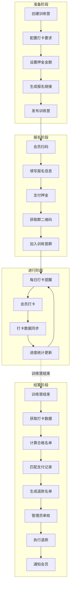

---

## 二、会员报名支付流程（混合方案）

> 采用**OAuth绑定 + 支付后信息填写**混合方案，覆盖率与准确率最优

### 2.1 支付方式选择

> **设计说明**：H5 主路径与降级路径互斥，同一用户只会走其中一条路径。

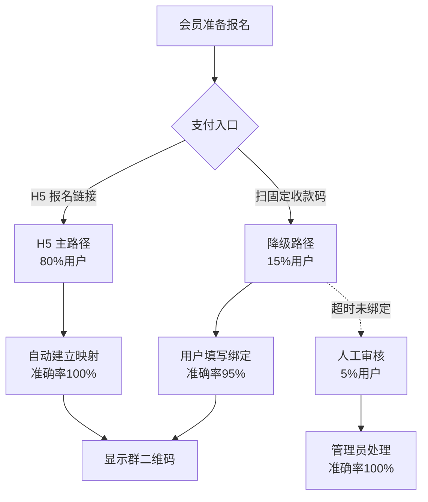

### 2.2 H5主路径支付流程（推荐路径）

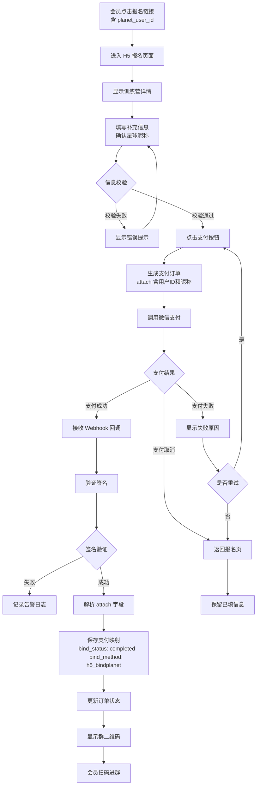

### 2.3 支付后信息填写流程（固定二维码用户）

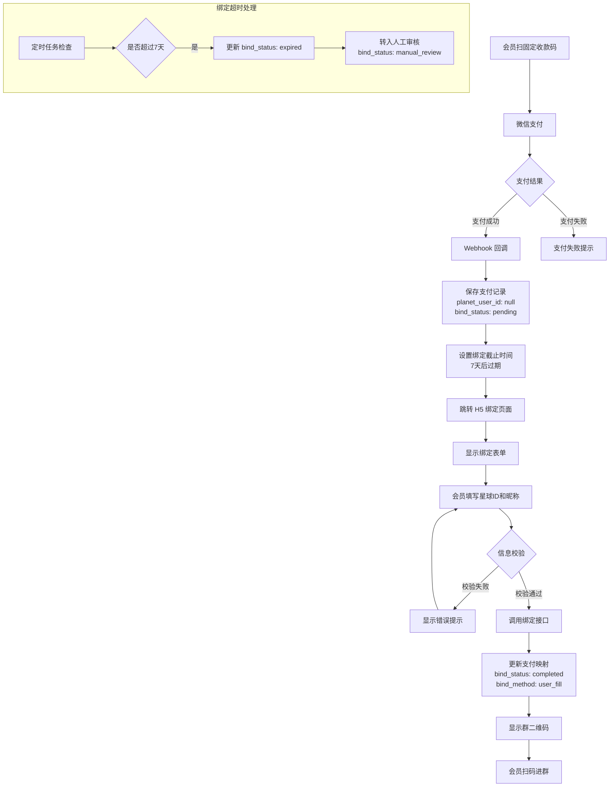

### 2.4 报名信息校验规则

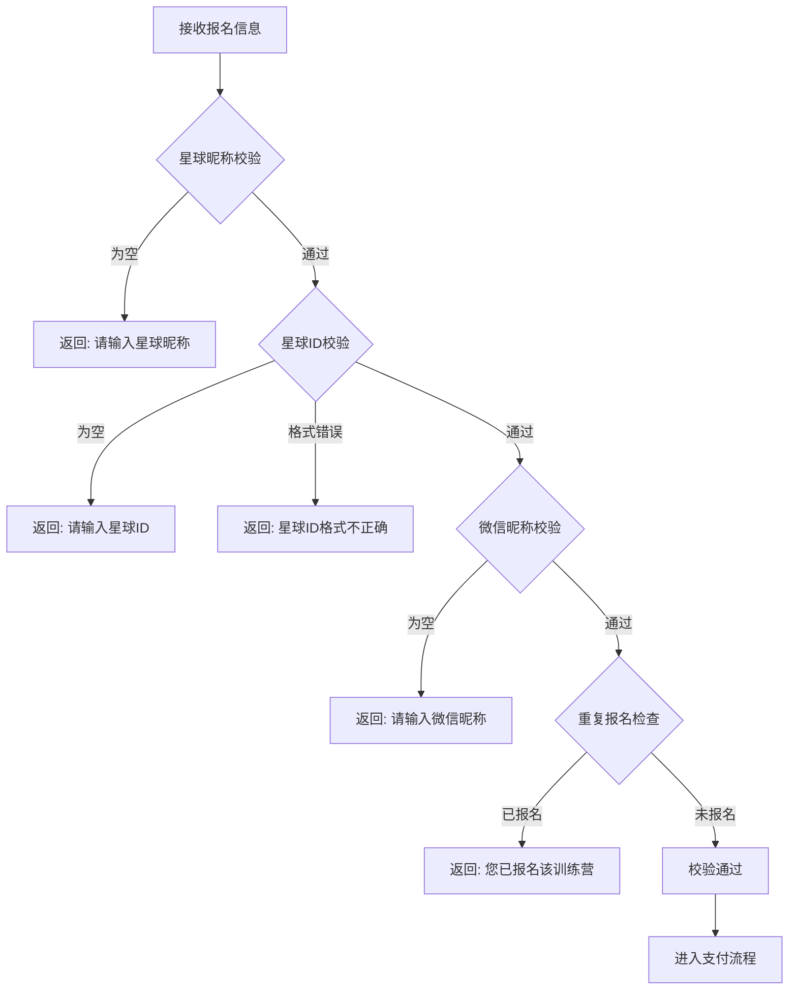

---

## 三、打卡数据同步流程

### 3.1 定时同步流程

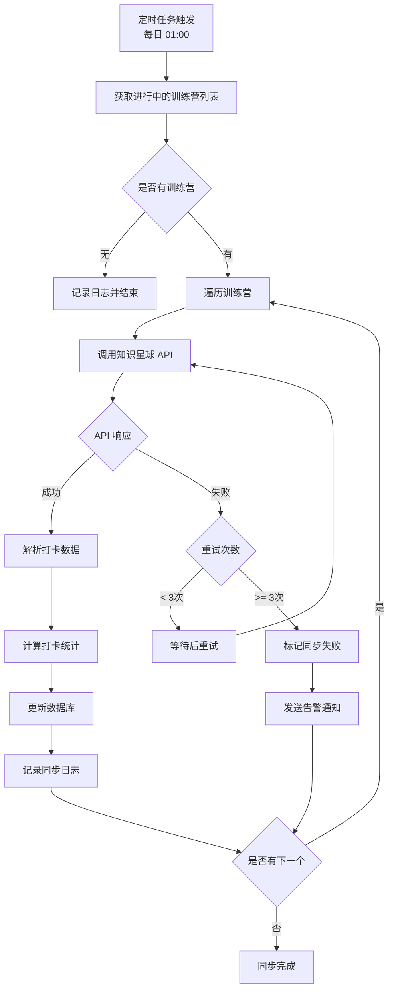

### 3.2 打卡数据处理流程

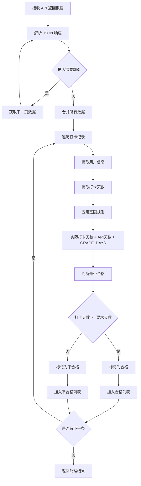

---

## 四、退款审核流程

> **设计说明**：不使用智能匹配，仅已绑定用户可自动退款，未绑定用户需人工处理。

### 4.1 退款名单生成流程

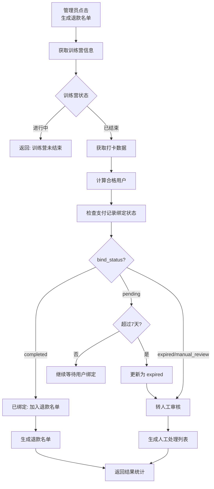

### 4.2 审核与执行流程

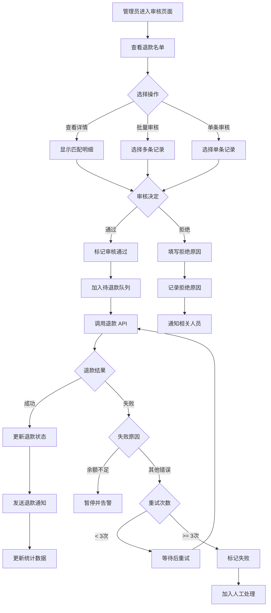

---

## 五、异常处理流程

### 5.1 支付异常处理

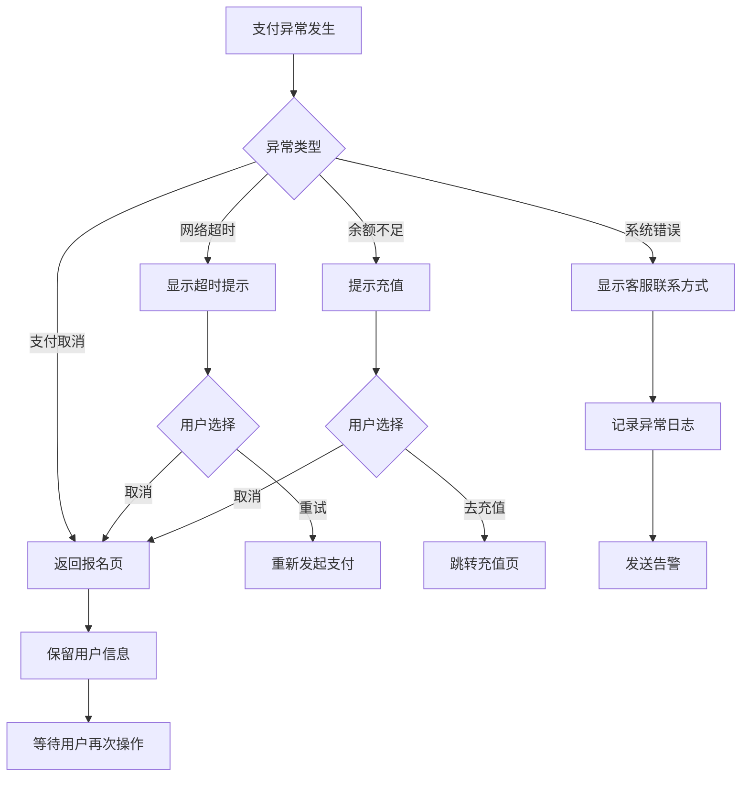

### 5.2 同步异常处理

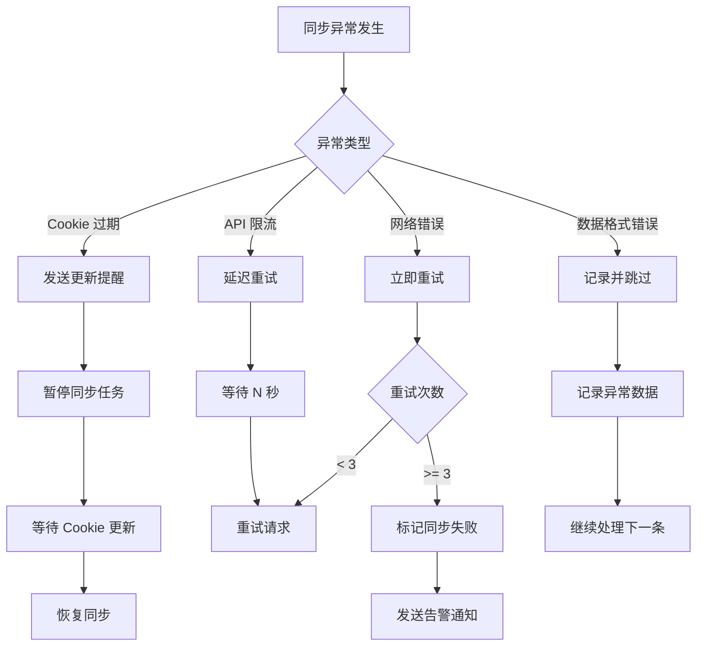

### 5.3 退款异常处理

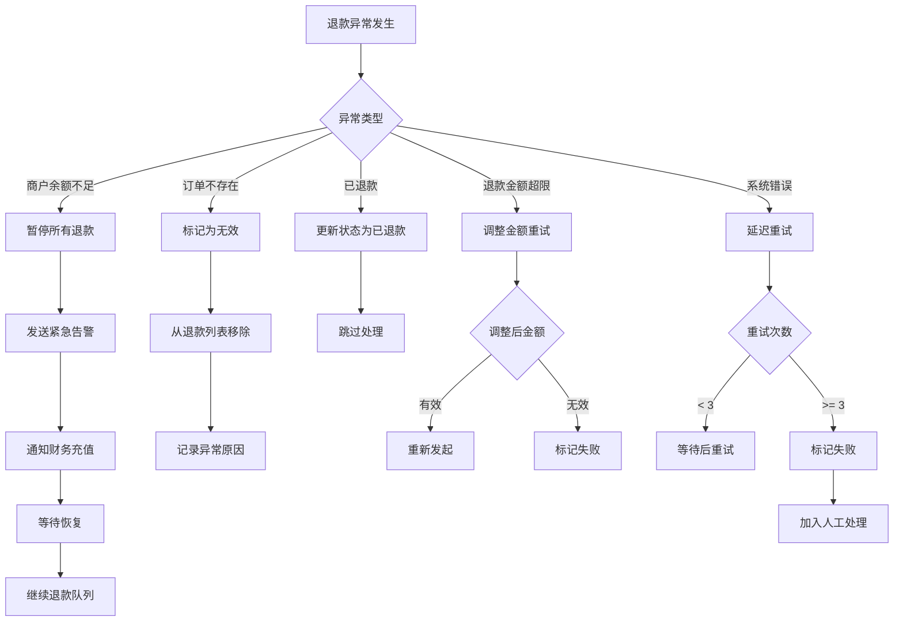

---

## 六、统计报表流程

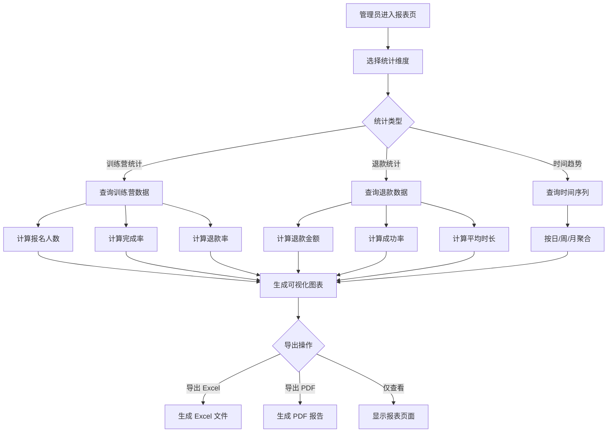

---

## 相关文档

- [用户旅程图](./用户旅程图.md)
- [时序图](./时序图.md)
- [状态机](./状态机.md)
- [架构设计图](./架构设计图.md)

---

**变更历史**：
| 版本 | 日期 | 变更内容 |
|------|------|----------|
| v1.1 | 2025-12-06 | 添加 SSOT 引用、版本信息、变更历史 |
| v1.0 | 2025-11-xx | 初始版本 |
