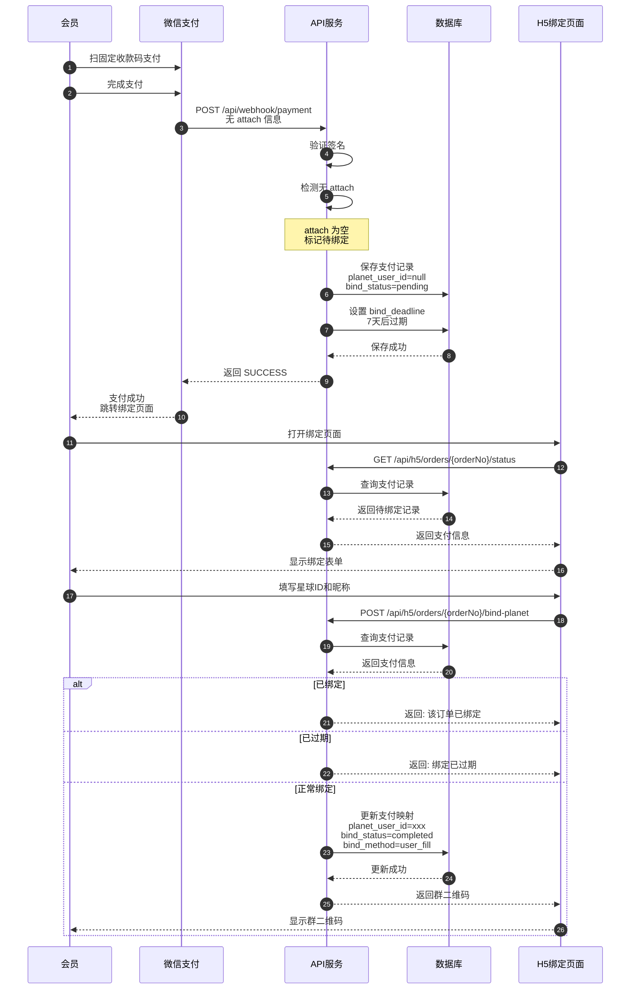
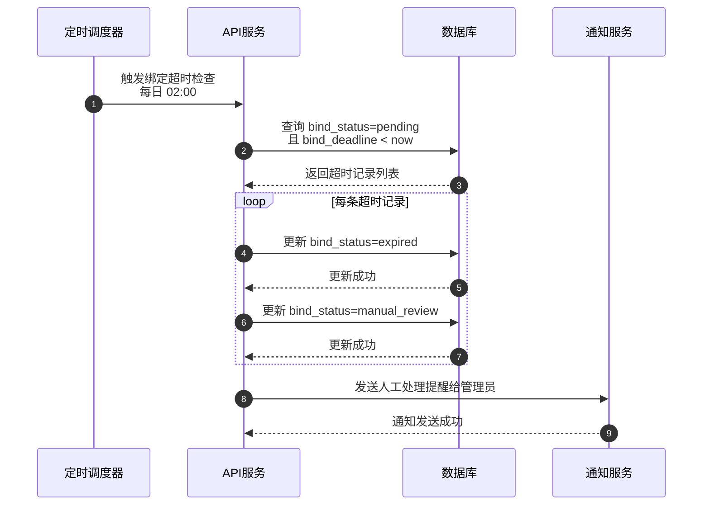
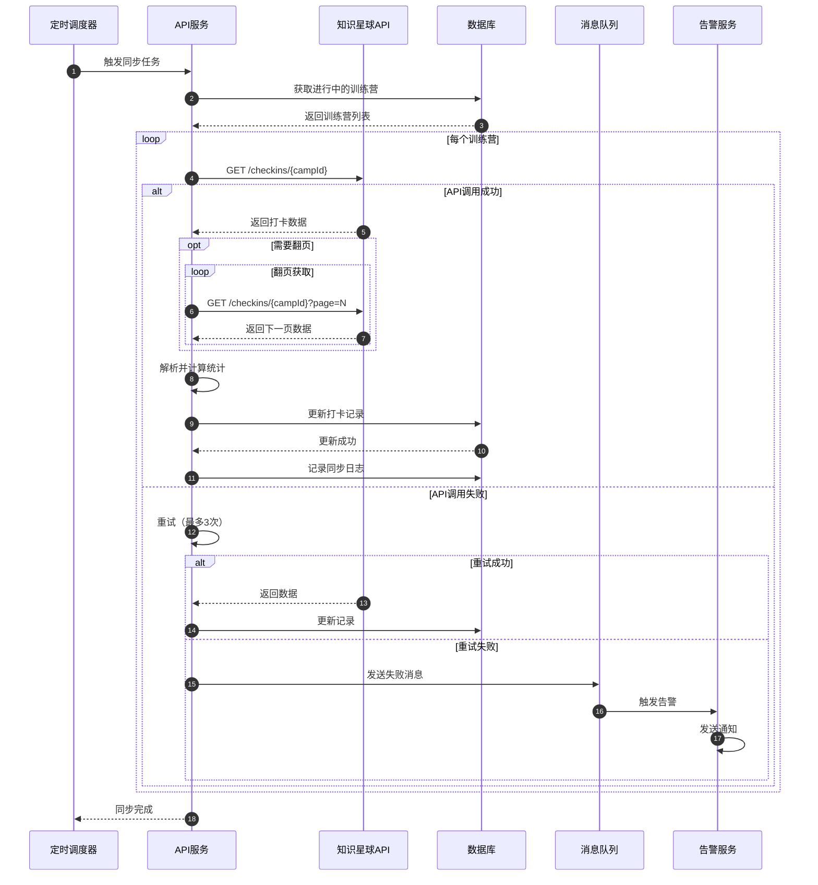
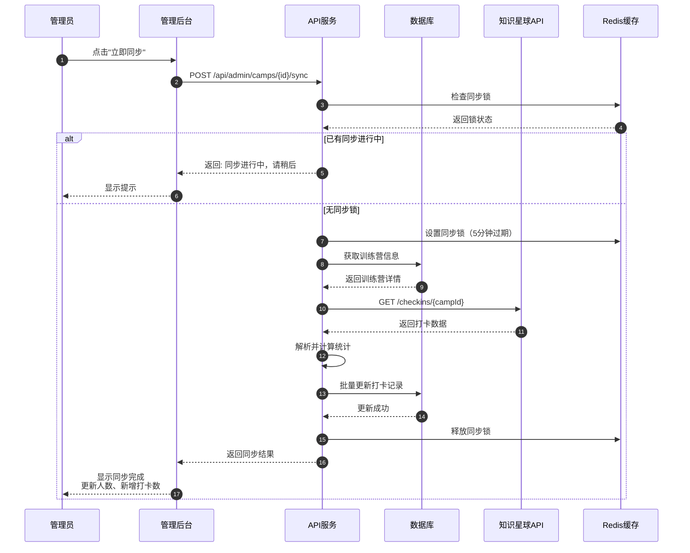
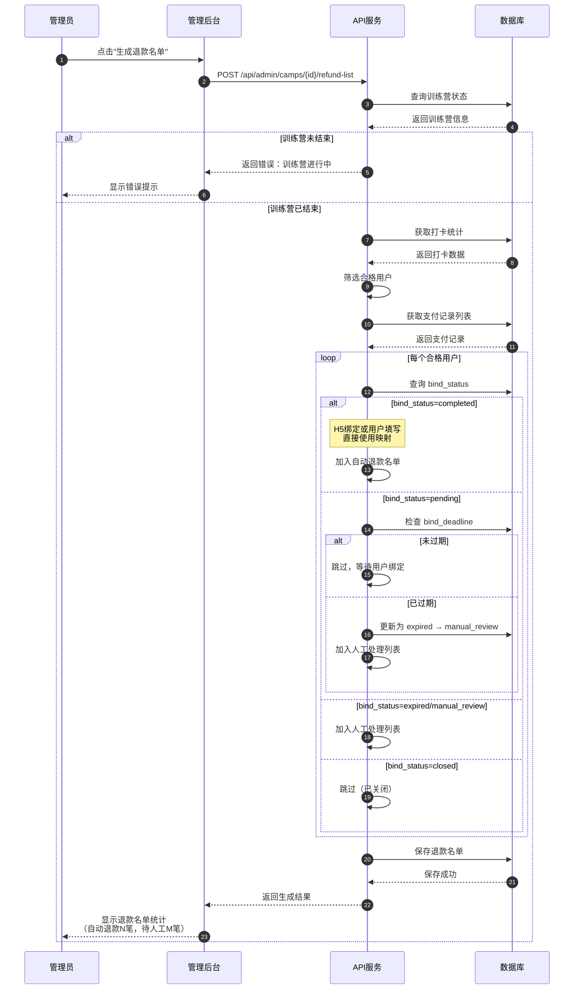
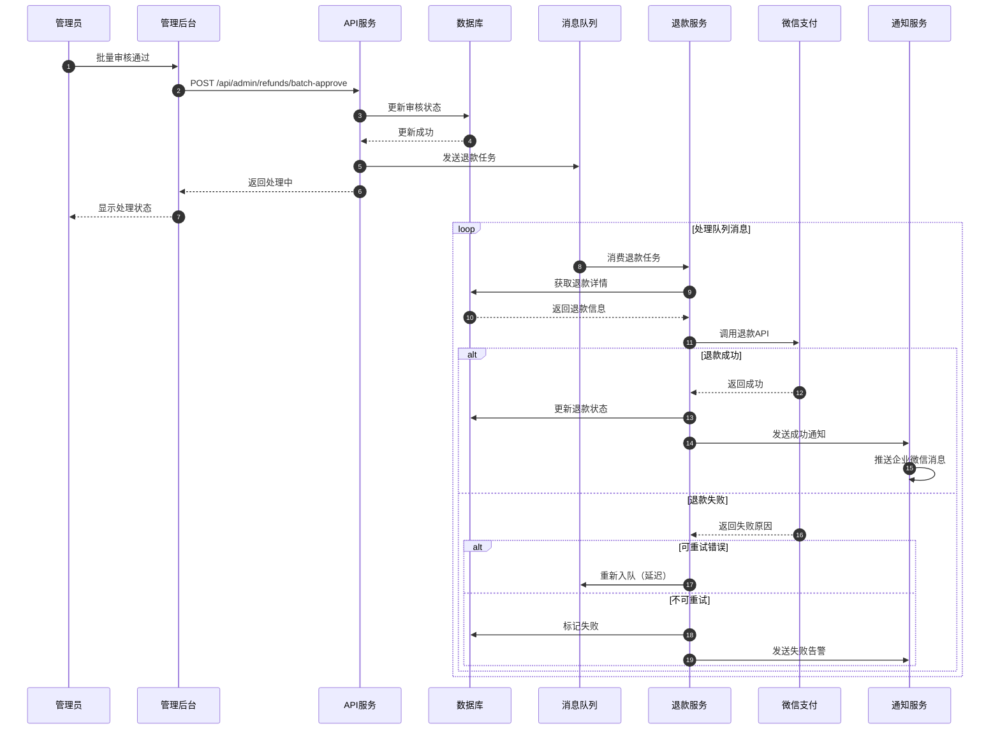
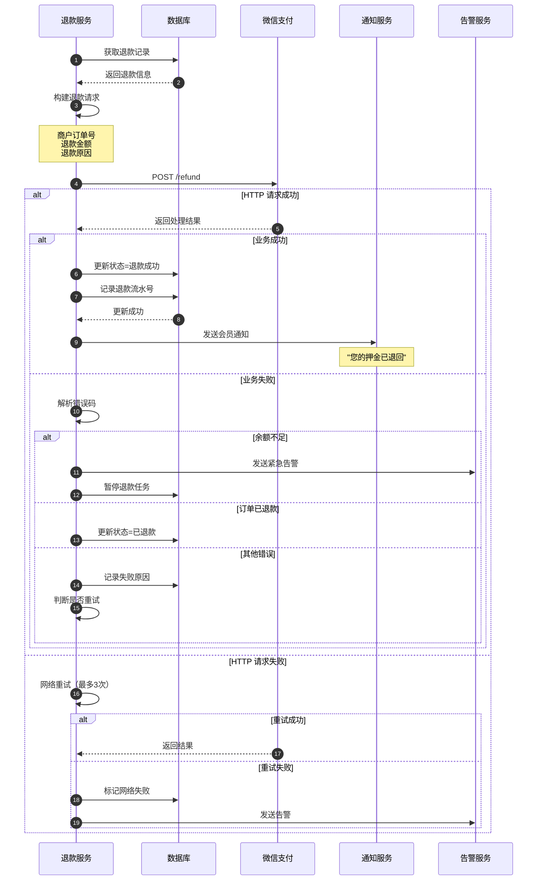
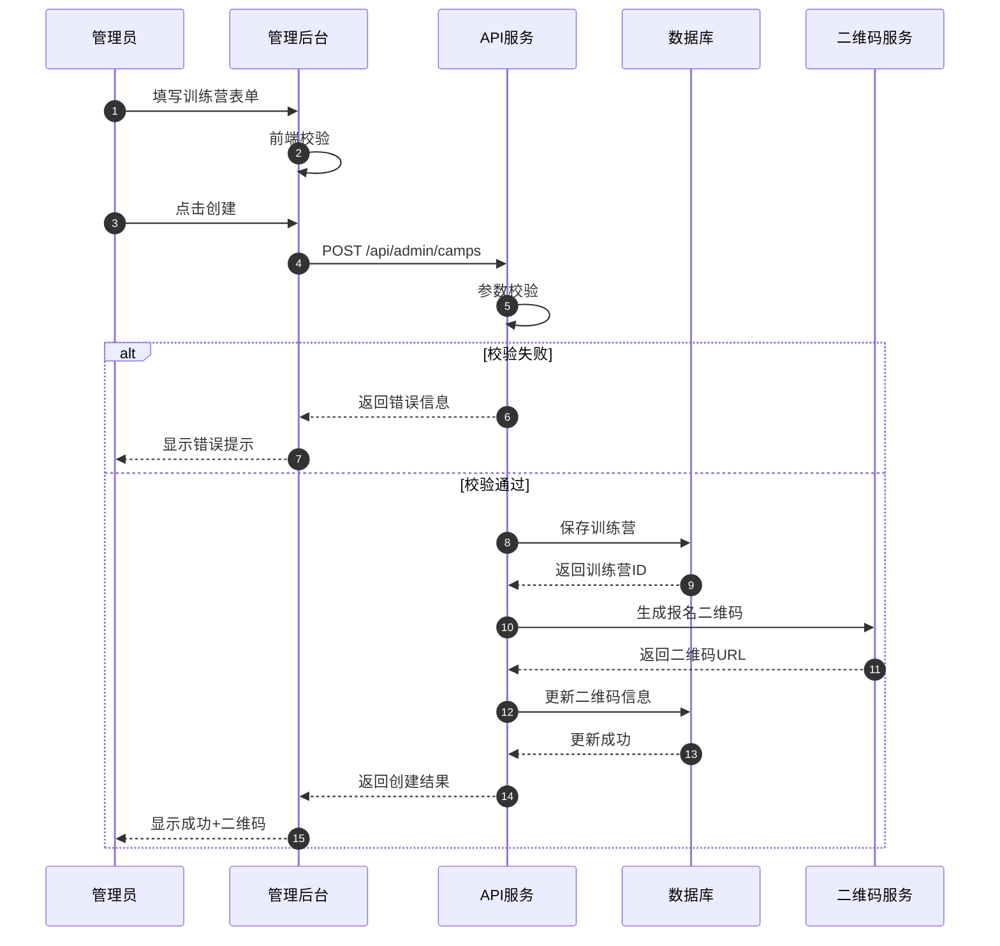
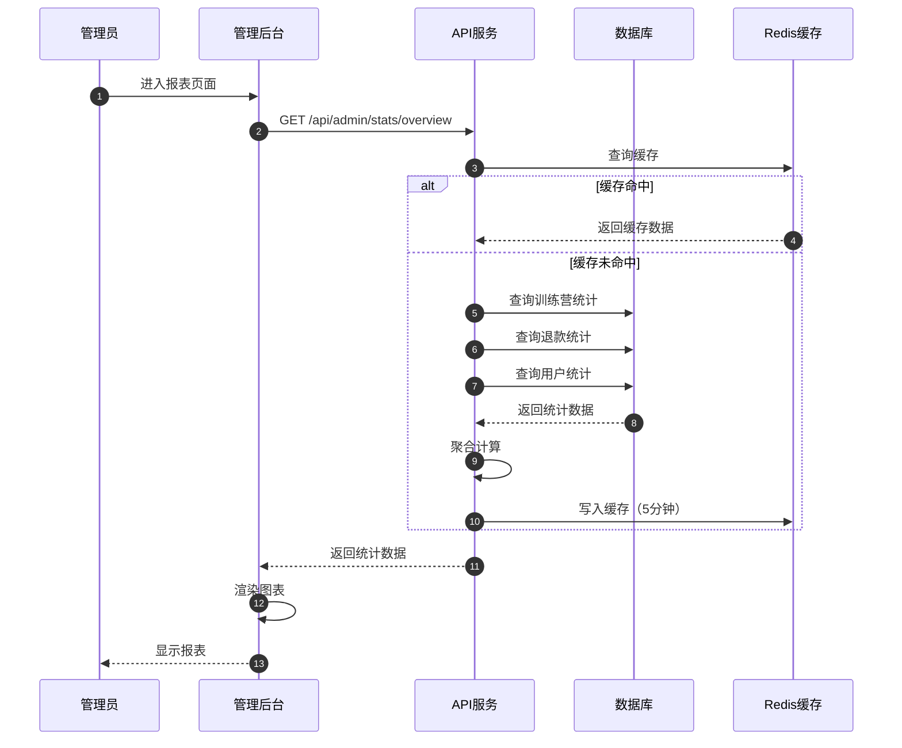
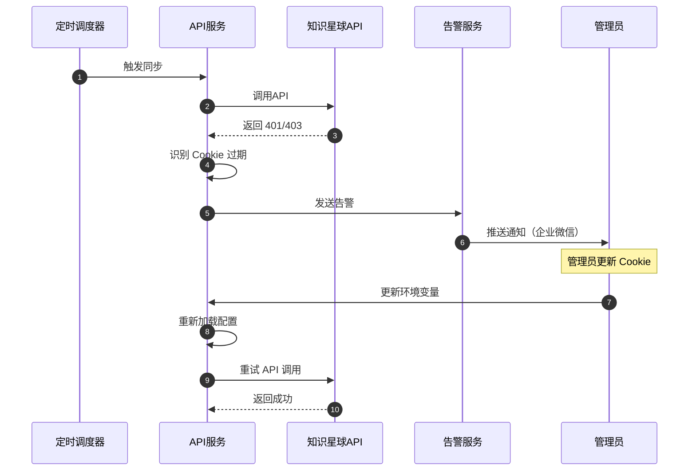

# 时序图

> **文档版本**: v1.2
> **最后更新**: 2025-12-08
> **SSOT引用**: [状态枚举定义.md](../design/状态枚举定义.md) - 时序中涉及的 bind_status、bind_method 等状态值

本文档展示知识星球训练营自动押金退款系统的核心场景交互时序。

---

## 一、会员报名支付时序（混合方案）

> 支持两种支付路径：OAuth 绑定（推荐）和固定二维码+支付后绑定

### 1.1 固定二维码支付+用户绑定流程

### 1.2 绑定超时处理时序

> **设计说明**：超时未绑定的支付记录自动转入人工审核流程，先标记为 expired，然后转为 manual_review 状态，由管理员处理。

---

## 二、打卡数据同步时序

### 2.1 定时同步流程

### 2.2 手动触发同步

---

## 三、退款名单生成时序

### 3.1 退款名单生成流程

> **设计说明**：不使用人工审核，仅支持三种绑定方式：
> 1. **H5主路径绑定**（bind_method=h5_bindplanet）- 用户在H5页面主动填写星球信息
> 2. **用户填写绑定**（bind_method=user_fill）- 用户在固定二维码支付后填写信息
> 3. **人工绑定**（bind_method=manual）- 超时未绑定由管理员人工处理

---

## 四、退款执行时序

### 4.1 批量退款流程

### 4.2 单笔退款详细流程

---

## 五、管理后台关键操作时序

### 5.1 创建训练营

### 5.2 查看统计报表

---

## 六、异常场景时序

### 6.1 Cookie 过期处理

### 6.2 退款失败重试

---

## 相关文档

- [用户旅程图](./用户旅程图.md)
- [业务流程图](./业务流程图.md)
- [状态机](./状态机.md)
- [架构设计图](./架构设计图.md)

---

**变更历史**：
| 版本 | 日期 | 变更内容 |
|------|------|----------|
| v1.1 | 2025-12-06 | 添加 SSOT 引用、版本信息、变更历史 |
| v1.0 | 2025-11-xx | 初始版本 |
