# 时序图

本文档展示知识星球训练营自动押金退款系统的核心场景交互时序。

---

## 一、会员报名支付时序（混合方案）

> 支持两种支付路径：动态二维码（推荐）和固定二维码+支付后绑定

### 1.1 动态二维码支付流程（推荐路径）

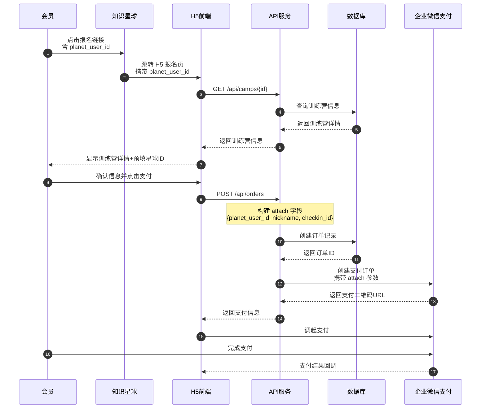
```mermaid
sequenceDiagram
    autonumber
    participant M as 会员
    participant ZSXQ as 知识星球
    participant H5 as H5前端
    participant API as API服务
    participant DB as 数据库
    participant WX as 企业微信支付

    M->>ZSXQ: 点击报名链接<br/>含 planet_user_id
    ZSXQ->>H5: 跳转 H5 报名页<br/>携带 planet_user_id
    H5->>API: GET /api/camps/{id}
    API->>DB: 查询训练营信息
    DB-->>API: 返回训练营详情
    API-->>H5: 返回训练营信息
    H5-->>M: 显示训练营详情+预填星球ID

    M->>H5: 确认信息并点击支付
    H5->>API: POST /api/orders
    Note over API: 构建 attach 字段<br/>{planet_user_id, nickname, checkin_id}
    API->>DB: 创建订单记录
    DB-->>API: 返回订单ID
    API->>WX: 创建支付订单<br/>携带 attach 参数
    WX-->>API: 返回支付二维码URL
    API-->>H5: 返回支付信息
    H5->>WX: 调起支付
    M->>WX: 完成支付
    WX-->>H5: 支付结果回调
```

### 1.2 动态二维码支付回调处理

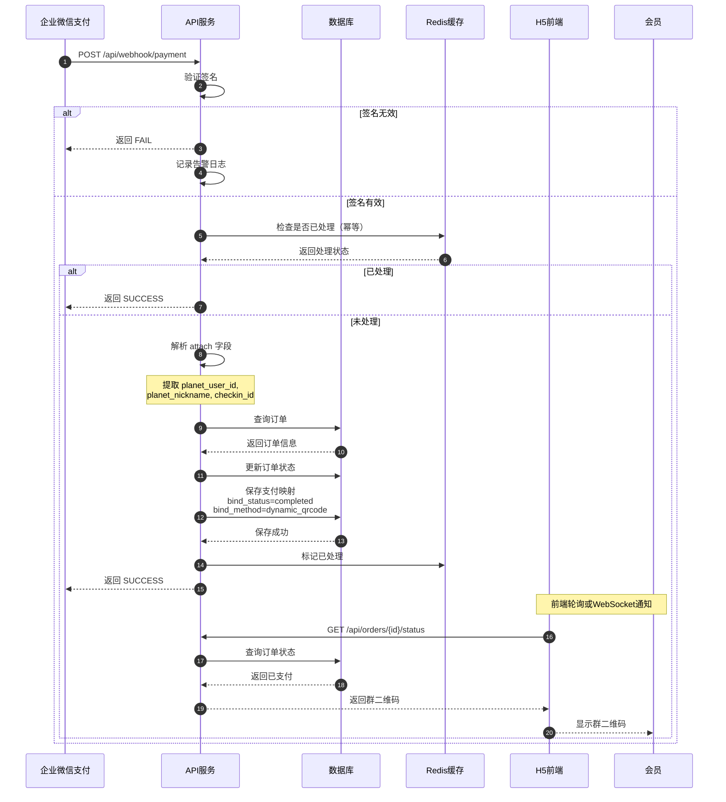
```mermaid
sequenceDiagram
    autonumber
    participant WX as 企业微信支付
    participant API as API服务
    participant DB as 数据库
    participant Cache as Redis缓存
    participant H5 as H5前端
    participant M as 会员

    WX->>API: POST /api/webhook/payment
    API->>API: 验证签名

    alt 签名无效
        API-->>WX: 返回 FAIL
        API->>API: 记录告警日志
    else 签名有效
        API->>Cache: 检查是否已处理（幂等）
        Cache-->>API: 返回处理状态

        alt 已处理
            API-->>WX: 返回 SUCCESS
        else 未处理
            API->>API: 解析 attach 字段
            Note over API: 提取 planet_user_id,<br/>planet_nickname, checkin_id
            API->>DB: 查询订单
            DB-->>API: 返回订单信息
            API->>DB: 更新订单状态
            API->>DB: 保存支付映射<br/>bind_status=completed<br/>bind_method=dynamic_qrcode
            DB-->>API: 保存成功
            API->>Cache: 标记已处理
            API-->>WX: 返回 SUCCESS

            Note over H5,M: 前端轮询或WebSocket通知
            H5->>API: GET /api/orders/{id}/status
            API->>DB: 查询订单状态
            DB-->>API: 返回已支付
            API-->>H5: 返回群二维码
            H5-->>M: 显示群二维码
        end
    end
```

### 1.3 固定二维码支付+用户绑定流程

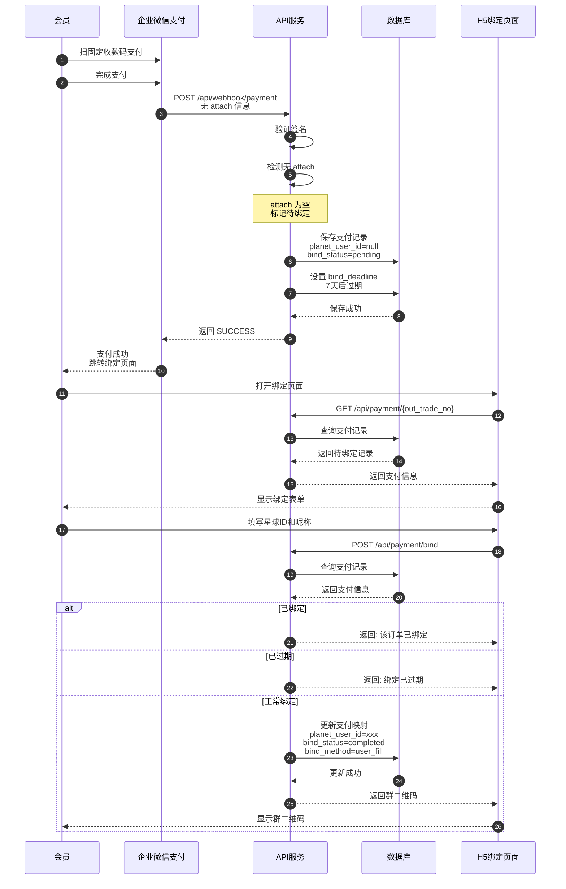
```mermaid
sequenceDiagram
    autonumber
    participant M as 会员
    participant WX as 企业微信支付
    participant API as API服务
    participant DB as 数据库
    participant H5 as H5绑定页面

    M->>WX: 扫固定收款码支付
    M->>WX: 完成支付
    WX->>API: POST /api/webhook/payment<br/>无 attach 信息
    API->>API: 验证签名
    API->>API: 检测无 attach
    Note over API: attach 为空<br/>标记待绑定

    API->>DB: 保存支付记录<br/>planet_user_id=null<br/>bind_status=pending
    API->>DB: 设置 bind_deadline<br/>7天后过期
    DB-->>API: 保存成功
    API-->>WX: 返回 SUCCESS

    WX-->>M: 支付成功<br/>跳转绑定页面
    M->>H5: 打开绑定页面
    H5->>API: GET /api/payment/{out_trade_no}
    API->>DB: 查询支付记录
    DB-->>API: 返回待绑定记录
    API-->>H5: 返回支付信息
    H5-->>M: 显示绑定表单

    M->>H5: 填写星球ID和昵称
    H5->>API: POST /api/payment/bind
    API->>DB: 查询支付记录
    DB-->>API: 返回支付信息

    alt 已绑定
        API-->>H5: 返回: 该订单已绑定
    else 已过期
        API-->>H5: 返回: 绑定已过期
    else 正常绑定
        API->>DB: 更新支付映射<br/>planet_user_id=xxx<br/>bind_status=completed<br/>bind_method=user_fill
        DB-->>API: 更新成功
        API-->>H5: 返回群二维码
        H5-->>M: 显示群二维码
    end
```

### 1.4 绑定超时处理时序

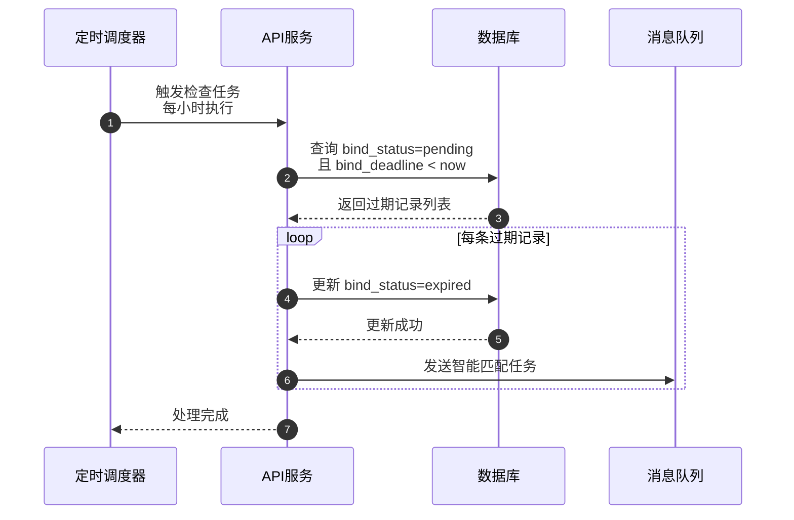
```mermaid
sequenceDiagram
    autonumber
    participant Scheduler as 定时调度器
    participant API as API服务
    participant DB as 数据库
    participant MQ as 消息队列

    Scheduler->>API: 触发检查任务<br/>每小时执行
    API->>DB: 查询 bind_status=pending<br/>且 bind_deadline < now
    DB-->>API: 返回过期记录列表

    loop 每条过期记录
        API->>DB: 更新 bind_status=expired
        DB-->>API: 更新成功
        API->>MQ: 发送智能匹配任务
    end

    API-->>Scheduler: 处理完成
```

---

## 二、打卡数据同步时序

### 2.1 定时同步流程

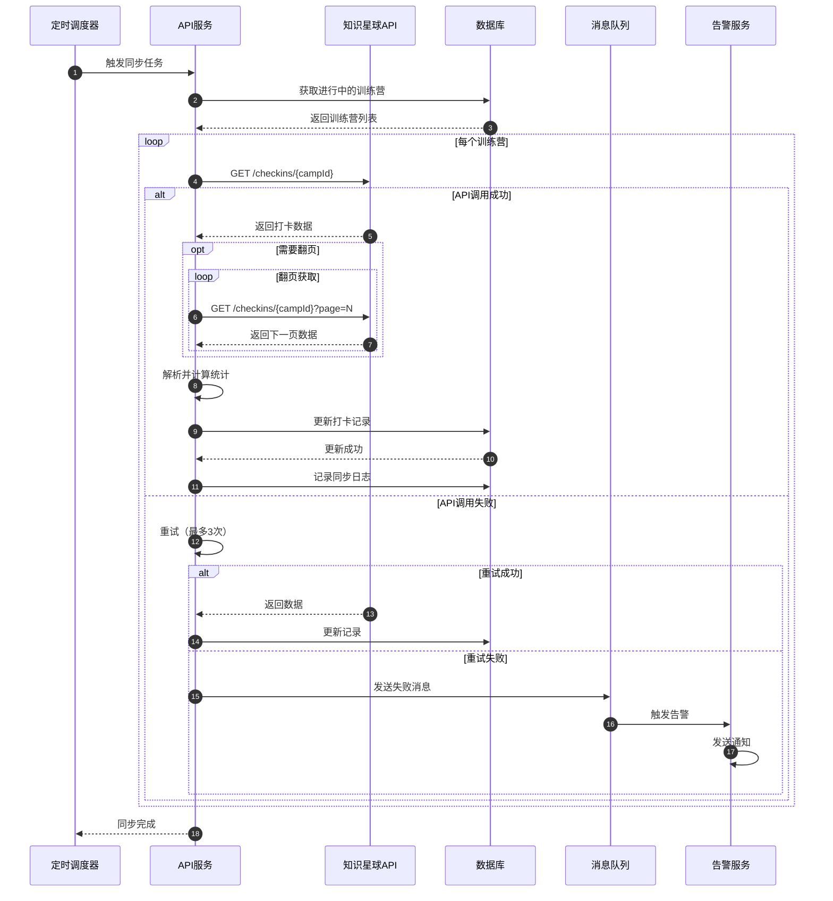
```mermaid
sequenceDiagram
    autonumber
    participant Scheduler as 定时调度器
    participant API as API服务
    participant ZSXQ as 知识星球API
    participant DB as 数据库
    participant MQ as 消息队列
    participant Alert as 告警服务

    Scheduler->>API: 触发同步任务
    API->>DB: 获取进行中的训练营
    DB-->>API: 返回训练营列表

    loop 每个训练营
        API->>ZSXQ: GET /checkins/{campId}

        alt API调用成功
            ZSXQ-->>API: 返回打卡数据

            opt 需要翻页
                loop 翻页获取
                    API->>ZSXQ: GET /checkins/{campId}?page=N
                    ZSXQ-->>API: 返回下一页数据
                end
            end

            API->>API: 解析并计算统计
            API->>DB: 更新打卡记录
            DB-->>API: 更新成功
            API->>DB: 记录同步日志
        else API调用失败
            API->>API: 重试（最多3次）

            alt 重试成功
                ZSXQ-->>API: 返回数据
                API->>DB: 更新记录
            else 重试失败
                API->>MQ: 发送失败消息
                MQ->>Alert: 触发告警
                Alert->>Alert: 发送通知
            end
        end
    end

    API-->>Scheduler: 同步完成
```

### 2.2 手动触发同步

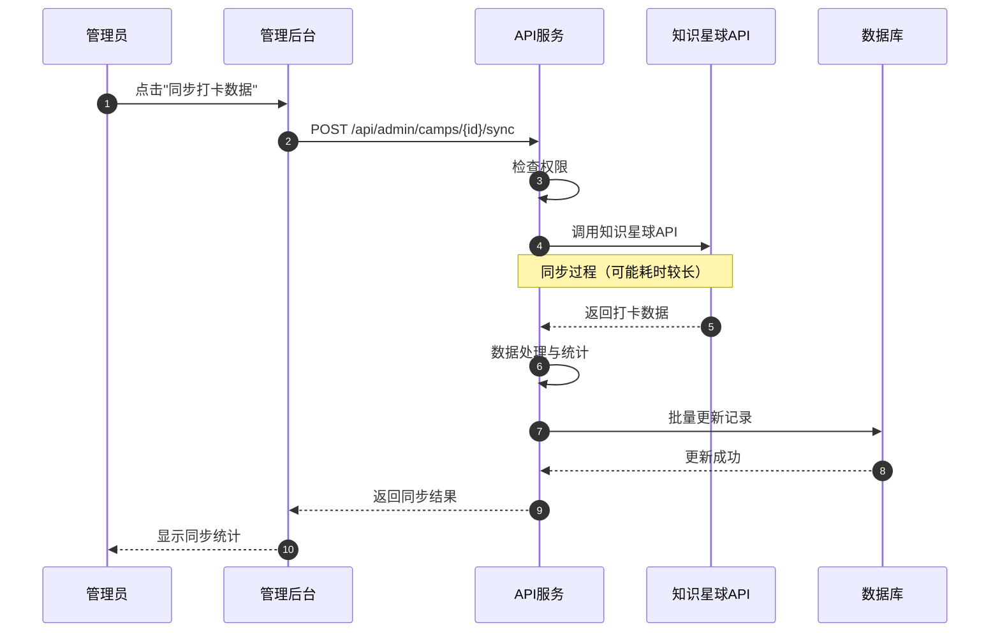
```mermaid
sequenceDiagram
    autonumber
    participant Admin as 管理员
    participant Web as 管理后台
    participant API as API服务
    participant ZSXQ as 知识星球API
    participant DB as 数据库

    Admin->>Web: 点击"同步打卡数据"
    Web->>API: POST /api/admin/camps/{id}/sync
    API->>API: 检查权限

    API->>ZSXQ: 调用知识星球API

    Note over API,ZSXQ: 同步过程（可能耗时较长）

    ZSXQ-->>API: 返回打卡数据
    API->>API: 数据处理与统计
    API->>DB: 批量更新记录
    DB-->>API: 更新成功

    API-->>Web: 返回同步结果
    Web-->>Admin: 显示同步统计
```

---

## 三、退款名单生成时序（混合匹配方案）

### 3.1 混合匹配流程

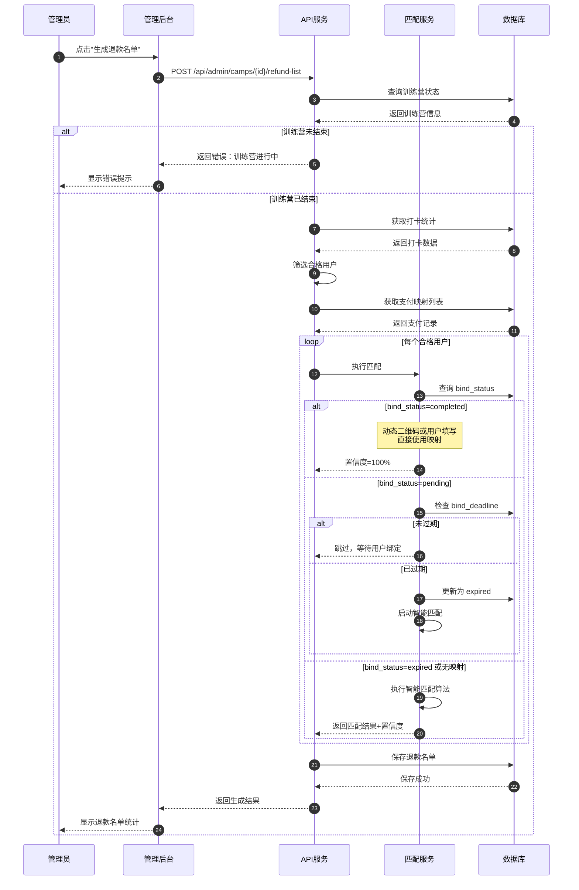
```mermaid
sequenceDiagram
    autonumber
    participant Admin as 管理员
    participant Web as 管理后台
    participant API as API服务
    participant Match as 匹配服务
    participant DB as 数据库

    Admin->>Web: 点击"生成退款名单"
    Web->>API: POST /api/admin/camps/{id}/refund-list

    API->>DB: 查询训练营状态
    DB-->>API: 返回训练营信息

    alt 训练营未结束
        API-->>Web: 返回错误：训练营进行中
        Web-->>Admin: 显示错误提示
    else 训练营已结束
        API->>DB: 获取打卡统计
        DB-->>API: 返回打卡数据
        API->>API: 筛选合格用户

        API->>DB: 获取支付映射列表
        DB-->>API: 返回支付记录

        loop 每个合格用户
            API->>Match: 执行匹配
            Match->>DB: 查询 bind_status

            alt bind_status=completed
                Note over Match: 动态二维码或用户填写<br/>直接使用映射
                Match-->>API: 置信度=100%
            else bind_status=pending
                Match->>DB: 检查 bind_deadline
                alt 未过期
                    Match-->>API: 跳过，等待用户绑定
                else 已过期
                    Match->>DB: 更新为 expired
                    Match->>Match: 启动智能匹配
                end
            else bind_status=expired 或无映射
                Match->>Match: 执行智能匹配算法
                Match-->>API: 返回匹配结果+置信度
            end
        end

        API->>DB: 保存退款名单
        DB-->>API: 保存成功

        API-->>Web: 返回生成结果
        Web-->>Admin: 显示退款名单统计
    end
```

### 3.2 智能匹配详细时序

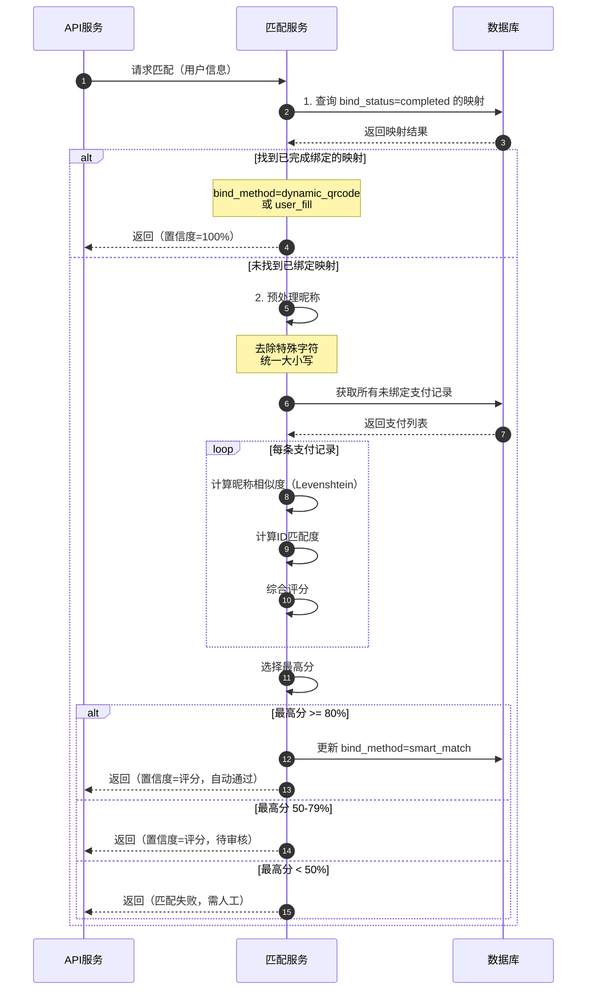
```mermaid
sequenceDiagram
    autonumber
    participant API as API服务
    participant Match as 匹配服务
    participant DB as 数据库

    API->>Match: 请求匹配（用户信息）

    Match->>DB: 1. 查询 bind_status=completed 的映射
    DB-->>Match: 返回映射结果

    alt 找到已完成绑定的映射
        Note over Match: bind_method=dynamic_qrcode<br/>或 user_fill
        Match-->>API: 返回（置信度=100%）
    else 未找到已绑定映射
        Match->>Match: 2. 预处理昵称
        Note over Match: 去除特殊字符<br/>统一大小写

        Match->>DB: 获取所有未绑定支付记录
        DB-->>Match: 返回支付列表

        loop 每条支付记录
            Match->>Match: 计算昵称相似度（Levenshtein）
            Match->>Match: 计算ID匹配度
            Match->>Match: 综合评分
        end

        Match->>Match: 选择最高分

        alt 最高分 >= 80%
            Match->>DB: 更新 bind_method=smart_match
            Match-->>API: 返回（置信度=评分，自动通过）
        else 最高分 50-79%
            Match-->>API: 返回（置信度=评分，待审核）
        else 最高分 < 50%
            Match-->>API: 返回（匹配失败，需人工）
        end
    end
```

### 3.3 匹配结果分类处理

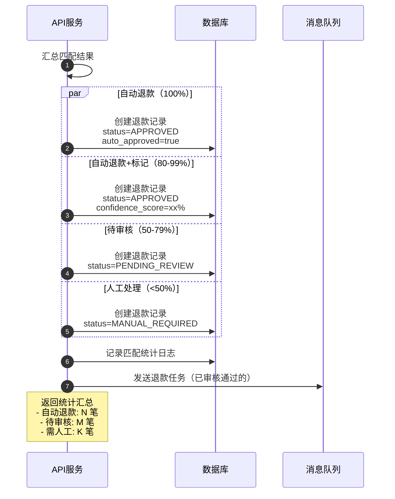
```mermaid
sequenceDiagram
    autonumber
    participant API as API服务
    participant DB as 数据库
    participant MQ as 消息队列

    API->>API: 汇总匹配结果

    par 自动退款（100%）
        API->>DB: 创建退款记录<br/>status=APPROVED<br/>auto_approved=true
    and 自动退款+标记（80-99%）
        API->>DB: 创建退款记录<br/>status=APPROVED<br/>confidence_score=xx%
    and 待审核（50-79%）
        API->>DB: 创建退款记录<br/>status=PENDING_REVIEW
    and 人工处理（<50%）
        API->>DB: 创建退款记录<br/>status=MANUAL_REQUIRED
    end

    API->>DB: 记录匹配统计日志
    API->>MQ: 发送退款任务（已审核通过的）

    Note over API: 返回统计汇总<br/>- 自动退款: N 笔<br/>- 待审核: M 笔<br/>- 需人工: K 笔
```

---

## 四、退款执行时序

### 4.1 批量退款流程

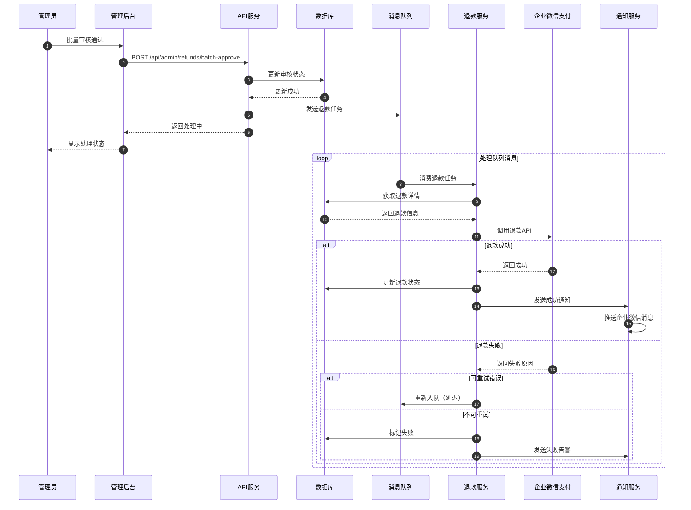
```mermaid
sequenceDiagram
    autonumber
    participant Admin as 管理员
    participant Web as 管理后台
    participant API as API服务
    participant DB as 数据库
    participant MQ as 消息队列
    participant Refund as 退款服务
    participant WX as 企业微信支付
    participant Notify as 通知服务

    Admin->>Web: 批量审核通过
    Web->>API: POST /api/admin/refunds/batch-approve
    API->>DB: 更新审核状态
    DB-->>API: 更新成功
    API->>MQ: 发送退款任务
    API-->>Web: 返回处理中
    Web-->>Admin: 显示处理状态

    loop 处理队列消息
        MQ->>Refund: 消费退款任务
        Refund->>DB: 获取退款详情
        DB-->>Refund: 返回退款信息

        Refund->>WX: 调用退款API

        alt 退款成功
            WX-->>Refund: 返回成功
            Refund->>DB: 更新退款状态
            Refund->>Notify: 发送成功通知
            Notify->>Notify: 推送企业微信消息
        else 退款失败
            WX-->>Refund: 返回失败原因

            alt 可重试错误
                Refund->>MQ: 重新入队（延迟）
            else 不可重试
                Refund->>DB: 标记失败
                Refund->>Notify: 发送失败告警
            end
        end
    end
```

### 4.2 单笔退款详细流程

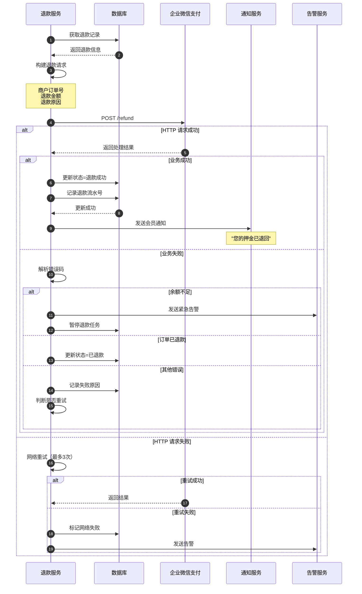
```mermaid
sequenceDiagram
    autonumber
    participant Refund as 退款服务
    participant DB as 数据库
    participant WX as 企业微信支付
    participant Notify as 通知服务
    participant Alert as 告警服务

    Refund->>DB: 获取退款记录
    DB-->>Refund: 返回退款信息

    Refund->>Refund: 构建退款请求
    Note over Refund: 商户订单号<br/>退款金额<br/>退款原因

    Refund->>WX: POST /refund

    alt HTTP 请求成功
        WX-->>Refund: 返回处理结果

        alt 业务成功
            Refund->>DB: 更新状态=退款成功
            Refund->>DB: 记录退款流水号
            DB-->>Refund: 更新成功

            Refund->>Notify: 发送会员通知
            Note over Notify: "您的押金已退回"
        else 业务失败
            Refund->>Refund: 解析错误码

            alt 余额不足
                Refund->>Alert: 发送紧急告警
                Refund->>DB: 暂停退款任务
            else 订单已退款
                Refund->>DB: 更新状态=已退款
            else 其他错误
                Refund->>DB: 记录失败原因
                Refund->>Refund: 判断是否重试
            end
        end
    else HTTP 请求失败
        Refund->>Refund: 网络重试（最多3次）

        alt 重试成功
            WX-->>Refund: 返回结果
        else 重试失败
            Refund->>DB: 标记网络失败
            Refund->>Alert: 发送告警
        end
    end
```

---

## 五、管理后台关键操作时序

### 5.1 创建训练营

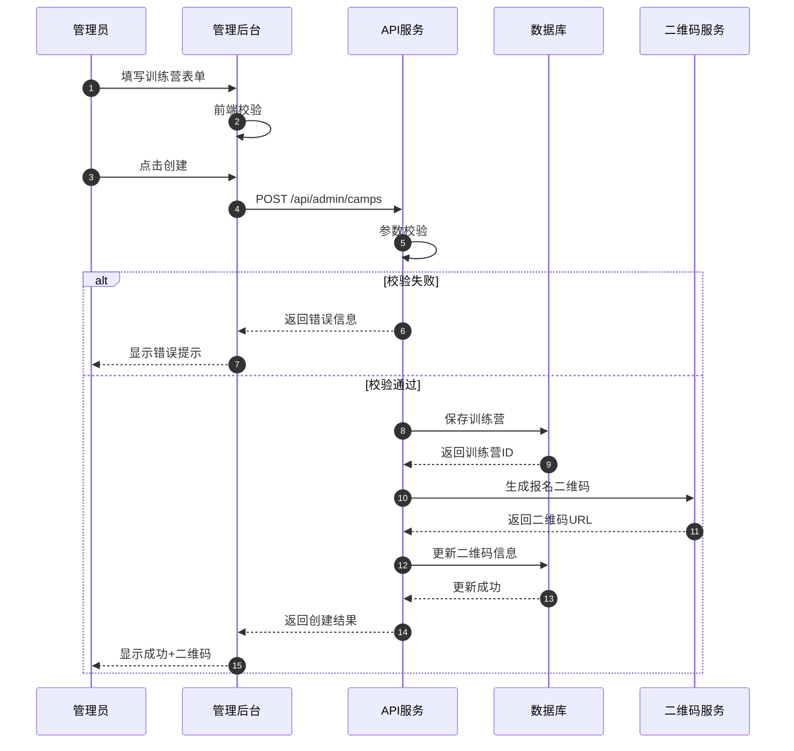
```mermaid
sequenceDiagram
    autonumber
    participant Admin as 管理员
    participant Web as 管理后台
    participant API as API服务
    participant DB as 数据库
    participant QR as 二维码服务

    Admin->>Web: 填写训练营表单
    Web->>Web: 前端校验
    Admin->>Web: 点击创建

    Web->>API: POST /api/admin/camps
    API->>API: 参数校验

    alt 校验失败
        API-->>Web: 返回错误信息
        Web-->>Admin: 显示错误提示
    else 校验通过
        API->>DB: 保存训练营
        DB-->>API: 返回训练营ID

        API->>QR: 生成报名二维码
        QR-->>API: 返回二维码URL

        API->>DB: 更新二维码信息
        DB-->>API: 更新成功

        API-->>Web: 返回创建结果
        Web-->>Admin: 显示成功+二维码
    end
```

### 5.2 查看统计报表

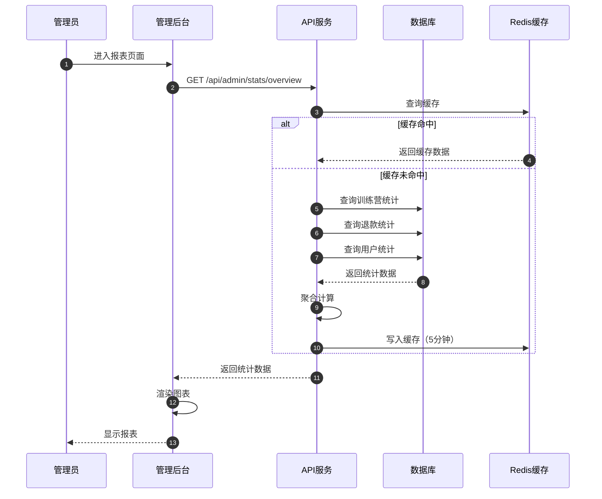
```mermaid
sequenceDiagram
    autonumber
    participant Admin as 管理员
    participant Web as 管理后台
    participant API as API服务
    participant DB as 数据库
    participant Cache as Redis缓存

    Admin->>Web: 进入报表页面
    Web->>API: GET /api/admin/stats/overview

    API->>Cache: 查询缓存

    alt 缓存命中
        Cache-->>API: 返回缓存数据
    else 缓存未命中
        API->>DB: 查询训练营统计
        API->>DB: 查询退款统计
        API->>DB: 查询用户统计
        DB-->>API: 返回统计数据

        API->>API: 聚合计算
        API->>Cache: 写入缓存（5分钟）
    end

    API-->>Web: 返回统计数据
    Web->>Web: 渲染图表
    Web-->>Admin: 显示报表
```

---

## 六、异常场景时序

### 6.1 Cookie 过期处理

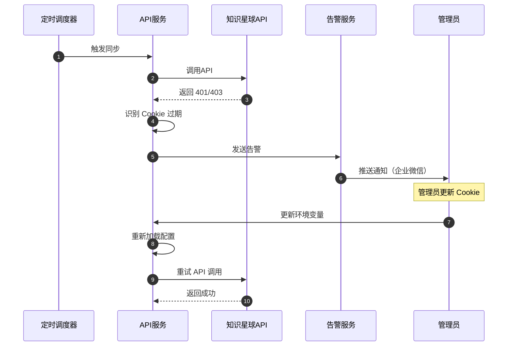
```mermaid
sequenceDiagram
    autonumber
    participant Scheduler as 定时调度器
    participant API as API服务
    participant ZSXQ as 知识星球API
    participant Alert as 告警服务
    participant Admin as 管理员

    Scheduler->>API: 触发同步
    API->>ZSXQ: 调用API
    ZSXQ-->>API: 返回 401/403

    API->>API: 识别 Cookie 过期
    API->>Alert: 发送告警
    Alert->>Admin: 推送通知（企业微信）

    Note over Admin: 管理员更新 Cookie

    Admin->>API: 更新环境变量
    API->>API: 重新加载配置

    API->>ZSXQ: 重试 API 调用
    ZSXQ-->>API: 返回成功
```

### 6.2 退款失败重试

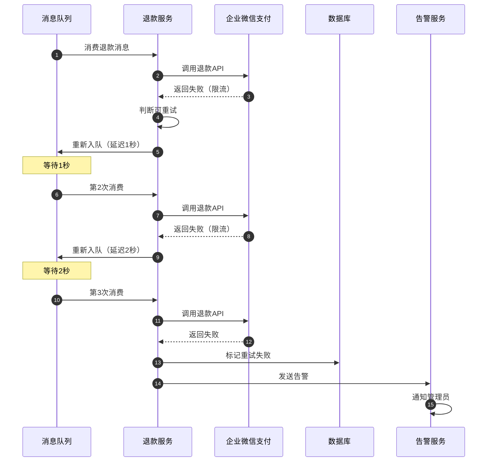
```mermaid
sequenceDiagram
    autonumber
    participant MQ as 消息队列
    participant Refund as 退款服务
    participant WX as 企业微信支付
    participant DB as 数据库
    participant Alert as 告警服务

    MQ->>Refund: 消费退款消息
    Refund->>WX: 调用退款API
    WX-->>Refund: 返回失败（限流）

    Refund->>Refund: 判断可重试
    Refund->>MQ: 重新入队（延迟1秒）

    Note over MQ: 等待1秒

    MQ->>Refund: 第2次消费
    Refund->>WX: 调用退款API
    WX-->>Refund: 返回失败（限流）

    Refund->>MQ: 重新入队（延迟2秒）

    Note over MQ: 等待2秒

    MQ->>Refund: 第3次消费
    Refund->>WX: 调用退款API
    WX-->>Refund: 返回失败

    Refund->>DB: 标记重试失败
    Refund->>Alert: 发送告警
    Alert->>Alert: 通知管理员
```

---

## 相关文档

- [用户旅程图](./用户旅程图.md)
- [业务流程图](./业务流程图.md)
- [状态机](./状态机.md)
- [架构设计图](./架构设计图.md)
