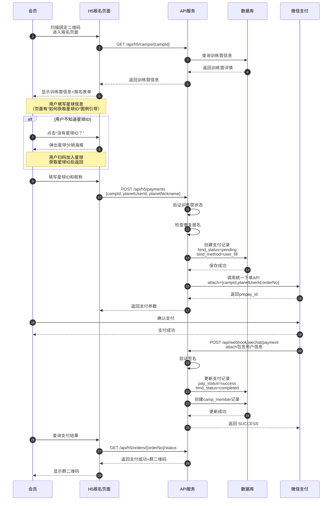
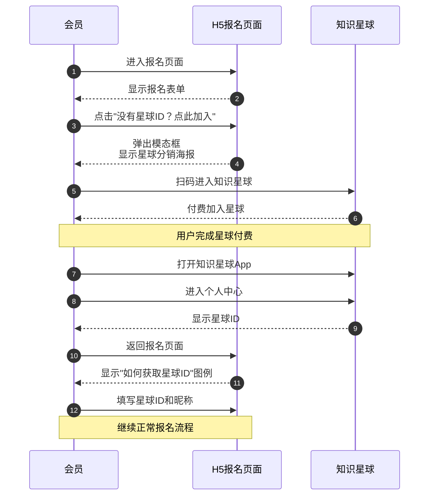
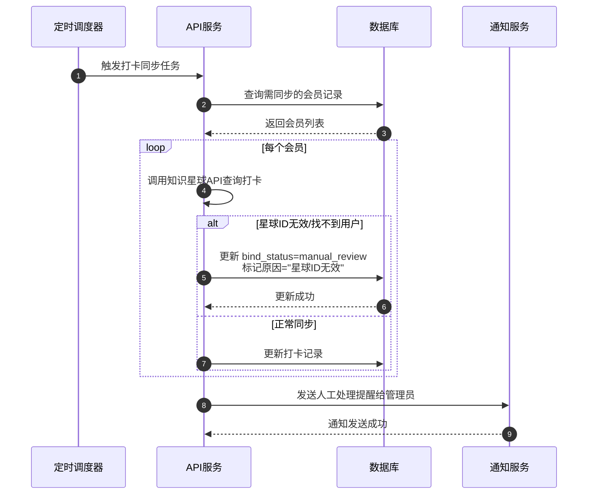
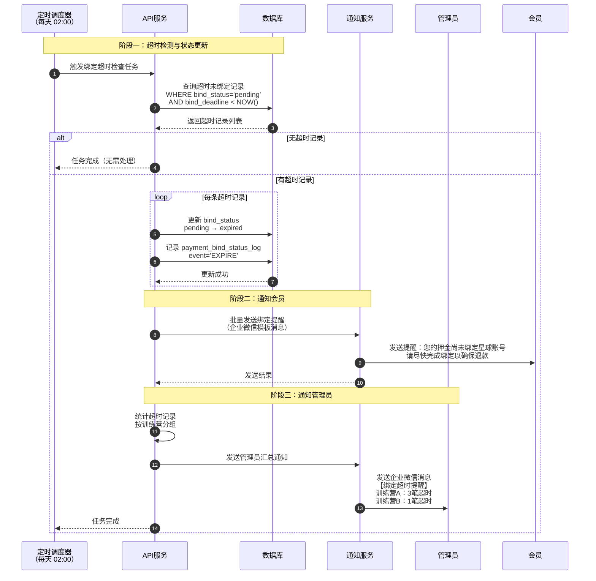
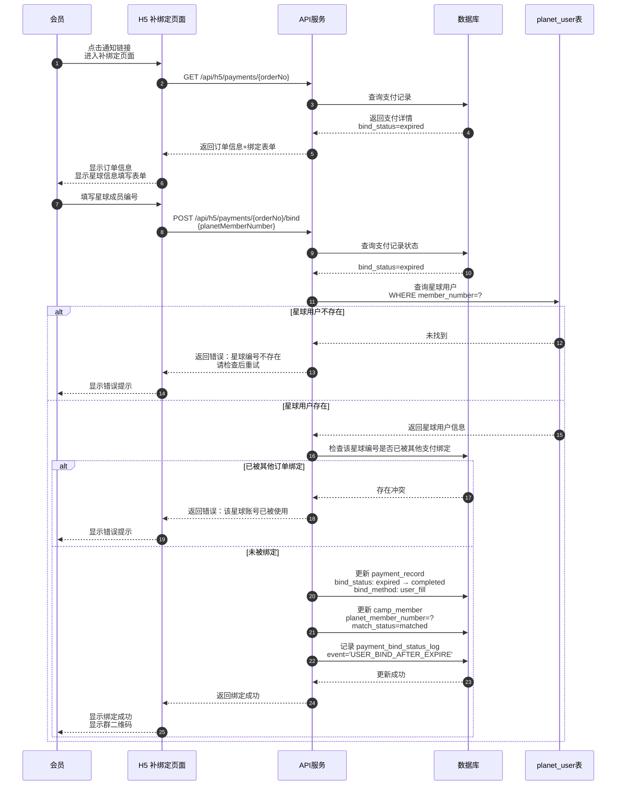
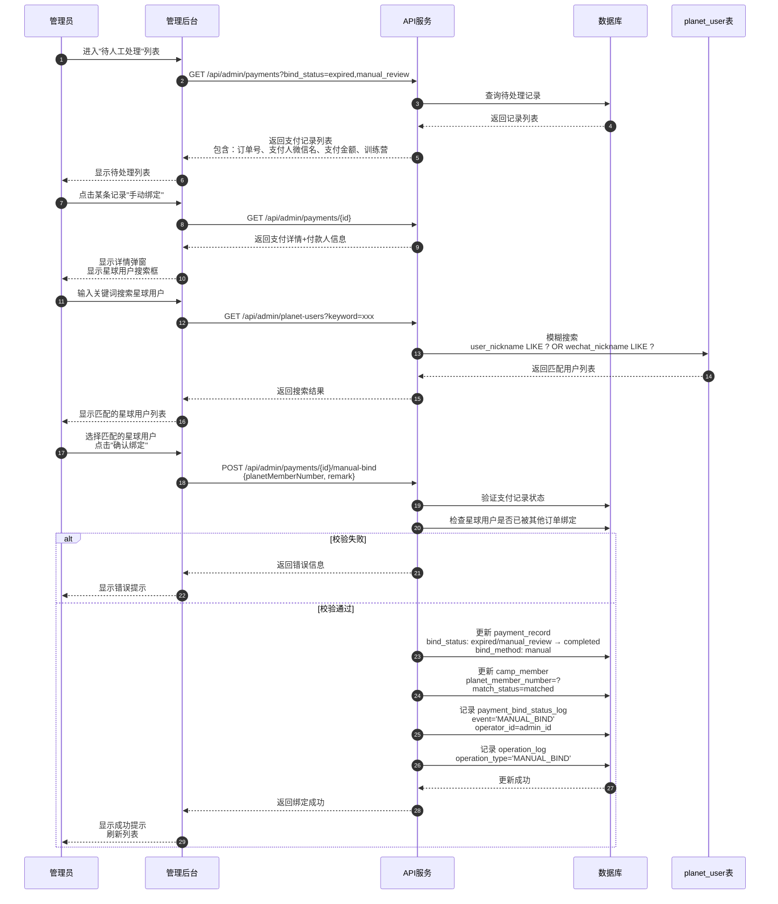

# 时序图

> **文档版本**: v1.3
> **最后更新**: 2025-12-12
> **SSOT引用**: [状态枚举定义.md](../design/状态枚举定义.md) - 时序中涉及的 bind_status、bind_method 等状态值

本文档展示知识星球训练营自动押金退款系统的核心场景交互时序。

> **2025-12 说明**：H5 端训练营列表页和详情页为**公开访问**，无需登录即可浏览。用户点击"立即报名"时才检查登录状态，未登录则触发 OAuth 授权。详见 [OAuth绑定完整时序图](./OAuth绑定完整时序图.md)。

---

## 一、会员报名支付时序（混合方案）

> 支持两种支付路径：OAuth 绑定（推荐）和固定二维码报名（降级/备用）
> 两种路径均要求用户必须填写星球信息后再支付

### 1.1 固定二维码报名流程（先填后付）

> **适用场景**：作为OAuth登录的降级方案，同时预留为星球API封锁后的备用入口

### 1.2 非星球用户引导流程

> **适用场景**：用户尚未加入知识星球，需先引导加入后再报名

### 1.3 星球信息异常处理时序（人工审核场景）

> **设计说明**：当用户填写的星球ID在打卡同步时无法匹配到有效的星球用户时，系统将记录标记为 `manual_review` 状态，由管理员人工处理。
>
> **触发场景**：
> - 打卡同步任务发现星球ID在知识星球中不存在
> - 用户填写的星球昵称与实际不符（可选校验）

---

## 二、打卡数据同步时序

### 2.1 定时同步流程

### 2.2 手动触发同步

---

## 三、退款名单生成时序

### 3.1 退款名单生成流程

> **设计说明**：不使用人工审核，仅支持三种绑定方式：
> 1. **H5主路径绑定**（bind_method=h5_bindplanet）- 用户在H5页面主动填写星球信息
> 2. **用户填写绑定**（bind_method=user_fill）- 用户在固定二维码支付后填写信息
> 3. **人工绑定**（bind_method=manual）- 超时未绑定由管理员人工处理

---

## 四、退款执行时序

### 4.1 批量退款流程

### 4.2 单笔退款详细流程

---

## 五、管理后台关键操作时序

### 5.1 创建训练营

### 5.2 查看统计报表

---

## 六、异常场景时序

### 6.1 Token 过期处理

### 6.2 退款失败重试

### 6.3 绑定超时处理时序

> **适用场景**：用户通过固定二维码支付后，在 7 天内未完成星球信息绑定。系统通过定时任务自动检测并处理超时记录。

### 6.4 超时后用户补绑定时序

> **适用场景**：用户在绑定过期后，通过 H5 页面主动补充绑定星球信息。

### 6.5 管理员人工绑定时序

> **适用场景**：超时后用户仍未自行绑定，管理员根据支付人微信昵称等信息在后台手动完成绑定。

---

## 相关文档

- [用户旅程图](./用户旅程图.md)
- [业务流程图](./业务流程图.md)
- [状态机](./状态机.md)
- [架构设计图](./架构设计图.md)

---

**变更历史**：
| 版本 | 日期 | 变更内容 |
|------|------|----------|
| v1.4 | 2025-12-12 | 新增6.3-6.5绑定超时处理时序图（架构验证补充） |
| v1.3 | 2025-12-12 | 添加H5公开访问说明，明确列表/详情页无需登录，对齐H5原型 |
| v1.1 | 2025-12-06 | 添加 SSOT 引用、版本信息、变更历史 |
| v1.0 | 2025-11-xx | 初始版本 |
