# 架构设计图

本文档使用 C4 模型展示知识星球训练营自动押金退款系统的架构设计。

---

## 一、C4 模型概述

C4 模型是一种分层的软件架构可视化方法，包含四个层次：

| 层次 | 英文 | 描述 | 受众 |
|------|------|------|------|
| Level 1 | System Context | 系统上下文 | 所有人 |
| Level 2 | Container | 容器图 | 技术人员 |
| Level 3 | Component | 组件图 | 开发人员 |
| Level 4 | Code | 代码图 | 开发人员 |

---

## 二、Level 1: 系统上下文图

### 2.1 系统上下文

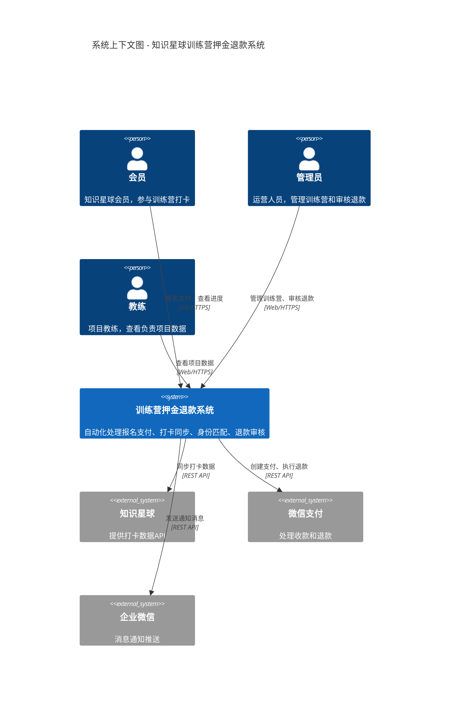

### 2.2 上下文说明

| 元素 | 类型 | 描述 |
|------|------|:-----|
| 会员 | 用户 | 知识星球会员，通过 H5 页面报名参与训练营 |
| 管理员 | 用户 | 运营人员，通过 Web 后台管理训练营 |
| 教练 | 用户 | 项目教练，查看负责项目的打卡数据 |
| 训练营系统 | 核心系统 | 本系统，处理完整的训练营生命周期 |
| 知识星球 | 外部系统 | 提供会员打卡数据的来源 |
| 微信支付 | 外部系统 | 处理押金收取和退款 |
| 企业微信 | 外部系统 | 发送退款通知等消息 |

---

## 三、Level 2: 容器图

### 3.1 容器架构

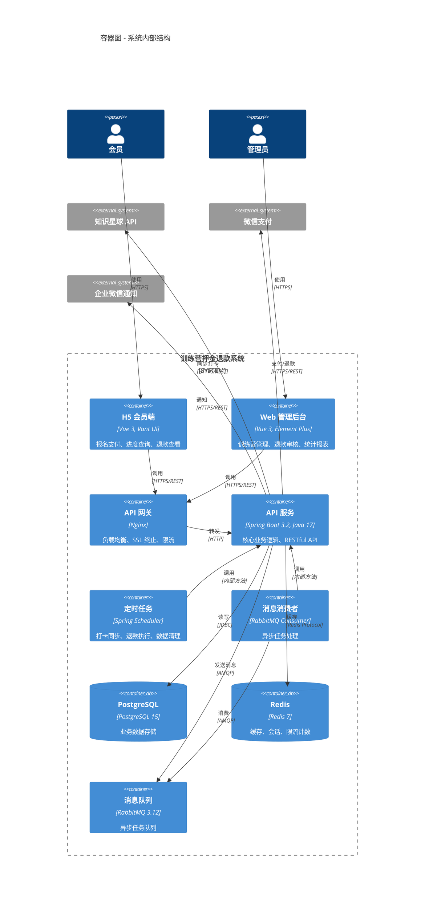

### 3.2 容器说明

| 容器 | 技术 | 职责 | 部署方式 |
|------|------|------|----------|
| H5 会员端 | Vue 3 + Vant | 会员报名、支付、进度查询 | CDN + Nginx |
| Web 管理后台 | Vue 3 + Element Plus | 训练营管理、退款审核 | CDN + Nginx |
| API 网关 | Nginx | 负载均衡、限流、SSL | 云主机 |
| API 服务 | Spring Boot 3.2 | 核心业务逻辑 | Docker/云主机 |
| 定时任务 | Spring Scheduler | 打卡同步、定时退款 | 与 API 服务同进程 |
| 消息消费者 | RabbitMQ Consumer | 异步任务处理 | 与 API 服务同进程 |
| PostgreSQL | PostgreSQL 15 | 业务数据持久化 | 云数据库 |
| Redis | Redis 7 | 缓存、会话、限流 | 云 Redis |
| 消息队列 | RabbitMQ 3.12 | 异步任务队列 | 云消息队列 |

---

## 四、Level 3: 组件图

### 4.1 API 服务组件

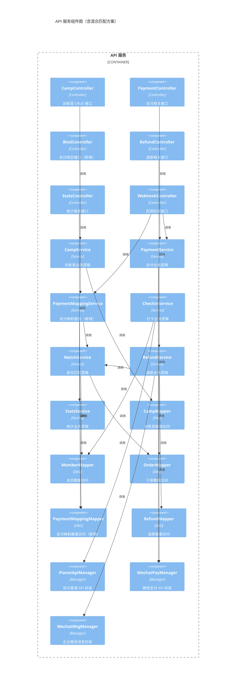

### 4.2 组件说明

#### Controller 层

| 组件 | 职责 | 主要接口 |
|------|------|----------|
| CampController | 训练营管理 | CRUD、发布、归档 |
| PaymentController | 支付处理 | 创建订单、支付状态查询 |
| BindController | 支付绑定（新增） | 用户填写绑定、查询绑定状态 |
| RefundController | 退款处理 | 生成名单、审核、执行 |
| StatsController | 统计报表 | 各维度数据统计 |
| WebhookController | 回调处理 | 支付回调、退款回调 |

#### Service 层

| 组件 | 职责 | 依赖 |
|------|------|------|
| CampService | 训练营生命周期管理 | CampMapper |
| PaymentService | 支付订单处理 | OrderMapper, WechatPayManager |
| PaymentMappingService | 支付映射管理（新增） | PaymentMappingMapper, MatchService |
| CheckinService | 打卡数据同步 | PlanetApiManager, MemberMapper |
| MatchService | 身份匹配算法 | MemberMapper, OrderMapper, PaymentMappingMapper |
| RefundService | 退款流程处理 | RefundMapper, MatchService, WechatPayManager |
| StatsService | 统计计算 | 多个 Mapper |

#### Manager 层（外部 API 封装）

| 组件 | 职责 | 外部系统 |
|------|------|----------|
| PlanetApiManager | 知识星球 API 调用 | 知识星球 |
| WechatPayManager | 微信支付 API 调用 | 微信支付 |
| WechatMsgManager | 企业微信消息发送 | 企业微信 |

### 4.3 核心模块交互（含混合匹配方案）

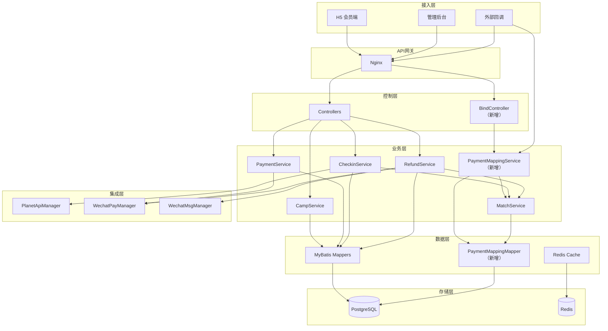

---

## 五、Level 4: 代码级设计

### 5.1 核心领域模型

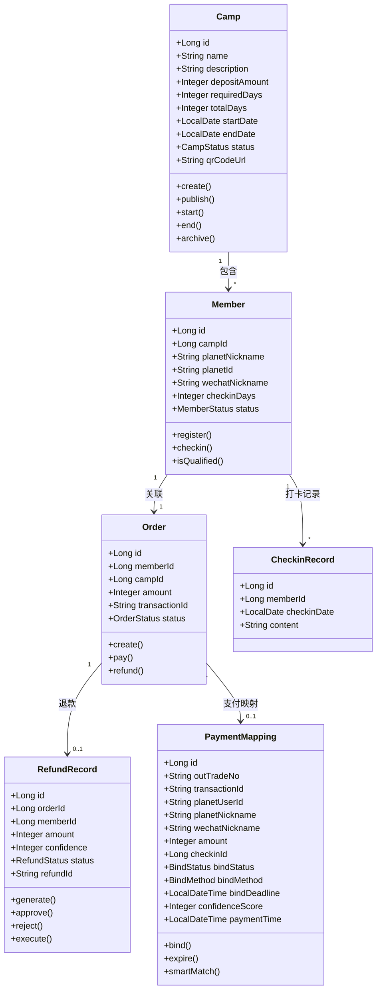

### 5.2 核心服务接口

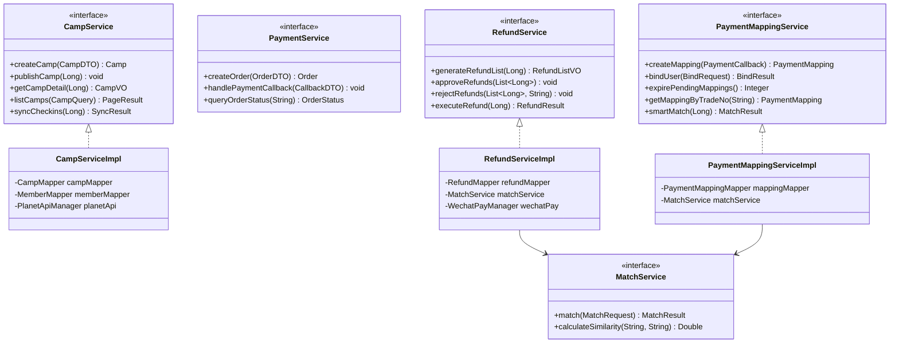

---

## 六、部署架构

### 6.1 部署图

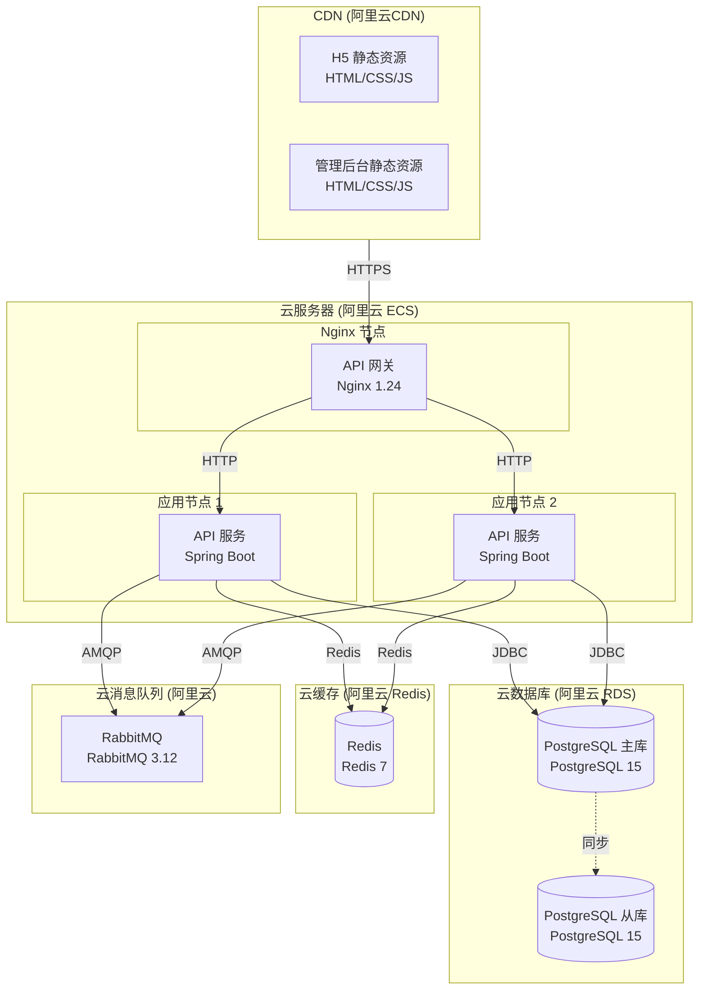

### 6.2 部署说明

| 层级 | 组件 | 规格 | 数量 |
|------|------|------|------|
| CDN | 静态资源 | - | 多节点 |
| 网关 | Nginx | 2C4G | 1（可扩展） |
| 应用 | API 服务 | 4C8G | 2（可扩展） |
| 数据库 | PostgreSQL | 4C16G | 1主1从 |
| 缓存 | Redis | 2C4G | 1（集群可选） |
| 消息 | RabbitMQ | 2C4G | 1（集群可选） |

---

## 七、数据流架构

### 7.1 核心数据流

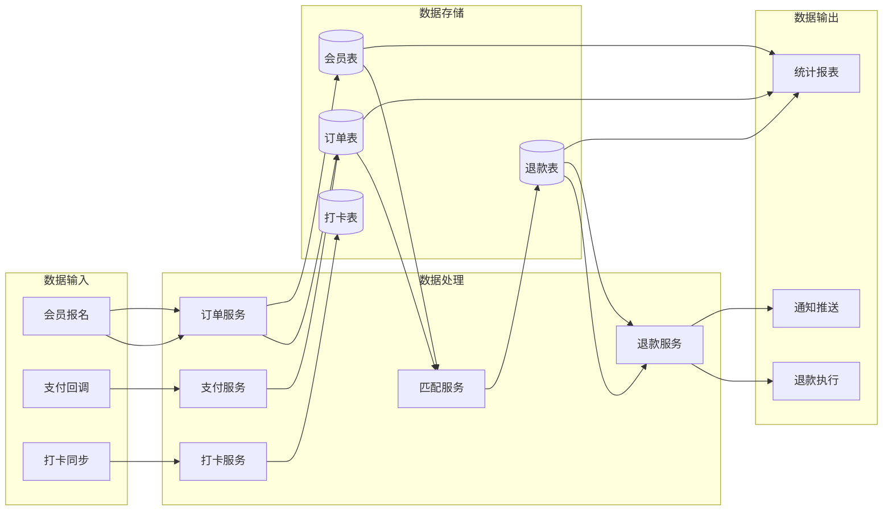

### 7.2 异步数据流

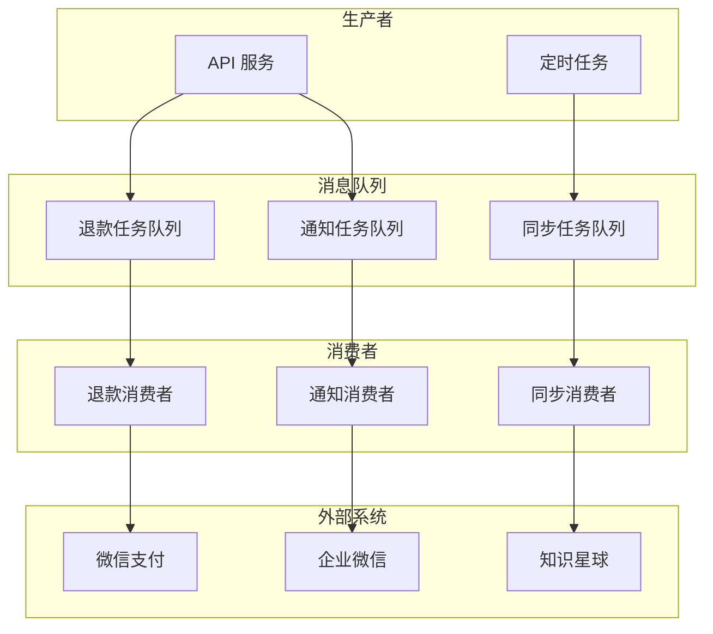

---

## 八、安全架构

### 8.1 安全分层

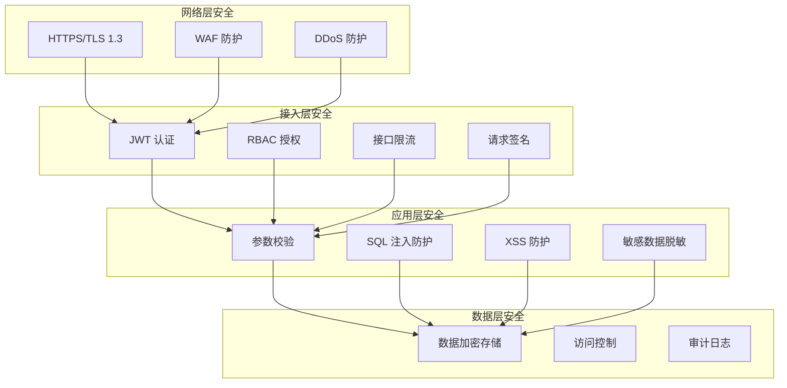

### 8.2 认证授权流程

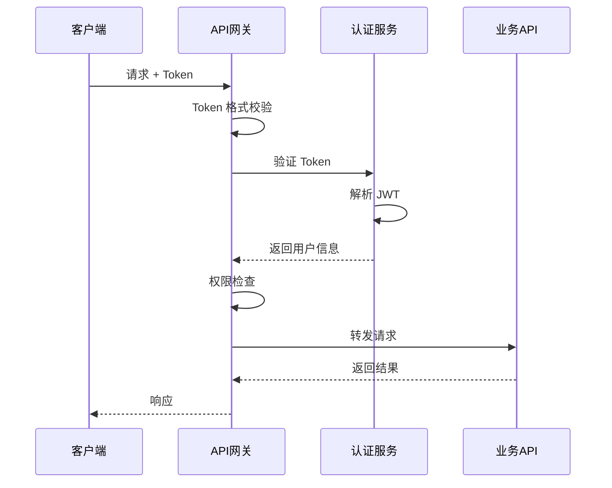

---

## 相关文档

- [用户旅程图](./用户旅程图.md)
- [业务流程图](./业务流程图.md)
- [时序图](./时序图.md)
- [状态机](./状态机.md)
