# 状态机

本文档展示知识星球训练营自动押金退款系统的核心实体状态机设计。

---

## 一、训练营状态机

### 1.1 状态图

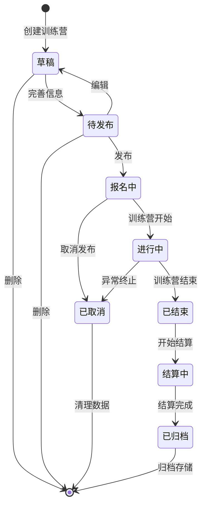

### 1.2 状态说明

| 状态 | 编码 | 描述 | 可执行操作 |
|------|------|------|-----------|
| 草稿 | `DRAFT` | 初始创建状态 | 编辑、删除、完善信息 |
| 待发布 | `PENDING` | 信息完善，等待发布 | 发布、编辑、删除 |
| 报名中 | `ENROLLING` | 已发布，接受报名 | 取消发布 |
| 进行中 | `ONGOING` | 训练营进行中 | 异常终止 |
| 已结束 | `ENDED` | 训练营结束 | 开始结算 |
| 结算中 | `SETTLING` | 正在处理退款 | - |
| 已归档 | `ARCHIVED` | 结算完成，已归档 | - |
| 已取消 | `CANCELLED` | 取消状态 | - |

### 1.3 状态转换规则

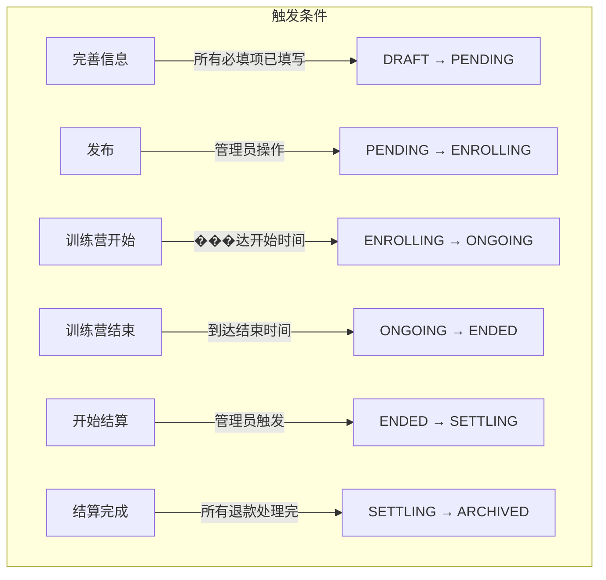

---

## 二、支付映射绑定状态机（新增）

> 混合方案核心：追踪支付记录与星球用户的绑定状态

### 2.1 绑定状态图

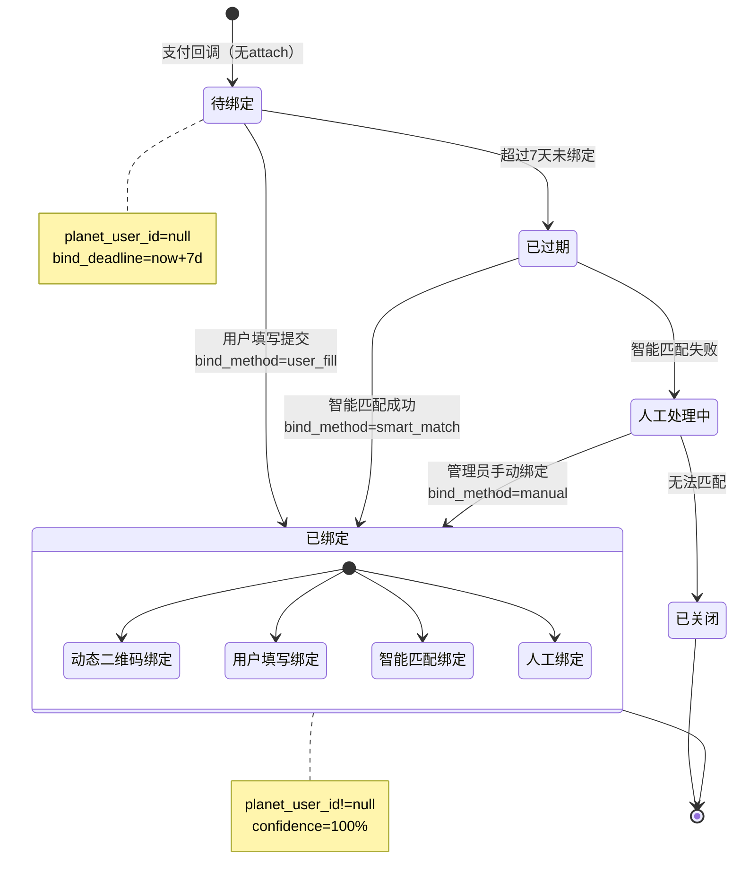

### 2.2 支付回调时的绑定处理

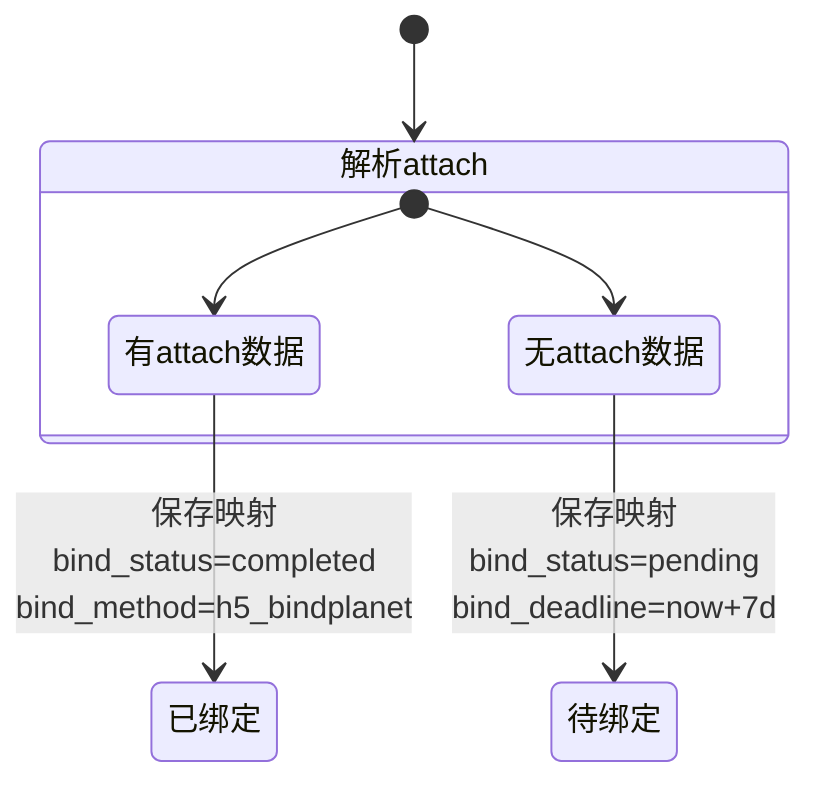

### 2.3 绑定状态说明

| 状态 | 编码 | 描述 | bind_method | 可执行操作 |
|------|------|------|-------------|-----------|
| 已绑定（H5） | `COMPLETED` | H5主路径OAuth登录后支付 | `h5_bindplanet` | - |
| 已绑定（填写） | `COMPLETED` | 降级路径用户支付后填写绑定 | `user_fill` | - |
| 已绑定（人工） | `COMPLETED` | 管理员手动绑定 | `manual` | - |
| 待绑定 | `PENDING` | 等待用户填写（降级路径） | `null` | 填写、等待超时 |
| 已过期 | `EXPIRED` | 超过绑定期限（7天） | `null` | 转人工审核 |
| 人工审核中 | `MANUAL_REVIEW` | 超时未绑定，等待管理员处理 | `null` | 人工绑定、关闭 |
| 已关闭 | `CLOSED` | 无法匹配 | `null` | - |

### 2.4 绑定超时处理流程

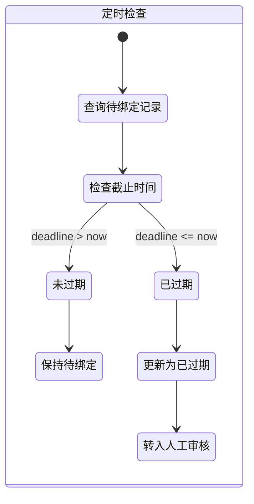

---

## 三、订单/支付状态机

### 3.1 状态图

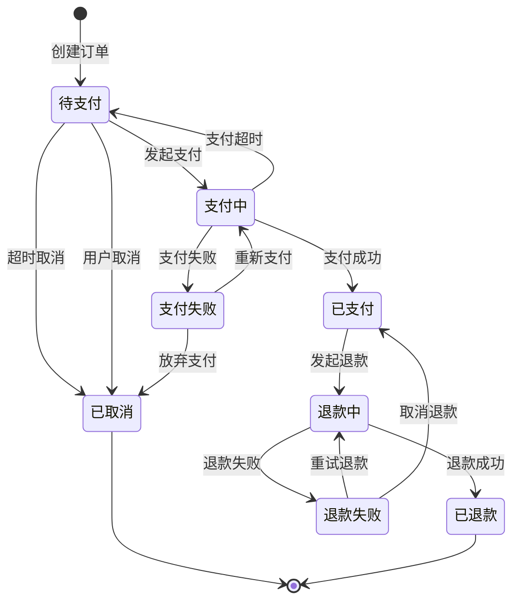

### 3.2 状态说明

| 状态 | 编码 | 描述 | 可执行操作 |
|------|------|------|-----------|
| 待支付 | `PENDING` | 订单创建，等待支付 | 发起支付、取消 |
| 支付中 | `PAYING` | 正在支付过程中 | - |
| 已支付 | `PAID` | 支付成功 | 发起退款 |
| 支付失败 | `PAY_FAILED` | 支付失败 | 重新支付、放弃 |
| 退款中 | `REFUNDING` | 正在退款 | - |
| 已退款 | `REFUNDED` | 退款成功 | - |
| 退款失败 | `REFUND_FAILED` | 退款失败 | 重试、取消 |
| 已取消 | `CANCELLED` | 订单取消 | - |

### 3.3 支付状态详细转换

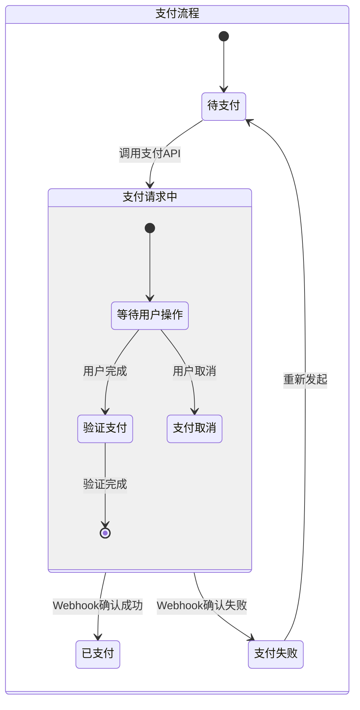

---

## 四、退款状态机

### 4.1 状态图

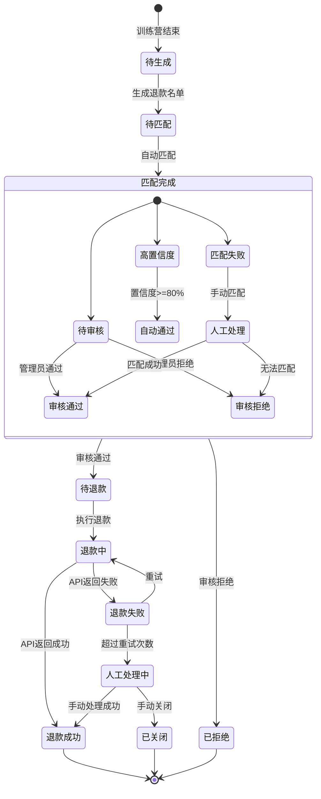

### 4.2 状态说明

| 状态 | 编码 | 描述 | 可执行操作 |
|------|------|------|-----------|
| 待生成 | `INIT` | 初始状态 | 生成退款名单 |
| 待匹配 | `MATCHING` | 等待身份匹配 | - |
| 高置信度 | `HIGH_CONFIDENCE` | 匹配置信度>=80% | 自动审核通过 |
| 待审核 | `PENDING_REVIEW` | 需要人工审核 | 通过、拒绝 |
| 匹配失败 | `MATCH_FAILED` | 自动匹配失败 | 人工匹配 |
| 待退款 | `APPROVED` | 审核通过，等待退款 | 执行退款 |
| 退款中 | `REFUNDING` | 正在退款 | - |
| 退款成功 | `REFUNDED` | 退款完成 | - |
| 退款失败 | `REFUND_FAILED` | 退款失败 | 重试、人工处理 |
| 人工处理中 | `MANUAL_PROCESSING` | 需要人工介入 | 手动退款、关闭 |
| 已拒绝 | `REJECTED` | 审核拒绝 | - |
| 已关闭 | `CLOSED` | 手动关闭 | - |

### 4.3 退款处理详细流程

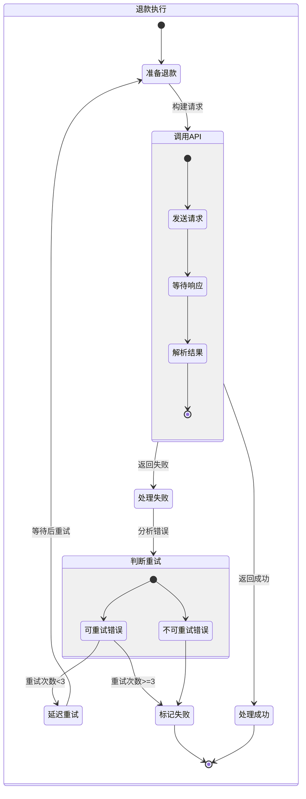

---

## 五、打卡同步状态机

### 5.1 状态图

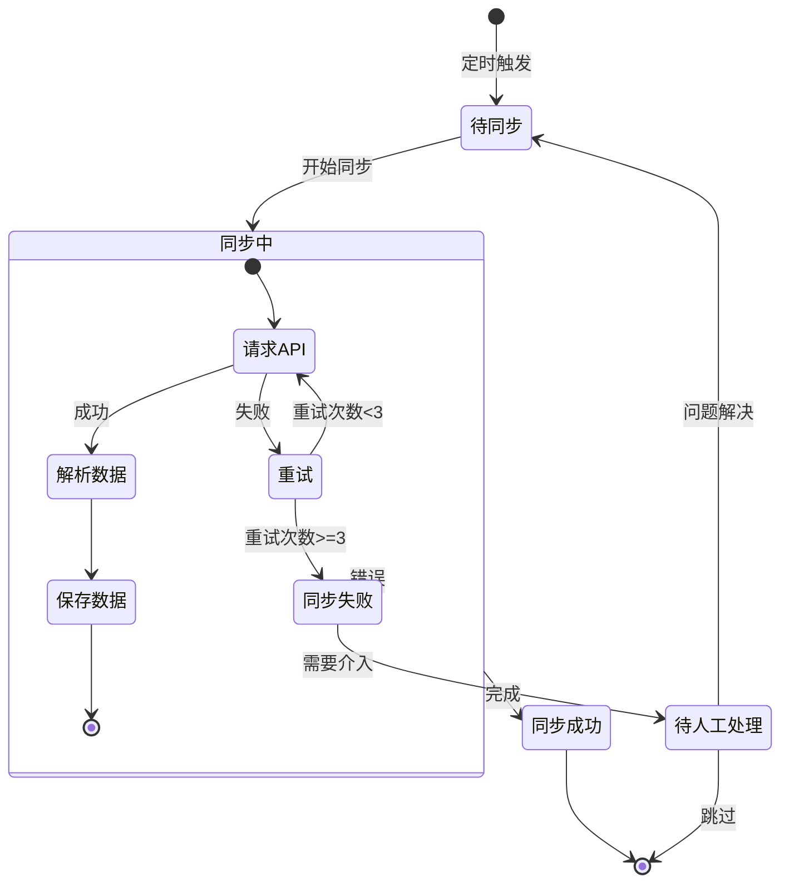

### 5.2 状态说明

| 状态 | 编码 | 描述 | 可执行操作 |
|------|------|------|-----------|
| 待同步 | `PENDING` | 等待同步 | 触发同步 |
| 同步中 | `SYNCING` | 正在同步 | - |
| 同步成功 | `SUCCESS` | 同步完成 | - |
| 同步失败 | `FAILED` | 同步失败 | 重试 |
| 待人工处理 | `MANUAL` | 需要人工介入 | 处理、跳过 |

---

## 六、用户打卡状态机

### 6.1 状态图

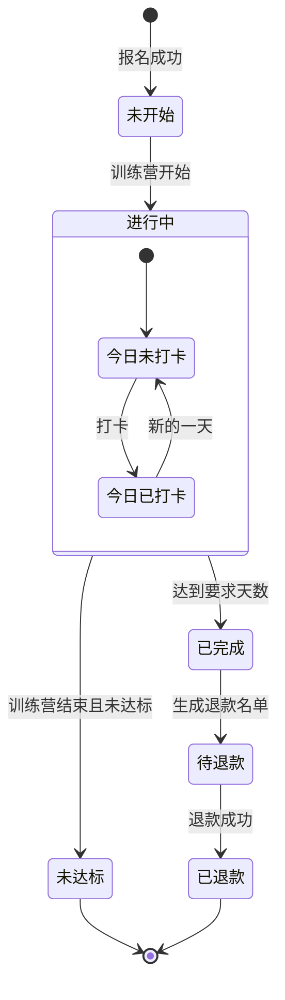

### 6.2 状态说明

| 状态 | 编码 | 描述 | 可执行操作 |
|------|------|------|-----------|
| 未开始 | `NOT_STARTED` | 已报名，训练营未开始 | - |
| 进行中 | `IN_PROGRESS` | 训练营进行中 | 打卡 |
| 已完成 | `COMPLETED` | 达到打卡要求 | - |
| 未达标 | `FAILED` | 未达到打卡要求 | - |
| 待退款 | `PENDING_REFUND` | 等待退款 | - |
| 已退款 | `REFUNDED` | 退款完成 | - |

---

## 七、状态转换事件汇总

### 7.1 训练营状态事件

| 事件 | 触发方式 | 来源状态 | 目标状态 | 备注 |
|------|----------|----------|----------|------|
| CREATE | 管理员操作 | - | DRAFT | 创建训练营 |
| COMPLETE_INFO | 管理员操作 | DRAFT | PENDING | 信息完善 |
| PUBLISH | 管理员操作 | PENDING | ENROLLING | 发布 |
| START | 系统定时 | ENROLLING | ONGOING | 到达开始时间 |
| END | 系统定时 | ONGOING | ENDED | 到达结束时间 |
| SETTLE | 管理员触发 | ENDED | SETTLING | 开始结算 |
| ARCHIVE | 系统自动 | SETTLING | ARCHIVED | 结算完成 |
| CANCEL | 管理员操作 | ENROLLING/ONGOING | CANCELLED | 取消 |

### 7.2 支付映射绑定事件（新增）

| 事件 | 触发方式 | 来源状态 | 目标状态 | 备注 |
|------|----------|----------|----------|------|
| CREATE_H5 | Webhook | - | COMPLETED | H5主路径支付，自动绑定 |
| CREATE_FALLBACK | Webhook | - | PENDING | 降级路径支付，待绑定 |
| USER_BIND | 用户操作 | PENDING | COMPLETED | 用户填写绑定 |
| EXPIRE | 定时任务 | PENDING | EXPIRED | 超过7天未绑定 |
| TO_MANUAL_REVIEW | 定时任务 | EXPIRED | MANUAL_REVIEW | 转入人工审核 |
| MANUAL_BIND | 管理员操作 | MANUAL_REVIEW | COMPLETED | 人工绑定 |
| CLOSE | 管理员操作 | MANUAL_REVIEW | CLOSED | 无法匹配关闭 |

### 7.3 订单状态事件

| 事件 | 触发方式 | 来源状态 | 目标状态 | 备注 |
|------|----------|----------|----------|------|
| CREATE | 用户操作 | - | PENDING | 创建订单 |
| PAY | 用户操作 | PENDING | PAYING | 发起支付 |
| PAY_SUCCESS | Webhook | PAYING | PAID | 支付成功 |
| PAY_FAIL | Webhook | PAYING | PAY_FAILED | 支付失败 |
| REFUND | 系统触发 | PAID | REFUNDING | 发起退款 |
| REFUND_SUCCESS | Webhook | REFUNDING | REFUNDED | 退款成功 |
| REFUND_FAIL | Webhook | REFUNDING | REFUND_FAILED | 退款失败 |
| CANCEL | 用户/系统 | PENDING | CANCELLED | 取消订单 |

### 7.4 退款状态事件

| 事件 | 触发方式 | 来源状态 | 目标状态 | 备注 |
|------|----------|----------|----------|------|
| GENERATE | 管理员触发 | INIT | MATCHING | 生成名单 |
| MATCH | 系统自动 | MATCHING | HIGH_CONFIDENCE/PENDING_REVIEW/MATCH_FAILED | 匹配结果 |
| APPROVE | 系统/管理员 | HIGH_CONFIDENCE/PENDING_REVIEW | APPROVED | 审核通过 |
| REJECT | 管理员操作 | PENDING_REVIEW | REJECTED | 审核拒绝 |
| EXECUTE | 系统触发 | APPROVED | REFUNDING | 执行退款 |
| SUCCESS | Webhook | REFUNDING | REFUNDED | 退款成功 |
| FAIL | Webhook | REFUNDING | REFUND_FAILED | 退款失败 |
| RETRY | 系统自动 | REFUND_FAILED | REFUNDING | 重试 |
| ESCALATE | 系统自动 | REFUND_FAILED | MANUAL_PROCESSING | 升级人工 |

---

## 八、状态持久化设计

### 8.1 状态表结构

```sql
-- 训练营状态记录
CREATE TABLE camp_status_log (
    id BIGSERIAL PRIMARY KEY,
    camp_id BIGINT NOT NULL,
    from_status VARCHAR(32),
    to_status VARCHAR(32) NOT NULL,
    event VARCHAR(64) NOT NULL,
    operator_id BIGINT,
    remark TEXT,
    created_at TIMESTAMP DEFAULT CURRENT_TIMESTAMP
);

-- 支付映射绑定记录（新增）
CREATE TABLE payment_mapping (
    id BIGSERIAL PRIMARY KEY,
    out_trade_no VARCHAR(64) NOT NULL UNIQUE,
    transaction_id VARCHAR(64),
    planet_user_id VARCHAR(32),
    planet_nickname VARCHAR(128),
    wechat_nickname VARCHAR(128),
    amount INTEGER NOT NULL,
    checkin_id BIGINT NOT NULL,
    bind_status VARCHAR(32) NOT NULL DEFAULT 'pending',
    bind_method VARCHAR(32),
    bind_deadline TIMESTAMP,
    confidence_score INTEGER,
    payment_time TIMESTAMP,
    created_at TIMESTAMP DEFAULT CURRENT_TIMESTAMP,
    updated_at TIMESTAMP DEFAULT CURRENT_TIMESTAMP
);

-- 支付映射绑定状态日志（新增）
CREATE TABLE payment_mapping_status_log (
    id BIGSERIAL PRIMARY KEY,
    mapping_id BIGINT NOT NULL,
    from_status VARCHAR(32),
    to_status VARCHAR(32) NOT NULL,
    event VARCHAR(64) NOT NULL,
    operator_id BIGINT,
    extra_data JSONB,
    created_at TIMESTAMP DEFAULT CURRENT_TIMESTAMP
);

-- 订单状态记录
CREATE TABLE order_status_log (
    id BIGSERIAL PRIMARY KEY,
    order_id BIGINT NOT NULL,
    from_status VARCHAR(32),
    to_status VARCHAR(32) NOT NULL,
    event VARCHAR(64) NOT NULL,
    extra_data JSONB,
    created_at TIMESTAMP DEFAULT CURRENT_TIMESTAMP
);

-- 退款状态记录
CREATE TABLE refund_status_log (
    id BIGSERIAL PRIMARY KEY,
    refund_id BIGINT NOT NULL,
    from_status VARCHAR(32),
    to_status VARCHAR(32) NOT NULL,
    event VARCHAR(64) NOT NULL,
    operator_id BIGINT,
    remark TEXT,
    created_at TIMESTAMP DEFAULT CURRENT_TIMESTAMP
);
```

### 8.2 状态变更审计

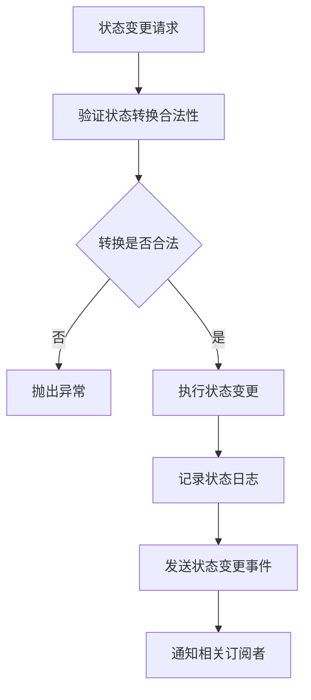

---

## 相关文档

- [用户旅程图](./用户旅程图.md)
- [业务流程图](./业务流程图.md)
- [时序图](./时序图.md)
- [架构设计图](./架构设计图.md)
