# 状态机

> **文档版本**: v1.2
> **最后更新**: 2025-12-08
> **SSOT引用**: [状态枚举定义.md](../design/状态枚举定义.md) - 所有状态值的权威定义

本文档展示知识星球训练营自动押金退款系统的核心实体状态机设计。

---

## 一、训练营状态机

### 1.1 状态图

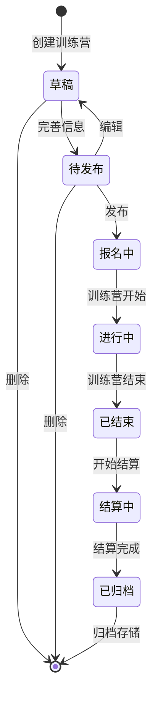

### 1.2 状态说明

> 引用自 [状态枚举定义.md - camp_status](../design/状态枚举定义.md#5-camp_status---训练营状态)

| 状态 | 编码 | 描述 | 可执行操作 |
|------|------|------|-----------|
| 草稿 | `DRAFT` | 初始创建状态 | 编辑、删除、完善信息 |
| 待发布 | `PENDING` | 信息完善，等待发布 | 发布、编辑、删除 |
| 报名中 | `ENROLLING` | 已发布，接受报名 | - |
| 进行中 | `ONGOING` | 训练营进行中 | - |
| 已结束 | `ENDED` | 训练营结束 | 开始结算 |
| 结算中 | `SETTLING` | 正在处理退款 | - |
| 已归档 | `ARCHIVED` | 结算完成，已归档 | - |

> **注意**：SSOT 中不包含 `CANCELLED` 状态，取消场��通过删除或其他业务逻辑处理。

### 1.3 状态转换规则

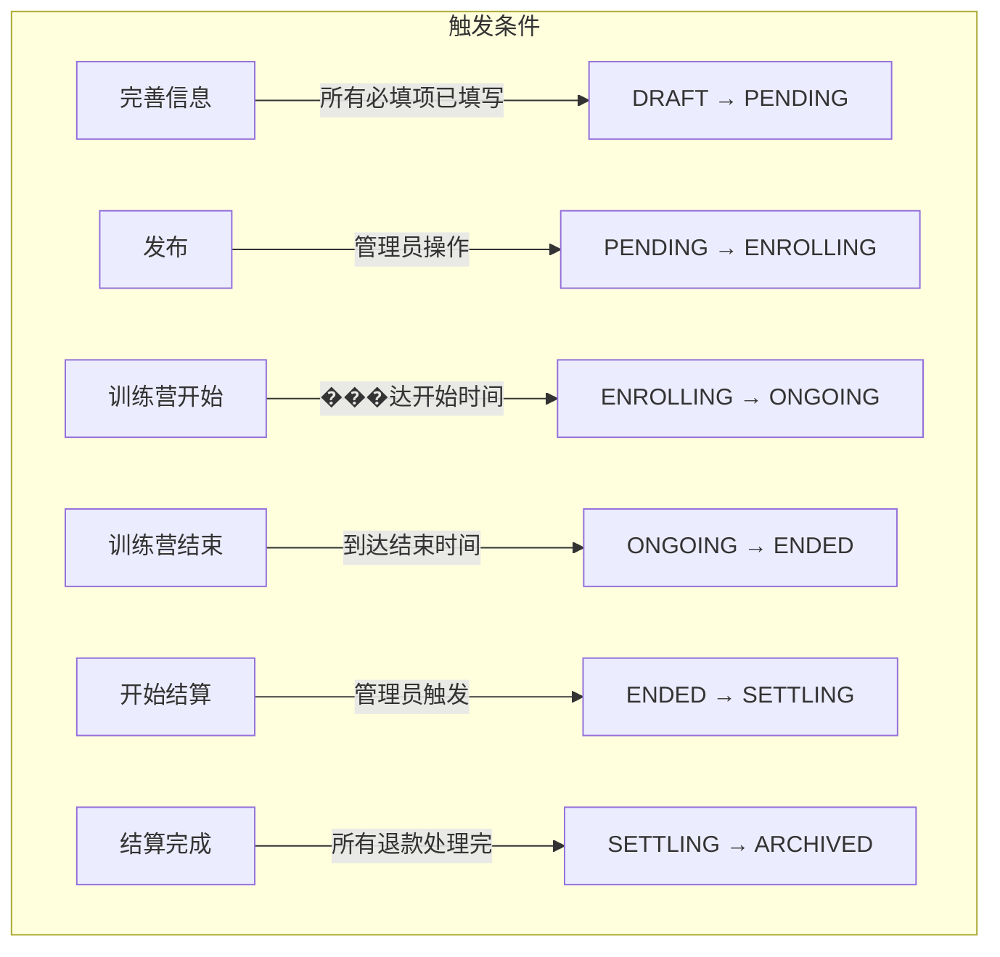

---

## 二、支付映射绑定状态机（新增）

> 混合方案核心：追踪支付记录与星球用户的绑定状态

### 2.1 绑定状态图

> **设计说明**：采用人工审核流程。H5 主路径用户通过 OAuth 登录后支付，直接绑定；降级路径用户扫固定二维码支付后需手动填写星球信息；超时未绑定的订单转入人工审核，由管理员处理。

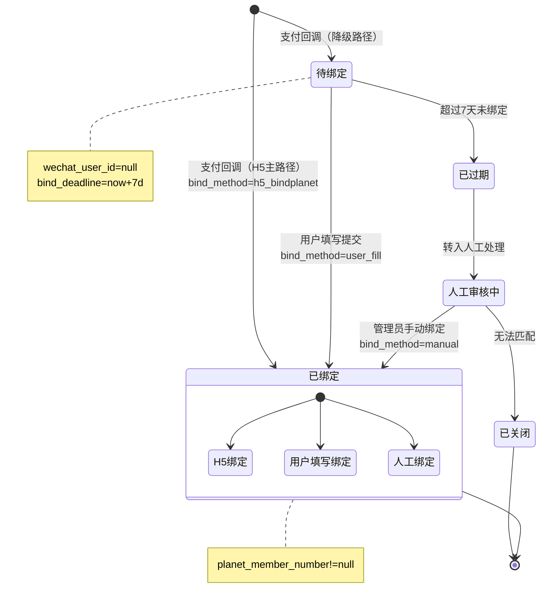

### 2.2 支付回调时的绑定处理

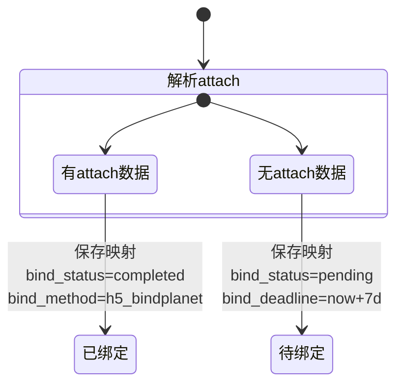

### 2.3 绑定状态说明

> 引用自 [状态枚举定义.md - bind_status](../design/状态枚举定义.md#1-bind_status---支付绑定状态)

| 状态 | 编码 | 描述 | bind_method | 可执行操作 |
|------|------|------|-------------|-----------|
| 已绑定（H5） | `completed` | H5主路径OAuth登录后支付 | `h5_bindplanet` | - |
| 已绑定（填写） | `completed` | 降级路径用户支付后填写绑定 | `user_fill` | - |
| 已绑定（人工） | `completed` | 管理员手动绑定 | `manual` | - |
| 待绑定 | `pending` | 等待用户填写（降级路径） | `null` | 填写、等待超时 |
| 已过期 | `expired` | 超过绑定期限（7天） | `null` | 转人工审核 |
| 人工审核中 | `manual_review` | 超时未绑定，等待管理员处理 | `null` | 人工绑定、关闭 |
| 已关闭 | `closed` | 无法匹配 | `null` | - |

> **注意**：bind_status 使用小写编码（如 `completed`、`pending`），与数据库存储一致。

### 2.4 绑定超时处理流程

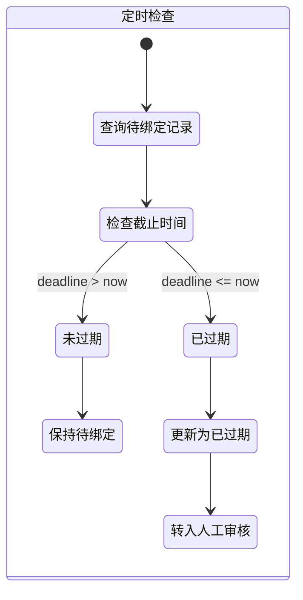

---

## 三、订单/支付状态机

### 3.1 状态图

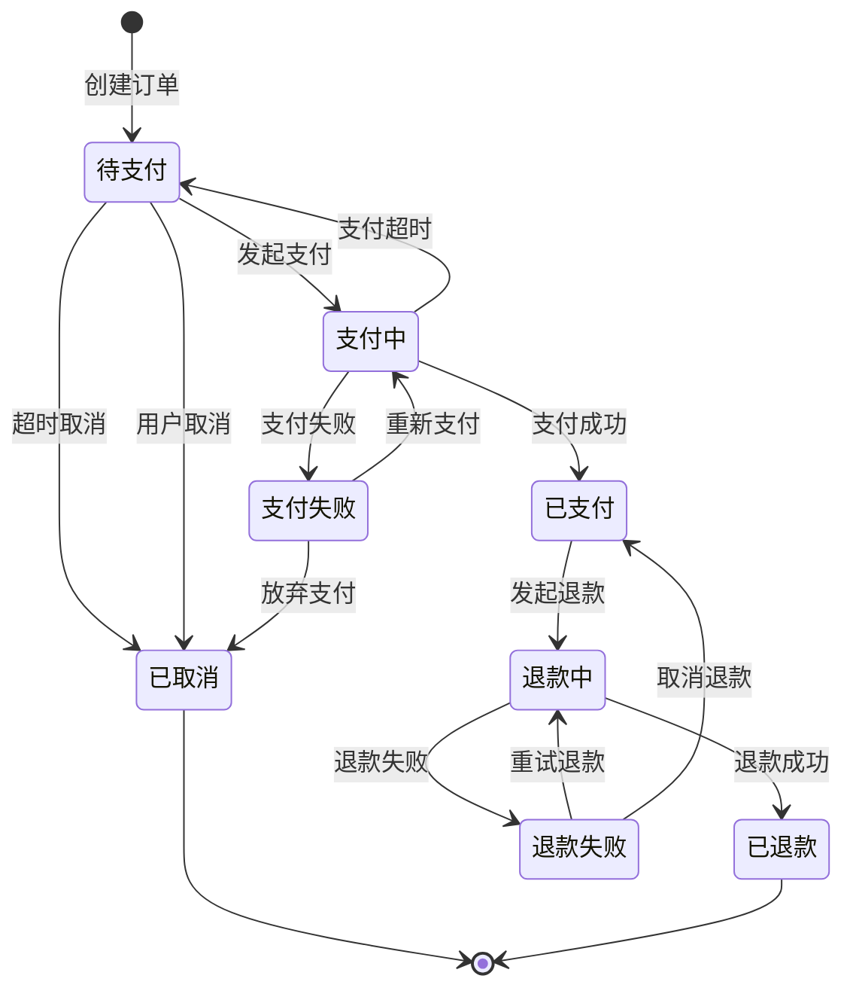

### 3.2 状态说明

> 引用自 [状态枚举定义.md - pay_status](../design/状态枚举定义.md#2-pay_status---支付状态)

| 状态 | 编码 | 描述 | 可执行操作 |
|------|------|------|-----------|
| 待支付 | `pending` | 订单创建，等待支付 | 发起支付、取消 |
| 已支付 | `success` | 支付成功 | 发起退款 |
| 支付失败 | `failed` | 支付失败 | 重新支付、放弃 |
| 已退款 | `refunded` | 退款成功 | - |

> **注意**：pay_status 使用小写编码（如 `success`、`pending`），与 SSOT 一致。状态图中的中间状态（支付中、退款中等）为流程展示用，实际数据库仅存储上述 4 种状态。

### 3.3 支付状态详细转换

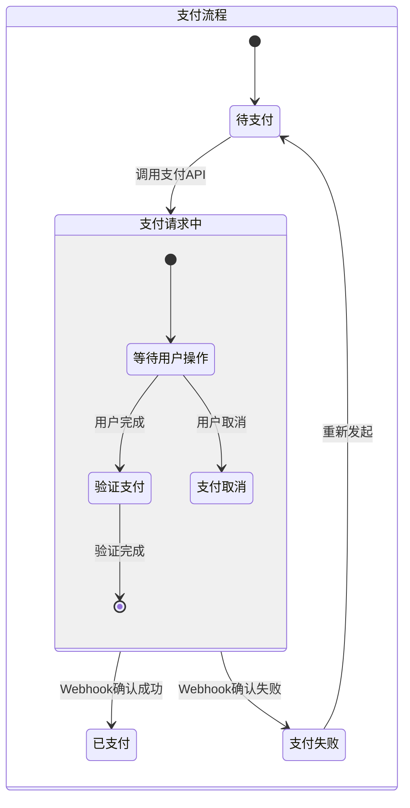

---

## 四、退款状态机

### 4.1 状态图

> **设计说明**：移除人工审核逻辑，仅支持已绑定用户自动生成退款申请，未绑定用户需先完成人工审核绑定后才能退款。

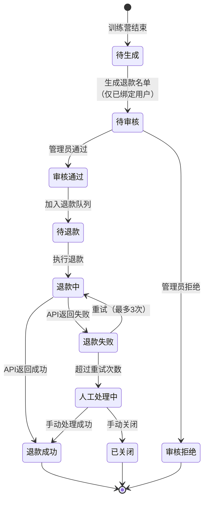

### 4.2 状态说明

> 引用自 [状态枚举定义.md - refund_status](../design/状态枚举定义.md#4-refund_status---退款状态)

| 状态 | 编码 | 描述 | 可执行操作 |
|------|------|------|-----------|
| 待处理 | `PENDING` | 退款申请已创建，待审核 | 通过、拒绝 |
| 审核通过 | `APPROVED` | 审核通过，待执行退款 | 执行退款 |
| 审核拒绝 | `REJECTED` | 管理员拒绝退款申请 | - |
| 处理中 | `PROCESSING` | 正在调用微信退款API | - |
| 退款成功 | `SUCCESS` | 微信退款完成 | - |
| 退款失败 | `FAILED` | 微信退款失败，待重试 | 重试（最多3次） |

> **注意**：状态图（4.1）中的中间状态（待生成、待退款、人工处理中、已关闭）为流程展示用，实际数据库仅存储上述 6 种 SSOT 状态。流程中的"人工处理"通过 FAILED 状态 + 重试次数超限来触发。

### 4.3 退款处理详细流程

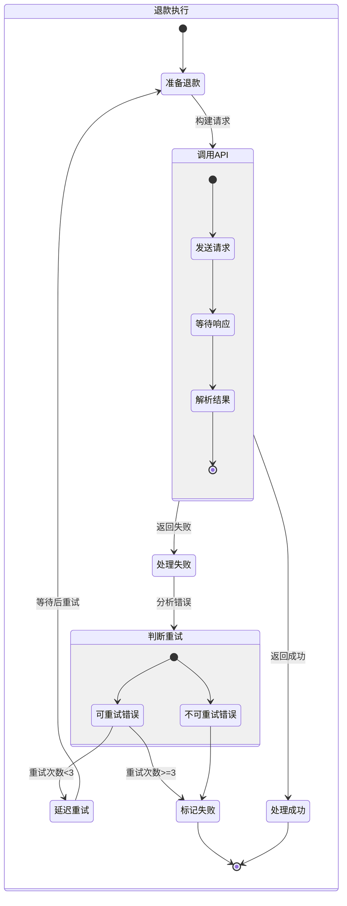

---

## 五、打卡同步状态机

### 5.1 状态图

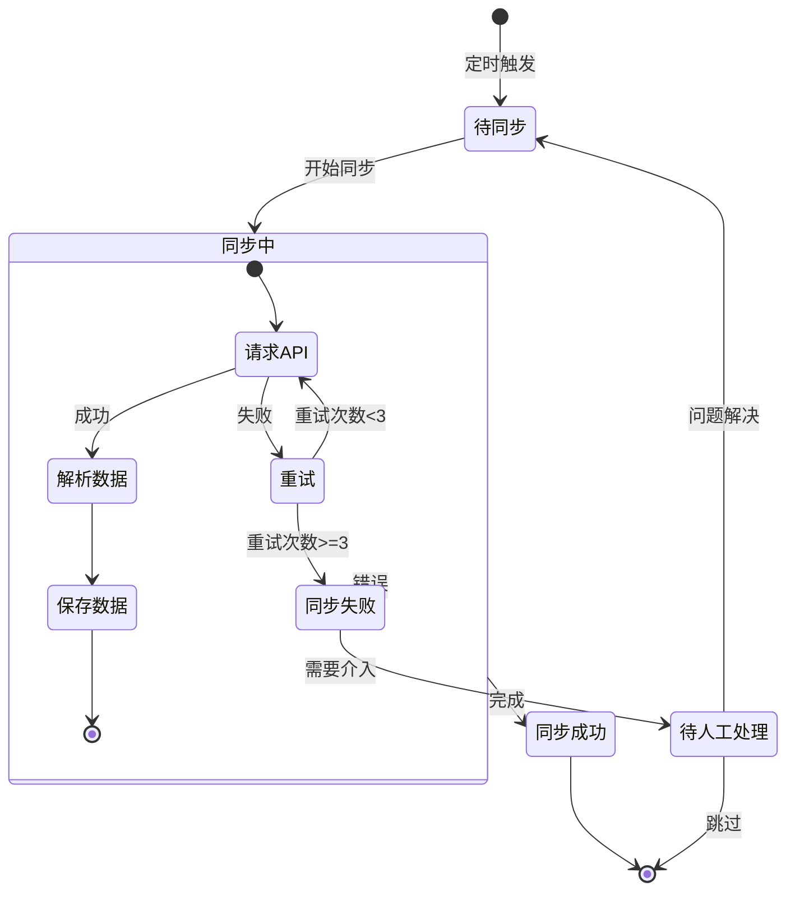

### 5.2 状态说明

> 引用自 [状态枚举定义.md - sync_status](../design/状态枚举定义.md#8-sync_status---同步任务状态)

| 状态 | 编码 | 描述 | 可执行操作 |
|------|------|------|-----------|
| 进行中 | `RUNNING` | 同步任务正在执行 | - |
| 成功 | `SUCCESS` | 同步完成，无错误 | - |
| 部分成功 | `PARTIAL` | 部分数据同步成功，部分失败 | 重试 |
| 失败 | `FAILED` | 同步失败（重试耗尽或严重错误） | 重试 |
| 已取消 | `CANCELLED` | 手动取消或系统中断 | - |

> **注意**：状态图（5.1）中"待同步"、"待人工处理"为流程展示用中间状态。实际同步任务开始时即为 `RUNNING`，结束后为 `SUCCESS`/`PARTIAL`/`FAILED`/`CANCELLED` 之一。

---

## 六、用户打卡状态机

### 6.1 状态图

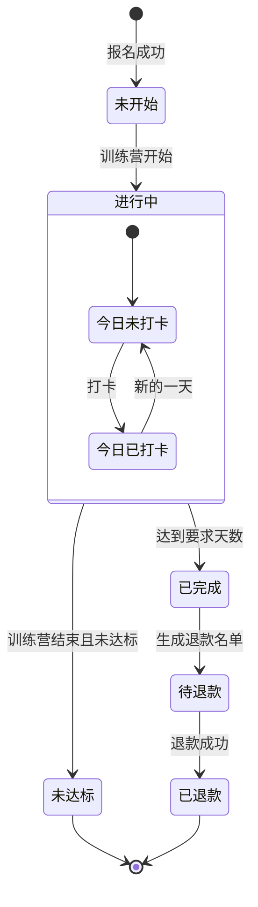

### 6.2 状态说明

| 状态 | 编码 | 描述 | 可执行操作 |
|------|------|------|-----------|
| 未开始 | `NOT_STARTED` | 已报名，训练营未开始 | - |
| 进行中 | `IN_PROGRESS` | 训练营进行中 | 打卡 |
| 已完成 | `COMPLETED` | 达到打卡要求 | - |
| 未达标 | `FAILED` | 未达到打卡要求 | - |
| 待退款 | `PENDING_REFUND` | 等待退款 | - |
| 已退款 | `REFUNDED` | 退款完成 | - |

---

## 七、状态转换事件汇总

### 7.1 训练营状态事件

| 事件 | 触发方式 | 来源状态 | 目标状态 | 备注 |
|------|----------|----------|----------|------|
| CREATE | 管理员操作 | - | DRAFT | 创建训练营 |
| COMPLETE_INFO | 管理员操作 | DRAFT | PENDING | 信息完善 |
| PUBLISH | 管理员操作 | PENDING | ENROLLING | 发布 |
| START | 系统定时 | ENROLLING | ONGOING | 到达开始时间 |
| END | 系统定时 | ONGOING | ENDED | 到达结束时间 |
| SETTLE | 管理员触发 | ENDED | SETTLING | 开始结算 |
| ARCHIVE | 系统自动 | SETTLING | ARCHIVED | 结算完成 |

> **注意**：SSOT 中的 `camp_status` 不包含 `CANCELLED` 状态，取消场景通过删除训练营或其他业务逻辑处理。

### 7.2 支付映射绑定事件（新增）

> 状态值引用 [状态枚举定义.md - bind_status](../design/状态枚举定义.md#1-bind_status---支付绑定状态)

| 事件 | 触发方式 | 来源状态 | 目标状态 | 备注 |
|------|----------|----------|----------|------|
| CREATE_H5 | Webhook | - | `completed` | H5主路径支付，自动绑定 |
| CREATE_FALLBACK | Webhook | - | `pending` | 降级路径支付，待绑定 |
| USER_BIND | 用户操作 | `pending` | `completed` | 用户填写绑定 |
| EXPIRE | 定时任务 | `pending` | `expired` | 超过7天未绑定 |
| TO_MANUAL_REVIEW | 定时任务 | `expired` | `manual_review` | 转入人工审核 |
| MANUAL_BIND | 管理员操作 | `manual_review` | `completed` | 人工绑定 |
| CLOSE | 管理员操作 | `manual_review` | `closed` | 无法匹配关闭 |

### 7.3 订单状态事件

> 状态值引用 [状态枚举定义.md - pay_status](../design/状态枚举定义.md#2-pay_status---支付状态)
> **注意**：pay_status 仅有 4 种 SSOT 状态，下表中的中间状态仅用于事件描述。

| 事件 | 触发方式 | 来源状态 | 目标状态 | 备注 |
|------|----------|----------|----------|------|
| CREATE | 用户操作 | - | `pending` | 创建订单 |
| PAY_SUCCESS | Webhook | `pending` | `success` | 支付成功 |
| PAY_FAIL | Webhook | `pending` | `failed` | 支付失败 |
| REFUND_SUCCESS | Webhook | `success` | `refunded` | 退款成功 |
| CANCEL | 用户/系统 | `pending` | `failed` | 取消订单（超时/用户取消） |

### 7.4 退款状态事件

> 状态值引用 [状态枚举定义.md - refund_status](../design/状态枚举定义.md#4-refund_status---退款状态)

| 事件 | 触发方式 | 来源状态 | 目标状态 | 备注 |
|------|----------|----------|----------|------|
| CREATE | 系统自动 | - | `PENDING` | 训练营结束，生成退款申请（仅已绑定用户） |
| APPROVE | 管理员操作 | `PENDING` | `APPROVED` | 审核通过 |
| REJECT | 管理员操作 | `PENDING` | `REJECTED` | 审核拒绝 |
| EXECUTE | 系统触发 | `APPROVED` | `PROCESSING` | 执行退款（调用微信API） |
| SUCCESS | Webhook | `PROCESSING` | `SUCCESS` | 退款成功 |
| FAIL | Webhook | `PROCESSING` | `FAILED` | 退款失败 |
| RETRY | 系统自动 | `FAILED` | `PROCESSING` | 重试（最多3次） |

---

## 八、状态持久化设计

### 8.1 状态表结构

```sql
-- 训练营状态记录
CREATE TABLE camp_status_log (
    id BIGSERIAL PRIMARY KEY,
    camp_id BIGINT NOT NULL,
    from_status VARCHAR(32),
    to_status VARCHAR(32) NOT NULL,
    event VARCHAR(64) NOT NULL,
    operator_id BIGINT,
    remark TEXT,
    created_at TIMESTAMP DEFAULT CURRENT_TIMESTAMP
);

-- 支付绑定状态日志（记录 payment_record.bind_status 变更）
-- 注：支付和绑定信息统一存储在 payment_record 表中，不再单独建 payment_mapping 表
CREATE TABLE payment_bind_status_log (
    id BIGSERIAL PRIMARY KEY,
    payment_id BIGINT NOT NULL COMMENT '关联 payment_record.id',
    from_status VARCHAR(32),
    to_status VARCHAR(32) NOT NULL,
    event VARCHAR(64) NOT NULL,
    operator_id BIGINT,
    extra_data JSONB,
    created_at TIMESTAMP DEFAULT CURRENT_TIMESTAMP
);

-- 订单状态记录
CREATE TABLE order_status_log (
    id BIGSERIAL PRIMARY KEY,
    order_id BIGINT NOT NULL,
    from_status VARCHAR(32),
    to_status VARCHAR(32) NOT NULL,
    event VARCHAR(64) NOT NULL,
    extra_data JSONB,
    created_at TIMESTAMP DEFAULT CURRENT_TIMESTAMP
);

-- 退款状态记录
CREATE TABLE refund_status_log (
    id BIGSERIAL PRIMARY KEY,
    refund_id BIGINT NOT NULL,
    from_status VARCHAR(32),
    to_status VARCHAR(32) NOT NULL,
    event VARCHAR(64) NOT NULL,
    operator_id BIGINT,
    remark TEXT,
    created_at TIMESTAMP DEFAULT CURRENT_TIMESTAMP
);
```

### 8.2 状态变更审计

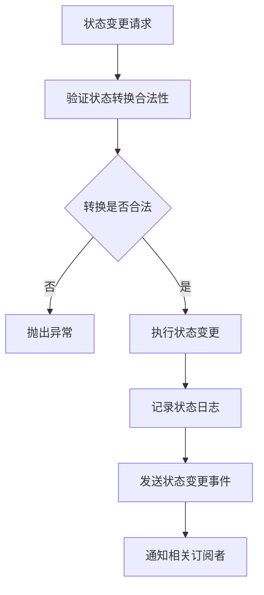

---

## 相关文档

- [用户旅程图](./用户旅程图.md)
- [业务流程图](./业务流程图.md)
- [时序图](./时序图.md)
- [架构设计图](./架构设计图.md)

---

**变更历史**：
| 版本 | 日期 | 变更内容 |
|------|------|----------|
| v1.2 | 2025-12-08 | 移除训练营状态机图中的 CANCELLED 状态，与 SSOT 保持一致；更新绑定状态机说明，明确采用人工审核流程 |
| v1.1 | 2025-12-06 | 添加 SSOT 引用，修复状态枚举值与 SSOT 一致（bind_status 小写、pay_status 4种状态、refund_status 6种状态、sync_status 5种状态），移除 CANCELLED 等非 SSOT 状态 |
| v1.0 | 2025-11-xx | 初始版本 |
