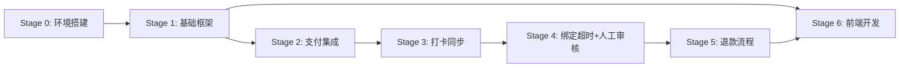

# AI 辅助敏捷开发计划

> **文档版本**: v1.2
> **最后更新**: 2025-12-08
> **SSOT引用**: [状态枚举定义.md](../design/状态枚举定义.md) - 所有状态枚举值定义
> **⚠️ 重要更新**: Stage 4 中的"智能匹配"方案已废弃，统一改为"人工审核"流程。详见 [EP04-身份匹配.md](../user-stories/EP04-身份匹配.md)

> **适用场景**：全程使用 AI 进行编码，人工只负责关键设计和功能测试
> **开发模式**：Vibe Coding（AI 驱动开发）
> **总时长**：27 天（Stage 0-6 + 集成测试）
> **原则**：每个迭代都能独立运行和测试

---

## 📋 开发原则

### 1. 最小可测试单元
- 每个 Stage 完成后都能独立运行
- 每个任务都有明确的验收标准
- 每个功能都有单元测试

### 2. 垂直切片
- 每个迭代都包含前后端完整功能
- 优先完成端到端的功能流程
- 避免"前端等后端"的情况

### 3. 依赖最小化
- 优先开发低依赖模块
- 外部依赖使用 Mock
- 避免阻塞性任务

### 4. 测试驱动
- 核心业务逻辑必须有单元测试
- 接口必须有集成测试
- 测试覆盖率：核心业务 ≥ 80%

---

## 🚀 迭代计划总览

> **对齐文档**：本计划采用垂直切片原则，优先完成端到端核心业务流程
> **优化依据**：参考《[优化完成总结](../archive/优化完成总结.md) - P1-1》，调整为支付闭环优先

| Stage | 时长 | 目标 | 交付物 | 优化说明 |
|-------|------|------|--------|---------|
| Stage 0 | 2天 | **最小环境骨架** | 后端骨架 + 核心4表 + H5骨架 | ⚠️ 不含完整16表，不含管理后台 |
| Stage 1 | 5天 | **⭐ 支付闭环（垂直切片）** | OAuth + 支付订单 + 绑定星球账号 + H5支付页面 | 🔄 **已优化**：优先完成核心支付路径 |
| Stage 2 | 5天 | **支付集成（混合方案）** | 微信支付接口 + 订单管理 | 🔄 **已调整**：管理功能与支付并行 |
| Stage 3 | 4天 | **打卡同步** | 知识星球打卡数据同步 + 定时任务 | ✅ 基于真实支付数据测试 |
| Stage 4 | 3天 | **绑定超时与人工审核** | 超时检测定时任务 + 人工审核接口 + 审核页面 | ✅ **已废弃智能匹配**，统一为人工审核 |
| Stage 5 | 4天 | **退款流程** | 审核 + 执行 + 通知 | ✅ Stage 4 |
| Stage 6 | 4天 | **前端完善 + 系统管理** | H5完整页面 + 管理后台完善 + 统计报表 | ✅ Stage 5 |

**优化要点**：
- ✅ Stage 1 优先实现支付闭环，最早暴露核心业务风险
- ✅ 管理后台与打卡同步可并行开发，不阻塞关键路径
- ✅ 每个Stage都能独立运行和验证核心功能

---

## Stage 0：环境搭建和项目骨架（2天）

### 🎯 目标
搭建可运行的最小后端骨架 + 核心数据表，验证技术栈可行性

**最小可测试单元原则**：
- ✅ 后端项目能启动，API 文档可访问
- ✅ 数据库连接成功，核心4表（camps、orders、camp_members、refunds）创建成功
- ✅ H5 前端骨架能启动（仅验证技术栈）
- ❌ 不包含完整的 16 张表（按需在后续 Stage 创建）
- ❌ 不包含完整的页面和路由（在功能开发时创建）
- ❌ 不包含管理后台（移至 Stage 1）

### 📦 任务拆分

#### 任务 0.1：后端项目骨架搭建
- **优先级**：P0（必须完成）
- **预计时间**：4 小时
- **交付物**：可运行的 Spring Boot 项目 + Knife4j 文档
- **验收标准**：
  - ✅ `./gradlew bootRun` 启动成功
  - ✅ 访问 http://localhost:8080/doc.html 显示 API 文档
  - ✅ 健康检查接口 `/api/health` 返回 200

#### 🤖 AI 提示词（任务 0.1）

```markdown
我需要创建一个 Spring Boot 3.2+ 的后端项目骨架，请帮我完成以下任务：

【项目要求】
- 项目名称：camp-backend
- 基础包名：com.camp
- 端口：8080
- Java 版本：17
- 构建工具：Gradle

【依赖清单】（参考技术方案 4.2 技术选型）
1. Spring Boot Starter Web
2. Spring Boot Starter Security（暂时禁用，后续配置）
3. Spring Boot Starter Validation
4. MyBatis Plus 3.5.5+
5. PostgreSQL 驱动
6. Redis Spring Boot Starter
7. Lombok
8. Knife4j 4.x（API 文档）
9. OkHttp3（HTTP 客户端）
10. Hutool（工具类）

【目录结构】（参考技术方案 5.5.1 项目结构）
backend/
├── src/main/java/com/camp/
│   ├── CampApplication.java          # 启动类
│   ├── config/
│   │   ├── MybatisPlusConfig.java    # MyBatis Plus 配置
│   │   ├── RedisConfig.java          # Redis 配置
│   │   ├── Knife4jConfig.java        # API 文档配置
│   │   └── CorsConfig.java           # CORS 跨域配置
│   ├── common/
│   │   ├── Result.java               # 统一响应格式
│   │   ├── ResultCode.java           # 错误码枚举
│   │   ├── BusinessException.java    # 业务异常
│   │   └── GlobalExceptionHandler.java  # 全局异常处理
│   ├── controller/
│   │   ├── admin/                    # 管理端接口
│   │   ├── h5/                       # H5端接口
│   │   └── webhook/                  # Webhook接口
│   ├── service/
│   ├── mapper/
│   ├── entity/
│   ├── dto/
│   ├── enums/
│   │   ├── CampStatus.java
│   │   ├── PaymentStatus.java
│   │   ├── BindStatus.java           # 绑定状态枚举
│   │   ├── PaymentBindMethod.java    # 绑定方式枚举
│   │   ├── MatchStatus.java
│   │   └── RefundStatus.java
│   ├── manager/                      # 第三方API封装
│   │   ├── WechatPayManager.java
│   │   ├── PlanetApiManager.java
│   │   └── WechatNotifyManager.java
│   ├── schedule/                     # 定时任务
│   └── util/

【配置要求】
1. application.yml：
   - 数据源：PostgreSQL (localhost:5432/camp_db)
   - Redis：localhost:6379
   - 日志级别：INFO

2. 统一响应格式（参考接口文档 1.2）：
   ```json
   {
     "code": 200,
     "message": "成功",
     "data": {},
     "timestamp": 1234567890
   }
```

3. 全局异常处理（参考接口文档错误码）：
   - ValidationException → 400
   - BusinessException → 自定义错误码（1001-1499）
   - Exception → 500

【验收标准】
1. 运行 `./gradlew bootRun` 成功启动
2. 访问 http://localhost:8080/doc.html 显示 Knife4j 文档
3. 访问 http://localhost:8080/api/health 返回成功

请生成完整的代码，包括 build.gradle 和所有配置文件。
```

---

#### 任务 0.2：核心数据表创建（最小集合）
- **优先级**：P0
- **预计时间**：2 小时
- **交付物**：核心 4 张表的数据库脚本
- **验收标准**：
  - ✅ 执行 SQL 脚本成功创建 4 张核心表
  - ✅ 索引创建成功
  - ✅ 数据库连接测试通过

**核心表清单**（其他表在后续 Stage 按需创建）：
1. `training_camp` - 训练营基本信息
2. `planet_user` - 知识星球用户信息
3. `system_user` - 系统用户（管理员）
4. `system_config` - 系统配置

#### 🤖 AI 提示词（任务 0.2）

```markdown
我需要生成 PostgreSQL 数据库初始化脚本，创建 **最小核心表集合**（4张表）：

【表清单】
1. **training_camp** - 训练营基本信息
   - 关键字段：id, name, description, deposit_amount, start_date, end_date, status, created_at, updated_at
   - 索引：status, start_date

2. **planet_user** - 知识星球用户信息（参考数据库设计.md）
   - 关键字段：id, planet_user_id, planet_nickname, user_number, avatar_url, joined_at, role, member_status, raw_data (JSONB), synced_at, created_at, updated_at
   - 索引：planet_user_id, user_number, planet_nickname

3. **system_user** - 系统用户
   - 关键字段：id, username, password, real_name, role, status, created_at, updated_at
   - 索引：username

4. **system_config** - 系统配置
   - 关键字段：id, config_key, config_value, description, created_at, updated_at
   - 索引：config_key

【脚本要求】
1. 文件：sql/init-database-stage0.sql
2. 包含创建表、索引、注释
3. 插入初始数据：
   - 默认管理员账号（admin/admin123，密码需 BCrypt 加密）
   - 知识星球 Cookie 配置项

【其他表创建计划】（不在 Stage 0 创建）：
- Stage 1: payment_record, payment_bind_status_log, camp_status_log, operation_log
- Stage 2: checkin_record, camp_member
- Stage 3: refund_record, refund_status_log
- Stage 4-6: notification_message, camp_member_relation, order_status_log, member_status_log

请生成完整的 SQL 脚本，严格按照数据库设计文档的字段定义。
```

---

#### 任务 0.3：H5 前端骨架搭建（最小验证）
- **优先级**：P0
- **预计时间**：2 小时
- **交付物**：可运行的 Vue 3 + Vant 最小骨架
- **验收标准**：
  - ✅ `npm run dev` 启动成功
  - ✅ 访问首页显示 "Hello Camp" 文字
  - ✅ Axios 基础封装完成（包含 baseURL 配置）

**最小骨架原则**：
- ✅ 项目能启动，验证 Vue 3 + Vite + Vant 技术栈
- ✅ Axios 封装（不包含 accessToken，后续添加）
- ❌ 不包含具体页面和路由（在 Stage 1-6 按需创建）
- ❌ 不包含状态管理（Pinia 在需要时引入）

#### 🤖 AI 提示词（任务 0.3）

```markdown
我需要创建一个 Vue 3 + Vant 的 H5 会员端**最小骨架**，仅验证技术栈可行性：

【项目要求】
- 项目名称：h5-member
- 目录位置：frontend/h5-member/
- 技术栈：Vue 3.3+ + Vite 5.x + Vant 4.x
- **不需要**：完整页面、路由配置、状态管理（后续添加）

【目录结构】（最小化）
frontend/h5-member/
├── src/
│   ├── main.js
│   ├── App.vue              # 只显示 "Hello Camp" 文字
│   └── utils/
│       └── request.js       # Axios 基础封装（不含 accessToken）

【Axios 基础封装】（最小版本）
```javascript
// utils/request.js
import axios from 'axios'

const request = axios.create({
  baseURL: import.meta.env.VITE_API_BASE_URL || 'http://localhost:8080/api',
  timeout: 10000
})

// 响应拦截器：统一处理响应
request.interceptors.response.use(
  response => response.data,
  error => {
    console.error('请求失败:', error)
    return Promise.reject(error)
  }
)

export default request
```

【配置文件】
- package.json：Vue 3 + Vite + Vant 4
- vite.config.js：基础配置
- .env.development：VITE_API_BASE_URL=http://localhost:8080/api

【验收标准】
1. npm run dev 启动成功，访问 http://localhost:5173
2. 页面显示 "Hello Camp" 文字
3. 控制台无报错

请生成完整的最小骨架代码。具体页面和路由将在后续 Stage 开发。
```

---

**任务 0.4 已移除**：Web 管理后台骨架移至 Stage 1（与管理员功能一起开发）

---

## Stage 1：支付闭环（垂直切片）（5天）

> **⭐ 重要变更**：Stage 1 已优化为支付闭环优先，详见 [Stage1-支付闭环实施指南.md](./Stage1-支付闭环实施指南.md)

### 🎯 目标
完成"用户报名→OAuth授权→支付→绑定星球账号"端到端流程，最早暴露核心业务风险

**核心价值**：
- ✅ 支付是核心业务，优先验证微信支付对接、幂等性、安全机制
- ✅ 前后端可基于明确接口并行开发
- ✅ 最早可测试完整业务流程
- ✅ 管理后台不阻塞关键路径，移至Stage 2

### 📦 任务清单（详见实施指南）

**后端任务**（共16小时）：
- 任务 1.1：OAuth授权流程（4小时）
- 任务 1.2：创建支付订单（3小时）
- 任务 1.3：微信支付回调处理（4小时）
- 任务 1.4：绑定星球账号（3小时）
- 任务 1.5：查询订单状态（2小时）

**前端任务**（共6小时）：
- 任务 1.6：H5支付页面（训练营详情、支付、绑定）

**完整实施细节、AI提示词、验收标准**，请查看：
👉 [Stage1-支付闭环实施指南.md](./Stage1-支付闭环实施指南.md)

---

### 简化版任务说明（原详细版已移至实施指南）

#### 任务 1.1：OAuth授权流程
- **优先级**：P0
- **预计时间**：4 小时
- **交付物**：JWT 工具类 + Spring Security 配置
- **验收标准**：
  - ✅ 登录接口返回有效 Token
  - ✅ 访问 /api/admin/** 需要 Token
  - ✅ H5 公开接口无需 Token

#### 🤖 AI 提示词（任务 1.1）

```markdown
我需要在 Spring Boot 项目中实现 JWT 认证，请帮我完成以下任务：

【安全配置】（参考接口文档 1.3 认证方式）

1. 白名单（无需认证）：
   - /api/h5/camps, /api/h5/camps/{id}  # 训练营列表/详情
   - /api/h5/payments                   # 创建支付订单
   - /api/h5/payments/{orderNo}/params  # 获取支付参数
   - /api/h5/payments/{orderNo}/status  # 查询支付状态
   - /api/auth/login                    # 登录
   - /doc.html, /webjars/**             # API 文档

2. 需要 JWT 认证（/api/admin/**）：
   - 训练营管理、会员管理、退款管理、统计报表

3. 需要 accessToken 验证（H5 敏感接口）：
   - /api/h5/payments/bind              # 用户绑定
   - /api/h5/payments/{orderNo}/qrcode  # 获取群二维码
   - /api/h5/progress/{memberId}        # 打卡进度

【需要创建的类】
1. JwtUtil.java - Token 生成/解析/验证
2. SecurityConfig.java - Spring Security 配置
3. JwtAuthenticationFilter.java - JWT 过滤器
4. AccessTokenFilter.java - H5 accessToken 过滤器（新增）

【accessToken 机制】（参考接口文档 1.3）
- 格式：UUID v4，前缀 `tk_`
- 有效期：训练营结束后 7 天
- 存储：Redis（access_token:{token} → {orderNo, status, campEndDate}）
- 状态：active → bound → expired

请生成完整的代码。
```

---

#### 任务 1.2：登录注册接口
- **优先级**：P0
- **预计时间**：3 小时
- **交付物**：登录、注册接口 + 单元测试
- **验收标准**：
  - ✅ POST /api/auth/login 返回 Token
  - ✅ 密码使用 BCrypt 加密

---

#### 任务 1.3：训练营 CRUD 接口
- **优先级**：P0
- **预计时间**：4 小时
- **交付物**：训练营 CRUD 接口 + 单元测试
- **验收标准**：
  - ✅ 所有接口通过 Postman 测试
  - ✅ 分页查询正常

#### 🤖 AI 提示词（任务 1.3）

```markdown
我需要实现训练营管理的 CRUD 接口，请严格按照《接口文档.md》第四章实现：

【接口清单】（参考接口文档 4.1-4.6）
1. POST /api/admin/camps - 创建训练营
2. GET /api/admin/camps - 训练营列表（分页）
3. GET /api/admin/camps/{id} - 训练营详情
4. PUT /api/admin/camps/{id} - 更新训练营
5. DELETE /api/admin/camps/{id} - 删除训练营（软删除）
6. POST /api/admin/camps/{id}/publish - 发布训练营

【H5 接口】（参考接口文档 3.1-3.2）
7. GET /api/h5/camps - 训练营列表（无需认证）
8. GET /api/h5/camps/{id}?planetUserId=xxx - 训练营详情（含预填信息）

【数据库表】（参考数据库设计 training_camp）
- id, name, poster_url, description, deposit, start_date, end_date
- total_days, required_days, group_qrcode_url, planet_project_id
- status（状态机：draft → pending → enrolling → ongoing → ended → settling → archived）
- enroll_url, member_count, paid_amount, refunded_amount

【状态机实现】（参考技术方案 5.4.1）
每次状态变更需记录到 camp_status_log 表：
- 记录 from_status, to_status, event, operator_id

【验收标准】
1. 创建训练营时自动计算 total_days
2. 发布时生成 enroll_url
3. 状态变更记录到日志表

【接口契约要求】（参考接口文档 1.2 统一响应格式）
1. **统一响应格式**：
   ```json
   {
     "code": 200,
     "message": "成功",
     "data": {...},
     "timestamp": 1234567890
   }
   ```

2. **错误码规范**（参考接口文档 1.4）：
   - 参数校验失败：400 + 具体字段错误信息
   - 业务逻辑错误：自定义错误码（1001-1499）
   - 系统内部错误：500

3. **分页响应格式**：
   ```json
   {
     "code": 200,
     "data": {
       "items": [...],
       "total": 100,
       "page": 1,
       "pageSize": 20
     }
   }
   ```

【测试要求】
1. **单元测试**（使用 JUnit 5 + Mockito）：
   - Service 层核心业务逻辑必须有单元测试
   - 测试覆盖率：分支覆盖 ≥ 80%
   - 测试用例包含：正常流程、边界条件、异常情况

2. **集成测试**（使用 Spring Boot Test）：
   - Controller 层接口测试
   - 验证请求参数校验
   - 验证响应格式符合契约
   - 验证数据库操作正确性

3. **测试命令**：
   ```bash
   ./gradlew test                # 运行单元测试
   ./gradlew integrationTest     # 运行集成测试
   ./gradlew check               # 完整检查
   ```

请生成完整的代码和单元测试。
```

---

#### 任务 1.4：训练营状态自动更新定时任务
- **优先级**：P1
- **预计时间**：2 小时
- **交付物**：定时任务（每日 00:05 执行）
- **验收标准**：
  - ✅ 自动将 enrolling → ongoing（到达开始日期）
  - ✅ 自动将 ongoing → ended（到达结束日期）

---

#### 任务 1.5：微信公众号 OAuth 集成
- **优先级**：P0
- **预计时间**：5 小时
- **交付物**：AuthController + FastAuthService + WechatOAuthManager + auth_session CRUD
- **验收标准**：
  - ✅ 用户点击授权链接能正确跳转到微信授权页
  - ✅ 授权成功后能获取用户 openid
  - ✅ 会话管理和身份绑定功能正常
  - ✅ 所有接口通过 Postman 测试

#### 🤖 AI 提示词（任务 1.5）

```markdown
我需要实现微信公众号 OAuth 2.0 授权集成，请严格按照《接口文档.md》第二章和《OAuth安全指南.md》实现：

【接口清单】（参考接口文档 2.1-2.3）
1. GET /api/auth/authorize?planetUserId={planetUserId}&redirectUrl={url}
   - 发起微信 OAuth 授权流程
   - 生成 state 参数并存入 Redis（5分钟有效期）
   - 重定向到微信授权页

2. GET /api/auth/callback/wechat-mp?code={code}&state={state}
   - 处理微信授权回调
   - 用 code 换取 access_token 和 openid
   - 创建 auth_session 记录
   - 重定向回前端页面

3. POST /api/auth/bindPlanet
   - 绑定知识星球身份
   - 验证 sessionKey 和 planetUserId
   - 更新 auth_session.planet_user_id
   - 创建/更新 camp_member 记录

【核心组件】

1. WechatOAuthManager.java（com.camp.manager）
   - 方法：getAuthUrl(state, redirectUrl) → 生成微信授权链接
   - 方法：getAccessToken(code) → 用 code 换取 openid
   - 配置读取：从 system_config 表读取 wechat.mp.appid 和 wechat.mp.secret

2. AuthService.java（com.camp.service）
   - 方法：initiateAuth(planetUserId, redirectUrl) → 创建授权会话
   - 方法：handleCallback(code, state) → 处理回调
   - 方法：bindPlanet(sessionKey, planetUserId) → 绑定星球身份

3. AuthController.java（com.camp.controller）
   - GET /api/auth/authorize
   - GET /api/auth/callback/wechat-mp
   - POST /api/auth/bindPlanet

【数据库表】（参考数据库设计 auth_session）
```sql
CREATE TABLE auth_session (
    id BIGSERIAL PRIMARY KEY,
    session_key VARCHAR(100) UNIQUE NOT NULL,  -- UUID v4
    wechat_openid VARCHAR(100),                -- 微信 openid
    planet_user_id VARCHAR(50),                -- 知识星球用户ID
    status VARCHAR(20) NOT NULL,               -- pending, completed, expired
    state VARCHAR(100),                        -- OAuth state 参数
    redirect_url TEXT,                         -- 前端回调地址
    expires_at TIMESTAMP NOT NULL,             -- 会话过期时间
    created_at TIMESTAMP DEFAULT CURRENT_TIMESTAMP,
    updated_at TIMESTAMP DEFAULT CURRENT_TIMESTAMP
);

CREATE INDEX idx_auth_session_openid ON auth_session(wechat_openid);
CREATE INDEX idx_auth_session_planet_user ON auth_session(planet_user_id);
CREATE INDEX idx_auth_session_state ON auth_session(state);
```

【OAuth 授权流程】（参考 OAuth安全指南.md）

1. 用户点击授权链接 → GET /api/auth/authorize?planetUserId=xxx&redirectUrl=xxx
2. 后端生成 state 参数：UUID.randomUUID().toString()
3. 将 state 存入 Redis：key=oauth:state:{state}, value={planetUserId, redirectUrl}, ttl=5分钟
4. 创建 auth_session 记录：session_key=UUID, status=pending, state=xxx
5. 构造微信授权链接并重定向：
   ```
   https://open.weixin.qq.com/connect/oauth2/authorize?
   appid={WECHAT_MP_APPID}&
   redirect_uri={WECHAT_MP_OAUTH_CALLBACK_URL}&
   response_type=code&
   scope=snsapi_userinfo&
   state={state}#wechat_redirect
   ```

6. 用户在微信授权页同意授权
7. 微信重定向回 GET /api/auth/callback/wechat-mp?code=xxx&state=xxx
8. 后端验证 state（从 Redis 读取）
9. 用 code 换取 access_token 和 openid（调用微信 API）
10. 更新 auth_session：wechat_openid=xxx, status=completed
11. 重定向到前端 redirectUrl，携带 sessionKey

【配置读取】
从 system_config 表读取：
- wechat.mp.appid
- wechat.mp.secret
- wechat.mp.oauth_callback_url

【验收标准】
1. 授权链接能正确跳转到微信授权页
2. 授权成功后能获取 openid 并创建 auth_session
3. 绑定接口能正确关联知识星球用户
4. 会话过期后无法使用
5. 所有异常情况有明确错误提示

请生成完整的代码和单元测试。
```

---

## Stage 2：支付集成（混合方案）（5天）

### 🎯 目标
完成微信支付集成，实现OAuth绑定 + 支付后绑定混合方案（对应技术方案 Stage 2）

### 📦 任务拆分

#### 任务 2.1：微信支付 SDK 封装
- **优先级**：P0
- **预计时间**：4 小时
- **交付物**：WechatPayManager 类
- **验收标准**：
  - ✅ 能成功创建支付订单（含 attach 参数）
  - ✅ 签名正确

#### 🤖 AI 提示词（任务 2.1）

```markdown
我需要封装微信支付 API，请帮我完成以下任务：

【WechatPayManager.java】（com.camp.manager）

1. createOrder(orderNo, amount, description, attach) → 返回支付参数
   - attach 参数格式：{"campId":1,"planetUserId":"123456789","orderNo":"ord_xxx"}
   - 用于OAuth绑定支付时传递用户信息

2. queryOrder(orderNo) → 查询支付状态

3. refund(orderNo, refundAmount) → 发起退款

【attach 字段说明】（参考技术方案 5.3.1）
- OAuth绑定支付：attach 包含 planet_user_id
- 固定二维码支付：attach 为空

【配置读取】
从 system_config 表读取：wechat.pay.mch_id, wechat.pay.api_key 等

请生成完整的代码。
```

---

#### 任务 2.2：创建支付订单接口
- **优先级**：P0
- **预计时间**：3 小时
- **交付物**：POST /api/h5/payments 接口
- **验收标准**：
  - ✅ 生成 UUID 格式订单号（ord_xxx）
  - ✅ 支持传入 planetUserId（OAuth绑定场景）

#### 🤖 AI 提示词（任务 2.2）

```markdown
我需要实现创建支付订单接口，请严格按照《接口文档.md》3.3 实现：

【接口】POST /api/h5/payments

【请求体】
{
  "campId": 1,
  "planetUserId": "123456789",     // OAuth绑定场景必传
  "planetNickname": "小明同学",     // OAuth绑定场景必传
  "wechatNickname": "小明"          // 可选
}

【业务逻辑】（参考技术方案 5.2.2）
1. 生成唯一订单号：ord_ + UUID（防止枚举攻击）
2. 判断支付入口：
   - 有 planetUserId → OAuth绑定流程，attach 携带用户信息
   - 无 planetUserId → 固定二维码流程，attach 为空

3. 创建 payment_record：
   - bind_status = pending（无 attach）或 completed（有 attach）
   - bind_method = h5_bindplanet（有 attach）或 null
   - bind_deadline = now + 7 days（无 attach 时设置）

4. 调用 WechatPayManager.createOrder()

【响应】
{
  "orderId": 10001,
  "orderNo": "ord_a1b2c3d4-5678-90ab-cdef",
  "amount": 99.00,
  "status": "pending",
  "expireTime": "2025-12-01T12:30:00",
  "payUrl": "/api/h5/payments/{orderNo}/params"
}

请生成完整的代码和单元测试。
```

---

#### 任务 2.3：支付回调处理（Webhook）
- **优先级**：P0
- **预计时间**：4 小时
- **交付物**：POST /api/webhook/wechat/payment
- **验收标准**：
  - ✅ 验证签名
  - ✅ 幂等处理
  - ✅ 区分有/无 attach 两种场景

#### 🤖 AI 提示词（任务 2.3）

```markdown
我需要实现支付回调处理，请严格按照技术方案时序图 5.3.2 和 5.3.3 实现：

【接口】POST /api/webhook/wechat/payment

【业务逻辑】（参考技术方案 5.3.2 支付回调处理）

1. 验证签名（防止伪造）

2. 幂等性处理（Redis 分布式锁）：
   ```java
   String lockKey = "payment:callback:" + out_trade_no;
   if (!redisTemplate.opsForValue().setIfAbsent(lockKey, "1", 5, TimeUnit.MINUTES)) {
       log.warn("重复回调: {}", out_trade_no);
       return SUCCESS;
   }
```

3. 解析 attach 字段：
   - 有 attach（OAuth绑定）：
     - 提取 camp_id, planet_user_id, order_no
     - 更新 payment_record：bind_status=completed, bind_method=h5_bindplanet
     - 创建/更新 camp_member 记录
     - 生成 accessToken 并存入 Redis

   - 无 attach（固定二维码）：
     - 更新 payment_record：bind_status=pending, bind_deadline=7天后
     - 生成 accessToken 并存入 Redis

4. 记录状态日志到 payment_bind_status_log 和 order_status_log

【accessToken 生成】（参考接口文档 1.3）
```java
String accessToken = "tk_" + UUID.randomUUID().toString();
// 存入 Redis，有效期 = 训练营结束日期 + 7天
redisTemplate.opsForValue().set(
    "access_token:" + accessToken,
    JSON.toJSONString(new AccessTokenInfo(orderNo, "active", campEndDate)),
    Duration.between(LocalDateTime.now(), campEndDate.plusDays(7))
);
```

请生成完整的代码和单元测试。
```

---

#### 任务 2.4：查询支付状态接口
- **优先级**：P0
- **预计时间**：2 小时
- **交付物**：GET /api/h5/payments/{orderNo}/status
- **验收标准**：
  - ✅ 支付成功时返回 accessToken
  - ✅ 返回 bindStatus 和 bindMethod

---

#### 任务 2.5：用户绑定接口
- **优先级**：P0
- **预计时间**：3 小时
- **交付物**：POST /api/h5/payments/bind
- **验收标准**：
  - ✅ 需要 X-Access-Token 验证
  - ✅ 验证票据对应的 orderNo
  - ✅ 绑定成功后返回群二维码

#### 🤖 AI 提示词（任务 2.5）

```markdown
我需要实现用户绑定接口，请严格按照《接口文档.md》3.6 实现：

【接口】POST /api/h5/payments/bind
【Header】X-Access-Token: {accessToken}

【安全校验】（参考接口文档 1.3 安全措施）
1. 验证 accessToken 有效且未过期（状态为 active 或 bound）
2. 验证 accessToken 绑定的 orderNo 与请求一致
3. 验证订单 bind_status = pending
4. 验证未超过 bind_deadline

【业务逻辑】（参考技术方案 5.3.3）
1. 查询 payment_record
2. 更新：
   - bind_status = completed
   - bind_method = user_fill
   - planet_user_id_from_attach = 用户填写的值
3. 创建/关联 camp_member 记录
4. 更新 accessToken 状态为 bound
5. 记录状态日志

【幂等设计】
若订单已绑定，返回已绑定信息（不报错）

请生成完整的代码和单元测试。
```

---

#### 任务 2.6：获取群二维码接口
- **优先级**：P1
- **预计时间**：2 小时
- **交付物**：GET /api/h5/payments/{orderNo}/qrcode
- **验收标准**：
  - ✅ 需要 X-Access-Token 验证
  - ✅ bind_status = completed 才返回

---

#### 任务 2.7：绑定超时定时任务
- **优先级**：P1
- **预计时间**：2 小时
- **交付物**：BindExpireTask（每日 02:00 执行）
- **验收标准**：
  - ✅ 检查 bind_status=pending 且超时的记录
  - ✅ 更新为 expired，转入人工审核流程（manual_review）

---

## Stage 3：打卡同步（4天）

### 🎯 目标
实现知识星球打卡数据同步（对应技术方案 Stage 3）

### 📦 任务拆分

#### 任务 3.1：知识星球 API 封装
- **优先级**：P0
- **预计时间**：4 小时
- **交付物**：PlanetApiManager 类
- **验收标准**：
  - ✅ 能成功获取打卡数据
  - ✅ 支持自动翻页
  - ✅ Cookie 过期能正常告警

#### 🤖 AI 提示词（任务 3.1）

```markdown
我需要封装知识星球 API，请帮我完成以下任务：

【PlanetApiManager.java】（com.camp.manager）

1. getCheckinRanking(groupId, checkinId) → 返回打卡排行榜
   - 需自动翻页（每页 100 条，最多 200 人）
   - 返回字段：user_id, name, checkin_count

2. validateCookie() → 验证 Cookie 是否有效

【认证方式】
- Header: Cookie: {zsxq_access_token}
- 从 system_config 表读取配置

【错误处理】（参考技术方案 5.2.8）
- Cookie 过期（401/403）→ 发送企业微信通知给管理员
- 网络异常 → 重试 1 次

【数据解析】（参考技术方案 5.2.6）
API 返回打卡天数，需应用宽限规则：
实际打卡天数 = API返回天数 + GRACE_DAYS（默认1天）

请生成完整的代码。
```

---

#### 任务 3.2：打卡数据同步定时任务
- **优先级**：P0
- **预计时间**：4 小时
- **交付物**：CheckinSyncTask（每日 01:00 执行）
- **验收标准**：
  - ✅ 同步所有进行中训练营的打卡数据
  - ✅ 更新 camp_member.checkin_count
  - ✅ 计算 eligible_for_refund

---

#### 任务 3.3：手动同步接口
- **优先级**：P1
- **预计时间**：2 小时
- **交付物**：POST /api/admin/checkins/sync/{campId}
- **验收标准**：
  - ✅ 使用 Redis 分布式锁防止并发
  - ✅ 返回同步结果（更新人数、新增打卡数）

---

#### 任务 3.4：打卡统计接口
- **优先级**：P1
- **预计时间**：2 小时
- **交付物**：GET /api/admin/checkins/stats/{campId}
- **验收标准**：
  - ✅ 返回每日打卡人数趋势
  - ✅ 返回打卡天数分布

---

## Stage 4：星球信息校验与人工审核（3天）

### 🎯 目标
实现星球信息校验 + 人工审核流程（对应 EP04 Story 4.3 和 4.4）

> **⚠️ 重要说明**：
> - 已废弃"智能匹配"方案和"先付后绑"流程
> - 现在采用"先填后付"流程，用户必须在支付前填写星球信息
> - 人工审核仅用于处理：打卡同步时发现用户填写的星球ID无效的情况

### 📦 任务拆分

#### 任务 4.1：星球信息校验（集成到打卡同步）
- **优先级**：P0
- **预计时间**：3 小时
- **交付物**：在 CheckinSyncTask 中增加星球ID有效性校验逻辑
- **验收标准**：
  - ✅ 打卡同步时验证星球ID是否存在
  - ✅ 星球ID无效 → bind_status = manual_review
  - ✅ 记录状态日志和异常原因
  - ✅ 发送管理员通知

#### 🤖 AI 提示词（任务 4.1）

```markdown
我需要在打卡同步任务中增加星球信息校验逻辑，请参考以下设计实现：

【CheckinSyncTask.java - 增强版】（com.camp.task）

在同步打卡数据时，增加星球ID有效性校验：

```java
@Scheduled(cron = "0 0 1 * * ?") // 每日 01:00
public void syncCheckinData() {
    // 获取所有进行中训练营的会员
    List<CampMember> members = memberMapper.selectActiveMembersForSync();

    for (CampMember member : members) {
        try {
            // 1. 调用知识星球API查询用户打卡数据
            ZsxqUserCheckin checkinData = zsxqApiService.getUserCheckin(
                member.getPlanetUserId(),
                member.getCampId()
            );

            if (checkinData == null) {
                // 2. 星球ID无效，转入人工审核
                handleInvalidPlanetUser(member, "星球ID无效或用户不存在");
                continue;
            }

            // 3. 正常同步打卡数据
            member.setCheckinCount(checkinData.getCheckinDays());
            member.setLastSyncTime(LocalDateTime.now());
            memberMapper.updateById(member);

            log.info("同步打卡成功: memberId={}, checkinCount={}",
                member.getId(), checkinData.getCheckinDays());

        } catch (ZsxqApiException e) {
            log.error("同步打卡数据失败: memberId={}, error={}",
                member.getId(), e.getMessage());
        }
    }
}

/**
 * 处理无效的星球用户
 */
private void handleInvalidPlanetUser(CampMember member, String reason) {
    // 1. 查找对应的支付记录
    PaymentRecord payment = paymentMapper.selectByMemberId(member.getId());
    if (payment == null) {
        log.error("找不到会员对应的支付记录: memberId={}", member.getId());
        return;
    }

    // 2. 更新绑定状态为人工审核
    BindStatus oldStatus = payment.getBindStatus();
    payment.setBindStatus(BindStatus.MANUAL_REVIEW);
    payment.setRemark(reason);
    paymentMapper.updateById(payment);

    // 3. 记录状态日志
    bindStatusLogService.log(
        payment.getId(),
        oldStatus,
        BindStatus.MANUAL_REVIEW,
        null,  // 系统自动处理，无操作人
        reason
    );

    // 4. 发送管理员通知
    notificationService.notifyAdmins(
        "星球信息异常",
        String.format("会员 %s (订单号: %s) 的星球ID无效，需人工审核",
            member.getPlanetNickname(), payment.getOrderNo())
    );

    log.warn("星球信息校验失败，转入人工审核: memberId={}, reason={}",
        member.getId(), reason);
}
```

【单元测试】
- 模拟星球API返回null，验证转入人工审核
- 模拟正常同步，验证打卡数据更新
- 验证状态日志记录
- 验证管理员通知发送

请生成完整的代码和单元测试。
```

---

#### 任务 4.2：人工审核接口实现
- **优先级**：P1
- **预计时间**：4 小时
- **交付物**：ManualReviewController + ManualReviewService
- **验收标准**：
  - ✅ GET /api/admin/bindings/pending-review（查询待审核列表）
  - ✅ POST /api/admin/bindings/{id}/match（手动匹配星球用户）
  - ✅ POST /api/admin/bindings/{id}/close（标记无法匹配）
  - ✅ POST /api/admin/bindings/batch-close（批量标记无法匹配）

> **触发场景**：打卡同步时发现用户填写的星球ID在知识星球中不存在，系统自动将其标记为 `manual_review`，由管理员人工处理。

#### 🤖 AI 提示词（任务 4.2）

```markdown
我需要实现人工审核接口，用于处理星球信息校验失败的订单：

【ManualReviewController.java】（com.camp.controller.admin）

1. GET /api/admin/bindings/pending-review → 查询待审核列表

   【请求参数】
   - campId（可选）：训练营ID
   - pageNum, pageSize：分页参数

   【响应示例】
   ```json
   {
     "code": 200,
     "data": {
       "items": [
         {
           "paymentId": 10001,
           "orderNo": "ord_123",
           "campName": "21天早起训练营",
           "wechatNickname": "小明",
           "payAmount": 99.00,
           "payTime": "2025-12-01T10:30:00",
           "bindDeadline": "2025-12-08T10:30:00",
           "expiredDays": 2
         }
       ],
       "total": 10,
       "page": 1,
       "pageSize": 20
     }
   }
   ```

2. POST /api/admin/bindings/{id}/match → 手动匹配星球用户

   【请求体】
   ```json
   {
     "planetUserId": "123456789",
     "reason": "人工核实身份"
   }
   ```

   【业务逻辑】
   ```java
   // 1. 验证 bind_status = 'manual_review'
   // 2. 验证星球用户存在且未被其他订单绑定
   // 3. 更新 bind_status = 'completed', bind_method = 'manual'
   // 4. 记录状态日志（操作人、原因）
   // 5. 返回成功
   ```

3. POST /api/admin/bindings/{id}/close → 标记无法匹配

   【请求体】
   ```json
   {
     "reason": "用户退出星球"
   }
   ```

   【业务逻辑】
   ```java
   // 1. 验证 bind_status = 'manual_review'
   // 2. 更新 bind_status = 'closed'
   // 3. 记录状态日志（操作人、原因）
   // 4. 返回成功
   ```

4. POST /api/admin/bindings/batch-close → 批量标记无法匹配

   【请求体】
   ```json
   {
     "paymentIds": [10001, 10002, 10003],
     "reason": "批量处理无法匹配订单"
   }
   ```

【权限要求】
- 所有接口需要管理员权限（@PreAuthorize("hasRole('ADMIN')")）

【单元测试】
- 验证状态转换
- 验证唯一性约束
- 验证权限控制

请生成完整的代码和单元测试。
```

---

#### 任务 4.3：管理后台审核页面
- **优先级**：P1
- **预计时间**：4 小时
- **交付物**：Vue 3 审核页面
- **验收标准**：
  - ✅ 展示待审核列表（表格）
  - ✅ 支持搜索星球用户
  - ✅ 支持单个匹配/关闭
  - ✅ 支持批量关闭

---

## Stage 5：退款��程（4天）

### 🎯 目标
完成退款列表生成、审核、执行、通知（对应技术方案 Stage 5）

### 📦 任务拆分

#### 任务 5.1：退款名单生成
- **优先级**：P0
- **预计时间**：3 小时
- **交付物**：RefundService.generateRefundList()
- **验收标准**：
  - ✅ 筛选 eligible_for_refund = true 的会员
  - ✅ 调用 MatchService 进行匹配
  - ✅ 创建 refund_record（状态=pending）

---

#### 任务 5.2：退款审核接口
- **优先级**：P0
- **预计时间**：3 小时
- **交付物**：审核通过/拒绝/批量审核接口
- **验收标准**：
  - ✅ 批量审核支持最低置信度阈值
  - ✅ 记录审核人和审核时间

---

#### 任务 5.3：退款执行（调用微信 API）
- **优先级**：P0
- **预计时间**：4 小时
- **交付物**：退款执行服务
- **验收标准**：
  - ✅ 调用 WechatPayManager.refund()
  - ✅ 失败自动重试（最多 3 次）
  - ✅ 超过重试次数标记为人工处理

#### 🤖 AI 提示词（任务 5.3）

```markdown
我需要实现退款执行功能，请严格按照技术方案 5.3.5 和 5.3.10 实现：

【RefundService.java】

1. executeRefund(refundId) → 执行单个退款

   【业务逻辑】（参考技术方案 5.2.8 退款异常处理）
   ```java
   public void executeRefund(Long refundId) {
       RefundRecord record = refundMapper.selectById(refundId);

       try {
           // 调用微信退款 API
           wechatPayManager.refund(record.getOrderNo(), record.getRefundAmount());

           // 更新状态
           record.setRefundStatus("success");
           record.setExecuteTime(LocalDateTime.now());
           refundMapper.updateById(record);

           // 发送通知
           sendRefundNotification(record, true);

       } catch (Exception e) {
           handleRefundFailure(record, e);
       }
   }

   private void handleRefundFailure(RefundRecord record, Exception e) {
       record.setRetryCount(record.getRetryCount() + 1);
       record.setLastRetryTime(LocalDateTime.now());
       record.setFailureReason(e.getMessage());

       if (record.getRetryCount() < 3) {
           // 延迟重试（指数退避）
           scheduleRetry(record, record.getRetryCount() * 5 * 60);
       } else {
           // 超过重试次数，标记为人工处理
           record.setRefundStatus("manual_required");
           sendAlertToAdmin(record);
       }

       refundMapper.updateById(record);
   }
```

2. retryFailedRefunds() → 定时重试失败的退款（每小时执行）

【状态日志】
每次状态变更记录到 refund_status_log

请生成完整的代码和单元测试。
```

---

#### 任务 5.4：通知服务实现
- **优先级**：P1
- **预计时间**：3 小时
- **交付物**：NotificationService
- **验收标准**：
  - ✅ 退款成功通知会员
  - ✅ 退款失败告警管理员
  - ✅ 消息记录到 notification_message 表

---

#### 任务 5.5：退款结果 Webhook
- **优先级**：P1
- **预计时间**：2 小时
- **交付物**：POST /api/webhook/wechat/refund
- **验收标准**：
  - ✅ 更新退款状态
  - ✅ 触发通知

---

## Stage 6：前端开发 + 系统管理（4天）

### 🎯 目标
完成 H5 会员端、Web 管理后台、统计报表（对应技术方案 Stage 6）

### 📦 任务拆分

#### 任务 6.1：H5 训练营列表和详情页
- **优先级**：P0
- **预计时间**：3 小时
- **交付物**：CampList.vue, CampDetail.vue
- **验收标准**：
  - ✅ 详情页支持预填星球信息
  - ✅ 点击支付跳转支付流程

---

#### 任务 6.2：H5 支付后绑定页面
- **优先级**：P0
- **预计时间**：3 小时
- **交付物**：PaymentBind.vue
- **验收标准**：
  - ✅ 显示订单信息
  - ✅ 表单校验星球ID和昵称
  - ✅ 绑定成功显示群二维码

---

#### 任务 6.3：H5 打卡进度页面
- **优先级**：P1
- **预计时间**：2 小时
- **交付物**：ProgressQuery.vue
- **验收标准**：
  - ✅ 显示打卡日历
  - ✅ 显示是否达标

---

#### 任务 6.4：管理后台训练营管理
- **优先级**：P0
- **预计时间**：4 小时
- **交付物**：CampManage.vue
- **验收标准**：
  - ✅ 表格 + 新增/编辑对话框
  - ✅ 状态筛选和分页

---

#### 任务 6.5：管理后台退款审核
- **优先级**：P0
- **预计时间**：4 小时
- **交付物**：RefundManage.vue
- **验收标准**：
  - ✅ 待审核列表
  - ✅ 批量审核功能
  - ✅ 显示匹配置信度

---

#### 任务 6.6：管理后台统计报表
- **优先级**：P1
- **预计时间**：3 小时
- **交付物**：Dashboard.vue（ECharts 图表）
- **验收标准**：
  - ✅ 系统概览统计
  - ✅ 训练营打卡趋势图

---

#### 任务 6.7：系统管理和安全
- **优先级**：P1
- **预计时间**：3 小时
- **交付物**：用户管理、配置管理、操作日志
- **验收标准**：
  - ✅ 用户 CRUD
  - ✅ 配置项可更新
  - ✅ 操作日志可查询

---

## 📝 使用建议

### 1. 如何使用这些提示词？

#### 方式一：直接复制到 Claude Code / Cursor
```
1. 打开 Claude Code 或 Cursor
2. 复制对应任务的 AI 提示词
3. 粘贴到对话框
4. AI 会生成完整的代码
5. 复制代码到项目中
6. 运行测试，验证功能
```

#### 方式二：使用 Claude Code 的 Slash Commands
```
1. 在项目根目录创建 .claude/commands/
2. 为每个任务创建一个 .md 文件（如 task-0.1.md）
3. 复制提示词到文件中
4. 使用 /task-0.1 触发任务
```

---

### 2. 开发流程建议

每个 Stage 的开发流程：

```
1. Stage 计划会议
   - 明确本 Stage 的目标
   - 确认任务优先级
   - 准备好所有 AI 提示词

2. 开发迭代
   - 按照任务顺序逐个开发
   - 每个任务完成后立即测试
   - 通过验收标准后再进入下一个任务

3. Stage 回顾
   - 检查所有任务是否完成
   - 运行集成测试
   - 记录遇到的问题和解决方案

4. Stage 演示
   - 演示本 Stage 的功能
   - 收集反馈
   - 规划下一个 Stage
```

---

### 3. 接口契约和测试要求（通用规范）

**所有 AI 提示词中的接口实现都必须遵循以下规范**：

#### 接口契约要求

1. **统一响应格式**（参考接口文档 1.2）：
   ```json
   {
     "code": 200,
     "message": "成功",
     "data": {...},
     "timestamp": 1234567890
   }
   ```

2. **错误码规范**（参考接口文档 1.4）：
   - **参数校验失败**：`400` + 具体字段错误信息
   - **业务逻辑错误**：自定义错误码 `1001-1499`
   - **系统内部错误**：`500`

3. **分页响应格式**：
   ```json
   {
     "code": 200,
     "data": {
       "items": [...],
       "total": 100,
       "page": 1,
       "pageSize": 20
     }
   }
   ```

4. **参数校验**：
   - 使用 Spring Validation 注解（`@NotNull`, `@NotBlank`, `@Valid` 等）
   - 在 Controller 层添加 `@Validated` 注解
   - 校验失败自动返回 400 错误

#### 测试要求

**后端测试**（Java + Spring Boot）：

1. **单元测试**（JUnit 5 + Mockito）：
   - Service 层核心业务逻辑必须有单元测试
   - 测试覆盖率要求：**分支覆盖 ≥ 80%**
   - 测试用例必须包含：
     - ✅ 正常流程（Happy Path）
     - ✅ 边界条件（空值、极值、临界值）
     - ✅ 异常情况（参数错误、业务异常）

2. **集成测试**（Spring Boot Test）：
   - Controller 层接口必须有集成测试
   - 验证内容：
     - ✅ 请求参数校验
     - ✅ 响应格式符合契约
     - ✅ 数据库操作正确性
     - ✅ 事务一致性

3. **测试命令**：
   ```bash
   cd backend
   ./gradlew test                # 运行单元测试
   ./gradlew integrationTest     # 运行集成测试
   ./gradlew check               # 完整检查（编译+测试+风格）
   ```

**前端测试**（Vue 3 + Vite）：

1. **单元测试**（Vitest + Testing Library）：
   - 工具函数必须有单元测试
   - 复杂组件逻辑建议编写测试

2. **测试命令**：
   ```bash
   cd frontend/h5-member (或 admin-web)
   npm run test:unit             # 运行单元测试
   npm run lint                  # 代码检查
   npm run type-check            # 类型检查
   ```

#### 在 AI 提示词中的应用

**示例**（已在任务 1.3 中添加）：
- 每个包含接口实现的 AI 提示词末尾都应添加"【接口契约要求】"和"【测试要求】"部分
- 确保 AI 生成的代码遵循统一规范
- 提高代码质量和可维护性

---

### 4. 质量保障

#### 代码审查清单

每个任务完成后，检查：
- [ ] 代码是否符合项目规范？
- [ ] 是否有单元测试？
- [ ] 测试覆盖率是否达标？
- [ ] 是否有 API 文档？
- [ ] 错误处理是否完善？
- [ ] 状态变更是否记录到日志表？

#### 测试策略

1. **单元测试**：核心业务逻辑必须有单元测试
2. **集成测试**：每个接口都要用 Postman 测试
3. **端到端测试**：每个 Stage 结束后运行完整流程测试

#### 验收命令（前后端分离）

**完整验收命令详见**：《技术方案.md》A.1 节"验收命令"

##### 后端验收（backend/）

```bash
cd backend

# 完整检查（编译+测试+风格）
./gradlew check

# 或分步执行
./gradlew compileJava      # 编译
./gradlew test             # 单元测试
./gradlew integrationTest  # 集成测试
./gradlew spotlessCheck    # 代码风格检查
```

##### 前端验收

**H5 会员端**（frontend/h5-member/）：

```bash
cd frontend/h5-member

# 完整检查
npm run lint && npm run type-check && npm run test:unit

# 或分步执行
npm run lint          # 代码检查
npm run type-check    # 类型检查
npm run test:unit     # 单元测试
npm run build         # 构建验证
```

**Web 管理后台**（frontend/admin-web/）：

```bash
cd frontend/admin-web

# 完整检查
npm run lint && npm run type-check && npm run test:unit

# 构建验证
npm run build
```

##### 完整项目验收（推荐）

```bash
# 项目根目录执行
./scripts/verify-all.sh

# 脚本内容（自动验收后端+H5+管理后台）
# 详见《技术方案.md》A.1 节
```

##### 各 Stage 验收要求

| Stage | 后端验收 | H5 验收 | 管理后台验收 |
|-------|---------|---------|-------------|
| Stage 0 | ✅ 必须 | ✅ 必须（仅骨架） | ❌ 不需要 |
| Stage 1 | ✅ 必须 | ✅ 必须（仅骨架） | ✅ 必须 |
| Stage 2 | ✅ 必须 | ✅ 必须（支付页面） | ✅ 必须 |
| Stage 3-5 | ✅ 必须 | ✅ 必须 | ✅ 必须 |
| Stage 6 | ✅ 必须 | ✅ 必须（完整） | ✅ 必须（完整） |

---

## 📊 进度跟踪

### 进度看板

| Stage | 状态 | 进度 | 备注 |
|-------|------|------|------|
| Stage 0 | 🟡 待开始 | 0% | 环境搭建 |
| Stage 1 | ⚪ 未开始 | 0% | 基础框架 |
| Stage 2 | ⚪ 未开始 | 0% | 支付集成 |
| Stage 3 | ⚪ 未开始 | 0% | 打卡同步 |
| Stage 4 | ⚪ 未开始 | 0% | 绑定超时+人工审核 |
| Stage 5 | ⚪ 未开始 | 0% | 退款流程 |
| Stage 6 | ⚪ 未开始 | 0% | 前端开发 |

### Stage 依赖关系



---

## 🎉 总结

这份 AI 辅助敏捷开发计划的核心特点：

1. **严格对齐技术文档**：6 个 Stage 完全对应技术方案的分阶段验证计划
2. **完整覆盖混合绑定方案**：OAuth绑定 + 固定二维码绑定 + 人工审核
3. **包含 H5 安全机制**：accessToken 票据验证
4. **状态日志完整**：5 张状态日志表全部实现
5. **通知系统完善**：notification_message 表 + 定时任务

**预期效果**：
- 开发效率提升 **80-90%**
- 代码质量显著改善
- 功能完整性 **100%** 对齐技术方案
