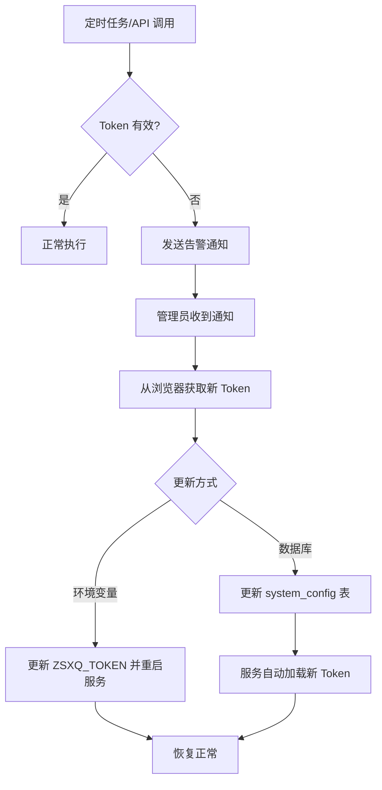

# zsxq-sdk 集成指南

| **版本** | v1.0 |
|---------|------|
| **作者** | AI 助手 |
| **日期** | 2025-12-12 |
| **状态** | 草稿 |

---

## 目录

1. [概述](#1-概述)
2. [依赖配置](#2-依赖配置)
3. [Spring Boot 集成](#3-spring-boot-集成)
4. [核心 API 使用](#4-核心-api-使用)
5. [异常处理](#5-异常处理)
6. [打卡同步实现](#6-打卡同步实现)
7. [Token 管理](#7-token-管理)
8. [测试策略](#8-测试策略)
9. [常见问题](#9-常见问题)

---

## 1. 概述

### 1.1 SDK 简介

zsxq-sdk 是知识星球 API 的 Java 封装库，提供类型安全的 API 调用，替代直接 HTTP 请求方式。

| 属性 | 值 |
|------|-----|
| **仓库地址** | https://github.com/yiancode/zsxq-sdk |
| **最低 Java 版本** | Java 11+（兼容 Java 17） |
| **核心依赖** | OkHttp 4.12 + Gson 2.10 |
| **API 覆盖率** | 76.5%（65/85 接口） |

### 1.2 主要功能模块

| 模块 | 类名 | 功能描述 |
|------|------|----------|
| 星球管理 | `GroupsRequest` | 获取星球列表、详情、成员、统计 |
| 话题管理 | `TopicsRequest` | 获取话题列表、评论、打赏 |
| 用户管理 | `UsersRequest` | 获取用户信息、足迹、贡献 |
| **打卡管理** | `CheckinsRequest` | **获取打卡项目、排行榜、统计** |
| 数据面板 | `DashboardRequest` | 星主数据概览、收入统计 |
| 排行榜 | `RankingRequest` | 星球排行、积分排行 |
| 杂项 | `MiscRequest` | URL 解析、全局配置 |

### 1.3 本项目使用场景

在 AutoDepositRefundAgent 项目中，zsxq-sdk 主要用于：

1. **打卡数据同步**：每日从知识星球同步会员打卡记录
2. **打卡统计获取**：获取排行榜数据计算会员完成度
3. **Token 有效性检测**：验证知识星球 Token 是否过期
4. **星球信息获取**：获取训练营关联的星球基础信息

---

## 2. 依赖配置

### 2.1 Maven 依赖

**方式一：Maven 中央仓库（发布后）**

```xml
<dependency>
    <groupId>io.github.yiancode</groupId>
    <artifactId>zsxq-sdk</artifactId>
    <version>1.0.0</version>
</dependency>
```

**方式二：本地安装（推荐开发阶段）**

```bash
# 1. 克隆 SDK 仓库
git clone https://github.com/yiancode/zsxq-sdk.git

# 2. 进入 Java 包目录
cd zsxq-sdk/packages/java

# 3. 安装到本地 Maven 仓库
mvn clean install -DskipTests

# 4. 在项目中添加依赖
```

```xml
<dependency>
    <groupId>com.zsxq</groupId>
    <artifactId>zsxq-sdk</artifactId>
    <version>1.0.0-SNAPSHOT</version>
</dependency>
```

### 2.2 Gradle 依赖

```groovy
// build.gradle
dependencies {
    implementation 'com.zsxq:zsxq-sdk:1.0.0-SNAPSHOT'
}
```

### 2.3 传递依赖

SDK 会自动引入以下依赖：

| 依赖 | 版本 | 用途 |
|------|------|------|
| OkHttp | 4.12.0 | HTTP 客户端 |
| Gson | 2.10.1 | JSON 解析 |
| SLF4J | 2.0.x | 日志门面 |

---

## 3. Spring Boot 集成

### 3.1 配置文件

**application.yml**：

```yaml
zsxq:
  # 知识星球 Token（从浏览器 DevTools 获取）
  token: ${ZSXQ_TOKEN:}

  # 星球 ID（训练营关联的知识星球）
  group-id: ${ZSXQ_GROUP_ID:}

  # 请求超时（毫秒）
  timeout: 10000

  # 重试次数
  retry-count: 3

  # 重试间隔（毫秒）
  retry-delay: 1000
```

### 3.2 配置属性类

```java
package com.example.camp.config;

import lombok.Data;
import org.springframework.boot.context.properties.ConfigurationProperties;
import org.springframework.stereotype.Component;

@Data
@Component
@ConfigurationProperties(prefix = "zsxq")
public class ZsxqProperties {

    /**
     * 知识星球认证 Token
     */
    private String token;

    /**
     * 默认星球 ID
     */
    private String groupId;

    /**
     * 请求超时时间（毫秒）
     */
    private int timeout = 10000;

    /**
     * 重试次数
     */
    private int retryCount = 3;

    /**
     * 重试间隔（毫秒）
     */
    private int retryDelay = 1000;
}
```

### 3.3 Bean 配置类

```java
package com.example.camp.config;

import com.zsxq.sdk.client.ZsxqClient;
import com.zsxq.sdk.client.ZsxqClientBuilder;
import lombok.RequiredArgsConstructor;
import lombok.extern.slf4j.Slf4j;
import org.springframework.context.annotation.Bean;
import org.springframework.context.annotation.Configuration;

@Slf4j
@Configuration
@RequiredArgsConstructor
public class ZsxqSdkConfig {

    private final ZsxqProperties properties;

    @Bean
    public ZsxqClient zsxqClient() {
        log.info("初始化知识星球 SDK，groupId={}", properties.getGroupId());

        return new ZsxqClientBuilder()
            .token(properties.getToken())
            .timeout(properties.getTimeout())
            .retryCount(properties.getRetryCount())
            .retryDelay(properties.getRetryDelay())
            .build();
    }
}
```

### 3.4 环境变量配置

```bash
# .env 或系统环境变量
ZSXQ_TOKEN=D047A423-A9E1-XXXX-XXXX-XXXXXXXXXXXX
ZSXQ_GROUP_ID=15555411412112
```

**Token 获取方式**：

1. 在浏览器中登录知识星球网页版
2. 打开开发者工具（F12）
3. 切换到 Network 标签
4. 刷新页面，找到任意 API 请求
5. 复制请求头中的 `authorization` 值

---

## 4. 核心 API 使用

### 4.1 客户端结构

```java
ZsxqClient client = ...;

// 星球相关
client.groups().list();
client.groups().get(groupId);

// 话题相关
client.topics().list(groupId);
client.topics().get(topicId);

// 用户相关
client.users().self();
client.users().get(userId);

// 打卡相关（核心）
client.checkins().list(groupId);
client.checkins().getRankingList(groupId, checkinId);
client.checkins().getStatistics(groupId, checkinId);

// 数据面板
client.dashboard().getOverview(groupId);

// 排行榜
client.ranking().getGroupRanking(groupId);
```

### 4.2 打卡 API（核心）

#### 获取打卡项目列表

```java
// 获取所有打卡项目
List<Checkin> allCheckins = zsxqClient.checkins().list(groupId);

// 按状态过滤
List<Checkin> ongoingCheckins = zsxqClient.checkins().list(groupId, "ongoing");
List<Checkin> closedCheckins = zsxqClient.checkins().list(groupId, "closed");
```

**Checkin 模型**：

| 字段 | 类型 | 说明 |
|------|------|------|
| `checkinId` | Long | 打卡项目 ID |
| `name` | String | 项目名称 |
| `description` | String | 项目描述 |
| `status` | String | 状态：ongoing/closed/over |
| `beginTime` | String | 开始时间 |
| `endTime` | String | 结束时间 |

#### 获取打卡排行榜

```java
// 获取累计打卡排行
List<RankingItem> ranking = zsxqClient.checkins()
    .getRankingList(groupId, checkinId, "accumulated");

// 获取连续打卡排行
List<RankingItem> continuousRanking = zsxqClient.checkins()
    .getRankingList(groupId, checkinId, "continuous");
```

**RankingItem 模型**：

| 字段 | 类型 | 说明 |
|------|------|------|
| `rank` | Integer | 排名 |
| `user` | User | 用户信息 |
| `count` | Integer | 打卡天数 |

#### 获取打卡统计

```java
CheckinStatistics stats = zsxqClient.checkins()
    .getStatistics(groupId, checkinId);

// 统计字段
int joinedCount = stats.getJoinedCount();     // 参与人数
int completedCount = stats.getCompletedCount(); // 完成人数
```

### 4.3 星球 API

```java
// 获取我加入的星球列表
List<Group> myGroups = zsxqClient.groups().list();

// 获取星球详情
Group group = zsxqClient.groups().get(groupId);

// 获取星球成员
User member = zsxqClient.groups().getMember(groupId, memberId);

// 获取星球统计
Map<String, Object> stats = zsxqClient.groups().getStatistics(groupId);
```

### 4.4 用户 API

```java
// 获取当前用户（验证 Token 有效性）
User self = zsxqClient.users().self();

// 获取用户详情
User user = zsxqClient.users().get(userId);

// 获取用户统计
Map<String, Object> userStats = zsxqClient.users().getStatistics(userId);
```

---

## 5. 异常处理

### 5.1 异常层次结构

```
ZsxqException (基类)
├── AuthException (认证异常)
│   ├── TokenInvalidException  - 错误码 10001
│   └── TokenExpiredException  - 错误码 10002
├── RateLimitException         - 错误码 40001
└── NetworkException           - 网络/超时错误
```

### 5.2 异常处理示例

```java
@Service
@RequiredArgsConstructor
@Slf4j
public class CheckinSyncService {

    private final ZsxqClient zsxqClient;
    private final NotificationService notificationService;

    public SyncResult syncCheckinData(Long groupId, Long checkinId) {
        try {
            List<RankingItem> ranking = zsxqClient.checkins()
                .getRankingList(groupId, checkinId, "accumulated");

            // 处理数据...
            return SyncResult.success(ranking.size());

        } catch (TokenExpiredException e) {
            // Token 过期，发送告警
            log.error("知识星球 Token 已过期，错误码: {}", e.getCode());
            notificationService.sendAlert(
                "知识星球 Token 已过期，请更新 ZSXQ_TOKEN 环境变量"
            );
            return SyncResult.failed("Token 已过期");

        } catch (TokenInvalidException e) {
            // Token 无效
            log.error("知识星球 Token 无效，错误码: {}", e.getCode());
            notificationService.sendAlert(
                "知识星球 Token 无效，请检查配置"
            );
            return SyncResult.failed("Token 无效");

        } catch (RateLimitException e) {
            // 请求限流，等待后重试
            log.warn("知识星球 API 限流，等待重试...");
            try {
                Thread.sleep(5000);
                return syncCheckinData(groupId, checkinId); // 递归重试
            } catch (InterruptedException ie) {
                Thread.currentThread().interrupt();
                return SyncResult.failed("重试被中断");
            }

        } catch (NetworkException e) {
            // 网络错误
            log.error("网络错误: {}", e.getMessage());
            return SyncResult.failed("网络错误: " + e.getMessage());

        } catch (ZsxqException e) {
            // 其他 SDK 异常
            log.error("知识星球 API 错误: code={}, msg={}",
                e.getCode(), e.getMessage());
            return SyncResult.failed("API 错误: " + e.getMessage());
        }
    }
}
```

### 5.3 全局异常处理

```java
@RestControllerAdvice
@Slf4j
public class ZsxqExceptionHandler {

    @ExceptionHandler(TokenExpiredException.class)
    public Result<Void> handleTokenExpired(TokenExpiredException e) {
        log.error("知识星球 Token 过期: {}", e.getMessage());
        return Result.fail(3101, "知识星球认证已过期，请联系管理员");
    }

    @ExceptionHandler(ZsxqException.class)
    public Result<Void> handleZsxqException(ZsxqException e) {
        log.error("知识星球 API 错误: code={}, msg={}",
            e.getCode(), e.getMessage());
        return Result.fail(3102, "知识星球服务暂时不可用");
    }
}
```

---

## 6. 打卡同步实现

### 6.1 同步服务

```java
@Service
@RequiredArgsConstructor
@Slf4j
public class CheckinSyncService {

    private final ZsxqClient zsxqClient;
    private final CampMemberMapper memberMapper;
    private final CheckinRecordMapper checkinRecordMapper;
    private final SyncLogMapper syncLogMapper;

    /**
     * 同步指定训练营的打卡数据
     */
    @Transactional
    public SyncResult syncCampCheckins(TrainingCamp camp) {
        SyncLog syncLog = new SyncLog();
        syncLog.setCampId(camp.getId());
        syncLog.setStartTime(LocalDateTime.now());

        try {
            // 1. 获取打卡排行榜
            List<RankingItem> ranking = zsxqClient.checkins()
                .getRankingList(
                    camp.getPlanetGroupId(),
                    camp.getCheckinProjectId(),
                    "accumulated"
                );

            log.info("获取到 {} 条打卡记录，训练营: {}",
                ranking.size(), camp.getName());

            // 2. 遍历更新会员打卡数据
            int updatedCount = 0;
            for (RankingItem item : ranking) {
                boolean updated = updateMemberCheckin(camp.getId(), item);
                if (updated) updatedCount++;
            }

            // 3. 记录同步成功
            syncLog.setStatus("SUCCESS");
            syncLog.setRecordCount(ranking.size());
            syncLog.setUpdatedCount(updatedCount);
            syncLog.setEndTime(LocalDateTime.now());
            syncLogMapper.insert(syncLog);

            return SyncResult.success(updatedCount);

        } catch (ZsxqException e) {
            // 记录同步失败
            syncLog.setStatus("FAILED");
            syncLog.setErrorMessage(e.getMessage());
            syncLog.setErrorCode(e.getCode());
            syncLog.setEndTime(LocalDateTime.now());
            syncLogMapper.insert(syncLog);

            throw e; // 重新抛出，由调用方处理
        }
    }

    /**
     * 更新单个会员的打卡数据
     */
    private boolean updateMemberCheckin(Long campId, RankingItem item) {
        User planetUser = item.getUser();

        // 查找关联的会员记录
        CampMember member = memberMapper.findByCampIdAndPlanetUserId(
            campId,
            planetUser.getUserId()
        );

        if (member == null) {
            log.debug("未找到匹配的会员记录，planetUserId={}",
                planetUser.getUserId());
            return false;
        }

        // 更新打卡天数
        int oldCount = member.getCheckinCount();
        int newCount = item.getCount();

        if (newCount > oldCount) {
            member.setCheckinCount(newCount);
            member.setLastCheckinTime(LocalDateTime.now());
            memberMapper.updateById(member);

            log.debug("更新会员打卡数: memberId={}, {} -> {}",
                member.getId(), oldCount, newCount);
            return true;
        }

        return false;
    }
}
```

### 6.2 定时任务

```java
@Component
@RequiredArgsConstructor
@Slf4j
public class CheckinSyncTask {

    private final CheckinSyncService syncService;
    private final TrainingCampMapper campMapper;
    private final NotificationService notificationService;

    /**
     * 每日 01:00 同步打卡数据
     */
    @Scheduled(cron = "0 0 1 * * ?")
    public void dailySync() {
        log.info("开始每日打卡数据同步...");

        // 获取进行中的训练营
        List<TrainingCamp> activeCamps = campMapper
            .findByStatus(CampStatus.ONGOING);

        int successCount = 0;
        int failCount = 0;

        for (TrainingCamp camp : activeCamps) {
            try {
                syncService.syncCampCheckins(camp);
                successCount++;
            } catch (TokenExpiredException e) {
                // Token 过期，发送告警并停止同步
                notificationService.sendAlert(
                    "知识星球 Token 已过期，打卡同步已暂停"
                );
                log.error("Token 过期，停止同步");
                break;
            } catch (Exception e) {
                failCount++;
                log.error("训练营同步失败: campId={}, error={}",
                    camp.getId(), e.getMessage());
            }
        }

        log.info("打卡同步完成: 成功={}, 失败={}", successCount, failCount);
    }
}
```

### 6.3 数据映射关系

| SDK 字段 | 数据库字段 | 表名 | 说明 |
|----------|------------|------|------|
| `RankingItem.user.userId` | `planet_user_id` | `camp_member` | 星球用户 ID |
| `RankingItem.user.name` | `planet_nickname` | `planet_user` | 昵称（用于验证） |
| `RankingItem.count` | `checkin_count` | `camp_member` | 累计打卡天数 |

---

## 7. Token 管理

### 7.1 Token 存储策略

由于知识星球 Token 需要从浏览器获取且会定期过期，采用以下管理策略：

| 存储位置 | 优先级 | 用途 |
|----------|--------|------|
| 环境变量 `ZSXQ_TOKEN` | 1 | 生产环境配置 |
| `system_config` 表 | 2 | 动态更新（可选） |
| application.yml | 3 | 开发环境默认值 |

### 7.2 Token 有效性检测

```java
@Service
@RequiredArgsConstructor
public class ZsxqTokenService {

    private final ZsxqClient zsxqClient;

    /**
     * 检测 Token 是否有效
     */
    public boolean isTokenValid() {
        try {
            User self = zsxqClient.users().self();
            return self != null;
        } catch (TokenExpiredException | TokenInvalidException e) {
            return false;
        } catch (ZsxqException e) {
            // 其他错误不代表 Token 无效
            return true;
        }
    }

    /**
     * 定时检测 Token（每小时）
     */
    @Scheduled(cron = "0 0 * * * ?")
    public void checkToken() {
        if (!isTokenValid()) {
            // 发送告警
            notificationService.sendAlert(
                "知识星球 Token 已失效，请及时更新"
            );
        }
    }
}
```

### 7.3 Token 更新流程



---

## 8. 测试策略

### 8.1 单元测试

```java
@ExtendWith(MockitoExtension.class)
class CheckinSyncServiceTest {

    @Mock
    private ZsxqClient zsxqClient;

    @Mock
    private CheckinsRequest checkinsRequest;

    @Mock
    private CampMemberMapper memberMapper;

    @InjectMocks
    private CheckinSyncService syncService;

    @BeforeEach
    void setup() {
        when(zsxqClient.checkins()).thenReturn(checkinsRequest);
    }

    @Test
    void syncCampCheckins_Success() {
        // Given
        TrainingCamp camp = new TrainingCamp();
        camp.setId(1L);
        camp.setPlanetGroupId("123456");
        camp.setCheckinProjectId("789");

        RankingItem item = new RankingItem();
        item.setCount(10);
        User user = new User();
        user.setUserId(100L);
        item.setUser(user);

        when(checkinsRequest.getRankingList(anyString(), anyString(), anyString()))
            .thenReturn(List.of(item));

        CampMember member = new CampMember();
        member.setId(1L);
        member.setCheckinCount(5);
        when(memberMapper.findByCampIdAndPlanetUserId(1L, 100L))
            .thenReturn(member);

        // When
        SyncResult result = syncService.syncCampCheckins(camp);

        // Then
        assertTrue(result.isSuccess());
        assertEquals(1, result.getUpdatedCount());
        verify(memberMapper).updateById(argThat(m -> m.getCheckinCount() == 10));
    }

    @Test
    void syncCampCheckins_TokenExpired() {
        // Given
        TrainingCamp camp = new TrainingCamp();
        camp.setPlanetGroupId("123456");
        camp.setCheckinProjectId("789");

        when(checkinsRequest.getRankingList(anyString(), anyString(), anyString()))
            .thenThrow(new TokenExpiredException(10002, "Token expired", null));

        // When & Then
        assertThrows(TokenExpiredException.class,
            () -> syncService.syncCampCheckins(camp));
    }
}
```

### 8.2 集成测试

```java
@SpringBootTest
@TestPropertySource(properties = {
    "zsxq.token=${ZSXQ_TEST_TOKEN:test-token}",
    "zsxq.group-id=${ZSXQ_TEST_GROUP_ID:12345}"
})
class ZsxqIntegrationTest {

    @Autowired
    private ZsxqClient zsxqClient;

    @Test
    @Disabled("需要真实 Token")
    void testGetSelf() {
        User self = zsxqClient.users().self();
        assertNotNull(self);
        assertNotNull(self.getUserId());
    }

    @Test
    @Disabled("需要真实 Token")
    void testGetCheckinRanking() {
        String groupId = "15555411412112";
        String checkinId = "5454855814";

        List<RankingItem> ranking = zsxqClient.checkins()
            .getRankingList(groupId, checkinId, "accumulated");

        assertNotNull(ranking);
        assertFalse(ranking.isEmpty());
    }
}
```

---

## 9. 常见问题

### Q1: Token 多久过期一次？

Token 有效期通常为 **7-30 天**，具体取决于知识星球的策略。建议：
- 配置每日 Token 有效性检测
- 收到过期告警后 24 小时内更新

### Q2: 如何处理 API 限流？

知识星球 API 有请求频率限制。SDK 内置重试机制，但建议：
- 控制同步频率，避免短时间大量请求
- 打卡同步安排在凌晨低峰期
- 单次同步间隔 ≥ 1 秒

### Q3: 打卡数据同步延迟多久？

- 打卡同步定时任务每日 01:00 执行
- 用户当日打卡后，次日凌晨同步到系统
- 如需实时数据，可手动触发同步

### Q4: 如何获取多个星球的数据？

当前设计支持单星球。多星球扩展思路：
1. 在 `training_camp` 表增加 `planet_group_id` 字段
2. 每个训练营关联独立的星球 ID
3. 同步时按训练营配置的星球 ID 调用

### Q5: SDK 是否支持写操作？

当前版本 SDK 主要支持读操作（GET）。如需写操作（发帖、评论等），需要：
1. 确认知识星球 API 支持
2. 扩展 SDK 实现

---

## 参考文档

| 文档 | 说明 |
|------|------|
| [技术方案 §5.11](../design/技术方案.md#511-知识星球-sdk-集成) | SDK 集成概述 |
| [zsxq-sdk README](https://github.com/yiancode/zsxq-sdk) | SDK 仓库文档 |
| [zsxq-sdk API 映射](https://github.com/yiancode/zsxq-sdk/blob/main/docs/design/api-mapping.md) | 完整 API 列表 |
| [zsxq-sdk 异常定义](https://github.com/yiancode/zsxq-sdk/blob/main/docs/design/error-codes.md) | 错误码参考 |

---

**文档结束**
