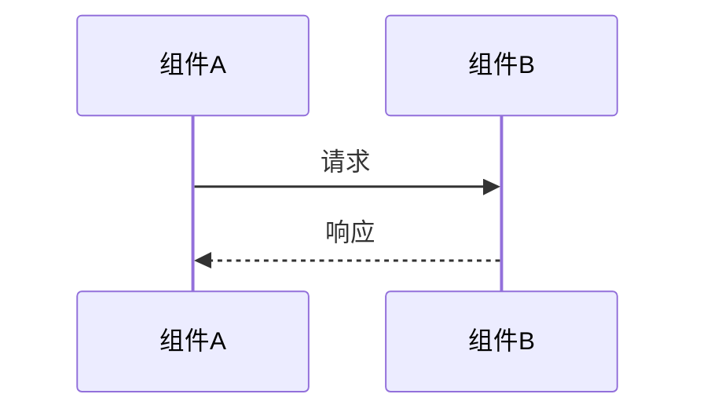

# {功能/模块名称} - 技术设计

<!--
使用说明：
1. 替换 {功能/模块名称} 为具体名称
2. 根据实际情况填写各章节
3. 删除不需要的章节
4. 删除所有 <!-- ... --> 注释
-->

| **版本** | v1.0 |
| -------- | ---- |
| **作者** | <!-- 填写作者 --> |
| **日期** | <!-- 填写日期 YYYY-MM-DD --> |
| **状态** | <!-- 草稿 / 评审中 / 已批准 --> |

---

## 1. 背景与目标

### 1.1 背景

<!-- 描述为什么需要这个功能/模块 -->

### 1.2 目标

<!-- 列出具体目标，使用可量化的描述 -->

- 目标1
- 目标2

### 1.3 非目标

<!-- 明确说明本次设计不包含什么 -->

- 非目标1
- 非目标2

---

## 2. 方案设计

### 2.1 整体架构

```
<!-- 使用 ASCII 或 Mermaid 绘制架构图 -->
```

### 2.2 核心流程



### 2.3 数据模型

<!-- 如有新增表或字段变更 -->

| 字段 | 类型 | 说明 |
|------|------|------|
| field1 | VARCHAR(64) | 描述 |

### 2.4 接口设计

#### 2.4.1 {接口名称}

**请求**

```
POST /api/xxx
```

**请求体**

```json
{
  "field1": "value"
}
```

**响应**

```json
{
  "code": 200,
  "data": {}
}
```

---

## 3. 方案对比

<!-- 如有多个可选方案，列出对比 -->

| 维度 | 方案A | 方案B |
|------|-------|-------|
| 优点 | ... | ... |
| 缺点 | ... | ... |
| 复杂度 | 低/中/高 | 低/中/高 |
| 推荐度 | ★★★ | ★★ |

**结论**：选择方案X，理由是...

---

## 4. 实现计划

### 4.1 阶段划分

| 阶段 | 内容 | 产出物 |
|------|------|--------|
| Phase 1 | ... | ... |
| Phase 2 | ... | ... |

### 4.2 依赖项

<!-- 列出实现过程中的依赖 -->

- [ ] 依赖1
- [ ] 依赖2

---

## 5. 风险与应对

| 风险 | 影响 | 概率 | 应对措施 |
|------|------|------|----------|
| 风险1 | 高/中/低 | 高/中/低 | 措施 |

---

## 6. 监控与告警

<!-- 列出需要监控的指标 -->

| 指标 | 阈值 | 告警级别 |
|------|------|----------|
| 指标1 | >100ms | Warning |

---

## 7. 参考资料

- [相关文档1](链接)
- [相关文档2](链接)

---

## 变更记录

| 版本 | 日期 | 作者 | 变更说明 |
|------|------|------|----------|
| v1.0 | YYYY-MM-DD | 作者 | 初始版本 |
