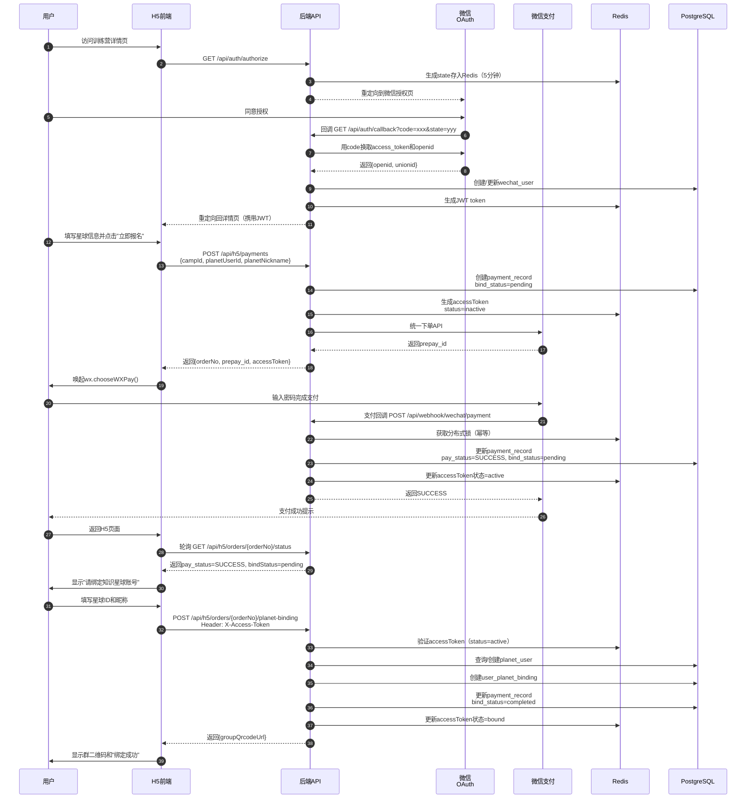
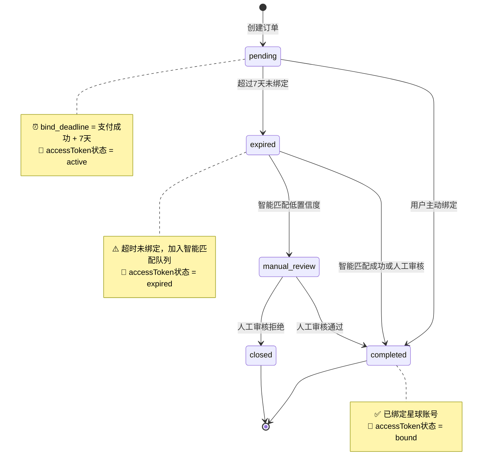
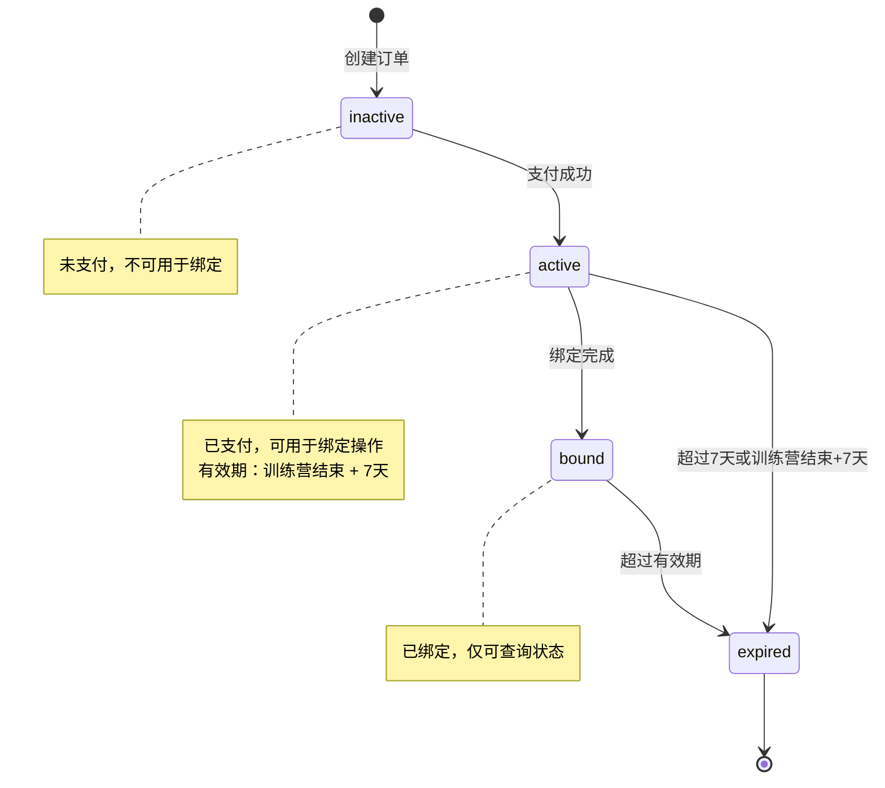

# EP02: 会员报名与支付

## Epic 概述

| 字段 | 内容 |
|------|------|
| **Epic ID** | EP02 |
| **Epic 名称** | 会员报名与支付 |
| **业务目标** | 实现支付绑定混合方案（OAuth绑定 + 固定二维码 + 支付后绑定） |
| **涉及角色** | 会员 |
| **优先级** | P0 |
| **核心特性** | OAuth授权、JSAPI支付、AccessToken机制、多路径绑定 |

---

## Story 2.1: H5端OAuth授权登录

| 字段 | 内容 |
|------|------|
| **Story ID** | S2.1 |
| **角色** | 作为一名会员 |
| **目标** | 我希望通过微信公众号授权登录 |
| **价值** | 以便于系统获取我的微信身份信息 |
| **优先级** | P0 |

### 验收标准

```gherkin
Feature: OAuth授权登录
  作为一名会员
  我希望通过微信公众号授权登录
  以便于系统获取我的微信身份信息

  Background:
    Given 用户在微信中打开H5页面
    And 系统已配置微信公众号AppID和Secret

  Scenario: 首次访问自动跳转授权
    Given 用户未授权
    When 访问训练营详情页
    Then 自动重定向到微信授权页面
    And URL包含state参数用于防止CSRF攻击

  Scenario: 用户同意授权
    Given 微信授权页面已打开
    When 用户点击"同意"
    Then 微信回调到系统callback接口
    And 系统用code换取access_token和openid
    And 创建或更新wechat_user记录
    And 生成JWT token
    And 重定向回原页面并携带token

  Scenario: 用户拒绝授权
    Given 微信授权页面已打开
    When 用户点击"取消"
    Then 显示"需要授权才能继续使用"提示
    And 提供"重新授权"按钮

  Scenario: 授权回调state验证失败
    Given 收到微信授权回调
    And state参数与Redis中存储的不一致
    When 验证state
    Then 返回错误"授权验证失败，请重试"
    And 记录安全告警日志

  Scenario: 授权回调code换取token失败
    Given 收到微信授权回调
    And code已过期或无效
    When 调用微信API换取token
    Then 返回错误"授权失败，请重新授权"
    And 记录错误日志
```

### 技术约束

- **OAuth 2.0流程**：使用微信公众号网页授权（snsapi_userinfo）
- **state参数管理**：存储在Redis，5分钟有效期
- **JWT token有效期**：7天，支持刷新
- **安全措施**：
  - state参数防CSRF
  - code仅能使用一次
  - 回调URL白名单验证

### 任务拆分

- [ ] Task 2.1.1: 实现OAuth授权发起接口 `GET /api/auth/authorize`
- [ ] Task 2.1.2: 实现OAuth回调处理 `GET /api/auth/callback`
- [ ] Task 2.1.3: 实现state参数生成与验证（Redis）
- [ ] Task 2.1.4: 实现微信API调用（换取token、获取用户信息）
- [ ] Task 2.1.5: 实现wechat_user表CRUD
- [ ] Task 2.1.6: 实现JWT token生成与验证
- [ ] Task 2.1.7: 编写单元测试
- [ ] Task 2.1.8: 编写集成测试

---

## Story 2.2: 创建支付订单（OAuth绑定路径）

| 字段 | 内容 |
|------|------|
| **Story ID** | S2.2 |
| **角色** | 作为一名会员 |
| **目标** | 我希望能够创建支付订单 |
| **价值** | 以便于完成押金支付并自动关联星球账号 |
| **优先级** | P0 |

### 验收标准

```gherkin
Feature: 创建支付订单（OAuth绑定）
  作为一名会员
  我希望能够创建支付订单
  以便于完成押金支付并自动关联星球账号

  Background:
    Given 用户已通过OAuth授权
    And 训练营状态为"报名中"

  Scenario: OAuth绑定路径 - 用户主动填写星球信息
    Given 用户进入训练营详情页
    And 填写星球ID为"123456789"
    And 填写星球昵称为"小明"
    When 点击"立即报名"
    Then 创建支付订单
    And 订单号格式为"ord_" + UUID
    And payment_record.bind_status = "pending"
    And payment_record.planet_user_id_from_user = "123456789"
    And 生成accessToken存入Redis（有效期=训练营结束+7天）
    And 返回微信支付prepay_id

  Scenario: 订单号唯一性校验
    Given 生成的订单号已存在
    When 创建订单
    Then 重新生成订单号
    And 最多重试3次
    And 失败则返回"系统繁忙，请稍后重试"

  Scenario: 训练营已满员
    Given 训练营报名人数已达上限
    When 尝试创建订单
    Then 返回错误"训练营已满员"
    And 不创建订单记录

  Scenario: 重复报名校验
    Given 该用户已有该训练营的有效订单（未过期）
    When 尝试再次报名
    Then 返回错误"您已报名此训练营，请勿重复支付"
    And 返回原订单信息

  Scenario: 星球ID格式校验
    Given 填写的星球ID不是9位数字
    When 提交报名信息
    Then 返回错误"星球ID格式不正确（应为9位数字）"
    And 不创建订单

  Scenario: 训练营已结束
    Given 训练营状态为"已结束"或"已归档"
    When 尝试报名
    Then 返回错误"训练营已结束，无法报名"
```

### 技术约束

- **订单号生成**：`ord_` + UUID（防止枚举攻击）
- **accessToken格式**：`tk_` + UUID
- **Redis存储结构**：
  ```json
  {
    "orderNo": "ord_xxx",
    "campId": 1,
    "wechatUserId": 10001,
    "status": "active",
    "expireAt": "2025-12-31T23:59:59"
  }
  ```
- **bind_status初始值**：pending（等待支付后绑定）
- **幂等性保证**：订单号唯一索引

### 任务拆分

- [ ] Task 2.2.1: 实现创建订单接口 `POST /api/h5/payments`
- [ ] Task 2.2.2: 实现订单号生成逻辑（UUID + 唯一性校验）
- [ ] Task 2.2.3: 实现accessToken生成与Redis存储
- [ ] Task 2.2.4: 实现训练营满员/重复报名校验
- [ ] Task 2.2.5: 实现payment_record表插入
- [ ] Task 2.2.6: 集成微信支付统一下单API
- [ ] Task 2.2.7: 编写单元测试
- [ ] Task 2.2.8: 编写集成测试

---

## Story 2.3: 微信支付JSAPI调用

| 字段 | 内容 |
|------|------|
| **Story ID** | S2.3 |
| **角色** | 作为一名会员 |
| **目标** | 我希望能够唤起微信支付完成付款 |
| **价值** | 以便于完成押金支付 |
| **优先级** | P0 |

### 验收标准

```gherkin
Feature: 微信支付JSAPI调用
  作为一名会员
  我希望能够唤起微信支付完成付款
  以便于完成押金支付

  Background:
    Given 用户已创建支付订单
    And 已获取prepay_id

  Scenario: 成功唤起微信支付
    Given 在微信浏览器中
    And prepay_id有效
    When 前端调用wx.chooseWXPay()
    Then 唤起微信支付界面
    And 显示订单金额和商品描述

  Scenario: 用户完成支付
    Given 微信支付界面已打开
    When 用户输入密码并确认
    Then 微信返回支付成功
    And 前端开始轮询订单状态

  Scenario: 用户取消支付
    Given 微信支付界面已打开
    When 用户点击"取消"
    Then 前端显示"支付已取消"
    And 提供"重新支付"按钮
    And 原订单保持有效（30分钟内可重新支付）

  Scenario: 支付超时
    Given 微信支付界面已打开
    When 超过5分钟未完成支付
    Then 前端显示"支付超时，请重新支付"
    And 原订单保持有效

  Scenario: 签名验证失败
    Given prepay_id签名错误
    When 调用wx.chooseWXPay()
    Then 微信返回签名错误
    And 前端显示"支付参数错误，请联系客服"
    And 记录错误日志

  Scenario: 网络异常
    Given 用户网络不稳定
    When 调用wx.chooseWXPay()超时
    Then 前端显示"网络异常，请稍后重试"
    And 提供"重新支付"按钮
```

### 技术约束

- **JSAPI调用要求**：
  - 必须在微信浏览器中
  - prepay_id有效期5分钟
  - 签名算法：HMAC-SHA256
- **前端轮询策略**：
  - 支付成功后每2秒轮询一次
  - 最多轮询30次（1分钟）
  - 超时提示用户手动刷新
- **订单有效期**：30分钟（可在此期间重新发起支付）

### 任务拆分

- [ ] Task 2.3.1: 实现获取支付参数接口 `GET /api/h5/payments/{orderNo}/params`
- [ ] Task 2.3.2: 实现prepay_id签名逻辑
- [ ] Task 2.3.3: 前端实现wx.chooseWXPay()调用
- [ ] Task 2.3.4: 前端实现支付结果轮询
- [ ] Task 2.3.5: 前端实现支付失败/取消处理
- [ ] Task 2.3.6: 实现订单超时定时任务
- [ ] Task 2.3.7: 编写单元测试
- [ ] Task 2.3.8: 编写E2E测试

---

## Story 2.4: 支付回调处理与AccessToken生成

| 字段 | 内容 |
|------|------|
| **Story ID** | S2.4 |
| **角色** | 作为系统 |
| **目标** | 我需要正确处理微信支付回调并生成AccessToken |
| **价值** | 以便于用户支付后能够进行后续绑定操作 |
| **优先级** | P0 |

### 验收标准

```gherkin
Feature: 支付回调处理
  作为系统
  我需要正确处理微信支付回调并生成AccessToken
  以便于用户支付后能够进行后续绑定操作

  Background:
    Given 微信支付系统发送支付成功回调
    And 回调包含out_trade_no（订单号）和transaction_id

  Scenario: 正常支付回调
    Given 收到微信支付回调
    And 签名验证通过
    And 订单状态为"待支付"
    When 处理回调
    Then 更新payment_record.pay_status = "SUCCESS"
    And 更新payment_record.bind_status = "pending"
    And 设置bind_deadline = NOW() + 7天
    And 更新Redis中accessToken状态为"active"
    And 记录到payment_status_log表
    And 返回<xml><return_code>SUCCESS</return_code></xml>

  Scenario: 签名验证失败
    Given 收到回调请求
    And 签名验证失败
    When 处理回调
    Then 返回<xml><return_code>FAIL</return_code></xml>
    And 记录安全告警日志
    And 发送企业微信告警

  Scenario: 重复回调（幂等处理）
    Given 收到重复的支付回调
    And 该订单已处理为"支付成功"
    When 处理回调
    Then 直接返回SUCCESS
    And 不重复更新数据库
    And 记录重复回调日志

  Scenario: 订单不存在
    Given 收到回调
    And out_trade_no在数据库中不存在
    When 处理回调
    Then 返回<xml><return_code>FAIL</return_code></xml>
    And 记录错误日志

  Scenario: 回调处理超时
    Given 收到回调
    When 数据库操作耗时超过3秒
    Then 先返回SUCCESS（避免微信重试）
    And 异步继续处理剩余逻辑
    And 记录超时告警

  Scenario: 金额校验失败
    Given 收到回调
    And 回调金额与订单金额不一致
    When 处理回调
    Then 返回<xml><return_code>FAIL</return_code></xml>
    And 记录严重告警
    And 发送企业微信告警
```

### 技术约束

- **签名验证算法**：按照微信支付文档要求
- **幂等性保证**：
  - Redis分布式锁（key=`payment:callback:{orderNo}`, 5分钟）
  - 数据库订单状态检查
- **accessToken状态流转**：
  - 创建订单时：`inactive`（未支付）
  - 支付成功后：`active`（可用于绑定）
  - 绑定完成后：`bound`（已绑定）
  - 超过7天：`expired`（已过期）
- **安全措施**：
  - 时间窗口验证（回调时间戳与当前时间差<5分钟）
  - IP白名单验证（微信支付服务器IP）

### 任务拆分

- [ ] Task 2.4.1: 实现Webhook接口 `POST /api/webhook/wechat/payment`
- [ ] Task 2.4.2: 实现微信签名验证
- [ ] Task 2.4.3: 实现Redis分布式锁（幂等性）
- [ ] Task 2.4.4: 实现payment_record状态更新
- [ ] Task 2.4.5: 实现accessToken状态更新（Redis）
- [ ] Task 2.4.6: 实现payment_status_log记录
- [ ] Task 2.4.7: 实现超时异步处理
- [ ] Task 2.4.8: 实现告警通知（企业微信）
- [ ] Task 2.4.9: 编写单元测试
- [ ] Task 2.4.10: 编写集成测试

---

## Story 2.5: 用户绑定星球账号

| 字段 | 内容 |
|------|------|
| **Story ID** | S2.5 |
| **角色** | 作为一名会员 |
| **目标** | 我希望能够在支付成功后绑定我的知识星球账号 |
| **价值** | 以便于系统能够追踪我的打卡记录 |
| **优先级** | P0 |

### 验收标准

```gherkin
Feature: 用户绑定星球账号
  作为一名会员
  我希望能够在支付成功后绑定我的知识星球账号
  以便于系统能够追踪我的打卡记录

  Background:
    Given 用户已完成支付
    And 拥有有效的accessToken

  Scenario: 成功绑定
    Given 用户进入绑定页面
    And 填写知识星球ID"123456789"
    And 填写知识星球昵称"小明"
    And Header携带X-Access-Token
    When 提交绑定
    Then 查询或创建planet_user记录
    And 创建user_planet_binding记录
    And 更新payment_record.bind_status = "completed"
    And 更新payment_record.bound_at = NOW()
    And 更新Redis中accessToken状态为"bound"
    And 返回绑定成功
    And 返回群二维码URL

  Scenario: accessToken验证失败
    Given 用户进入绑定页面
    And Header中的accessToken不存在或已过期
    When 提交绑定
    Then 返回401错误"访问凭证无效，请重新获取"
    And 不执行绑定操作

  Scenario: 超过绑定期限
    Given 支付完成已超过7天
    And bind_status仍为"pending"
    When 尝试绑定
    Then 返回错误"绑定期限已过，请联系客服"
    And 更新bind_status = "expired"
    And 订单加入智能匹配队列

  Scenario: 重复绑定（幂等）
    Given 该订单已绑定
    When 再次提交绑定
    Then 返回已绑定的信息
    And 不重复创建user_planet_binding记录

  Scenario: 星球用户已被其他订单绑定
    Given 填写的星球ID已被另一个支付订单绑定
    And 另一个订单属于不同微信用户
    When 提交绑定
    Then 返回警告"该星球账号已被其他微信用户绑定"
    And 提示用户确认
    And 允许继续绑定（多个微信号可绑定同一星球账号）

  Scenario: 星球ID格式错误
    Given 填写的星球ID不是9位数字
    When 提交绑定
    Then 返回错误"星球ID格式不正确"
    And 不执行绑定操作
```

### 技术约束

- **accessToken验证**：
  - 从Redis读取token信息
  - 验证status="active"（未绑定）
  - 验证expireAt > NOW()
  - 验证orderNo与请求一致
- **绑定关系**：
  - 一个payment_record只能绑定一个planet_user
  - 一个planet_user可被多个wechat_user绑定（合理场景）
  - user_planet_binding表唯一索引：(wechat_user_id, planet_user_id)
- **bind_method**：设置为`user_fill`（用户主动填写）

### 任务拆分

- [ ] Task 2.5.1: 实现绑定接口 `POST /api/h5/orders/{orderNo}/planet-binding`
- [ ] Task 2.5.2: 实现accessToken验证Filter
- [ ] Task 2.5.3: 实现planet_user查询/创建逻辑
- [ ] Task 2.5.4: 实现user_planet_binding创建
- [ ] Task 2.5.5: 实现payment_record状态更新
- [ ] Task 2.5.6: 实现accessToken状态更新（Redis）
- [ ] Task 2.5.7: 实现绑定期限校验
- [ ] Task 2.5.8: 前端实现绑定表单页面
- [ ] Task 2.5.9: 编写单元测试
- [ ] Task 2.5.10: 编写集成测试

---

## Story 2.6: 固定二维码兜底路径

| 字段 | 内容 |
|------|------|
| **Story ID** | S2.6 |
| **角色** | 作为一名会员 |
| **目标** | 我希望能够通过固定二维码支付（无需预先填写星球信息） |
| **价值** | 以便于在海报/宣传渠道快速报名 |
| **优先级** | P1 |

### 验收标准

```gherkin
Feature: 固定二维码支付
  作为一名会员
  我希望能够通过固定二维码支付
  以便于在海报/宣传渠道快速报名

  Background:
    Given 系统生成了固定二维码（一个训练营一个）
    And 二维码中不包含用户信息

  Scenario: 扫描固定二维码支付
    Given 用户扫描训练营固定二维码
    When 进入支付页面
    Then 显示训练营基本信息
    And 显示"先支付，后绑定"提示
    And 点击支付后创建订单
    And payment_record.planet_user_id_from_user = NULL
    And bind_status = "pending"
    And 支付成功后引导用户填写星球信息

  Scenario: 支付后7天内完成绑定
    Given 通过固定二维码完成支付
    And 支付后3天
    When 用户访问绑定页面（通过accessToken）
    Then 允许填写星球信息并绑定
    And bind_status更新为"completed"

  Scenario: 支付后超过7天未绑定
    Given 通过固定二维码完成支付
    And 支付后超过7天
    And 用户未绑定星球账号
    When 系统定时任务检查
    Then 更新bind_status = "expired"
    And 订单加入智能匹配队列
    And 发送提醒通知用户补充信息

  Scenario: 固定二维码 vs OAuth绑定
    Given 用户可选择两种支付方式
    When 选择固定二维码
    Then 无需预先OAuth授权
    And 支付后通过accessToken访问绑定页面
    When 选择OAuth绑定（详情页报名）
    Then 需要OAuth授权
    And 可提前填写星球信息
```

### 技术约束

- **固定二维码生成**：
  - URL格式：`https://h5.domain.com/camps/{campId}/enroll`
  - 不包含用户标识
  - 长期有效（训练营结束前）
- **与OAuth绑定的区别**：
  | 特性 | OAuth绑定 | 固定二维码 |
  |------|-----------|-----------|
  | OAuth授权 | 必需 | 可选 |
  | 预填星球信息 | 是 | 否 |
  | attach参数 | 包含用户信息 | 为空 |
  | bind_status初始值 | pending | pending |
  | 绑定期限 | 7天 | 7天 |

### 任务拆分

- [ ] Task 2.6.1: 实现固定二维码入口接口
- [ ] Task 2.6.2: 实现无OAuth场景的支付流程
- [ ] Task 2.6.3: 实现支付后引导绑定逻辑
- [ ] Task 2.6.4: 实现绑定超时定时任务（7天）
- [ ] Task 2.6.5: 前端实现固定二维码支付页面
- [ ] Task 2.6.6: 前端实现支付后绑定引导
- [ ] Task 2.6.7: 编写单元测试
- [ ] Task 2.6.8: 编写E2E测试

---

## Story 2.7: 订单状态查询

| 字段 | 内容 |
|------|------|
| **Story ID** | S2.7 |
| **角色** | 作为一名会员 |
| **目标** | 我希望能够查询我的订单状态 |
| **价值** | 以便于了解支付和绑定进度 |
| **优先级** | P0 |

### 验收标准

```gherkin
Feature: 订单状态查询
  作为一名会员
  我希望能够查询我的订单状态
  以便于了解支付和绑定进度

  Background:
    Given 用户拥有有效的accessToken

  Scenario: 查询待支付订单
    Given 订单状态为"待支付"
    And Header携带X-Access-Token
    When 调用查询接口
    Then 返回pay_status = "PENDING"
    And 返回bind_status = "pending"
    And 返回剩余支付时间（30分钟倒计时）

  Scenario: 查询已支付待绑定订单
    Given 订单状态为"已支付"
    And bind_status = "pending"
    When 调用查询接口
    Then 返回pay_status = "SUCCESS"
    And 返回bind_status = "pending"
    And 返回剩余绑定时间（7天倒计时）
    And 返回绑定页面URL

  Scenario: 查询已完成订单
    Given 订单状态为"已支付"
    And bind_status = "completed"
    When 调用查询接口
    Then 返回pay_status = "SUCCESS"
    And 返回bind_status = "completed"
    And 返回群二维码URL
    And 返回绑定的星球昵称

  Scenario: 查询已过期订单
    Given 支付后超过7天未绑定
    And bind_status = "expired"
    When 调用查询接口
    Then 返回bind_status = "expired"
    And 返回提示"绑定期限已过，系统将自动匹配"
    And 返回客服联系方式

  Scenario: accessToken无效
    Given Header中的accessToken不存在
    When 调用查询接口
    Then 返回401错误"访问凭证无效"

  Scenario: 订单不存在
    Given accessToken有效但对应订单不存在
    When 调用查询接口
    Then 返回404错误"订单不存在"
```

### 技术约束

- **查询接口**：`GET /api/h5/orders/{orderNo}/status`
- **认证方式**：Header中的`X-Access-Token`
- **返回字段**：
  ```json
  {
    "orderNo": "ord_xxx",
    "payStatus": "SUCCESS",
    "bindStatus": "pending",
    "amount": 99.00,
    "campName": "21天早起训练营",
    "remainingTime": 518400,  // 剩余绑定时间（秒）
    "groupQrcodeUrl": "https://...",  // 绑定后返回
    "bindingUrl": "/bind?token=tk_xxx"  // 待绑定时返回
  }
  ```

### 任务拆分

- [ ] Task 2.7.1: 实现查询接口 `GET /api/h5/orders/{orderNo}/status`
- [ ] Task 2.7.2: 实现accessToken验证
- [ ] Task 2.7.3: 实现不同状态的响应逻辑
- [ ] Task 2.7.4: 实现倒计时计算
- [ ] Task 2.7.5: 前端实现订单状态查询页面
- [ ] Task 2.7.6: 前端实现支付结果轮询
- [ ] Task 2.7.7: 编写单元测试
- [ ] Task 2.7.8: 编写集成测试

---

## 核心数据流转图



---

## 状态机图

### payment_record.bind_status 状态流转



### accessToken 状态流转



---

## 接口清单

| 接口 | 方法 | 路径 | 描述 | 认证方式 |
|------|------|------|------|---------|
| OAuth授权发起 | GET | `/api/auth/authorize` | 重定向到微信授权页 | 无 |
| OAuth授权回调 | GET | `/api/auth/callback` | 处理微信授权回调 | 无 |
| 创建支付订单 | POST | `/api/h5/payments` | 创建订单并返回支付参数 | JWT |
| 获取支付参数 | GET | `/api/h5/payments/{orderNo}/params` | 获取prepay_id用于前端调起支付 | JWT |
| 查询订单状态 | GET | `/api/h5/orders/{orderNo}/status` | 查询订单支付和绑定状态 | accessToken |
| 绑定星球账号 | POST | `/api/h5/orders/{orderNo}/planet-binding` | 用户填写星球信息完成绑定 | accessToken |
| 获取群二维码 | GET | `/api/h5/orders/{orderNo}/qrcode` | 绑定成功后获取群二维码 | accessToken |
| 支付回调 | POST | `/api/webhook/wechat/payment` | 接收微信支付回调 | 微信签名 |

---

## 相关文档

- [技术方案 v1](../design/技术方案.md) - 第5.3节：支付与绑定混合方案
- [接口文档 v1](../api/接口文档.md) - 第2章：OAuth授权，第3章：H5会员端接口
- [数据库设计 v1](../design/数据库设计.md) - payment_record、wechat_user、user_planet_binding表
- [FastAuth接入方案](../security/FastAuth接入方案.md) - OAuth实现细节

---

## 附录：关键决策记录

### 决策1：为什么需要accessToken而不是JWT？

**背景**：H5端支付后需要进行绑定操作，但JWT包含用户完整信息，不适合作为临时凭证。

**决策**：引入accessToken机制
- **格式**：`tk_` + UUID
- **存储**：Redis（key-value结构）
- **有效期**：训练营结束 + 7天
- **状态**：inactive → active → bound → expired
- **优势**：
  - 单一用途（仅用于绑定操作）
  - 可控生命周期
  - 易于撤销
  - 不暴露用户敏感信息

### 决策2：bind_status 标准值

| 值 | 含义 | 触发条件 |
|---|------|---------|
| `pending` | 待绑定 | 支付成功，未绑定 |
| `completed` | 已完成 | 用户绑定/智能匹配/人工审核通过 |
| `expired` | 已过期 | 超过7天未绑定 |
| `manual_review` | 待人工审核 | 智能匹配低置信度 |
| `closed` | 已关闭 | 人工审核拒绝 |

### 决策3：OAuth绑定 vs 固定二维码

| 维度 | OAuth绑定 | 固定二维码 |
|------|-----------|-----------|
| **适用场景** | 详情页报名 | 海报/宣传 |
| **用户体验** | 预填信息，体验好 | 先支付后绑定 |
| **绑定准确性** | 高（用户主动填写） | 中（依赖后续绑定或智能匹配） |
| **技术复杂度** | 中（需OAuth） | 低（可选OAuth） |
| **推荐优先级** | 优先 | 兜底 |

---

**文档版本**：v2.0
**最后更新**：2025-12-04
**维护者**：产品 + 技术负责人
