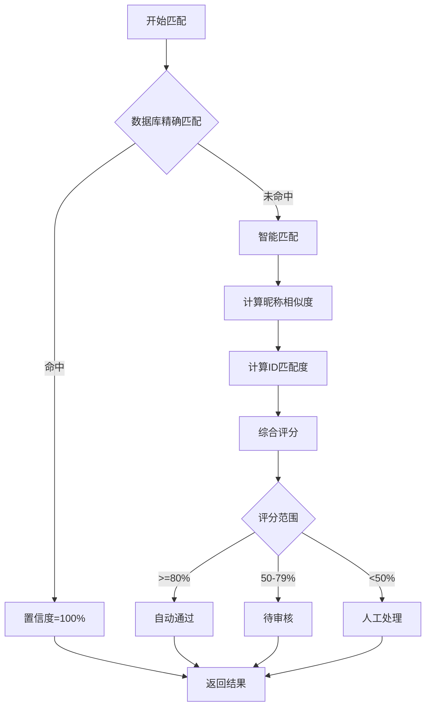

# EP04: 身份匹配

## Epic 概述

| 字段 | 内容 |
|------|------|
| **Epic ID** | EP04 |
| **Epic 名称** | 身份匹配 |
| **业务目标** | 系统能够自动匹配打卡用户与支付订单 |
| **涉及角色** | 系统、管理员 |
| **优先级** | P0 |

---

## Story 4.1: 数据库精确匹配

| 字段 | 内容 |
|------|------|
| **Story ID** | S4.1 |
| **角色** | 作为系统 |
| **目标** | 我需要通过数据库映射精确匹配用户身份 |
| **价值** | 以便于快速准确地关联打卡用户与支付订单 |
| **优先级** | P0 |

### 验收标准

```gherkin
Feature: 数据库精确匹配
  作为系统
  我需要通过数据库映射精确匹配用户身份
  以便于快速准确地关联打卡用户与支付订单

  Background:
    Given 会员报名时已保存星球ID与订单的映射

  Scenario: 精确匹配成功
    Given 打卡用户星球ID为 "12345678"
    And 数据库存在该星球ID的支付映射
    When 执行匹配
    Then 返回匹配结果
    And 置信度 = 100%
    And 匹配类型 = "精确匹配"

  Scenario: 精确匹配失败
    Given 打卡用户星球ID为 "99999999"
    And 数据库不存在该星球ID的映射
    When 执行匹配
    Then 返回无匹配
    And 触发智能匹配流程
```

### 任务拆分

- [ ] Task 4.1.1: 设计支付映射表结构
- [ ] Task 4.1.2: 实现精确匹配查询
- [ ] Task 4.1.3: 编写单元测试

---

## Story 4.2: 智能匹配算法

| 字段 | 内容 |
|------|------|
| **Story ID** | S4.2 |
| **角色** | 作为系统 |
| **目标** | 我需要通过智能算法匹配无法精确匹配的用户 |
| **价值** | 以便于提高整体匹配率 |
| **优先级** | P0 |

### 验收标准

```gherkin
Feature: 智能匹配算法
  作为系统
  我需要通过智能算法匹配无法精确匹配的用户
  以便于提高整体匹配率

  Background:
    Given 精确匹配未命中
    And 存在未匹配的支付订单

  Scenario: 昵称完全相同
    Given 打卡用户昵称为 "小明"
    And 支付记录中存在昵称 "小明"
    When 执行智能匹配
    Then 返回匹配结果
    And 置信度 >= 95%

  Scenario: 昵称高度相似
    Given 打卡用户昵称为 "小明同学"
    And 支付记录中存在昵称 "小明"
    When 执行智能匹配
    Then 返回匹配结果
    And 置信度 >= 80%

  Scenario: 昵称中度相似
    Given 打卡用户昵称为 "明明"
    And 支付记录中最相似的���称为 "小明"
    When 执行智能匹配
    Then 返回匹配结果
    And 置信度 在 50%-79% 之间
    And 标记为 "待审核"

  Scenario: 昵称低度相似
    Given 打卡用户昵称为 "张三"
    And 支付记录中没有相似昵称
    When 执行智能匹配
    Then 返回匹配失败
    And 标记为 "人工处理"

  Scenario: 多个候选匹配
    Given 打卡用户昵称为 "小明"
    And 支付记录中存在 "小明A" 和 "小明B"
    When 执行智能匹配
    Then 返回置信度最高的一个
    And 如果置信度相同，标记为 "待审核"
```

### 任务拆分

- [ ] Task 4.2.1: 实现 Levenshtein 距离算法
- [ ] Task 4.2.2: 实现相似度计算
- [ ] Task 4.2.3: 实现匹配评分逻辑
- [ ] Task 4.2.4: 编写单元测试（覆盖各种场景）

---

## Story 4.3: 匹配结果分类

| 字段 | 内容 |
|------|------|
| **Story ID** | S4.3 |
| **角色** | 作为系统 |
| **目标** | 我需要将匹配结果按置信度分类 |
| **价值** | 以便于管理员针对性处理不同类型的匹配 |
| **优先级** | P0 |

### 验收标准

```gherkin
Feature: 匹配结果分类
  作为系统
  我需要将匹配结果按置信度分类
  以便于管理员针对性处理不同类型的匹配

  Scenario: 高置信度 - 自动通过
    Given 匹配置信度 = 100%
    When 分类匹配结果
    Then 分类为 "高置信度"
    And 自动加入退款名单
    And 标记为 "自动通过"

  Scenario: 较高置信度 - 自动通过但标记
    Given 匹配置信度 = 85%
    When 分类匹配结果
    Then 分类为 "较高置信度"
    And 自动加入退款名单
    And 标记为 "自动通过（建议复核）"

  Scenario: 中等置信度 - 待审核
    Given 匹配置信度 = 65%
    When 分类匹配结果
    Then 分类为 "中等置信度"
    And 加入待审核列表
    And 需要管理员确认

  Scenario: 低置信度 - 人工处理
    Given 匹配置信度 < 50%
    When 分类匹配结果
    Then 分类为 "匹配失败"
    And 加入人工处理列表
    And 需要管理员手动匹配
```

### 任务拆分

- [ ] Task 4.3.1: 定义置信度阈值配置
- [ ] Task 4.3.2: 实现分类逻辑
- [ ] Task 4.3.3: 实现结果标记
- [ ] Task 4.3.4: 编写测试用例

---

## Story 4.4: 人工匹配

| 字段 | 内容 |
|------|------|
| **Story ID** | S4.4 |
| **角色** | 作为一名管理员 |
| **目标** | 我希望能够手动匹配自动匹配失败的记录 |
| **价值** | 以便于处理特殊情况 |
| **优先级** | P1 |

### 验收标准

```gherkin
Feature: 人工匹配
  作为一名管理员
  我希望能够手动匹配自动匹配失败的记录
  以便于处理特殊情况

  Background:
    Given 管理员已登录
    And 存在匹配失败的记录

  Scenario: 手动选择匹配
    Given 查看匹配失败的打卡用户 "张三"
    And 系统显示所有未匹配的订单
    When 管理员选择订单 "ORDER123"
    And 确认匹配
    Then 创建匹配关系
    And 置信度标记为 "人工匹配"

  Scenario: 搜索订单
    Given 管理员输入订单号 "ORDER123"
    When 搜索订单
    Then 显示订单详情
    And 可以确认匹配

  Scenario: 标记为无法匹配
    Given 查看匹配失败的打卡用户
    And 确认该用户不在支付名单中
    When 管理员标记为 "无法匹配"
    And 填写原因
    Then 该记录移出待处理列表
    And 记录处理日志
```

### 任务拆分

- [ ] Task 4.4.1: 实现人工匹配接口
- [ ] Task 4.4.2: 实现订单搜索功能
- [ ] Task 4.4.3: 实现管理后台页面
- [ ] Task 4.4.4: 编写测试用例

---

## 技术实现细节

### 匹配算法流程



### 相似度算法

```java
public class SimilarityCalculator {
    /**
     * 计算两个字符串的相似度
     * 使用 Levenshtein 距离 + 子串匹配综合评分
     */
    public double calculate(String s1, String s2) {
        // 1. 预处理：去除特殊字符、统一大小写
        s1 = preprocess(s1);
        s2 = preprocess(s2);

        // 2. 计算 Levenshtein 距离
        int distance = levenshteinDistance(s1, s2);
        double levenshteinScore = 1 - (double) distance / Math.max(s1.length(), s2.length());

        // 3. 计算子串匹配度
        double substringScore = substringMatch(s1, s2);

        // 4. 综合评分（加权平均）
        return levenshteinScore * 0.6 + substringScore * 0.4;
    }
}
```

### 置信度阈值配置

```yaml
# application.yml
matching:
  thresholds:
    auto-approve: 80      # >= 80% 自动通过
    review-required: 50   # 50-79% 待审核
    # < 50% 人工处理

  weights:
    nickname: 0.6         # 昵称相似度权重
    planet-id: 0.4        # 星球ID匹配权重
```

---

## 相关文档

- [技术方案 v1](../技术方案.md)
- [EP03: 打卡数据同步](./EP03-打卡数据同步.md)
- [EP05: 退款审核](./EP05-退款审核.md)
