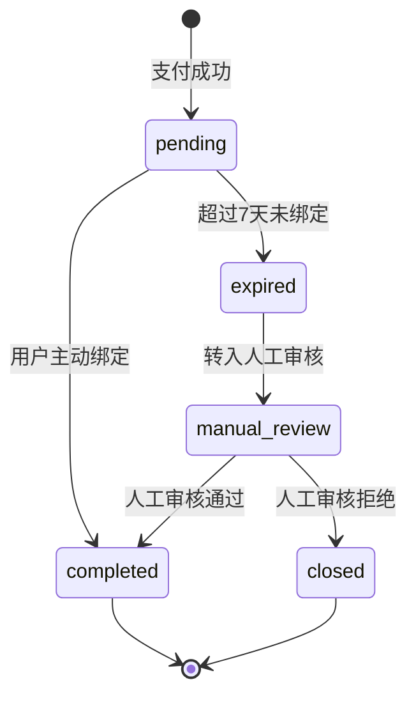

# EP04: 身份匹配

> **文档版本**: v2.0
> **最后更新**: 2025-12-05
> **SSOT引用**: [状态枚举定义.md](../design/状态枚举定义.md)

## Epic 概述

| 字段 | 内容 |
|------|------|
| **Epic ID** | EP04 |
| **Epic 名称** | 身份匹配 |
| **业务目标** | 将微信支付用户与知识星球会员身份绑定，确保打卡数据能关联到支付订单 |
| **涉及角色** | 用户、系统、管理员 |
| **优先级** | P0 |

### 核心概念

身份匹配基于 **bind_status**（绑定状态）和 **bind_method**（绑定方式）两个维度：

| bind_method | 说明 | 触发场景 |
|-------------|------|---------|
| `h5_bindplanet` | H5 主路径 | OAuth 登录后自动写入绑定关系 |
| `user_fill` | 用户填写 | 支付成功后在 H5 页面补填星球信息 |
| `manual` | 人工匹配 | 超时未绑定或异常情况，管理员手动关联 |

> ⚠️ **注意**：所有绑定方式置信度均为 **100%**，不存在置信度分级。

---

## Story 4.1: H5 主路径绑定（OAuth）

| 字段 | 内容 |
|------|------|
| **Story ID** | S4.1 |
| **角色** | 作为用户 |
| **目标** | 我希望通过 OAuth 登录自动完成身份绑定 |
| **价值** | 以便于无需手动填写即可关联星球账号 |
| **优先级** | P0 |

### 前置条件

- 用户已完成微信支付
- bind_status = `pending`
- accessToken 状态 = `active`

### 验收标准

```gherkin
Feature: H5 主路径绑定
  作为用户
  我希望通过 OAuth 登录自动完成身份绑定
  以便于无需手动填写即可关联星球账号

  Background:
    Given 用户已完成订单支付
    And bind_status = "pending"
    And accessToken 在有效期内

  Scenario: OAuth 授权绑定成功
    Given 用户在 H5 页面点击"绑定星球账号"
    And 系统引导用户完成知识星球 OAuth 授权
    When 授权成功，获取到星球用户信息
    Then 系统自动写入绑定关系
    And bind_status 更新为 "completed"
    And bind_method 设置为 "h5_bindplanet"
    And 记录绑定状态日志

  Scenario: OAuth 授权失败
    Given 用户在 OAuth 授权页面取消或授权失败
    When 返回 H5 页面
    Then bind_status 保持 "pending"
    And 显示"授权失败，请重试"提示
    And 用户可选择重试或切换到填写方式

  Scenario: 重复绑定请求
    Given 用户已完成绑定（bind_status = "completed"）
    When 再次访问绑定页面
    Then 显示"已绑定成功"状态
    And 展示群二维码
    And 不允许重复绑定
```

### 状态流转

```
bind_status: pending → completed
bind_method: NULL → h5_bindplanet
accessToken: active → bound
```

### 任务拆分

- [ ] Task 4.1.1: 实现知识星球 OAuth 授权接口
- [ ] Task 4.1.2: 实现 OAuth 回调处理，写入绑定关系
- [ ] Task 4.1.3: 实现绑定状态日志记录
- [ ] Task 4.1.4: 实现 H5 绑定页面
- [ ] Task 4.1.5: 编写单元测试和集成测试

---

## Story 4.2: 用户填写绑定（降级路径）

| 字段 | 内容 |
|------|------|
| **Story ID** | S4.2 |
| **角色** | 作为用户 |
| **目标** | 我希望能手动填写星球信息完成绑定 |
| **价值** | 以便于在 OAuth 不可用时仍能完成身份关联 |
| **优先级** | P0 |

### 前置条件

- 用户已完成微信支付
- bind_status = `pending`
- accessToken 状态 = `active`

### 验收标准

```gherkin
Feature: 用户填写绑定
  作为用户
  我希望能手动填写星球信息完成绑定
  以便于在 OAuth 不可用时仍能完成身份关联

  Background:
    Given 用户已完成订单支付
    And bind_status = "pending"
    And accessToken 在有效期内

  Scenario: 填写星球信息绑定成功
    Given 用户在 H5 页面选择"手动填写"
    And 输入星球昵称和星球 ID
    When 提交绑定信息
    Then 系统验证星球信息有效性
    And 创建绑定关系
    And bind_status 更新为 "completed"
    And bind_method 设置为 "user_fill"
    And 记录绑定状态日志

  Scenario: 星球信息校验失败
    Given 用户输入的星球信息无法在知识星球 API 中验证
    When 提交绑定信息
    Then 显示"星球信息验证失败，请检查"
    And bind_status 保持 "pending"
    And 用户可修改后重试

  Scenario: 星球 ID 已被其他订单绑定
    Given 输入的星球 ID 已绑定到其他支付记录
    When 提交绑定信息
    Then 显示"该星球账号已绑定其他订单"
    And bind_status 保持 "pending"
    And 提示联系管理员处理
```

### 状态流转

```
bind_status: pending → completed
bind_method: NULL → user_fill
accessToken: active → bound
```

### 任务拆分

- [ ] Task 4.2.1: 实现星球信息验证接口
- [ ] Task 4.2.2: 实现用户填写绑定接口
- [ ] Task 4.2.3: 实现星球 ID 唯一性校验
- [ ] Task 4.2.4: 实现 H5 填写表单页面
- [ ] Task 4.2.5: 编写单元测试

---

## Story 4.3: 绑定超时处理

| 字段 | 内容 |
|------|------|
| **Story ID** | S4.3 |
| **角色** | 作为系统 |
| **目标** | 我需要自动处理超过绑定期限的订单 |
| **价值** | 以便于将超时订单转入人工审核流程 |
| **优先级** | P0 |

### 前置条件

- bind_status = `pending`
- NOW() > bind_deadline（支付成功 + 7天）

### 验收标准

```gherkin
Feature: 绑定超时处理
  作为系统
  我需要自动处理超过绑定期限的订单
  以便于将超时订单转入人工审核流程

  Background:
    Given 定时任务每日 02:00 执行

  Scenario: 检测并标记超时订单
    Given 存在 bind_status = "pending" 的支付记录
    And NOW() > bind_deadline
    When 执行超时检测定时任务
    Then bind_status 更新为 "expired"
    And 记录绑定状态日志（原因："绑定超时"）
    And accessToken 状态更新为 "expired"

  Scenario: 超时订单转入人工审核
    Given 存在 bind_status = "expired" 的支付记录
    When 执行转人工审核定时任务
    Then bind_status 更新为 "manual_review"
    And 记录绑定状态日志
    And 发送通知给管理员

  Scenario: 未超时订单不处理
    Given 存在 bind_status = "pending" 的支付记录
    And NOW() < bind_deadline
    When 执行超时检测定时任务
    Then bind_status 保持 "pending"
    And 不记录状态变更
```

### 状态流转

```
定时任务1: bind_status: pending → expired
定时任务2: bind_status: expired → manual_review
```

### 任务拆分

- [ ] Task 4.3.1: 实现超时检测定时任务
- [ ] Task 4.3.2: 实现 expired → manual_review 转换任务
- [ ] Task 4.3.3: 实现管理员通知（企业微信消息）
- [ ] Task 4.3.4: 编写定时任务单元测试

---

## Story 4.4: 人工审核与匹配

| 字段 | 内容 |
|------|------|
| **Story ID** | S4.4 |
| **角色** | 作为管理员 |
| **目标** | 我希望能够审核并手动匹配超时/异常的绑定记录 |
| **价值** | 以便于处理自动绑定失败的特殊情况 |
| **优先级** | P1 |

### 前置条件

- 管理员已登录后台
- 存在 bind_status = `manual_review` 的记录

### 验收标准

```gherkin
Feature: 人工审核与匹配
  作为管理员
  我希望能够审核并手动匹配超时/异常的绑定记录
  以便于处理自动绑定失败的特殊情况

  Background:
    Given 管理员已登录管理后台
    And 存在 bind_status = "manual_review" 的支付记录

  Scenario: 查看待审核列表
    When 管理员进入"待审核绑定"页面
    Then 显示所有 bind_status = "manual_review" 的记录
    And 每条记录展示：订单号、微信昵称、支付金额、支付时间、训练营名称
    And 支持按训练营、支付时间筛选

  Scenario: 手动匹配星球用户
    Given 管理员查看待审核订单 "ORDER123"
    And 系统显示该订单关联的微信用户信息
    When 管理员搜索星球用户（按昵称或星球ID）
    And 选择匹配的星球用户
    And 确认绑定
    Then 创建绑定关系
    And bind_status 更新为 "completed"
    And bind_method 设置为 "manual"
    And 记录绑定状态日志（操作人、原因）

  Scenario: 标记为无法匹配
    Given 管理员查看待审核订单
    And 确认该用户不在星球会员中
    When 管理员点击"无法匹配"
    And 填写原因（如"用户退出星球"）
    Then bind_status 更新为 "closed"
    And 记录绑定状态日志
    And 该记录从待审核列表移除

  Scenario: 批量审核
    Given 管理员选择多条待审核记录
    When 点击"批量标记无法匹配"
    And 输入统一原因
    Then 所有选中记录的 bind_status 更新为 "closed"
    And 分别记录状态日志
```

### 状态流转

```
审核通过: bind_status: manual_review → completed, bind_method: NULL → manual
审核拒绝: bind_status: manual_review → closed
```

### 任务拆分

- [ ] Task 4.4.1: 实现待审核列表查询接口
- [ ] Task 4.4.2: 实现星球用户搜索接口
- [ ] Task 4.4.3: 实现人工匹配接口
- [ ] Task 4.4.4: 实现无法匹配标记接口
- [ ] Task 4.4.5: 实现管理后台审核页面
- [ ] Task 4.4.6: 编写单元测试

---

## Story 4.5: 数据库精确查询

| 字段 | 内容 |
|------|------|
| **Story ID** | S4.5 |
| **角色** | 作为系统 |
| **目标** | 我需要通过星球用户 ID 精确查询绑定关系 |
| **价值** | 以便于打卡同步时快速定位对应的支付订单 |
| **优先级** | P0 |

### 验收标准

```gherkin
Feature: 数据库精确查询
  作为系统
  我需要通过星球用户 ID 精确查询绑定关系
  以便于打卡同步时快速定位对应的支付订单

  Background:
    Given 同步打卡数据时需要关联支付订单

  Scenario: 根据星球用户 ID 查询绑定订单
    Given 打卡用户的星球 ID 为 "12345678"
    And 数据库存在该星球 ID 的已完成绑定记录
    When 执行查询
    Then 返回匹配的 payment_record
    And 包含订单号、会员ID、训练营ID

  Scenario: 星球用户 ID 无匹配
    Given 打卡用户的星球 ID 为 "99999999"
    And 数据库不存在该星球 ID 的绑定记录
    When 执行查询
    Then 返回空结果
    And 该打卡记录标记为"未关联订单"

  Scenario: 同一星球用户多次报名
    Given 星球用户 "12345678" 参加了多个训练营
    And 每个训练营都有独立的绑定记录
    When 查询特定训练营的绑定关系
    Then 返回该训练营对应的唯一绑定记录
```

### 任务拆分

- [ ] Task 4.5.1: 实现根据 planet_user_id 查询绑定关系
- [ ] Task 4.5.2: 实现训练营维度的绑定查询
- [ ] Task 4.5.3: 添加 planet_user_id + camp_id 联合索引
- [ ] Task 4.5.4: 编写查询性能测试

---

## 技术实现细节

### 绑定状态流转图

> 引用自 [状态枚举定义.md](../design/状态枚举定义.md#1-bind_status---支付绑定状态)



### bind_method 与绑定路径对应关系

| 绑定路径 | bind_method | 触发条件 | 状态变化 |
|---------|-------------|---------|---------|
| H5主路径 | `h5_bindplanet` | OAuth 授权成功 | pending → completed |
| 降级路径 | `user_fill` | 用户手动填写并验证通过 | pending → completed |
| 人工匹配 | `manual` | 管理员审核通过 | manual_review → completed |

### 数据库关联查询

```sql
-- 查询待人工审核的绑定记录
SELECT
    pr.order_no,
    pr.amount,
    pr.paid_at,
    wu.nickname AS wechat_nickname,
    tc.name AS camp_name
FROM payment_record pr
JOIN wechat_user wu ON pr.wechat_user_id = wu.id
JOIN training_camp tc ON pr.camp_id = tc.id
WHERE pr.bind_status = 'manual_review'
ORDER BY pr.paid_at DESC;

-- 根据星球用户ID查询绑定订单
SELECT pr.*
FROM payment_record pr
WHERE pr.planet_user_id = '12345678'
  AND pr.camp_id = 1
  AND pr.bind_status = 'completed';
```

---

## 相关文档

- [状态枚举定义](../design/状态枚举定义.md) - **SSOT**: bind_status、bind_method 定义
- [技术方案](../design/技术方案.md) - 系统架构设计
- [数据库设计](../design/数据库设计.md) - payment_record 表结构
- [EP02: 会员报名与支付](./EP02-会员报名与支付.md) - 支付流程
- [EP03: 打卡数据同步](./EP03-打卡数据同步.md) - 打卡数据关联
- [EP05: 退款审核](./EP05-退款审核.md) - 退款流程依赖绑定状态
- [OAuth安全指南](../security/OAuth安全指南.md) - OAuth 实现细节

---

## 决策记录

### 决策1: 移除智能匹配方案

**背景**：原设计包含基于昵称相似度的"智能匹配"方案（置信度分级 50%/80%/100%）。

**决策**：废弃智能匹配，所有绑定方式置信度统一为 100%。

**原因**：
1. OAuth 主路径提供了可靠的身份绑定，成功率高
2. 智能匹配基于昵称相似度，误匹配风险大
3. 简化系统复杂度，降低维护成本
4. 异常情况由人工审核兜底，更可靠

### 决策2: 绑定超时 7 天

**背景**：用户支付后需要在一定时间内完成身份绑定。

**决策**：绑定期限为支付成功后 7 天。

**原因**：
1. 给予用户充足时间完成绑定
2. 避免无限期待绑定导致数据混乱
3. 与训练营业务周期匹配

---

**变更历史**：
| 版本 | 日期 | 变更内容 |
|------|------|---------|
| v2.0 | 2025-12-05 | 完全重写：移除智能匹配方案，聚焦 bind_status 状态流转 |
| v1.0 | 2025-11-xx | 初始版本（已废弃） |
