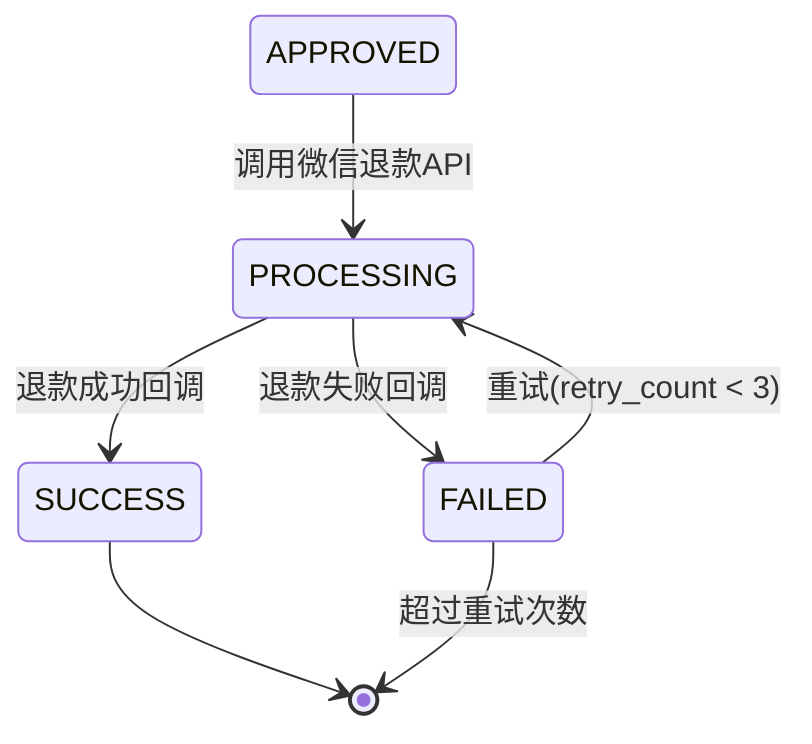
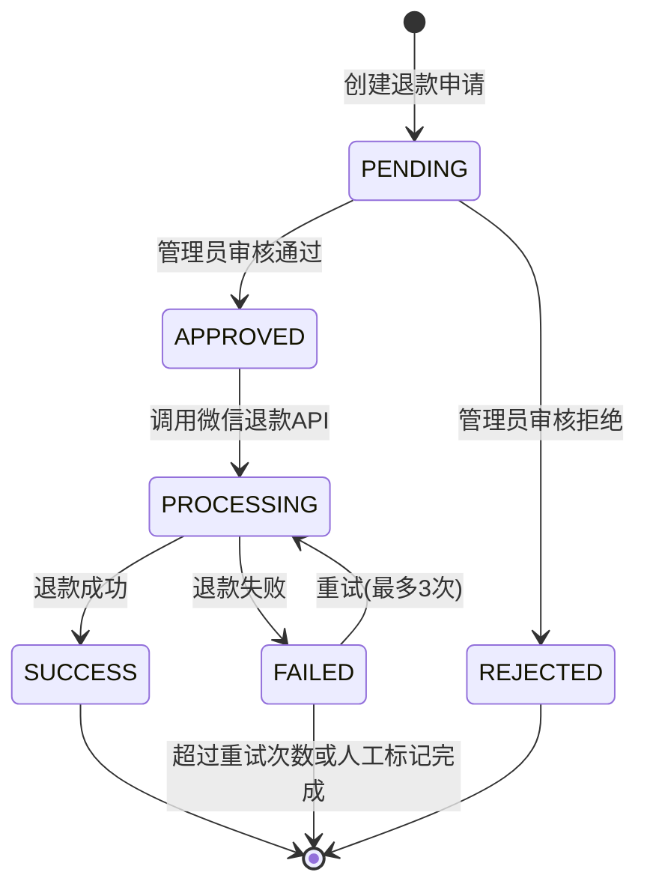

# EP05: 退款审核

> **文档版本**: v2.0
> **最后更新**: 2025-12-05
> **SSOT引用**: [状态枚举定义.md](../design/状态枚举定义.md)

## Epic 概述

| 字段 | 内容 |
|------|------|
| **Epic ID** | EP05 |
| **Epic 名称** | 退款审核 |
| **业务目标** | 管理员能够高效地审核和执行退款，确保打卡合格的会员获得押金退还 |
| **涉及角色** | 管理员、系统 |
| **优先级** | P0 |

### 核心概念

退款流程基于 **refund_status**（退款状态）进行管理：

| refund_status | 含义 | 后续操作 |
|---------------|------|---------|
| `PENDING` | 待处理 | 管理员审核 |
| `APPROVED` | 审核通过 | 系统执行退款 |
| `REJECTED` | 审核拒绝 | 终态 |
| `PROCESSING` | 处理中 | 等待微信回调 |
| `SUCCESS` | 退款成功 | 终态 |
| `FAILED` | 退款失败 | 重试或人工处理 |

### 前置条件

- 训练营状态为 `ENDED`（已结束）或 `SETTLING`（结算中）
- 会员 checkin_status = `qualified`（打卡合格）
- 会员 bind_status = `completed`（已完成身份绑定）

---

## Story 5.1: 触发结算与生成退款名单

| 字段 | 内容 |
|------|------|
| **Story ID** | S5.1 |
| **角色** | 作为管理员 |
| **目标** | 我希望能够触发训练营结算并生成退款名单 |
| **价值** | 以便于开始退款审核流程 |
| **优先级** | P0 |

### 验收标准

```gherkin
Feature: 触发结算与生成退款名单
  作为管理员
  我希望能够触发训练营结算并生成退款名单
  以便于开始退款审核流程

  Background:
    Given 管理员已登录
    And 训练营状态为 "ENDED"（已结束）

  Scenario: 触发结算流程
    Given 选择训练营 "21天早起打卡"
    When 点击 "开始结算" 按钮
    Then 训练营状态变为 "SETTLING"（结算中）
    And 记录训练营状态日志

  Scenario: 成功生成退款名单
    Given 训练营状态为 "SETTLING"
    When 点击 "生成退款名单" 按钮
    Then 系统筛选 checkin_status = "qualified" 的会员
    And 筛选 bind_status = "completed" 的会员
    And 为每个合格会员创建 refund_record（refund_status = "PENDING"）
    And 返回退款名单统计

  Scenario: 显示退款统计
    Given 退款名单生成完成
    Then 显示总合格人数
    And 显示已绑定人数（可退款）
    And 显示未绑定人数（需人工处理）
    And 显示待审核退款总金额

  Scenario: 训练营未结束
    Given 训练营状态为 "ONGOING"（进行中）
    When 尝试触发结算
    Then 返回错误 "训练营尚未结束，无法开始结算"

  Scenario: 已生成过名单
    Given 已生成过退款名单
    When 再次点击生成
    Then 提示 "是否重新生成？（将清空现有待处理名单）"
    And 只允许清空 refund_status = "PENDING" 的记录
```

### 状态流转

```
训练营: ENDED → SETTLING（触发结算）
退款记录: 创建 → refund_status = PENDING
```

### 任务拆分

- [ ] Task 5.1.1: 实现触发结算接口（更新训练营状态）
- [ ] Task 5.1.2: 实现生成退款名单接口
- [ ] Task 5.1.3: 集成打卡统计（checkin_status）
- [ ] Task 5.1.4: 集成绑定状态（bind_status）
- [ ] Task 5.1.5: 实现统计汇总
- [ ] Task 5.1.6: 编写单元测试

---

## Story 5.2: 查看退款名单

| 字段 | 内容 |
|------|------|
| **Story ID** | S5.2 |
| **角色** | 作为管理员 |
| **目标** | 我希望能够查看退款名单详情 |
| **价值** | 以便于了解每条退款记录的状态 |
| **优先级** | P0 |

### 验收标准

```gherkin
Feature: 查看退款名单
  作为管理员
  我希望能够查看退款名单详情
  以便于了解每条退款记录的状态

  Background:
    Given 管理员已登录
    And 存在退款名单

  Scenario: 查看全部列表
    Given 进入退款名单页面
    Then 显示所有退款记录
    And 每条记录显示：
      | 字段 | 说明 |
      | 微信昵称 | wechat_user.nickname |
      | 星球昵称 | planet_nickname |
      | 打卡天数 | checkin_count |
      | 退款金额 | refund_amount |
      | 退款状态 | refund_status |
      | 绑定方式 | bind_method |

  Scenario: 按退款状态筛选
    Given 选择状态筛选为 "PENDING"
    When 查询列表
    Then 只显示 refund_status = "PENDING" 的记录

  Scenario: 按绑定方式筛选
    Given 选择绑定方式筛选为 "manual"
    When 查询列表
    Then 只显示 bind_method = "manual" 的记录
    And 便于管理员重点复核人工匹配的退款

  Scenario: 查看退款详情
    Given 点击某条退款记录
    Then 显示详细信息：
      | 订单号 | order_no |
      | 支付时间 | paid_at |
      | 支付金额 | pay_amount |
      | 绑定时间 | bound_at |
      | 绑定方式 | bind_method |
      | 打卡详情 | checkin_count / required_days |
      | 退款状态历史 | refund_status_log |
```

### 任务拆分

- [ ] Task 5.2.1: 实现退款名单查询接口
- [ ] Task 5.2.2: 实现分页和多维度筛选
- [ ] Task 5.2.3: 实现详情查询接口
- [ ] Task 5.2.4: 实现管理后台退款列表页面

---

## Story 5.3: 审核退款

| 字段 | 内容 |
|------|------|
| **Story ID** | S5.3 |
| **角色** | 作为管理员 |
| **目标** | 我希望能够审核退款记录 |
| **价值** | 以便于确认或拒绝退款申请 |
| **优先级** | P0 |

### 验收标准

```gherkin
Feature: 审核退款
  作为管理员
  我希望能够审核退款记录
  以便于确认或拒绝退款申请

  Background:
    Given 管理员已登录
    And 存在 refund_status = "PENDING" 的退款记录

  Scenario: 单条审核通过
    Given 选择一条待处理记录
    When 点击 "通过" 按钮
    Then refund_status 变为 "APPROVED"
    And 记录退款状态日志（操作人、时间）
    And 该记录加入待执行队列

  Scenario: 单条审核拒绝
    Given 选择一条待处理记录
    When 点击 "拒绝" 按钮
    And 填写拒绝原因（如"打卡记录异常"）
    Then refund_status 变为 "REJECTED"
    And 记录退款状态日志（含拒绝原因）

  Scenario: 批量审核通过
    Given 选择多条待处理记录
    When 点击 "批量通过" 按钮
    Then 所有选中记录 refund_status 变为 "APPROVED"
    And 分别记录状态日志
    And 加入待执行队列

  Scenario: 批量审核拒绝
    Given 选择多条待处理记录
    When 点击 "批量拒绝" 按钮
    And 填写统一拒绝原因
    Then 所有选中记录 refund_status 变为 "REJECTED"

  Scenario: 一键全部通过
    Given 当前筛选条件下有 50 条待处理记录
    When 点击 "全部通过" 按钮
    And 二次确认操作
    Then 所有筛选结果中 refund_status = "PENDING" 的记录变为 "APPROVED"
```

### 状态流转

```
refund_status: PENDING → APPROVED（审核通过）
refund_status: PENDING → REJECTED（审核拒绝）
```

### 任务拆分

- [ ] Task 5.3.1: 实现单条审核接口
- [ ] Task 5.3.2: 实现批量审核接口
- [ ] Task 5.3.3: 实现退款状态日志记录
- [ ] Task 5.3.4: 编写单元测试

---

## Story 5.4: 执行退款

| 字段 | 内容 |
|------|------|
| **Story ID** | S5.4 |
| **角色** | 作为系统 |
| **目标** | 我需要自动执行审核通过的退款 |
| **价值** | 以便于将押金退还给会员 |
| **优先级** | P0 |

### 验收标准

```gherkin
Feature: 执行退款
  作为系统
  我需要自动执行审核通过的退款
  以便于将押金退还给会员

  Background:
    Given 存在 refund_status = "APPROVED" 的退款记录
    And 商户账户余额充足

  Scenario: 正常退款流程
    Given 退款金额为 99 元
    When 执行退款
    Then refund_status 变为 "PROCESSING"
    And 调用微信支付退款 API
    And 等待微信回调

  Scenario: 微信回调 - 退款成功
    Given refund_status = "PROCESSING"
    When 收到微信退款成功回调
    Then refund_status 变为 "SUCCESS"
    And 记录微信退款单号 wechat_refund_id
    And 更新 payment_record.pay_status = "refunded"
    And 发送退款成功通知给会员（模板消息）

  Scenario: 微信回调 - 退款失败
    Given refund_status = "PROCESSING"
    When 收到微信退款失败回调
    Then refund_status 变为 "FAILED"
    And 记录失败原因
    And retry_count + 1

  Scenario: 退款失败 - 余额不足
    Given 商户账户余额为 50 元
    And 退款金额为 99 元
    When 执行退款
    Then refund_status 变为 "FAILED"
    And 失败原因为 "商户余额不足"
    And 发送告警通知给管理员

  Scenario: 退款失败后自动重试
    Given refund_status = "FAILED"
    And retry_count < 3
    And 失败原因为可重试类型（网络超时）
    When 定时任务触发（每 10 分钟）
    Then 自动重新执行退款
    And retry_count + 1

  Scenario: 超过重试次数
    Given refund_status = "FAILED"
    And retry_count >= 3
    When 定时任务扫描
    Then 标记为需要人工处理
    And 发送告警通知

  Scenario: 批量退款限流
    Given 有 100 条待执行退款（refund_status = "APPROVED"）
    When 执行批量退款
    Then 按限流规则分批执行（每秒最多 10 笔）
    And 避免触发微信支付限流
```

### 状态流转



### 任务拆分

- [ ] Task 5.4.1: 实现退款执行服务
- [ ] Task 5.4.2: 集成微信支付退款 API
- [ ] Task 5.4.3: 实现微信退款回调处理
- [ ] Task 5.4.4: 实现自动重试定时任务
- [ ] Task 5.4.5: 实现限流控制
- [ ] Task 5.4.6: 实现退款通知（模板消息）
- [ ] Task 5.4.7: 编写单元测试和集成测试

---

## Story 5.5: 退款失败处理

| 字段 | 内容 |
|------|------|
| **Story ID** | S5.5 |
| **角色** | 作为管理员 |
| **目标** | 我希望能够处理退款失败的记录 |
| **价值** | 以便于确保所有应退款项都得到处理 |
| **优先级** | P1 |

### 验收标准

```gherkin
Feature: 退款失败处理
  作为管理员
  我希望能够处理退款失败的记录
  以便于确保所有应退款项都得到处理

  Background:
    Given 管理员已登录

  Scenario: 查看失败列表
    Given 存在 refund_status = "FAILED" 且 retry_count >= 3 的记录
    When 进入"失败处理"页面
    Then 显示所有需人工处理的失败记录
    And 每条记录显示：
      | 字段 | 说明 |
      | 会员信息 | 微信昵称、星球昵称 |
      | 退款金额 | refund_amount |
      | 失败原因 | fail_reason |
      | 重试次数 | retry_count |
      | 最后失败时间 | updated_at |

  Scenario: 手动重试
    Given 选择一条失败记录
    And 管理员确认问题已解决（如已充值余额）
    When 点击 "重试" 按钮
    Then 重置 retry_count = 0
    And refund_status 变为 "APPROVED"
    And 重新加入执行队列

  Scenario: 线下处理后标记完成
    Given 选择一条失败记录
    And 已通过其他方式（如银行转账）完成退款
    When 点击 "标记已处理" 按钮
    And 填写处理说明（如"银行转账，流水号XXX"）
    Then refund_status 变为 "SUCCESS"
    And 记录状态日志（标记为人工处理）
    And remark 保存处理说明

  Scenario: 查看操作历史
    Given 选择一条退款记录
    When 查看历史
    Then 显示 refund_status_log 所有记录
    And 包括：操作时间、操作人、状态变更、备注
```

### 任务拆分

- [ ] Task 5.5.1: 实现失败列表查询接口
- [ ] Task 5.5.2: 实现手动重试接口
- [ ] Task 5.5.3: 实现标记已处理接口
- [ ] Task 5.5.4: 实现操作历史查询
- [ ] Task 5.5.5: 实现管理后台失败处理页面
- [ ] Task 5.5.6: 编写单元测试

---

## Story 5.6: 完成结算与归档

| 字段 | 内容 |
|------|------|
| **Story ID** | S5.6 |
| **角色** | 作为管理员 |
| **目标** | 我希望在所有退款处理完成后归档训练营 |
| **价值** | 以便于结束训练营生命周期 |
| **优先级** | P1 |

### 验收标准

```gherkin
Feature: 完成结算与归档
  作为管理员
  我希望在所有退款处理完成后归档训练营
  以便于结束训练营生命周期

  Background:
    Given 管理员已登录
    And 训练营状态为 "SETTLING"

  Scenario: 检查结算完成条件
    Given 查看结算状态
    Then 显示退款统计：
      | 状态 | 数量 |
      | 待处理 (PENDING) | 0 |
      | 审核通过待执行 (APPROVED) | 0 |
      | 执行中 (PROCESSING) | 0 |
      | 退款成功 (SUCCESS) | 95 |
      | 审核拒绝 (REJECTED) | 3 |
      | 退款失败 (FAILED) | 2 |

  Scenario: 归档训练营
    Given 无 PENDING/APPROVED/PROCESSING 状态的退款记录
    And 管理员确认 FAILED 记录已人工处理或放弃
    When 点击 "完成结算并归档" 按钮
    Then 训练营状态变为 "ARCHIVED"
    And 记录训练营状态日志
    And 生成结算报告

  Scenario: 存在未完成退款
    Given 存在 refund_status = "PROCESSING" 的记录
    When 尝试归档
    Then 返回错误 "存在未完成的退款，无法归档"
    And 显示未完成记录列表
```

### 状态流转

```
训练营: SETTLING → ARCHIVED（所有退款处理完成）
```

### 任务拆分

- [ ] Task 5.6.1: 实现结算状态检查接口
- [ ] Task 5.6.2: 实现归档接口
- [ ] Task 5.6.3: 实现结算报告生成
- [ ] Task 5.6.4: 编写单元测试

---

## 技术实现细节

### 退款状态流转图

> 引用自 [状态枚举定义.md](../design/状态枚举定义.md#4-refund_status---退款状态)



### 接口设计

#### 触发结算

```
POST /api/admin/camps/{campId}/settle

Response:
{
  "code": 200,
  "data": {
    "campId": 1,
    "campStatus": "SETTLING",
    "message": "已进入结算状态"
  }
}
```

#### 生成退款名单

```
POST /api/admin/camps/{campId}/refund-list

Response:
{
  "code": 200,
  "data": {
    "totalQualified": 120,      // 打卡合格人数
    "boundCount": 115,          // 已绑定（可退款）
    "unboundCount": 5,          // 未绑定（需人工处理）
    "pendingRefundAmount": 11385.00,  // 待审核退款总金额
    "createdCount": 115         // 创建退款记录数
  }
}
```

#### 审核退款

```
POST /api/admin/refunds/batch-review

Request:
{
  "refundIds": [1, 2, 3],
  "action": "APPROVE",  // APPROVE | REJECT
  "reason": "string"    // REJECT 时必填
}

Response:
{
  "code": 200,
  "data": {
    "successCount": 3,
    "failedCount": 0
  }
}
```

#### 执行退款

```
POST /api/admin/refunds/{refundId}/execute

Response:
{
  "code": 200,
  "data": {
    "refundId": 123,
    "refundStatus": "PROCESSING",
    "message": "退款请求已提交"
  }
}
```

#### 标记已处理

```
POST /api/admin/refunds/{refundId}/mark-processed

Request:
{
  "remark": "银行转账完成，流水号: TXN123456"
}

Response:
{
  "code": 200,
  "data": {
    "refundId": 123,
    "refundStatus": "SUCCESS",
    "processedBy": "admin"
  }
}
```

---

## 相关文档

- [状态枚举定义](../design/状态枚举定义.md) - **SSOT**: refund_status、camp_status 定义
- [技术方案](../design/技术方案.md) - 系统架构设计
- [数据库设计](../design/数据库设计.md) - refund_record 表结构
- [支付安全增强方案](../security/支付安全增强方案.md) - 退款安全机制
- [EP01: 训练营管理](./EP01-训练营管理.md) - 训练营状态流转
- [EP03: 打卡数据同步](./EP03-打卡数据同步.md) - checkin_status 判定
- [EP04: 身份匹配](./EP04-身份匹配.md) - bind_status 依赖
- [EP06: 统计报表](./EP06-统计报表.md) - 退款统计报表

---

## 决策记录

### 决策1: 移除置信度筛选

**背景**：原设计基于"智能匹配"的置信度（50%/80%/100%）进行退款名单分类。

**决策**：移除置信度相关筛选，改为按 `bind_method` 筛选。

**原因**：
1. 智能匹配方案已废弃，所有绑定方式置信度均为 100%
2. 管理员更关注 `bind_method = manual`（人工匹配）的记录进行复核
3. 简化系统复杂度

### 决策2: 退款审核与执行分离

**背景**：退款需要管理员审核后才能执行。

**决策**：
- 审核操作：PENDING → APPROVED/REJECTED
- 执行操作：APPROVED → PROCESSING → SUCCESS/FAILED

**原因**：
1. 分离职责，审核和执行可以不同时进行
2. 批量审核后可以统一执行，提高效率
3. 便于追踪问题和审计

### 决策3: 结算状态 SETTLING

**背景**：训练营结束后需要一段时间处理退款。

**决策**：增加 `SETTLING`（结算中）状态，在 `ENDED` 和 `ARCHIVED` 之间。

**原因**：
1. 明确训练营处于退款处理阶段
2. 防止在结算过程中修改训练营配置
3. 只有所有退款处理完成才能归档

---

**变更历史**：
| 版本 | 日期 | 变更内容 |
|------|------|---------|
| v2.0 | 2025-12-05 | 移除置信度概念，统一 refund_status 术语，添加 SSOT 引用 |
| v2.0 | 2025-12-05 | 新增 Story 5.6 完成结算与归档 |
| v2.0 | 2025-12-05 | 添加退款状态流转图和接口设计 |
| v1.0 | 2025-11-xx | 初始版本 |
