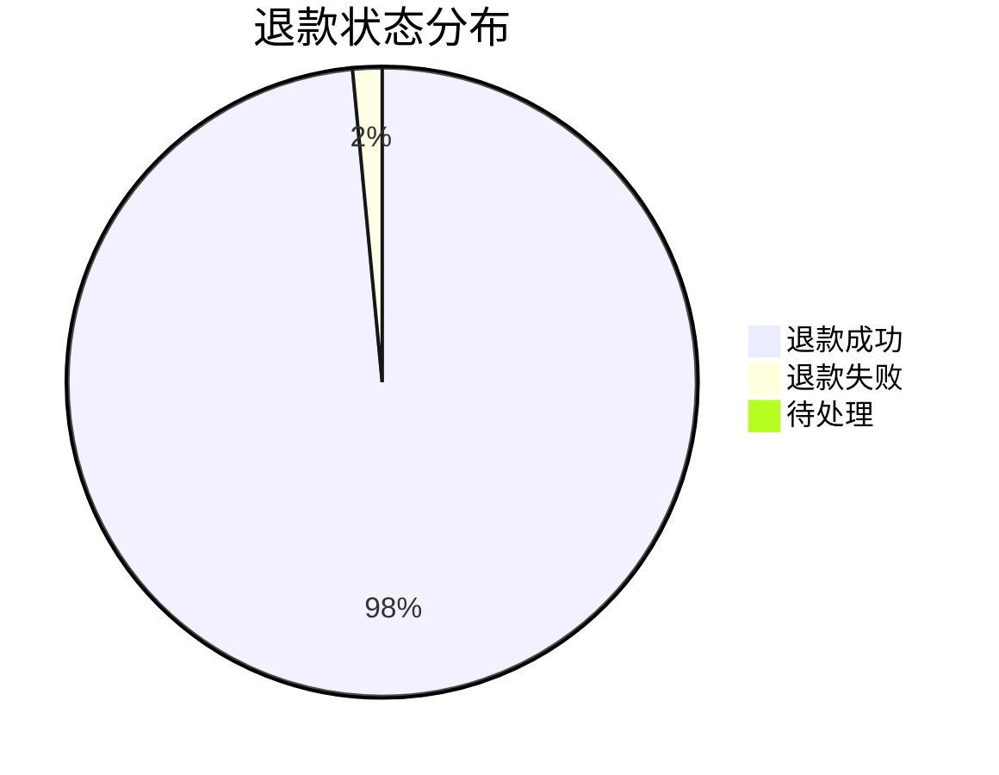

# EP06: 统计报表

## Epic 概述

| 字段 | 内容 |
|------|------|
| **Epic ID** | EP06 |
| **Epic 名称** | 统计报表 |
| **业务目标** | 管理员能够查看各维度的运营数据统计 |
| **涉及角色** | 管理员、超级管理员 |
| **优先级** | P1 |

---

## Story 6.1: 训练营统计

| 字段 | 内容 |
|------|------|
| **Story ID** | S6.1 |
| **角色** | 作为一名管理员 |
| **目标** | 我希望能够查看训练营的统计数据 |
| **价值** | 以便于了解训练营的运营情况 |
| **优先级** | P1 |

### 验收标准

```gherkin
Feature: 训练营统计
  作为一名管理员
  我希望能够查看训练营的统计数据
  以便于了解训练营的运营情况

  Scenario: 查看单个训练营统计
    Given 选择训练营 "21天早起打卡"
    When 查看统计页面
    Then 显示基础统计：
      | 指标 | 值 |
      | 报名人数 | 150 |
      | 完成人数 | 120 |
      | 完成率 | 80% |
      | 退款金额 | 11880 元 |

  Scenario: 查看打卡分布
    Given 进入打卡统计页面
    Then 显示打卡天数分布图
    And 显示每日打卡人数趋势

  Scenario: 查看退款分布
    Given 进入退款统计页面
    Then 显示退款状态分布（成功/失败/待处理）
    And 显示匹配置信度分布

  Scenario: 导出统计数据
    Given 查看训练营统计
    When 点击 "导出 Excel" 按钮
    Then 下载包含完整统计数据的 Excel 文件
```

### 任务拆分

- [ ] Task 6.1.1: 实现训练营统计接口
- [ ] Task 6.1.2: 实现统计图表组件
- [ ] Task 6.1.3: 实现 Excel 导出
- [ ] Task 6.1.4: 编写测试用例

---

## Story 6.2: 全局统计概览

| 字段 | 内容 |
|------|------|
| **Story ID** | S6.2 |
| **角色** | 作为一名超级管理员 |
| **目标** | 我希望能够查看全局统计概览 |
| **价值** | 以便于了解整体业务情况 |
| **优先级** | P1 |

### 验收标准

```gherkin
Feature: 全局统计概览
  作为一名超级管理员
  我希望能够查看全局统计概览
  以便于了解整体业务情况

  Scenario: 查看概览数据
    Given 进入统计概览页面
    Then 显示核心指标卡片：
      | 指标 | 描述 |
      | 训练营总数 | 所有训练营数量 |
      | 本月新增 | 本月新创建的训练营 |
      | 总报名人次 | 所有训练营报名总和 |
      | 总退款金额 | 累计退款金额 |

  Scenario: 查看趋势图
    Given 选择时间范围为 "最近30天"
    Then 显示每日报名人数趋势
    And 显示每日退款金额趋势

  Scenario: 按时间筛选
    Given 选择时间范围为 "2025年1月"
    When 刷新统计
    Then 只显示该时间范围内的数据

  Scenario: 对比多个训练营
    Given 选择多个训练营
    When 查看对比分析
    Then 显示各训练营的关键指标对比图
```

### 任务拆分

- [ ] Task 6.2.1: 实现全局统计接口
- [ ] Task 6.2.2: 实现时间筛选功能
- [ ] Task 6.2.3: 实现对比分析功能
- [ ] Task 6.2.4: 实现趋势图组件

---

## Story 6.3: 退款报表

| 字段 | 内容 |
|------|------|
| **Story ID** | S6.3 |
| **角色** | 作为一名管理员 |
| **目标** | 我希望能够查看和导出退款报表 |
| **价值** | 以便于财务核对和审计 |
| **优先级** | P1 |

### 验收标准

```gherkin
Feature: 退款报表
  作为一名管理员
  我希望能够查看和导出退款报表
  以便于财务核对和审计

  Scenario: 查看退款明细
    Given 选择训练营和时间范围
    When 查询退款明细
    Then 显示退款记录列表
    And 每条记录包含：会员昵称、订单号、退款金额、退款状态、退款时间

  Scenario: 查看退款汇总
    Given 选择时间范围
    When 查看汇总统计
    Then 显示：
      | 指标 | 值 |
      | 退款总笔数 | 100 |
      | 退款总金额 | 9900 元 |
      | 成功笔数 | 98 |
      | 失败笔数 | 2 |

  Scenario: 导出退款报表
    Given 设置导出条件
    When 点击 "导出" 按钮
    Then 生成 Excel 报表
    And 包含完整的退款明细
    And 包含汇总统计

  Scenario: 按状态筛选
    Given 选择状态为 "退款失败"
    When 查询
    Then 只显示失败的退款记录
```

### 任务拆分

- [ ] Task 6.3.1: 实现退款报表接口
- [ ] Task 6.3.2: 实现明细和汇总查询
- [ ] Task 6.3.3: 实现报表导出功能
- [ ] Task 6.3.4: 实现报表页面

---

## 接口设计

### 训练营统计

```
GET /api/admin/stats/camps/{campId}

Response:
{
  "code": 200,
  "data": {
    "basic": {
      "enrollCount": 150,
      "completeCount": 120,
      "completeRate": 0.8,
      "refundAmount": 11880
    },
    "checkinDistribution": [
      {"days": 21, "count": 50},
      {"days": 20, "count": 30},
      // ...
    ],
    "dailyCheckin": [
      {"date": "2025-01-01", "count": 145},
      {"date": "2025-01-02", "count": 142},
      // ...
    ]
  }
}
```

### 全局概览

```
GET /api/admin/stats/overview

Query: ?startDate=2025-01-01&endDate=2025-01-31

Response:
{
  "code": 200,
  "data": {
    "summary": {
      "totalCamps": 20,
      "monthlyNewCamps": 5,
      "totalEnrollments": 3000,
      "totalRefundAmount": 150000
    },
    "trends": {
      "dailyEnrollments": [...],
      "dailyRefunds": [...]
    }
  }
}
```

### 退款报表

```
GET /api/admin/stats/refunds

Query: ?campId=1&startDate=2025-01-01&endDate=2025-01-31&status=SUCCESS

Response:
{
  "code": 200,
  "data": {
    "summary": {
      "totalCount": 100,
      "totalAmount": 9900,
      "successCount": 98,
      "failedCount": 2
    },
    "list": [
      {
        "id": 1,
        "memberNickname": "小明",
        "orderId": "ORDER123",
        "amount": 99,
        "status": "SUCCESS",
        "refundTime": "2025-01-15T10:30:00"
      }
      // ...
    ],
    "pagination": {
      "page": 1,
      "pageSize": 20,
      "total": 100
    }
  }
}
```

### 导出报表

```
POST /api/admin/stats/export

Request:
{
  "type": "refund",  // camp | refund | overview
  "campId": 1,
  "startDate": "2025-01-01",
  "endDate": "2025-01-31",
  "format": "xlsx"  // xlsx | csv
}

Response:
{
  "code": 200,
  "data": {
    "downloadUrl": "https://xxx/reports/refund_20250115.xlsx",
    "expiresAt": "2025-01-15T12:00:00"
  }
}
```

---

## 图表设计

### 训练营完成率趋势图

```mermaid
xychart-beta
    title "训练营完成率趋势"
    x-axis [第1期, 第2期, 第3期, 第4期, 第5期]
    y-axis "完成率 (%)" 0 --> 100
    line [75, 78, 80, 82, 85]
```

### 退款状态分布



### 打卡天数分布

```mermaid
xychart-beta
    title "打卡天数分布"
    x-axis [0-5天, 6-10天, 11-15天, 16-20天, 21天]
    y-axis "人数" 0 --> 60
    bar [10, 20, 30, 40, 50]
```

---

## 相关文档

- [技术方案 v1](../技术方案.md)
- [EP05: 退款审核](./EP05-退款审核.md)
- [EP01: 训练营管理](./EP01-训练营管理.md)
