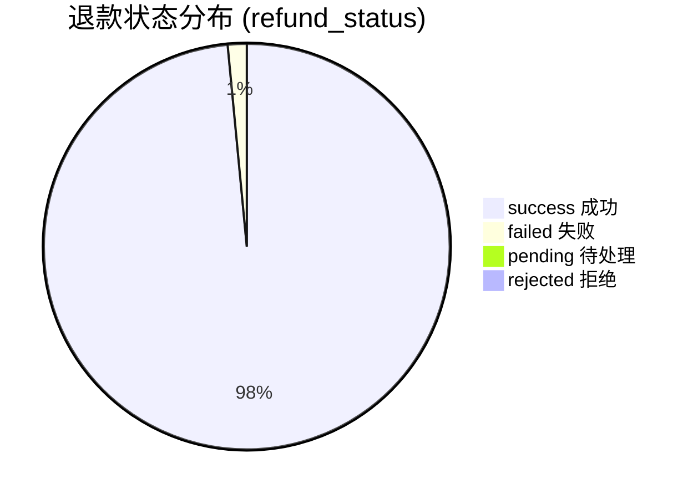
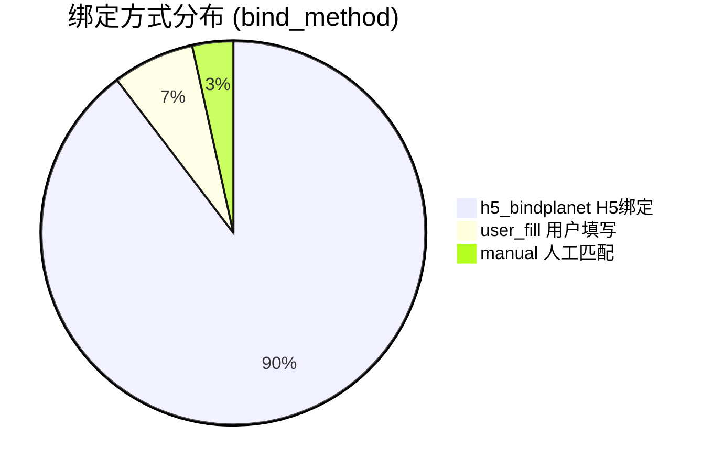

# EP06: 统计报表

> **文档版本**: v2.0
> **最后更新**: 2025-12-06
> **SSOT引用**: [状态枚举定义.md](../design/状态枚举定义.md)

## Epic 概述

| 字段 | 内容 |
|------|------|
| **Epic ID** | EP06 |
| **Epic 名称** | 统计报表 |
| **业务目标** | 管理员能够查看各维度的运营数据统计，支持决策和财务核对 |
| **涉及角色** | 管理员、超级管理员 |
| **优先级** | P1 |

### 核心统计维度

| 维度 | 说明 | 关联状态 |
|------|------|---------|
| 训练营统计 | 报名、完成率、退款情况 | camp_status |
| 会员统计 | 绑定状态、打卡合格状态 | bind_status, checkin_status |
| 退款统计 | 各状态退款数量和金额 | refund_status |
| 财务报表 | 收入、支出、净额 | pay_status, refund_status |

---

## Story 6.1: 训练营统计

| 字段 | 内容 |
|------|------|
| **Story ID** | S6.1 |
| **角色** | 作为管理员 |
| **目标** | 我希望能够查看训练营的统计数据 |
| **价值** | 以便于了解训练营的运营情况 |
| **优先级** | P1 |

### 验收标准

```gherkin
Feature: 训练营统计
  作为管理员
  我希望能够查看训练营的统计数据
  以便于了解训练营的运营情况

  Background:
    Given 管理员已登录

  Scenario: 查看单个训练营统计
    Given 选择训练营 "21天早起打卡"
    When 查看统计页面
    Then 显示基础统计：
      | 指标 | 说明 |
      | 报名人数 | pay_status = SUCCESS 的数量 |
      | 已绑定人数 | bind_status = completed 的数量 |
      | 待绑定人数 | bind_status = pending 的数量 |
      | 打卡合格人数 | checkin_status = qualified 的数量 |
      | 完成率 | qualified / 总报名人数 |
      | 已退款金额 | refund_status = SUCCESS 的总金额 |

  Scenario: 查看会员绑定分布
    Given 进入会员统计页面
    Then 显示绑定状态分布：
      | 状态 | 说明 |
      | completed | 已完成绑定 |
      | pending | 待绑定 |
      | expired | 已过期 |
      | manual_review | 待人工审核 |
      | closed | 已关闭 |
    And 显示绑定方式分布（bind_method）：
      | 方式 | 说明 |
      | h5_bindplanet | H5主路径绑定 |
      | user_fill | 用户填写 |
      | manual | 人工匹配 |

  Scenario: 查看打卡统计
    Given 进入打卡统计页面
    Then 显示打卡天数分布图
    And 显示每日打卡人数趋势
    And 显示打卡合格状态分布：
      | checkin_status | 数量 |
      | qualified | 打卡合格人数 |
      | unqualified | 打卡不合格人数 |
      | pending | 统计中 |

  Scenario: 查看退款分布
    Given 进入退款统计页面
    Then 显示退款状态分布（refund_status）：
      | 状态 | 说明 |
      | pending | 待处理 |
      | approved | 审核通过 |
      | rejected | 审核拒绝 |
      | processing | 处理中 |
      | success | 退款成功 |
      | failed | 退款失败 |

  Scenario: 导出统计数据
    Given 查看训练营统计
    When 点击 "导出 Excel" 按钮
    Then 下载包含完整统计数据的 Excel 文件
    And 包含会员明细、打卡记录、退款记录
```

### 任务拆分

- [ ] Task 6.1.1: 实现训练营统计接口
- [ ] Task 6.1.2: 实现统计图表组件（ECharts）
- [ ] Task 6.1.3: 实现 Excel 导出（Apache POI）
- [ ] Task 6.1.4: 编写单元测试

---

## Story 6.2: 全局统计概览

| 字段 | 内容 |
|------|------|
| **Story ID** | S6.2 |
| **角色** | 作为超级管理员 |
| **目标** | 我希望能够查看全局统计概览 |
| **价值** | 以便于了解整体业务情况 |
| **优先级** | P1 |

### 验收标准

```gherkin
Feature: 全局统计概览
  作为超级管理员
  我希望能够查看全局统计概览
  以便于了解整体业务情况

  Background:
    Given 超级管理员已登录

  Scenario: 查看概览数据
    Given 进入统计概览页面
    Then 显示核心指标卡片：
      | 指标 | 描述 |
      | 训练营总数 | 所有训练营数量（按 camp_status 分组） |
      | 本月新增 | 本月 camp_status 变为 enrolling 的数量 |
      | 总报名人次 | 所有 pay_status = success 的数量 |
      | 总退款金额 | 所有 refund_status = success 的金额 |
      | 绑定成功率 | bind_status = completed / 总支付数 |

  Scenario: 查看训练营状态分布
    Given 进入概览页面
    Then 显示训练营状态分布（camp_status）：
      | 状态 | 数量 |
      | draft | 草稿 |
      | pending | 待发布 |
      | enrolling | 报名中 |
      | ongoing | 进行中 |
      | ended | 已结束 |
      | settling | 结算中 |
      | archived | 已归档 |

  Scenario: 查看趋势图
    Given 选择时间范围为 "最近30天"
    Then 显示每日报名人数趋势
    And 显示每日退款金额趋势
    And 显示每日绑定完成数趋势

  Scenario: 按时间筛选
    Given 选择时间范围为 "2025年1月"
    When 刷新统计
    Then 只显示该时间范围内的数据

  Scenario: 对比多个训练营
    Given 选择多个训练营（最多5个）
    When 查看对比分析
    Then 显示各训练营的关键指标对比图：
      | 指标 | 对比 |
      | 报名人数 | 柱状图 |
      | 完成率 | 柱状图 |
      | 退款率 | 柱状图 |
      | 绑定方式分布 | 堆叠柱状图 |
```

### 任务拆分

- [ ] Task 6.2.1: 实现全局统计接口
- [ ] Task 6.2.2: 实现时间筛选功能
- [ ] Task 6.2.3: 实现对比分析功能
- [ ] Task 6.2.4: 实现趋势图组件

---

## Story 6.3: 退款报表

| 字段 | 内容 |
|------|------|
| **Story ID** | S6.3 |
| **角色** | 作为管理员 |
| **目标** | 我希望能够查看和导出退款报表 |
| **价值** | 以便于财务核对和审计 |
| **优先级** | P1 |

### 验收标准

```gherkin
Feature: 退款报表
  作为管理员
  我希望能够查看和导出退款报表
  以便于财务核对和审计

  Background:
    Given 管理员已登录

  Scenario: 查看退款明细
    Given 选择训练营和时间范围
    When 查询退款明细
    Then 显示退款记录列表
    And 每条记录包含：
      | 字段 | 说明 |
      | 会员昵称 | wechat_nickname / planet_nickname |
      | 订单号 | order_no |
      | 退款金额 | refund_amount |
      | 退款状态 | refund_status（使用 SSOT 枚举值） |
      | 绑定方式 | bind_method |
      | 退款时间 | refunded_at |
      | 微信退款单号 | wechat_refund_id |

  Scenario: 查看退款汇总
    Given 选择时间范围
    When 查看汇总统计
    Then 显示按 refund_status 分组的统计：
      | refund_status | 笔数 | 金额 |
      | pending | 待处理数 | - |
      | approved | 待执行数 | 待执行金额 |
      | processing | 处理中数 | 处理中金额 |
      | success | 成功数 | 成功金额 |
      | rejected | 拒绝数 | - |
      | failed | 失败数 | 失败金额 |

  Scenario: 导出退款报表
    Given 设置导出条件（训练营、时间、状态）
    When 点击 "导出" 按钮
    Then 生成 Excel 报表
    And 包含完整的退款明细
    And 包含汇总统计
    And 文件名格式：退款报表_训练营名称_日期范围.xlsx

  Scenario: 按状态筛选
    Given 选择 refund_status = "failed"
    When 查询
    Then 只显示退款失败的记录
    And 显示失败原因（fail_reason）
    And 显示重试次数（retry_count）
```

### 任务拆分

- [ ] Task 6.3.1: 实现退款报表查询接口
- [ ] Task 6.3.2: 实现明细和汇总查询
- [ ] Task 6.3.3: 实现报表导出功能
- [ ] Task 6.3.4: 实现报表页面

---

## Story 6.4: 结算报告

| 字段 | 内容 |
|------|------|
| **Story ID** | S6.4 |
| **角色** | 作为管理员 |
| **目标** | 我希望在训练营归档后生成完整的结算报告 |
| **价值** | 以便于留存财务记录和复盘分析 |
| **优先级** | P2 |

### 验收标准

```gherkin
Feature: 结算报告
  作为管理员
  我希望在训练营归档后生成完整的结算报告
  以便于留存财务记录和复盘分析

  Background:
    Given 管理员已登录
    And 训练营状态为 "archived"

  Scenario: 生成结算报告
    Given 选择已归档的训练营
    When 点击 "生成结算报告" 按钮
    Then 生成包含以下内容的 PDF 报告：
      | 章节 | 内容 |
      | 训练营概况 | 名称、周期、押金金额、要求天数 |
      | 报名统计 | 总报名数、总收入 |
      | 绑定统计 | 各 bind_status 数量、各 bind_method 数量 |
      | 打卡统计 | 合格数、不合格数、合格率 |
      | 退款统计 | 各 refund_status 数量和金额 |
      | 财务汇总 | 总收入、总退款、净收入 |

  Scenario: 查看历史结算报告
    Given 进入结算报告列表页面
    When 选择某个已归档训练营
    Then 显示该训练营的结算报告
    And 支持下载 PDF

  Scenario: 结算报告自动生成
    Given 训练营从 settling 变为 archived
    Then 系统自动生成结算报告
    And 发送通知给管理员
```

### 任务拆分

- [ ] Task 6.4.1: 实现结算报告数据聚合接口
- [ ] Task 6.4.2: 实现 PDF 报告生成（iText/Flying Saucer）
- [ ] Task 6.4.3: 实现报告存储（COS）
- [ ] Task 6.4.4: 实现归档时自动生成报告
- [ ] Task 6.4.5: 编写单元测试

---

## 技术实现细节

### 接口设计

#### 训练营统计

```
GET /api/admin/stats/camps/{campId}

Response:
{
  "code": 200,
  "data": {
    "basic": {
      "enrollCount": 150,
      "boundCount": 145,
      "pendingBindCount": 5,
      "qualifiedCount": 120,
      "completeRate": 0.8,
      "refundedAmount": 11880.00
    },
    "bindStatusDistribution": [
      {"status": "completed", "count": 145},
      {"status": "pending", "count": 3},
      {"status": "manual_review", "count": 2}
    ],
    "bindMethodDistribution": [
      {"method": "h5_bindplanet", "count": 130},
      {"method": "user_fill", "count": 10},
      {"method": "manual", "count": 5}
    ],
    "checkinStatusDistribution": [
      {"status": "qualified", "count": 120},
      {"status": "unqualified", "count": 25},
      {"status": "pending", "count": 0}
    ],
    "checkinDistribution": [
      {"days": 21, "count": 50},
      {"days": 20, "count": 30}
    ],
    "dailyCheckin": [
      {"date": "2025-01-01", "count": 145},
      {"date": "2025-01-02", "count": 142}
    ]
  }
}
```

#### 全局概览

```
GET /api/admin/stats/overview

Query: ?startDate=2025-01-01&endDate=2025-01-31

Response:
{
  "code": 200,
  "data": {
    "summary": {
      "totalCamps": 20,
      "monthlyNewCamps": 5,
      "totalEnrollments": 3000,
      "totalRefundAmount": 150000.00,
      "bindSuccessRate": 0.96
    },
    "campStatusDistribution": [
      {"status": "archived", "count": 10},
      {"status": "ongoing", "count": 5},
      {"status": "enrolling", "count": 3},
      {"status": "settling", "count": 2}
    ],
    "trends": {
      "dailyEnrollments": [
        {"date": "2025-01-01", "count": 50}
      ],
      "dailyRefunds": [
        {"date": "2025-01-01", "amount": 4950.00}
      ],
      "dailyBindings": [
        {"date": "2025-01-01", "count": 48}
      ]
    }
  }
}
```

#### 退款报表

```
GET /api/admin/stats/refunds

Query: ?campId=1&startDate=2025-01-01&endDate=2025-01-31&refundStatus=SUCCESS

Response:
{
  "code": 200,
  "data": {
    "summary": {
      "byStatus": [
        {"status": "PENDING", "count": 5, "amount": 495.00},
        {"status": "APPROVED", "count": 3, "amount": 297.00},
        {"status": "PROCESSING", "count": 1, "amount": 99.00},
        {"status": "SUCCESS", "count": 98, "amount": 9702.00},
        {"status": "REJECTED", "count": 2, "amount": 0},
        {"status": "FAILED", "count": 1, "amount": 99.00}
      ],
      "totalCount": 110,
      "totalSuccessAmount": 9702.00
    },
    "list": [
      {
        "id": 1,
        "wechatNickname": "小明",
        "planetNickname": "小明同学",
        "orderNo": "ORD20250101001",
        "refundAmount": 99.00,
        "refundStatus": "SUCCESS",
        "bindMethod": "h5_bindplanet",
        "refundedAt": "2025-01-15T10:30:00",
        "wechatRefundId": "WX50000123"
      }
    ],
    "pagination": {
      "page": 1,
      "pageSize": 20,
      "total": 98
    }
  }
}
```

#### 导出报表

```
POST /api/admin/stats/export

Request:
{
  "type": "refund",           // camp | refund | settlement
  "campId": 1,
  "startDate": "2025-01-01",
  "endDate": "2025-01-31",
  "format": "xlsx"            // xlsx | csv | pdf
}

Response:
{
  "code": 200,
  "data": {
    "downloadUrl": "https://cdn.example.com/reports/refund_camp1_202501.xlsx",
    "fileName": "退款报表_21天早起打卡_2025-01.xlsx",
    "expiresAt": "2025-01-15T12:00:00"
  }
}
```

#### 结算报告

```
GET /api/admin/camps/{campId}/settlement-report

Response:
{
  "code": 200,
  "data": {
    "campInfo": {
      "name": "21天早起打卡",
      "startDate": "2025-01-01",
      "endDate": "2025-01-21",
      "depositAmount": 99.00,
      "requiredDays": 21,
      "graceDays": 2
    },
    "enrollmentStats": {
      "totalEnrollments": 150,
      "totalRevenue": 14850.00
    },
    "bindStats": {
      "byStatus": {...},
      "byMethod": {...}
    },
    "checkinStats": {
      "qualifiedCount": 120,
      "unqualifiedCount": 30,
      "qualifiedRate": 0.8
    },
    "refundStats": {
      "byStatus": {...},
      "totalRefunded": 11880.00
    },
    "financialSummary": {
      "totalRevenue": 14850.00,
      "totalRefunded": 11880.00,
      "netRevenue": 2970.00
    },
    "reportUrl": "https://cdn.example.com/reports/settlement_camp1.pdf",
    "generatedAt": "2025-01-22T00:00:00"
  }
}
```

---

## 图表设计

### 训练营完成率趋势图

```mermaid
xychart-beta
    title "训练营完成率趋势"
    x-axis [第1期, 第2期, 第3期, 第4期, 第5期]
    y-axis "完成率 (%)" 0 --> 100
    line [75, 78, 80, 82, 85]
```

### 退款状态分布



### 绑定方式分布



### 打卡天数分布

```mermaid
xychart-beta
    title "打卡天数分布"
    x-axis [0-5天, 6-10天, 11-15天, 16-20天, 21天]
    y-axis "人数" 0 --> 60
    bar [10, 20, 30, 40, 50]
```

---

## 相关文档

- [状态枚举定义](../design/状态枚举定义.md) - **SSOT**: 所有状态枚举定义
- [技术方案](../design/技术方案.md) - 系统架构设计
- [数据库设计](../design/数据库设计.md) - 统计查询相关表结构
- [EP01: 训练营管理](./EP01-训练营管理.md) - camp_status 状态
- [EP03: 打卡数据同步](./EP03-打卡数据同步.md) - checkin_status 状态
- [EP04: 身份匹配](./EP04-身份匹配.md) - bind_status, bind_method
- [EP05: 退款审核](./EP05-退款审核.md) - refund_status 状态

---

## 决策记录

### 决策1: 移除置信度统计维度

**背景**：原设计包含"匹配置信度分布"统计。

**决策**：移除置信度相关统计，改为按 `bind_method` 统计绑定方式分布。

**原因**：
1. 智能匹配方案已废弃，所有绑定方式置信度均为 100%
2. 按 bind_method 统计更有业务意义（了解用户绑定路径偏好）
3. 与 EP04、EP05 的设计保持一致

### 决策2: 新增结算报告功能

**背景**：训练营归档后需要完整的财务和运营记录。

**决策**：增加 Story 6.4 结算报告生成功能。

**原因**：
1. 与 EP05 S5.6 "完成结算与归档"配合
2. 满足财务审计需求
3. 支持运营复盘分析

---

**变更历史**：
| 版本 | 日期 | 变更内容 |
|------|------|---------|
| v2.0 | 2025-12-06 | 移除置信度统计，改为 bind_method 分布 |
| v2.0 | 2025-12-06 | 统一退款状态术语与 SSOT 一致 |
| v2.0 | 2025-12-06 | 新增 Story 6.4 结算报告 |
| v2.0 | 2025-12-06 | 添加 checkin_status 统计维度 |
| v2.0 | 2025-12-06 | 修复相关文档链接路径，添加 SSOT 引用 |
| v1.0 | 2025-11-xx | 初始版本 |
