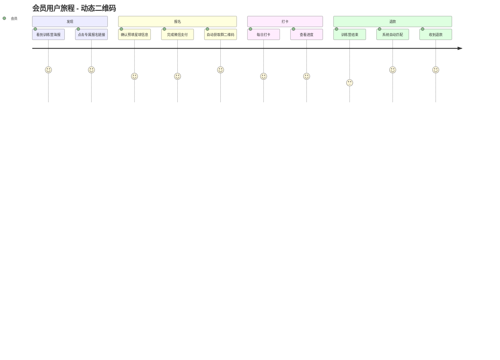
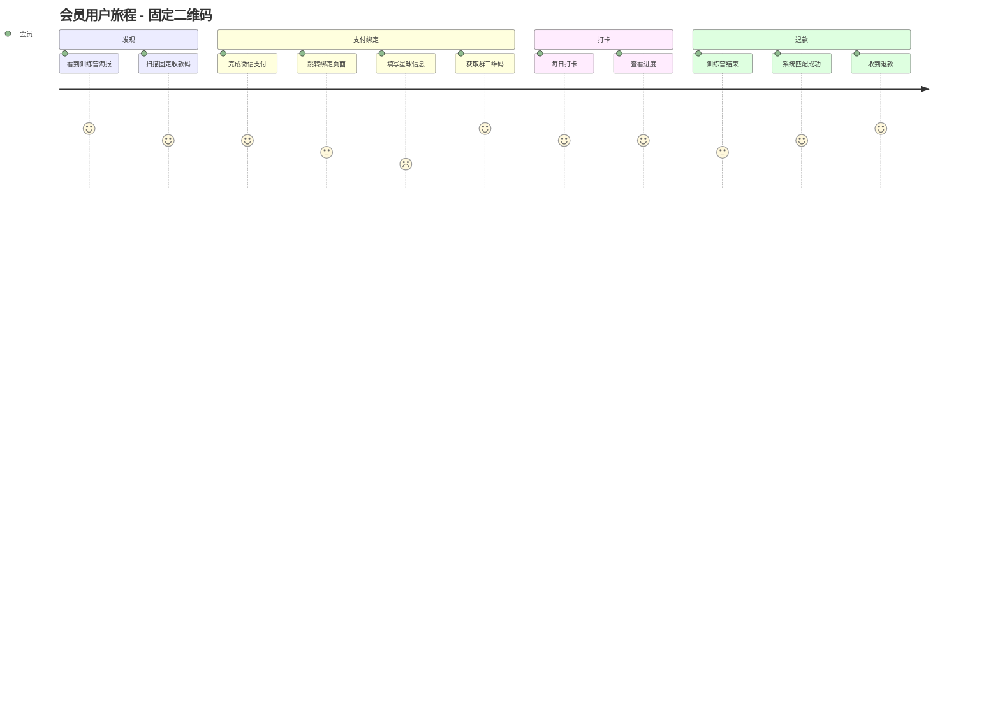
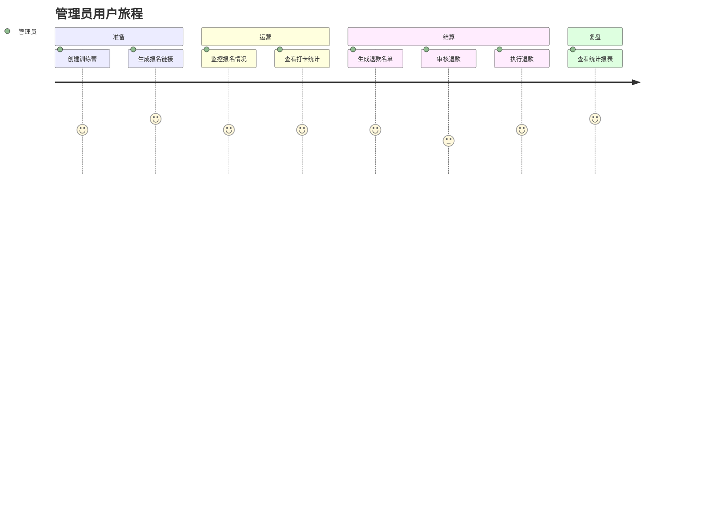
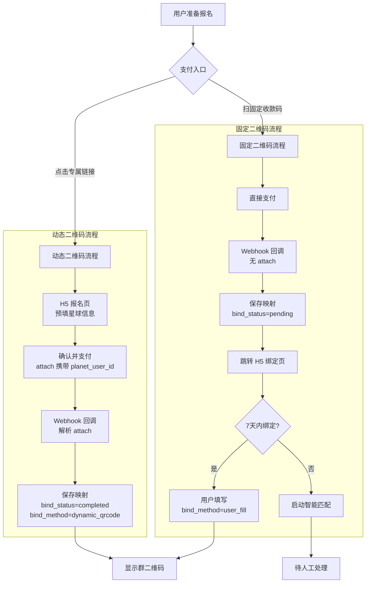
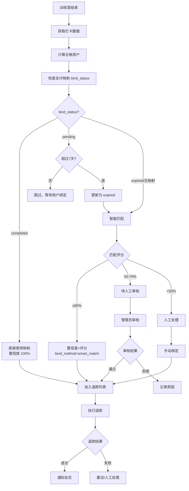
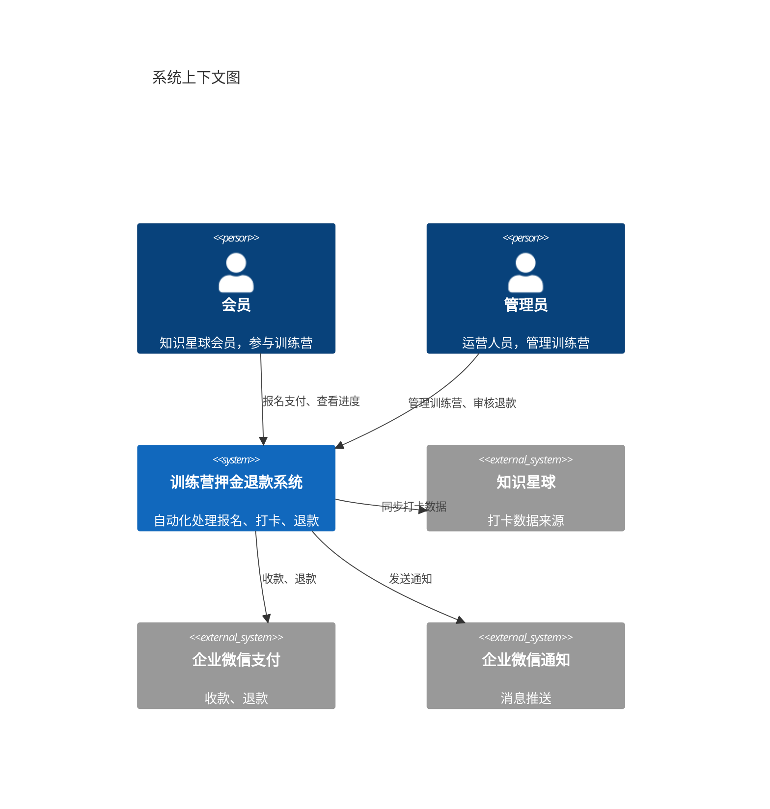
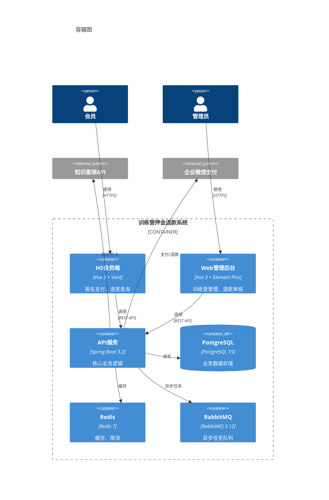
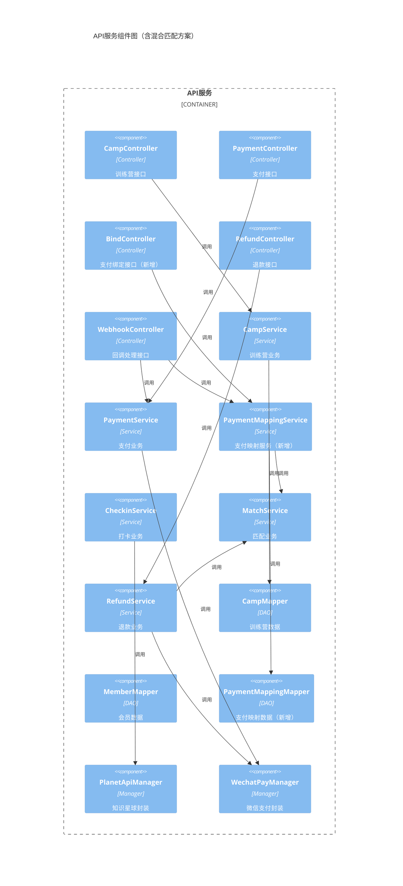
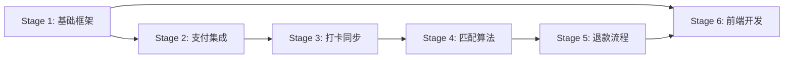

# 知识星球训练营自动押金退款系统 - 技术方案 v1

| **版本** | v1 |
| -------- | ---- |
| **作者** | 系统架构师 |
| **日期** | 2025-12-01 |

**修订记录**

| 版本 | 修订内容 | 日期 | 编制人 |
|------|----------|------|--------|
| v0.1 | 初版（基于传统模板） | 2025-10-24 | - |
| v0.2 | 重构为 AI 协作版，增加用户旅程、故事卡片、C4 架构 | 2025-11-29 | - |
| v0.3 | 增加混合匹配方案（动态二维码 + 支付后绑定），更新支付映射状态机 | 2025-12-01 | - |
| v1.0 | 合并 v1 和 v1.1 文档，统一为 v1 版本 | 2025-12-01 | - |

---

## 目录

1. [执行摘要](#一执行摘要)
2. [用户故事与验收标准](#二用户故事与验收标准)
3. [用户旅程与操作流程](#三用户旅程与操作流程)
4. [业务流程设计](#四业务流程设计)
5. [架构设计](#五架构设计)
6. [AI 执行上下文](#六ai-执行上下文)
7. [分阶段验证计划](#七分阶段验证计划)
8. [测试规格](#八测试规格)
9. [可观测性与运维](#九可观测性与运维)
10. [文档演进历史](#十文档演进历史)

---

# 一、执行摘要

## 1.1 问题陈述

目前知识星球训练营的押金收取、打卡核对、退款操作全部手动完成，效率低且容易出错。每月有 5-10 个训练营同时进行，单个训练营最多 1000 人参与，人工处理工作量巨大。

## 1.2 解决方案

构建一套自动化系统，实现：
- **自动化支付流程**：会员支付押金后立即获得入群二维码
- **自动化数据同步**：每日自动同步知识星球打卡数据
- **混合匹配识别**：动态二维码（80%用户，100%准确）+ 支付后填写（15%用户，95%准确）+ 智能匹配（5%用户，70%准确）
- **半自动退款**：系统判断 + 人工审核 + 自动退款

### 支付-身份匹配方案

采用 **动态二维码 + 支付后信息填写** 混合方案：

| 支付方式 | 覆盖率 | 准确率 | 实现方式 |
|----------|--------|--------|----------|
| 动态二维码 | 80% | 100% | 支付时 attach 携带 planet_user_id |
| 支付后填写 | 15% | 95% | 用户支付后 H5 页面填写星球信息 |
| 智能匹配 | 4% | 70% | Levenshtein 算法匹配昵称 |
| 人工处理 | 1% | 100% | 管理员手动绑定 |

## 1.3 预期成果

| 指标 | 当前值 | 目标值 | 验证方式 |
|------|--------|--------|----------|
| 人工操作时间 | 100% | < 10% | 操作日志统计 |
| 退款准确率 | 95% | 100% | 退款结果审计 |
| 支付到进群时间 | 人工处理 | < 3 秒 | 接口响应监控 |
| 单营处理时间 | 2-4 小时 | < 10 分钟 | 计时测试 |

## 1.4 非目标（Scope Out）

- ❌ 本次不包含：会员端 App 开发（仅 H5）
- ❌ 暂不支持：多知识星球管理
- ❌ 后续版本再考虑：积分激励体系、数据预测分析

---

# 二、用户故事与验收标准

> 详细用户故事卡片见 [user-stories/](./user-stories/) 目录

## 2.1 用户角色定义

| 角色 | 描述 | 主要目标 |
|------|------|----------|
| **超级管理员** | 星主本人 | 系统配置、全局管理 |
| **管理员** | 运营人员 | 审核退款、查看报表 |
| **教练** | 项目教练 | 查看负责项目、催促打卡 |
| **志愿者** | 项目志愿者 | 查看项目、催促打卡 |
| **会员** | 知识星球会员 | 支付押金、打卡、获取退款 |

## 2.2 Epic 与 Story 概览

| Epic | 描述 | Stories 数量 |
|------|------|-------------|
| [EP01](./user-stories/EP01-训练营管理.md) | 训练营管理 | 6 |
| [EP02](./user-stories/EP02-会员报名支付.md) | 会员报名支付 | 4 |
| [EP03](./user-stories/EP03-打卡数据同步.md) | 打卡数据同步 | 3 |
| [EP04](./user-stories/EP04-身份匹配.md) | 身份匹配 | 4 |
| [EP05](./user-stories/EP05-退款审核.md) | 退款审核 | 5 |
| [EP06](./user-stories/EP06-统计报表.md) | 统计报表 | 3 |

## 2.3 核心验收标准汇总

| Story ID | 功能点 | 验收标准 | 优先级 |
|----------|--------|----------|--------|
| S1.1 | 创建训练营 | 填写表单后成功创建，生成报名链接 | P0 |
| S2.1 | 支付押金 | 企业微信支付成功后显示群二维码 | P0 |
| S2.2 | 支付回调 | Webhook 3 秒内处理完成，保存支付映射（含 bind_status） | P0 |
| S2.3 | 支付后绑定 | 固定二维码用户可通过 H5 页面绑定星球信息 | P0 |
| S3.1 | 打卡同步 | 每日 01:00 自动同步，失败告警 | P0 |
| S4.1 | 混合匹配 | 动态二维码 100%，用户填写 95%，智能匹配 ≥ 70% | P0 |
| S5.1 | 审核退款 | 管理员可批量审核通过/拒绝 | P0 |
| S5.2 | 执行退款 | 调用微信退款 API 成功率 ≥ 99% | P0 |

---

# 三、用户旅程与操作流程

> 详细图表见 [diagrams/用户旅程图.md](./diagrams/用户旅程图.md)

## 3.1 会员端用户旅程

### 动态二维码路径（80% 用户，推荐）



### 固定二维码路径（15% 用户）



**旅程详情**：

| 阶段 | 动态二维码路径 | 固定二维码路径 | 情绪差异 |
|------|--------------|--------------|---------|
| 发现 | 点击链接（含用户ID） | 扫固定码 | 😊 同 |
| 报名 | 确认信息即可 | 支付后需填写 | 😊 vs 😐 |
| 支付 | 一步完成 | 支付+绑定两步 | 😊 vs 😟 |
| 进群 | 自动显示 | 绑定后显示 | 😊 同 |
| 退款 | 100% 自动匹配 | 95% 准确匹配 | 😊 vs 🙂 |

## 3.2 管理员用户旅程



## 3.3 核心操作流程

### 会员报名支付流程（动态二维码 - 推荐）

1. 点击知识星球内的专属报名链接（含 planet_user_id）
2. 进入 H5 报名页，确认预填的星球信息
3. 点击"支付押金"，跳转企业微信支付
4. 支付成功，系统自动解析 attach 建立映射
5. H5 显示群二维码，长按扫码进群

### 会员报名支付流程（固定二维码）

1. 扫描固定收款码，完成支付
2. 支付成功后跳转 H5 绑定页面
3. 填写星球 ID 和星球昵称
4. 提交绑定，系统保存映射关系
5. 显示群二维码，扫码进群
6. 若 7 天内未绑定，系统启动智能匹配

### 管理员退款审核流程

1. 登录管理后台
2. 选择已结束的训练营
3. 点击"生成退款名单"
4. 查看匹配结果，处理待审核项
5. 批量审核通过/拒绝
6. 系统自动执行退款
7. 查看退款结果，处理失败项

---

# 四、业务流程设计

> 详细图表见 [diagrams/业务流程图.md](./diagrams/业务流程图.md) 和 [diagrams/时序图.md](./diagrams/时序图.md)

## 4.1 核心业务流程

### 报名支付流程（混合方案）



### 退款审核流程（混合匹配）



## 4.2 系统交互时序图

> 详见 [diagrams/时序图.md](./diagrams/时序图.md)

## 4.3 状态机设计

> 详见 [diagrams/状态机.md](./diagrams/状态机.md)

### 训练营状态

```
[创建] -> 未开始 -> 进行中 -> 已结束
```

### 支付映射绑定状态（新增）

```
[支付回调] --> 待绑定(pending) --> 已绑定(completed)
                    |                    ↑
                    v                    |
               已过期(expired) --> 智能匹配成功
                    |
                    v
              人工处理中(manual_required) --> 已绑定/已关闭
```

| 状态 | 编码 | bind_method | 描述 |
|------|------|-------------|------|
| 已绑定 | `COMPLETED` | `dynamic_qrcode` | 动态二维码自动绑定 |
| 已绑定 | `COMPLETED` | `user_fill` | 用户填写绑定 |
| 已绑定 | `COMPLETED` | `smart_match` | 智能匹配绑定 |
| 已绑定 | `COMPLETED` | `manual` | 人工绑定 |
| 待绑定 | `PENDING` | - | 等待用户填写 |
| 已过期 | `EXPIRED` | - | 超过 7 天未绑定 |
| 人工处理 | `MANUAL_REQUIRED` | - | 智能匹配失败 |
| 已关闭 | `CLOSED` | - | 无法匹配 |

### 支付状态

```
[创建订单] -> 待支付 -> 已支付 -> 已退款
                    ↘ 支付失败
```

### 退款状态

```
[生成] -> 待审核 -> 审核通过 -> 退款中 -> 退款成功
                ↘ 审核拒绝         ↘ 退款失败
```

---

# 五、架构设计

> 详细图表见 [diagrams/架构设计图.md](./diagrams/架构设计图.md)

## 5.1 Level 1: 系统上下文



## 5.2 Level 2: 容器图



## 5.3 Level 3: 组件图



## 5.4 技术选型与决策

### ADR-001: 数据库选型

**背景**：需要选择适合的关系型数据库

**考虑的方案**：

| 方案 | 优点 | 缺点 |
|------|------|------|
| MySQL | 生态成熟、运维熟悉 | JSON 支持弱 |
| PostgreSQL | JSON 支持强、功能丰富 | 运维经验相对少 |

**决策**：选择 PostgreSQL 15+

**理由**：
- 强大的 JSONB 支持，适合存储 API 响应
- 完善的事务和并发控制
- 云服务商支持完善

### ADR-002: 消息队列选型

**决策**：选择 RabbitMQ

**理由**：
- 稳定可靠，适合事务性消息
- Spring Boot 集成良好
- 运维复杂度适中

---

# 六、AI 执行上下文

## 6.1 项目入口与参考文件

| 类型 | 路径 | 说明 |
|------|------|------|
| 项目入口 | `src/main/java/.../CampApplication.java` | Spring Boot 启动类 |
| 配置文件 | `src/main/resources/application.yml` | 主配置 |
| Controller 示例 | `src/.../controller/CampController.java` | 接口风格参考 |
| Service 示例 | `src/.../service/impl/CampServiceImpl.java` | 业务逻辑参考 |
| Mapper 示例 | `src/.../mapper/CampMapper.java` | 数据访问参考 |
| 测试示例 | `src/test/.../CampServiceTest.java` | 测试风格参考 |

## 6.2 代码约束与禁止事项

### 必须遵守

- [x] Controller 只做参数校验和响应封装，业务逻辑放 Service
- [x] 使用统一响应格式 `Result<T>`
- [x] 异常使用 `BusinessException`，由全局处理器捕获
- [x] 敏感配置使用环境变量，不硬编码
- [x] 新增接口必须有单元测试

### 禁止事项

- ❌ 不要在 Controller 写业务逻辑
- ❌ 不要使用 `System.out.println`，用 Slf4j Logger
- ❌ 不要硬编码配置值
- ❌ 不要忽略异常
- ❌ 不要引入未经评审的依赖
- ❌ 不要提交敏感信息到代码库

## 6.3 验证命令

```bash
# 编译
./gradlew compileJava

# 单元测试
./gradlew test

# 集成测试
./gradlew integrationTest

# 代码风格检查
./gradlew spotlessCheck

# 完整检查
./gradlew check

# 启动服务
./gradlew bootRun

# 构建
./gradlew bootJar
```

## 6.4 依赖与环境

**必需环境**：

| 依赖 | 版本 | 用途 |
|------|------|------|
| Java | 17+ | 运行时 |
| PostgreSQL | 15+ | 主数据库 |
| Redis | 7.x | 缓存、限流 |
| RabbitMQ | 3.12+ | 消息队列 |

**环境变量**：

```bash
# 数据库
DATABASE_URL=jdbc:postgresql://localhost:5432/camp_db
DATABASE_USERNAME=camp_user
DATABASE_PASSWORD=***

# Redis
REDIS_HOST=localhost
REDIS_PORT=6379

# 知识星球
ZSXQ_COOKIE=***

# 企业微信
WECHAT_CORP_ID=***
WECHAT_APP_SECRET=***
WECHAT_PAY_MCH_ID=***
WECHAT_PAY_KEY=***
```

---

# 七、分阶段验证计划

## Stage 1: 基础框架（1 周）

**目标**：搭建项目骨架，实现训练营 CRUD

**范围**：
- [x] Spring Boot 项目初始化
- [x] PostgreSQL + MyBatis Plus 配置
- [x] Redis 集成
- [x] 训练营 CRUD 接口
- [x] 基础单元测试

**验证命令**：
```bash
./gradlew test --tests "*CampServiceTest*"
curl http://localhost:8080/api/admin/camps
```

**通过标准**：
- 所有测试通过
- CRUD 接口正常

---

## Stage 2: 支付集成（1 周）

**目标**：完成企业微信支付集成与混合绑定方案

**范围**：
- [ ] 创建支付订单（支持 attach 参数）
- [ ] 企业微信支付跳转
- [ ] Webhook 回调处理（区分有/无 attach）
- [ ] 支付映射存储（payment_mapping 表）
- [ ] H5 支付后绑定页面
- [ ] 绑定超时定时任务

**验证命令**：
```bash
./gradlew test --tests "*PaymentServiceTest*"
./gradlew test --tests "*PaymentMappingServiceTest*"
# 模拟动态二维码 Webhook（有 attach）
curl -X POST http://localhost:8080/api/webhook/payment -d '{"attach":"{\"planet_user_id\":\"123\"}"}'
# 模拟固定二维码 Webhook（无 attach）
curl -X POST http://localhost:8080/api/webhook/payment -d '{}'
# 测试绑定接口
curl -X POST http://localhost:8080/api/payment/bind -d '{"out_trade_no":"xxx","planet_user_id":"123"}'
```

**通过标准**：
- 动态二维码支付：bind_status=completed, bind_method=dynamic_qrcode
- 固定二维码支付：bind_status=pending, bind_deadline 设置正确
- 用户绑定后：bind_status=completed, bind_method=user_fill

---

## Stage 3: 打卡同步（0.5 周）

**目标**：实现知识星球打卡数据同步

**范围**：
- [ ] 知识星球 API 封装
- [ ] 定时同步任务
- [ ] 打卡统计计算

**验证命令**：
```bash
./gradlew test --tests "*CheckinServiceTest*"
# 手动触发同步
curl -X POST http://localhost:8080/api/admin/camps/1/sync-checkins
```

---

## Stage 4: 匹配算法（0.5 周）

**目标**：实现混合匹配算法

**范围**：
- [ ] bind_status 优先匹配（completed 直接使用）
- [ ] 绑定超时检查与状态更新
- [ ] 智能匹配算法（Levenshtein 距离）
- [ ] 匹配置信度计算
- [ ] bind_method 记录

**匹配优先级**：
1. bind_status=completed → 置信度 100%
2. bind_status=pending 且未过期 → 跳过等待
3. bind_status=expired 或无映射 → 智能匹配

**验证命令**：
```bash
./gradlew test --tests "*MatchServiceTest*"
./gradlew test --tests "*PaymentMappingServiceTest.smartMatch*"
```

**通过标准**：
- 已绑定记录置信度 100%
- 智能匹配准确率 ≥ 70%

---

## Stage 5: 退款流程（1 周）

**目标**：完成退款审核和执行

**范围**：
- [ ] 生成退款名单
- [ ] 审核通过/拒绝
- [ ] 调用退款 API
- [ ] 退款通知

**验证命令**：
```bash
./gradlew test --tests "*RefundServiceTest*"
```

---

## Stage 6: 前端开发（1 周）

**目标**：完成 H5 和管理后台

**范围**：
- [ ] H5 报名支付页面
- [ ] H5 进度查询页面
- [ ] 管理后台训练营管理
- [ ] 管理后台退款审核

---

## 阶段依赖关系



---

# 八、测试规格

## 8.1 关键测试用例

| ID | 场景 | 输入 | 预期输出 | 优先级 |
|----|------|------|----------|--------|
| T1 | 创建训练营 | 完整表单 | 创建成功，返回 ID | P0 |
| T2 | 动态二维码支付回调 | 有效签名 + attach | bind_status=completed, bind_method=dynamic_qrcode | P0 |
| T3 | 固定二维码支付回调 | 有效签名，无 attach | bind_status=pending, bind_deadline=7天后 | P0 |
| T4 | 用户绑定 | 有效订单号 + 星球信息 | bind_status=completed, bind_method=user_fill | P0 |
| T5 | 绑定超时 | 超过 7 天的 pending 记录 | bind_status=expired | P0 |
| T6 | 打卡同步 | 有效 Cookie | 同步成功，更新统计 | P0 |
| T7 | 已绑定匹配 | bind_status=completed | 置信度 100% | P0 |
| T8 | 智能匹配 | 昵称相似 | 置信度 ≥ 70% | P0 |
| T9 | 执行退款 | 审核通过 | 调用 API 成功 | P0 |

## 8.2 可执行验收用例

```gherkin
Feature: 支付回调处理（混合方案）
  作为系统
  我需要正确处理不同类型的支付回调
  以便建立支付与星球用户的映射关系

  Scenario: 动态二维码支付回调（有 attach）
    Given 用户通过专属链接支付
    And 回调包含有效的 attach 字段
    When 收到支付回调
    Then 保存支付映射 bind_status=completed
    And bind_method=dynamic_qrcode
    And 返回 success

  Scenario: 固定二维码支付回调（无 attach）
    Given 用户通过固定收款码支付
    And 回调不包含 attach 字段
    When 收到支付回调
    Then 保存支付映射 bind_status=pending
    And bind_deadline 设置为 7 天后
    And 返回 success

  Scenario: 用户填写绑定
    Given 用户已完成固定二维码支付
    And 支付记录 bind_status=pending
    When 用户提交星球 ID 和昵称
    Then 更新 bind_status=completed
    And bind_method=user_fill
    And 显示群二维码

  Scenario: 绑定超时处理
    Given 支付记录 bind_status=pending
    And 已超过 bind_deadline
    When 定时任务执行
    Then 更新 bind_status=expired
    And 加入智能匹配队列

  Scenario: 重复回调
    Given 该订单已处理过
    When 收到相同的支付回调
    Then 跳过处理
    And 返回 success

  Scenario: 签名验证失败
    Given 回调签名无效
    When 收到支付回调
    Then 返回错误
    And 记录告警日志
```

## 8.3 覆盖率目标

```
行覆盖率 (Lines): > 80%
分支覆盖率 (Branches): > 50%
函数覆盖率 (Functions): > 80%
```

---

# 九、可观测性与运维

## 9.1 日志规范

| 级别 | 使用场景 | 示例 |
|------|----------|------|
| ERROR | 影响功能的错误 | 退款 API 调用失败 |
| WARN | 潜在问题 | 重试成功、降级处理 |
| INFO | 关键业务节点 | 退款成功、状态变更 |
| DEBUG | 开发调试 | 请求参数、响应详情 |

**日志格式**：
```json
{
  "timestamp": "ISO8601",
  "level": "INFO",
  "trace_id": "链路ID",
  "action": "refund_success",
  "member_id": 123,
  "amount": 99.00
}
```

## 9.2 监控告警

| 告警名称 | 触发条件 | 级别 | 通知渠道 |
|----------|----------|------|----------|
| 接口错误率 | > 1% 持续 5min | P1 | 电话+企微 |
| 响应超时 | P99 > 2s 持续 5min | P2 | 企微 |
| 打卡同步失败 | 连续失败 3 次 | P1 | 电话+企微 |
| 退款失败 | 任意失败 | P1 | 企微 |

## 9.3 上线方案

### 灰度策略

| 阶段 | 流量比例 | 观察时间 | 通过标准 |
|------|----------|----------|----------|
| 阶段1 | 1% | 30min | 错误率 < 0.1% |
| 阶段2 | 10% | 1h | 同上 |
| 阶段3 | 50% | 2h | 同上 |
| 全量 | 100% | - | 同上 |

### 回滚方案

**触发条件**：
- 错误率 > 1%
- 退款成功率 < 95%
- 核心接口 P99 > 2s

**回滚步骤**：
1. 切换流量到旧版本
2. 验证功能恢复
3. 分析问题原因

---

# 十、文档演进历史

## 10.1 结构演进

| 维度 | 初版（v0.1） | 最终版（v1） | 变化 |
|------|------------|---------------|------|
| 用户视角 | 按功能描述 | 用户故事卡片 | 🆕 前置 |
| 流程图表 | 分散在各章 | 集中在 diagrams/ | 🔄 重组 |
| AI 上下文 | 附录形式 | 独立章节 | 🆕 升级 |
| 详细设计 | 前置必填 | 实现后补充 | 🔄 后置 |
| 工作量估算 | 人天 | 验证命令 | 🔄 替换 |

## 10.2 核心内容组成

| 内容 | 说明 |
|------|------|
| 用户旅程图 | Journey Diagram 可视化用户情绪 |
| 用户故事卡片 | Epic → Story → Task 拆分 |
| Gherkin 验收 | 可直接转测试代码 |
| C4 架构图 | 分层架构可视化 |
| AI 执行上下文 | 代码约束、验证命令 |
| 分阶段验证 | 每阶段有验证命令 |

## 10.3 详细设计文档

| 内容 | 说明 |
|------|------|
| 技术选型 | PostgreSQL、Spring Boot 等 |
| 数据库设计 | 表结构、索引设计 |
| 接口设计 | RESTful API 规范 |
| 安全设计 | 认证、授权、加密 |
| 部署方案 | Nginx、SystemD 配置 |

---

# 附录

## 相关文档

| 文档 | 路径 |
|------|------|
| 用户旅程图 | [diagrams/用户旅程图.md](./diagrams/用户旅程图.md) |
| 业务流程图 | [diagrams/业务流程图.md](./diagrams/业务流程图.md) |
| 时序图 | [diagrams/时序图.md](./diagrams/时序图.md) |
| 状态机 | [diagrams/状态机.md](./diagrams/状态机.md) |
| 架构设计图 | [diagrams/架构设计图.md](./diagrams/架构设计图.md) |
| 用户故事卡片 | [user-stories/](./user-stories/) |

## 参考文档

- [PRD](../PRD.md) - 产品需求文档
- [技术架构设计](./技术架构设计.md) - 详细技术架构
- [数据库设计](./数据库设计.md) - 数据库设计
- [AI辅助敏捷开发计划](./AI辅助敏捷开发计划.md) - Sprint 计划
- [开发前准备清单](./开发前准备清单.md) - 环境配置
- [v0.2 混合方案](../v0.2/混合方案技术设计.md) - 匹配算法参考

---

**文档结束**
