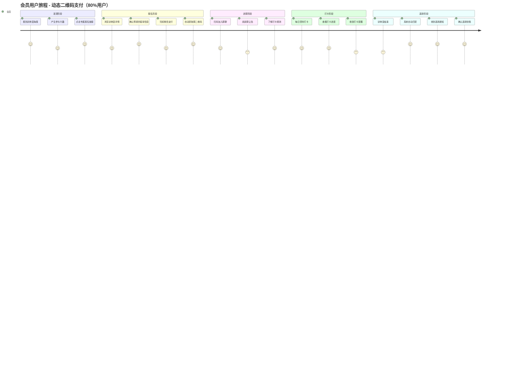
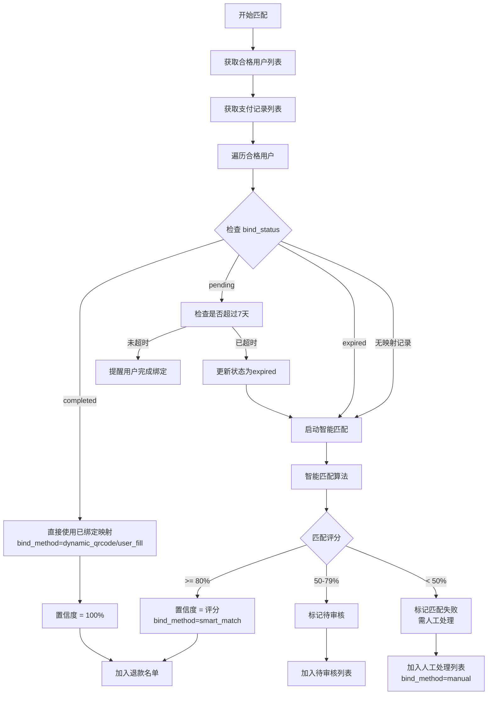
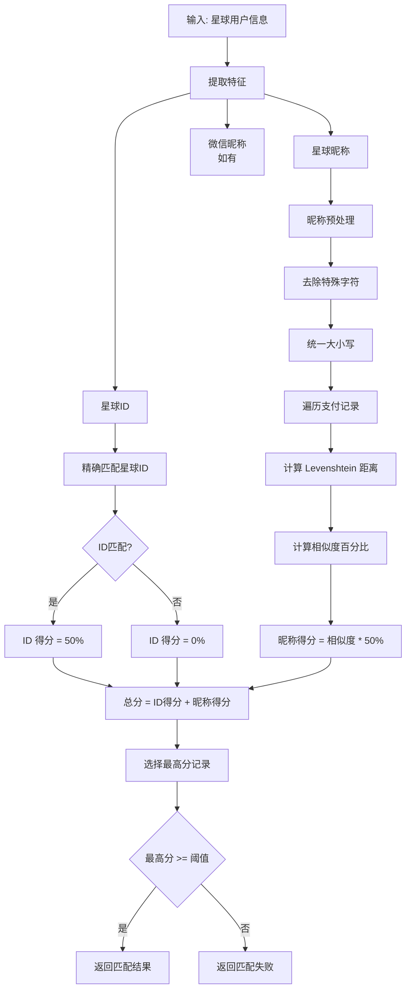
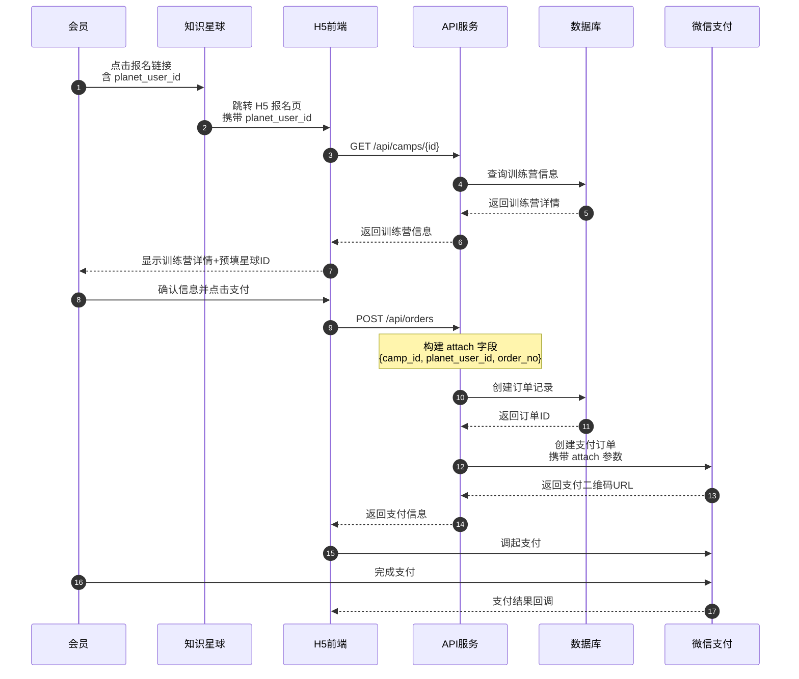
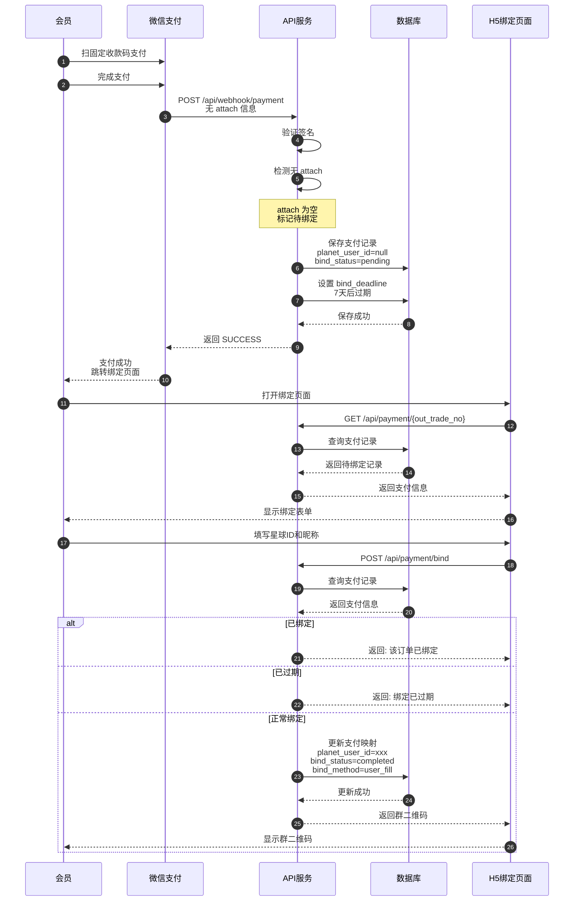

# 知识星球训练营自动押金退款系统 - 技术方案

| **版本** | v1.0       |
| -------- |------------|
| **作者** | 易安系统架构师    |
| **日期** | 2025-12-01 |
| **状态** | 评审中        |

**修订记录**

| 版本 | 修订内容 | 日期 | 编制人 |
|------|----------|------|--------|
| v0.1 | 初版（基于传统模板） | 2025-10-24 | - |
| v0.2 | 重构为 AI 协作版，增加用户旅程、故事卡片、C4 架构 | 2025-11-29 | - |
| v0.3 | 增加混合匹配方案（动态二维码 + 支付后绑定） | 2025-12-01 | - |
| v1.0 | 整合所有文档为统一技术方案，准备技术评审 | 2025-12-01 | - |

---

## 目录

1. [名词解释](#一名词解释)
2. [需求背景](#二需求背景)
3. [需求分析](#三需求分析)
4. [概要设计](#四概要设计)
5. [详细设计](#五详细设计)
6. [风险与应对](#六风险与应对)
7. [测试方案](#七测试方案)
8. [指标监控](#八指标监控)
9. [上线方案](#九上线方案)
10. [参考文献](#十参考文献)
11. [附录：AI 协作增强](#附录ai-协作增强)

---

# 一、名词解释

| 术语 | 解释 |
|------|------|
| **知识星球** | 知识付费社群平台，用户在此打卡学习 |
| **训练营** | 限时打卡活动，会员缴纳押金参与 |
| **押金** | 会员报名时缴纳的保证金，完成打卡后退还 |
| **打卡** | 会员在知识星球发布学习内容的行为 |
| **动态二维码** | 包含用户身份信息的专属支付链接 |
| **支付映射** | 支付记录与知识星球用户的关联关系 |
| **bind_status** | 绑定状态：pending/completed/expired/manual_required/closed |
| **bind_method** | 绑定方式：dynamic_qrcode/user_fill/smart_match/manual |
| **置信度** | 身份匹配的准确度百分比 |
| **宽限天数** | 打卡天数计算时额外给予的宽限（默认1天） |
| **FastAuth** | 微信公众号 OAuth 授权组件，用于获取用户微信身份 |
| **微信 OpenID** | 微信公众号用户唯一标识，同一用户在不同公众号下 OpenID 不同 |
| **access_token** | 系统访问票据，格式 `tk_` + UUID，用于 H5 敏感接口认证 |

---

# 二、需求背景

## 2.1 业务现状

目前知识星球训练营的押金收取、打卡核对、退款操作全部手动完成：
- 每月有 **5-10 个训练营**同时进行
- 单个训练营最多 **1000 人**参与
- 人工处理工作量巨大，效率低且容易出错

## 2.2 核心痛点

| 痛点 | 描述 | 影响 |
|------|------|------|
| 身份匹配困难 | 支付微信名与星球昵称不一致 | 退款错误、投诉增加 |
| 手动操作繁琐 | 导出→对比→退款→通知全手工 | 单营耗时 2-4 小时 |
| 数据分散 | 支付在微信、打卡在星球 | 核对困难、易遗漏 |
| 响应延迟 | 退款依赖人工排期 | 用户体验差 |

## 2.3 建设目标

构建一套自动化系统，实现：
- **自动化支付流程**：会员支付押金后立即获得入群二维码
- **自动化数据同步**：每日自动同步知识星球打卡数据
- **混合匹配识别**：多种方式确保身份匹配准确率
- **半自动退款**：系统判断 + 人工审核 + 自动退款

---

# 三、需求分析

## 3.1 用户角色

| 角色 | 描述 | 主要目标 |
|------|------|----------|
| **超级管理员** | 星主本人 | 系统配置、全局管理 |
| **管理员** | 运营人员 | 审核退款、查看报表 |
| **教练** | 项目教练 | 查看负责项目、催促打卡 |
| **志愿者** | 项目志愿者 | 查看项目、催促打卡 |
| **会员** | 知识星球会员 | 支付押金、打卡、获取退款 |

## 3.2 核心诉求

### 会员诉求
- 支付后快速获得入群方式
- 实时查看打卡进度
- 及时收到退款

### 管理员诉求
- 减少手动操作时间
- 准确的身份匹配
- 清晰的数据报表

## 3.3 目标与指标

| 指标 | 当前值 | 目标值 | 验证方式 |
|------|--------|--------|----------|
| 人工操作时间 | 100% | < 10% | 操作日志统计 |
| 退款准确率 | 95% | 100% | 退款结果审计 |
| 支付到进群时间 | 人工处理 | < 3 秒 | 接口响应监控 |
| 单营处理时间 | 2-4 小时 | < 10 分钟 | 计时测试 |

## 3.4 非目标（Scope Out）

- ❌ 本次不包含：会员端 App 开发（仅 H5）
- ❌ 暂不支持：多知识星球管理
- ❌ 后续版本再考虑：积分激励体系、数据预测分析

## 3.5 验收标准

| Story ID | 功能点 | 验收标准 | 优先级 |
|----------|--------|----------|--------|
| S1.1 | 创建训练营 | 填写表单后成功创建，生成报名链接 | P0 |
| S2.1 | 支付押金 | 微信支付成功后显示群二维码 | P0 |
| S2.2 | 支付回调 | Webhook 3 秒内处理完成，保存支付映射 | P0 |
| S2.3 | 支付后绑定 | 固定二维码用户可通过 H5 页面绑定星球信息 | P0 |
| S3.1 | 打卡同步 | 每日 01:00 自动同步，失败告警 | P0 |
| S4.1 | 混合匹配 | 动态二维码 100%，用户填写 95%，智能匹配 ≥ 70% | P0 |
| S5.1 | 审核退款 | 管理员可批量审核通过/拒绝 | P0 |
| S5.2 | 执行退款 | 调用微信退款 API 成功率 ≥ 99% | P0 |

---

# 四、概要设计

## 4.1 支付-身份匹配方案

采用 **动态二维码 + 支付后信息填写** 混合方案：

| 支付方式 | 覆盖率 | 准确率 | 实现方式 |
|----------|--------|--------|----------|
| 动态二维码 | 80% | 100% | 支付时 attach 携带 planet_user_id |
| 支付后填写 | 15% | 95% | 用户支付后 H5 页面填写星球信息 |
| 智能匹配 | 4% | 70% | Levenshtein 算法匹配昵称 |
| 人工处理 | 1% | 100% | 管理员手动绑定 |

## 4.2 技术选型

| 层级 | 技术选型 | 版本 | 选型理由 |
|------|---------|------|----------|
| **后端语言** | Java | 17+ | 企业级稳定性 |
| **后端框架** | Spring Boot | 3.2+ | 生态成熟 |
| **数据库** | PostgreSQL | 15+ | JSONB 支持强 |
| **缓存** | Redis | 7.x | 高性能缓存 |
| **消息队列** | RabbitMQ | 3.12+ | 事务性消息 |
| **前端框架** | Vue 3 | 3.3+ | 组合式 API |
| **H5 UI** | Vant | 4.x | 移动端友好 |
| **后台 UI** | Element Plus | 2.4+ | 企业级组件 |
| **OAuth认证** | 微信公众号 OAuth 2.0 | - | 用户身份识别 |

### ADR-001: 数据库选型决策

**考虑的方案**：

| 方案 | 优点 | 缺点 |
|------|------|------|
| MySQL | 生态成熟、运维熟悉 | JSON 支持弱 |
| PostgreSQL | JSON 支持强、功能丰富 | 运维经验相对少 |

**决策**：选择 PostgreSQL 15+

**理由**：
- 强大的 JSONB 支持，适合存储 API 响应
- 完善的事务和并发控制
- 云服务商支持完善

## 4.3 系统上下文（C4 Level 1）


## 4.4 容器架构（C4 Level 2）

> **部署形态说明**：v1 采用单节点部署，所有服务运行在一台服务器上。消息队列（RabbitMQ）为**可选扩展**，初期使用 Spring 内置的异步任务替代，后续根据负载情况启用。


**扩展路径**（后续容量提升时启用）：
| 阶段 | 触发条件 | 扩展组件 |
|------|----------|----------|
| 阶段 1 | 当前 | 单节点 API + PostgreSQL + Redis |
| 阶段 2 | 并发 > 100 QPS | 添加 Nginx 反向代理 |
| 阶段 3 | 异步任务积压 | 引入 RabbitMQ 消息队列 |
| 阶段 4 | 需要高可用 | 双节点 API + PostgreSQL 主从 |

---

# 五、详细设计

## 5.1 用户旅程

### 5.1.1 会员用户旅程（动态二维码路径 - 推荐）



### 5.1.2 会员用户旅程（固定二维码路径）


### 5.1.3 旅程对比

| 阶段 | 动态二维码路径 | 固定二维码路径 | 情绪差异 |
|------|--------------|--------------|---------|
| **发现** | 点击链接（含用户ID） | 扫固定码 | 同 😊 |
| **报名** | 确认信息即可 | 支付后需填写 | 😊 vs 😐 |
| **支付** | 一步完成 | 支付+绑定两步 | 😊 vs 😟 |
| **进群** | 自动显示 | 绑定后显示 | 同 😊 |
| **退款** | 100%自动匹配 | 95%准确匹配 | 😊 vs 🙂 |

### 5.1.4 管理员用户旅程


### 5.1.5 关键触点设计

#### 动态二维码报名页面

```
┌─────────────────────────────────────┐
│  ← 返回        训练营报名            │
├─────────────────────────────────────┤
│                                     │
│  ┌───────────────────────────────┐  │
│  │                               │  │
│  │     [训练营海报图片]           │  │
│  │                               │  │
│  └───────────────────────────────┘  │
│                                     │
│  21天早起打卡训练营                  │
│  押金: ¥99    打卡要求: 15/21天      │
│                                     │
│  ─────────────────────────────────  │
│                                     │
│  ✅ 已识别您的星球信息:              │
│                                     │
│  星球昵称                            │
│  ┌───────────────────────────────┐  │
│  │ 小明同学（已自动填写）          │  │
│  └───────────────────────────────┘  │
│                                     │
│  星球ID                              │
│  ┌───────────────────────────────┐  │
│  │ 123456789（已自动填写）        │  │
│  └───────────────────────────────┘  │
│                                     │
│  微信昵称（可选）                    │
│  ┌───────────────────────────────┐  │
│  │                               │  │
│  └───────────────────────────────┘  │
│                                     │
│  ┌───────────────────────────────┐  │
│  │       确认并支付 ¥99 押金      │  │
│  └───────────────────────────────┘  │
│                                     │
│  💡 支付成功后将自动显示群二维码     │
└─────────────────────────────────────┘
```

#### 支付后绑定页面（固定二维码用户）

```
┌─────────────────────────────────────┐
│                                     │
│          ✅ 支付成功!               │
│                                     │
│  ─────────────────────────────────  │
│                                     │
│  ⚠️ 请填写您的知识星球信息          │
│     以便后续退款                     │
│                                     │
│  订单号                              │
│  ┌───────────────────────────────┐  │
│  │ ord_a1b2c3d4-5678-90ab-cdef  │  │
│  └───────────────────────────────┘  │
│                                     │
│  支付金额                            │
│  ┌───────────────────────────────┐  │
│  │ ¥99.00                        │  │
│  └───────────────────────────────┘  │
│                                     │
│  星球ID *  [?如何获取]               │
│  ┌───────────────────────────────┐  │
│  │ 请输入您的星球用户ID           │  │
│  └───────────────────────────────┘  │
│                                     │
│  星球昵称 *                          │
│  ┌───────────────────────────────┐  │
│  │ 请输入您的星球昵称             │  │
│  └───────────────────────────────┘  │
│                                     │
│  ┌───────────────────────────────┐  │
│  │      提交并获取群二维码        │  │
│  └───────────────────────────────┘  │
│                                     │
│  ⏰ 请在7天内完成绑定，否则需联系    │
│     管理员处理退款                   │
│                                     │
└─────────────────────────────────────┘
```

#### 群二维码展示页

```
┌─────────────────────────────────────┐
│                                     │
│          ✅ 报名成功!               │
│                                     │
│  ─────────────────────────────────  │
│                                     │
│  恭喜您成功报名                      │
│  21天早起打卡训练营                  │
│                                     │
│  ┌───────────────────────────────┐  │
│  │                               │  │
│  │                               │  │
│  │      [群二维码]               │  │
│  │                               │  │
│  │                               │  │
│  └───────────────────────────────┘  │
│                                     │
│  长按保存二维码，扫码加入训练营群    │
│                                     │
│  ─────────────────────────────────  │
│                                     │
│  📋 您的报名信息:                    │
│  · 星球昵称: 小明同学                │
│  · 星球ID: 123456789                │
│  · 押金金额: ¥99.00                 │
│                                     │
│  ┌───────────────────────────────┐  │
│  │       查看我的打卡进度         │  │
│  └───────────────────────────────┘  │
│                                     │
└─────────────────────────────────────┘
```

#### 打卡进度页

```
┌─────────────────────────────────────┐
│  ← 返回        打卡进度             │
├─────────────────────────────────────┤
│                                     │
│  21天早起打卡训练营                  │
│  第 15 天 / 共 21 天                 │
│                                     │
│  ═════════════════════════════════  │
│  ████████████████░░░░░░░  71%       │
│  ═════════════════════════════════  │
│                                     │
│  ─────────────────────────────────  │
│                                     │
│  打卡统计                            │
│                                     │
│  已打卡        要求打卡       状态   │
│    12 天        15 天        🔴 差3天 │
│                                     │
│  ─────────────────────────────────  │
│                                     │
│  打卡日历                            │
│  ┌───┬───┬───┬───┬───┬───┬───┐    │
│  │ 一 │ 二 │ 三 │ 四 │ 五 │ 六 │ 日 │    │
│  ├───┼───┼───┼───┼───┼───┼───┤    │
│  │ ✓ │ ✓ │ ✓ │ ✓ │ ✓ │ ✓ │ ✓ │    │
│  ├───┼───┼───┼───┼───┼───┼───┤    │
│  │ ✓ │ ✓ │ ✗ │ ✓ │ ✓ │ ✗ │ ✓ │    │
│  ├───┼───┼───┼───┼───┼───┼───┤    │
│  │ ○ │   │   │   │   │   │   │    │
│  └───┴───┴───┴───┴───┴───┴───┘    │
│                                     │
│  ✓ 已打卡  ✗ 未打卡  ○ 今天          │
│                                     │
│  ─────────────────────────────────  │
│                                     │
│  退款状态: ⏳ 训练营进行中            │
│                                     │
└─────────────────────────────────────┘
```

### 5.1.6 关键时刻 (Moments of Truth)

| 时刻 | 触发点 | 用户期望 | 失败后果 | 设计对策 |
|------|--------|----------|----------|----------|
| **MOT1: 支付** | 点击支付按钮 | 3秒内跳转支付 | 放弃报名 | 预加载支付参数 |
| **MOT2: 进群** | 支付成功后 | 立即看到二维码 | 无法入群 | Webhook 实时处理 |
| **MOT3: 退款** | 训练营结束 | 24小时内收到 | 投诉/差评 | 自动化退款流程 |


### 5.1.7 体验优化建议

#### 短期优化

| 优化项 | 当前问题 | 优化方案 | 预期效果 |
|--------|----------|----------|----------|
| 表单预填 | 每次重新填写 | 记住上次填写的信息 | 报名时间 -50% |
| 进度可视化 | 纯文字描述 | 日历+进度条 | 用户满意度 +20% |
| 退款通知 | 无主动通知 | 企业微信推送 | 咨询量 -30% |

#### 中期优化

| 优化项 | 当前问题 | 优化方案 | 预期效果 |
|--------|----------|----------|----------|
| 智能提醒 | 无打卡提醒 | 每日定时提醒 | 完成率 +15% |
| 动态二维码 | 固定二维码可能过期 | 动态生成+自动刷新 | 入群成功率 +10% |
| 多维报表 | 统计维度单一 | 时间/教练/项目多维 | 运营效率 +30% |

## 5.2 业务流程设计

### 5.2.1 训练营全生命周期


### 5.2.2 报名支付流程（混合方案）


### 5.2.3 退款审核流程（混合匹配）


### 5.2.4 身份匹配策略



### 5.2.5 报名信息校验规则


### 5.2.6 打卡数据处理流程


### 5.2.7 智能匹配算法详细



### 5.2.8 异常处理流程

#### 支付异常处理


#### 同步异常处理


#### 退款异常处理


### 5.2.9 统计报表流程


## 5.3 时序图设计

### 5.3.1 动态二维码支付流程



### 5.3.2 支付回调处理


### 5.3.3 固定二维码支付+用户绑定



### 5.3.4 打卡数据同步

```mermaid
sequenceDiagram
    autonumber
    participant Scheduler as 定时调度器
    participant API as API服务
    participant ZSXQ as 知识星球API
    participant DB as 数据库
    participant MQ as 消息队列
    participant Alert as 告警服务

    Scheduler->>API: 触发同步任务
    API->>DB: 获取进行中的训练营
    DB-->>API: 返回训练营列表

    loop 每个训练营
        API->>ZSXQ: GET /checkins/{campId}

        alt API调用成功
            ZSXQ-->>API: 返回打卡数据

            opt 需要翻页
                loop 翻页获取
                    API->>ZSXQ: GET /checkins/{campId}?page=N
                    ZSXQ-->>API: 返回下一页数据
                end
            end

            API->>API: 解析并计算统计
            API->>DB: 更新打卡记录
            DB-->>API: 更新成功
            API->>DB: 记录同步日志
        else API调用失败
            API->>API: 重试（最多3次）

            alt 重试成功
                ZSXQ-->>API: 返回数据
                API->>DB: 更新记录
            else 重试失败
                API->>MQ: 发送失败消息
                MQ->>Alert: 触发告警
                Alert->>Alert: 发送通知
            end
        end
    end

    API-->>Scheduler: 同步完成
```

### 5.3.5 退款执行流程

```mermaid
sequenceDiagram
    autonumber
    participant Admin as 管理员
    participant Web as 管理后台
    participant API as API服务
    participant DB as 数据库
    participant MQ as 消息队列
    participant Refund as 退款服务
    participant WX as 微信支付
    participant Notify as 通知服务

    Admin->>Web: 批量审核通过
    Web->>API: POST /api/admin/refunds/batch-approve
    API->>DB: 更新审核状态
    DB-->>API: 更新成功
    API->>MQ: 发送退款任务
    API-->>Web: 返回处理中
    Web-->>Admin: 显示处理状态

    loop 处理队列消息
        MQ->>Refund: 消费退款任务
        Refund->>DB: 获取退款详情
        DB-->>Refund: 返回退款信息

        Refund->>WX: 调用退款API

        alt 退款成功
            WX-->>Refund: 返回成功
            Refund->>DB: 更新退款状态
            Refund->>Notify: 发送成功通知
            Notify->>Notify: 推送企业微信消息
        else 退款失败
            WX-->>Refund: 返回失败原因

            alt 可重试错误
                Refund->>MQ: 重新入队（延迟）
            else 不可重试
                Refund->>DB: 标记失败
                Refund->>Notify: 发送失败告警
            end
        end
    end
```

### 5.3.6 绑定超时处理时序

```mermaid
sequenceDiagram
    autonumber
    participant Scheduler as 定时调度器
    participant API as API服务
    participant DB as 数据库
    participant Match as 匹配服务
    participant MQ as 消息队列

    Scheduler->>API: 触发绑定超时检查<br/>每日 02:00
    API->>DB: 查询 bind_status=pending<br/>且 bind_deadline < now
    DB-->>API: 返回超时记录列表

    loop 每条超时记录
        API->>DB: 更新 bind_status=expired
        DB-->>API: 更新成功
        API->>MQ: 发送智能匹配任务
    end

    MQ->>Match: 消费匹配任务
    Match->>DB: 获取支付记录详情
    DB-->>Match: 返回支付信息

    Match->>Match: 执行智能匹配算法

    alt 匹配成功
        Match->>DB: 更新 bind_status=completed<br/>bind_method=smart_match
        Match->>DB: 记录匹配置信度
    else 匹配失败
        Match->>DB: 更新 bind_status=manual_required
        Match->>MQ: 发送人工处理通知
    end
```

### 5.3.7 手动触发同步时序

```mermaid
sequenceDiagram
    autonumber
    participant Admin as 管理员
    participant Web as 管理后台
    participant API as API服务
    participant DB as 数据库
    participant ZSXQ as 知识星球API
    participant Cache as Redis缓存

    Admin->>Web: 点击"立即同步"
    Web->>API: POST /api/admin/camps/{id}/sync
    API->>Cache: 检查同步锁
    Cache-->>API: 返回锁状态

    alt 已有同步进行中
        API-->>Web: 返回: 同步进行中，请稍后
        Web-->>Admin: 显示提示
    else 无同步锁
        API->>Cache: 设置同步锁（5分钟过期）
        API->>DB: 获取训练营信息
        DB-->>API: 返回训练营详情

        API->>ZSXQ: GET /checkins/{campId}
        ZSXQ-->>API: 返回打卡数据

        API->>API: 解析并计算统计
        API->>DB: 批量更新打卡记录
        DB-->>API: 更新成功

        API->>Cache: 释放同步锁
        API-->>Web: 返回同步结果
        Web-->>Admin: 显示同步完成<br/>更新人数、新增打卡数
    end
```

### 5.3.8 混合匹配详细时序

```mermaid
sequenceDiagram
    autonumber
    participant API as 匹配服务
    participant DB as 数据库
    participant Cache as Redis缓存

    API->>DB: 获取合格用户列表
    DB-->>API: 返回用户列表

    loop 每个合格用户
        API->>DB: 查询支付映射
        DB-->>API: 返回映射记录

        alt bind_status = completed
            Note over API: 使用已绑定映射<br/>置信度 100%
            API->>API: 加入退款名单
        else bind_status = pending
            API->>API: 检查 bind_deadline

            alt 未过期
                API->>API: 跳过，等待用户绑定
            else 已过期
                API->>DB: 更新 bind_status=expired
                API->>API: 启动智能匹配
            end
        else bind_status = expired 或 无记录
            API->>API: 执行智能匹配算法
            API->>Cache: 获取昵称索引
            Cache-->>API: 返回索引数据

            API->>API: 计算 Levenshtein 相似度
            API->>API: 计算综合评分

            alt 评分 >= 80%
                API->>DB: 保存匹配结果<br/>bind_method=smart_match
                API->>API: 加入退款名单
            else 评分 50-79%
                API->>API: 加入待审核列表
            else 评分 < 50%
                API->>API: 加入人工处理列表
            end
        end
    end

    API-->>API: 返回分类结果
```

### 5.3.9 Cookie过期处理时序

```mermaid
sequenceDiagram
    autonumber
    participant Scheduler as 定时调度器
    participant API as API服务
    participant ZSXQ as 知识星球API
    participant Alert as 告警服务
    participant Admin as 管理员

    Scheduler->>API: 触发打卡同步
    API->>ZSXQ: GET /checkins/{campId}
    ZSXQ-->>API: 返回 401/403 错误

    API->>API: 识别 Cookie 过期
    API->>Alert: 发送 Cookie 过期告警

    Alert->>Alert: 记录告警日志
    Alert->>Admin: 推送企业微信通知<br/>"知识星球 Cookie 已过期"

    API->>API: 暂停当前训练营同步
    API->>API: 标记同步状态为"待 Cookie 更新"

    Note over Admin: 管理员更新 Cookie
    Admin->>API: 更新配置<br/>PUT /api/admin/config/zsxq-cookie

    API->>ZSXQ: 验证新 Cookie
    ZSXQ-->>API: 返回 200 成功

    API->>API: 恢复同步任务
    API->>Scheduler: 触发补偿同步
```

### 5.3.10 退款失败重试时序

```mermaid
sequenceDiagram
    autonumber
    participant MQ as 消息队列
    participant Refund as 退款服务
    participant DB as 数据库
    participant WX as 微信支付
    participant Alert as 告警服务

    MQ->>Refund: 消费退款任务
    Refund->>DB: 获取退款详情
    DB-->>Refund: 返回退款信息

    Refund->>WX: 调用退款 API
    WX-->>Refund: 返回失败（网络超时）

    Refund->>DB: 更新重试次数 +1
    Refund->>DB: 查询当前重试次数
    DB-->>Refund: 返回 retry_count

    alt retry_count < 3
        Refund->>MQ: 延迟重新入队<br/>延迟时间 = retry_count * 5分钟
        Note over MQ: 等待延迟时间后重试
        MQ->>Refund: 再次消费
        Refund->>WX: 重试退款 API
        WX-->>Refund: 返回成功
        Refund->>DB: 更新退款状态为成功
    else retry_count >= 3
        Refund->>DB: 标记退款失败
        Refund->>DB: 记录失败原因
        Refund->>Alert: 发送退款失败告警
        Alert->>Alert: 通知管理员人工处理
    end
```

## 5.4 状态机设计

### 5.4.1 训练营状态机

```mermaid
stateDiagram-v2
    [*] --> 草稿: 创建训练营

    草稿 --> 待发布: 完善信息
    草稿 --> [*]: 删除

    待发布 --> 报名中: 发布
    待发布 --> 草稿: 编辑
    待发布 --> [*]: 删除

    报名中 --> 进行中: 训练营开始
    报名中 --> 已取消: 取消发布

    进行中 --> 已结束: 训练营结束
    进行中 --> 已取消: 异常终止

    已结束 --> 结算中: 开始结算
    结算中 --> 已归档: 结算完成

    已取消 --> [*]: 清理数据
    已归档 --> [*]: 归档存储
```

**状态说明**：

| 状态 | 编码 | 描述 | 可执行操作 |
|------|------|------|-----------|
| 草稿 | `DRAFT` | 初始创建状态 | 编辑、删除、完善信息 |
| 待发布 | `PENDING` | 信息完善，等待发布 | 发布、编辑、删除 |
| 报名中 | `ENROLLING` | 已发布，接受报名 | 取消发布 |
| 进行中 | `ONGOING` | 训练营进行中 | 异常终止 |
| 已结束 | `ENDED` | 训练营结束 | 开始结算 |
| 结算中 | `SETTLING` | 正在处理退款 | - |
| 已归档 | `ARCHIVED` | 结算完成，已归档 | - |
| 已取消 | `CANCELLED` | 取消状态 | - |

### 5.4.2 支付映射绑定状态机

```mermaid
stateDiagram-v2
    [*] --> 待绑定: 支付回调（无attach）

    state 已绑定 {
        [*] --> 动态二维码绑定
        [*] --> 用户填写绑定
        [*] --> 智能匹配绑定
        [*] --> 人工绑定
    }

    待绑定 --> 已绑定: 用户填写提交<br/>bind_method=user_fill
    待绑定 --> 已过期: 超过7天未绑定

    已过期 --> 已绑定: 智能匹配成功<br/>bind_method=smart_match
    已过期 --> 人工处理中: 智能匹配失败

    人工处理中 --> 已绑定: 管理员手动绑定<br/>bind_method=manual
    人工处理中 --> 已关闭: 无法匹配

    note right of 待绑定: planet_user_id=null<br/>bind_deadline=now+7d

    note right of 已绑定: planet_user_id!=null<br/>confidence=100%

    已绑定 --> [*]
    已关闭 --> [*]
```

**绑定状态说明**：

| 状态 | 编码 | bind_method | 描述 |
|------|------|-------------|------|
| 已绑定（动态） | `COMPLETED` | `dynamic_qrcode` | 动态二维码自动绑定 |
| 已绑定（填写） | `COMPLETED` | `user_fill` | 用户支付后填写绑定 |
| 已绑定（匹配） | `COMPLETED` | `smart_match` | 智能匹配自动绑定 |
| 已绑定（人工） | `COMPLETED` | `manual` | 管理员手动绑定 |
| 待绑定 | `PENDING` | `null` | 等待用户填写 |
| 已过期 | `EXPIRED` | `null` | 超过绑定期限 |
| 人工处理中 | `MANUAL_REQUIRED` | `null` | 智能匹配失败 |
| 已关闭 | `CLOSED` | `null` | 无法匹配 |

### 5.4.3 订单/支付状态机

```mermaid
stateDiagram-v2
    [*] --> 待支付: 创建订单

    待支付 --> 支付中: 发起支付
    待支付 --> 已取消: 超时取消
    待支付 --> 已取消: 用户取消

    支付中 --> 已支付: 支付成功
    支付中 --> 支付失败: 支付失败
    支付中 --> 待支付: 支付超时

    支付失败 --> 支付中: 重新支付
    支付失败 --> 已取消: 放弃支付

    已支付 --> 退款中: 发起退款
    退款中 --> 已退款: 退款成功
    退款中 --> 退款失败: 退款失败

    退款失败 --> 退款中: 重试退款
    退款失败 --> 已支付: 取消退款

    已取消 --> [*]
    已退款 --> [*]
```

### 5.4.4 退款状态机

```mermaid
stateDiagram-v2
    [*] --> 待生成: 训练营结束

    待生成 --> 待匹配: 生成退款名单
    待匹配 --> 匹配完成: 自动匹配

    state 匹配完成 {
        [*] --> 高置信度
        [*] --> 待审核
        [*] --> 匹配失败

        高置信度 --> 自动通过: 置信度>=80%
        待审核 --> 审核通过: 管理员通过
        待审核 --> 审核拒绝: 管理员拒绝
        匹配失败 --> 人工处理: 手动匹配
        人工处理 --> 审核通过: 匹配成功
        人工处理 --> 审核拒绝: 无法匹配
    }

    匹配完成 --> 待退款: 审核通过
    匹配完成 --> 已拒绝: 审核拒绝

    待退款 --> 退款中: 执行退款
    退款中 --> 退款成功: API返回成功
    退款中 --> 退款失败: API返回失败

    退款失败 --> 退款中: 重试
    退款失败 --> 人工处理中: 超过重试次数

    人工处理中 --> 退款成功: 手动处理成功
    人工处理中 --> 已关闭: 手动关闭

    退款成功 --> [*]
    已拒绝 --> [*]
    已关闭 --> [*]
```

### 5.4.5 支付回调绑定处理状态

```mermaid
stateDiagram-v2
    [*] --> 解析attach

    state 解析attach {
        [*] --> 有attach数据
        [*] --> 无attach数据
    }

    有attach数据 --> 已绑定: 保存映射<br/>bind_status=completed<br/>bind_method=dynamic_qrcode

    无attach数据 --> 待绑定: 保存映射<br/>bind_status=pending<br/>bind_deadline=now+7d
```

### 5.4.6 绑定超时处理状态

```mermaid
stateDiagram-v2
    state 定时检查 {
        [*] --> 查询待绑定记录
        查询待绑定记录 --> 检查截止时间

        state 检查截止时间 <<choice>>
        检查截止时间 --> 未过期: deadline > now
        检查截止时间 --> 已过期: deadline <= now

        未过期 --> 保持待绑定
        已过期 --> 更新为已过期
        更新为已过期 --> 加入智能匹配队列
    }
```

### 5.4.7 支付状态详细转换

```mermaid
stateDiagram-v2
    state 支付流程 {
        [*] --> 待支付

        待支付 --> 支付请求中: 调用支付API

        state 支付请求中 {
            [*] --> 等待用户操作
            等待用户操作 --> 验证支付: 用户完成
            等待用户操作 --> 支付取消: 用户取消
            验证支付 --> [*]: 验证完成
        }

        支付请求中 --> 已支付: Webhook确认成功
        支付请求中 --> 支付失败: Webhook确认失败

        支付失败 --> 待支付: 重新发起
    }
```

### 5.4.8 退款处理详细状态

```mermaid
stateDiagram-v2
    state 退款执行 {
        [*] --> 准备退款

        准备退款 --> 调用API: 构建请求

        state 调用API {
            [*] --> 发送请求
            发送请求 --> 等待响应
            等待响应 --> 解析结果
            解析结果 --> [*]
        }

        调用API --> 处理成功: 返回成功
        调用API --> 处理失败: 返回失败

        处理失败 --> 判断重试: 分析错误

        state 判断重试 {
            [*] --> 可重试错误
            [*] --> 不可重试错误

            可重试错误 --> 延迟重试: 重试次数<3
            可重试错误 --> 标记失败: 重试次数>=3

            不可重试错误 --> 标记失败
        }

        延迟重试 --> 准备退款: 等待后重试
        标记失败 --> [*]
        处理成功 --> [*]
    }
```

### 5.4.9 打卡同步状态机

```mermaid
stateDiagram-v2
    [*] --> 待同步: 定时触发

    待同步 --> 同步中: 开始同步

    state 同步中 {
        [*] --> 请求API
        请求API --> 解析数据: 成功
        请求API --> 重试: 失败
        重试 --> 请求API: 重试次数<3
        重试 --> 同步失败: 重试次数>=3
        解析数据 --> 保存数据
        保存数据 --> [*]
    }

    同步中 --> 同步成功: 完成
    同步中 --> 同步失败: 错误

    同步成功 --> [*]
    同步失败 --> 待人工处理: 需要介入

    待人工处理 --> 待同步: 问题解决
    待人工处理 --> [*]: 跳过
```

### 5.4.10 用户打卡状态机

```mermaid
stateDiagram-v2
    [*] --> 未开始: 报名成功

    未开始 --> 进行中: 训练营开始

    state 进行中 {
        [*] --> 今日未打卡
        今日未打卡 --> 今日已打卡: 打卡
        今日已打卡 --> 今日未打卡: 新的一天
    }

    进行中 --> 已完成: 达到要求天数
    进行中 --> 未达标: 训练营结束且未达标

    已完成 --> 待退款: 生成退款名单
    未达标 --> [*]

    待退款 --> 已退款: 退款成功
    已退款 --> [*]
```

### 5.4.11 状态转换事件汇总

#### 训练营状态事件

| 事件 | 触发方式 | 来源状态 | 目标状态 | 备注 |
|------|----------|----------|----------|------|
| CREATE | 管理员操作 | - | DRAFT | 创建训练营 |
| COMPLETE_INFO | 管理员操作 | DRAFT | PENDING | 信息完善 |
| PUBLISH | 管理员操作 | PENDING | ENROLLING | 发布 |
| START | 系统定时 | ENROLLING | ONGOING | 到达开始时间 |
| END | 系统定时 | ONGOING | ENDED | 到达结束时间 |
| SETTLE | 管理员触发 | ENDED | SETTLING | 开始结算 |
| ARCHIVE | 系统自动 | SETTLING | ARCHIVED | 结算完成 |
| CANCEL | 管理员操作 | ENROLLING/ONGOING | CANCELLED | 取消 |

#### 支付映射绑定事件

| 事件 | 触发方式 | 来源状态 | 目标状态 | 备注 |
|------|----------|----------|----------|------|
| CREATE_WITH_ATTACH | Webhook | - | COMPLETED | 动态二维码支付，自动绑定 |
| CREATE_WITHOUT_ATTACH | Webhook | - | PENDING | 固定二维码支付，待绑定 |
| USER_BIND | 用户操作 | PENDING | COMPLETED | 用户填写绑定 |
| EXPIRE | 定时任务 | PENDING | EXPIRED | 超过7天未绑定 |
| SMART_MATCH | 系统自动 | EXPIRED | COMPLETED | 智能匹配成功 |
| MATCH_FAIL | 系统自动 | EXPIRED | MANUAL_REQUIRED | 智能匹配失败 |
| MANUAL_BIND | 管理员操作 | MANUAL_REQUIRED | COMPLETED | 人工绑定 |
| CLOSE | 管理员操作 | MANUAL_REQUIRED | CLOSED | 无法匹配关闭 |

#### 订单状态事件

| 事件 | 触发方式 | 来源状态 | 目标状态 | 备注 |
|------|----------|----------|----------|------|
| CREATE | 用户操作 | - | PENDING | 创建订单 |
| PAY | 用户操作 | PENDING | PAYING | 发起支付 |
| PAY_SUCCESS | Webhook | PAYING | PAID | 支付成功 |
| PAY_FAIL | Webhook | PAYING | PAY_FAILED | 支付失败 |
| REFUND | 系统触发 | PAID | REFUNDING | 发起退款 |
| REFUND_SUCCESS | Webhook | REFUNDING | REFUNDED | 退款成功 |
| REFUND_FAIL | Webhook | REFUNDING | REFUND_FAILED | 退款失败 |
| CANCEL | 用户/系统 | PENDING | CANCELLED | 取消订单 |

#### 退款状态事件

| 事件 | 触发方式 | 来源状态 | 目标状态 | 备注 |
|------|----------|----------|----------|------|
| GENERATE | 管理员触发 | INIT | MATCHING | 生成名单 |
| MATCH | 系统自动 | MATCHING | HIGH_CONFIDENCE/PENDING_REVIEW/MATCH_FAILED | 匹配结果 |
| APPROVE | 系统/管理员 | HIGH_CONFIDENCE/PENDING_REVIEW | APPROVED | 审核通过 |
| REJECT | 管理员操作 | PENDING_REVIEW | REJECTED | 审核拒绝 |
| EXECUTE | 系统触发 | APPROVED | REFUNDING | 执行退款 |
| SUCCESS | Webhook | REFUNDING | REFUNDED | 退款成功 |
| FAIL | Webhook | REFUNDING | REFUND_FAILED | 退款失败 |
| RETRY | 系统自动 | REFUND_FAILED | REFUNDING | 重试 |
| ESCALATE | 系统自动 | REFUND_FAILED | MANUAL_PROCESSING | 升级人工 |

### 5.4.12 状态持久化设计

```sql
-- 训练营状态记录
CREATE TABLE camp_status_log (
    id BIGSERIAL PRIMARY KEY,
    camp_id BIGINT NOT NULL,
    from_status VARCHAR(32),
    to_status VARCHAR(32) NOT NULL,
    event VARCHAR(64) NOT NULL,
    operator_id BIGINT,
    remark TEXT,
    created_at TIMESTAMP DEFAULT CURRENT_TIMESTAMP
);

-- 支付记录绑定状态日志（记录 payment_record.bind_status 变更）
-- 注：支付和绑定信息统一存储在 payment_record 表中，不再单独建 payment_mapping 表
CREATE TABLE payment_bind_status_log (
    id BIGSERIAL PRIMARY KEY,
    payment_id BIGINT NOT NULL COMMENT '关联 payment_record.id',
    from_status VARCHAR(32),
    to_status VARCHAR(32) NOT NULL,
    event VARCHAR(64) NOT NULL,
    operator_id BIGINT,
    extra_data JSONB,
    created_at TIMESTAMP DEFAULT CURRENT_TIMESTAMP
);

-- 订单状态记录
CREATE TABLE order_status_log (
    id BIGSERIAL PRIMARY KEY,
    order_id BIGINT NOT NULL,
    from_status VARCHAR(32),
    to_status VARCHAR(32) NOT NULL,
    event VARCHAR(64) NOT NULL,
    extra_data JSONB,
    created_at TIMESTAMP DEFAULT CURRENT_TIMESTAMP
);

-- 退款状态记录
CREATE TABLE refund_status_log (
    id BIGSERIAL PRIMARY KEY,
    refund_id BIGINT NOT NULL,
    from_status VARCHAR(32),
    to_status VARCHAR(32) NOT NULL,
    event VARCHAR(64) NOT NULL,
    operator_id BIGINT,
    remark TEXT,
    created_at TIMESTAMP DEFAULT CURRENT_TIMESTAMP
);
```

**状态变更审计流程**：

```mermaid
flowchart TD
    A[状态变更请求] --> B[验证状态转换合法性]
    B --> C{转换是否合法}
    C -->|否| D[抛出异常]
    C -->|是| E[执行状态变更]
    E --> F[记录状态日志]
    F --> G[发送状态变更事件]
    G --> H[通知相关订阅者]
```

## 5.5 组件设计（C4 Level 3）

```mermaid
C4Component
    title API 服务组件图（含混合匹配方案）

    Container_Boundary(api, "API 服务") {
        Component(campCtrl, "CampController", "Controller", "训练营 CRUD 接口")
        Component(payCtrl, "PaymentController", "Controller", "支付相关接口")
        Component(bindCtrl, "BindController", "Controller", "支付绑定接口（新增）")
        Component(authCtrl, "AuthController", "Controller", "OAuth认证接口")
        Component(refundCtrl, "RefundController", "Controller", "退款相关接口")
        Component(statsCtrl, "StatsController", "Controller", "统计报表接口")
        Component(webhookCtrl, "WebhookController", "Controller", "回调处理接口")

        Component(campSvc, "CampService", "Service", "训练营业务逻辑")
        Component(paySvc, "PaymentService", "Service", "支付业务逻辑")
        Component(bindSvc, "PaymentBindService", "Service", "支付绑定服务（新增）")
        Component(authSvc, "FastAuthService", "Service", "OAuth认证服务")
        Component(checkinSvc, "CheckinService", "Service", "打卡业务逻辑")
        Component(matchSvc, "MatchService", "Service", "身份匹配逻辑")
        Component(refundSvc, "RefundService", "Service", "退款业务逻辑")
        Component(statsSvc, "StatsService", "Service", "统计业务逻辑")

        Component(campMapper, "CampMapper", "DAO", "训练营数据访问")
        Component(memberMapper, "MemberMapper", "DAO", "会员数据访问")
        Component(orderMapper, "PaymentMapper", "DAO", "支付记录数据访问（含绑定信息）")
        Component(bindLogMapper, "PaymentBindStatusLogMapper", "DAO", "绑定状态日志访问")
        Component(authSessionMapper, "AuthSessionMapper", "DAO", "认证会话数据访问")
        Component(refundMapper, "RefundMapper", "DAO", "退款数据访问")

        Component(zsxqMgr, "PlanetApiManager", "Manager", "知识星球 API 封装")
        Component(wxPayMgr, "WechatPayManager", "Manager", "微信支付 API 封装")
        Component(wxMsgMgr, "WechatMsgManager", "Manager", "企业微信消息封装")
        Component(wxOAuthMgr, "WechatOAuthManager", "Manager", "微信公众号 OAuth 封装")
    }

    Rel(campCtrl, campSvc, "调用")
    Rel(payCtrl, paySvc, "调用")
    Rel(bindCtrl, bindSvc, "调用")
    Rel(authCtrl, authSvc, "调用")
    Rel(refundCtrl, refundSvc, "调用")
    Rel(statsCtrl, statsSvc, "调用")
    Rel(webhookCtrl, paySvc, "调用")
    Rel(webhookCtrl, bindSvc, "调用")

    Rel(campSvc, campMapper, "调用")
    Rel(paySvc, orderMapper, "调用")
    Rel(paySvc, wxPayMgr, "调用")
    Rel(bindSvc, orderMapper, "调用")
    Rel(bindSvc, bindLogMapper, "调用")
    Rel(bindSvc, matchSvc, "调用")
    Rel(authSvc, authSessionMapper, "调用")
    Rel(authSvc, wxOAuthMgr, "调用")
    Rel(authSvc, memberMapper, "调用")
    Rel(checkinSvc, zsxqMgr, "调用")
    Rel(checkinSvc, memberMapper, "调用")
    Rel(matchSvc, memberMapper, "调用")
    Rel(matchSvc, orderMapper, "调用")
    Rel(refundSvc, refundMapper, "调用")
    Rel(refundSvc, matchSvc, "调用")
    Rel(refundSvc, wxPayMgr, "调用")
    Rel(refundSvc, wxMsgMgr, "调用")
```

### 5.5.1 项目结构

```
src/main/java/com/example/camp/
├── CampApplication.java                    # 启动类
├── config/                                 # 配置类
│   ├── WebMvcConfig.java
│   ├── SecurityConfig.java
│   ├── RedisConfig.java
│   └── MyBatisPlusConfig.java
├── controller/                             # 控制器层
│   ├── admin/                              # 管理端接口
│   │   ├── CampController.java
│   │   ├── MemberController.java
│   │   ├── RefundController.java
│   │   └── StatisticsController.java
│   ├── auth/                               # 认证接口
│   │   └── AuthController.java             # OAuth 授权、回调、绑定
│   ├── h5/                                 # H5端接口
│   │   ├── CampH5Controller.java
│   │   ├── PaymentH5Controller.java
│   │   └── ProgressH5Controller.java
│   └── webhook/                            # Webhook接口
│       └── WechatPayWebhookController.java
├── service/                                # 服务层
│   ├── CampService.java
│   ├── MemberService.java
│   ├── PaymentService.java
│   ├── PaymentBindService.java          # 支付绑定服务（新增）
│   ├── FastAuthService.java             # OAuth认证服务
│   ├── CheckinService.java
│   ├── MatchService.java
│   ├── RefundService.java
│   └── impl/
├── manager/                                # 第三方API封装
│   ├── WechatPayManager.java
│   ├── WechatOAuthManager.java          # 微信公众号 OAuth 封装
│   ├── PlanetApiManager.java
│   └── WechatNotifyManager.java
├── mapper/                                 # 数据访问层
│   ├── CampMapper.java
│   ├── MemberMapper.java
│   ├── PaymentMapper.java                 # 支付记录（含绑定信息）
│   ├── PaymentBindStatusLogMapper.java    # 绑定状态日志
│   ├── AuthSessionMapper.java             # 认证会话
│   └── RefundMapper.java
├── entity/                                 # 实体类
├── dto/                                    # 数据传输对象
├── enums/                                  # 枚举类
│   ├── CampStatus.java
│   ├── PaymentStatus.java
│   ├── BindStatus.java                     # 绑定状态枚举（新增）
│   ├── PaymentBindMethod.java              # 绑定方式枚举（新增）
│   ├── MatchStatus.java
│   └── RefundStatus.java
├── common/                                 # 公共类
│   ├── Result.java
│   ├── PageResult.java
│   └── exception/
├── schedule/                               # 定时任务
│   ├── CheckinSyncTask.java
│   └── BindExpireTask.java                 # 绑定超时检查（新增）
└── util/                                   # 工具类
```

### 5.5.2 核心服务接口

```java
// PaymentBindService（支付绑定服务 - 新增）
public interface PaymentBindService {
    // 处理支付回调，创建/更新映射
    void handlePaymentCallback(PaymentCallbackDTO callback);

    // 用户填写绑定
    void bindByUserFill(String orderNo, String planetUserId, String nickname);

    // 检查并更新过期映射（定时任务调用）
    void checkAndExpireBindings();

    // 智能匹配
    MatchResult smartMatch(Long paymentId);

    // 查询绑定状态
    BindStatusVO getBindStatus(String orderNo);
}
```

```java
// RefundService（退款服务）
public interface RefundService {
    void generateRefundList(Long campId);
    void approveRefund(Long refundId, Long operatorId);
    void batchApprove(List<Long> refundIds, Long operatorId);
    void executeRefund(Long refundId);
    void retryFailedRefund(Long refundId);
}
```

```java
// FastAuthService（OAuth认证服务）
public interface FastAuthService {
    // 生成微信授权URL
    AuthorizeUrlVO generateAuthorizeUrl(String redirectUri, String state);

    // 处理OAuth回调，创建/更新会话
    AuthCallbackResult handleOAuthCallback(String code, String state);

    // 绑定知识星球账号
    BindPlanetResult bindPlanetAccount(String accessToken, String planetUserId, String nickname);

    // 验证 access_token
    AuthSession validateAccessToken(String accessToken);

    // 清理过期会话（定时任务调用）
    void cleanupExpiredSessions();
}
```

### 5.5.3 枚举类定义

```java
// BindStatus.java - 绑定状态枚举
public enum BindStatus {
    PENDING("pending", "待绑定"),           // 固定二维码支付后
    COMPLETED("completed", "已绑定"),       // 绑定成功
    EXPIRED("expired", "已过期"),           // 7天未绑定
    MANUAL_REQUIRED("manual_required", "需人工处理"),
    CLOSED("closed", "已关闭");             // 无法匹配

    private final String code;
    private final String desc;
}

// PaymentBindMethod.java - 绑定方式枚举
public enum PaymentBindMethod {
    DYNAMIC_QRCODE("dynamic_qrcode", "动态二维码"),   // attach携带
    USER_FILL("user_fill", "用户填写"),              // H5页面填写
    SMART_MATCH("smart_match", "智能匹配"),          // 算法匹配
    MANUAL("manual", "人工绑定");                    // 管理员操作

    private final String code;
    private final String desc;
}
```

### 5.5.4 核心模块交互

```mermaid
flowchart LR
    subgraph 前端层
        H5[H5 会员端]
        Admin[管理后台]
    end

    subgraph 接入层
        Gateway[API 网关]
    end

    subgraph 业务层
        Camp[训练营模块]
        Member[会员模块]
        Payment[支付模块]
        Checkin[打卡模块]
        Match[匹配模块]
        Refund[退款模块]
    end

    subgraph 数据层
        DB[(PostgreSQL)]
        Cache[(Redis)]
        MQ[RabbitMQ]
    end

    H5 --> Gateway
    Admin --> Gateway
    Gateway --> Camp
    Gateway --> Member
    Gateway --> Payment

    Camp --> DB
    Member --> DB
    Payment --> DB
    Payment --> Cache
    Checkin --> DB
    Match --> DB
    Match --> Cache
    Refund --> DB
    Refund --> MQ

    Camp --> Member
    Payment --> Member
    Match --> Member
    Match --> Payment
    Refund --> Match
    Refund --> Payment
```

### 5.5.5 核心领域模型

```mermaid
classDiagram
    class TrainingCamp {
        +Long id
        +String name
        +BigDecimal deposit
        +LocalDate startDate
        +LocalDate endDate
        +Integer totalDays
        +Integer requiredDays
        +CampStatus status
        +String enrollUrl
        +publish()
        +start()
        +end()
        +settle()
    }

    class CampMember {
        +Long id
        +Long campId
        +Long planetUserId
        +String filledNickname
        +MatchStatus matchStatus
        +Integer matchConfidence
        +Integer checkinCount
        +Boolean eligibleForRefund
        +match()
        +updateCheckin()
    }

    class PaymentRecord {
        +Long id
        +String orderNo
        +Long campId
        +Long memberId
        +BigDecimal payAmount
        +PayStatus payStatus
        +BindStatus bindStatus
        +BindMethod bindMethod
        +LocalDateTime bindDeadline
        +pay()
        +refund()
        +bind()
    }

    class RefundRecord {
        +Long id
        +Long campId
        +Long memberId
        +Long paymentId
        +BigDecimal refundAmount
        +RefundStatus status
        +AuditStatus auditStatus
        +Integer retryCount
        +approve()
        +reject()
        +execute()
        +retry()
    }

    class PlanetUser {
        +Long id
        +String planetUserId
        +String planetNickname
        +String wechatNickname
    }

    class CheckinRecord {
        +Long id
        +Long campId
        +Long planetUserId
        +LocalDate checkinDate
        +String checkinContent
    }

    TrainingCamp "1" --> "*" CampMember
    CampMember "1" --> "0..1" PlanetUser
    CampMember "1" --> "1" PaymentRecord
    CampMember "1" --> "0..1" RefundRecord
    PlanetUser "1" --> "*" CheckinRecord
    TrainingCamp "1" --> "*" CheckinRecord
```

### 5.5.6 核心服务接口

```mermaid
classDiagram
    class CampService {
        <<interface>>
        +create(CampDTO) Camp
        +update(Long, CampDTO) Camp
        +publish(Long) void
        +getDetail(Long) CampVO
        +listByStatus(CampStatus) List~CampVO~
    }

    class PaymentService {
        <<interface>>
        +createOrder(OrderDTO) PaymentRecord
        +handleCallback(CallbackDTO) void
        +getPayParams(String orderNo) PayParamsVO
    }

    class PaymentBindService {
        <<interface>>
        +handlePaymentCallback(CallbackDTO) void
        +bindByUserFill(String, String, String) void
        +checkAndExpireBindings() void
        +smartMatch(Long) MatchResult
    }

    class MatchService {
        <<interface>>
        +matchMembers(Long) MatchResultVO
        +calculateSimilarity(String, String) Integer
        +manualMatch(Long, Long) void
    }

    class RefundService {
        <<interface>>
        +generateRefundList(Long) void
        +approveRefund(Long, Long) void
        +batchApprove(List~Long~, Long) void
        +executeRefund(Long) void
        +retryFailedRefund(Long) void
    }

    class CheckinService {
        <<interface>>
        +syncCheckins(Long) SyncResult
        +getCheckinStats(Long, Long) CheckinStatsVO
        +calculateEligibility(Long) void
    }

    PaymentService ..> PaymentBindService : uses
    RefundService ..> MatchService : uses
    RefundService ..> PaymentService : uses
    MatchService ..> PaymentBindService : uses
```

### 5.5.7 核心数据流

```mermaid
flowchart TD
    subgraph 数据输入
        A1[H5 报名表单]
        A2[支付回调 Webhook]
        A3[知识星球打卡 API]
        A4[管理员审核操作]
    end

    subgraph 数据处理
        B1[报名信息校验]
        B2[支付映射处理]
        B3[打卡数据同步]
        B4[身份匹配计算]
        B5[退款审核处理]
    end

    subgraph 数据存储
        C1[(会员表)]
        C2[(支付表)]
        C3[(打卡表)]
        C4[(退款表)]
    end

    subgraph 数据输出
        D1[群二维码展示]
        D2[打卡进度查询]
        D3[退款结果通知]
        D4[统计报表导出]
    end

    A1 --> B1 --> C1
    A2 --> B2 --> C2
    A3 --> B3 --> C3
    A4 --> B5 --> C4

    C1 --> B4
    C2 --> B4
    C3 --> B4
    B4 --> C4

    C1 --> D1
    C3 --> D2
    C4 --> D3
    C1 & C2 & C3 & C4 --> D4
```

### 5.5.8 异步数据流

```mermaid
flowchart LR
    subgraph 生产者
        P1[支付回调处理]
        P2[退款审核通过]
        P3[绑定超时检查]
        P4[打卡同步完成]
    end

    subgraph 消息队列
        Q1[refund.execute]
        Q2[match.smart]
        Q3[notify.send]
        Q4[stats.update]
    end

    subgraph 消费者
        C1[退款执行器]
        C2[智能匹配器]
        C3[通知发送器]
        C4[统计更新器]
    end

    P1 --> Q3
    P2 --> Q1
    P3 --> Q2
    P4 --> Q4

    Q1 --> C1
    Q2 --> C2
    Q3 --> C3
    Q4 --> C4

    C1 -->|成功| Q3
    C1 -->|失败| Q1
    C2 -->|失败| Q3
```

### 5.5.9 安全分层架构

```mermaid
flowchart TB
    subgraph 网络层
        WAF[Web 应用防火墙]
        CDN[CDN 加速]
    end

    subgraph 接入层
        SSL[SSL/TLS 加密]
        RateLimit[限流控制]
        IPBlack[IP 黑名单]
    end

    subgraph 认证层
        JWT[JWT 令牌验证]
        RBAC[角色权限控制]
        Sign[签名验证]
    end

    subgraph 业务层
        InputValid[输入校验]
        SQLInject[SQL 注入防护]
        XSS[XSS 防护]
    end

    subgraph 数据层
        Encrypt[敏感数据加密]
        Audit[操作审计]
        Backup[数据备份]
    end

    WAF --> SSL
    CDN --> SSL
    SSL --> RateLimit --> IPBlack
    IPBlack --> JWT --> RBAC
    JWT --> Sign
    RBAC --> InputValid
    Sign --> InputValid
    InputValid --> SQLInject --> XSS
    XSS --> Encrypt --> Audit --> Backup
```

### 5.5.10 认证授权流程

```mermaid
flowchart TD
    A[用户请求] --> B{请求类型}

    B -->|H5 公开接口| C[无需认证]
    B -->|管理后台接口| D[JWT 验证]
    B -->|Webhook 接口| E[签名验证]

    D --> F{Token 有效?}
    F -->|是| G[解析用户信息]
    F -->|否| H[返回 401]

    G --> I{权限检查}
    I -->|有权限| J[执行业务]
    I -->|无权限| K[返回 403]

    E --> L{签名有效?}
    L -->|是| M[执行回调处理]
    L -->|否| N[返回 FAIL]

    C --> O[执行公开逻辑]

    J --> P[记录操作日志]
    M --> P
    O --> Q[返回结果]
    P --> Q

    subgraph 权限矩阵
        R1[admin: 全部权限]
        R2[manager: 训练营管理、退款审核]
        R3[coach: 查看负责的训练营]
        R4[volunteer: 查看参与的训练营]
    end
```

## 5.6 数据库设计

### 5.6.1 设计原则

1. **命名规范**：
   - 表名：小写 + 下划线分隔（如：`training_camp`）
   - 字段名：小写 + 下划线分隔（如：`created_at`）
   - 索引名：`idx_表名_字段名`
   - 外键名：`fk_表名_关联表名`

2. **通用字段**：
   - `id`：主键，BIGSERIAL
   - `created_at`：创建时间，TIMESTAMP
   - `updated_at`：更新时间，TIMESTAMP
   - `deleted_at`：删除时间，TIMESTAMP（软删除）

3. **数据类型选择**：
   - 金额：DECIMAL(10,2)
   - 日期：DATE
   - 时间戳：TIMESTAMP
   - JSON数据：JSONB
   - 文本：VARCHAR(长度) 或 TEXT

### 5.6.2 ER 图

```
┌─────────────────┐
│  training_camp  │ 训练营
└─────────────────┘
        │ 1
        │
        │ N
┌─────────────────┐
│  camp_member    │ 训练营会员关系
└─────────────────┘
        │ 1              1 │
        │                  │
        │ 1              N │
┌─────────────────┐    ┌─────────────────┐
│  payment_record │    │  planet_user    │ 知识星球用户
└─────────────────┘    └─────────────────┘
        │ 1                  │ 1
        │                    │
        │ 1                  │ N
┌─────────────────┐    ┌─────────────────┐
│  refund_record  │    │  checkin_record │ 打卡记录
└─────────────────┘    └─────────────────┘

┌─────────────────┐    ┌─────────────────┐
│  system_user    │    │  role           │ 角色
└─────────────────┘    └─────────────────┘
        │ N                  │ 1
        │                    │
        └────────────────────┘

┌─────────────────┐
│  operation_log  │ 操作日志
└─────────────────┘

┌─────────────────┐
│  system_config  │ 系统配置
└─────────────────┘
```

### 5.6.3 核心表结构

#### 训练营表（training_camp）

```sql
CREATE TABLE training_camp (
    id BIGSERIAL PRIMARY KEY,

    -- 基本信息
    name VARCHAR(100) NOT NULL COMMENT '训练营名称',
    poster_url VARCHAR(500) NOT NULL COMMENT '项目海报URL',
    description TEXT COMMENT '项目介绍',

    -- 金额信息
    deposit DECIMAL(10,2) NOT NULL COMMENT '押金金额',

    -- 时间信息
    start_date DATE NOT NULL COMMENT '开始日期',
    end_date DATE NOT NULL COMMENT '结束日期',

    -- 打卡要求
    total_days INTEGER NOT NULL COMMENT '总天数',
    required_days INTEGER NOT NULL COMMENT '要求打卡天数',

    -- 群信息
    group_qrcode_url VARCHAR(500) NOT NULL COMMENT '群二维码URL',

    -- 关联信息
    planet_project_id VARCHAR(50) NOT NULL COMMENT '知识星球项目ID',
    wechat_pay_code_id VARCHAR(50) NOT NULL COMMENT '微信商户收款码ID',

    -- 状态
    status VARCHAR(20) NOT NULL DEFAULT 'not_started'
        COMMENT '状态: not_started-未开始, ongoing-进行中, finished-已结束',

    -- H5链接
    enroll_url VARCHAR(500) COMMENT 'H5报名链接',

    -- 统计字段（冗余，提升查询性能）
    member_count INTEGER DEFAULT 0 COMMENT '报名人数',
    paid_amount DECIMAL(10,2) DEFAULT 0 COMMENT '已收押金总额',
    refunded_amount DECIMAL(10,2) DEFAULT 0 COMMENT '已退押金总额',

    -- 通用字段
    created_at TIMESTAMP NOT NULL DEFAULT CURRENT_TIMESTAMP,
    updated_at TIMESTAMP NOT NULL DEFAULT CURRENT_TIMESTAMP,
    deleted_at TIMESTAMP COMMENT '软删除时间',

    CONSTRAINT chk_camp_dates CHECK (end_date >= start_date),
    CONSTRAINT chk_camp_days CHECK (required_days <= total_days AND required_days > 0)
);

-- 索引
CREATE INDEX idx_camp_status ON training_camp(status) WHERE deleted_at IS NULL;
CREATE INDEX idx_camp_dates ON training_camp(start_date, end_date) WHERE deleted_at IS NULL;
CREATE INDEX idx_camp_planet_id ON training_camp(planet_project_id);
```

#### 知识星球用户表（planet_user）

> 存储从知识星球 API 同步的用户信息，多个训练营可共享同一条 planet_user 记录。

```sql
CREATE TABLE planet_user (
    id BIGSERIAL PRIMARY KEY,

    -- 知识星球用户标识
    planet_user_id VARCHAR(50) NOT NULL UNIQUE COMMENT '知识星球用户ID（API返回的user_id）',
    planet_nickname VARCHAR(100) NOT NULL COMMENT '知识星球昵称',

    -- 微信信息（可选，从打卡/支付中采集）
    wechat_nickname VARCHAR(100) COMMENT '已知的微信昵称',

    -- 用户状态
    is_active BOOLEAN DEFAULT TRUE COMMENT '是否活跃用户',
    last_sync_time TIMESTAMP COMMENT '最后同步时间',

    -- 知识星球 API 原始数据（便于排查问题）
    raw_data JSONB COMMENT '知识星球 API 返回的原始用户信息',

    created_at TIMESTAMP NOT NULL DEFAULT CURRENT_TIMESTAMP,
    updated_at TIMESTAMP NOT NULL DEFAULT CURRENT_TIMESTAMP
);

-- 索引
CREATE UNIQUE INDEX idx_pu_planet_user_id ON planet_user(planet_user_id);
CREATE INDEX idx_pu_nickname ON planet_user(planet_nickname);
```

#### 训练营会员表（camp_member）

```sql
CREATE TABLE camp_member (
    id BIGSERIAL PRIMARY KEY,

    -- 关联信息
    camp_id BIGINT NOT NULL COMMENT '训练营ID',
    planet_user_id BIGINT COMMENT '知识星球用户ID（匹配成功后填充）',

    -- 填写的信息
    filled_planet_nickname VARCHAR(100) NOT NULL COMMENT '填写的星球昵称',
    filled_planet_user_id VARCHAR(50) NOT NULL COMMENT '填写的星球ID',
    filled_wechat_nickname VARCHAR(100) NOT NULL COMMENT '填写的微信昵称',

    -- 匹配信息
    match_status VARCHAR(20) NOT NULL DEFAULT 'pending'
        COMMENT '匹配状态: pending-待匹配, matched-已匹配, failed-匹配失败',
    match_confidence INTEGER DEFAULT 0 COMMENT '匹配置信度: 100/66/33/0',
    match_time TIMESTAMP COMMENT '匹配时间',

    -- 进群状态
    joined_group BOOLEAN DEFAULT FALSE COMMENT '是否已进群',
    joined_at TIMESTAMP COMMENT '进群时间',

    -- 打卡统计（冗余字段，定时更新）
    checkin_count INTEGER DEFAULT 0 COMMENT '已打卡天数',
    checkin_rate DECIMAL(5,2) DEFAULT 0 COMMENT '打卡完成率(%)',
    last_checkin_time TIMESTAMP COMMENT '最后打卡时间',

    -- 退款资格
    eligible_for_refund BOOLEAN DEFAULT FALSE COMMENT '是否符合退款条件',

    created_at TIMESTAMP NOT NULL DEFAULT CURRENT_TIMESTAMP,
    updated_at TIMESTAMP NOT NULL DEFAULT CURRENT_TIMESTAMP,
    deleted_at TIMESTAMP,

    CONSTRAINT fk_cm_camp FOREIGN KEY (camp_id) REFERENCES training_camp(id),
    CONSTRAINT fk_cm_planet_user FOREIGN KEY (planet_user_id) REFERENCES planet_user(id),
    UNIQUE(camp_id, filled_planet_user_id)  -- 同一训练营同一星球ID只能报名一次
);

-- 索引
CREATE INDEX idx_cm_camp ON camp_member(camp_id) WHERE deleted_at IS NULL;
CREATE INDEX idx_cm_planet_user ON camp_member(planet_user_id) WHERE deleted_at IS NULL;
CREATE INDEX idx_cm_match_status ON camp_member(match_status) WHERE deleted_at IS NULL;
CREATE INDEX idx_cm_refund_eligible ON camp_member(eligible_for_refund) WHERE deleted_at IS NULL;
```

#### 支付记录表（payment_record）

```sql
CREATE TABLE payment_record (
    id BIGSERIAL PRIMARY KEY,

    -- 订单信息
    order_no VARCHAR(50) NOT NULL UNIQUE COMMENT '订单号（唯一）',

    -- 关联信息
    camp_id BIGINT NOT NULL COMMENT '训练营ID',
    member_id BIGINT COMMENT '会员ID（支付成功后关联）',

    -- 支付信息
    pay_amount DECIMAL(10,2) NOT NULL COMMENT '支付金额',
    pay_status VARCHAR(20) NOT NULL DEFAULT 'pending'
        COMMENT '支付状态: pending-待支付, success-成功, failed-失败',
    pay_time TIMESTAMP COMMENT '支付时间',

    -- 微信支付信息
    wechat_order_no VARCHAR(100) COMMENT '微信订单号',
    wechat_transaction_id VARCHAR(100) COMMENT '微信支付交易号',
    payer_wechat_name VARCHAR(100) COMMENT '付款人微信名',

    -- 支付映射绑定信息（混合匹配方案）
    bind_status VARCHAR(20) DEFAULT 'pending'
        COMMENT '绑定状态: pending-待绑定, completed-已绑定, expired-已过期, manual_required-需人工处理, closed-已关闭',
    bind_method VARCHAR(20)
        COMMENT '绑定方式: dynamic_qrcode-动态二维码, user_fill-用户填写, smart_match-智能匹配, manual-人工绑定',
    bind_deadline TIMESTAMP COMMENT '绑定截止时间（7天后）',
    planet_user_id_from_attach VARCHAR(50) COMMENT '从attach解析的星球用户ID',

    -- 回调信息
    callback_data JSONB COMMENT '支付回调原始数据',

    created_at TIMESTAMP NOT NULL DEFAULT CURRENT_TIMESTAMP,
    updated_at TIMESTAMP NOT NULL DEFAULT CURRENT_TIMESTAMP,
    deleted_at TIMESTAMP
);

-- 索引
CREATE INDEX idx_pr_order_no ON payment_record(order_no);
CREATE INDEX idx_pr_camp ON payment_record(camp_id) WHERE deleted_at IS NULL;
CREATE INDEX idx_pr_member ON payment_record(member_id) WHERE deleted_at IS NULL;
CREATE INDEX idx_pr_status ON payment_record(pay_status) WHERE deleted_at IS NULL;
CREATE INDEX idx_pr_pay_time ON payment_record(pay_time) WHERE deleted_at IS NULL;
CREATE INDEX idx_pr_bind_status ON payment_record(bind_status) WHERE deleted_at IS NULL;
CREATE INDEX idx_pr_bind_deadline ON payment_record(bind_deadline) WHERE bind_status = 'pending' AND deleted_at IS NULL;
```

#### 退款记录表（refund_record）

```sql
CREATE TABLE refund_record (
    id BIGSERIAL PRIMARY KEY,

    -- 关联信息
    camp_id BIGINT NOT NULL COMMENT '训练营ID',
    member_id BIGINT NOT NULL COMMENT '会员ID',
    payment_id BIGINT NOT NULL COMMENT '支付记录ID',

    -- 退款信息
    refund_amount DECIMAL(10,2) NOT NULL COMMENT '退款金额',
    refund_status VARCHAR(20) NOT NULL DEFAULT 'pending'
        COMMENT '退款状态: pending-待审核, approved-审核通过, rejected-审核拒绝, processing-退款中, success-退款成功, failed-退款失败',

    -- 审核信息
    audit_status VARCHAR(20) NOT NULL DEFAULT 'pending'
        COMMENT '审核状态: pending-待审核, approved-通过, rejected-拒绝',
    auditor_id BIGINT COMMENT '审核人ID',
    audit_time TIMESTAMP COMMENT '审核时间',
    audit_comment TEXT COMMENT '审核备注',

    -- 执行信息
    execute_time TIMESTAMP COMMENT '退款执行时间',
    wechat_refund_id VARCHAR(100) COMMENT '微信退款单号',

    -- 失败信息
    failure_reason TEXT COMMENT '失败原因',
    retry_count INTEGER DEFAULT 0 COMMENT '重试次数',
    last_retry_time TIMESTAMP COMMENT '最后重试时间',

    -- 通知状态
    notified BOOLEAN DEFAULT FALSE COMMENT '是否已通知会员',
    notify_time TIMESTAMP COMMENT '通知时间',

    created_at TIMESTAMP NOT NULL DEFAULT CURRENT_TIMESTAMP,
    updated_at TIMESTAMP NOT NULL DEFAULT CURRENT_TIMESTAMP,
    deleted_at TIMESTAMP,

    CONSTRAINT fk_rr_camp FOREIGN KEY (camp_id) REFERENCES training_camp(id),
    CONSTRAINT fk_rr_member FOREIGN KEY (member_id) REFERENCES camp_member(id),
    CONSTRAINT fk_rr_payment FOREIGN KEY (payment_id) REFERENCES payment_record(id),
    CONSTRAINT fk_rr_auditor FOREIGN KEY (auditor_id) REFERENCES system_user(id)
);

-- 索引
CREATE INDEX idx_rr_camp ON refund_record(camp_id) WHERE deleted_at IS NULL;
CREATE INDEX idx_rr_member ON refund_record(member_id) WHERE deleted_at IS NULL;
CREATE INDEX idx_rr_status ON refund_record(refund_status) WHERE deleted_at IS NULL;
CREATE INDEX idx_rr_audit ON refund_record(audit_status) WHERE deleted_at IS NULL AND audit_status = 'pending';
```

#### 打卡记录表（checkin_record）

```sql
CREATE TABLE checkin_record (
    id BIGSERIAL PRIMARY KEY,

    -- 关联信息
    camp_id BIGINT NOT NULL COMMENT '训练营ID',
    planet_user_id BIGINT NOT NULL COMMENT '知识星球用户ID',
    member_id BIGINT COMMENT '会员ID（匹配后关联）',

    -- 打卡信息
    checkin_date DATE NOT NULL COMMENT '打卡日期',
    checkin_time TIMESTAMP NOT NULL COMMENT '打卡时间',
    checkin_content TEXT COMMENT '打卡内容',

    -- 知识星球原始数据
    planet_checkin_id VARCHAR(50) COMMENT '知识星球打卡ID',
    raw_data JSONB COMMENT '原始数据',

    -- 同步信息
    synced_at TIMESTAMP NOT NULL DEFAULT CURRENT_TIMESTAMP COMMENT '同步时间',

    created_at TIMESTAMP NOT NULL DEFAULT CURRENT_TIMESTAMP,

    CONSTRAINT fk_cr_camp FOREIGN KEY (camp_id) REFERENCES training_camp(id),
    CONSTRAINT fk_cr_planet_user FOREIGN KEY (planet_user_id) REFERENCES planet_user(id),
    CONSTRAINT fk_cr_member FOREIGN KEY (member_id) REFERENCES camp_member(id),
    UNIQUE(camp_id, planet_user_id, checkin_date)  -- 同一天只能打卡一次
);

-- 索引
CREATE INDEX idx_cr_camp ON checkin_record(camp_id);
CREATE INDEX idx_cr_planet_user ON checkin_record(planet_user_id);
CREATE INDEX idx_cr_member ON checkin_record(member_id);
CREATE INDEX idx_cr_date ON checkin_record(checkin_date);
CREATE INDEX idx_cr_camp_date ON checkin_record(camp_id, checkin_date);
```

### 5.6.4 视图设计

#### 会员完整信息视图

```sql
CREATE OR REPLACE VIEW v_member_full_info AS
SELECT
    cm.id AS member_id,
    cm.camp_id,
    tc.name AS camp_name,
    tc.start_date,
    tc.end_date,
    tc.total_days,
    tc.required_days,
    tc.deposit,

    -- 会员填写信息
    cm.filled_planet_nickname,
    cm.filled_planet_user_id,
    cm.filled_wechat_nickname,

    -- 匹配信息
    cm.match_status,
    cm.match_confidence,

    -- 知识星球用户信息
    pu.planet_user_id,
    pu.planet_nickname,
    pu.wechat_nickname,

    -- 进群状态
    cm.joined_group,
    cm.joined_at,

    -- 打卡统计
    cm.checkin_count,
    cm.checkin_rate,
    cm.last_checkin_time,
    cm.eligible_for_refund,

    -- 支付信息
    pr.order_no,
    pr.pay_amount,
    pr.pay_status,
    pr.pay_time,

    -- 退款信息
    rr.refund_status,
    rr.audit_status,
    rr.refund_amount,
    rr.audit_time,

    cm.created_at,
    cm.updated_at
FROM
    camp_member cm
    INNER JOIN training_camp tc ON cm.camp_id = tc.id
    LEFT JOIN planet_user pu ON cm.planet_user_id = pu.id
    LEFT JOIN payment_record pr ON pr.member_id = cm.id AND pr.pay_status = 'success'
    LEFT JOIN refund_record rr ON rr.member_id = cm.id
WHERE
    cm.deleted_at IS NULL
    AND tc.deleted_at IS NULL;
```

### 5.6.5 数据备份

**备份策略**：
- 执行时间：每天凌晨 3 点（cron: `0 3 * * *`）
- 存储位置：`/data/backups/db/`
- 保留策略：自动清理 7 天前的备份

```bash
# 每日自动备份脚本
BACKUP_DIR="/data/backups/db"
DATE=$(date +%Y%m%d_%H%M%S)
pg_dump -U camp_user -h localhost camp_db | gzip > "${BACKUP_DIR}/camp_backup_${DATE}.sql.gz"
find ${BACKUP_DIR} -name "camp_backup_*.sql.gz" -mtime +7 -delete

# 恢复数据
gunzip < backup_20251024.sql.gz | psql -U camp_user -h localhost camp_db
```

## 5.7 接口设计

### 5.7.1 URL 规范

```
# 管理端
/api/admin/camps                    # 训练营资源
/api/admin/members                  # 会员资源
/api/admin/refunds                  # 退款资源

# H5端
/api/h5/camps                       # H5训练营
/api/h5/payments                    # H5支付
/api/h5/progress                    # H5进度

# Webhook
/api/webhook/wechat/payment         # 微信支付回调
```

### 5.7.2 统一响应格式

```json
{
  "code": 200,
  "message": "成功",
  "data": {},
  "timestamp": 1234567890
}
```

**状态码定义**：
- `200`：成功
- `400`：请求参数错误
- `401`：未认证
- `403`：无权限
- `404`：资源不存在
- `500`：服务器错误
- `1001-1999`：业务错误码

### 5.7.3 核心接口列表

#### 管理端接口

| 方法 | 路径 | 描述 |
|------|------|------|
| POST | /api/admin/camps | 创建训练营 |
| GET | /api/admin/camps | 训练营列表（分页） |
| GET | /api/admin/camps/{campId} | 训练营详情 |
| PUT | /api/admin/camps/{campId} | 更新训练营 |
| DELETE | /api/admin/camps/{campId} | 删除训练营 |
| POST | /api/admin/camps/{campId}/publish | 发布训练营 |
| GET | /api/admin/members | 会员列表（分页） |
| GET | /api/admin/members/{memberId} | 会员详情 |
| POST | /api/admin/members/{memberId}/match | 手动匹配会员 |
| GET | /api/admin/refunds/pending | 待审核列表 |
| POST | /api/admin/refunds/{refundId}/approve | 审核通过 |
| POST | /api/admin/refunds/batch-approve | 批量审核 |
| GET | /api/admin/refunds/records | 退款记录 |
| POST | /api/admin/refunds/{refundId}/retry | 重试失败退款 |

#### H5端接口

| 方法 | 路径 | 描述 | 认证 |
|------|------|------|------|
| GET | /api/h5/camps | 训练营列表 | 无 |
| GET | /api/h5/camps/{campId} | 训练营详情 | 无 |
| POST | /api/h5/payments | 创建支付订单 | 无 |
| GET | /api/h5/payments/{orderNo}/params | 获取支付参数 | 无 |
| GET | /api/h5/payments/{orderNo}/status | 查询支付状态 | 无* |
| POST | /api/h5/payments/bind | 用户绑定星球信息 | **票据** |
| GET | /api/h5/payments/{orderNo}/qrcode | 获取群二维码 | **票据** |
| GET | /api/h5/progress/{memberId} | 查询打卡进度 | **票据** |

> **说明**：
> - 标注"票据"的接口需要在 Header 中传递 `X-Access-Token`
> - *`/payments/{orderNo}/status` 无需票据，支付成功时响应中返回 `accessToken`

#### 认证管理接口

| 方法 | 路径 | 描述 | 认证 |
|------|------|------|------|
| GET | /api/auth/authorize | 获取微信公众号授权地址 | 无 |
| GET | /api/auth/callback/wechat-mp | 微信OAuth回调处理 | 无 |
| POST | /api/auth/bindPlanet | 绑定知识星球账号 | Bearer Token |

> **说明**：OAuth 认证流程用于获取用户微信身份，建立微信 OpenID 与知识星球账号的绑定关系。

#### Webhook 接口

| 方法 | 路径 | 描述 |
|------|------|------|
| POST | /api/webhook/wechat/payment | 支付结果通知 |
| POST | /api/webhook/wechat/refund | 退款结果通知 |

### 5.7.4 接口认证

| 接口类型 | 认证方式 | 说明 |
|----------|----------|------|
| 管理后台 | JWT Token | `Authorization: Bearer {token}` |
| H5端（公开） | 无需认证 | 训练营列表/详情、创建订单、获取支付参数、查询支付状态 |
| H5端（敏感） | Access Token | `X-Access-Token: {token}`，绑定/二维码/进度查询 |
| Webhook | 签名验证 | 验证企业微信签名 |

#### H5 访问票据机制

**设计目的**：防止订单号枚举和抢绑定攻击。

| 属性 | 值 |
|------|-----|
| 格式 | UUID v4，前缀 `tk_` |
| 有效期 | **训练营结束后 7 天**（动态计算，覆盖整个训练营周期） |
| 生成时机 | 支付成功后，在 `/payments/{orderNo}/status` 响应中返回 |
| 适用接口 | `/payments/bind`、`/payments/{orderNo}/qrcode`、`/progress/{memberId}` |

> **有效期说明**：典型训练营持续 21-30 天，票据有效期需覆盖整个周期及结算期。

**票据状态**：
- `active`：可用于绑定和查询
- `bound`：已完成绑定，仍可用于查询
- `expired`：票据过期（训练营结束 +7 天后），所有接口不可用

## 5.8 定时任务设计

### 5.8.1 定时任务清单

| 任务 | Cron 表达式 | 执行时间 | 功能说明 |
|------|-------------|----------|----------|
| 打卡数据同步 | `0 0 1 * * ?` | 每天 01:00 | 从知识星球 API 同步打卡数据，更新会员进度，失败告警 |
| 绑定超时检查 | `0 0 2 * * ?` | 每天 02:00 | 检查 `bind_status=pending` 且超时的记录，更新为 `expired`，加入智能匹配队列 |
| 退款触发 | `0 0 3 * * ?` | 每天 03:00 | 查询昨日结束的训练营，生成退款审核列表，通知管理员 |
| 训练营状态更新 | `0 5 0 * * ?` | 每天 00:05 | 根据日期自动更新训练营状态 |
| **进群提醒** | `0 0 10 * * ?` | 每天 10:00 | 检查支付成功但24小时未进群的会员，发送提醒 |
| **打卡提醒** | `0 0 20 * * ?` | 每天 20:00 | 向当日未打卡且训练营进行中的会员发送提醒 |
| **结束提醒** | `0 0 9 * * ?` | 每天 09:00 | 检查明天结束的训练营，提醒未完成打卡的会员 |
| **支付轮询兜底** | `0 0 * * * ?` | 每小时整点 | 轮询微信支付记录，补录缺失的Webhook回调 |

### 5.8.2 通知功能详细设计

#### 通知渠道

| 渠道 | 优先级 | 适用场景 | 技术实现 |
|------|--------|----------|----------|
| 企业微信应用消息 | 高 | 退款通知、异常告警 | 企业微信API |
| 短信 | 高 | 重要提醒（可选） | 阿里云短信 |
| 站内消息 | 中 | 打卡提醒、进度通知 | 系统内部 |

#### 通知类型清单

| 通知类型 | 触发时机 | 接收对象 | 渠道 | 模板示例 |
|----------|----------|----------|------|----------|
| 支付成功 | 支付回调成功 | 会员 | 站内 | 恭喜报名成功，请尽快扫码入群 |
| 进群提醒 | 支付后24小时未进群 | 会员 | 企微/站内 | 您已报名【{营名}】，请尽快入群 |
| 打卡提醒 | 每日20:00 | 当日未打卡会员 | 站内 | 今日打卡还未完成，加油！ |
| 结束提醒 | 结束前1天 | 未完成目标会员 | 企微/站内 | 【{营名}】明天结束，您还差{n}天 |
| 退款成功 | 退款执行成功 | 会员 | 企微/站内 | 您的押金¥{金额}已退还 |
| 退款失败 | 退款执行失败 | 管理员 | 企微 | 退款失败，请处理：{原因} |
| Cookie过期 | API返回401/403 | 管理员 | 企微 | 知识星球Cookie已过期，请更新 |

#### 进群提醒流程

```mermaid
flowchart TD
    A[定时任务触发<br/>每天 10:00] --> B[查询支付成功记录]
    B --> C[筛选条件]
    C --> D{joined_group = false<br/>AND pay_time < now - 24h<br/>AND camp.status = ONGOING}
    D -->|符合| E[获取会员信息]
    D -->|不符合| F[跳过]
    E --> G{已发送提醒?}
    G -->|是| H[检查是否需要再次提醒<br/>间隔 ≥ 24h]
    G -->|否| I[发送首次提醒]
    H -->|需要| I
    H -->|不需要| F
    I --> J[记录提醒日志]
    J --> K[更新 last_remind_time]
```

#### 打卡提醒流程

```mermaid
flowchart TD
    A[定时任务触发<br/>每天 20:00] --> B[查询进行中的训练营]
    B --> C[遍历训练营]
    C --> D[获取今日未打卡会员]
    D --> E{会员列表为空?}
    E -->|是| F[处理下一个训练营]
    E -->|否| G[批量发送打卡提醒]
    G --> H[记录提醒日志]
    H --> I{还有训练营?}
    I -->|是| C
    I -->|否| J[任务完成]
```

#### 项目结束提醒流程

```mermaid
flowchart TD
    A[定时任务触发<br/>每天 09:00] --> B[查询明天结束的训练营]
    B --> C{找到训练营?}
    C -->|否| D[任务结束]
    C -->|是| E[遍历训练营]
    E --> F[获取会员打卡统计]
    F --> G{checkin_count < required_days?}
    G -->|是| H[加入提醒列表]
    G -->|否| I[跳过]
    H --> J[计算差距天数]
    J --> K[发送结束提醒<br/>包含差距信息]
    I --> L{还有会员?}
    K --> L
    L -->|是| F
    L -->|否| M{还有训练营?}
    M -->|是| E
    M -->|否| D
```

### 5.8.3 支付轮询兜底机制

#### 设计背景

微信支付 Webhook 回调可能因网络问题丢失，需要轮询机制兜底确保支付记录完整。

#### 轮询流程

```mermaid
sequenceDiagram
    autonumber
    participant Scheduler as 定时调度器
    participant API as API服务
    participant DB as 数据库
    participant WX as 微信支付

    Scheduler->>API: 触发轮询任务<br/>每小时整点
    API->>DB: 查询进行中的训练营
    DB-->>API: 返回训练营列表

    loop 每个训练营
        API->>WX: 查询收款记录<br/>GET /cgi-bin/externalpay/get_bill_list
        WX-->>API: 返回支付列表

        loop 每条支付记录
            API->>DB: 检查是否已存在<br/>按 transaction_id 查询
            DB-->>API: 返回查询结果

            alt 不存在
                API->>DB: 创建支付记录<br/>bind_status=pending
                API->>API: 触发智能匹配
                API->>DB: 记录补录日志
            else 已存在
                API->>API: 跳过
            end
        end
    end

    API-->>Scheduler: 轮询完成
```

#### 轮询策略

| 参数 | 值 | 说明 |
|------|-----|------|
| 执行频率 | 每小时 | 平衡实时性和API调用量 |
| 查询范围 | 最近24小时 | 避免重复处理 |
| 并发控制 | 单实例执行 | Redis 分布式锁 |
| 失败重试 | 3次 | 指数退避 |

#### 补录处理逻辑

```java
// 伪代码：支付记录补录
public void processPolledPayment(WechatPayRecord record) {
    // 1. 幂等检查
    if (paymentRepository.existsByTransactionId(record.getTransactionId())) {
        return; // 已存在，跳过
    }

    // 2. 创建支付记录
    PaymentRecord payment = new PaymentRecord();
    payment.setOrderNo(generateOrderNo());
    payment.setTransactionId(record.getTransactionId());
    payment.setPayAmount(record.getAmount());
    payment.setPayTime(record.getPayTime());
    payment.setPayerWechatName(record.getPayerName());
    payment.setCampId(matchCampByAmount(record.getAmount())); // 按金额匹配训练营
    payment.setBindStatus(BindStatus.PENDING);
    payment.setBindDeadline(LocalDateTime.now().plusDays(7));
    payment.setSource("POLLING"); // 标记来源为轮询补录

    paymentRepository.save(payment);

    // 3. 尝试智能匹配
    matchService.trySmartMatch(payment.getId());

    // 4. 记录补录日志
    logService.recordPollingRecovery(payment);
}
```

### 5.8.4 通知消息表设计

```sql
-- 通知消息表
CREATE TABLE notification_message (
    id BIGSERIAL PRIMARY KEY,

    -- 接收者信息
    recipient_type VARCHAR(20) NOT NULL COMMENT '接收者类型: member-会员, admin-管理员',
    recipient_id BIGINT NOT NULL COMMENT '接收者ID',

    -- 消息内容
    message_type VARCHAR(50) NOT NULL COMMENT '消息类型: payment_success, join_remind, checkin_remind, etc.',
    title VARCHAR(200) NOT NULL COMMENT '消息标题',
    content TEXT NOT NULL COMMENT '消息内容',

    -- 关联信息
    camp_id BIGINT COMMENT '关联训练营ID',
    member_id BIGINT COMMENT '关联会员ID',
    extra_data JSONB COMMENT '额外数据',

    -- 发送状态
    channel VARCHAR(20) NOT NULL COMMENT '发送渠道: wechat-企微, sms-短信, internal-站内',
    send_status VARCHAR(20) NOT NULL DEFAULT 'pending' COMMENT '发送状态: pending-待发送, sent-已发送, failed-失败',
    send_time TIMESTAMP COMMENT '发送时间',
    retry_count INTEGER DEFAULT 0 COMMENT '重试次数',
    error_message TEXT COMMENT '错误信息',

    -- 阅读状态
    read_status BOOLEAN DEFAULT FALSE COMMENT '是否已读',
    read_time TIMESTAMP COMMENT '阅读时间',

    created_at TIMESTAMP NOT NULL DEFAULT CURRENT_TIMESTAMP,
    updated_at TIMESTAMP NOT NULL DEFAULT CURRENT_TIMESTAMP
);

-- 索引
CREATE INDEX idx_nm_recipient ON notification_message(recipient_type, recipient_id);
CREATE INDEX idx_nm_type ON notification_message(message_type);
CREATE INDEX idx_nm_status ON notification_message(send_status) WHERE send_status = 'pending';
CREATE INDEX idx_nm_camp ON notification_message(camp_id);

COMMENT ON TABLE notification_message IS '通知消息表';
```

### 5.8.5 通知服务组件

```mermaid
C4Component
    title 通知服务组件图

    Container_Boundary(notify, "通知服务") {
        Component(notifyCtrl, "NotificationController", "Controller", "通知查询接口")
        Component(notifySvc, "NotificationService", "Service", "通知业务逻辑")
        Component(templateSvc, "TemplateService", "Service", "消息模板渲染")

        Component(wechatSender, "WechatMsgSender", "Sender", "企业微信消息发送")
        Component(smsSender, "SmsSender", "Sender", "短信发送")
        Component(internalSender, "InternalSender", "Sender", "站内消息存储")

        Component(notifyMapper, "NotificationMapper", "DAO", "通知数据访问")
    }

    Rel(notifyCtrl, notifySvc, "调用")
    Rel(notifySvc, templateSvc, "渲染模板")
    Rel(notifySvc, wechatSender, "发送企微消息")
    Rel(notifySvc, smsSender, "发送短信")
    Rel(notifySvc, internalSender, "存储站内消息")
    Rel(notifySvc, notifyMapper, "持久化")
```

## 5.9 安全设计

### 5.9.1 身份认证

| 场景 | 方案 | 说明 |
|------|------|------|
| 管理后台 | JWT Token | 有效期 24 小时 |
| 密码存储 | BCrypt | 不可逆加密 |
| 敏感配置 | AES-GCM | 密钥来源环境变量 |

### 5.9.2 权限控制

基于角色的访问控制（RBAC）：

| 角色 | 权限范围 |
|------|----------|
| admin | 全部权限 |
| manager | 训练营管理、退款审核 |
| coach | 查看负责的训练营 |
| volunteer | 查看参与的训练营 |

### 5.9.3 接口防刷

**限流策略**：
- 全局：每 IP 每分钟 ≤ 100 次
- 登录接口：每 IP 每分钟 ≤ 10 次
- Webhook：放宽连接但做好幂等

### 5.9.4 数据安全

- HTTPS 通信
- SQL 注入防护（MyBatis Plus 参数化查询）
- XSS 防护（前端输入过滤）
- CSRF 防护（Token 验证）

## 5.10 部署架构

### 5.10.1 部署图

> **当前形态**：单节点部署，适合日活 < 1000 用户的业务规模。

```mermaid
flowchart TB
    subgraph Cloud["云服务器 (腾讯云 单节点)"]
        api["API 服务<br/>Spring Boot 3.2<br/>内置 Tomcat + SSL"]
        h5Static["H5 前端<br/>静态资源"]
        adminStatic["管理后台<br/>静态资源"]
    end

    subgraph RDS["云数据库"]
        postgres[("PostgreSQL 15<br/>单实例")]
    end

    subgraph Cache["云缓存"]
        redis[("Redis 7<br/>单实例")]
    end

    User["用户"] -->|HTTPS| api
    api -->|JDBC| postgres
    api -->|Redis| redis
    api -.->|静态文件| h5Static
    api -.->|静态文件| adminStatic
```

**可选扩展**（后续按需启用）：
```mermaid
flowchart LR
    subgraph 扩展组件
        nginx["Nginx 反向代理<br/>（并发 > 100 QPS）"]
        mq["RabbitMQ<br/>（异步任务积压）"]
        pgSlave[("PostgreSQL 从库<br/>（读写分离）")]
    end
```

### 5.10.2 服务器配置

**生产环境（单机版）**：
- CPU：2核
- 内存：4GB
- 硬盘：50GB SSD
- 带宽：3Mbps

**目录结构**：

```
/data/
├── app/                          # 应用目录
│   ├── camp-api.jar              # 后端JAR包
│   ├── h5/                       # H5前端静态文件
│   └── admin/                    # 管理后台静态文件
├── logs/                         # 日志目录
├── uploads/                      # 上传文件目录
├── backups/                      # 备份目录
└── config/                       # 配置文件目录
```

### 5.10.3 Nginx 配置

**配置要点**：
- 监听 443 端口，启用 SSL/HTTP2
- 配置 SSL 证书路径
- 启用限流：`limit_req_zone` 每 IP 10r/s
- 静态资源：`/h5` 和 `/admin` 分别指向前端目录，启用 `try_files`
- API 代理：`/api` 反向代理到 8080 端口，设置 `X-Real-IP` 头

### 5.10.4 SystemD 服务配置

**配置要点**（文件路径：`/etc/systemd/system/camp-api.service`）：
- 服务类型：`simple`，运行用户：`camp`
- 工作目录：`/data/app`
- JVM 参数：`-Xms2g -Xmx4g -Dspring.profiles.active=prod`
- 自动重启：`Restart=always`，间隔 10 秒

**启动命令**：`systemctl daemon-reload && systemctl enable camp-api && systemctl start camp-api`

---

# 六、风险与应对

## 6.1 技术风险

| 风险 | 概率 | 影响 | 应对措施 |
|------|------|------|----------|
| 知识星球 API 变更 | 中 | 高 | 封装 Manager 层隔离变化，监控 API 响应 |
| 知识星球 Cookie 过期 | 高 | 高 | 监控 401/403 响应，自动告警通知更新 |
| 微信支付回调丢失 | 低 | 高 | 幂等处理 + 定时查询补偿 |
| 身份匹配准确率不足 | 中 | 中 | 人工审核兜底，持续优化算法 |
| 数据库性能瓶颈 | 低 | 中 | 合理索引 + 读写分离 + 缓存 |

## 6.2 业务风险

| 风险 | 概率 | 影响 | 应对措施 |
|------|------|------|----------|
| 退款金额错误 | 低 | 高 | 人工审核流程，退款前二次确认 |
| 用户信息泄露 | 低 | 高 | 加密存储，最小权限原则 |
| 并发报名冲突 | 中 | 中 | 数据库唯一约束，幂等设计 |

## 6.3 应急预案

| 场景 | 处理流程 |
|------|----------|
| 知识星球 API 不可用 | 暂停同步任务 → 告警通知 → 恢复后补偿同步 |
| 微信支付故障 | 引导用户稍后重试 → 记录异常订单 → 人工跟进 |
| 退款执行失败 | 自动重试 3 次 → 标记人工处理 → 管理员介入 |
| 数据库故障 | 切换从库 → 修复主库 → 恢复同步 |

---

# 七、测试方案

## 7.1 测试策略

| 测试类型 | 覆盖范围 | 工具 |
|----------|----------|------|
| 单元测试 | Service 层核心逻辑 | JUnit 5 + Mockito |
| 集成测试 | API 接口 + 数据库 | Spring Boot Test |
| E2E 测试 | 关键用户流程 | Cypress |
| 性能测试 | 高并发场景 | JMeter |

## 7.2 关键测试用例

| ID | 场景 | 输入 | 预期输出 | 优先级 |
|----|------|------|----------|--------|
| T1 | 创建训练营 | 完整表单 | 创建成功，返回 ID | P0 |
| T2 | 动态二维码支付回调 | 有效签名 + attach | bind_status=completed, bind_method=dynamic_qrcode | P0 |
| T3 | 固定二维码支付回调 | 有效签名，无 attach | bind_status=pending, bind_deadline=7天后 | P0 |
| T4 | 用户绑定 | 有效订单号 + 星球信息 | bind_status=completed, bind_method=user_fill | P0 |
| T5 | 绑定超时 | 超过 7 天的 pending 记录 | bind_status=expired | P0 |
| T6 | 打卡同步 | 有效 Cookie | 同步成功，更新统计 | P0 |
| T7 | 已绑定匹配 | bind_status=completed | 置信度 100% | P0 |
| T8 | 智能匹配 | 昵称相似 | 置信度 ≥ 70% | P0 |
| T9 | 执行退款 | 审核通过 | 调用 API 成功 | P0 |

## 7.3 验收用例

```gherkin
Feature: 支付回调处理（混合方案）

  Scenario: 动态二维码支付回调（有 attach）
    Given 用户通过专属链接支付，回调包含有效 attach
    When 收到支付回调
    Then bind_status=completed, bind_method=dynamic_qrcode

  Scenario: 固定二维码支付回调（无 attach）
    Given 用户通过固定收款码支付，无 attach
    When 收到支付回调
    Then bind_status=pending, bind_deadline=7天后
```

## 7.4 覆盖率目标

```
行覆盖率 (Lines): > 80%
分支覆盖率 (Branches): > 50%
函数覆盖率 (Functions): > 80%
```

---

# 八、指标监控

## 8.1 业务指标

| 指标 | 计算方式 | 告警阈值 |
|------|----------|----------|
| 日报名人数 | COUNT(新增会员) | - |
| 支付成功率 | 成功支付 / 总支付请求 | < 95% |
| 绑定完成率 | completed / (completed + pending + expired) | < 90% |
| 退款成功率 | 成功退款 / 总退款请求 | < 99% |
| 平均打卡完成率 | AVG(checkin_rate) | - |

## 8.2 技术指标

| 指标 | 告警阈值 | 监控方式 |
|------|----------|----------|
| API 响应时间 P99 | > 2s | Micrometer |
| API 错误率 | > 1% | Prometheus |
| 数据库连接数 | > 80% | PgBouncer |
| Redis 内存使用 | > 80% | Redis Info |
| JVM 堆内存 | > 85% | Actuator |

## 8.3 告警配置

| 告警名称 | 触发条件 | 级别 | 通知渠道 |
|----------|----------|------|----------|
| 接口错误率 | > 1% 持续 5min | P1 | 电话+企微 |
| 响应超时 | P99 > 2s 持续 5min | P2 | 企微 |
| 打卡同步失败 | 连续失败 3 次 | P1 | 电话+企微 |
| 退款失败 | 任意失败 | P1 | 企微 |

## 8.4 日志规范

| 级别 | 使用场景 | 示例 |
|------|----------|------|
| ERROR | 影响功能的错误 | 退款 API 调用失败 |
| WARN | 潜在问题 | 重试成功、降级处理 |
| INFO | 关键业务节点 | 退款成功、状态变更 |
| DEBUG | 开发调试 | 请求参数、响应详情 |

**日志格式**：
```json
{
  "timestamp": "ISO8601",
  "level": "INFO",
  "trace_id": "链路ID",
  "action": "refund_success",
  "member_id": 123,
  "amount": 99.00
}
```

---

# 九、上线方案

## 9.1 上线前检查

- [ ] 所有单元测试通过
- [ ] 集成测试通过
- [ ] 代码 Review 完成
- [ ] 数据库变更脚本准备
- [ ] 配置项确认
- [ ] 监控告警配置
- [ ] 回滚脚本准备

## 9.2 灰度策略

| 阶段 | 流量比例 | 观察时间 | 通过标准 |
|------|----------|----------|----------|
| 阶段1 | 1% | 30min | 错误率 < 0.1% |
| 阶段2 | 10% | 1h | 同上 |
| 阶段3 | 50% | 2h | 同上 |
| 全量 | 100% | - | 同上 |

## 9.3 回滚方案

**触发条件**：
- 错误率 > 1%
- 退款成功率 < 95%
- 核心接口 P99 > 2s

**回滚步骤**：
1. 切换流量到旧版本
2. 验证功能恢复
3. 分析问题原因

## 9.4 上线时间窗口

- **推荐时间**：工作日 10:00-12:00 或 14:00-16:00
- **避开时间**：周末、节假日、训练营结算日

---

# 十、参考文献

| 文档 | 说明 |
|------|------|
| [PRD](../PRD.md) | 产品需求文档 |
| [知识星球 API 文档](https://zsxq.com/api-docs) | 打卡数据接口 |
| [微信支付文档](https://pay.weixin.qq.com) | 支付退款接口 |
| [Spring Boot 官方文档](https://spring.io/projects/spring-boot) | 框架参考 |
| [PostgreSQL 官方文档](https://www.postgresql.org/docs/) | 数据库参考 |

---

# 附录：AI 协作增强

## A.1 术语对照表

### 支付相关术语修正说明

本项目在技术架构设计中，支付能力使用的是 **微信支付（WeChat Pay）** 的标准商户支付能力，而非企业微信的内部支付功能。早期文档中部分描述使用了"企业微信支付"的错误术语，现统一修正如下：

| 错误术语 | 正确术语 | 说明 |
|---------|---------|------|
| 企业微信支付 | **微信支付** | 使用微信支付商户号接入的 C 端支付能力 |
| 企业微信收款码 | **微信商户收款码** | 微信支付商户生成的收款二维码 |
| 企业微信支付 API | **微信支付 API** | 微信支付官方接口文档 |
| https://developer.work.weixin.qq.com | **https://pay.weixin.qq.com** | 微信支付官方文档地址 |

### 架构说明

```
┌─────────────┐
│   会员用户   │
└──────┬──────┘
       │ 扫码支付
       ↓
┌─────────────────────────────────┐
│     微信支付（WeChat Pay）        │
│  - 商户号（mch_id）               │
│  - API: pay.weixin.qq.com       │
│  - 功能: JSAPI支付、退款         │
└──────┬──────────────────────────┘
       │ Webhook 回调
       ↓
┌─────────────────────────────────┐
│       系统后端（本项目）          │
│  - 处理支付回调                  │
│  - 执行退款逻辑                  │
│  - 业务数据管理                  │
└──────┬──────────────────────────┘
       │ 仅用于通知推送
       ↓
┌─────────────────────────────────┐
│   企业微信（WeCom）              │
│  - 仅用于消息通知                │
│  - 不涉及支付功能                │
└─────────────────────────────────┘
```

### 正确用法示例

✅ **正确**：
- 会员通过微信支付完成押金缴纳
- 调用微信支付 API 执行退款
- 使用微信商户收款码收款
- 参考微信支付官方文档：https://pay.weixin.qq.com

✅ **保留不变**（正确使用）：
- 通过企业微信推送退款通知
- 企业微信消息通知管理员
- 配置企业微信应用参数

❌ **错误**：
- ~~企业微信支付退款~~
- ~~企业微信收款码~~
- ~~企业微信支付 API~~

### 修正范围

以下文件已统一修正术语（共 24 处）：

| 文件 | 修正数量 | 主要涉及章节 |
|------|---------|-------------|
| 技术方案.md | 15 处 | 技术选型、时序图、接口设计、部署架构 |
| AI辅助敏捷开发计划.md | 3 处 | Stage 2 支付集成任务 |
| 数据库设计.md | 2 处 | payment_record 表注释 |
| 接口文档.md | 2 处 | 支付接口说明 |
| 开发前准备清单.md | 1 处 | 环境变量配置 |

---

## A.2 AI 执行上下文

### 项目入口与参考文件

| 类型 | 路径 | 说明 |
|------|------|------|
| 项目入口 | `src/main/java/.../CampApplication.java` | Spring Boot 启动类 |
| 配置文件 | `src/main/resources/application.yml` | 主配置 |
| Controller 示例 | `src/.../controller/CampController.java` | 接口风格参考 |
| Service 示例 | `src/.../service/impl/CampServiceImpl.java` | 业务逻辑参考 |
| Mapper 示例 | `src/.../mapper/CampMapper.java` | 数据访问参考 |
| 测试示例 | `src/test/.../CampServiceTest.java` | 测试风格参考 |

### 代码约束

**必须遵守**：
- [x] Controller 只做参数校验和响应封装，业务逻辑放 Service
- [x] 使用统一响应格式 `Result<T>`
- [x] 异常使用 `BusinessException`，由全局处理器捕获
- [x] 敏感配置使用环境变量，不硬编码
- [x] 新增接口必须有单元测试

**禁止事项**：
- ❌ 不要在 Controller 写业务逻辑
- ❌ 不要使用 `System.out.println`，用 Slf4j Logger
- ❌ 不要硬编码配置值
- ❌ 不要忽略异常
- ❌ 不要引入未经评审的依赖
- ❌ 不要提交敏感信息到代码库

### 验证命令

```bash
# 编译
./gradlew compileJava

# 单元测试
./gradlew test

# 集成测试
./gradlew integrationTest

# 代码风格检查
./gradlew spotlessCheck

# 完整检查
./gradlew check

# 启动服务
./gradlew bootRun

# 构建
./gradlew bootJar
```

### 环境变量

```bash
# 数据库
DATABASE_URL=jdbc:postgresql://localhost:5432/camp_db
DATABASE_USERNAME=camp_user
DATABASE_PASSWORD=***

# Redis
REDIS_HOST=localhost
REDIS_PORT=6379

# 知识星球
ZSXQ_COOKIE=***

# 企业微信
WECHAT_CORP_ID=***
WECHAT_APP_SECRET=***
WECHAT_PAY_MCH_ID=***
WECHAT_PAY_KEY=***

# 微信公众号 OAuth（FastAuth）
WECHAT_MP_APPID=***
WECHAT_MP_SECRET=***
WECHAT_MP_OAUTH_CALLBACK_URL=https://api.example.com/api/auth/callback/wechat-mp
```

## A.2 分阶段验证计划

### Stage 1: 基础框架

**目标**：搭建项目骨架，实现训练营 CRUD

**范围**：
- [x] Spring Boot 项目初始化
- [x] PostgreSQL + MyBatis Plus 配置
- [x] Redis 集成
- [x] 训练营 CRUD 接口
- [x] 基础单元测试

**验证命令**：
```bash
./gradlew test --tests "*CampServiceTest*"
curl http://localhost:8080/api/admin/camps
```

### Stage 2: 支付集成

**目标**：完成微信支付集成与混合绑定方案

**范围**：
- [ ] 创建支付订单（支持 attach 参数）
- [ ] 微信支付跳转
- [ ] Webhook 回调处理（区分有/无 attach）
- [ ] 支付映射存储
- [ ] H5 支付后绑定页面
- [ ] 绑定超时定时任务

**验证命令**：
```bash
./gradlew test --tests "*PaymentServiceTest*"
./gradlew test --tests "*PaymentBindServiceTest*"
```

### Stage 3: 打卡同步

**目标**：实现知识星球打卡数据同步

**范围**：
- [ ] 知识星球 API 封装
- [ ] 定时同步任务
- [ ] 打卡统计计算

**验证命令**：
```bash
./gradlew test --tests "*CheckinServiceTest*"
curl -X POST http://localhost:8080/api/admin/camps/1/sync-checkins
```

### Stage 4: 匹配算法

**目标**：实现混合匹配算法

**范围**：
- [ ] bind_status 优先匹配
- [ ] 绑定超时检查与状态更新
- [ ] 智能匹配算法（Levenshtein）
- [ ] 匹配置信度计算

**验证命令**：
```bash
./gradlew test --tests "*MatchServiceTest*"
```

### Stage 5: 退款流程

**目标**：完成退款审核和执行

**范围**：
- [ ] 生成退款名单
- [ ] 审核通过/拒绝
- [ ] 调用退款 API
- [ ] 退款通知

**验证命令**：
```bash
./gradlew test --tests "*RefundServiceTest*"
```

### Stage 6: 前端开发

**目标**：完成 H5 和管理后台

**范围**：
- [ ] H5 报名支付页面
- [ ] H5 进度查询页面
- [ ] 管理后台训练营管理
- [ ] 管理后台退款审核

### 阶段依赖关系

```mermaid
graph LR
    S1[Stage 1: 基础框架] --> S2[Stage 2: 支付集成]
    S2 --> S3[Stage 3: 打卡同步]
    S3 --> S4[Stage 4: 匹配算法]
    S4 --> S5[Stage 5: 退款流程]
    S1 --> S6[Stage 6: 前端开发]
    S5 --> S6
```

---

**文档结束**

