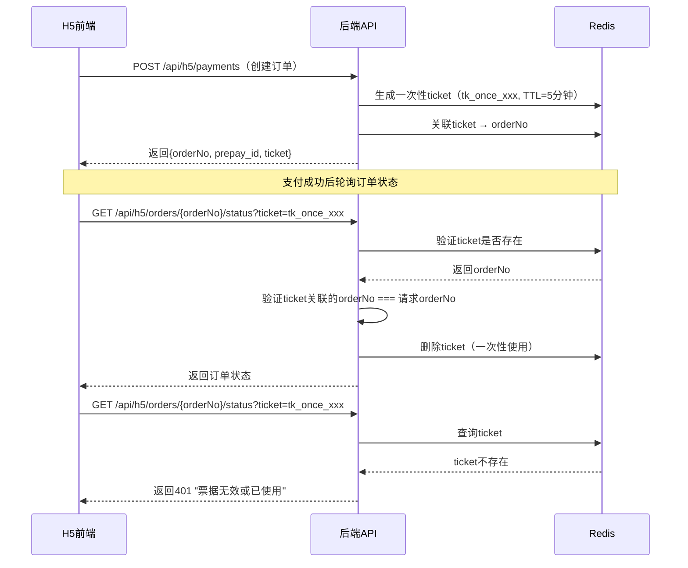

# 支付安全增强方案

> **文档目的**：详细说明微信支付的安全加固措施
> **对应决策**：设计优化决策文档 P1-3（支付安全增强）

---

## 📋 安全威胁分析

### 1. 潜在攻击场景

| 攻击类型 | 攻击手段 | 影响 | 防护级别 |
|---------|---------|------|---------|
| **重放攻击** | 截获并重复发送支付回调 | 重复入账、资金风险 | 🔴 P0 |
| **CSRF攻击** | 伪造OAuth授权请求 | 账号劫持 | 🔴 P0 |
| **订单枚举** | 猜测订单号规律 | 信息泄露 | 🟠 P1 |
| **Token窃取** | 窃取accessToken | 未授权操作 | 🟠 P1 |
| **中间人攻击** | 拦截HTTP请求 | 数据泄露 | 🟡 P2 |
| **支付页面劫持** | JS注入、钓鱼页面 | 资金损失 | 🟡 P2 |

---

## 🔒 阶段1：支付回调安全增强（P0，必须实现）

### 1.1 微信签名验证

**实现原理**：
```java
@Service
public class WechatPaySignatureValidator {

    @Value("${wechat.pay.api-key}")
    private String apiKey;

    /**
     * 验证微信支付回调签名
     *
     * @param params 回调参数（XML解析后的Map）
     * @return true=验证通过, false=签名错误
     */
    public boolean validateSign(Map<String, String> params) {
        // 1. 提取sign字段
        String receivedSign = params.get("sign");
        if (receivedSign == null || receivedSign.isEmpty()) {
            log.warn("Missing sign field in wechat payment callback");
            return false;
        }

        // 2. 移除sign字段（参与签名的字段不包含sign本身）
        Map<String, String> signParams = new TreeMap<>(params);
        signParams.remove("sign");

        // 3. 按字典序拼接参数
        StringBuilder sb = new StringBuilder();
        for (Map.Entry<String, String> entry : signParams.entrySet()) {
            if (entry.getValue() != null && !entry.getValue().isEmpty()) {
                sb.append(entry.getKey()).append("=").append(entry.getValue()).append("&");
            }
        }
        sb.append("key=").append(apiKey);

        // 4. MD5签名
        String calculatedSign = DigestUtils.md5Hex(sb.toString()).toUpperCase();

        // 5. 对比签名
        boolean valid = calculatedSign.equals(receivedSign);
        if (!valid) {
            log.error("Wechat pay signature validation failed. Expected: {}, Actual: {}",
                      calculatedSign, receivedSign);
        }
        return valid;
    }
}
```

**使用示例**：
```java
@PostMapping("/api/webhook/wechat/payment")
public String handlePaymentCallback(@RequestBody String xml) {
    Map<String, String> params = WechatXmlParser.parse(xml);

    // 第一步：验证签名
    if (!signatureValidator.validateSign(params)) {
        log.error("Invalid signature from wechat payment callback");
        sendSecurityAlert("支付回调签名验证失败", params);
        return "<xml><return_code>FAIL</return_code><return_msg>签名错误</return_msg></xml>";
    }

    // 继续处理业务逻辑...
}
```

---

### 1.2 时间窗口验证（防重放攻击）

**原理**：拒绝时间戳过旧的回调请求

**实现**：
```java
/**
 * 验证回调时间窗口（5分钟内有效）
 */
public boolean validateTimeWindow(Map<String, String> params) {
    String timeEndStr = params.get("time_end");  // 示例: 20251204123000
    if (timeEndStr == null || timeEndStr.isEmpty()) {
        return true;  // 如果微信未返回时间，跳过验证
    }

    try {
        LocalDateTime callbackTime = LocalDateTime.parse(
            timeEndStr,
            DateTimeFormatter.ofPattern("yyyyMMddHHmmss")
        );

        long minutesDiff = ChronoUnit.MINUTES.between(callbackTime, LocalDateTime.now());

        if (minutesDiff > 5) {
            log.warn("Payment callback time_end too old: {} minutes ago", minutesDiff);
            return false;
        }

        if (minutesDiff < -1) {  // 允许1分钟时钟误差
            log.warn("Payment callback time_end in the future: {} minutes", Math.abs(minutesDiff));
            return false;
        }

        return true;
    } catch (Exception e) {
        log.error("Failed to parse time_end: {}", timeEndStr, e);
        return false;
    }
}
```

---

### 1.3 Redis幂等性检查（分布式锁）

**原理**：使用Redis的`SETNX`命令实现分布式锁

**实现**：
```java
@Service
public class PaymentCallbackIdempotentService {

    @Autowired
    private StringRedisTemplate redisTemplate;

    /**
     * 尝试获取回调处理锁
     *
     * @param orderNo 订单号
     * @return true=获取成功（首次处理）, false=锁已存在（重复回调）
     */
    public boolean tryAcquireLock(String orderNo) {
        String lockKey = "payment:callback:" + orderNo;
        Boolean acquired = redisTemplate.opsForValue().setIfAbsent(
            lockKey,
            String.valueOf(System.currentTimeMillis()),
            10,  // 10分钟后自动释放（防止死锁）
            TimeUnit.MINUTES
        );

        if (Boolean.FALSE.equals(acquired)) {
            log.warn("Duplicate payment callback detected for orderNo: {}", orderNo);
            return false;
        }

        log.info("Payment callback lock acquired for orderNo: {}", orderNo);
        return true;
    }

    /**
     * 释放锁
     */
    public void releaseLock(String orderNo) {
        String lockKey = "payment:callback:" + orderNo;
        redisTemplate.delete(lockKey);
    }
}
```

**使用示例**：
```java
@Transactional(rollbackFor = Exception.class)
public void processPaymentCallback(Map<String, String> params) {
    String orderNo = params.get("out_trade_no");

    // 尝试获取锁
    if (!idempotentService.tryAcquireLock(orderNo)) {
        log.info("Duplicate callback, skip processing");
        return;  // 重复回调，直接返回成功
    }

    try {
        // 业务逻辑处理...
        updatePaymentRecord(orderNo);
    } finally {
        // 处理完成后释放锁
        idempotentService.releaseLock(orderNo);
    }
}
```

---

### 1.4 数据库唯一约束

**防止并发场景下的重复入账**：

```sql
-- payment_record表唯一约束
ALTER TABLE payment_record
ADD CONSTRAINT uk_order_no UNIQUE (order_no);

-- 如果需要更新订单状态，使用乐观锁
ALTER TABLE payment_record
ADD COLUMN version INT DEFAULT 0;
```

**乐观锁示例**：
```java
@Update("UPDATE payment_record SET pay_status = #{payStatus}, version = version + 1 " +
        "WHERE order_no = #{orderNo} AND pay_status = 'PENDING' AND version = #{version}")
int updatePayStatusWithOptimisticLock(@Param("orderNo") String orderNo,
                                       @Param("payStatus") String payStatus,
                                       @Param("version") int version);
```

---

## 🔐 阶段2：一次性Ticket机制（P1，推荐实现）

### 2.1 设计原理

**问题**：accessToken可重复使用，存在安全风险

**解决方案**：引入一次性ticket机制

**流程**：


### 2.2 实现代码

**生成ticket**：
```java
@Service
public class OneTimeTicketService {

    @Autowired
    private StringRedisTemplate redisTemplate;

    /**
     * 生成一次性ticket
     *
     * @param orderNo 订单号
     * @return ticket字符串
     */
    public String generateTicket(String orderNo) {
        String ticket = "tk_once_" + UUID.randomUUID().toString();
        String key = "ticket:" + ticket;

        // 存入Redis，5分钟有效
        redisTemplate.opsForValue().set(
            key,
            orderNo,
            5,
            TimeUnit.MINUTES
        );

        log.info("Generated one-time ticket: {} for orderNo: {}", ticket, orderNo);
        return ticket;
    }

    /**
     * 验证并消费ticket
     *
     * @param ticket 票据
     * @param expectedOrderNo 期望的订单号
     * @return true=验证通过, false=验证失败
     */
    public boolean validateAndConsumeTicket(String ticket, String expectedOrderNo) {
        String key = "ticket:" + ticket;

        // 获取并删除（原子操作）
        String actualOrderNo = redisTemplate.opsForValue().getAndDelete(key);

        if (actualOrderNo == null) {
            log.warn("Ticket not found or already used: {}", ticket);
            return false;
        }

        if (!actualOrderNo.equals(expectedOrderNo)) {
            log.error("Ticket orderNo mismatch. Expected: {}, Actual: {}",
                      expectedOrderNo, actualOrderNo);
            // 恢复ticket（订单号不匹配视为攻击）
            redisTemplate.opsForValue().set(key, actualOrderNo, 1, TimeUnit.MINUTES);
            return false;
        }

        log.info("Ticket validated and consumed: {}", ticket);
        return true;
    }
}
```

**使用示例**：
```java
// 创建订单时生成ticket
@PostMapping("/api/h5/payments")
public Result<PaymentResponse> createPayment(@RequestBody PaymentRequest request) {
    // ... 创建订单逻辑 ...

    String ticket = ticketService.generateTicket(orderNo);

    return Result.success(PaymentResponse.builder()
        .orderNo(orderNo)
        .prepayId(prepayId)
        .ticket(ticket)  // 返回ticket给前端
        .build());
}

// 查询订单状态时验证ticket
@GetMapping("/api/h5/orders/{orderNo}/status")
public Result<OrderStatusResponse> queryOrderStatus(
        @PathVariable String orderNo,
        @RequestParam String ticket) {

    // 验证并消费ticket
    if (!ticketService.validateAndConsumeTicket(ticket, orderNo)) {
        throw new BusinessException(401, "票据无效或已使用，请刷新页面");
    }

    // 查询订单状态...
}
```

---

## 🛡️ 阶段3：前端失败补偿（P2，增强体验）

### 3.1 支付失败处理

**前端代码**：
```javascript
// H5前端：支付页面
async function handlePayment() {
  try {
    // 调用微信支付
    await wx.chooseWXPay({
      ...payParams,
      success: async function(res) {
        console.log('支付成功', res);
        // 轮询订单状态
        await pollOrderStatus();
      },
      fail: async function(err) {
        console.error('支付失败', err);

        if (err.errMsg === 'chooseWXPay:cancel') {
          // 用户主动取消
          showResumePaymentButton();
        } else {
          // 网络错误或其他异常
          // 仍然轮询订单状态（可能已支付成功）
          const status = await checkOrderStatus();

          if (status.payStatus !== 'SUCCESS') {
            showResumePaymentButton();
          }
        }
      }
    });
  } catch (error) {
    console.error('调起支付失败', error);
    showToast('支付失败，请重试');
  }
}

// 显示"继续支付"按钮
function showResumePaymentButton() {
  Dialog.confirm({
    title: '支付未完成',
    message: '您可以继续完成支付，或稍后在"我的订单"中继续',
    confirmButtonText: '继续支付',
    cancelButtonText: '稍后支付'
  }).then(() => {
    // 调用恢复支付接口
    resumePayment();
  });
}
```

### 3.2 支付恢复接口

**后端接口**：`POST /api/h5/payments/{orderNo}/resume`

**实现**：
```java
@PostMapping("/api/h5/payments/{orderNo}/resume")
public Result<ResumePaymentResponse> resumePayment(@PathVariable String orderNo) {
    // 1. 查询订单
    PaymentRecord record = paymentRecordMapper.selectOne(
        new LambdaQueryWrapper<PaymentRecord>()
            .eq(PaymentRecord::getOrderNo, orderNo)
    );

    if (record == null) {
        throw new BusinessException("订单不存在");
    }

    // 2. 验证订单状态
    if (!PayStatus.PENDING.equals(record.getPayStatus())) {
        throw new BusinessException("订单状态异常，无法继续支付");
    }

    // 3. 验证订单有效期（30分钟内）
    if (record.getCreatedAt().plusMinutes(30).isBefore(LocalDateTime.now())) {
        throw new BusinessException("订单已过期，请重新下单");
    }

    // 4. 重新生成prepay_id（原prepay_id已过期）
    String newPrepayId = wechatPayManager.createOrder(
        orderNo,
        record.getAmount(),
        record.getCampName()
    );

    // 5. 生成新的签名
    Map<String, String> payParams = wechatPayManager.generatePayParams(newPrepayId);

    return Result.success(ResumePaymentResponse.builder()
        .orderNo(orderNo)
        .prepayId(newPrepayId)
        .payParams(payParams)
        .build());
}
```

---

## 🚨 安全告警机制

### 4.1 企业微信告警

**触发场景**：
- 签名验证失败
- 重放攻击检测到
- 异常高频回调
- accessToken/ticket异常使用

**实现**：
```java
@Service
public class SecurityAlertService {

    @Autowired
    private WeworkNotifyManager weworkNotifyManager;

    /**
     * 发送安全告警
     */
    public void sendSecurityAlert(String alertType, Map<String, Object> details) {
        String message = buildAlertMessage(alertType, details);

        // 发送企业微信通知
        weworkNotifyManager.sendTextMessage(
            message,
            "@all"  // 通知所有管理员
        );

        // 记录告警日志
        SecurityAlertLog log = new SecurityAlertLog();
        log.setAlertType(alertType);
        log.setDetails(JSON.toJSONString(details));
        log.setSeverity("HIGH");
        securityAlertLogMapper.insert(log);
    }

    private String buildAlertMessage(String alertType, Map<String, Object> details) {
        return String.format(
            "【安全告警】%s\n" +
            "时间: %s\n" +
            "详情: %s\n" +
            "请立即检查系统日志",
            alertType,
            LocalDateTime.now().format(DateTimeFormatter.ofPattern("yyyy-MM-dd HH:mm:ss")),
            details
        );
    }
}
```

---

## 📊 安全监控指标

### 5.1 关键指标

| 指标 | 阈值 | 告警级别 |
|------|------|---------|
| 签名验证失败率 | >1% | 🔴 P0 |
| 重复回调次数 | >10次/分钟 | 🟠 P1 |
| Ticket验证失败率 | >5% | 🟠 P1 |
| 订单枚举尝试 | >100次/小时 | 🟡 P2 |
| accessToken异常使用 | >50次/小时 | 🟡 P2 |

### 5.2 Prometheus指标采集

```java
@Component
public class PaymentSecurityMetrics {

    private final Counter signatureFailureCounter;
    private final Counter duplicateCallbackCounter;
    private final Counter ticketValidationFailureCounter;

    public PaymentSecurityMetrics(MeterRegistry registry) {
        this.signatureFailureCounter = Counter.builder("payment.signature.failure")
            .description("微信支付签名验证失败次数")
            .register(registry);

        this.duplicateCallbackCounter = Counter.builder("payment.callback.duplicate")
            .description("重复支付回调次数")
            .register(registry);

        this.ticketValidationFailureCounter = Counter.builder("payment.ticket.validation.failure")
            .description("Ticket验证失败次数")
            .register(registry);
    }

    public void recordSignatureFailure() {
        signatureFailureCounter.increment();
    }

    public void recordDuplicateCallback() {
        duplicateCallbackCounter.increment();
    }

    public void recordTicketValidationFailure() {
        ticketValidationFailureCounter.increment();
    }
}
```

---

## ✅ 实施清单

### 阶段1：支付回调安全（必须实现）

- [ ] **P0-1**: 实现微信签名验证
- [ ] **P0-2**: 实现时间窗口验证
- [ ] **P0-3**: 实现Redis分布式锁（幂等性）
- [ ] **P0-4**: 添加数据库唯一约束
- [ ] **P0-5**: 实现签名验证失败告警

### 阶段2：一次性Ticket（推荐实现）

- [ ] **P1-1**: 实现ticket生成服务
- [ ] **P1-2**: 实现ticket验证与消费
- [ ] **P1-3**: 前端改造（支持ticket参数）
- [ ] **P1-4**: 编写单元测试

### 阶段3：前端失败补偿（增强体验）

- [ ] **P2-1**: 实现支付恢复接口
- [ ] **P2-2**: 前端支付失败处理逻辑
- [ ] **P2-3**: 前端"继续支付"功能
- [ ] **P2-4**: 订单有效期管理

### 阶段4：监控与告警

- [ ] **P2-5**: 集成Prometheus指标采集
- [ ] **P2-6**: 配置Grafana告警规则
- [ ] **P2-7**: 企业微信告警接入
- [ ] **P2-8**: 安全日志审计

---

## 📚 相关文档

- [接口文档 - 3.9 支付恢复接口](./接口文档.md)
- [技术方案 - 5.2.8 异常处理](./技术方案.md)
- [OAuth绑定完整时序图](./OAuth绑定完整时序图.md)

---

**文档版本**：v1.0
**最后更新**：2025-12-04
**维护者**：技术架构组 + 安全团队
