# 知识星球训练营自动押金退款系统 - 数据库设计文档

## 文档信息
- **文档版本**：v1.0
- **创建日期**：2025-10-24
- **数据库类型**：PostgreSQL 15+
- **字符集**：UTF-8

---

## 一、数据库设计原则

1. **命名规范**：
   - 表名：小写 + 下划线分隔（如：`training_camp`）
   - 字段名：小写 + 下划线分隔（如：`created_at`）
   - 索引名：`idx_表名_字段名`
   - 外键名：`fk_表名_关联表名`

2. **通用字段**：
   - `id`：主键，BIGSERIAL
   - `created_at`：创建时间，TIMESTAMP
   - `updated_at`：更新时间，TIMESTAMP
   - `deleted_at`：删除时间，TIMESTAMP（软删除）

3. **数据类型选择**：
   - 金额：DECIMAL(10,2)
   - 日期：DATE
   - 时间戳：TIMESTAMP
   - JSON数据：JSONB
   - 文本：VARCHAR(长度) 或 TEXT

---

## 二、ER图

```mermaid
erDiagram
    %% ==================== 核心业务表 ====================
    training_camp ||--o{ camp_member : "包含"
    training_camp ||--o{ payment_mapping : "关联"
    training_camp ||--o{ camp_status_log : "状态变更"
    training_camp ||--o{ checkin_record : "打卡"
    training_camp ||--o{ camp_member_relation : "人员关系"

    camp_member }o--|| planet_user : "匹配"
    camp_member ||--o{ payment_record : "支付"
    camp_member ||--o{ checkin_record : "打卡"
    camp_member ||--o{ member_status_log : "状态变更"
    camp_member ||--o{ refund_record : "退款"

    planet_user ||--o{ checkin_record : "打卡"

    payment_record ||--o{ refund_record : "退款"
    payment_record ||--o{ order_status_log : "状态变更"
    payment_record ||--o| payment_mapping : "映射"

    payment_mapping ||--o{ payment_mapping_status_log : "状态变更"

    refund_record ||--o{ refund_status_log : "状态变更"

    %% ==================== 系统管理表 ====================
    system_user ||--o{ operation_log : "操作"
    system_user ||--o{ camp_member_relation : "参与"
    system_user ||--o{ camp_status_log : "操作"
    system_user ||--o{ refund_status_log : "审核"
    system_user ||--o{ payment_mapping_status_log : "人工绑定"
    system_user ||--o{ refund_record : "审核"

    %% ==================== 通知表 ====================
    training_camp ||--o{ notification_message : "通知"
    camp_member ||--o{ notification_message : "接收"

    %% ==================== 表结构定义 ====================
    training_camp {
        bigserial id PK
        varchar name "训练营名称"
        decimal deposit "押金金额"
        date start_date "开始日期"
        date end_date "结束日期"
        int required_days "要求打卡天数"
        varchar status "状态"
        varchar planet_project_id "星球项目ID"
    }

    camp_member {
        bigserial id PK
        bigint camp_id FK
        bigint planet_user_id FK
        varchar filled_planet_nickname "填写的星球昵称"
        varchar match_status "匹配状态"
        int checkin_count "已打卡天数"
        boolean eligible_for_refund "是否符合退款"
    }

    planet_user {
        bigserial id PK
        varchar planet_user_id UK "星球用户ID"
        varchar planet_nickname "星球昵称"
        varchar wechat_nickname "微信昵称"
    }

    payment_record {
        bigserial id PK
        varchar order_no UK "订单号"
        bigint camp_id FK
        bigint member_id FK
        decimal pay_amount "支付金额"
        varchar pay_status "支付状态"
        varchar bind_status "绑定状态"
    }

    payment_mapping {
        bigserial id PK
        varchar out_trade_no UK "商户订单号"
        bigint camp_id FK
        varchar planet_user_id "星球用户ID"
        varchar bind_status "绑定状态"
        varchar bind_method "绑定方式"
    }

    refund_record {
        bigserial id PK
        bigint camp_id FK
        bigint member_id FK
        bigint payment_id FK
        decimal refund_amount "退款金额"
        varchar refund_status "退款状态"
        varchar audit_status "审核状态"
    }

    checkin_record {
        bigserial id PK
        bigint camp_id FK
        bigint planet_user_id FK
        date checkin_date "打卡日期"
        timestamp checkin_time "打卡时间"
    }

    system_user {
        bigserial id PK
        varchar username UK "用户名"
        varchar role "角色"
        varchar status "状态"
    }

    camp_member_relation {
        bigserial id PK
        bigint camp_id FK
        bigint user_id FK
        varchar role_type "角色类型"
    }

    operation_log {
        bigserial id PK
        bigint operator_id FK
        varchar operation_type "操作类型"
        text operation_desc "操作描述"
    }

    system_config {
        bigserial id PK
        varchar config_key UK "配置键"
        text config_value "配置值"
        varchar group_name "分组"
    }

    notification_message {
        bigserial id PK
        varchar recipient_type "接收者类型"
        bigint recipient_id "接收者ID"
        varchar message_type "消息类型"
        varchar send_status "发送状态"
    }

    %% ==================== 状态日志表 ====================
    camp_status_log {
        bigserial id PK
        bigint camp_id FK
        varchar from_status "原状态"
        varchar to_status "新状态"
        varchar event "触发事件"
    }

    payment_mapping_status_log {
        bigserial id PK
        bigint mapping_id FK
        varchar from_status "原状态"
        varchar to_status "新状态"
        varchar event "触发事件"
    }

    order_status_log {
        bigserial id PK
        bigint order_id FK
        varchar from_status "原状态"
        varchar to_status "新状态"
        varchar event "触发事件"
    }

    refund_status_log {
        bigserial id PK
        bigint refund_id FK
        varchar from_status "原状态"
        varchar to_status "新状态"
        varchar event "触发事件"
    }

    member_status_log {
        bigserial id PK
        bigint member_id FK
        bigint camp_id FK
        varchar from_status "原状态"
        varchar to_status "新状态"
        varchar event "触发事件"
    }
```



**表清单汇总**：

| 分类 | 表名 | 说明 |
|------|------|------|
| **核心业务表** | training_camp | 训练营 |
| | camp_member | 训练营会员 |
| | planet_user | 知识星球用户 |
| | payment_record | 支付记录 |
| | refund_record | 退款记录 |
| | checkin_record | 打卡记录 |
| | payment_mapping | 支付映射（新增） |
| **系统管理表** | system_user | 系统用户 |
| | system_config | 系统配置 |
| | operation_log | 操作日志 |
| | camp_member_relation | 训练营人员关系 |
| **状态日志表** | camp_status_log | 训练营状态日志（新增） |
| | payment_mapping_status_log | 支付映射状态日志（新增） |
| | order_status_log | 订单状态日志（新增） |
| | refund_status_log | 退款状态日志（新增） |
| | member_status_log | 会员状态日志（新增） |
| **通知表** | notification_message | 通知消息（新增） |

---

## 三、核心表设计

### 3.1 训练营表（training_camp）

**表说明**：存储训练营基本信息

```sql
CREATE TABLE training_camp (
    id BIGSERIAL PRIMARY KEY,

    -- 基本信息
    name VARCHAR(100) NOT NULL COMMENT '训练营名称',
    poster_url VARCHAR(500) NOT NULL COMMENT '项目海报URL',
    description TEXT COMMENT '项目介绍',

    -- 金额信息
    deposit DECIMAL(10,2) NOT NULL COMMENT '押金金额',

    -- 时间信息
    start_date DATE NOT NULL COMMENT '开始日期',
    end_date DATE NOT NULL COMMENT '结束日期',

    -- 打卡要求
    total_days INTEGER NOT NULL COMMENT '总天数',
    required_days INTEGER NOT NULL COMMENT '要求打卡天数',

    -- 群信息
    group_qrcode_url VARCHAR(500) NOT NULL COMMENT '群二维码URL',

    -- 关联信息
    planet_project_id VARCHAR(50) NOT NULL COMMENT '知识星球项目ID',
    wechat_pay_code_id VARCHAR(50) NOT NULL COMMENT '企业微信收款码ID',

    -- 状态
    status VARCHAR(20) NOT NULL DEFAULT 'not_started'
        COMMENT '状态: not_started-未开始, ongoing-进行中, finished-已结束',

    -- H5链接
    enroll_url VARCHAR(500) COMMENT 'H5报名链接',

    -- 统计字段（冗余，提升查询性能）
    member_count INTEGER DEFAULT 0 COMMENT '报名人数',
    paid_amount DECIMAL(10,2) DEFAULT 0 COMMENT '已收押金总额',
    refunded_amount DECIMAL(10,2) DEFAULT 0 COMMENT '已退押金总额',

    -- 通用字段
    created_at TIMESTAMP NOT NULL DEFAULT CURRENT_TIMESTAMP,
    updated_at TIMESTAMP NOT NULL DEFAULT CURRENT_TIMESTAMP,
    deleted_at TIMESTAMP COMMENT '软删除时间',

    CONSTRAINT chk_camp_dates CHECK (end_date >= start_date),
    CONSTRAINT chk_camp_days CHECK (required_days <= total_days AND required_days > 0)
);

-- 索引
CREATE INDEX idx_camp_status ON training_camp(status) WHERE deleted_at IS NULL;
CREATE INDEX idx_camp_dates ON training_camp(start_date, end_date) WHERE deleted_at IS NULL;
CREATE INDEX idx_camp_planet_id ON training_camp(planet_project_id);

-- 注释
COMMENT ON TABLE training_camp IS '训练营表';
COMMENT ON COLUMN training_camp.status IS '状态: not_started, ongoing, finished';
```

---

### 3.2 训练营人员关系表（camp_member_relation）

**表说明**：训练营与教练、志愿者的关系

```sql
CREATE TABLE camp_member_relation (
    id BIGSERIAL PRIMARY KEY,

    camp_id BIGINT NOT NULL COMMENT '训练营ID',
    user_id BIGINT NOT NULL COMMENT '用户ID（教练或志愿者）',
    role_type VARCHAR(20) NOT NULL COMMENT '角色类型: coach-教练, volunteer-志愿者',

    created_at TIMESTAMP NOT NULL DEFAULT CURRENT_TIMESTAMP,

    CONSTRAINT fk_cmr_camp FOREIGN KEY (camp_id) REFERENCES training_camp(id),
    CONSTRAINT fk_cmr_user FOREIGN KEY (user_id) REFERENCES system_user(id),
    UNIQUE(camp_id, user_id, role_type)
);

-- 索引
CREATE INDEX idx_cmr_camp ON camp_member_relation(camp_id);
CREATE INDEX idx_cmr_user ON camp_member_relation(user_id);

COMMENT ON TABLE camp_member_relation IS '训练营人员关系表';
```

---

### 3.3 知识星球用户表（planet_user）

**表说明**：存储知识星球用户信息（用于匹配）

```sql
CREATE TABLE planet_user (
    id BIGSERIAL PRIMARY KEY,

    -- 知识星球信息
    planet_user_id VARCHAR(50) NOT NULL UNIQUE COMMENT '知识星球用户ID',
    planet_nickname VARCHAR(100) COMMENT '知识星球昵称',

    -- 微信信息
    wechat_nickname VARCHAR(100) COMMENT '微信昵称',

    -- 统计信息
    total_camps INTEGER DEFAULT 0 COMMENT '参与训练营总数',
    total_checkins INTEGER DEFAULT 0 COMMENT '总打卡次数',

    created_at TIMESTAMP NOT NULL DEFAULT CURRENT_TIMESTAMP,
    updated_at TIMESTAMP NOT NULL DEFAULT CURRENT_TIMESTAMP,
    deleted_at TIMESTAMP
);

-- 索引
CREATE INDEX idx_planet_user_id ON planet_user(planet_user_id) WHERE deleted_at IS NULL;
CREATE INDEX idx_planet_nickname ON planet_user(planet_nickname) WHERE deleted_at IS NULL;

COMMENT ON TABLE planet_user IS '知识星球用户表';
```

---

### 3.4 训练营会员表（camp_member）

**表说明**：会员与训练营的关系，核心业务表

```sql
CREATE TABLE camp_member (
    id BIGSERIAL PRIMARY KEY,

    -- 关联信息
    camp_id BIGINT NOT NULL COMMENT '训练营ID',
    planet_user_id BIGINT COMMENT '知识星球用户ID（匹配成功后填充）',

    -- 填写的信息
    filled_planet_nickname VARCHAR(100) NOT NULL COMMENT '填写的星球昵称',
    filled_planet_user_id VARCHAR(50) NOT NULL COMMENT '填写的星球ID',
    filled_wechat_nickname VARCHAR(100) NOT NULL COMMENT '填写的微信昵称',

    -- 匹配信息
    match_status VARCHAR(20) NOT NULL DEFAULT 'pending'
        COMMENT '匹配状态: pending-待匹配, matched-已匹配, failed-匹配失败',
    match_confidence INTEGER DEFAULT 0 COMMENT '匹配置信度: 100/66/33/0',
    match_time TIMESTAMP COMMENT '匹配时间',

    -- 进群状态
    joined_group BOOLEAN DEFAULT FALSE COMMENT '是否已进群',
    joined_at TIMESTAMP COMMENT '进群时间',

    -- 打卡统计（冗余字段，定时更新）
    checkin_count INTEGER DEFAULT 0 COMMENT '已打卡天数',
    checkin_rate DECIMAL(5,2) DEFAULT 0 COMMENT '打卡完成率(%)',
    last_checkin_time TIMESTAMP COMMENT '最后打卡时间',

    -- 退款资格
    eligible_for_refund BOOLEAN DEFAULT FALSE COMMENT '是否符合退款条件',

    created_at TIMESTAMP NOT NULL DEFAULT CURRENT_TIMESTAMP,
    updated_at TIMESTAMP NOT NULL DEFAULT CURRENT_TIMESTAMP,
    deleted_at TIMESTAMP,

    CONSTRAINT fk_cm_camp FOREIGN KEY (camp_id) REFERENCES training_camp(id),
    CONSTRAINT fk_cm_planet_user FOREIGN KEY (planet_user_id) REFERENCES planet_user(id),
    UNIQUE(camp_id, filled_planet_user_id)  -- 同一训练营同一星球ID只能报名一次
);

-- 索引
CREATE INDEX idx_cm_camp ON camp_member(camp_id) WHERE deleted_at IS NULL;
CREATE INDEX idx_cm_planet_user ON camp_member(planet_user_id) WHERE deleted_at IS NULL;
CREATE INDEX idx_cm_match_status ON camp_member(match_status) WHERE deleted_at IS NULL;
CREATE INDEX idx_cm_refund_eligible ON camp_member(eligible_for_refund) WHERE deleted_at IS NULL;

COMMENT ON TABLE camp_member IS '训练营会员表';
COMMENT ON COLUMN camp_member.match_status IS 'pending-待匹配, matched-已匹配, failed-匹配失败';
COMMENT ON COLUMN camp_member.match_confidence IS '100-完全匹配, 66-昵称匹配, 33-微信名匹配, 0-未匹配';
```

---

### 3.5 支付记录表（payment_record）

**表说明**：支付流水记录

```sql
CREATE TABLE payment_record (
    id BIGSERIAL PRIMARY KEY,

    -- 订单信息
    order_no VARCHAR(50) NOT NULL UNIQUE COMMENT '订单号（唯一）',

    -- 关联信息
    camp_id BIGINT NOT NULL COMMENT '训练营ID',
    member_id BIGINT COMMENT '会员ID（支付成功后关联）',

    -- 支付信息
    pay_amount DECIMAL(10,2) NOT NULL COMMENT '支付金额',
    pay_status VARCHAR(20) NOT NULL DEFAULT 'pending'
        COMMENT '支付状态: pending-待支付, success-成功, failed-失败',
    pay_time TIMESTAMP COMMENT '支付时间',

    -- 企业微信支付信息
    wechat_order_no VARCHAR(100) COMMENT '企业微信订单号',
    wechat_transaction_id VARCHAR(100) COMMENT '微信支付交易号',
    payer_wechat_name VARCHAR(100) COMMENT '付款人微信名',

    -- 支付映射绑定信息（新增 - 混合匹配方案）
    bind_status VARCHAR(20) DEFAULT 'pending'
        COMMENT '绑定状态: pending-待绑定, completed-已绑定, expired-已过期, manual_required-需人工处理, closed-已关闭',
    bind_method VARCHAR(20)
        COMMENT '绑定方式: dynamic_qrcode-动态二维码, user_fill-用户填写, smart_match-智能匹配, manual-人工绑定',
    bind_deadline TIMESTAMP COMMENT '绑定截止时间（7天后）',
    planet_user_id_from_attach VARCHAR(50) COMMENT '从attach解析的星球用户ID',

    -- 回调信息
    callback_data JSONB COMMENT '支付回调原始数据',

    created_at TIMESTAMP NOT NULL DEFAULT CURRENT_TIMESTAMP,
    updated_at TIMESTAMP NOT NULL DEFAULT CURRENT_TIMESTAMP,
    deleted_at TIMESTAMP
);

-- 索引
CREATE INDEX idx_pr_order_no ON payment_record(order_no);
CREATE INDEX idx_pr_camp ON payment_record(camp_id) WHERE deleted_at IS NULL;
CREATE INDEX idx_pr_member ON payment_record(member_id) WHERE deleted_at IS NULL;
CREATE INDEX idx_pr_status ON payment_record(pay_status) WHERE deleted_at IS NULL;
CREATE INDEX idx_pr_pay_time ON payment_record(pay_time) WHERE deleted_at IS NULL;
CREATE INDEX idx_pr_bind_status ON payment_record(bind_status) WHERE deleted_at IS NULL;
CREATE INDEX idx_pr_bind_deadline ON payment_record(bind_deadline) WHERE bind_status = 'pending' AND deleted_at IS NULL;

COMMENT ON TABLE payment_record IS '支付记录表';
COMMENT ON COLUMN payment_record.pay_status IS 'pending-待支付, success-成功, failed-失败';
```

---

### 3.6 打卡记录表（checkin_record）

**表说明**：会员打卡记录（从知识星球同步）

```sql
CREATE TABLE checkin_record (
    id BIGSERIAL PRIMARY KEY,

    -- 关联信息
    camp_id BIGINT NOT NULL COMMENT '训练营ID',
    planet_user_id BIGINT NOT NULL COMMENT '知识星球用户ID',
    member_id BIGINT COMMENT '会员ID（匹配后关联）',

    -- 打卡信息
    checkin_date DATE NOT NULL COMMENT '打卡日期',
    checkin_time TIMESTAMP NOT NULL COMMENT '打卡时间',
    checkin_content TEXT COMMENT '打卡内容',

    -- 知识星球原始数据
    planet_checkin_id VARCHAR(50) COMMENT '知识星球打卡ID',
    raw_data JSONB COMMENT '原始数据',

    -- 同步信息
    synced_at TIMESTAMP NOT NULL DEFAULT CURRENT_TIMESTAMP COMMENT '同步时间',

    created_at TIMESTAMP NOT NULL DEFAULT CURRENT_TIMESTAMP,

    CONSTRAINT fk_cr_camp FOREIGN KEY (camp_id) REFERENCES training_camp(id),
    CONSTRAINT fk_cr_planet_user FOREIGN KEY (planet_user_id) REFERENCES planet_user(id),
    CONSTRAINT fk_cr_member FOREIGN KEY (member_id) REFERENCES camp_member(id),
    UNIQUE(camp_id, planet_user_id, checkin_date)  -- 同一天只能打卡一次
);

-- 索引
CREATE INDEX idx_cr_camp ON checkin_record(camp_id);
CREATE INDEX idx_cr_planet_user ON checkin_record(planet_user_id);
CREATE INDEX idx_cr_member ON checkin_record(member_id);
CREATE INDEX idx_cr_date ON checkin_record(checkin_date);
CREATE INDEX idx_cr_camp_date ON checkin_record(camp_id, checkin_date);

COMMENT ON TABLE checkin_record IS '打卡记录表';
```

---

### 3.7 退款记录表（refund_record）

**表说明**：退款流程记录

```sql
CREATE TABLE refund_record (
    id BIGSERIAL PRIMARY KEY,

    -- 关联信息
    camp_id BIGINT NOT NULL COMMENT '训练营ID',
    member_id BIGINT NOT NULL COMMENT '会员ID',
    payment_id BIGINT NOT NULL COMMENT '支付记录ID',

    -- 退款信息
    refund_amount DECIMAL(10,2) NOT NULL COMMENT '退款金额',
    refund_status VARCHAR(20) NOT NULL DEFAULT 'pending'
        COMMENT '退款状态: pending-待审核, approved-审核通过, rejected-审核拒绝, processing-退款中, success-退款成功, failed-退款失败',

    -- 审核信息
    audit_status VARCHAR(20) NOT NULL DEFAULT 'pending'
        COMMENT '审核状态: pending-待审核, approved-通过, rejected-拒绝',
    auditor_id BIGINT COMMENT '审核人ID',
    audit_time TIMESTAMP COMMENT '审核时间',
    audit_comment TEXT COMMENT '审核备注',

    -- 执行信息
    execute_time TIMESTAMP COMMENT '退款执行时间',
    wechat_refund_id VARCHAR(100) COMMENT '微信退款单号',

    -- 失败信息
    failure_reason TEXT COMMENT '失败原因',
    retry_count INTEGER DEFAULT 0 COMMENT '重试次数',
    last_retry_time TIMESTAMP COMMENT '最后重试时间',

    -- 通知状态
    notified BOOLEAN DEFAULT FALSE COMMENT '是否已通知会员',
    notify_time TIMESTAMP COMMENT '通知时间',

    created_at TIMESTAMP NOT NULL DEFAULT CURRENT_TIMESTAMP,
    updated_at TIMESTAMP NOT NULL DEFAULT CURRENT_TIMESTAMP,
    deleted_at TIMESTAMP,

    CONSTRAINT fk_rr_camp FOREIGN KEY (camp_id) REFERENCES training_camp(id),
    CONSTRAINT fk_rr_member FOREIGN KEY (member_id) REFERENCES camp_member(id),
    CONSTRAINT fk_rr_payment FOREIGN KEY (payment_id) REFERENCES payment_record(id),
    CONSTRAINT fk_rr_auditor FOREIGN KEY (auditor_id) REFERENCES system_user(id)
);

-- 索引
CREATE INDEX idx_rr_camp ON refund_record(camp_id) WHERE deleted_at IS NULL;
CREATE INDEX idx_rr_member ON refund_record(member_id) WHERE deleted_at IS NULL;
CREATE INDEX idx_rr_status ON refund_record(refund_status) WHERE deleted_at IS NULL;
CREATE INDEX idx_rr_audit ON refund_record(audit_status) WHERE deleted_at IS NULL AND audit_status = 'pending';

COMMENT ON TABLE refund_record IS '退款记录表';
COMMENT ON COLUMN refund_record.refund_status IS 'pending-待审核, approved-审核通过, rejected-审核拒绝, processing-退款中, success-退款成功, failed-退款失败';
```

---

### 3.8 系统用户表（system_user）

**表说明**：管理员、教练、志愿者账号

```sql
CREATE TABLE system_user (
    id BIGSERIAL PRIMARY KEY,

    -- 登录信息
    username VARCHAR(50) NOT NULL UNIQUE COMMENT '用户名（登录账号）',
    password VARCHAR(255) NOT NULL COMMENT '密码（BCrypt加密）',

    -- 基本信息
    real_name VARCHAR(50) COMMENT '真实姓名',

    -- 角色
    role VARCHAR(20) NOT NULL COMMENT '角色: admin-超级管理员, manager-管理员, coach-教练, volunteer-志愿者',

    -- 状态
    status VARCHAR(20) NOT NULL DEFAULT 'active' COMMENT '状态: active-启用, disabled-禁用',

    -- 登录信息
    last_login_ip VARCHAR(50) COMMENT '最后登录IP',
    last_login_time TIMESTAMP COMMENT '最后登录时间',

    created_at TIMESTAMP NOT NULL DEFAULT CURRENT_TIMESTAMP,
    updated_at TIMESTAMP NOT NULL DEFAULT CURRENT_TIMESTAMP,
    deleted_at TIMESTAMP
);

-- 索引
CREATE INDEX idx_su_username ON system_user(username) WHERE deleted_at IS NULL;
CREATE INDEX idx_su_role ON system_user(role) WHERE deleted_at IS NULL;

COMMENT ON TABLE system_user IS '系统用户表';
COMMENT ON COLUMN system_user.role IS 'admin-超级管理员, manager-管理员, coach-教练, volunteer-志愿者';
```

---

### 3.9 操作日志表（operation_log）

**表说明**：记录所有敏感操作

```sql
CREATE TABLE operation_log (
    id BIGSERIAL PRIMARY KEY,

    -- 操作人
    operator_id BIGINT NOT NULL COMMENT '操作人ID',
    operator_name VARCHAR(50) NOT NULL COMMENT '操作人姓名',

    -- 操作信息
    operation_type VARCHAR(50) NOT NULL COMMENT '操作类型',
    operation_desc TEXT NOT NULL COMMENT '操作描述',

    -- 操作对象
    target_type VARCHAR(50) COMMENT '操作对象类型（如：训练营、会员）',
    target_id BIGINT COMMENT '操作对象ID',
    target_name VARCHAR(200) COMMENT '操作对象名称',

    -- 请求信息
    request_url VARCHAR(500) COMMENT '请求URL',
    request_method VARCHAR(10) COMMENT '请求方法',
    request_params TEXT COMMENT '请求参数',

    -- 网络信息
    ip_address VARCHAR(50) COMMENT 'IP地址',
    user_agent TEXT COMMENT 'User Agent',

    -- 执行结果
    success BOOLEAN NOT NULL COMMENT '是否成功',
    error_message TEXT COMMENT '错误信息',

    -- 时间信息
    execute_time INTEGER COMMENT '执行耗时（毫秒）',
    created_at TIMESTAMP NOT NULL DEFAULT CURRENT_TIMESTAMP,

    CONSTRAINT fk_ol_operator FOREIGN KEY (operator_id) REFERENCES system_user(id)
);

-- 索引
CREATE INDEX idx_ol_operator ON operation_log(operator_id);
CREATE INDEX idx_ol_type ON operation_log(operation_type);
CREATE INDEX idx_ol_target ON operation_log(target_type, target_id);
CREATE INDEX idx_ol_time ON operation_log(created_at);

COMMENT ON TABLE operation_log IS '操作日志表';

-- 示例操作类型
-- CREATE_CAMP: 创建训练营
-- UPDATE_CAMP: 修改训练营
-- DELETE_CAMP: 删除训练营
-- MANUAL_MATCH: 手动匹配会员
-- MARK_JOINED: 标记进群
-- APPROVE_REFUND: 审核通过退款
-- REJECT_REFUND: 拒绝退款
-- RETRY_REFUND: 重试退款
-- UPDATE_CONFIG: 修改系统配置
```

---

### 3.10 系统配置表（system_config）

**表说明**：存储系统配置信息

```sql
CREATE TABLE system_config (
    id BIGSERIAL PRIMARY KEY,

    -- 配置项
    config_key VARCHAR(100) NOT NULL UNIQUE COMMENT '配置键',
    config_value TEXT COMMENT '配置值',
    config_type VARCHAR(20) NOT NULL DEFAULT 'string' COMMENT '配置类型: string, number, json, encrypted',

    -- 说明
    description TEXT COMMENT '配置说明',

    -- 分组
    group_name VARCHAR(50) NOT NULL DEFAULT 'default' COMMENT '配置分组',

    -- 是否加密
    is_encrypted BOOLEAN DEFAULT FALSE COMMENT '是否加密存储',

    created_at TIMESTAMP NOT NULL DEFAULT CURRENT_TIMESTAMP,
    updated_at TIMESTAMP NOT NULL DEFAULT CURRENT_TIMESTAMP
);

-- 索引
CREATE INDEX idx_sc_key ON system_config(config_key);
CREATE INDEX idx_sc_group ON system_config(group_name);

COMMENT ON TABLE system_config IS '系统配置表';

-- 示例配置项
INSERT INTO system_config (config_key, config_value, config_type, description, group_name, is_encrypted) VALUES
('planet.cookie', '', 'encrypted', '知识星球Cookie', 'planet', true),
('wechat.corp_id', '', 'string', '企业微信企业ID', 'wechat', false),
('wechat.app_secret', '', 'encrypted', '企业微信应用Secret', 'wechat', true),
('wechat.pay_merchant_id', '', 'string', '微信支付商户号', 'wechat', false),
('wechat.pay_key', '', 'encrypted', '微信支付密钥', 'wechat', true),
('notification.admin_users', '[]', 'json', '接收通知的管理员ID列表', 'notification', false);
```

---

### 3.11 状态日志表（审计追踪）

> 以下状态日志表用于记录核心业务实体的状态变更历史，支持审计追踪和问题排查。

#### 3.11.1 训练营状态日志表（camp_status_log）

**表说明**：记录训练营状态变更历史

```sql
CREATE TABLE camp_status_log (
    id BIGSERIAL PRIMARY KEY,

    -- 关联信息
    camp_id BIGINT NOT NULL COMMENT '训练营ID',

    -- 状态变更
    from_status VARCHAR(32) COMMENT '原状态',
    to_status VARCHAR(32) NOT NULL COMMENT '新状态',
    event VARCHAR(64) NOT NULL COMMENT '触发事件',

    -- 操作信息
    operator_id BIGINT COMMENT '操作人ID',
    remark TEXT COMMENT '备注',

    created_at TIMESTAMP NOT NULL DEFAULT CURRENT_TIMESTAMP,

    CONSTRAINT fk_csl_camp FOREIGN KEY (camp_id) REFERENCES training_camp(id),
    CONSTRAINT fk_csl_operator FOREIGN KEY (operator_id) REFERENCES system_user(id)
);

-- 索引
CREATE INDEX idx_csl_camp ON camp_status_log(camp_id);
CREATE INDEX idx_csl_event ON camp_status_log(event);
CREATE INDEX idx_csl_time ON camp_status_log(created_at);

COMMENT ON TABLE camp_status_log IS '训练营状态日志表';

-- 事件类型说明
-- CREATE: 创建训练营
-- COMPLETE_INFO: 完善信息
-- PUBLISH: 发布
-- START: 训练营开始
-- END: 训练营结束
-- SETTLE: 开始结算
-- ARCHIVE: 归档
-- CANCEL: 取消
```

---

#### 3.11.2 支付映射表（payment_mapping）

**表说明**：独立的支付与星球用户映射关系表，支持混合匹配方案

```sql
CREATE TABLE payment_mapping (
    id BIGSERIAL PRIMARY KEY,

    -- 支付信息
    out_trade_no VARCHAR(64) NOT NULL UNIQUE COMMENT '商户订单号',
    transaction_id VARCHAR(64) COMMENT '微信支付交易号',
    amount INTEGER NOT NULL COMMENT '支付金额（分）',
    payment_time TIMESTAMP COMMENT '支付时间',

    -- 关联信息
    camp_id BIGINT NOT NULL COMMENT '训练营ID',
    payment_id BIGINT COMMENT '支付记录ID',

    -- 星球用户信息
    planet_user_id VARCHAR(32) COMMENT '星球用户ID',
    planet_nickname VARCHAR(128) COMMENT '星球昵称',
    wechat_nickname VARCHAR(128) COMMENT '微信昵称',

    -- 绑定状态
    bind_status VARCHAR(32) NOT NULL DEFAULT 'pending'
        COMMENT '绑定状态: pending-待绑定, completed-已绑定, expired-已过期, manual_required-需人工处理, closed-已关闭',
    bind_method VARCHAR(32)
        COMMENT '绑定方式: dynamic_qrcode-动态二维码, user_fill-用户填写, smart_match-智能匹配, manual-人工绑定',
    bind_deadline TIMESTAMP COMMENT '绑定截止时间',

    -- 匹配信息
    confidence_score INTEGER COMMENT '匹配置信度(0-100)',

    -- 原始数据
    attach_data JSONB COMMENT 'attach原始数据',
    callback_data JSONB COMMENT '回调原始数据',

    created_at TIMESTAMP NOT NULL DEFAULT CURRENT_TIMESTAMP,
    updated_at TIMESTAMP NOT NULL DEFAULT CURRENT_TIMESTAMP,

    CONSTRAINT fk_pm_camp FOREIGN KEY (camp_id) REFERENCES training_camp(id),
    CONSTRAINT fk_pm_payment FOREIGN KEY (payment_id) REFERENCES payment_record(id)
);

-- 索引
CREATE INDEX idx_pm_trade_no ON payment_mapping(out_trade_no);
CREATE INDEX idx_pm_transaction ON payment_mapping(transaction_id);
CREATE INDEX idx_pm_camp ON payment_mapping(camp_id);
CREATE INDEX idx_pm_bind_status ON payment_mapping(bind_status);
CREATE INDEX idx_pm_bind_deadline ON payment_mapping(bind_deadline)
    WHERE bind_status = 'pending';
CREATE INDEX idx_pm_planet_user ON payment_mapping(planet_user_id)
    WHERE planet_user_id IS NOT NULL;

COMMENT ON TABLE payment_mapping IS '支付映射表';
```

---

#### 3.11.3 支付映射状态日志表（payment_mapping_status_log）

**表说明**：记录支付映射绑定状态变更历史

```sql
CREATE TABLE payment_mapping_status_log (
    id BIGSERIAL PRIMARY KEY,

    -- 关联信息
    mapping_id BIGINT NOT NULL COMMENT '支付映射ID',

    -- 状态变更
    from_status VARCHAR(32) COMMENT '原状态',
    to_status VARCHAR(32) NOT NULL COMMENT '新状态',
    event VARCHAR(64) NOT NULL COMMENT '触发事件',

    -- 操作信息
    operator_id BIGINT COMMENT '操作人ID（人工操作时）',
    extra_data JSONB COMMENT '额外数据（如匹配结果）',

    created_at TIMESTAMP NOT NULL DEFAULT CURRENT_TIMESTAMP,

    CONSTRAINT fk_pmsl_mapping FOREIGN KEY (mapping_id) REFERENCES payment_mapping(id),
    CONSTRAINT fk_pmsl_operator FOREIGN KEY (operator_id) REFERENCES system_user(id)
);

-- 索引
CREATE INDEX idx_pmsl_mapping ON payment_mapping_status_log(mapping_id);
CREATE INDEX idx_pmsl_event ON payment_mapping_status_log(event);
CREATE INDEX idx_pmsl_time ON payment_mapping_status_log(created_at);

COMMENT ON TABLE payment_mapping_status_log IS '支付映射状态日志表';

-- 事件类型说明
-- CREATE_WITH_ATTACH: 动态二维码支付，自动绑定
-- CREATE_WITHOUT_ATTACH: 固定二维码支付，待绑定
-- USER_BIND: 用户填写绑定
-- EXPIRE: 超过7天未绑定
-- SMART_MATCH: 智能匹配成功
-- MATCH_FAIL: 智能匹配失败
-- MANUAL_BIND: 人工绑定
-- CLOSE: 无法匹配关闭
```

---

#### 3.11.4 订单状态日志表（order_status_log）

**表说明**：记录订单/支付状态变更历史

```sql
CREATE TABLE order_status_log (
    id BIGSERIAL PRIMARY KEY,

    -- 关联信息
    order_id BIGINT NOT NULL COMMENT '订单ID（payment_record.id）',

    -- 状态变更
    from_status VARCHAR(32) COMMENT '原状态',
    to_status VARCHAR(32) NOT NULL COMMENT '新状态',
    event VARCHAR(64) NOT NULL COMMENT '触发事件',

    -- 额外信息
    extra_data JSONB COMMENT '额外数据（如支付回调信息）',

    created_at TIMESTAMP NOT NULL DEFAULT CURRENT_TIMESTAMP,

    CONSTRAINT fk_osl_order FOREIGN KEY (order_id) REFERENCES payment_record(id)
);

-- 索引
CREATE INDEX idx_osl_order ON order_status_log(order_id);
CREATE INDEX idx_osl_event ON order_status_log(event);
CREATE INDEX idx_osl_time ON order_status_log(created_at);

COMMENT ON TABLE order_status_log IS '订单状态日志表';

-- 事件类型说明
-- CREATE: 创建订单
-- PAY: 发起支付
-- PAY_SUCCESS: 支付成功
-- PAY_FAIL: 支付失败
-- REFUND: 发起退款
-- REFUND_SUCCESS: 退款成功
-- REFUND_FAIL: 退款失败
-- CANCEL: 取消订单
```

---

#### 3.11.5 退款状态日志表（refund_status_log）

**表说明**：记录退款流程状态变更历史

```sql
CREATE TABLE refund_status_log (
    id BIGSERIAL PRIMARY KEY,

    -- 关联信息
    refund_id BIGINT NOT NULL COMMENT '退款记录ID',

    -- 状态变更
    from_status VARCHAR(32) COMMENT '原状态',
    to_status VARCHAR(32) NOT NULL COMMENT '新状态',
    event VARCHAR(64) NOT NULL COMMENT '触发事件',

    -- 操作信息
    operator_id BIGINT COMMENT '操作人ID',
    remark TEXT COMMENT '备注',

    created_at TIMESTAMP NOT NULL DEFAULT CURRENT_TIMESTAMP,

    CONSTRAINT fk_rsl_refund FOREIGN KEY (refund_id) REFERENCES refund_record(id),
    CONSTRAINT fk_rsl_operator FOREIGN KEY (operator_id) REFERENCES system_user(id)
);

-- 索引
CREATE INDEX idx_rsl_refund ON refund_status_log(refund_id);
CREATE INDEX idx_rsl_event ON refund_status_log(event);
CREATE INDEX idx_rsl_time ON refund_status_log(created_at);

COMMENT ON TABLE refund_status_log IS '退款状态日志表';

-- 事件类型说明
-- GENERATE: 生成退款名单
-- MATCH: 匹配完成
-- APPROVE: 审核通过
-- REJECT: 审核拒绝
-- EXECUTE: 执行退款
-- SUCCESS: 退款成功
-- FAIL: 退款失败
-- RETRY: 重试
-- ESCALATE: 升级人工处理
```

---

#### 3.11.6 会员状态日志表（member_status_log）

**表说明**：记录会员在训练营中的状态变更历史

```sql
CREATE TABLE member_status_log (
    id BIGSERIAL PRIMARY KEY,

    -- 关联信息
    member_id BIGINT NOT NULL COMMENT '会员ID',
    camp_id BIGINT NOT NULL COMMENT '训练营ID',

    -- 状态变更
    from_status VARCHAR(32) COMMENT '原状态',
    to_status VARCHAR(32) NOT NULL COMMENT '新状态',
    event VARCHAR(64) NOT NULL COMMENT '触发事件',

    -- 额外信息
    extra_data JSONB COMMENT '额外数据',

    created_at TIMESTAMP NOT NULL DEFAULT CURRENT_TIMESTAMP,

    CONSTRAINT fk_msl_member FOREIGN KEY (member_id) REFERENCES camp_member(id),
    CONSTRAINT fk_msl_camp FOREIGN KEY (camp_id) REFERENCES training_camp(id)
);

-- 索引
CREATE INDEX idx_msl_member ON member_status_log(member_id);
CREATE INDEX idx_msl_camp ON member_status_log(camp_id);
CREATE INDEX idx_msl_event ON member_status_log(event);
CREATE INDEX idx_msl_time ON member_status_log(created_at);

COMMENT ON TABLE member_status_log IS '会员状态日志表';

-- 事件类型说明
-- ENROLL: 报名
-- PAY: 支付成功
-- JOIN_GROUP: 进群
-- MATCH: 身份匹配成功
-- MATCH_FAIL: 身份匹配失败
-- CHECKIN: 打卡
-- ELIGIBLE: 达到退款条件
-- REFUND_PENDING: 待退款
-- REFUND_SUCCESS: 退款成功
```

---

#### 3.11.7 通知消息表（notification_message）

**表说明**：存储系统通知消息

```sql
CREATE TABLE notification_message (
    id BIGSERIAL PRIMARY KEY,

    -- 接收者信息
    recipient_type VARCHAR(20) NOT NULL COMMENT '接收者类型: member-会员, admin-管理员',
    recipient_id BIGINT NOT NULL COMMENT '接收者ID',

    -- 消息内容
    message_type VARCHAR(50) NOT NULL COMMENT '消息类型',
    title VARCHAR(200) NOT NULL COMMENT '消息标题',
    content TEXT NOT NULL COMMENT '消息内容',

    -- 关联信息
    camp_id BIGINT COMMENT '关联训练营ID',
    member_id BIGINT COMMENT '关联会员ID',
    extra_data JSONB COMMENT '额外数据',

    -- 发送状态
    channel VARCHAR(20) NOT NULL COMMENT '发送渠道: wechat-企微, sms-短信, internal-站内',
    send_status VARCHAR(20) NOT NULL DEFAULT 'pending' COMMENT '发送状态: pending-待发送, sent-已发送, failed-失败',
    send_time TIMESTAMP COMMENT '发送时间',
    retry_count INTEGER DEFAULT 0 COMMENT '重试次数',
    error_message TEXT COMMENT '错误信息',

    -- 阅读状态
    read_status BOOLEAN DEFAULT FALSE COMMENT '是否已读',
    read_time TIMESTAMP COMMENT '阅读时间',

    created_at TIMESTAMP NOT NULL DEFAULT CURRENT_TIMESTAMP,
    updated_at TIMESTAMP NOT NULL DEFAULT CURRENT_TIMESTAMP,

    CONSTRAINT fk_nm_camp FOREIGN KEY (camp_id) REFERENCES training_camp(id),
    CONSTRAINT fk_nm_member FOREIGN KEY (member_id) REFERENCES camp_member(id)
);

-- 索引
CREATE INDEX idx_nm_recipient ON notification_message(recipient_type, recipient_id);
CREATE INDEX idx_nm_type ON notification_message(message_type);
CREATE INDEX idx_nm_status ON notification_message(send_status) WHERE send_status = 'pending';
CREATE INDEX idx_nm_camp ON notification_message(camp_id);
CREATE INDEX idx_nm_time ON notification_message(created_at);

COMMENT ON TABLE notification_message IS '通知消息表';

-- 消息类型说明
-- payment_success: 支付成功
-- join_remind: 进群提醒
-- checkin_remind: 打卡提醒
-- end_remind: 训练营结束提醒
-- refund_success: 退款成功
-- refund_failed: 退款失败
-- cookie_expired: Cookie过期告警
```

---

## 四、初始化数据

### 4.1 创建默认管理员

```sql
-- 密码: admin123 (实际使用时请修改)
INSERT INTO system_user (username, password, real_name, role, status) VALUES
('admin', '$2a$10$xxxxxxxxxxxxxxxxxxxxxxxxxxxxxxxxxxxxxxxxxxxxx', '超级管理员', 'admin', 'active');
```

### 4.2 创建默认配置

```sql
-- 已在system_config表创建时插入
```

---

## 五、视图设计

### 5.1 会员完整信息视图

**用途**：方便查询会员完整信息，包括打卡统计、退款状态等

```sql
CREATE OR REPLACE VIEW v_member_full_info AS
SELECT
    cm.id AS member_id,
    cm.camp_id,
    tc.name AS camp_name,
    tc.start_date,
    tc.end_date,
    tc.total_days,
    tc.required_days,
    tc.deposit,

    -- 会员填写信息
    cm.filled_planet_nickname,
    cm.filled_planet_user_id,
    cm.filled_wechat_nickname,

    -- 匹配信息
    cm.match_status,
    cm.match_confidence,

    -- 知识星球用户信息
    pu.planet_user_id,
    pu.planet_nickname,
    pu.wechat_nickname,

    -- 进群状态
    cm.joined_group,
    cm.joined_at,

    -- 打卡统计
    cm.checkin_count,
    cm.checkin_rate,
    cm.last_checkin_time,
    cm.eligible_for_refund,

    -- 支付信息
    pr.order_no,
    pr.pay_amount,
    pr.pay_status,
    pr.pay_time,

    -- 退款信息
    rr.refund_status,
    rr.audit_status,
    rr.refund_amount,
    rr.audit_time,

    cm.created_at,
    cm.updated_at
FROM
    camp_member cm
    INNER JOIN training_camp tc ON cm.camp_id = tc.id
    LEFT JOIN planet_user pu ON cm.planet_user_id = pu.id
    LEFT JOIN payment_record pr ON pr.member_id = cm.id AND pr.pay_status = 'success'
    LEFT JOIN refund_record rr ON rr.member_id = cm.id
WHERE
    cm.deleted_at IS NULL
    AND tc.deleted_at IS NULL;

COMMENT ON VIEW v_member_full_info IS '会员完整信息视图';
```

### 5.2 训练营统计视图

**用途**：训练营报表数据

```sql
CREATE OR REPLACE VIEW v_camp_statistics AS
SELECT
    tc.id AS camp_id,
    tc.name AS camp_name,
    tc.start_date,
    tc.end_date,
    tc.status,
    tc.deposit,

    -- 报名统计
    COUNT(DISTINCT cm.id) AS member_count,
    COUNT(DISTINCT CASE WHEN cm.match_status = 'matched' THEN cm.id END) AS matched_count,
    COUNT(DISTINCT CASE WHEN cm.joined_group = TRUE THEN cm.id END) AS joined_count,

    -- 打卡统计
    COUNT(DISTINCT CASE WHEN cm.eligible_for_refund = TRUE THEN cm.id END) AS eligible_count,
    ROUND(AVG(cm.checkin_rate), 2) AS avg_checkin_rate,

    -- 金额统计
    COALESCE(SUM(CASE WHEN pr.pay_status = 'success' THEN pr.pay_amount END), 0) AS total_paid,
    COALESCE(SUM(CASE WHEN rr.refund_status = 'success' THEN rr.refund_amount END), 0) AS total_refunded,
    COALESCE(SUM(CASE WHEN pr.pay_status = 'success' THEN pr.pay_amount END), 0) -
    COALESCE(SUM(CASE WHEN rr.refund_status = 'success' THEN rr.refund_amount END), 0) AS net_income,

    -- 退款统计
    COUNT(DISTINCT CASE WHEN rr.audit_status = 'pending' THEN rr.id END) AS pending_refund_count,
    COUNT(DISTINCT CASE WHEN rr.refund_status = 'success' THEN rr.id END) AS success_refund_count,
    COUNT(DISTINCT CASE WHEN rr.refund_status = 'failed' THEN rr.id END) AS failed_refund_count
FROM
    training_camp tc
    LEFT JOIN camp_member cm ON tc.id = cm.camp_id AND cm.deleted_at IS NULL
    LEFT JOIN payment_record pr ON cm.id = pr.member_id AND pr.deleted_at IS NULL
    LEFT JOIN refund_record rr ON cm.id = rr.member_id AND rr.deleted_at IS NULL
WHERE
    tc.deleted_at IS NULL
GROUP BY
    tc.id, tc.name, tc.start_date, tc.end_date, tc.status, tc.deposit;

COMMENT ON VIEW v_camp_statistics IS '训练营统计视图';
```

---

## 六、触发器设计

### 6.1 自动更新updated_at触发器

```sql
-- 创建通用更新时间函数
CREATE OR REPLACE FUNCTION update_updated_at_column()
RETURNS TRIGGER AS $$
BEGIN
    NEW.updated_at = CURRENT_TIMESTAMP;
    RETURN NEW;
END;
$$ LANGUAGE plpgsql;

-- 为所有表创建触发器
CREATE TRIGGER trg_training_camp_updated_at
    BEFORE UPDATE ON training_camp
    FOR EACH ROW
    EXECUTE FUNCTION update_updated_at_column();

CREATE TRIGGER trg_planet_user_updated_at
    BEFORE UPDATE ON planet_user
    FOR EACH ROW
    EXECUTE FUNCTION update_updated_at_column();

CREATE TRIGGER trg_camp_member_updated_at
    BEFORE UPDATE ON camp_member
    FOR EACH ROW
    EXECUTE FUNCTION update_updated_at_column();

CREATE TRIGGER trg_payment_record_updated_at
    BEFORE UPDATE ON payment_record
    FOR EACH ROW
    EXECUTE FUNCTION update_updated_at_column();

CREATE TRIGGER trg_refund_record_updated_at
    BEFORE UPDATE ON refund_record
    FOR EACH ROW
    EXECUTE FUNCTION update_updated_at_column();

CREATE TRIGGER trg_system_user_updated_at
    BEFORE UPDATE ON system_user
    FOR EACH ROW
    EXECUTE FUNCTION update_updated_at_column();

CREATE TRIGGER trg_system_config_updated_at
    BEFORE UPDATE ON system_config
    FOR EACH ROW
    EXECUTE FUNCTION update_updated_at_column();
```

### 6.2 训练营状态自动更新触发器（可选）

```sql
-- 创建函数：根据日期自动更新训练营状态
CREATE OR REPLACE FUNCTION auto_update_camp_status()
RETURNS void AS $$
BEGIN
    -- 更新为进行中
    UPDATE training_camp
    SET status = 'ongoing'
    WHERE status = 'not_started'
        AND start_date <= CURRENT_DATE
        AND end_date >= CURRENT_DATE
        AND deleted_at IS NULL;

    -- 更新为已结束
    UPDATE training_camp
    SET status = 'finished'
    WHERE status = 'ongoing'
        AND end_date < CURRENT_DATE
        AND deleted_at IS NULL;
END;
$$ LANGUAGE plpgsql;

-- 可以通过定时任务调用此函数
```

---

## 七、存储过程设计

### 7.1 批量更新会员打卡统计

```sql
CREATE OR REPLACE FUNCTION update_member_checkin_stats(p_camp_id BIGINT)
RETURNS void AS $$
BEGIN
    UPDATE camp_member cm
    SET
        checkin_count = (
            SELECT COUNT(*)
            FROM checkin_record cr
            WHERE cr.member_id = cm.id
        ),
        checkin_rate = ROUND(
            (SELECT COUNT(*)::DECIMAL
             FROM checkin_record cr
             WHERE cr.member_id = cm.id) * 100.0 /
            (SELECT required_days FROM training_camp WHERE id = p_camp_id),
            2
        ),
        last_checkin_time = (
            SELECT MAX(checkin_time)
            FROM checkin_record cr
            WHERE cr.member_id = cm.id
        ),
        eligible_for_refund = (
            SELECT COUNT(*)
            FROM checkin_record cr
            WHERE cr.member_id = cm.id
        ) >= (
            SELECT required_days
            FROM training_camp
            WHERE id = p_camp_id
        )
    WHERE cm.camp_id = p_camp_id
        AND cm.deleted_at IS NULL;
END;
$$ LANGUAGE plpgsql;

COMMENT ON FUNCTION update_member_checkin_stats IS '批量更新指定训练营的会员打卡统计';
```

### 7.2 生成退款审核列表

```sql
CREATE OR REPLACE FUNCTION generate_refund_list(p_camp_id BIGINT)
RETURNS TABLE(member_id BIGINT, payment_id BIGINT, refund_amount DECIMAL) AS $$
BEGIN
    RETURN QUERY
    INSERT INTO refund_record (camp_id, member_id, payment_id, refund_amount, refund_status, audit_status)
    SELECT
        cm.camp_id,
        cm.id,
        pr.id,
        pr.pay_amount,
        'pending',
        'pending'
    FROM
        camp_member cm
        INNER JOIN payment_record pr ON cm.id = pr.member_id AND pr.pay_status = 'success'
        INNER JOIN training_camp tc ON cm.camp_id = tc.id
    WHERE
        cm.camp_id = p_camp_id
        AND cm.eligible_for_refund = TRUE
        AND cm.match_status = 'matched'
        AND NOT EXISTS (
            SELECT 1 FROM refund_record rr
            WHERE rr.member_id = cm.id
            AND rr.deleted_at IS NULL
        )
        AND cm.deleted_at IS NULL
        AND tc.deleted_at IS NULL
    RETURNING member_id, payment_id, refund_amount;
END;
$$ LANGUAGE plpgsql;

COMMENT ON FUNCTION generate_refund_list IS '为指定训练营生成退款审核列表';
```

---

## 八、索引优化建议

### 8.1 高频查询索引

```sql
-- 训练营列表查询（按状态和日期）
CREATE INDEX idx_camp_status_dates ON training_camp(status, start_date, end_date)
    WHERE deleted_at IS NULL;

-- 会员列表查询（按训练营和匹配状态）
CREATE INDEX idx_member_camp_match ON camp_member(camp_id, match_status)
    WHERE deleted_at IS NULL;

-- 退款审核列表（待审核）
CREATE INDEX idx_refund_pending_audit ON refund_record(camp_id, audit_status)
    WHERE audit_status = 'pending' AND deleted_at IS NULL;

-- 打卡记录查询（按训练营和日期）
CREATE INDEX idx_checkin_camp_date ON checkin_record(camp_id, checkin_date);

-- 操作日志查询（按时间降序）
CREATE INDEX idx_operation_log_time_desc ON operation_log(created_at DESC);
```

### 8.2 性能监控

```sql
-- 查看表大小
SELECT
    schemaname,
    tablename,
    pg_size_pretty(pg_total_relation_size(schemaname||'.'||tablename)) AS size
FROM pg_tables
WHERE schemaname = 'public'
ORDER BY pg_total_relation_size(schemaname||'.'||tablename) DESC;

-- 查看索引使用情况
SELECT
    schemaname,
    tablename,
    indexname,
    idx_scan,
    idx_tup_read,
    idx_tup_fetch
FROM pg_stat_user_indexes
ORDER BY idx_scan DESC;
```

---

## 九、数据维护

### 9.1 定期清理

```sql
-- 清理3个月前的操作日志
DELETE FROM operation_log WHERE created_at < CURRENT_DATE - INTERVAL '3 months';

-- 归档已结束3个月的训练营数据（软删除）
UPDATE training_camp
SET deleted_at = CURRENT_TIMESTAMP
WHERE status = 'finished'
    AND end_date < CURRENT_DATE - INTERVAL '3 months'
    AND deleted_at IS NULL;
```

### 9.2 数据备份

**备份策略**：
- 执行时间：每天凌晨 3 点（cron: `0 3 * * *`）
- 存储位置：`/data/backups/db/`
- 保留策略：自动清理 7 天前的备份

```bash
# 每日自动备份脚本
BACKUP_DIR="/data/backups/db"
DATE=$(date +%Y%m%d_%H%M%S)
pg_dump -U camp_user -h localhost camp_db | gzip > "${BACKUP_DIR}/camp_backup_${DATE}.sql.gz"
find ${BACKUP_DIR} -name "camp_backup_*.sql.gz" -mtime +7 -delete

# 恢复数据
gunzip < backup_20251024.sql.gz | psql -U camp_user -h localhost camp_db
```

---

## 十、安全建议

### 10.1 用户权限

```sql
-- 创建数据库用户
CREATE USER camp_app WITH PASSWORD 'strong_password';

-- 授予权限
GRANT CONNECT ON DATABASE camp_db TO camp_app;
GRANT USAGE ON SCHEMA public TO camp_app;
GRANT SELECT, INSERT, UPDATE, DELETE ON ALL TABLES IN SCHEMA public TO camp_app;
GRANT USAGE, SELECT ON ALL SEQUENCES IN SCHEMA public TO camp_app;

-- 只读用户（用于报表查询）
CREATE USER camp_readonly WITH PASSWORD 'readonly_password';
GRANT CONNECT ON DATABASE camp_db TO camp_readonly;
GRANT USAGE ON SCHEMA public TO camp_readonly;
GRANT SELECT ON ALL TABLES IN SCHEMA public TO camp_readonly;
```

### 10.2 敏感数据加密

- 系统配置表中的`is_encrypted = true`的字段，应用层加密后存储
- 使用AES-256加密算法
- 密钥存储在环境变量中，不提交到代码仓库

---

## 十一、完整建表脚本

完整的数据库初始化脚本已保存为独立文件：
- `init-database.sql`：创建所有表、索引、视图、触发器
- `seed-data.sql`：插入初始数据

---

**文档结束**

下一步：请参考《分阶段实施计划》了解具体的开发任务分解。
