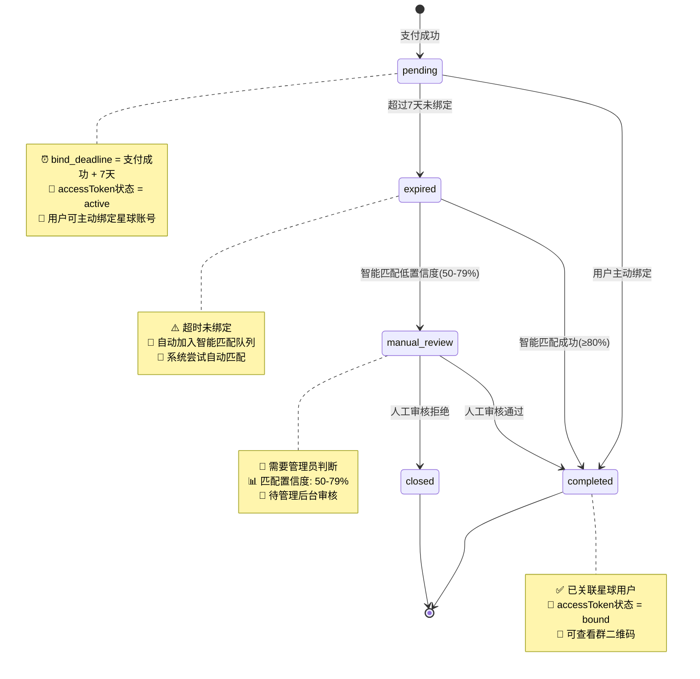
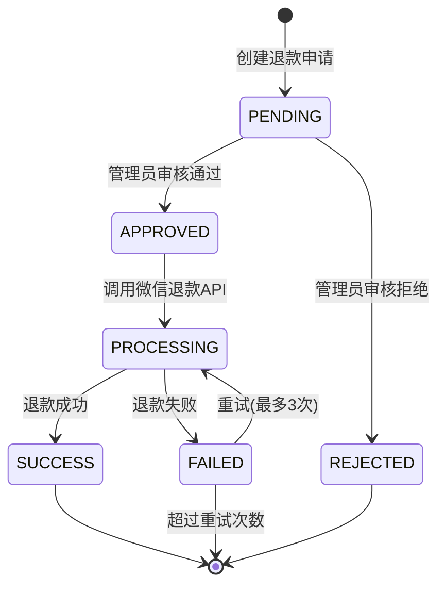
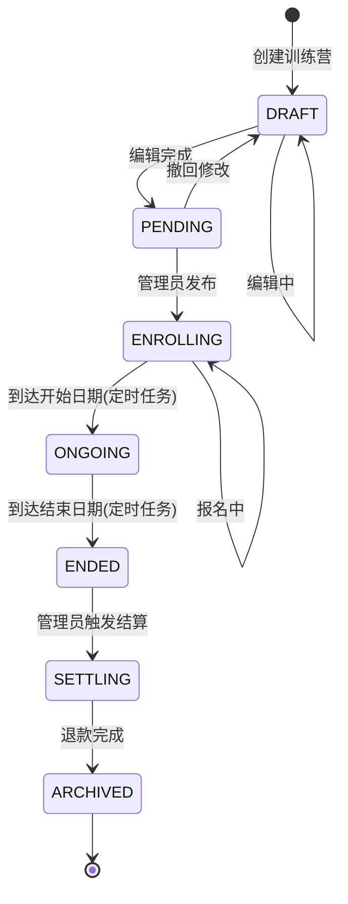
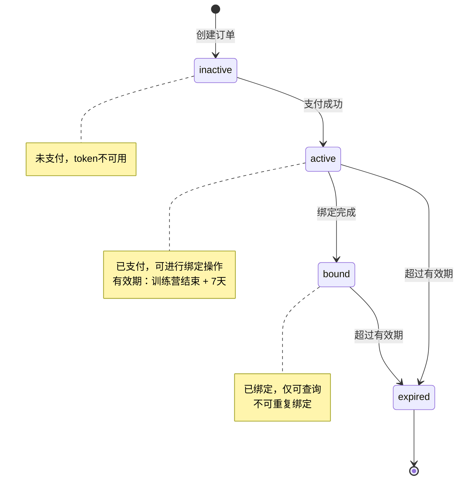

# 状态枚举定义

> **文档目的**：统一定义系统中所有状态枚举值，确保前后端、数据库、文档的一致性
> **维护原则**：本文档为**单一数据源(SSOT)**，其他文档引用此处定义

---

## 📋 核心状态枚举

### 1. bind_status - 支付绑定状态

**数据库字段**: `payment_record.bind_status`
**Java枚举**: `com.camp.enums.BindStatus`
**前端枚举**: `src/enums/bindStatus.ts`

| 枚举值 | 含义 | 触发条件 | 后续操作 |
|--------|------|---------|---------|
| `pending` | 待绑定 | 支付成功，7天内待用户主动绑定 | 用户绑定 或 7天后转expired |
| `completed` | 已完成 | ① 用户主动绑定<br>② 智能匹配成功<br>③ 人工审核通过 | 无（终态） |
| `expired` | 已过期 | 支付后7天未绑定 | 加入智能匹配队列 |
| `manual_review` | 待人工审核 | 智能匹配置信度50-79% | 管理员审核 |
| `closed` | 已关闭 | 人工审核判定无法匹配 | 无（终态） |

#### 状态机图



#### 状态转换规则

| 从状态 | 到状态 | 条件 | 触发者 | bind_method |
|--------|--------|------|--------|-------------|
| pending | completed | 用户填写星球信息 | 用户H5操作 | `user_fill` |
| pending | expired | NOW() > bind_deadline | 定时任务(每日02:00) | 保持NULL |
| expired | completed | 智能匹配置信度≥80% | 匹配任务 | `smart_match` |
| expired | manual_review | 智能匹配置信度50-79% | 匹配任务 | 保持NULL |
| manual_review | completed | 管理员审核通过 | 管理员 | `manual` |
| manual_review | closed | 管理员审核拒绝 | 管理员 | 保持NULL |

#### Java枚举定义

```java
// src/main/java/com/camp/enums/BindStatus.java
package com.camp.enums;

import com.baomidou.mybatisplus.annotation.EnumValue;
import com.fasterxml.jackson.annotation.JsonValue;
import lombok.Getter;

@Getter
public enum BindStatus {
    PENDING("pending", "待绑定"),
    COMPLETED("completed", "已完成"),
    EXPIRED("expired", "已过期"),
    MANUAL_REVIEW("manual_review", "待人工审核"),
    CLOSED("closed", "已关闭");

    @EnumValue
    @JsonValue
    private final String value;
    private final String description;

    BindStatus(String value, String description) {
        this.value = value;
        this.description = description;
    }

    public static BindStatus fromValue(String value) {
        for (BindStatus status : values()) {
            if (status.value.equals(value)) {
                return status;
            }
        }
        throw new IllegalArgumentException("Unknown bind_status: " + value);
    }
}
```

#### TypeScript枚举定义

```typescript
// frontend/h5-member/src/enums/bindStatus.ts
export enum BindStatus {
  PENDING = 'pending',
  COMPLETED = 'completed',
  EXPIRED = 'expired',
  MANUAL_REVIEW = 'manual_review',
  CLOSED = 'closed'
}

export const BindStatusLabels: Record<BindStatus, string> = {
  [BindStatus.PENDING]: '待绑定',
  [BindStatus.COMPLETED]: '已完成',
  [BindStatus.EXPIRED]: '已过期',
  [BindStatus.MANUAL_REVIEW]: '待人工审核',
  [BindStatus.CLOSED]: '已关闭'
}

export const BindStatusColors: Record<BindStatus, string> = {
  [BindStatus.PENDING]: 'warning',
  [BindStatus.COMPLETED]: 'success',
  [BindStatus.EXPIRED]: 'danger',
  [BindStatus.MANUAL_REVIEW]: 'primary',
  [BindStatus.CLOSED]: 'info'
}
```

---

### 2. pay_status - 支付状态

**数据库字段**: `payment_record.pay_status`
**Java枚举**: `com.camp.enums.PayStatus`

| 枚举值 | 含义 | 说明 |
|--------|------|------|
| `PENDING` | 待支付 | 订单已创建，等待支付 |
| `SUCCESS` | 支付成功 | 微信支付回调确认 |
| `FAILED` | 支付失败 | 微信支付失败或订单超时 |
| `REFUNDED` | 已退款 | 退款成功后更新 |

**注意**：`pay_status` 使用大写枚举（符合Java常量命名规范），与 `bind_status` 的小写风格不同，这是**历史遗留问题**。建议新项目统一使用小写。

#### Java枚举定义

```java
package com.camp.enums;

import com.baomidou.mybatisplus.annotation.EnumValue;
import lombok.Getter;

@Getter
public enum PayStatus {
    PENDING("PENDING", "待支付"),
    SUCCESS("SUCCESS", "支付成功"),
    FAILED("FAILED", "支付失败"),
    REFUNDED("REFUNDED", "已退款");

    @EnumValue
    private final String value;
    private final String description;

    PayStatus(String value, String description) {
        this.value = value;
        this.description = description;
    }
}
```

---

### 3. bind_method - 绑定方式

**数据库字段**: `payment_record.bind_method`
**Java枚举**: `com.camp.enums.BindMethod`

| 枚举值 | 含义 | 触发场景 | 置信度 |
|--------|------|---------|--------|
| `user_fill` | 用户填写 | 支付后用户主动填写星球信息 | 100% |
| `smart_match` | 智能匹配 | 系统通过算法匹配 | ≥80% |
| `manual` | 人工匹配 | 管理员手动关联 | 100% |

**NULL值含义**：未完成绑定（bind_status=pending/expired/manual_review时）

#### Java枚举定义

```java
package com.camp.enums;

import com.baomidou.mybatisplus.annotation.EnumValue;
import lombok.Getter;

@Getter
public enum BindMethod {
    USER_FILL("user_fill", "用户填写"),
    SMART_MATCH("smart_match", "智能匹配"),
    MANUAL("manual", "人工匹配");

    @EnumValue
    private final String value;
    private final String description;

    BindMethod(String value, String description) {
        this.value = value;
        this.description = description;
    }
}
```

---

### 4. refund_status - 退款状态

**数据库字段**: `refund_record.refund_status`
**Java枚举**: `com.camp.enums.RefundStatus`

| 枚举值 | 含义 | 说明 |
|--------|------|------|
| `PENDING` | 待处理 | 退款申请已创建，待审核 |
| `APPROVED` | 审核通过 | 管理员审核通过，待执行退款 |
| `REJECTED` | 审核拒绝 | 管理员拒绝退款申请 |
| `PROCESSING` | 处理中 | 正在调用微信退款API |
| `SUCCESS` | 退款成功 | 微信退款完成 |
| `FAILED` | 退款失败 | 微信退款失败，待重试 |

#### 状态机图



---

### 5. camp_status - 训练营状态

**数据库字段**: `training_camp.status`
**Java枚举**: `com.camp.enums.CampStatus`

| 枚举值 | 含义 | 说明 |
|--------|------|------|
| `DRAFT` | 草稿 | 训练营创建中，未发布 |
| `PENDING` | 待发布 | 编辑完成，等待发布 |
| `ENROLLING` | 报名中 | 已发布，接受报名 |
| `ONGOING` | 进行中 | 训练营已开始 |
| `ENDED` | 已结束 | 训练营结束，等待结算 |
| `SETTLING` | 结算中 | 正在处理退款 |
| `ARCHIVED` | 已归档 | 退款完成，已归档 |

#### 状态机图



---

### 6. accessToken状态

**存储位置**: Redis (`access_token:{token}`)
**数据结构**: JSON
```json
{
  "orderNo": "ord_xxx",
  "campId": 1,
  "wechatUserId": 10001,
  "status": "active",
  "expireAt": "2025-12-31T23:59:59"
}
```

| 状态值 | 含义 | 说明 |
|--------|------|------|
| `inactive` | 未激活 | 订单已创建，未支付 |
| `active` | 已激活 | 支付成功，可用于绑定操作 |
| `bound` | 已绑定 | 绑定完成，仅可查询状态 |
| `expired` | 已过期 | 超过有效期或训练营结束+7天 |

#### 状态机图



---

## 🔒 数据一致性约束

### 1. bind_status 与 bind_method 的关联规则

| bind_status | bind_method 允许值 | 说明 |
|-------------|------------------|------|
| `pending` | NULL | 未绑定，不存在绑定方式 |
| `completed` | `user_fill` / `smart_match` / `manual` | **必填**，记录绑定来源 |
| `expired` | NULL | 超时未绑定 |
| `manual_review` | NULL | 待审核，未确定绑定方式 |
| `closed` | NULL | 已关闭，无绑定方式 |

### 2. pay_status 与 bind_status 的关联规则

| pay_status | bind_status 允许值 | 说明 |
|------------|------------------|------|
| `PENDING` | 不存在 | 未支付时不产生bind_status |
| `SUCCESS` | `pending` / `completed` / `expired` / `manual_review` / `closed` | 支付成功后才有绑定状态 |
| `FAILED` | 不存在 | 支付失败，无绑定流程 |
| `REFUNDED` | 任意 | 退款不影响已有绑定状态 |

### 3. 数据库约束建议

```sql
-- payment_record表约束
ALTER TABLE payment_record
ADD CONSTRAINT chk_bind_status CHECK (
    bind_status IN ('pending', 'completed', 'expired', 'manual_review', 'closed')
);

ALTER TABLE payment_record
ADD CONSTRAINT chk_bind_method CHECK (
    bind_method IN ('user_fill', 'smart_match', 'manual') OR bind_method IS NULL
);

ALTER TABLE payment_record
ADD CONSTRAINT chk_pay_status CHECK (
    pay_status IN ('PENDING', 'SUCCESS', 'FAILED', 'REFUNDED')
);

-- 业务逻辑约束（应用层保证）
-- 规则：bind_status=completed 时 bind_method 必须非NULL
-- 规则：bind_status!=completed 时 bind_method 必须为NULL
```

---

## 📝 接口响应示例

### 示例1：查询订单状态（待绑定）

```json
GET /api/h5/orders/ord_123/status

Response:
{
  "code": 200,
  "data": {
    "orderNo": "ord_123",
    "payStatus": "SUCCESS",
    "bindStatus": "pending",
    "bindMethod": null,
    "remainingBindTime": 518400,  // 6天(秒)
    "bindDeadline": "2025-12-10T23:59:59",
    "campName": "21天早起训练营",
    "amount": 99.00,
    "accessToken": "tk_xxx",
    "bindingUrl": "/bind?token=tk_xxx"
  }
}
```

### 示例2：查询订单状态（已完成）

```json
GET /api/h5/orders/ord_456/status

Response:
{
  "code": 200,
  "data": {
    "orderNo": "ord_456",
    "payStatus": "SUCCESS",
    "bindStatus": "completed",
    "bindMethod": "user_fill",
    "boundAt": "2025-12-04T15:30:00",
    "planetUserId": "123456789",
    "planetNickname": "小明",
    "groupQrcodeUrl": "https://cdn.example.com/qrcode.jpg",
    "campName": "21天早起训练营",
    "amount": 99.00
  }
}
```

### 示例3：管理后台会员列表（包含匹配状态）

```json
GET /api/admin/camps/1/members

Response:
{
  "code": 200,
  "data": {
    "items": [
      {
        "memberId": 10001,
        "wechatNickname": "小明同学",
        "planetNickname": "小明",
        "bindStatus": "completed",
        "bindMethod": "user_fill",
        "matchConfidence": 100,
        "payAmount": 99.00,
        "checkinCount": 18,
        "eligibleForRefund": false
      },
      {
        "memberId": 10002,
        "wechatNickname": "小红",
        "planetNickname": null,
        "bindStatus": "manual_review",
        "bindMethod": null,
        "matchConfidence": 65,
        "payAmount": 99.00,
        "checkinCount": 20,
        "eligibleForRefund": true
      }
    ],
    "total": 2,
    "page": 1,
    "pageSize": 20
  }
}
```

---

## ⚠️ 常见错误

### 错误1：使用非标准状态值

```diff
- "bindStatus": "success"  // ❌ 错误：success不是标准值
+ "bindStatus": "completed"  // ✅ 正确：使用completed
```

### 错误2：bind_status=completed但bind_method为NULL

```diff
{
  "bindStatus": "completed",
- "bindMethod": null  // ❌ 错误：完成状态必须有绑定方式
+ "bindMethod": "user_fill"  // ✅ 正确
}
```

### 错误3：bind_status=pending但bind_method有值

```diff
{
  "bindStatus": "pending",
- "bindMethod": "user_fill"  // ❌ 错误：未完成不应有绑定方式
+ "bindMethod": null  // ✅ 正确
}
```

### 错误4：混淆pay_status和bind_status

```diff
// payment_record表
{
- "pay_status": "completed",  // ❌ 错误：pay_status应为SUCCESS
+ "pay_status": "SUCCESS",  // ✅ 正确
  "bind_status": "completed"  // ✅ 正确
}
```

---

## 🔄 状态变更日志表

所有状态变更必须记录到对应的状态日志表：

| 业务状态 | 日志表 | 记录字段 |
|---------|--------|---------|
| bind_status | `payment_bind_status_log` | from_status, to_status, bind_method, operator_id, reason |
| camp_status | `camp_status_log` | from_status, to_status, event, operator_id |
| refund_status | `refund_status_log` | from_status, to_status, operator_id, remark |
| pay_status | `payment_status_log` | from_status, to_status, transaction_id |

**日志记录示例**：

```java
// 记录bind_status变更
PaymentBindStatusLog log = PaymentBindStatusLog.builder()
    .paymentRecordId(paymentRecord.getId())
    .fromStatus(BindStatus.PENDING)
    .toStatus(BindStatus.COMPLETED)
    .bindMethod(BindMethod.USER_FILL)
    .operatorId(userId)
    .reason("用户主动绑定")
    .build();
bindStatusLogMapper.insert(log);
```

---

## 📚 相关文档

- [技术方案 - 5.4.1 状态机设计](./技术方案.md#541-状态机设计)
- [数据库设计 - payment_record表](./数据库设计.md#42-payment_record-支付记录表)
- [接口文档 - 1.5 状态枚举](./接口文档.md#15-状态枚举)
- [设计优化决策文档 - P0-3](./设计优化决策文档.md#p0-3bind_status-状态定义不一致)

---

**文档版本**：v1.0
**最后更新**：2025-12-04
**维护者**：技术架构组
**变更历史**：
- 2025-12-04: 初始版本，统一定义所有状态枚举
