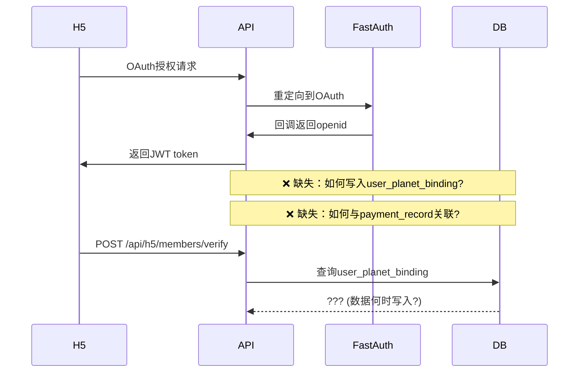
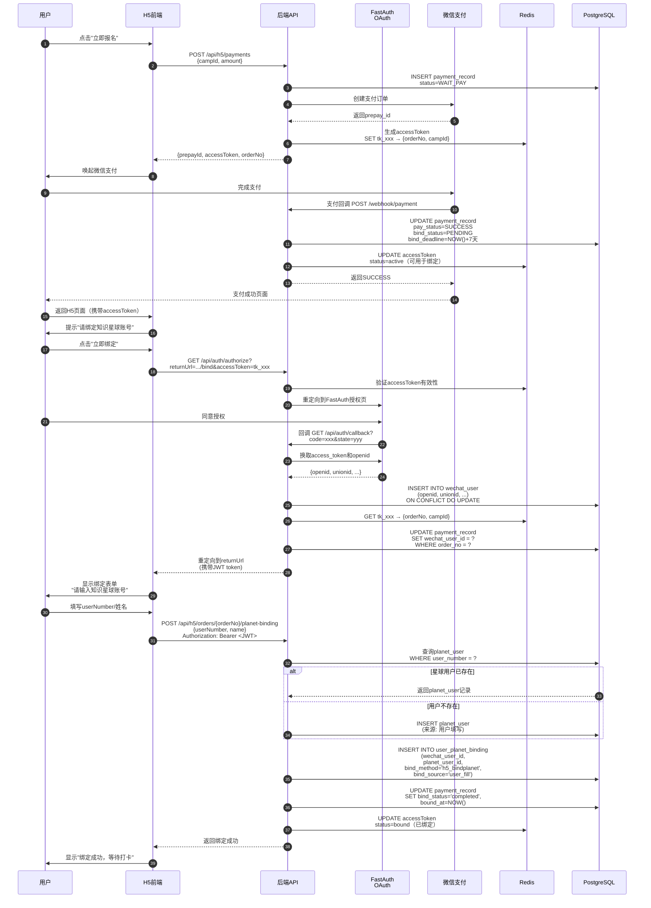

# 🎯 v1 版本设计优化决策文档

> **文档目的**：整合所有已发现的设计问题和优化机会
> **生成时间**：2025-12-04

---

## 📊 决策优先级总览

### 关键指标

| 类别 | 🔴 阻塞性问题 | 🟠 高风险问题 | 🟡 优化机会 | 🟢 改进建议 |
|------|------------|------------|----------|----------|
| **数量** | 3 | 8 | 12 | 10 |
| **处理时机** | Stage 0 前必须解决 | Stage 1 前完成 | 开发中迭代 | 后续版本 |

### 影响面分析

```
        业务影响 (Business Impact)
          ^
     高   │  🔴 P0 - 必须解决         🟠 P1 - 高优先级
          │  ├─ EP02文档缺失          ├─ 阶段规划调整
          │  ├─ FastAuth流程断层      ├─ 支付安全增强
          │  └─ bind_status不一致     ├─ 接口DB耦合
          │                           └─ OAuth绑定时序
          │─────────────────────────────────────────>
     低   │  🟢 P3 - 可延后            🟡 P2 - 中优先级
          │  ├─ 文档重复问题          ├─ 监控细粒度
          │  ├─ 日志脱敏              ├─ Docker环境
          │  └─ E2E测试               ├─ Manager层评估
                                      └─ API命名规范
              低                    高
                    技术复杂度 (Complexity)
```

---

## 🔴 第一部分：阻塞性问题（必须解决）

### P0-1：EP02 用户故事文档缺失 ⚠️⚠️⚠️

**问题描述**：
- `docs/v1/user-stories/EP02-会员报名与支付.md` 不存在
- EP02 是核心支付流程，无 Gherkin 验收标准将导致开发理解偏差

**影响范围**：
- 🎯 业务流程：支付绑定路径、OAuth集成、AccessToken机制
- 👨‍💻 开发团队：前后端对接口理解不一致
- 🧪 测试验收：无明确验收条件

**决策建议**：
```yaml
方案: 立即补充完整EP02文档
  时间: 4小时
  负责人: 产品 + 后端负责人
  结构参考:
    - S2.1: H5端OAuth授权登录
    - S2.2: 创建支付订单（动态二维码路径）
    - S2.3: 微信支付JSAPI调用
    - S2.4: 支付回调处理与AccessToken生成
    - S2.5: 用户绑定星球账号
    - S2.6: 固定二维码兜底路径
    - S2.7: 订单状态查询
```

**行动项**：
- [ ] 产品负责人编写S2.1-S2.7故事草稿
- [ ] 技术负责人补充技术约束和边界条件
- [ ] 前后端评审确认验收标准

---

### P0-2：FastAuth 会员验证流程断层 🔗

**问题描述**：
- `docs/v1/FastAuth接入方案.md:40-142` 描述了会员同步 + 验证 API
- `docs/v1/接口文档.md` 仅有简单的 `POST /api/h5/members/verify`
- **缺失环节**：OAuth 完成后如何落地 `user_planet_binding` 表

**当前流程缺口**：


**决策建议**：

**方案：在 OAuth 回调中主动绑定**

```yaml
时序设计:
  1. OAuth回调 → 获取openid
  2. 查询payment_record（通过access_token关联）
  3. 如果存在订单 + access_token状态=active:
     a. 引导用户填写星球信息（userNumber/用户名）
     b. 调用/api/h5/orders/{orderNo}/planet-binding
     c. 写入user_planet_binding表
     d. 更新payment_record.bind_status = 'completed'
  4. 如果无订单，仅创建wechat_user记录

优势:
  ✅ 支付和绑定流程强关联
  ✅ 数据一致性有保障
  ✅ 符合"支付后7天内绑定"的业务规则
```

**行动项**：
- [ ] 在技术方案中补充完整时序图（OAuth → 绑定 → 验证）
- [ ] 在接口文档中明确 `/api/auth/callback` 的绑定逻辑
- [ ] 在数据库设计中说明 `user_planet_binding` 的数据来源

---

### P0-3：bind_status 状态定义不一致 📋

**问题位置**：
- **技术方案**：`pending | completed | expired | manual_review | closed`
- **接口文档**：部分接口返回 `bind_status: "success"`（非标准值）

**决策建议**：
```yaml
标准状态值（以技术方案为准）:
  pending:        支付完成，待用户绑定（7天有效期）
  completed:      绑定完成
  expired:        超过7天未绑定
  manual_review:  系统无法自动匹配，进入人工审核
  closed:         人工审核判定无法匹配

修改清单:
  - docs/v1/接口文档.md: 所有返回bindStatus字段统一用上述5个值
  - 前端枚举定义: 使用统一状态常量
  - 数据库约束: ALTER TABLE payment_record ADD CONSTRAINT check_bind_status
```

**行动项**：
- [ ] 全局搜索替换 `"success"` → `"completed"`
- [ ] 在技术方案中增加状态机图例（5状态 + 转换条件）
- [ ] 在接口文档中添加状态枚举说明章节

---

## 🟠 第二部分：高风险问题（Stage 1 前完成）

### P1-1：阶段规划与垂直切片原则冲突 🏗️

**问题描述**：
- **现状**：
  - `docs/v1/AI辅助敏捷开发计划.md:32-75` Stage 1 引入 OAuth + 管理后台骨架
  - `docs/v1/技术方案.md:3862-3974` Stage 1 包含高依赖模块
- **冲突**：违背"先做低依赖垂直切片"原则
- **风险**：OAuth 和管理后台并行开发会产生交叉等待，延后支付路径风险暴露

**当前 Stage 1 内容**：
```yaml
Stage 1（当前规划）:
  - ✅ 管理后台骨架（低业务价值）
  - ✅ OAuth授权流程（阻塞H5端所有功能）
  - ✅ 训练营CRUD（管理端功能）

问题:
  - OAuth开发阻塞整个H5端
  - 管理后台和支付流程无依赖关系，却串行开发
  - 支付核心路径在Stage 2才能完整测试
```

**决策建议**：

**方案：调整为端到端垂直切片**

```yaml
新Stage 1（支付闭环）:
  目标: 完成"用户报名→支付→绑定"最小可用路径（MVP）

  后端:
    - OAuth授权（仅H5必需部分）
    - 支付订单创建（/api/h5/payments）
    - 微信支付对接（JSAPI + 回调）
    - AccessToken生成与验证
    - 绑定星球账号（/api/h5/orders/{id}/planet-binding）

  前端:
    - H5支付页面（简化版，无需完整用户中心）
    - 微信授权跳转
    - 支付结果轮询
    - 绑定表单

  数据库:
    - training_camp（基础字段）
    - payment_record
    - wechat_user
    - user_planet_binding

  验收标准:
    ✅ 用户可完成支付并绑定星球账号
    ✅ payment_record.bind_status正确流转
    ✅ 支付回调幂等性验证通过

  价值:
    💰 提前暴露支付路径风险（微信支付对接、网络重试）
    💰 前后端可并行开发（接口明确）
    💰 最早可测试核心业务逻辑

新Stage 2（管理后台 + 打卡同步）:
  管理端:
    - 训练营管理（CRUD + 发布）
    - 会员列表查询
    - 支付记录查看

  同步任务:
    - 知识星球打卡数据同步
    - 身份匹配算法
    - camp_member表完善

  价值:
    💰 管理端和同步任务可并行开发
    💰 基于Stage 1的真实支付数据测试

新Stage 3（退款流程）:
  - 保持原有规划
```


**行动项**：
- [ ] 召开技术评审会，确认Stage重新划分方案
- [ ] 更新 `AI辅助敏捷开发计划.md` 的Stage定义
- [ ] 更新 `技术方案.md` 的实施路线图
- [ ] 重新评估各Stage的时间估算

---

### P1-2：接口/数据库耦合与性能风险 ⚡

**问题描述**：
- **接口设计**：`docs/v1/接口文档.md:820-849` 返回字段包含 `planetUserId`, `userNumber`
- **数据库设计**：`camp_member` 表只有 `filled_*` 和匹配字段
- **缺失设计**：无读写隔离策略、无缓存层、接口直接多表 JOIN

**性能风险场景**：
```sql
-- 获取训练营成员列表（需要关联3张表）
SELECT
    cm.id,
    cm.camp_id,
    cm.filled_user_number,  -- camp_member表
    pu.planet_user_id,      -- planet_user表
    pu.name,                -- planet_user表
    pr.order_no,            -- payment_record表
    pr.amount,              -- payment_record表
    pr.bind_status          -- payment_record表
FROM camp_member cm
LEFT JOIN planet_user pu ON cm.planet_user_id = pu.id
LEFT JOIN payment_record pr ON cm.payment_record_id = pr.id
WHERE cm.camp_id = ?;

-- 问题:
-- 1. 每次查询都JOIN 3张表
-- 2. 高并发场景下DB成为瓶颈
-- 3. planetUserId可能为空（未匹配用户），JOIN性能差
```

**决策建议**：

**方案：引入 Redis 缓存层 + 数据冗余**

```yaml
设计原则:
  - 读多写少的数据 → Redis缓存
  - 高频查询字段 → 数据库冗余
  - 强一致性要求低的数据 → 最终一致性

具体方案:
  1. camp_member表增加冗余字段:
     ALTER TABLE camp_member ADD COLUMN planet_user_name VARCHAR(50);
     ALTER TABLE camp_member ADD COLUMN planet_user_number VARCHAR(50);
     ALTER TABLE camp_member ADD COLUMN order_no VARCHAR(64);

     优势:
       - 会员列表查询无需JOIN
       - 索引优化简单（单表查询）

     劣势:
       - 数据更新时需同步维护（用触发器或业务层保证）

  2. Redis缓存会员信息:
     Key: camp:members:{campId}
     Value: JSON数组（成员完整信息）
     TTL: 5分钟

     更新策略:
       - 会员信息变更时主动删除缓存（Cache Aside模式）
       - 下次查询时重建缓存

  3. 读写分离查询:
     // 读接口（允许5分钟延迟）
     GET /api/admin/camps/{id}/members
     → 优先读Redis缓存
     → 缓存未命中读从库

     // 写接口（实时性要求高）
     POST /api/admin/members/{id}/verify
     → 写主库 + 删除缓存
```


**行动项**：
- [ ] 在数据库设计中补充缓存策略章节
- [ ] 在技术方案中说明读写分离架构
- [ ] 评估方案A和方案B的性能差异（压测验证）
- [ ] 在接口文档中标注哪些接口使用缓存

---

### P1-3：支付安全增强（防重放 + 前端失败补偿） 🔐

**问题描述**：
- **现状**：`docs/v1/接口文档.md:188-199` 仅使用 AccessToken 保护 H5 接口
- **缺失**：
  1. 微信支付 `prepay_id` 签名防重放
  2. 前端 JSAPI 调用失败的补偿机制
  3. 支付回调的时间窗口验证

**安全风险场景**：
```javascript
// 场景1: 前端重放攻击
// 攻击者获取到合法的accessToken后，可重复查询订单状态
GET /api/h5/orders/{orderNo}/status
Authorization: Bearer <stolen_access_token>

// 问题: 无一次性ticket机制，token可重复使用

// 场景2: 支付回调重放
// 攻击者截获支付回调报文，重复发送
POST /webhook/payment/callback
<xml>...</xml>

// 问题: 虽有签名验证，但无时间戳防重放

// 场景3: 前端JSAPI调用失败
// 用户点击支付，唤起微信支付后点击取消或网络超时
wx.chooseWXPay({
  success: function() { /* 轮询订单状态 */ },
  fail: function() { /* ??? 无补偿逻辑 */ }
});
```

**决策建议**：

**增强方案（分阶段实施）**：

```yaml
阶段1 - 支付回调增强（P1，必须）:
  1. 时间窗口验证:
     if (System.currentTimeMillis() - notify.getTimestamp() > 5 * 60 * 1000) {
         return "FAIL"; // 超过5分钟的回调拒绝
     }

  2. Redis幂等性检查:
     String key = "pay_callback:" + outTradeNo;
     Boolean acquired = redis.setIfAbsent(key, "1", 10, TimeUnit.MINUTES);

  3. 数据库唯一约束:
     ALTER TABLE payment_record
     ADD CONSTRAINT uk_order_no UNIQUE (order_no);

阶段2 - 前端一次性Ticket（P1）:
  设计:
    // 后端生成prepay_id后，同时生成一次性ticket
    POST /api/h5/payments
    Response:
    {
      "orderId": "ord_xxx",
      "prepayId": "wx2025...",
      "ticket": "tk_once_abc123",  // 一次性ticket（5分钟有效）
      "sign": "..." // 签名
    }

    // 前端轮询时必须携带ticket
    GET /api/h5/orders/{orderNo}/status?ticket=tk_once_abc123

    // 后端校验ticket
    String ticket = request.getParameter("ticket");
    String cachedOrderNo = redis.get("ticket:" + ticket);
    if (cachedOrderNo == null || !cachedOrderNo.equals(orderNo)) {
        throw new InvalidTicketException();
    }
    // 查询后立即删除ticket（一次性使用）
    redis.delete("ticket:" + ticket);

阶段3 - 前端失败补偿（P2）:
  // 支付失败/取消后的补偿逻辑
  wx.chooseWXPay({
    success: function(res) {
      // 轮询订单状态
      pollOrderStatus();
    },
    fail: function(err) {
      if (err.errMsg === 'chooseWXPay:cancel') {
        // 用户主动取消，显示"继续支付"按钮
        showResumePaymentButton();
      } else {
        // 网络错误或其他异常，仍然轮询（可能已支付）
        pollOrderStatus();
      }
    }
  });

  function showResumePaymentButton() {
    // 调用后端重新生成prepay_id（原订单号不变）
    POST /api/h5/payments/{orderNo}/resume
    // 返回新的prepay_id和签名
  }
```

**行动项**：
- [ ] 在技术方案中补充支付安全章节
- [ ] 在接口文档中增加 `POST /api/h5/payments/{orderNo}/resume` 接口
- [ ] 前端开发规范中增加支付失败处理指南
- [ ] 编写支付安全测试用例（模拟重放攻击）

---

### P1-4：OAuth 绑定时序明确化 🔗

**问题描述**：
- OAuth 完成后如何写入 `user_planet_binding` 表，流程不明确
- 与 P0-2 的 FastAuth 流程断层问题相关，但侧重具体实现时序

**决策建议**：

**完整时序图（补充到技术方案）**：



**关键设计决策**：

1. **wechat_user 表在 OAuth 回调时写入**（步骤11）
2. **user_planet_binding 表在绑定接口调用时写入**（步骤18）
3. **payment_record 通过 wechat_user_id 关联**（步骤13）
4. **accessToken 贯穿整个流程**，用于：
   - 支付后标识订单
   - OAuth 时关联原订单
   - 绑定时验证权限

**行动项**：
- [ ] 将此时序图补充到 `docs/v1/技术方案.md`
- [ ] 在 `docs/v1/接口文档.md` 的 OAuth 章节引用此时序
- [ ] 在数据库设计中明确各表的数据来源（哪个接口写入）

---

## 🟡 第三部分：优化机会（开发中迭代）

### P2-1：监控指标细粒度提升 📈

**问题描述**：
- `docs/v1/开发前准备清单.md:1244-1253` 仅定义系统指标（CPU、内存、磁盘）
- 缺少业务指标监控，无法量化 Stage 验收目标

**决策建议**：

**分层监控体系**：

```yaml
Layer 1 - 系统指标（已有）:
  - CPU使用率 > 80%
  - 内存使用率 > 85%
  - 磁盘使用率 > 90%
  - 网络异常

Layer 2 - 基础设施指标（新增）:
  PostgreSQL:
    - 慢查询数量（>500ms）
    - 连接池使用率 > 80%
    - 死锁次数

  Redis:
    - 缓存命中率 < 90%
    - Key驱逐率
    - 内存碎片率

Layer 3 - 应用指标（新增）:
  接口性能:
    - P99响应时间 > 2s
    - 接口错误率 > 1%
    - QPS突增（5分钟内翻倍）

  异步任务:
    - 任务队列积压 > 100
    - 任务失败率 > 5%

Layer 4 - 业务指标（重点新增）:
  支付流程:
    - 支付成功率（目标 >95%）
      = 成功支付数 / 发起支付数
    - 支付回调延迟（P95 < 3s）
    - 订单绑定完成率（目标 >85%）
      = bind_status=completed / 总订单数（7天内）

  身份匹配:
    - 自动匹配成功率（目标 >80%）
      = bind_method IN ('h5_bindplanet','user_fill') / 总订单
    - 人工审核占比（目标 <15%）
      = bind_status='manual_review' / 总订单

  打卡同步:
    - 打卡数据同步延迟（目标 <10分钟）
      = NOW() - MAX(checkin_record.synced_at)
    - 同步失败率（目标 <1%）
      = 失败次数 / 总同步任务数

  退款处理:
    - 退款执行平均耗时（目标 <30分钟）
      = AVG(refund_record.processed_at - created_at)
    - 退款成功率（目标 >99%）
      = refund_status='SUCCESS' / 总退款数

Layer 5 - 用户体验指标:
  - H5页面加载时间（P95 < 2s）
  - 支付跳转成功率（>98%）
  - 页面错误率（JS Error < 0.1%）
```

**告警策略**：

```yaml
告警级别:
  P0 - 紧急（立即处理）:
    - 支付回调失败率 >10%（影响资金）
    - 数据库连接池耗尽
    - 服务不可用（>1分钟）
    通知: 电话 + 企业微信 + 短信

  P1 - 严重（15分钟内处理）:
    - 支付成功率 <90%
    - 退款成功率 <95%
    - 接口P99响应时间 >5s
    通知: 企业微信 + 邮件

  P2 - 警告（1小时内处理）:
    - 打卡同步延迟 >30分钟
    - 缓存命中率 <80%
    - 慢查询数量 >50/小时
    通知: 企业微信

  P3 - 信息（工作时间处理）:
    - 人工审核订单积压 >10
    - 磁盘使用率 >70%
    通知: 邮件
```

**行动项**：
- [ ] 在 `开发前准备清单.md` 中补充 Layer 3-5 监控指标
- [ ] 在各 Stage 验收标准中引用对应指标
- [ ] 实现 Prometheus 自定义 Metrics
- [ ] 配置 Grafana 仪表盘模板

---

### P2-2：Docker 本地开发环境 🐳

**问题描述**：
- 开发前准备清单.md 要求手动安装 PostgreSQL, Redis, 配置环境变量，上手成本高

**决策建议**：

**Docker Compose一键启动**：

```yaml
# docker-compose.yml
version: '3.8'

services:
  postgres:
    image: postgres:15-alpine
    environment:
      POSTGRES_DB: camp_db
      POSTGRES_USER: camp_user
      POSTGRES_PASSWORD: dev_password
    ports:
      - "5432:5432"
    volumes:
      - ./scripts/init.sql:/docker-entrypoint-initdb.d/init.sql
      - postgres_data:/var/lib/postgresql/data

  redis:
    image: redis:7-alpine
    ports:
      - "6379:6379"
    command: redis-server --requirepass dev_password

  adminer:
    image: adminer
    ports:
      - "8081:8080"  # 数据库管理界面

volumes:
  postgres_data:
```

**使用方式**：
```bash
# 新人入职第一天
git clone <repo>
cd backend
docker-compose up -d          # 启动依赖服务
./gradlew bootRun             # 启动应用
# 浏览器打开 http://localhost:8080/doc.html 查看API文档
```

**行动项**：
- [ ] 创建 `docker-compose.yml` 文件
- [ ] 编写数据库初始化脚本 `scripts/init.sql`
- [ ] 更新 README.md 的快速启动指南
- [ ] 添加 `.env.example` 环境变量模板


---

### P2-4：API RESTful 规范化 🌐

**问题描述**：
- 当前接口设计存在不符合 RESTful 最佳实践的情况

**决策建议**：

**不符合REST最佳实践的endpoint**：

| 当前设计 | 问题 | 建议改进 | HTTP方法 |
|---------|------|----------|---------|
| `/api/admin/camp/list` | 动词出现在URL | `/api/admin/camps?page=1&size=20` | GET |
| `/api/admin/camp/create` | 动词create冗余 | `/api/admin/camps` | POST |
| `/api/admin/refund/approve` | 动作型endpoint | `/api/admin/refunds/{id}/approval` | PUT |
| `/api/h5/order/bindPlanet` | 驼峰命名 | `/api/h5/orders/{orderNo}/planet-binding` | POST |
| `/api/h5/order/progress` | 语义不明 | `/api/h5/orders/{orderNo}/refund-status` | GET |

**统一命名规范建议**：
```yaml
资源命名:
  - 复数名词: /camps, /members, /payments
  - 小写 + 连字符: /planet-binding (不用驼峰)
  - 避免动词: 用HTTP方法表达动作

子资源嵌套:
  - 层级 ≤ 3: /camps/{id}/members/{memberId}/checkins ✅
  - 避免过深: /api/v1/admin/system/camps/... ❌

查询参数:
  - 分页: ?page=1&size=20&sort=createdAt,desc
  - 过滤: ?status=ONGOING&depositAmount=99
  - 搜索: ?q=21天早起
```

**API版本控制策略**：
```yaml
当前: /api/admin/camp/detail/{id}
优化: /api/v1/admin/camps/{id}

优势:
  ✅ 客户端明确知道使用的API版本
  ✅ 支持多版本并存（v1, v2同时维护）
  ✅ 向后兼容时可平滑升级
```

**错误响应标准化**（参考RFC 7807）：
```json
{
  "type": "/errors/validation-failed",
  "title": "参数校验失败",
  "status": 400,
  "detail": "训练营押金金额必须在1-999之间",
  "instance": "/api/v1/admin/camps",
  "errors": [
    {
      "field": "depositAmount",
      "message": "金额超出允许范围",
      "rejectedValue": 1000
    }
  ],
  "traceId": "a1b2c3d4-5678-90ab-cdef"
}
```

**行动项**：
- [ ] 制定《API设计规范文档》
- [ ] 前后端联合评审确认规范
- [ ] 在 Stage 0 完成规范制定
- [ ] 在接口文档中标注版本号

---

### P2-5：测试数据生成工具 🧪

**问题描述**：
- 缺少测试数据初始化脚本，开发调试需手动创建训练营、会员、支付记录

**决策建议**：

**使用 JavaFaker + TestDataFactory**：

```java
// src/test/java/com/example/camp/TestDataFactory.java
@Component
public class TestDataFactory {

    @Autowired
    private CampMapper campMapper;

    private final Faker faker = new Faker(Locale.CHINA);

    public Camp createCamp(String name) {
        Camp camp = Camp.builder()
            .name(name != null ? name : faker.company().name() + "训练营")
            .depositAmount(new BigDecimal(faker.number().numberBetween(50, 200)))
            .requiredDays(faker.number().numberBetween(10, 20))
            .totalDays(21)
            .startDate(LocalDate.now().plusDays(7))
            .endDate(LocalDate.now().plusDays(28))
            .status(CampStatus.DRAFT)
            .build();

        campMapper.insert(camp);
        return camp;
    }

    public PaymentRecord createPayment(Long campId, BindStatus bindStatus) {
        PaymentRecord payment = PaymentRecord.builder()
            .orderNo("ord_" + UUID.randomUUID().toString())
            .campId(campId)
            .amount(new BigDecimal("99.00"))
            .payStatus(PayStatus.SUCCESS)
            .bindStatus(bindStatus)
            .build();

        paymentMapper.insert(payment);
        return payment;
    }
}

// 使用示例
@SpringBootTest
class MemberServiceTest {
    @Autowired
    private TestDataFactory testData;

    @Test
    void testSyncMembers() {
        Camp camp = testData.createCamp("测试训练营");
        PaymentRecord payment = testData.createPayment(camp.getId(), BindStatus.COMPLETED);
        // 开始测试...
    }
}
```

**本地开发环境初始化**：
```bash
# scripts/seed-dev-data.sh
#!/bin/bash
curl -X POST http://localhost:8080/api/dev/seed \
  -H "Content-Type: application/json" \
  -d '{
    "camps": 5,
    "membersPerCamp": 10,
    "paymentsPerCamp": 8
  }'
```

**行动项**：
- [ ] 引入 JavaFaker 依赖
- [ ] 实现 TestDataFactory
- [ ] 编写开发环境数据初始化脚本
- [ ] 在测试文档中说明如何使用

---

## 🟢 第四部分：改进建议（后续版本）

### P3-1：文档重复问题 📚

**问题描述**：
- Stage 说明在 `AI辅助敏捷开发计划.md`、`技术方案.md`、`开发前准备清单.md` 均有重复
- 修改一处需同步更新多处，维护成本高

**决策建议**：

**方案A（推荐）：单一数据源（SSOT）**
```yaml
策略:
  1. 权威来源: docs/v1/技术方案.md
     - 保留完整的Stage定义（目标、交付物、验收标准）

  2. 其他文档: 引用 + 简化摘要
     - docs/v1/AI辅助敏捷开发计划.md:
       ## Stage 1
       > 详细内容见 [技术方案.md - Stage 1](./技术方案.md#stage-1)

       快速参考:
       - 目标: 支付闭环
       - 交付: H5支付页面 + 后端API
       - 时间: 2周

     - docs/v1/开发前准备清单.md:
       仅保留环境配置清单，删除Stage描述

  3. 维护流程:
     - Stage调整: 仅修改技术方案.md
     - 其他文档: 通过脚本或手动同步摘要部分
```

**行动项**：
- [ ] 指定 `技术方案.md` 为权威来源
- [ ] 精简其他文档，改为引用链接
- [ ] 在 `README.md` 中说明文档维护规范
- [ ] 制定文档更新检查清单

---

### P3-2：数据库优化建议 💾

**索引策略补充**：
```sql
-- 1. 支付记录按状态和时间查询（管理后台列表页高频查询）
CREATE INDEX idx_payment_status_time
ON payment_record(pay_status, created_at DESC)
WHERE pay_status IN ('SUCCESS', 'PENDING');

-- 2. 打卡记录按训练营和日期查询（同步任务高频）
CREATE INDEX idx_checkin_camp_date
ON checkin_record(camp_id, checkin_date DESC);

-- 3. 退款记录按审批状态查询（管理员工作台）
CREATE INDEX idx_refund_approval_status
ON refund_record(approval_status, created_at DESC)
WHERE approval_status = 'PENDING';

-- 4. 部分索引优化 - 仅索引活跃状态的训练营
CREATE INDEX idx_camp_active
ON training_camp(status, start_date)
WHERE status IN ('ENROLLING', 'ONGOING');
```

**JSONB 使用场景明确**：
```yaml
建议使用JSONB的字段:
  - payment_record.api_response: 微信支付回调原始JSON
  - refund_record.api_response: 退款接口返回的完整响应
  - checkin_record.topic_content: 知识星球打卡内容（富文本/图片数组）
  - camp_config.rules: 训练营自定义规则（动态配置）

不应使用JSONB的场景:
  ❌ 经常查询的结构化数据（如用户手机号、姓名）
  ❌ 需要建索引的字段
  ❌ 需要外键关联的字段
```

**软删除策略统一**：
```sql
-- 需要软删除的表（用户可见数据）:
ALTER TABLE training_camp ADD COLUMN deleted_at TIMESTAMP;
ALTER TABLE camp_member ADD COLUMN deleted_at TIMESTAMP;

-- 不需要软删除的表（系统日志/流水表）:
-- payment_record, refund_record, checkin_record
-- 理由: 财务/审计数据不允许删除，仅归档
```

---

### P3-3：安全增强建议 🔒

**OAuth PKCE 增强**：
```java
// PKCE (Proof Key for Code Exchange) - 防止授权码拦截
@GetMapping("/oauth/authorize")
public String authorize(HttpSession session) {
    // 生成code_verifier (随机字符串)
    String codeVerifier = generateCodeVerifier();
    String codeChallenge = sha256(codeVerifier); // S256算法

    session.setAttribute("code_verifier", codeVerifier);

    String authUrl = String.format(
        "https://open.weixin.qq.com/...?code_challenge=%s&code_challenge_method=S256",
        codeChallenge
    );
    return "redirect:" + authUrl;
}
```

**日志脱敏**：
```java
@Slf4j
public class PaymentServiceImpl {
    public void createPayment(PaymentRequest req) {
        log.info("创建支付订单: phone={}, amount={}",
            maskPhone(req.getPhone()),  // 138****8000
            req.getAmount()
        );
    }

    private String maskPhone(String phone) {
        return phone.replaceAll("(\\d{3})\\d{4}(\\d{4})", "$1****$2");
    }
}
```

---

### P3-4：开发体验优化 🛠️

**Git Hooks 规范化**：
```bash
# .husky/pre-commit
#!/bin/sh
./gradlew spotlessCheck      # 代码格式检查
./gradlew test --parallel    # 并行运行测试

# .husky/commit-msg
#!/bin/sh
commit_msg=$(cat $1)
pattern="^(feat|fix|docs|style|refactor|test|chore)(\(.+\))?: .{1,100}"

if ! echo "$commit_msg" | grep -qE "$pattern"; then
  echo "❌ Commit message格式错误"
  echo "格式: <type>(<scope>): <subject>"
  echo "示例: feat(camp): 新增训练营归档功能"
  exit 1
fi
```

**Knife4j 配置优化**：
```java
@Configuration
public class Knife4jConfig {
    @Bean
    public OpenAPI customOpenAPI() {
        return new OpenAPI()
            .info(new Info()
                .title("训练营押金退款系统 API")
                .version("v1.0")
                .description("""
                    ## 认证说明
                    - Admin端: JWT，Header: `Authorization: Bearer <token>`
                    - H5端: OAuth后同样使用Bearer方式

                    ## 环境地址
                    - 开发: https://dev-api.example.com
                    - 测试: https://test-api.example.com
                    """))
            .addServersItem(new Server()
                .url("http://localhost:8080")
                .description("本地开发"));
    }
}
```

---

### P3-5：测试策略优化 🧪

**测试金字塔**：
```
        E2E (5%)            <-- 关键业务流程
       /        \
      /          \
  集成测试 (15%)      <-- API + DB + Redis
    /              \
   /                \
单元测试 (80%)          <-- Service + Util

目标覆盖率:
  - 单元测试: 85% (核心业务逻辑100%)
  - 集成测试: 覆盖所有Controller endpoint
  - E2E测试: 支付→打卡→退款 完整链路
```

**WireMock 集成测试**：
```java
@SpringBootTest
@AutoConfigureWireMock(port = 8089)
class PlanetApiIntegrationTest {

    @Test
    void shouldSyncMembers() {
        // 模拟知识星球API响应
        stubFor(get(urlEqualTo("/v2/groups/12345/members"))
            .willReturn(aResponse()
                .withStatus(200)
                .withBody("""
                    {
                      "succeeded": true,
                      "data": [
                        {"user_id": "123", "name": "测试用户"}
                      ]
                    }
                    """)));

        memberService.syncMembers(campId);

        List<Member> members = memberMapper.selectByCampId(campId);
        assertThat(members).hasSize(1);
    }
}
```

---

### P3-6：可观测性增强 📊

**OpenTelemetry 集成**：
```yaml
management:
  endpoints:
    web:
      exposure:
        include: health,metrics,prometheus
  metrics:
    export:
      prometheus:
        enabled: true
  tracing:
    sampling:
      probability: 0.1  # 生产环境采样10%
```

**关键指标监控**：
```java
@Service
public class PaymentServiceImpl {
    private final Counter paymentCounter =
        Metrics.counter("payment.created", "status", "success");
    private final Timer paymentTimer =
        Metrics.timer("payment.processing.duration");

    public Payment createPayment(PaymentRequest req) {
        return paymentTimer.record(() -> {
            Payment payment = doCreatePayment(req);
            paymentCounter.increment();
            return payment;
        });
    }
}
```

---

## 📋 综合决策矩阵

### 按优先级排序的行动清单

| 编号 | 优化项 | 优先级 | 工作量 | 影响面 | 建议完成时间 | 负责人 |
|------|--------|--------|--------|--------|------------|--------|
| 1 | EP02文档补充 | 🔴 P0 | 4h | 全流程 | Stage 0 前 | 产品+后端 |
| 2 | bind_status统一 | 🔴 P0 | 2h | 接口+前端 | Stage 0 前 | 后端负责人 |
| 3 | FastAuth时序明确 | 🔴 P0 | 4h | OAuth流程 | Stage 0 前 | 架构师 |
| 4 | 阶段规划调整 | 🟠 P1 | 4h | 开发节奏 | Stage 0 中 | 技术负责人 |
| 5 | 支付安全增强 | 🟠 P1 | 8h | 支付路径 | Stage 1 前 | 后端+安全 |
| 6 | OAuth绑定时序图 | 🟠 P1 | 2h | 技术方案 | Stage 0 中 | 架构师 |
| 7 | 接口DB耦合优化 | 🟠 P1 | 16h | 性能 | Stage 1 中 | 后端+DBA |
| 8 | Docker开发环境 | 🟡 P2 | 4h | 开发体验 | Stage 0 前 | 运维+后端 |
| 9 | 监控指标细化 | 🟡 P2 | 6h | 运维质量 | Stage 1 前 | 运维+后端 |
| 10 | API命名规范 | 🟡 P2 | 8h | 前后端对接 | Stage 0 中 | 全员评审 |
| 11 | Manager层评估 | 🟡 P2 | 4h | 架构 | Stage 0 中 | 架构师 |
| 12 | 测试数据工具 | 🟡 P2 | 6h | 测试效率 | Stage 1 中 | 测试+后端 |
| 13 | 文档重复清理 | 🟢 P3 | 2h | 维护效率 | Stage 1 后 | 技术文档 |
| 14 | Git Hooks配置 | 🟢 P3 | 2h | 代码质量 | Stage 1 前 | 后端负责人 |
| 15 | Knife4j优化 | 🟢 P3 | 2h | API文档 | Stage 1 中 | 后端 |

### 时间线规划

```
Week 1 (Stage 0 准备阶段):
  ├─ Day 1-2: #1 EP02文档 + #2 状态统一 + #3 FastAuth时序
  ├─ Day 3: #4 阶段规划调整评审会
  ├─ Day 4: #8 Docker环境 + #10 API规范评审
  └─ Day 5: #11 Manager层评估 + #14 Git Hooks

Week 2-3 (Stage 1 支付闭环):
  ├─ 实施: #5 支付安全增强（并行开发中）
  ├─ 实施: #6 OAuth时序图落地
  ├─ 实施: #9 监控指标埋点
  └─ 评估: #7 接口DB耦合优化方案

Week 4+ (Stage 2 及后续):
  ├─ 实施: #7 Redis缓存层（如果性能瓶颈出现）
  ├─ 实施: #12 测试数据工具
  ├─ 实施: #15 Knife4j优化
  └─ 优化: #13 文档重复清理
```

---

**文档版本**：v1.0
**生成时间**：2025-12-04
**有效期**：6个月（需根据实际开发反馈调整）
**维护者**：技术架构组
**联系方式**：如需讨论具体实施细节，请参考各章节代码示例或发起技术评审会
