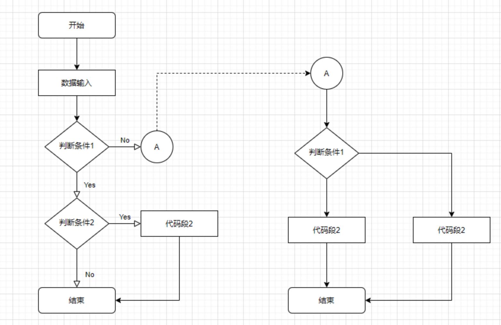
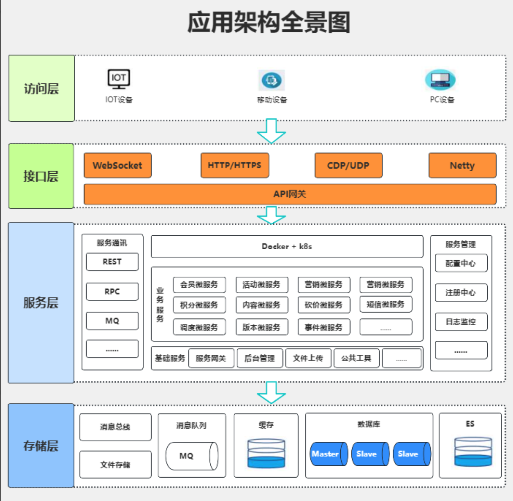
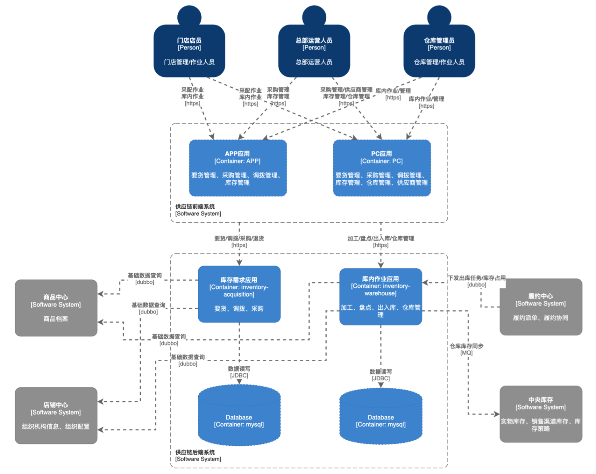
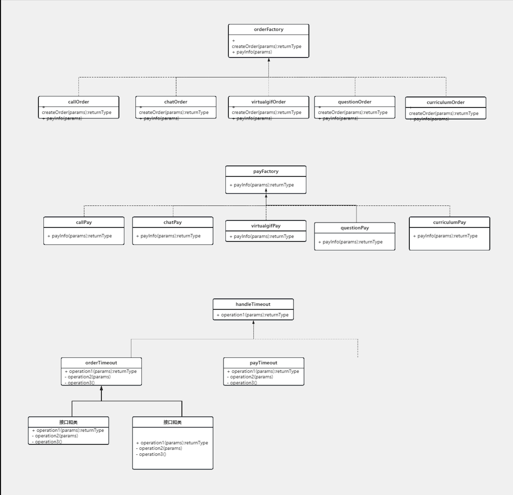

| **版本**     |            |
| ------------ | ---------- |
| **作者**     | XXXX       |
| **发布日期** | XXXX-XX-XX |


**修订记录**

| 版本号 | 修订内容 | 修订日期   | 编制人 | 审核人/批准人 |
| ------ | -------- | ---------- | ------ | ------------- |
|        |          | XXXX-XX-XX | XXXX   |               |


> **注：**
>
> **● 此"详版"技术方案模板适用于系统/功能重构优化、核心底层重构优化、能力功能迭代升级、其他技术优化类等**
>
> **● 模板仅提供方案思路，可基于一级目录进行按需添加下级目录。**
>
> **● "详版"技术方案以快照的方式进行滚动更新，并在【修订记录】上记录信息，以便后续的查阅维护。**
>
> **● 小型需求可使用精简版模板：`技术方案模板_精简版.md`**


# 一、名词解释

> 列出在本技术方案中涉及到的专业名词及其解释，以便读者更好地理解方案。
>
> 样例=>
>
> 使用场景：
>
> ● 新增业务名词
>
> ● 新增系统名词


# 二、需求背景

> 在这一部分，详细描述引发系统重构的背景和动机。包括但不限于旧系统存在的问题、新需求的提出、技术升级等因素，可以贴需求链接。


# 三、需求分析

> 对现有系统的功能、性能、安全性等方面进行全面分析，明确重构的诉求、范围和目标。同时，分析业务发展和技术趋势对系统的影响。


## 3.1 诉求

> 描述现有系统存在的主要问题和不足之处以及本次迭代的诉求和期望。

> 例：系统性能不满足业务预期，功能模块能力缺失，用户体验较差，系统的可维护性和扩展性较弱等。

> 样例=>

> ● 诉求1

> ● 诉求2

> ● 诉求3


## 3.2 目标

> 根据诉求需求分析，明确系统所需具备的功能能力，以确保系统能够满足用户和业务的期望；

> 功能需求：是指系统需要实现的具体功能模块和特性；

> 非功能需求：是指系统在性能、安全、可用性、扩展性等方面的要求；


## 3.3 非目标（Scope Out）

> 明确本次迭代**不包含**的内容，避免范围蔓延，管理干系人预期。

> 样例=>

> ● 本次不包含：XXX功能

> ● 暂不支持：YYY场景

> ● 后续版本再考虑：ZZZ优化


## 3.4 验收标准

> 定义可量化、可验证的成功标准，作为方案完成的判定依据。

| 类型 | 指标 | 当前值 | 目标值 | 验证方法 |
|------|------|--------|--------|----------|
| 功能 | 核心流程可用 | - | 通过 | 测试用例全部通过 |
| 性能 | 接口响应时间 P99 | 500ms | < 200ms | 压测报告 |
| 可用性 | 系统 SLA | 99.9% | 99.99% | 监控数据 |
| 安全 | 敏感数据加密 | 否 | 是 | 安全扫描 |


# 四、概要设计

> 在这一部分，概述系统重构的整体设计思路和架构，包括对现有系统的改动范围、重构策略、技术选型等内容。


## 4.1 现状梳理

> 业务、系统现状梳理，可以用时序图、逻辑流程图等
>
> 样例=>

>
> 图 1 时序图

> 

> 图 2 逻辑流程图


## 4.2 存在问题

> 根据梳理结果，归纳总结出关键问题点并罗列出来

> 样例=>

> ● 问题1

> ● 问题2

> ● 问题3


## 4.3 核心思路

> 根据关键问题信息，解决这些问题的核心思路设计体现，可以用数据流图、抽象逻辑架构图陈述

> 样例=>

> 

> 图3 架构图

>

> 

> 图 4 数据流图


## 4.4 技术选型

> 阐述核心设计中涉及的技术点、组件以及相对于的选型对比等；

> 样例=>

> ● XX组件

>    1.

>    2.

>    3.

> ● XX技术点

>    1.

>    2.

>    3.

> ● XX对比

> 

> 图5 对比图


## 4.5 方案对比与决策

> 列出考虑过的备选方案，对比优缺点，说明最终选择的理由。

| 方案 | 优点 | 缺点 | 适用场景 |
|------|------|------|----------|
| 方案A | ... | ... | ... |
| 方案B | ... | ... | ... |
| 方案C | ... | ... | ... |

**最终选择**：方案X

**选择理由**：
> ● 理由1
> ● 理由2

**放弃方案的考量**：
> ● 方案Y放弃原因：...


# 五、详细设计

## 5.1 架构设计

### 5.1.1 在全局架构中的位置

> 在整体系统架构中，本系统的定位、职责边界的全景图

> 样例=>

> 

> 图6 全景图

>


### 5.1.2 系统架构

> 本系统的核心系统架构图

> 原则：

> ● 上、下依赖分层

> ● 左、右模板交互

> ● 各组件职责单一

> 样例=>

> 

> 图7 架构图

>


### 5.1.3 上下游系统调用关系

> 本系统与上游系统和下游系统的调用关系如下：

> 上游系统： 接收上游系统传递的数据请求，处理后返回响应。

> 下游系统： 将处理后的数据传递给下游系统进行进一步处理或存储。

> 这一设计确保了数据的顺畅流转和各系统间的无缝集成。

> 样例=>

> 

> 图8 架构图

>


### 5.1.4 内部应用调用关系

> 内部应用之间通过定义好的内部接口进行通信，包括但不限于业务逻辑的调用、数据的传递等。

> 样例=>

> 

> 图9 内部调用关系


## 5.2 业务流程设计

> 根据业务流程进行设计业务流程时序图

> 样例=>

> 

> 图10 时序图

>


### 5.2.1 核心设计（核心路径、算法、服务能力、类接口、状态机等）

> 核心路径： 定义了系统模块的主要业务流程，从数据接收、处理到输出的全过程。

> 算法： 包含系统模块使用的关键算法和逻辑，如数据清洗、聚合计算等。

> 服务能力： 描述系统模块提供的主要服务和处理能力，包括并发处理能力和响应时间。

> 类接口设计：详细定义系统模块中各个UML类图及其接口，确保模块间的互操作性。

> 这一部分确保业务流程的高效执行和服务能力的充分利用，同时提供清晰的接口设计以支持系统间的互操作性。

> 状态机：系统流程涉及到的状态以及状态扭转图。

>

> 样例=>

> 类UML设计：

> 

> 图9 UML类图

> 状态机：

> 

> 图10 状态机


### 5.2.2 各功能/组件设计

> 功能设计： 对系统的各项功能实现进行详细设计，明确功能的技术实现；

> 组件设计： 对系统中涉及到的组件服务进行详细设计，明确各组件的职责、实现和交互方式；

> 性能设计：针对系统的性能要求进行详细设计，明确性能设计的组件、调用关系、内部逻辑等；

> 安全设计：针对系统的网络安全、存储安全、信息安全等进行安全相关的设计，确保合法合规。


### 5.2.3 异常容错设计

> 设计系统的异常处理机制，包括异常检测、异常处理、错误日志记录等，以保证系统的稳定性和可靠性。


### 5.2.4 缓存一致性设计

> 设计系统中的缓存机制，保证数据的一致性和可靠性，避免数据冲突和错误。


## 5.3 数据库设计

### 5.3.1 ER图

> 绘制系统的实体关系图（ER图），明确各个实体之间的关系和属性。

> 样例=>

> 

> 图11 ER图


### 5.3.2 DDL

> 根据ER图设计数据库表结构，并编写相应的数据定义语言（DDL）脚本，用于数据库的创建和初始化。

> DDL需要符合DBA建表规范，需要重点关注库表主键、索引等


### 5.3.3 容量评估

> 评估系统的数据增长量级和访问量级，确定底层数据库存储容量、应用机器数量等能满足诉求，保证系统在高负载情况下的稳定性和性能。


## 5.4 接口文档

### 5.4.1 接口总览

> 概述系统对外提供的接口，包括API接口和内部调用接口，描述其作用和参数。

> 样例=>

| 接口名称 | 方法 | 路径 | 说明 |
|----------|------|------|------|
| 查询列表 | GET | /api/xxx/list | 分页查询 |
| 创建资源 | POST | /api/xxx | 创建新资源 |


### 5.4.2 接口明细

> 详细描述每个接口的具体功能、参数、请求示例和响应示例，确保接口的正确性和可用性。

>

| 接口:                | 用例           |         |          |      |
| -------------------- | -------------- | ------- | -------- | ---- |
| 方法:                |                |         |          |      |
| P99耗时              |                |         |          |      |
| 超时建议             |                |         |          |      |
| pom依赖              |                |         |          |      |
|                      |                |         |          |      |
| 功能描述             |                |         |          |      |
| 备注                 |                |         |          |      |
| Request              | 是否必传       | type    | 注释     | 备注 |
| uid                  | Y              | Integer | 用户uid  |      |
|                      |                |         |          |      |
| Response             | 是否必传       | type    | 注释     |      |
| xx                   | Y              | String  | 备注信息 |      |
|                      |                |         |          |      |
| 调用示例             |                |         |          |      |
| Request              | Response       |         |          |      |
| {    **"uid"**:123 } | {  "xx": "yy"} |         |          |      |


## 5.5 其他设计

> 在这一部分，可以包括系统的MQ、配置、外部依赖等其他方面的设计内容。


# 六、风险与应对

> 识别项目实施过程中可能遇到的风险，制定应对措施。

| 风险描述 | 概率 | 影响 | 应对措施 | 责任人 |
|----------|------|------|----------|--------|
| 第三方API不稳定 | 中 | 高 | 增加重试机制和降级方案 | XXX |
| 数据迁移失败 | 低 | 高 | 提前演练，准备回滚脚本 | XXX |
| 性能不达预期 | 中 | 中 | 预留优化时间，准备备选方案 | XXX |


# 七、测试方案

## 7.1 测试范围

> 明确本次测试覆盖的功能模块和场景

> ● 核心功能：...
> ● 边界场景：...
> ● 异常场景：...


## 7.2 单元测试

> 单元测试覆盖范围和关键用例

| 模块 | 测试类 | 覆盖率目标 |
|------|--------|------------|
| Service层 | XXXServiceTest | > 80% |
| 工具类 | XXXUtilTest | > 90% |


## 7.3 集成测试

> 集成测试场景和用例

| 场景 | 前置条件 | 操作步骤 | 预期结果 |
|------|----------|----------|----------|
| 正常流程 | ... | ... | ... |
| 异常流程 | ... | ... | ... |


## 7.4 性能测试

> 性能测试方案和指标

| 场景 | 并发数 | 持续时间 | 目标TPS | 目标响应时间 |
|------|--------|----------|---------|--------------|
| 查询接口 | 100 | 10min | > 1000 | < 200ms |


## 7.5 兼容性测试

> 兼容性测试范围（如有）

> ● 浏览器兼容：...
> ● 版本兼容：...


# 八、指标监控

## 8.1 性能监控指标

> 确定性能监控指标，包括响应时间、吞吐量、并发数等，设计性能监控以及指标上报方案，及时发现和解决性能问题。


## 8.2 系统稳定性监控

> 设计系统稳定性监控指标，包括系统接口请求量、成功率、错误率等，建立稳定性监控机制以及指标上报，保障系统稳定运行。


## 8.3 业务监控指标

> 确定业务监控指标，包括下单量、通过率、拒绝率等，涉及业务指标监控以及指标上报方案，及时发现和解决业务问题。


# 九、上线方案

> 描述系统的上线方案，包括影响面的评估、上线前的准备工作、上线流程、上线后的监控和反馈机制等内容。


## 9.1 影响面评估

> 根据需求点以及改动点，进行业务流程的影响以及影响面评估


## 9.2 上线前准备

> 梳理上线前的依赖项，确保上线前所需的依赖项都准备好，确保系统符合上线标准。

| 依赖项 | 状态 | 责任人 | 备注 |
|--------|------|--------|------|
| 数据库表创建 | 待完成 | XXX | |
| 配置项添加 | 待完成 | XXX | |
| 依赖服务上线 | 待完成 | XXX | |


## 9.3 灰度切量

> 制定详细的灰度切量方案，除了方案设计以外，还包括方案实施、步骤、上线时间和责任人；实施上线操作，监控上线过程，确保上线顺利进行。

| 阶段 | 流量比例 | 观察时间 | 关注指标 | 通过标准 |
|------|----------|----------|----------|----------|
| 阶段1 | 1% | 30min | 错误率、响应时间 | 错误率 < 0.1% |
| 阶段2 | 10% | 1h | 同上 | 同上 |
| 阶段3 | 50% | 2h | 同上 | 同上 |
| 全量 | 100% | - | 同上 | 同上 |


## 9.4 回滚方案

> 定义回滚触发条件和回滚步骤，确保出现问题时能快速恢复。

### 回滚触发条件
> ● 错误率 > X%
> ● P99响应时间 > Xms
> ● 核心业务指标异常

### 回滚步骤
> 1. 切换流量到旧版本
> 2. 回滚数据库变更（如有）
> 3. 回滚配置变更
> 4. 验证回滚效果

### 数据回滚方案（如有数据变更）
> 描述数据回滚的具体方案...

### 回滚验证
> ● 验证点1：...
> ● 验证点2：...


# 十、工作量评估

> 对系统重构项目的工作量进行评估，包括技术开发、测试、部署、放量等方面的工作量估计，以及人力资源的评估。

| 阶段 | 工作内容 | 人力 | 备注 |
|------|----------|------|------|
| 开发 | 后端开发 | X人 | |
| 开发 | 前端开发 | X人 | |
| 测试 | 功能测试 | X人 | |
| 测试 | 性能测试 | X人 | |
| 上线 | 灰度发布 | X人 | |


# 十一、参考文献

> 列出在编写技术方案过程中所参考的相关文献、技术资料、标准规范等内容，以便读者查阅。


---

# 附录：AI 协作增强（可选）

> **本附录为 AI 辅助开发提供额外上下文，传统开发可跳过。**
>
> 当使用 AI 编程助手（如 Claude Code、GitHub Copilot 等）进行开发时，以下信息可以帮助 AI 更好地理解项目上下文，生成更符合项目规范的代码。


## A.1 项目约定

> AI 实现时需遵循的代码规范和模式

### 代码风格参考
| 场景 | 参考文件 | 说明 |
|------|----------|------|
| 新增 API 接口 | `path/to/example/route.js` | 包含参数校验、错误处理 |
| 新增 Service | `path/to/example/service.js` | 包含日志、异常处理 |
| 新增单元测试 | `path/to/example/test.js` | 遵循项目测试规范 |

### 禁止事项
> ❌ 不要在 Controller/Route 层写业务逻辑，必须调用 Service
> ❌ 不要直接使用 console.log，使用项目统一的 logger
> ❌ 不要硬编码配置值，使用配置文件或环境变量
> ❌ 不要忽略错误处理
> ❌ 不要引入未经评审的新依赖

### 必须遵守
> ✅ 每个新方法必须有对应的单元测试
> ✅ 使用项目统一的响应格式
> ✅ 遵循现有的命名规范
> ✅ 提交前运行 lint 和 format


## A.2 接口契约

> 明确的输入输出定义，使用伪代码/类型定义

```
// 请求数据结构
Request {
    field1: string       // 必填，字段1说明
    field2: number       // 必填，范围 1-100
    field3?: string      // 可选，默认值为 "default"
}

// 响应数据结构
Response {
    code: number         // 状态码：200成功，400参数错误，500服务错误
    message: string      // 提示信息
    data: {
        list: Item[]     // 数据列表
        total: number    // 总数
    }
}

// 子数据结构
Item {
    id: string
    name: string
    status: "pending" | "success" | "failed"
    created_at: timestamp
}
```

### 错误码定义
| 错误码 | 场景 | 响应示例 |
|--------|------|----------|
| 400 | 参数校验失败 | `{ code: 400, message: "field1 不能为空" }` |
| 401 | 未授权 | `{ code: 401, message: "请先登录" }` |
| 404 | 资源不存在 | `{ code: 404, message: "数据不存在" }` |
| 500 | 服务器错误 | `{ code: 500, message: "系统繁忙，请稍后重试" }` |


## A.3 可执行验收用例

> 以测试用例形式定义验收标准，AI 可直接转化为测试代码

```
// 用例1：正常场景
GIVEN: 用户已登录，请求参数合法
WHEN: 调用 POST /api/xxx
THEN: 返回 { code: 200, data: { ... } }

// 用例2：参数校验失败
GIVEN: field1 为空
WHEN: 调用 POST /api/xxx
THEN: 返回 { code: 400, message: "field1 ���能为空" }

// 用例3：边界条件
GIVEN: field2 = 100（最大值）
WHEN: 调用 POST /api/xxx
THEN: 返回 { code: 200 }

// 用例4：边界条件 - 超出范围
GIVEN: field2 = 101（超出最大值）
WHEN: 调用 POST /api/xxx
THEN: 返回 { code: 400, message: "field2 必须在 1-100 之间" }
```


## A.4 分阶段实现计划

> 将实现拆分为可独立验证的小阶段，便于 AI 逐步完成

### Stage 1: 数据层
- **目标**：完成数据模型和存储
- **范围**：
  - [ ] 创建数据库表
  - [ ] 实现 DAO/Repository 层
- **验证**：单元测试通过
- **依赖**：无

### Stage 2: Service 层
- **目标**：实现业务逻辑
- **范围**：
  - [ ] 实现核心 Service 方法
  - [ ] 添加日志和异常处理
- **验证**：单元测试通过
- **依赖**：Stage 1

### Stage 3: API 层
- **目标**：暴露 HTTP 接口
- **范围**：
  - [ ] 新增路由
  - [ ] 参数校验
  - [ ] 响应格式化
- **验证**：集成测试通过
- **依赖**：Stage 2

### Stage 4: 联调测试
- **目标**：端到端验证
- **验证**：E2E 测试通过
- **依赖**：Stage 3


## A.5 决策记录 (ADR)

> 记录关键技术决策的背景和理由，帮助 AI 理解设计意图

### ADR-001: [决策标题]

**背景**
> 描述做出决策的背景和上下文...

**考虑的方案**
| 方案 | 优点 | 缺点 |
|------|------|------|
| 方案A | ... | ... |
| 方案B | ... | ... |

**决策**
> 选择方案X

**理由**
> ● 理由1
> ● 理由2

**后果**
> ● 正面后果：...
> ● 需注意：...
> ● 后续可能需要：...


## A.6 AI 协作检查清单

### 实现前检查
- [ ] 已读取相关的现有代码
- [ ] 已理解项目的代码规范
- [ ] 已明确验收标准
- [ ] 已确认接口契约

### 实现中检查
- [ ] 每个函数有对应的测试
- [ ] 遵循现有代码风格
- [ ] 没有引入新的依赖（除非必要）
- [ ] 错误处理完善

### 实现后检查
- [ ] 所有测试通过
- [ ] lint 无报错
- [ ] 代码已格式化
- [ ] 提交信息清晰
