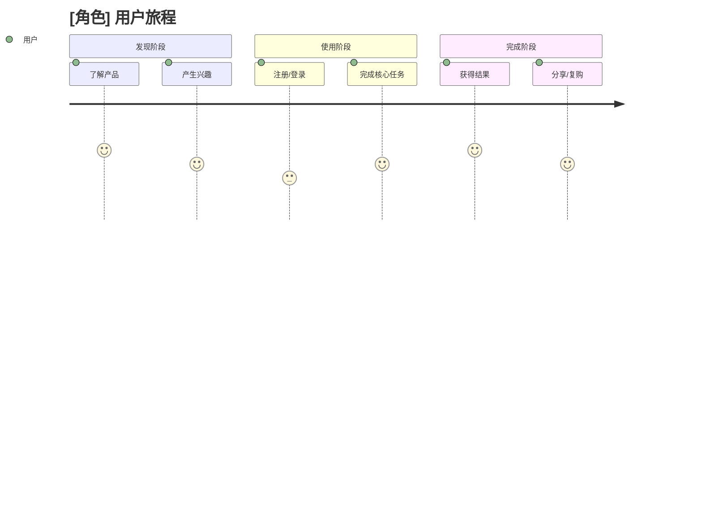
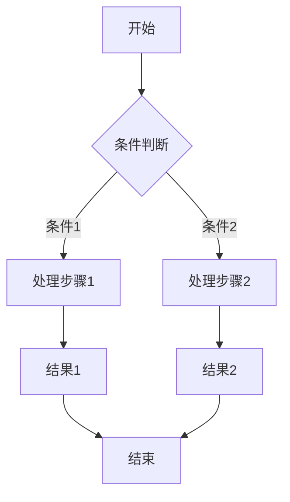
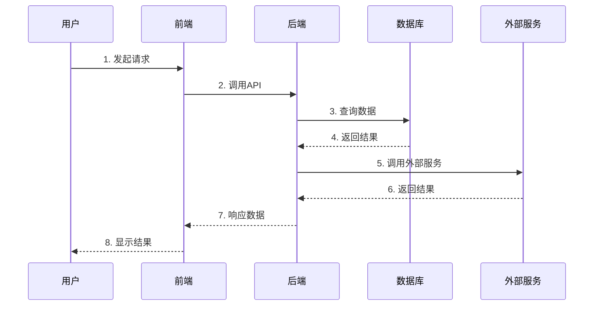
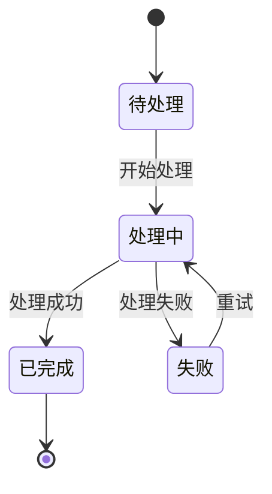
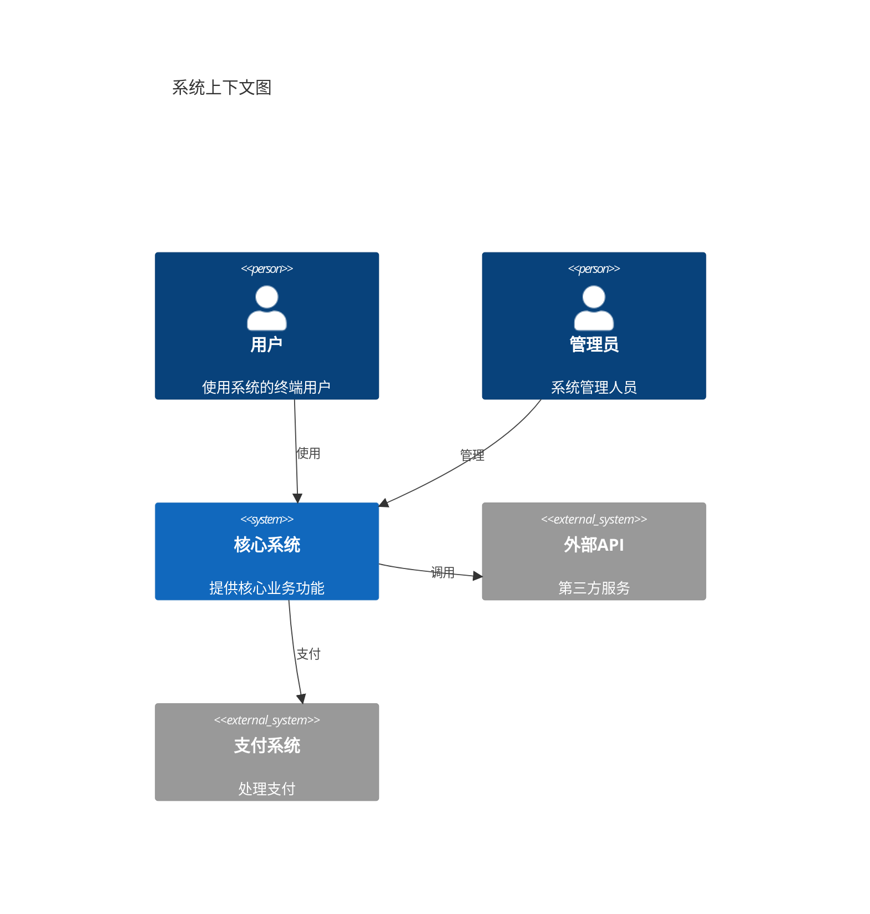
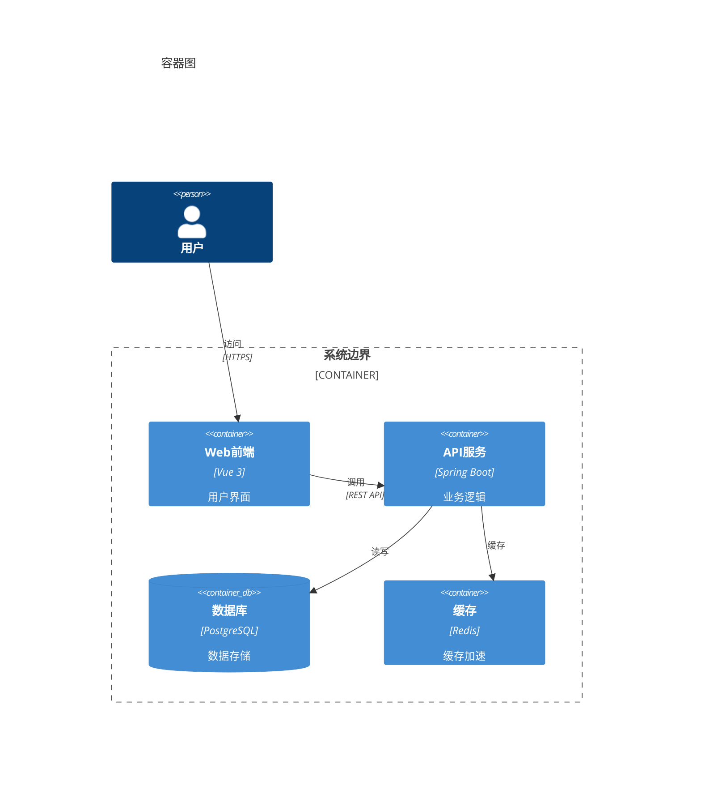
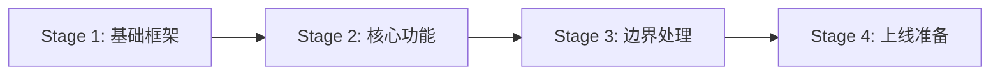

# [项目名称] 技术方案 v2.0 (AI 协作版)

| **版本** | v1.0 |
| -------- | ---- |
| **作者** | XXXX |
| **日期** | XXXX-XX-XX |

**修订记录**

| 版本 | 修订内容 | 日期 | 编制人 |
|------|----------|------|--------|
| v1.0 | 初版 | XXXX-XX-XX | XXXX |

---

> **模板说明**
>
> 本模板专为 **AI 编程时代** 设计，适用于超级个体（一人兼顾产品、设计、全栈开发、运维）的开发模式。
>
> **核心理念**：
> - **用户视角前置** - 从用户故事开始，而非功能模块
> - **AI 可执行性** - 每个章节都包含 AI 可直接使用的约束和命令
> - **迭代式详细设计** - 详细设计在实现后补充，而非前置
> - **验证点驱动** - 以可执行验证命令替代工作量估算
>
> **与传统模板的区别**：
> | 维度 | 传统模板 | AI 协作版 |
> |------|---------|-----------|
> | 章节数量 | 11 章 | 9 章 |
> | 设计时机 | 前置详细设计 | 迭代式补充 |
> | 验收定义 | 表格描述 | Gherkin 可执行格式 |
> | 工作量 | 人天估算 | 验证点进度 |

---

## 目录

1. [执行摘要](#一执行摘要)
2. [用户故事与验收标准](#二用户故事与验收标准)
3. [用户旅程与操作流程](#三用户旅程与操作流程)
4. [业务流程设计](#四业务流程设计)
5. [架构设计](#五架构设计)
6. [AI 执行上下文](#六ai-执行上下文)
7. [分阶段验证计划](#七分阶段验证计划)
8. [测试规格](#八测试规格)
9. [可观测性与运维](#九可观测性与运维)
10. [附录：详细设计](#附录详细设计实现后补充)

---

# 一、执行摘要

> **一句话说清楚项目要解决什么问题，怎么解决，预期成果是什么。**

## 1.1 问题陈述

> 用一句话描述当前的核心痛点。

【示例】：目前 XXX 流程完全依赖人工处理，效率低且容易出错。

## 1.2 解决方案

> 用一句话描述核心解决思路。

【示例】：构建自动化系统，实现 XXX 自动化处理，减少 90% 人工操作。

## 1.3 预期成果

| 指标 | 当前值 | 目标值 | 验证方式 |
|------|--------|--------|----------|
| 处理效率 | 10 分钟/件 | < 1 分钟/件 | 计时测试 |
| 错误率 | 5% | < 0.1% | 抽样检查 |
| 人工介入率 | 100% | < 10% | 统计报表 |

## 1.4 非目标（Scope Out）

> 明确本次迭代**不包含**的内容，避免范围蔓延。

- 本次不包含：XXX 功能
- 暂不支持：YYY 场景
- 后续版本再考虑：ZZZ 优化

---

# 二、用户故事与验收标准

> **从用户视角定义需求，而非从功能模块。每个 Story 必须有可执行的验收条件。**

## 2.1 用户角色定义

| 角色 | 描述 | 主要目标 |
|------|------|----------|
| 管理员 | 系统运营人员 | 高效管理、数据分析 |
| 普通用户 | 终端用户 | 完成核心任务 |
| ... | ... | ... |

## 2.2 用户故事卡片

### Epic 1: [业务域名称]

#### Story 1.1: [故事标题]

| 字段 | 内容 |
|------|------|
| **角色** | 作为一名 [角色] |
| **目标** | 我希望能够 [目标] |
| **价值** | 以便于 [价值] |
| **优先级** | P0 / P1 / P2 |

**验收标准 (Gherkin 格式)**：

```gherkin
Feature: [功能名称]
  作为一名 [角色]
  我希望能够 [目标]
  以便于 [价值]

  Scenario: 正常场景
    Given [前置条件]
    When [操作步骤]
    Then [预期结果]

  Scenario: 异常场景
    Given [前置条件]
    When [异常操作]
    Then [错误提示]
```

**任务拆分 (Tasks)**：

- [ ] Task 1.1.1: [具体任务]
- [ ] Task 1.1.2: [具体任务]
- [ ] Task 1.1.3: [具体任务]

---

#### Story 1.2: [故事标题]

（同上格式）

---

### Epic 2: [业务域名称]

（同上格式，按需添加更多 Epic）

---

## 2.3 验收标准汇总

| Story ID | 功能点 | 验收命令 | 预期结果 |
|----------|--------|----------|----------|
| S1.1 | 创建资源 | `curl -X POST /api/xxx` | HTTP 201 |
| S1.2 | 查询列表 | `curl /api/xxx?page=1` | 返回分页数据 |
| ... | ... | ... | ... |

---

# 三、用户旅程与操作流程

> **从用户视角描述完整的操作流程，包含各阶段的触点、情绪和痛点。**

## 3.1 用户旅程地图

### [角色1] 用户旅程



**旅程详情**：

| 阶段 | 触点 | 用户行为 | 情绪 | 痛点/机会 |
|------|------|----------|------|-----------|
| 发现 | H5 页面 | 浏览信息 | 期待 | 信息不够清晰 |
| 使用 | 操作界面 | 提交表单 | 紧张 | 流程复杂 |
| 完成 | 结果页面 | 查看结果 | 满足 | 等待时间长 |

## 3.2 核心操作流程

### 流程 1: [流程名称]

**前置条件**：用户已登录

**操作步骤**：

1. 进入 [页面名称]
2. 点击 [按钮名称]
3. 填写 [表单字段]
4. 确认提交
5. 查看结果

**后置状态**：数据已保存，状态已更新

## 3.3 异常流程处理

| 异常场景 | 触发条件 | 用户提示 | 恢复方式 |
|----------|----------|----------|----------|
| 网络超时 | 请求 > 30s | "网络不稳定，请重试" | 重试按钮 |
| 数据验证失败 | 格式错误 | 具体错误提示 | 高亮错误字段 |
| 服务不可用 | 依赖服务异常 | "系统繁忙，请稍后" | 自动重试 |

---

# 四、业务流程设计

> **用可视化图表描述业务流程、系统交互和状态变化。**

## 4.1 核心业务流程图



## 4.2 系统交互时序图



## 4.3 状态机



**状态说明**：

| 状态 | 描述 | 可执行操作 |
|------|------|-----------|
| 待处理 | 初始状态 | 开始处理 |
| 处理中 | 正在处理 | 无 |
| 已完成 | 处理成功 | 归档 |
| 失败 | 处理失败 | 重试 |

---

# 五、架构设计

> **使用 C4 模型分层描述系统架构。**

## 5.1 Level 1: 系统上下文图



## 5.2 Level 2: 容器图



## 5.3 技术选型与决策 (ADR)

### ADR-001: [决策标题]

**背景**：描述做出决策的背景

**考虑的方案**：

| 方案 | 优点 | 缺点 |
|------|------|------|
| 方案A | ... | ... |
| 方案B | ... | ... |

**决策**：选择方案 X

**理由**：
- 理由1
- 理由2

## 5.4 核心模块设计

| 模块 | 职责 | 主要类/文件 |
|------|------|------------|
| Controller | 路由、参数校验 | `XxxController.java` |
| Service | 业务逻辑 | `XxxService.java` |
| Repository | 数据访问 | `XxxRepository.java` |

---

# 六、AI 执行上下文

> **这是 AI 协作版模板的核心章节，提供 AI 助手执行任务所需的所有上下文信息。**

## 6.1 项目入口与参考文件

| 类型 | 路径 | 说明 |
|------|------|------|
| 项目入口 | `src/main/java/.../Application.java` | Spring Boot 启动类 |
| API 示例 | `src/.../controller/XxxController.java` | 参考现有接口风格 |
| Service 示例 | `src/.../service/XxxService.java` | 参考业务逻辑写法 |
| 测试示例 | `src/test/.../XxxServiceTest.java` | 参考测试模式 |
| 配置文件 | `src/main/resources/application.yml` | 配置项说明 |

## 6.2 代码约束与禁止事项

### 必须遵守

- [ ] 每个新方法必须有对应的单元测试
- [ ] 使用项目统一的响应格式（`Result<T>`）
- [ ] 遵循现有的命名规范
- [ ] 提交前运行 `./gradlew check`

### 禁止事项

- [ ] 不要在 Controller 层写业务逻辑，必须调用 Service
- [ ] 不要直接使用 `System.out.println`，使用 Logger
- [ ] 不要硬编码配置值，使用配置文件
- [ ] 不要忽略错误处理
- [ ] 不要引入未经评审的新依赖

## 6.3 验证命令

```bash
# 编译检查
./gradlew compileJava

# 运行单元测试
./gradlew test

# 运行集成测试
./gradlew integrationTest

# 代码风格检查
./gradlew checkstyleMain

# 完整检查
./gradlew check

# 启动服务
./gradlew bootRun

# 构建部署包
./gradlew bootJar
```

## 6.4 依赖与环境

**必需环境**：

| 依赖 | 版本 | 安装命令 |
|------|------|----------|
| Java | 17+ | `brew install openjdk@17` |
| PostgreSQL | 15+ | `brew install postgresql@15` |
| Redis | 7.x | `brew install redis` |

**环境变量**：

```bash
export DATABASE_URL=jdbc:postgresql://localhost:5432/mydb
export REDIS_HOST=localhost
export REDIS_PORT=6379
```

---

# 七、分阶段验证计划

> **将实现拆分为可独立验证的小阶段，每个阶段都有明确的验证命令。**

## Stage 1: [阶段名称]

**目标**：[具体可交付成果]

**范围**：
- [ ] 任务1
- [ ] 任务2
- [ ] 任务3

**验证命令**：
```bash
./gradlew test --tests "*Stage1*"
curl http://localhost:8080/api/health
```

**通过标准**：
- 所有测试通过
- API 返回 200

**依赖**：无

---

## Stage 2: [阶段名称]

（同上格式）

**依赖**：Stage 1

---

## Stage 3: [阶段名称]

（同上格式）

**依赖**：Stage 2

---

## 阶段依赖关系



---

# 八、测试规格

> **以测试用例形式定义验收标准，AI 可直接转化为测试代码。**

## 8.1 关键测试用例

| ID | 场景 | 输入 | 预期输出 | 优先级 |
|----|------|------|----------|--------|
| T1 | 正常创建 | `{name: "test"}` | `{id: 1, name: "test"}` | P0 |
| T2 | 参数缺失 | `{}` | `{code: 400, message: "name不能为空"}` | P0 |
| T3 | 重复创建 | 同名资源 | `{code: 409, message: "已存在"}` | P1 |

## 8.2 可执行验收用例

```gherkin
# 用例1：正常场景
Given 用户已登录
And 请求参数合法
When 调用 POST /api/xxx
Then 返回 { code: 200, data: { ... } }

# 用例2：参数校验失败
Given field1 为空
When 调用 POST /api/xxx
Then 返回 { code: 400, message: "field1 不能为空" }

# 用例3：边界条件
Given field2 = 100（最大值）
When 调用 POST /api/xxx
Then 返回 { code: 200 }
```

## 8.3 Mock 策略

| 外部依赖 | Mock 方式 | 说明 |
|----------|-----------|------|
| 第三方 API | WireMock | 模拟接口响应 |
| 数据库 | H2 内存数据库 | 隔离测试环境 |
| Redis | Embedded Redis | 测试用嵌入式 |

## 8.4 覆盖率目标

```
行覆盖率 (Lines): > 80%
分支覆盖率 (Branches): > 50%
函数覆盖率 (Functions): > 80%
```

---

# 九、可观测性与运维

## 9.1 日志规范

**日志级别使用规范**：

| 级别 | 使用场景 | 示例 |
|------|----------|------|
| ERROR | 影响功能的错误 | 数据库连接失败 |
| WARN | 潜在问题 | 重试成功 |
| INFO | 关键业务节点 | 订单创建成功 |
| DEBUG | 开发调试信息 | 请求参数详情 |

**日志格式**：

```json
{
  "timestamp": "2025-01-01T00:00:00.000Z",
  "level": "INFO",
  "trace_id": "abc123",
  "message": "操作描述",
  "extra": {}
}
```

## 9.2 监控告警

| 告警名称 | 触发条件 | 级别 | 通知渠道 |
|----------|----------|------|----------|
| 接口错误率 | > 1% 持续 5min | P1 | 电话+消息 |
| 响应超时 | P99 > 2s 持续 5min | P2 | 消息 |
| 服务不可用 | 健康检查失败 3 次 | P0 | 电话 |

## 9.3 上线方案

### 灰度策略

| 阶段 | 流量比例 | 观察时间 | 通过标准 |
|------|----------|----------|----------|
| 阶段1 | 1% | 30min | 错误率 < 0.1% |
| 阶段2 | 10% | 1h | 同上 |
| 阶段3 | 50% | 2h | 同上 |
| 全量 | 100% | - | 同上 |

### 回滚方案

**触发条件**：
- 错误率 > 1%
- P99 响应时间 > 2s
- 核心业务指标异常

**回滚步骤**：
1. 切换流量到旧版本
2. 回滚数据库变更（如有）
3. 回滚配置变更
4. 验证回滚效果

---

# 附录：详细设计（实现后补充）

> **这部分内容在实现过程中逐步补充，而非前置设计。**

## A.1 数据库设计

> 实现后补充：ER 图、DDL、索引设计

## A.2 接口文档

> 实现后补充：Swagger/OpenAPI 自动生成

## A.3 部署架构

> 实现后补充：基于实际部署经验

---

# AI 协作检查清单

## 实现前检查

- [ ] 已读取相关的现有代码
- [ ] 已理解项目的代码规范
- [ ] 已明确验收标准
- [ ] 已确认接口契约

## 实现中检查

- [ ] 每个函数有对应的测试
- [ ] 遵循现有代码风格
- [ ] 没有引入新的依赖（除非必要）
- [ ] 错误处理完善

## 实现后检查

- [ ] 所有测试通过
- [ ] lint 无报错
- [ ] 代码已格式化
- [ ] 提交信息清晰

## 卡住超过 3 次时

- [ ] 记录失败原因
- [ ] 尝试替代方案
- [ ] 必要时简化需求

---

**模板结束**
